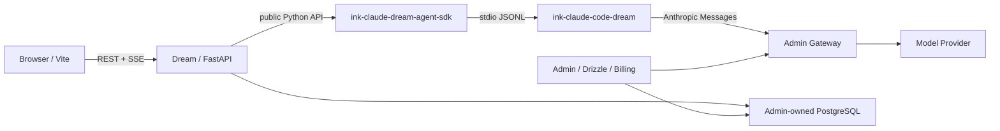

<!-- [Input] Current Dream/Admin/Gateway topology, repository contracts, and the released Claude SDK/Runtime pair. -->
<!-- [Output] Explain what Ink & Memory is, how to install and run it, how versions are paired, and which operational boundaries must be respected. -->
<!-- [Pos] Canonical English repository entry guide; README.zh.md must remain a faithful Chinese mirror. -->
<!-- [Sync] 2026-08-28: replace stale branch/setup notes with the current develop workflow, exact SDK/Runtime pairing, local Runtime installation, troubleshooting, and operator notices. -->
<!-- [Sync] 2026-08-28: document pinned ntn installation plus actor-scoped credentials/current snapshots in agentdata, policy-driven background refresh, and per-Thread projection. -->
<!-- [Sync] 2026-08-29: document current-selection filtering, minimal thread metadata, empty-scope revocation, and reauthorization LKG behavior. -->
<!-- [Sync] 2026-08-29: document the Settings Notion capability/Skill inspection surface and truthful Hosted MCP read/write boundary. -->
<!-- [Sync] 2026-08-30: document actor/thread-bound Notion CLI environment injection and the pre-auth ntn installation check. -->
<!-- [Sync] 2026-08-30: document deployment-owned Claude Bash sandbox enablement and the explicit AutoDL disabled profile. -->
<!-- [Sync] 2026-08-30: adopt the publicly released clean-room Runtime 0.1.4 across install, verification, registry acceptance, and troubleshooting. -->
<!-- [Sync] 2026-08-31: require AutoDL releases to verify backend-generated crawler files and reject Vite SPA HTML fallback. -->

# Ink & Memory

<p align="center">
  
</p>

<p align="center">
  English · <a href="README.zh.md">中文</a>
</p>

Ink & Memory is a creative workspace for writing, Chat, Dream workflows, and versioned Decks. It combines a React/Vite frontend, a FastAPI backend, an Admin-owned PostgreSQL schema, an Admin Gateway for model access and billing, and a separately released Claude Agent SDK and Claude Runtime.

This repository contains the Dream application. It does not own the shared database schema, model-provider credentials, billing, or the internal implementation of the Claude SDK/Runtime.

## What you can do

- **Writing** — write and save sessions, browse the timeline, and review reflections.
- **Chat** — talk with a Deck Agent in a persistent Thread with streaming, tools, resume, plans, and TODOs.
- **Dream** — launch a Dream Run and review scripts, storyboards, prompts, and generated artifacts.
- **Decks** — create and version Decks, Agents, prompts, resources, and Claude Plugin references.
- **Workspace and tools** — use thread-owned files, sandboxed tools, MCP servers, Skills, and plugins.
- **Notion resources** — connect in Settings, select the exact allowed scope, inspect the installed `notion-session` and `notion-cli` packages, and keep lightweight indexes refreshed outside Chat. Dream checks that pinned `ntn` is installed before authentication and injects the current actor/thread projection as `NOTION_HOME`, `NOTION_API_TOKEN`, `NOTION_KEYRING`, and `NOTION_WORKERS_CONFIG_FILE` into Agent Runtime Bash. Hosted Notion MCP remains separate from this CLI path.
- **Platform integration** — consume authenticated model aliases, subscription eligibility, usage, and billing from Admin/Gateway.

Deck marketplace distribution is intentionally deferred. See [docs/design/deck-register/README.md](docs/design/deck-register/README.md).

## System boundaries



| Repository/service | Owns | Must not own |
| --- | --- | --- |
| `ink-dream-memory` | Dream frontend/backend, Thread/Run/Workspace integration, SDK/Runtime selection | Shared schema migrations, Provider keys, a second Agent/Runtime protocol |
| `ink-admin-memory` | Drizzle schema, PostgreSQL, Admin, Gateway, model catalog, subscriptions, billing | Dream Thread/Run business logic |
| `ink-claude-dream-agent-sdk-python` | Python SDK distribution and public `claude_agent_sdk` API | Dream business DTOs or database access |
| `ink-claude-code-dream` | Clean-room CLI/Runtime, protocol, tools, MCP, multi-platform npm packages | Dream/Admin business state machines or user data |

## Supported version contract

Dream treats the Python SDK and npm Runtime as one compatibility pair even though they are published through different package ecosystems.

| Component | Required version |
| --- | --- |
| Dream branch | `develop` |
| Python | `>=3.12` |
| Node.js | `>=22 <25` for the Runtime selector |
| Python SDK | `ink-claude-dream-agent-sdk==0.2.144` |
| npm Runtime | `@glide-the/ink-claude-code-dream@0.1.4` |
| Runtime CLI compatibility output | `2.1.241 (Claude Code)` |
| Notion CLI | `ntn@0.15.1` |

Important: `uv sync` manages the Python environment only. It installs the Python SDK but does **not** install or upgrade the npm Runtime. A source checkout that expects Runtime `0.1.4` will reject a `0.1.3` executable even when all capability flags are otherwise valid.

## Requirements

- Git
- Python 3.12+
- [uv](https://docs.astral.sh/uv/)
- Node.js 22–24 with npm
- pnpm 9+
- A sibling checkout of [Ink Admin Memory](https://github.com/glide-the/ink-admin-memory)
- Docker only when using the Docker/Remote SSH deployment paths

The currently released Runtime supports Darwin/Linux on arm64/x64. Windows and musl targets fail closed.

## Local setup

### 1. Check out the current development branch

```bash
git clone https://github.com/glide-the/im.git ink-dream-memory
cd ink-dream-memory
git switch develop
git pull --ff-only origin develop
```

Admin is expected at `../ink-admin-memory` unless an explicit absolute path is configured.

### 2. Prepare Admin, PostgreSQL, and Gateway

```bash
test -d ../ink-admin-memory || git clone https://github.com/glide-the/ink-admin-memory.git ../ink-admin-memory
cd ../ink-admin-memory
pnpm install
pnpm env:setup
pnpm env:check
pnpm db:migrate
pnpm db:migrate:check
```

Admin owns all shared PostgreSQL migrations. Dream must never create missing shared tables or use a runtime SQLite fallback.

Start Admin/Gateway in terminal A:

```bash
cd ../ink-admin-memory
pnpm dev
```

For an initial local installation, provision the default subscription and Dream service identities from the Admin repository:

```bash
cd ../ink-admin-memory
pnpm db:data:subscriptions -- --apply
pnpm product:provision-local-dream
pnpm gateway:provision-local-dream
```

These commands are local-identity operations. Read the Admin repository instructions before using them against any non-local database.

### 3. Sync the Dream Python environment

From this repository:

```bash
cd backend
uv sync
```

`uv sync` creates/updates `backend/.venv` and makes it match `backend/pyproject.toml` and `backend/uv.lock`. It may remove undeclared packages. In particular, it does not preserve an ad-hoc pytest installation and it does not manage the npm Runtime.

Run backend tests without adding pytest permanently to the production environment:

```bash
cd backend
uv run --with pytest==9.1.1 pytest -q
```

### 4. Install the exact Claude Runtime and Notion CLI

Install the public selector package separately because it is an npm/native artifact:

```bash
npm install --global @glide-the/ink-claude-code-dream@0.1.4
export PATH="$(npm prefix --global)/bin:$PATH"
command -v ink-claude-code-dream
ink-claude-code-dream --version
```

The version command must print:

```text
2.1.241 (Claude Code)
```

Then verify the Runtime manifest through Dream's actual resolver:

```bash
cd backend
.venv/bin/python -c 'from libs.claude_agent_kit.server.sdk_env import resolve_claude_cli_path; print(resolve_claude_cli_path())'
```

This command must exit 0 and print the resolved `0.1.4` executable path. If `command -v` still points to an older `~/.local/bin/ink-claude-code-dream`, reorder `PATH` or replace that stale installation before starting Dream. A running process keeps the `PATH` it inherited; restart only the process you own after changing it.

Do not use `CLAUDE_CODE_CLI_PATH` to bypass the normal manifest-qualified Runtime path. That variable is reserved for an explicit, reviewed absolute-path rollback.

Install the Notion CLI used by Dream's backend-owned connector path:

```bash
npm install --global ntn@0.15.1
ntn --version
ntn login --help
ntn doctor --help
```

`ntn --version` must print `ntn 0.15.1`. Docker and AutoDL releases install and verify the same version automatically. Users authorize through Dream's Settings UI; do not run `ntn login` in the service account's default home as application setup.

### 5. Configure Dream

Create the private Dream environment file if needed:

```bash
test -f backend/.env || cp backend/.env.example backend/.env
```

Recommended local database/Gateway ownership:

```dotenv
DATABASE_URL=
INK_LOAD_DATABASE_URL_FROM_ENV_FILE=1
INK_DATABASE_ENV_FILE=/absolute/path/to/ink-admin-memory/.env.local

INK_GATEWAY_ENABLED=1
INK_GATEWAY_BASE_URL=http://127.0.0.1:3000

AGENT_CWD=/absolute/path/to/agentdata/agent-workspace
INK_AGENT_SANDBOX_ENABLED=true
INK_NOTION_RUNTIME_ROOT=/absolute/path/to/agentdata/notion-runtime
INK_NOTION_MAX_SNAPSHOT_BYTES=134217728
INK_NOTION_SYNC_SCHEDULER_INTERVAL_SECONDS=60
```

Admin provisioning writes the remaining local service identity and model aliases to gitignored environment files. Do not copy Provider keys into Dream and never expose service credentials to the browser.

`INK_NOTION_RUNTIME_ROOT` must be an absolute server-owned path in the same persistent agentdata area as `AGENT_CWD`. Dream stores each user's opaque credential source under `users/<actor-hash>/home` and each connector's latest successful lightweight index under `users/<actor-hash>/snapshots/<connector-id>/current.json`. Saving a resource selection performs the first index sync immediately; the connector's server-owned strategy then refreshes due indexes in the background, without requiring a Chat or workspace initialization. These snapshots contain selected IDs and compact metadata only, never page Markdown, blocks, or attachments.

For a Chat turn with the trusted thread workspace enabled, Runtime initialization copies the current user's effective credential and latest successful index into `{AGENT_CWD}/{thread_id}/.notion-home` and `.notion`; before projection, the index is intersected with the user's current selected scope and connector metadata is minimized. `sdk_env.py` then binds that exact thread projection to Agent Runtime Bash through `NOTION_HOME`, `NOTION_API_TOKEN`, `NOTION_KEYRING`, and `NOTION_WORKERS_CONFIG_FILE`; ambient values are cleared and cannot select another user or home. Projection does not call Notion or run an index sync. Clearing or shrinking the selected scope therefore takes effect for the next turn even when a newer index refresh fails. The existing indexed-page Read hook remains available alongside direct `ntn` CLI use. Workspace Mode disabled keeps both projections and the four runtime variables unavailable.

### 6. Start Dream

Terminal B — backend:

```bash
cd backend
.venv/bin/python server.py
```

Terminal C — frontend:

```bash
cd frontend
npm install
npm run dev
```

Open:

- Dream: <http://127.0.0.1:5173>
- Dream API: <http://127.0.0.1:8765>
- Admin: <http://127.0.0.1:3000/admin>

## Main application routes

| Route | Purpose |
| --- | --- |
| `/story-workspace/chat` | New and existing Agent Threads |
| `/story-workspace/dream` | Dream Runs and the creative workbench |
| `/story-workspace/decks` | Enabled and published Decks |
| `/story-workspace/settings/work` | Deck, resource, and plugin management |
| `/story-workspace/settings` | Account, subscription, model, and application settings |

## Validation

```bash
# Backend
cd backend
uv run --with pytest==9.1.1 pytest -q

# Frontend
cd frontend
npm run lint
npm run build

# Published SDK/Runtime registry acceptance; provider-free and no model call
cd ..
python3 scripts/verify_claude_registry_release.py \
  --sdk-version 0.2.144 \
  --runtime-version 0.1.4 \
  --expected-cli-version '2.1.241 (Claude Code)'
```

Real-business tests must use the normal Dream/Admin/Gateway/PostgreSQL path and a named existing account. Provider-free fixtures must not be reported as real-business validation.

## Operational and security notices

1. **Two package managers, one compatibility contract.** `uv` owns Python packages; npm owns the native Runtime. Version changes must update both sides and their acceptance evidence in one change.
2. **Fail closed.** Missing schema capabilities, SDK/Runtime version mismatches, invalid manifests, missing model aliases, and unavailable credentials must fail instead of silently selecting an ambient CLI or fake data.
3. **Admin owns the schema.** Add shared PostgreSQL schema changes only through Admin Drizzle migrations and capability publication.
4. **No secret commits.** Never commit database passwords, Gateway service keys, Provider keys, OAuth secrets, npm tokens, transcripts, or user Workspace content.
5. **Thread-local Runtime files.** Claude temporary files belong under the validated Thread workspace `.claude-tmp`; do not widen access to `/tmp` or the user's real Claude home.
6. **No service-wide cleanup.** Tests may stop only processes and temporary resources created by that test run.
7. **Published versions are immutable.** Fix a bad Runtime with a forward release or an explicit reviewed rollback; do not overwrite or unpublish an accepted version as normal rollback.
8. **Model output capability is server-owned.** Admin's selected model `maxOutputTokens` is projected to the Runtime; browser settings, user env, workspace files, and Gateway body rewriting must not replace it.
9. **Notion Runtime binding is actor/thread-owned.** Canonical durable state belongs under server agentdata; policy-driven index refresh is independent of Chat, and every Runtime turn receives only the current actor's current-scope per-Thread projection. Dream replaces ambient `NOTION_*` values with that projection before exposing the four supported variables to Agent Bash.
10. **Editor writes bind actor, live session, and durable state.** The runner rejects writes for a stale session, the Editor MCP child receives only the server-owned actor and effective PostgreSQL capability, every query/update is actor-scoped, and business failures refresh the single in-memory EditorState cache without publishing a success event. Notion indexes and on-demand page bodies never enter EditorState.
11. **Claude Bash sandbox enablement is deployment-owned.** `INK_AGENT_SANDBOX_ENABLED` defaults to `true`, and invalid values also keep it enabled. Setting it to `false` preserves Workspace Mode, cwd, context, file tools, hooks, and tool confirmations, but approved Bash commands run directly as the Dream service account without bubblewrap filesystem/network isolation. User Settings and user env cannot override this capability. AutoDL projects `false` because its outer container rejects the required namespace creation; Dream currently runs as `root` there, so an approved Bash command has root authority inside that outer container.
12. **AutoDL crawler files are a release gate.** Vite Preview must proxy `/robots.txt`, `/sitemap.xml`, and `/llms.txt` to FastAPI. Every AutoDL start, deploy, verify, and rollback checks the public MIME type, required marker, and absence of SPA HTML; HTTP 200 alone is not acceptance.

## Troubleshooting

### `Dream Claude Runtime is not production-qualified`

Check both the executable and its release manifest:

```bash
command -v ink-claude-code-dream
readlink "$(command -v ink-claude-code-dream)"
ink-claude-code-dream --version
```

For the current `develop` branch, the manifest must contain Runtime `0.1.4`. Capability flags may all be `true` while the request still fails because the actual Runtime version is stale.

### `uv sync` removed pytest

`uv sync` removes packages that are not part of the locked production environment. Use the documented `uv run --with pytest==9.1.1 pytest ...` command or add an explicitly reviewed development dependency group; do not assume ad-hoc packages survive sync.

### PostgreSQL or schema capability unavailable

Start the Admin supervisor, verify `../ink-admin-memory/.env.local`, and run Admin's migration checks. Do not create tables from Dream.

### No callable model

Configure an enabled, priced model alias and Provider credential in Admin, then run the local Gateway provisioning command. Dream accepts platform aliases, not browser-supplied Provider IDs or keys.

### A configured model still sends `max_tokens: 32000`

First confirm the running Runtime version and inspect the Admin catalog's `maxOutputTokens`. An opaque Gateway alias cannot be safely classified from its name, so Dream must project the authenticated catalog value as `INK_CLAUDE_CODE_MODEL_MAX_OUTPUT_TOKENS`. The CLI uses that value as the model default/upper limit and keeps `CLAUDE_CODE_MAX_OUTPUT_TOKENS` only as a bounded standalone override. If the catalog value is absent, unknown aliases intentionally retain the upstream-compatible 32,000/64,000 fallback; do not fix this by hard-coding a model ID or rewriting the Gateway request body.

## Documentation and contribution rules

- Repository maintenance rules: [Agent.md](Agent.md)
- Agent feature interaction guide: [docs/Agent.md](docs/Agent.md)
- Architecture overview: [docs/architecture/项目架构设计说明.md](docs/architecture/项目架构设计说明.md)
- SDK/Runtime packaging and integration: [docs/deploy/claude-sdk-runtime-packaging-and-integration.md](docs/deploy/claude-sdk-runtime-packaging-and-integration.md)
- Registry acceptance: [docs/deploy/claude-registry-release-acceptance.md](docs/deploy/claude-registry-release-acceptance.md)
- Story Workspace design: [docs/design/story-workspace/](docs/design/story-workspace/)

Create feature branches from the latest `develop`, preserve unrelated worktree changes, update affected file headers and `.folder.md` contracts, and report exact validation commands and exit codes.
