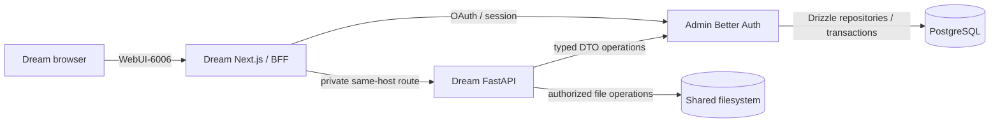

<!-- [Input] Current Dream/Admin architecture, AutoDL direct-host release, and local development contracts. -->
<!-- [Output] User-first startup, usage, local setup, verification, and recovery entry guide. -->
<!-- [Pos] Canonical English repository README; README.zh.md is the faithful Chinese mirror. -->
<!-- [Sync] 2026-09-18: put AutoDL startup and product use first; move recovery details to a dedicated runbook. -->

# Ink & Memory Dream

<p align="center">
  
</p>

<p align="center">
  English · <a href="README.zh.md">中文</a>
</p>

Ink & Memory Dream is an AI writing workspace for long-running conversations, story development, reusable Decks and Agents, files, Notion, and MCP tools. This repository owns the Dream Web application and FastAPI business runtime.

## Start on AutoDL

1. Open the running AutoDL instance in the AutoDL console.
2. Click **WebUI-6006** to open Dream. You do not need an SSH tunnel.
3. Sign in from Dream's original login card. Password and Google sign-in are processed by Admin, then the browser returns to the Dream page you requested.
4. Open or create a Chat, choose a Deck/Agent, and send a message.

The public hostname changes when the AutoDL instance changes. Use the console's current **WebUI-6006** link instead of saving a hostname in source code or documentation. **WebUI-6008** opens the separate Admin console for operators.

| Entry | Internal listener | Purpose | Audience |
| --- | --- | --- | --- |
| **WebUI-6006** | Next.js `127.0.0.1:6006` | Dream UI, same-origin auth/BFF and API routes | Dream users |
| Dream backend | FastAPI `127.0.0.1:8765` | Agent Runtime, SSE, business orchestration and shared files | Private; accessed through Next.js |
| **WebUI-6008** | Admin `127.0.0.1:6008` | Authentication, database APIs, Gateway and administration | Admin operators |
| Embedded PostgreSQL | `54329` | Admin-owned authentication and business persistence | Private; Dream has no credential |

If a WebUI entry is unavailable after an instance restart, use the [AutoDL recovery runbook](docs/deploy/autodl-recovery.md). It covers status, logs, restart and full release without exposing secrets or deleting persistent data. The latest deployment evidence is in the [2026-09-18 release receipt](docs/exec/exec_autodl_release_20260918.md).

## Use Dream

- **Chat** keeps Thread history and streams Agent output. Resume, cancel and retry keep the same production path.
- **Dream and Story Workspace** develop stories, characters, scenes, scripts and generated artifacts.
- **Decks and Agents** package reusable instructions, tools, resources and Claude plugins.
- **Files** stay in the Thread workspace and use normalized paths, ownership checks and the shared filesystem boundary.
- **Resource Links** connect Notion and managed MCP Servers. Compatible MCP Apps can render below an ordinary tool result.


To use an MCP connection, open **Settings → Resource Links**, add or select a server, complete its authorization, then enable **Use App in Chat** under its usage policy. The ordinary tool result remains available when an App is disabled or unavailable. See the [MCP Apps design](docs/design/claude-mcp/mcp-apps-integration-strategy.md#32-端到端调用链).

## Authentication and data boundaries

Admin is the authentication center and the only production database access service. Dream calls named, versioned Admin operations through typed DTO clients. Admin Services and typed Drizzle Repositories own authorization, transactions, locks and persistence.

A Dream product user and an Admin operator are separate business identities. Signing in to Dream never grants Admin management permission. Google is an external identity source for Admin Better Auth; Google tokens and arbitrary user-ID headers are not accepted as Dream business credentials.

Dream still owns product routes, Agent Runtime, EventBus, SSE, turn/resume/cancel behavior and authorized shared-filesystem operations. It has no PostgreSQL password, SQL/ORM runtime path, migration, runtime DDL or database fallback. Admin Drizzle is the only schema and migration authority.



## Run locally

### Requirements

- Dream branch `develop`; Admin branch `main`
- Python `>=3.12` with `uv`
- Node.js `>=22 <25`, Corepack and `pnpm@10.28.1`
- Admin checked out beside Dream

```bash
git clone https://github.com/glide-the/im-dream.git ink-dream-memory
git clone https://github.com/glide-the/dream-im-platform.git ink-admin-memory
```

Prepare Admin, its embedded PostgreSQL, Gateway and service identities:

```bash
cd ink-admin-memory
pnpm install
pnpm env:setup
pnpm env:check
pnpm db:migrate
pnpm db:migrate:check
pnpm product:provision-local-dream
pnpm gateway:provision-local-dream
pnpm local:stable
```

Install Dream and the exact native Runtime:

```bash
cd ../ink-dream-memory/backend
uv sync --frozen
npm install --global @glide-the/ink-claude-code-dream@0.1.10
npm install --global ntn@0.15.1
ink-claude-code-dream --version
ntn --version

cd ../frontend
corepack enable
corepack pnpm install --frozen-lockfile
```

The Runtime must report `2.1.241 (Claude Code)`. `uv` manages the Python SDK; npm manages the native Runtime and Notion CLI; pnpm manages the Web workspace. `uv sync` does not install the Runtime.

Create `backend/.env` and `frontend/.env.local` from their examples. Configure the explicit Admin origin/issuer, Dream resource and the registered service/BFF identity. Dream env files must not contain `DATABASE_URL` or Provider secrets.

Start the owned services in separate terminals:

```bash
# Dream backend
cd ink-dream-memory/backend
uv run uvicorn server:app --host 127.0.0.1 --port 8765

# Dream frontend
cd ink-dream-memory/frontend
INK_BACKEND_INTERNAL_URL=http://127.0.0.1:8765 NEXT_PUBLIC_WS_BASE_URL=ws://127.0.0.1:8765 corepack pnpm run dev --hostname 127.0.0.1 --port 5173
```

Open Dream at <http://127.0.0.1:5173> and Admin at <http://127.0.0.1:3000/admin>.

## Supported versions and ownership

| Component | Current contract |
| --- | --- |
| Dream metadata | backend `0.1.4`, frontend `0.0.4`, API schema `2.0.0` |
| Next.js / React | `16.1.6` / `19.1.0` |
| Python SDK | `ink-claude-dream-agent-sdk==0.2.145` |
| Native Runtime | `@glide-the/ink-claude-code-dream@0.1.10` |
| Runtime compatibility | `2.1.241 (Claude Code)` |
| Notion CLI | `ntn@0.15.1` |
| Auth, PostgreSQL, Drizzle, Gateway, billing | Admin repository |
| Dream Web, Runtime, SSE, Threads/Runs and files | This repository |

## Build and verify

```bash
# Backend provider-free suite
PYTHONPATH=backend uv run --native-tls --project backend --frozen   --with pytest==9.1.1 --with pytest-asyncio   python -m pytest backend/tests -q

# Frontend checks
corepack pnpm --dir frontend exec tsc --noEmit --incremental false
corepack pnpm --dir frontend lint
NODE_ENV=production corepack pnpm --dir frontend build

# Published SDK/Runtime identity
python3 scripts/verify_claude_registry_release.py   --sdk-version 0.2.145   --runtime-version 0.1.10   --expected-cli-version '2.1.241 (Claude Code)'
```

Provider-free checks prove deterministic contracts. Real Google, model and business acceptance must use the normal Dream/Admin/Gateway/PostgreSQL services and a real authorized account.

## Troubleshooting

- **WebUI returns 404 or does not open:** confirm the AutoDL instance is running, then follow the [recovery runbook](docs/deploy/autodl-recovery.md). Do not add a tunnel or hard-code the current public hostname.
- **Unable to check your session:** verify both WebUI mappings, Admin first, and confirm the projected issuer, Dream origin/resource and callback all came from the current instance.
- **`ADMIN_SERVICE_AUTH_UNAVAILABLE` or `ADMIN_TIMEOUT`:** verify Admin and its PostgreSQL before restarting Dream. Dream must not fall back to a database connection.
- **Runtime is not production-qualified:** verify `command -v ink-claude-code-dream`, the package-root `cli.js`, adjacent manifest, Runtime `0.1.10`, compatibility `2.1.241`, and required capabilities.
- **`uv sync` removed pytest:** use the ephemeral `uv run --with pytest...` command above or add a reviewed development dependency.
- **Chat reports insufficient Token allowance:** the user message is saved before Gateway rejects the model reservation. Fix the subscription/model allowance in Admin, reload the Thread, then decide whether to send again.
- **MCP App does not appear:** check connection status, App advertisement, usage policy and Admin capability. The ordinary tool result is the expected fallback.

## Documentation

- [AutoDL deployment](deploy/autodl-ssh/README.md)
- [AutoDL recovery](docs/deploy/autodl-recovery.md)
- [Architecture](docs/architecture/项目架构设计说明.md)
- [Authentication and data contract](docs/architecture/admin-auth-data-interaction.md)
- [Repository rules](Agent.md)
- [Product Agent behavior](docs/Agent.md)
- [Rules index](docs/rules/README.md)
