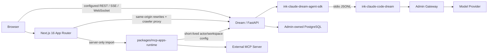

<!-- [Input] Current Dream/Admin/Gateway topology and source/configuration at commit 54f3bbe5. -->
<!-- [Output] Operator guide for ownership, exact dependencies, setup, Next runtime boundaries, validation, deployment gaps, and fail-closed operation. -->
<!-- [Pos] Canonical English repository entry guide; README.zh.md is the same-structure Chinese mirror. -->
<!-- [Sync] 2026-09-06: align the guide with the sole Next.js 16/pnpm workspace, app/_dream source owner, server-only MCP Apps Runtime, and production-off evidence boundary. -->
<!-- [Sync] 2026-09-06: document descriptor-owned MCP Apps result projection and data-only result fallback. -->

<!-- [Sync] 2026-09-06: allow explicit loopback MCP discovery while preserving every other non-global literal-IP, URL-shape, redirect, and Node host-allowlist boundary. -->

# Ink & Memory

<p align="center">
  
</p>

<p align="center">
  English · <a href="README.zh.md">中文</a>
</p>

Ink & Memory is a creative workspace for writing, persistent Agent Chat, Dream workflows, and versioned Decks. This repository owns the Dream application: a React 19 application hosted by a self-managed Next.js 16 Web process and a FastAPI backend.

The repository does not own the shared PostgreSQL schema, Provider credentials, billing, the public Claude Agent SDK implementation, or the native Claude Runtime implementation.

## Current status

| Surface | Status at the documented source baseline |
| --- | --- |
| Dream Web | `frontend/` is the only Node workspace, Web package, and Next project. Next `16.1.6` serves the existing Dream browser application through one App Router and a client-only compatibility shell. |
| Dream source | All browser application modules live under the private, non-route `frontend/app/_dream/` tree; the independent server-only Runtime remains under `frontend/packages/mcp-apps-runtime/src/`. There is no supported `frontend/src`, nested Next project, or Vite production source entry. |
| MCP Apps | Phase 0–3 have provider-free technical-preview evidence. The public health/status contract still returns `productionAppsEffective: false`; this code is not a production enablement. |
| MCP Apps real-business acceptance | Not established by the provider-free evidence. A real account, external App Server/OAuth, normal Admin/Gateway/PostgreSQL records, and production operations require a separate Apps Host acceptance run. Existing Claude Agent/managed MCP acceptance is a different path and does not satisfy this gate. |
| Deployment | The Next Dockerfile and local Next launcher exist. Several older CI/direct-host deployment adapters still reference removed npm/Vite owners and are not valid production evidence; see [Build and deployment](#build-and-deployment). |

The repository integration line is `develop`. This guide was reconciled against commit `54f3bbe5`; deploy an explicitly reviewed commit or tag, and do not infer release readiness from a branch name or an old task/progress receipt.

## What you can do

- **Writing** — save sessions, browse the timeline, and review reflections.
- **Chat** — work with a Deck Agent in a persistent Thread with streaming, tools, resume, plans, and TODOs.
- **Dream** — launch a Run and review scripts, storyboards, prompts, and generated artifacts.
- **Decks** — create and version Decks, Agents, prompts, resources, and Claude Plugin references.
- **Workspace and tools** — use Thread-owned files, sandboxed tools, managed MCP Servers, common Skills, and plugins.
- **Notion resources** — authorize an actor-scoped connector in Settings and project only that actor's current, selected scope into an eligible Thread Runtime.
- **Platform integration** — use Admin-owned model aliases, subscription eligibility, usage, and billing through the Gateway.

Deck marketplace distribution is intentionally deferred. See [docs/design/deck-register/README.md](docs/design/deck-register/README.md).

## Architecture and ownership



| Repository/service | Owns | Must not own |
| --- | --- | --- |
| `ink-dream-memory` | Dream Web/FastAPI, Thread/Run/Workspace integration, final SDK/Runtime selection | Shared schema migrations, Provider keys, billing, or a second Agent protocol |
| `ink-admin-memory` | Drizzle schema, PostgreSQL, Admin, Gateway, model catalog, subscriptions, billing | Dream Thread/Run business behavior |
| `ink-claude-dream-agent-sdk-python` | Python SDK distribution and public `claude_agent_sdk` API | Dream DTOs or database access |
| `ink-claude-code-dream` | Clean-room CLI/Runtime, protocol, tools, MCP, native npm packages | Dream/Admin business state or user data |

The shared PostgreSQL schema is changed only in Admin Drizzle. Dream depends on published capabilities and fails closed when a required capability is missing.

## Supported versions

| Component | Required version |
| --- | --- |
| Repository integration branch | `develop` |
| Audited source baseline | `54f3bbe5` |
| Python | `>=3.12` |
| Node.js | `>=22 <25`; deployment images use Node 22 |
| Frontend package manager | `pnpm@10.28.1` through Corepack |
| Next.js / React | `next@16.1.6`, `react@19.1.0`, `react-dom@19.1.0` |
| Python SDK | `ink-claude-dream-agent-sdk==0.2.144` |
| Native Runtime | `@glide-the/ink-claude-code-dream@0.1.4` |
| Runtime compatibility output | `2.1.241 (Claude Code)` |
| Notion CLI | `ntn@0.15.1` |

`uv` manages the Python environment. npm distributes the native Claude Runtime and Notion CLI. pnpm exclusively manages the `frontend/` workspace. `uv sync` does not install or upgrade the Runtime, and the frontend has no npm lock or supported npm install/build path.

The qualified Runtime supports Darwin/Linux on arm64/x64. Windows and musl targets fail closed.

## Installation

### 1. Check out an explicit revision

```bash
git clone https://github.com/glide-the/im-dream.git ink-dream-memory
cd ink-dream-memory
git fetch origin
git switch develop
git pull --ff-only origin develop
git rev-parse HEAD
```

Feature branches must start from the latest `develop`. For a release or acceptance run, record the exact resulting commit rather than assuming it still equals the audited baseline above.

### 2. Prepare Admin, PostgreSQL, and Gateway

```bash
test -d ../ink-admin-memory || git clone https://github.com/glide-the/ink-admin-memory.git ../ink-admin-memory
cd ../ink-admin-memory
pnpm install
pnpm env:setup
pnpm env:check
pnpm db:migrate
pnpm db:migrate:check
```

The current Chat history path requires Admin migration `0042_chat_history_keyset_pagination` and capability `dream.chat-history-keyset-pagination.v1`. Admin must report the migration state as current before Dream starts.

For an initial local installation, provision the default subscription and Dream service identities according to the Admin repository instructions:

```bash
pnpm db:data:subscriptions -- --apply
pnpm product:provision-local-dream
pnpm gateway:provision-local-dream
```

These commands mutate Admin-owned identities and data. Do not run them against a non-local database without the corresponding Admin review.

### 3. Install Dream's Python environment

```bash
cd ../ink-dream-memory/backend
uv sync --frozen
```

`uv sync` makes `backend/.venv` match `backend/pyproject.toml` and `backend/uv.lock`; it can remove undeclared packages.

### 4. Install the exact native Runtime and Notion CLI

```bash
npm install --global @glide-the/ink-claude-code-dream@0.1.4
export PATH="$(npm prefix --global)/bin:$PATH"
command -v ink-claude-code-dream
ink-claude-code-dream --version

npm install --global ntn@0.15.1
ntn --version
ntn login --help
ntn doctor --help
```

The Runtime command must print `2.1.241 (Claude Code)` and `ntn --version` must print `ntn 0.15.1`. Then exercise Dream's real manifest-qualified resolver:

```bash
.venv/bin/python -c 'from libs.claude_agent_kit.server.sdk_env import resolve_claude_cli_path; print(resolve_claude_cli_path())'
```

Do not use `CLAUDE_CODE_CLI_PATH` to disguise a stale normal installation. It is reserved for an explicitly reviewed absolute-path rollback.

### 5. Install the frontend workspace

```bash
cd ../frontend
corepack enable
corepack pnpm --version
corepack pnpm install --frozen-lockfile
```

The version command must print `10.28.1`. `frontend/pnpm-workspace.yaml` includes the root Web package and `packages/*`; `frontend/pnpm-lock.yaml` is their only dependency lock.

## Configuration and local run

Create the private backend environment file if needed:

```bash
cd ../backend
test -f .env || cp .env.example .env
```

The normal local ownership model loads the database identity from Admin and keeps Provider keys out of Dream:

```dotenv
DATABASE_URL=
INK_LOAD_DATABASE_URL_FROM_ENV_FILE=1
INK_DATABASE_ENV_FILE=/absolute/path/to/ink-admin-memory/.env.local

INK_GATEWAY_ENABLED=1
INK_GATEWAY_BASE_URL=http://127.0.0.1:3000

AGENT_CWD=/absolute/path/to/agentdata/agent-workspace
INK_AGENT_SANDBOX_ENABLED=true
INK_NOTION_RUNTIME_ROOT=/absolute/path/to/agentdata/notion-runtime
```

From three terminals initially opened at the Dream repository root, start Admin/Gateway in terminal A:

```bash
cd ../ink-admin-memory
pnpm dev
```

Start Dream's backend in terminal B:

```bash
cd backend
.venv/bin/python server.py
```

Start the Next development server in terminal C:

```bash
cd frontend
INK_BACKEND_INTERNAL_URL=http://127.0.0.1:8765 \
NEXT_PUBLIC_WS_BASE_URL=ws://127.0.0.1:8765 \
corepack pnpm run dev --hostname 127.0.0.1 --port 5173
```

`INK_BACKEND_INTERNAL_URL` drives Next-side API/auth/OAuth rewrites, crawler Route Handlers, and the Node-to-Python MCP Apps configuration call. Voice remains a browser WebSocket, so local development must also provide its backend base; Next does not own that WebSocket upgrade.

Container startup instead renders `public/runtime-config.js` from `API_BASE_URL` and `WS_BASE_URL` before starting standalone `server.js`. That startup file is the browser's primary runtime URL owner; optional `NEXT_PUBLIC_*` values are fallbacks, not a credential or policy channel.

Managed MCP discovery accepts explicit IPv4 loopback and IPv6 `::1` endpoints for Servers co-located with the Dream backend. Other non-global literal IPs, URL credentials/query/fragment, and upstream redirects remain denied; the MCP Apps Node Runtime host allowlist remains an independent execution boundary.

Open:

- Dream: <http://127.0.0.1:5173>
- Dream API: <http://127.0.0.1:8765>
- Admin: <http://127.0.0.1:3000/admin>

The repository-owned local launcher uses the same Next root and writes pid/log files for the processes it starts:

```bash
./deploy/local/deploy.sh --check
./deploy/local/deploy.sh build
./deploy/local/deploy.sh start
./deploy/local/deploy.sh verify
./deploy/local/deploy.sh stop
```

Two launcher gaps remain. It does not currently project a browser Voice WebSocket base, so a Voice-capable local run must use the explicit manual Next command above. Its `stop`/`clean` path trusts the saved PID and the configured rollback-container name without revalidating process start time, command, cwd, image, or an ownership label. Before stopping, confirm those identifiers still belong to the same launcher run; a stale PID file or reused container name can target an unrelated process/container.

## Frontend and Runtime boundaries

```text
frontend/
├── package.json, pnpm-workspace.yaml, pnpm-lock.yaml
├── next.config.js, tsconfig.json
├── app/                            # sole App Router
│   ├── layout.tsx                  # Server Component document/metadata owner
│   ├── client-shell.tsx            # sole ssr:false Dream client mount
│   ├── [[...path]]/page.tsx        # compatibility route
│   ├── api/                         # Node Route Handlers
│   └── _dream/                     # private, non-route Dream browser source
└── packages/mcp-apps-runtime/src/  # independent server-only Node Runtime
```

- `app/client-shell.tsx` is the browser boundary. It dynamically mounts `app/_dream/App.tsx` with SSR disabled because the existing application owns browser state, `localStorage`, DOM APIs, SSE, and WebSocket behavior.
- `app/_dream/**` owns browser UI, API clients, hooks, routing, and MCP Apps Host components. Browser code creates a standard MCP `Client` and same-origin `StreamableHTTPClientTransport`; it never imports the server-only Runtime package.
- `frontend/app/api/mcp-apps/[serverRef]/route.ts` is a thin Node GET/POST/DELETE adapter. It imports only the public entry of `@ink-dream/mcp-apps-runtime`.
- `phase1-status/route.ts` and `mcp-apps-sandbox/route.ts` are current exceptions: they import Browser-owned `host-policy` and compose preview policy in the Route layer. Their shared manifest/Host contract still needs extraction to a neutral shared/server owner; this gap does not make the independent Runtime package browser-safe.
- `packages/mcp-apps-runtime/src/index.ts` imports `server-only`. The package owns the process-scoped connector manager, upstream MCP sessions/catalogs, policy revalidation, and expiry. It must not import React, DOM, or root Web modules.
- Python remains the actor, workspace, credential, managed-MCP configuration, and business-data authority. Node receives a short-lived single-Server connection view; upstream URLs, headers, environment values, and credentials are never returned to the Browser.
- MCP Apps UI identity comes only from the fresh managed `tools/list` descriptor and its listed `ui://` resource. A successful `CallToolResult` may be data-only; Python projects the exact descriptor binding beside the complete ordinary result, and can recover a pre-fix user-scope history row only after the current actor-owned descriptor matches—without replaying the tool.
- `robots.txt`, `sitemap.xml`, and `llms.txt` are public Next Route Handlers, but their content remains Python-owned and is fetched at runtime. Missing or invalid backend configuration returns a typed `502/503`, never SPA HTML.
- Vite and `@vitejs/plugin-react` remain valid development dependencies for isolated browser fixtures that directly load production modules. They do not restore a Vite production entry, lock, build, or deployment path.

The MCP Apps preview is deny-by-default. Preview environment, plugin manifest, default/desired/effective policy, actor/workspace scope, allowlists, limits, and exact sandbox/parent origins must all agree. Even a technically effective preview does not change the immutable public `productionAppsEffective: false` receipt.

## Build and deployment

Build the current Web application only from the frontend workspace root:

```bash
corepack pnpm --dir frontend exec tsc --noEmit --incremental false
corepack pnpm --dir frontend lint
NODE_ENV=production corepack pnpm --dir frontend build
INK_NEXT_OUTPUT=standalone NODE_ENV=production corepack pnpm --dir frontend run build:docker
test -f frontend/.next/standalone/server.js
```

`build` runs `next build --webpack`. `build:docker` additionally enables conditional standalone output. The canonical container is `frontend/Dockerfile`: a frozen-pnpm Node 22 build followed by `node server.js` on port 80. It does not use Nginx or a Vite bundle.

Deployment truth at commit `54f3bbe5`:

| Path | Current truth |
| --- | --- |
| Local direct processes | `deploy/local/deploy.sh` builds and starts Next/pnpm; its Vite option accepts only a separately named immutable rollback image. The launcher does not yet set the Browser Voice WebSocket base and does not strongly revalidate PID/container ownership before stop/clean. |
| Local Docker Compose | `deploy/docker/deploy.sh` builds the current standalone Next Dockerfile. Its preflight still requires the historical Nginx template, while root Compose still passes the ignored `VITE_PUBLIC_SITE_URL` argument. |
| Remote SSH / Alibaba profile | Remote Compose builds the same Next image, but still passes the ignored Vite-named argument. Historical Vite memory evidence does not establish the current Next Node memory floor. |
| Google Cloud Run | **Blocked as a production path.** The build selects the Next Dockerfile, but public-metadata arguments are stale and target acceptance has not run. Adjacent SQLite synchronization scripts conflict with the Admin-owned PostgreSQL-only contract and are unsupported. |
| AutoDL direct host | Still requires removed `frontend/package-lock.json` and `vite.config.ts`, performs the retired npm/Vite build, checks `dist/index.html`, and starts Vite Preview. It currently fails source preflight and is not a valid Next deployment path. |
| GitHub frontend automation | Frontend CI/static deploy still assumes the removed npm lock and `dist/` artifact, and uses an older Node line. It is incompatible with the current pnpm/Next source until separately migrated. |

The legacy `frontend/nginx.conf.template` and test-owned Vite fixtures are retained only for historical/isolated use. A source-built Vite release is not supported. Rollback may select only a previously built, explicitly verified immutable image; it must not recreate removed Vite owners or a second package lock.

## Testing and acceptance

Provider-free checks do not require a model call or production account:

```bash
# Backend
PYTHONPATH=backend uv run --native-tls --project backend --frozen \
  --with pytest==9.1.1 --with pytest-asyncio \
  python -m pytest backend/tests -q

# Frontend source and Next build
corepack pnpm --dir frontend exec tsc --noEmit --incremental false
corepack pnpm --dir frontend lint
NODE_ENV=production corepack pnpm --dir frontend build

# MCP Apps server-only Runtime and integration boundary
corepack pnpm --dir frontend test:mcp-apps-runtime
corepack pnpm --dir frontend typecheck:mcp-apps
node --experimental-strip-types --experimental-transform-types --test \
  frontend/app/_dream/components/chat/mcp-apps/*.test.ts \
  frontend/app/_dream/components/chat/__tests__/chatUserMessageIngress.test.ts

# Focused Python Phase 1-3 policy contracts
PYTHONPATH=backend uv run --native-tls --project backend --frozen \
  --with pytest --with pytest-asyncio python -m pytest \
  backend/tests/mcp_apps_phase1 backend/tests/mcp_apps_phase2 backend/tests/mcp_apps_phase3 -q

# Published SDK/Runtime registry acceptance; provider-free
python3 scripts/verify_claude_registry_release.py \
  --sdk-version 0.2.144 \
  --runtime-version 0.1.4 \
  --expected-cli-version '2.1.241 (Claude Code)'
```

At the audited baseline, full TypeScript and Next builds exited `0`; lint exited `0` with 17 existing `react-hooks/exhaustive-deps` warnings. The server-only Runtime suite reported 36 passing tests. These are technical receipts, not claims about a public deployment.

Browser E2E must first reuse an installed compatible Chrome. Start a test-owned Next server, then run the focused root journey:

```bash
cd frontend
corepack pnpm exec playwright test e2e/root-next-shell.spec.ts --reporter=line --workers=1
```

Some focused browser tests intentionally create isolated Vite fixture servers. Treat a runner/browser launch failure as a harness precondition failure, not a page or API defect. Clean up only the named processes, ports, databases, and output created by that run.

Real-business validation is a separate lane: use the normal Dream/Admin/Gateway/current PostgreSQL path, the user-specified existing account and entities, and normal public entry points. The resulting Run, Thread, Gateway request, settlement, and failure records must remain visible in the normal Admin unless the user requests cleanup. Provider-free, isolated, or mocked evidence must never be reported as production acceptance.

## Security and operational constraints

1. **Fail closed.** Missing schema capabilities, SDK/Runtime mismatches, invalid manifests, stale revisions, unavailable credentials, and missing model aliases must fail rather than select ambient CLIs or fake data.
2. **Admin owns schema.** Dream must not add Alembic, runtime DDL, automatic shared-table creation, or a runtime SQLite fallback.
3. **Three package managers, distinct ownership.** `uv` owns Python, npm owns the native Runtime/Notion CLI, and pnpm owns the frontend workspace. Do not bridge these with install hooks or a second lock.
4. **No secrets in Git or Browser.** Database passwords, Gateway service keys, Provider keys, OAuth secrets, registry tokens, transcripts, user Workspace content, and upstream MCP connection material stay server-side.
5. **Thread-local Runtime files.** `CLAUDE_CODE_TMPDIR` is the validated `{AGENT_CWD}/{thread_id}/.claude-tmp`, mode `0700`, inside the real Thread workspace and never a symlink. Do not widen sandbox access to `/tmp` or a user Claude home.
6. **Server-owned model capabilities.** Global effort comes from the resource-policy LKG; context/compact/model max output comes from the final authenticated model. Browser, user env, Deck, Plugin, workspace, and Gateway body rewriting may not override them.
7. **Actor/thread-owned Notion projection.** Only the current actor's current selected scope may be copied into an eligible Thread. Ambient `NOTION_*` values are removed before the four supported variables are projected. Actor-bound CLI reads still obey normal confirmation/full-access/network policy; wrappers, shell composition, undeclared calls, and missing bindings fail closed.
8. **Editor writes bind live authority.** A write must match the actor, live session, and effective PostgreSQL capability. Business failures cannot publish success, and Notion indexes or on-demand page bodies must not enter EditorState.
9. **Sandbox enablement is deployment-owned.** `INK_AGENT_SANDBOX_ENABLED` defaults to enabled and invalid values stay enabled; user settings cannot override it. Disabling bubblewrap preserves tool confirmation but approved Bash runs directly as the Dream service account. The blocked AutoDL profile historically fixes this value to `false` while Dream runs as `root`; any migration must preserve and re-accept that visible risk.
10. **MCP Apps stays preview-only.** Browser and Node revisions, actor/workspace scope, expiry, manifest, policy, allowlists, origin isolation, and no-redirect rules all revalidate. Production effective remains false until a separate real production acceptance changes the contract.
11. **Crawler content remains Python-owned.** Releases and rollback images must verify media type and required body content for `robots.txt`, `sitemap.xml`, and `llms.txt`; HTTP 200 with Dream HTML is a failure.
12. **Production Skills belong in the backend build context.** Repository `.claude/skills/<id>` packages require exact backend common-catalog release mirrors. An unknown Runtime Skill is an explicit turn error, never an empty successful assistant response.
13. **Process ownership.** Tests and setup may stop or delete only resources they created. Changing `PATH` affects a running service only after that owned process is restarted.
14. **Immutable releases.** Repair a bad published Runtime or frontend image with a forward release or an explicitly reviewed rollback; do not overwrite accepted artifacts.

## Troubleshooting

### `Dream Claude Runtime is not production-qualified`

```bash
command -v ink-claude-code-dream
readlink "$(command -v ink-claude-code-dream)"
ink-claude-code-dream --version
cd backend
.venv/bin/python -c 'from libs.claude_agent_kit.server.sdk_env import resolve_claude_cli_path; print(resolve_claude_cli_path())'
```

The manifest-qualified Runtime must be `0.1.4` and its compatibility output must be `2.1.241 (Claude Code)`. Reorder `PATH` or replace the stale normal installation, then restart only the service you own.

### `uv sync` removed pytest

`uv sync` removes undeclared packages. Use the documented ephemeral `uv run --with pytest...` command or add a separately reviewed development dependency group.

### Frontend install or build looks for npm/Vite files

You are running a stale workflow or deployment adapter. The current workspace installs with frozen pnpm, builds `.next`, and starts Next. There is no `frontend/package-lock.json`, `vite.config.ts`, or production `dist/index.html` in the audited source.

### Next build fails while prerendering `_global-error`

Do not build with non-standard `NODE_ENV=development`. The audited production build command explicitly sets `NODE_ENV=production` and exits `0`.

### API routes fail, crawler files return `502/503`, or voice cannot connect

Check the separate owners: `INK_BACKEND_INTERNAL_URL`/`BACKEND_URL` for Next-to-Python rewrites and crawler proxying, browser `API_BASE_URL` for REST/SSE, and browser `WS_BASE_URL` for voice. A crawler failure is correctly returned as text `502/503`; it must not fall through to the Dream HTML shell.

### PostgreSQL capability or callable model is unavailable

Run Admin's migration check, verify the Admin-owned environment file, and configure an enabled, priced model alias plus Provider credential in Admin. Dream accepts platform aliases, not browser-supplied Provider IDs or keys.

## Documentation and contribution rules

- Repository maintenance rules: [Agent.md](Agent.md)
- Agent feature interaction guide: [docs/Agent.md](docs/Agent.md)
- Rules index: [docs/rules/README.md](docs/rules/README.md)
- Deployment entry matrix: [deploy/README.md](deploy/README.md)
- Architecture overview: [docs/architecture/项目架构设计说明.md](docs/architecture/项目架构设计说明.md)
- Frontend migration decision: [docs/design/claude-agent/dream-frontend-node-framework-migration-assessment.md](docs/design/claude-agent/dream-frontend-node-framework-migration-assessment.md)
- Current MCP Apps technical evidence: [docs/exec/mcp-apps/current-candidate-validation.md](docs/exec/mcp-apps/current-candidate-validation.md)
- SDK/Runtime packaging: [docs/deploy/claude-sdk-runtime-packaging-and-integration.md](docs/deploy/claude-sdk-runtime-packaging-and-integration.md)
- Registry acceptance: [docs/deploy/claude-registry-release-acceptance.md](docs/deploy/claude-registry-release-acceptance.md)

Preserve unrelated worktree changes, update affected file headers and `.folder.md` contracts, keep English/Chinese README structure and facts aligned, and report exact validation commands, exit codes, skipped lanes, and remaining production actions.
