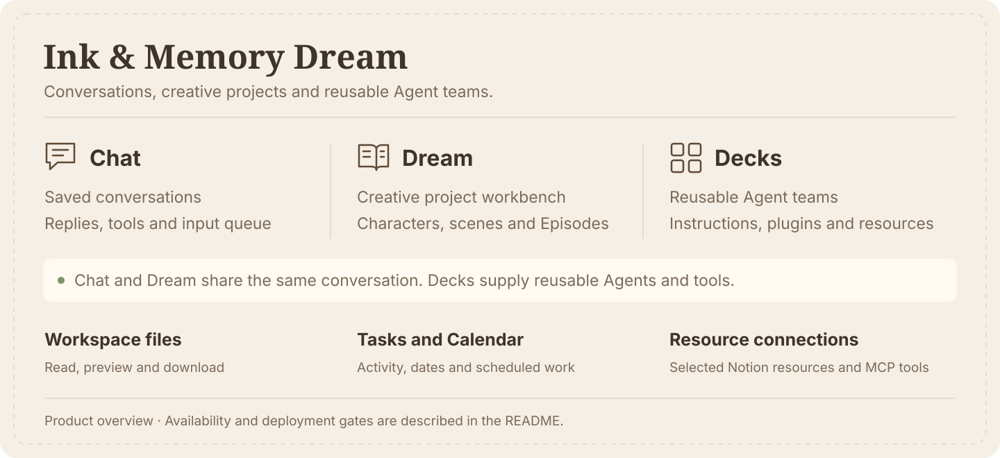
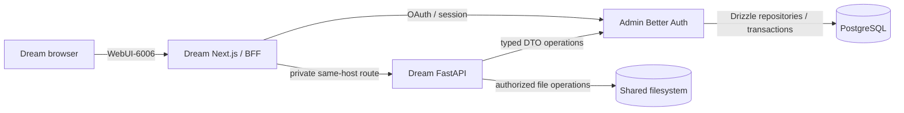

<!-- [Input] Current Story Workspace design, business PRDs, frontend navigation, manifests and environment templates. -->
<!-- [Output] Illustrated product guide, user workflows and operator setup with explicit feature gates. -->
<!-- [Pos] Canonical English README; README.zh.md mirrors its structure, commands and facts. -->
<!-- [Sync] 2026-10-09: align the introduction and illustrations with Chat, Dream and Decks; retain current setup and acceptance boundaries. -->

# Ink & Memory Dream

<p align="center">
  English · <a href="README.zh.md">中文</a>
</p>

**An AI workspace for conversations, creative projects and reusable Agent teams.** Start in Chat, develop a project in Dream, and keep instructions, tools and resources together in Decks. Saved conversations, workspace files and project outputs help you return to the work and continue.



*Product relationship diagram based on the [current navigation design](docs/design/story-workspace/product-scope-and-navigation.md). This is an explanatory illustration, not a live screenshot.*

## What you can do

| Area | What it helps you do | Design reference |
| --- | --- | --- |
| **Chat** | Choose a model and Agent, attach files, follow streamed replies and tool feedback, search history and navigate earlier turns. While an Agent runs, queue further text, adjust direction or move a pending message into an independent Chat. | [Chat dashboard](<docs/prd/Chat Dashboard.md>), [input queue](docs/prd/chat/queued-input.md), [turn navigation](docs/prd/chat/turn-navigation.md) |
| **Dream / Story Workspace** | Start or reopen a creative production. Collaborate with an Agent beside shared characters, scenes and Episode outputs; read available outlines, scripts, storyboards and review reports. Dream and Chat share the same conversation. | [Dream re-entry](docs/design/story-workspace/dream-workspace-and-reentry.md), [Project / Episode workbench](docs/design/story-workspace/project-and-episode-workbench.md) |
| **Decks and Agents** | Build reusable teams with instructions, Agents, tools, resources and Claude plugins. Registered users receive editable copies of the Screenplay Creation Team and Music Creation system Decks. | [Deck design index](docs/design/deck/README.md) |
| **Tasks and activity** | Follow created tasks, subagents, plans and todos, open linked Chats and inspect task details. The activity bell brings priority items and history into a shared sidebar. | [Task activity](docs/prd/chat/task-activity.md), [priority activity](docs/prd/chat/priority-activity.md) |
| **Calendar** | Switch between Scheduled tasks, Diary and Notion for a selected date. Edit recurrence, execution model and conversation mode; inspect results and open the corresponding Chat. | [Calendar](docs/prd/calendar/calendar-right-panel-tabs-prd.md), [scheduled tasks](docs/prd/scheduled-tasks/codex-repeat-and-run-options.md) |
| **Files and resource connections** | Work with the current Thread's files, preview supported reports and images, and connect selected Notion resources or managed MCP tools through Settings. | [File storage](docs/design/file-storage/README.md), [Notion connector](docs/prd/notion-session/resource-connector.md) |

The primary navigation is **Chat → Dream → Decks**. **More** contains Writing, Timeline and Analysis. Settings holds language, theme, models and resource configuration. The UI uses the warm paper [color system](docs/prd/color_system/README.md) and adapts its workspace to narrow screens. Language and theme persist in the current browser across sign-in and reloads; see the [Settings design](docs/design/story-workspace/settings.md).

## From an idea to a creative project

1. **Begin in Chat.** Sign in, choose a model and Deck/Agent, describe your task and add reference files. Follow replies, tool activity and the saved conversation.
2. **Reuse a team.** Select or edit a Deck. Music Creation includes a YuE2 coordinator, Music Arranger and Lyricist with the `yue2-skills`, `music-composition-skills` and `lyric-writing-skills` Marketplaces.
3. **Develop the project in Dream.** Start or reopen a production. Work with its bound Agent conversation while inspecting shared assets and the selected Episode's outputs; return to Chat with the same Thread.
4. **Review actual outputs.** Read the available outline, script, storyboard and reports. Missing outputs remain visibly unavailable. Use the business review and confirmation actions when a result is ready.
5. **Return and continue.** Reopen the saved Chat or Dream Run. Page loading restores state; another model turn requires an explicit action. For recurring work, use Calendar after the deployment gates below are satisfied.

### The screenplay workflow

<p align="center">
  
</p>

*Reused from the application's [creation guide](docs/design/story-workspace/project-and-episode-workbench.md#创作阶段指引). Read the three panels from top to bottom; the last panel represents future work.*

| Stage | Workflow | Availability |
| --- | --- | --- |
| **Shared project assets** | `/drama-init` → `/drama-plan` → `/drama-asset`: establish the project, Episode plan, characters and scenes for reuse. | Uses installed screenplay Skills and authorized Deck/tools. |
| **Each Episode** | `/drama-script (EP01)` → `/drama-storyboard (EP01)` → `/drama-prompt (EP01)` → `/script-reviewer`: create and review that Episode's outputs. | The workbench reads outputs that actually exist; opening a page does not generate them. |
| **Future production** | Rendering, voice production, editing and promotion. | **Not implemented in the current workbench.** The guide describes the direction only. |

### Connect your resources

Open **Settings → Resource Links** to manage connections. For Notion, authorize the account, select the resources the Agent may use, then synchronize their index. Chat shows the saved resource summary; Calendar reads date-related metadata from the selected index. Index synchronization and page-body reads are separate actions: the Agent fetches authorized content when needed. See the [connector design](docs/design/notion-session/connector-interaction.md).

Managed MCP connections provide additional tools. Compatible MCP Apps have a technical-preview Host, but the current public setting is **`productionAppsEffective=false`**. Public App rendering remains disabled; ordinary tool results remain available. See the [MCP Apps integration design](docs/design/claude-mcp/mcp-apps-integration-strategy.md).

## Feature availability

Design describes the intended behavior. Source, deployed capabilities and acceptance evidence determine what is available.

| Feature | Current boundary |
| --- | --- |
| Chat queue and independent tasks | Require `dream.chat-input-queue.v1` / `dream.chat-task-session.v2` from Admin Drizzle 0064–0066. Running-owner controls currently require the same Dream process. [Task activity](docs/prd/chat/task-activity.md) explains the linked Threads and source return path. |
| Scheduled tasks | Code supports once, daily, interval, hourly and weekly rules. Calendar offers hourly, daily, weekdays, weekly and custom presets, model selection and continuing the source Chat or creating a Chat per run. Requires Admin v3 capability from Drizzle 0077 and exact operations. The [latest recorded real-business receipt](docs/design/scheduled-tasks/codex-repeat-and-run-options-real-e2e.md) still requires successful normal-service model execution after the authority fix is loaded. |
| Notion synchronization update | Existing connector/index reads are implemented. The new ownership/accepted-version path passed isolated technical checks; normal capability publication, old-writer drain and service cutover remain pending in the [integration receipt](docs/exec/notion-sync-ownership-dream-integration-20261007.md). |
| MCP Apps | Technical preview only; public App rendering is disabled. |
| Native Chat image generation/editing; screenplay rendering, voice production, editing and promotion | Not delivered as current product features. Existing file/image previews do not establish generation capability. |

## Open a running instance

On AutoDL, open the running instance in the console and select **WebUI-6006**. Sign in through Dream's login card; Admin handles password or Google authentication and returns you to Dream. The authenticated default page is Chat.

Use the console's current WebUI link because the public hostname changes with the instance. **WebUI-6008** opens the separate Admin console for operators.

| Entry | Internal listener | Purpose |
| --- | --- | --- |
| **WebUI-6006** | Next.js `127.0.0.1:6006` | Dream UI, same-origin authentication/BFF and API routes |
| Dream backend | FastAPI `127.0.0.1:8765` | Private Agent runtime, SSE, business orchestration and files |
| **WebUI-6008** | Admin `127.0.0.1:6008` | Operator console, authentication, data APIs and Gateway |
| Embedded PostgreSQL | `54329` | Private Admin persistence; Dream has no database credential |

For an unavailable entry after restart, follow the [AutoDL recovery runbook](docs/deploy/autodl-recovery.md). The dated [2026-09-18 release receipt](docs/exec/exec_autodl_release_20260918.md) records that deployment, not acceptance of every later feature. Other platform status is maintained in the [deployment matrix](deploy/README.md).

## Authentication and data boundaries

Admin is the authentication center and the only production database access service. Dream calls named, versioned Admin operations through typed DTO clients. Admin Services and typed Drizzle Repositories own authorization, transactions, locks and persistence.

A Dream product user and an Admin operator are separate business identities. Signing in to Dream never grants Admin management permission. Google is an external identity source for Admin Better Auth; Google tokens and arbitrary user-ID headers are not accepted as Dream business credentials.

Dream still owns product routes, Agent Runtime, EventBus, SSE, turn/resume/cancel behavior and authorized shared-filesystem operations. It has no PostgreSQL password, SQL/ORM runtime path, migration, runtime DDL or database fallback. Admin Drizzle is the only schema and migration authority.


```mermaid
flowchart LR
  Browser["Dream browser"] -->|"WebUI-6006"| Next["Dream Next.js / BFF"]
  Next -->|"private same-host route"| FastAPI["Dream FastAPI"]
  Next -->|"OAuth / session"| Admin["Admin Better Auth"]
  FastAPI -->|"typed DTO operations"| Admin
  Admin -->|"Drizzle repositories / transactions"| PG[("PostgreSQL")]
  FastAPI -->|"authorized file operations"| FS[("Shared filesystem")]
```

## Run locally

### Requirements

- Dream branch `develop`; Admin branch `main`
- Python `>=3.12` with `uv`
- Node.js `>=22 <25`, Corepack and `pnpm@10.28.1`
- Admin checked out beside Dream
- Native Runtime host: macOS or Linux, arm64 or x64; the registry verifier rejects other targets

```bash
git clone --branch develop https://github.com/glide-the/im-dream.git ink-dream-memory
git clone --branch main https://github.com/glide-the/dream-im-platform.git ink-admin-memory
```

Prepare Admin, its embedded PostgreSQL, Gateway and service identities for a new installation. Migration and provisioning write to the configured database; use the intended installation target. Repeatable migration tests require a named disposable database:

```bash
cd ink-admin-memory
pnpm install
pnpm env:setup
pnpm env:check
pnpm db:migrate
pnpm db:migrate:check
pnpm product:provision-local-dream
pnpm gateway:provision-local-dream
pnpm local:stable
```

Install Dream and the exact native Runtime:

```bash
cd ../ink-dream-memory/backend
uv sync --frozen
npm install --global @glide-the/ink-claude-code-dream@0.1.10
npm install --global ntn@0.15.1
command -v ink-claude-code-dream
ink-claude-code-dream --version
ntn --version

# Verify the SDK and manifest-qualified normal PATH Runtime.
uv run python - <<'PY_RUNTIME'
from libs.claude_agent_kit.server.sdk_env import (
    require_dream_claude_sdk_distribution,
    resolve_claude_cli_path,
)
sdk = require_dream_claude_sdk_distribution()
cli = resolve_claude_cli_path()
if cli is None:
    raise SystemExit('Dream Runtime is missing from PATH')
print(f'SDK: {sdk.version}')
print(f'Qualified Runtime: {cli}')
PY_RUNTIME

cd ../frontend
corepack enable
corepack pnpm install --frozen-lockfile
```

The Runtime must report `2.1.241 (Claude Code)`. `uv` manages the Python SDK; npm manages the native Runtime and Notion CLI; pnpm manages the Web workspace. `uv sync` does not install the Runtime.

Create `backend/.env` and `frontend/.env.local` from [backend/.env.example](backend/.env.example) and [frontend/.env.example](frontend/.env.example). Configure the explicit Admin origin/issuer, Dream resource and the registered service/BFF identity. Dream env files must not contain `DATABASE_URL` or Provider secrets.

Use `localhost` consistently for public browser origins, OAuth callbacks and issuer/resource values, as in the frontend template. The private Python listener can use `127.0.0.1`.

<details>
<summary>Notion metadata, synchronization and diary response configuration</summary>

Remote metadata calls for selected standalone-page sync and today-updated snapshot verification require the server-owned `INK_NOTION_TODAY_API_VERSION=2026-03-11` in `backend/.env`, as set explicitly in the template. A local header capture confirmed that the pinned `ntn@0.15.1` sends this date both by default and with `--notion-version`; see the [503 repair receipt](docs/exec/notion-today-503-repair-20261006.md). Existing env files must add the key and restart their owned Dream backend because configuration is loaded at startup. The application has no fallback: absent or invalid configuration returns HTTP 503 with `detail.error_code=NOTION_API_VERSION_UNCONFIGURED`, while snapshot reads and the connector list still succeed. `INK_NOTION_ALLOWED_URL_HOSTS` configures exact HTTPS destination hosts; its defaults are in `backend/.env.example`. These settings apply to remote metadata verification; real-account upstream compatibility remains separate from the [isolated technical receipt](docs/exec/calendar-right-panel-tabs-implementation-20261005.md).

Selecting a Notion database includes its synchronized page rows in the Calendar candidate index; individual row selection is unnecessary. Restarting Dream does not rebuild persisted indexes. If an older index lacks upstream creation/edit timestamps, open Notion settings → Manage mounted sources → Sync now, then refresh Calendar. This uses the existing metadata-only synchronization path.

The new manual, first-selection and scheduled Notion sync consumer requires the exact `dream.notion-sync-ownership.v1` capability and four pinned request/claim/renew/finish operations. Admin owns execution claims, renewals and atomic snapshot acceptance. Dream caches an accepted version afterward; Calendar, facade reads and new Thread projections recover a missing cache through existing Admin reads and validate the full accepted identity and metadata-only payload. Chat turns do not trigger Notion synchronization or body downloads through this index path. Missing execution capabilities close new sync writes while keeping existing reads compatible. The 2026-10-07 integration receipt records the normal Admin catalog missing these operations and capability; normal migration, old-writer drain and claim enablement remain release prerequisites. No runtime DDL or age-based takeover is used. See the [integration receipt](docs/exec/notion-sync-ownership-dream-integration-20261007.md) and [formal connector design](docs/design/notion-session/connector-interaction.md).

</details>

Start the owned services in separate terminals:

```bash
# Dream backend
cd ink-dream-memory/backend
uv run uvicorn server:app --host 127.0.0.1 --port 8765

# Dream frontend
cd ink-dream-memory/frontend
INK_BACKEND_INTERNAL_URL=http://127.0.0.1:8765 NEXT_PUBLIC_WS_BASE_URL=ws://127.0.0.1:8765 corepack pnpm run dev --hostname 127.0.0.1 --port 5173
```

Open Dream at [Dream](http://localhost:5173) and Admin at [Admin](http://localhost:3000/admin).

## Supported versions and ownership

| Component | Current contract |
| --- | --- |
| Dream metadata | backend `0.1.4`, frontend `0.0.4`, API schema `2.0.0` |
| Next.js / React | `16.1.6` / `19.1.0` |
| Python SDK | `ink-claude-dream-agent-sdk==0.2.145` |
| Native Runtime | `@glide-the/ink-claude-code-dream@0.1.10` |
| Runtime compatibility | `2.1.241 (Claude Code)` |
| Notion CLI | `ntn@0.15.1` |
| Auth, PostgreSQL, Drizzle, Gateway, billing | Admin repository |
| Dream Web, Runtime, SSE, Threads/Runs and files | This repository |

## Build and verify

```bash
# Backend provider-free suite
PYTHONPATH=backend uv run --native-tls --project backend --frozen \
  --with pytest==9.1.1 --with pytest-asyncio \
  python -m pytest backend/tests -q

# Frontend checks
corepack pnpm --dir frontend exec tsc --noEmit --incremental false
corepack pnpm --dir frontend lint
NODE_ENV=production corepack pnpm --dir frontend build

# Published SDK/Runtime identity
python3 scripts/verify_claude_registry_release.py \
  --sdk-version 0.2.145 \
  --runtime-version 0.1.10 \
  --expected-cli-version '2.1.241 (Claude Code)'
```

Provider-free checks prove deterministic contracts. Real Google, model and business acceptance must use the normal Dream/Admin/Gateway/PostgreSQL services and a real authorized account.

## Troubleshooting and operating boundaries

- **WebUI returns 404 or does not open:** confirm the AutoDL instance is running, then follow the [recovery runbook](docs/deploy/autodl-recovery.md). Do not add a tunnel or hard-code the current public hostname.
- **Unable to check your session:** verify both WebUI mappings, Admin first, and confirm the projected issuer, Dream origin/resource and callback all came from the current instance.
- **Diary retrieval returns `session_projection_unavailable` / `ADMIN_RESPONSE_INVALID`:** if metadata reads succeed while full-text reads fail, check the server response budget before assuming a DTO mismatch. The backend template sets `INK_ADMIN_DREAM_MAX_RESPONSE_BYTES=16777216` (16 MiB); the code fallback remains 1 MiB when this optional setting is omitted. Admin HTTP and the private Session broker share this bound. Full text is read before fuzzy ranking and `limit`, so a small result limit does not reduce the incoming payload. Existing backend env files need an explicit budget and a restart of the owned backend process; new turns then receive the new broker bound. Strict response/request-ID checks remain enforced. See the [retrieval repair receipt](docs/exec/agent-diary-retrieval-capacity-repair-20261006.md).
- **`ADMIN_SERVICE_AUTH_UNAVAILABLE` or `ADMIN_TIMEOUT`:** verify Admin and its PostgreSQL before restarting Dream. Dream must not fall back to a database connection.
- **Runtime is not production-qualified:** verify `command -v ink-claude-code-dream`, the package-root `cli.js`, adjacent manifest, Runtime `0.1.10`, compatibility `2.1.241`, and required capabilities.
- **`uv sync` removed pytest:** use the ephemeral `uv run --with pytest...` command above or add a reviewed development dependency.
- **Chat reports insufficient Token allowance:** the user message is saved before Gateway rejects the model reservation. Fix the subscription/model allowance in Admin, reload the Thread, then decide whether to send again.
- **Chat says the message queue is unavailable:** check the target Admin PostgreSQL for `chat_input_queue`, `chat_task_session`, and `dream.chat-input-queue.v1` / `dream.chat-task-session.v2` schema capabilities. Admin Drizzle migrations 0064–0066 supply them; until the approved Admin migration is applied, Dream retains the draft and refuses queued input. Provider-free tests against an isolated database do not qualify the normal business database.
- **Chat returns `GATEWAY_API_KEY_INVALID`:** the Dream service key no longer matches Admin's active canonical-subject Gateway key. AutoDL sync and qualification now stop before replacing the runtime env when this binding is invalid. Recover or rotate the key through the Admin-owned release operation, restart only Dream so it reloads the private env, and rerun the real `create Thread -> POST /api/claude-agent -> SSE` acceptance before publishing.
- **MCP App does not appear:** public App rendering is disabled (`productionAppsEffective=false`). Check connection and tool availability; ordinary tool results remain available.

Never commit secrets, transcripts or user workspace contents. Browser input, user env, Decks, plugins and workspace settings cannot override server-owned model/resource configuration. Thread temporary files use the server-bound `{AGENT_CWD}/{thread_id}/.claude-tmp`; do not widen that boundary to `/tmp`.

`CLAUDE_CODE_CLI_PATH` is reserved for an explicit, reviewed absolute-path rollback, not a workaround for stale PATH. Dream does not silently select an ambient `claude` or SDK-bundled CLI. Application rollback does not reverse Admin database migrations. See [SDK/Runtime integration and rollback](docs/deploy/claude-sdk-runtime-packaging-and-integration.md).

A send-path release requires **create Thread → `POST /api/claude-agent` → authenticated model catalog → accepted SSE** under [Agent.md](Agent.md#8-claude-agent-send-path-release-gate). Tests may clean only their own named processes, ports and temporary resources; browser checks reuse compatible installed Chrome. Preserve normal business Runs/logs unless cleanup was requested.

## Documentation

| Topic | Entry |
| --- | --- |
| Current product design | [Story Workspace](docs/design/story-workspace/README.md), [Decks](docs/design/deck/README.md), [Chat PRDs](docs/prd/chat/.folder.md) |
| Calendar and recurring tasks | [Calendar PRD](docs/prd/calendar/calendar-right-panel-tabs-prd.md), [scheduled-task design](docs/design/scheduled-tasks/codex-repeat-and-run-options.md) |
| Resources and tools | [Notion connector](docs/prd/notion-session/resource-connector.md), [MCP Apps](docs/design/claude-mcp/mcp-apps-integration-strategy.md) |
| Architecture and authentication | [Architecture](docs/architecture/项目架构设计说明.md), [Admin auth/data contract](docs/architecture/admin-auth-data-interaction.md), [backend API](backend/API.md) |
| Setup and deployment | [Platform status](deploy/README.md), [AutoDL](deploy/autodl-ssh/README.md), [AutoDL recovery](docs/deploy/autodl-recovery.md) |
| Repository and Agent rules | [Repository maintenance](Agent.md), [Agent behavior](docs/Agent.md), [rules index](docs/rules/README.md) |
