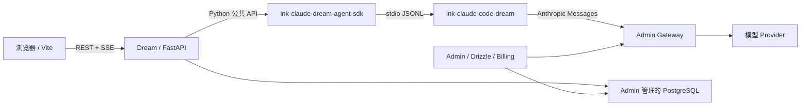

<!-- [输入] 当前 Dream/Admin/Gateway 拓扑、仓库合同以及已发布的 Claude SDK/Runtime 配对。 -->
<!-- [输出] 说明 Ink & Memory 是什么、如何安装运行、如何配对版本，以及必须遵守的运维边界。 -->
<!-- [定位] README.md 英文真相源的中文镜像；事实、结构和命令必须与 README.md 保持一致。 -->
<!-- [同步] 2026-08-28：以当前 develop 流程、精确 SDK/Runtime 配对、本机 Runtime 安装、故障排查和注意事项替换旧说明。 -->

# Ink & Memory

<p align="center">
  
</p>

<p align="center">
  <a href="README.md">English</a> · 中文
</p>

Ink & Memory 是一个面向写作、Chat、Dream 创作流程和版本化 Deck 的创作工作台。它由 React/Vite 前端、FastAPI 后端、Admin 管理的 PostgreSQL Schema、提供模型访问和计费的 Admin Gateway，以及独立发布的 Claude Agent SDK 和 Claude Runtime 组成。

本仓库只包含 Dream 应用，不拥有共享数据库 Schema、模型 Provider 凭据、计费系统或 Claude SDK/Runtime 的内部实现。

## 可以做什么

- **Writing** —— 写作并保存 Session，通过时间线查看历史和 Reflections。
- **Chat** —— 使用 Deck Agent 在持久 Thread 中进行流式对话、工具调用、resume、计划和 TODO。
- **Dream** —— 启动 Dream Run，审阅剧本、分镜、提示词和生成产物。
- **Decks** —— 创建并版本化 Deck、Agent、Prompt、资源和 Claude Plugin 引用。
- **Workspace 与工具** —— 使用 Thread 自有文件、沙箱工具、MCP Server、Skill 和插件。
- **平台集成** —— 从 Admin/Gateway 获取已认证的模型 alias、订阅资格、用量和计费能力。

Deck 市场分发当前明确延期，参见 [docs/design/deck-register/README.md](docs/design/deck-register/README.md)。

## 系统边界



| 仓库/服务 | 负责 | 禁止负责 |
| --- | --- | --- |
| `ink-dream-memory` | Dream 前后端、Thread/Run/Workspace 集成、SDK/Runtime 选择 | 共享 Schema migration、Provider Key、第二套 Agent/Runtime 协议 |
| `ink-admin-memory` | Drizzle Schema、PostgreSQL、Admin、Gateway、模型目录、订阅、计费 | Dream Thread/Run 业务逻辑 |
| `ink-claude-dream-agent-sdk-python` | Python SDK distribution 和公共 `claude_agent_sdk` API | Dream 业务 DTO 或数据库访问 |
| `ink-claude-code-dream` | Clean-room CLI/Runtime、协议、工具、MCP、多平台 npm 包 | Dream/Admin 业务状态机或用户数据 |

## 支持的版本合同

Python SDK 和 npm Runtime 虽然通过不同包生态发布，但 Dream 必须把它们作为一个兼容配对管理。

| 组件 | 要求版本 |
| --- | --- |
| Dream 分支 | `develop` |
| Python | `>=3.12` |
| Node.js | Runtime selector 要求 `>=22 <25` |
| Python SDK | `ink-claude-dream-agent-sdk==0.2.144` |
| npm Runtime | `@glide-the/ink-claude-code-dream@0.1.2` |
| Runtime CLI 兼容输出 | `2.1.241 (Claude Code)` |

重要：`uv sync` 只管理 Python 环境。它会安装 Python SDK，但不会安装或升级 npm Runtime。源码要求 Runtime `0.1.2` 时，即使其他 capability 全部合法，也会拒绝 `0.1.1` 可执行文件。

## 环境要求

- Git
- Python 3.12+
- [uv](https://docs.astral.sh/uv/)
- Node.js 22–24 和 npm
- pnpm 9+
- 同级目录中的 [Ink Admin Memory](https://github.com/glide-the/ink-admin-memory)
- 仅 Docker/Remote SSH 部署路径需要 Docker

当前 Runtime 支持 Darwin/Linux 的 arm64/x64；Windows 和 musl 目标会 fail closed。

## 本机安装

### 1. 获取当前开发分支

```bash
git clone https://github.com/glide-the/im.git ink-dream-memory
cd ink-dream-memory
git switch develop
git pull --ff-only origin develop
```

除非配置了显式绝对路径，否则 Admin 应位于 `../ink-admin-memory`。

### 2. 准备 Admin、PostgreSQL 和 Gateway

```bash
test -d ../ink-admin-memory || git clone https://github.com/glide-the/ink-admin-memory.git ../ink-admin-memory
cd ../ink-admin-memory
pnpm install
pnpm env:setup
pnpm env:check
pnpm db:migrate
pnpm db:migrate:check
```

所有共享 PostgreSQL migration 只能由 Admin 管理。Dream 禁止临时创建共享表，也没有运行时 SQLite fallback。

在终端 A 启动 Admin/Gateway：

```bash
cd ../ink-admin-memory
pnpm dev
```

首次本机安装时，从 Admin 仓库发布默认订阅和 Dream 服务身份：

```bash
cd ../ink-admin-memory
pnpm db:data:subscriptions -- --apply
pnpm product:provision-local-dream
pnpm gateway:provision-local-dream
```

这些命令属于本机身份操作。对任何非本机数据库执行前，必须先阅读 Admin 仓库说明。

### 3. 同步 Dream Python 环境

在本仓库执行：

```bash
cd backend
uv sync
```

`uv sync` 创建或更新 `backend/.venv`，并使其精确匹配 `backend/pyproject.toml` 和 `backend/uv.lock`。它可能删除未声明的包，尤其不会保留临时安装的 pytest，也不会管理 npm Runtime。

无需把 pytest 永久加入生产环境即可运行后端测试：

```bash
cd backend
uv run --with pytest==9.1.1 pytest -q
```

### 4. 安装精确 Claude Runtime

Runtime 是 npm/native 制品，必须单独安装公开 selector 包：

```bash
npm install --global @glide-the/ink-claude-code-dream@0.1.2
export PATH="$(npm prefix --global)/bin:$PATH"
command -v ink-claude-code-dream
ink-claude-code-dream --version
```

版本命令必须输出：

```text
2.1.241 (Claude Code)
```

然后通过 Dream 的真实 resolver 校验 Runtime manifest：

```bash
cd backend
.venv/bin/python -c 'from libs.claude_agent_kit.server.sdk_env import resolve_claude_cli_path; print(resolve_claude_cli_path())'
```

该命令必须 exit 0 并输出解析到的 `0.1.2` 可执行路径。如果 `command -v` 仍指向旧的 `~/.local/bin/ink-claude-code-dream`，必须在启动 Dream 前调整 `PATH` 顺序或替换旧安装。运行中的进程会保留启动时继承的 `PATH`；修改后只重启自己拥有的进程。

正常生产资格路径禁止使用 `CLAUDE_CODE_CLI_PATH` 绕过 manifest 校验。该变量只保留给经过评审的显式绝对路径回滚。

### 5. 配置 Dream

需要时创建 Dream 私有环境文件：

```bash
test -f backend/.env || cp backend/.env.example backend/.env
```

推荐的本机数据库/Gateway 所有权配置：

```dotenv
DATABASE_URL=
INK_LOAD_DATABASE_URL_FROM_ENV_FILE=1
INK_DATABASE_ENV_FILE=/absolute/path/to/ink-admin-memory/.env.local

INK_GATEWAY_ENABLED=1
INK_GATEWAY_BASE_URL=http://127.0.0.1:3000
```

Admin provision 命令会把其余本机服务身份和模型 alias 写入 gitignored 环境文件。不要把 Provider Key 复制到 Dream，也不要向浏览器暴露服务凭据。

### 6. 启动 Dream

终端 B——后端：

```bash
cd backend
.venv/bin/python server.py
```

终端 C——前端：

```bash
cd frontend
npm install
npm run dev
```

访问地址：

- Dream：<http://127.0.0.1:5173>
- Dream API：<http://127.0.0.1:8765>
- Admin：<http://127.0.0.1:3000/admin>

## 主要页面

| 路径 | 用途 |
| --- | --- |
| `/story-workspace/chat` | 新建和历史 Agent Thread |
| `/story-workspace/dream` | Dream Run 和创作工作台 |
| `/story-workspace/decks` | 已启用、已发布的 Deck |
| `/story-workspace/settings/work` | Deck、资源和插件管理 |
| `/story-workspace/settings` | 账号、订阅、模型和应用设置 |

## 验证

```bash
# 后端
cd backend
uv run --with pytest==9.1.1 pytest -q

# 前端
cd frontend
npm run lint
npm run build

# 已发布 SDK/Runtime registry 验收；provider-free，不调用模型
cd ..
python3 scripts/verify_claude_registry_release.py \
  --sdk-version 0.2.144 \
  --runtime-version 0.1.2 \
  --expected-cli-version '2.1.241 (Claude Code)'
```

真实业务测试必须使用正常 Dream/Admin/Gateway/PostgreSQL 链路和指定的现有账号。Provider-free fixture 禁止汇报为真实业务验收。

## 运维与安全注意事项

1. **两个包管理器，一个兼容合同。** `uv` 管理 Python 包，npm 管理 native Runtime；版本变更必须在同一变更中更新两端和验收证据。
2. **Fail closed。** Schema capability 缺失、SDK/Runtime 版本不匹配、manifest 非法、模型 alias 或凭据不可用时必须失败，禁止静默选择 ambient CLI 或伪数据。
3. **Admin 拥有 Schema。** 共享 PostgreSQL Schema 只能通过 Admin Drizzle migration 和 capability 发布修改。
4. **禁止提交 Secret。** 数据库密码、Gateway Service Key、Provider Key、OAuth Secret、npm token、transcript 和用户 Workspace 内容都不得进入 Git。
5. **Thread 自有 Runtime 文件。** Claude 临时文件必须位于经过校验的 Thread workspace `.claude-tmp`，禁止放宽到 `/tmp` 或用户真实 Claude home。
6. **禁止全局清理服务。** 测试只能停止和清理由本轮测试创建的进程与临时资源。
7. **已发布版本不可覆盖。** 错误 Runtime 必须通过前向版本修复或显式评审回滚，正常回滚不得覆盖或 unpublish 已验收版本。

## 故障排查

### `Dream Claude Runtime is not production-qualified`

同时检查可执行文件和 release manifest：

```bash
command -v ink-claude-code-dream
readlink "$(command -v ink-claude-code-dream)"
ink-claude-code-dream --version
```

当前 `develop` 要求 manifest 中的 Runtime 为 `0.1.2`。即使 capability flag 全部为 `true`，实际 Runtime 版本过旧仍会失败。

### `uv sync` 删除了 pytest

`uv sync` 会删除不属于锁定生产环境的包。使用文档中的 `uv run --with pytest==9.1.1 pytest ...`，或者通过单独评审加入开发依赖组；禁止假设临时安装的包能跨 sync 保留。

### PostgreSQL 或 Schema capability 不可用

启动 Admin supervisor，检查 `../ink-admin-memory/.env.local`，并执行 Admin migration check。禁止从 Dream 建表。

### 没有可调用模型

在 Admin 中配置已启用、有定价的模型 alias 和 Provider 凭据，然后执行本机 Gateway provision。Dream 只接受平台 alias，不接受浏览器传入的 Provider ID 或 Key。

## 文档与贡献规则

- 仓库维护规则：[Agent.md](Agent.md)
- Agent 产品交互说明：[docs/Agent.md](docs/Agent.md)
- 架构总览：[docs/architecture/项目架构设计说明.md](docs/architecture/项目架构设计说明.md)
- SDK/Runtime 打包与集成：[docs/deploy/claude-sdk-runtime-packaging-and-integration.md](docs/deploy/claude-sdk-runtime-packaging-and-integration.md)
- Registry 验收：[docs/deploy/claude-registry-release-acceptance.md](docs/deploy/claude-registry-release-acceptance.md)
- Story Workspace 设计：[docs/design/story-workspace/](docs/design/story-workspace/)

功能分支必须从最新 `develop` 创建；保留无关工作区改动；同步受影响的文件头和 `.folder.md`；最终报告必须包含精确验证命令和退出码。
