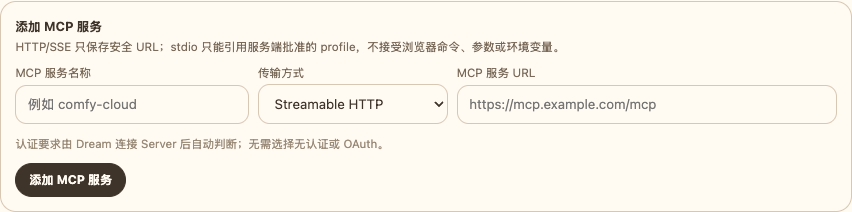
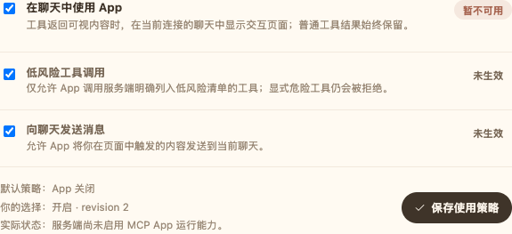
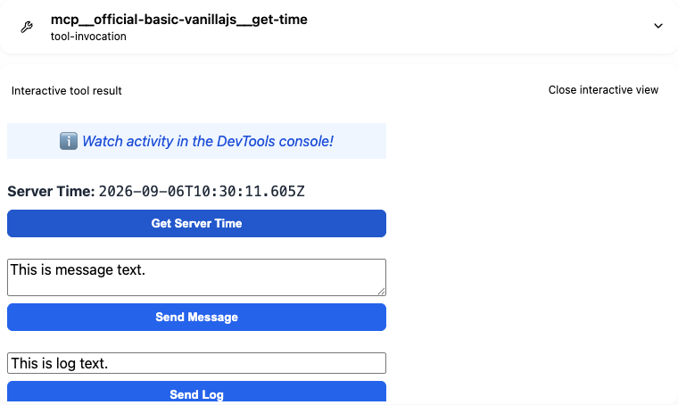

<!-- [输入] 当前 Dream/Admin/Gateway 拓扑、支持版本与用户可见的 MCP Apps 流程。 -->
<!-- [输出] 面向普通用户和本机运行者的简明指南，深入工程细节通过链接下沉。 -->
<!-- [定位] 仓库中文入口指南；README.md 是同结构的英文正文。 -->
<!-- [同步] 2026-09-06：以快速启动和 MCP Apps 用法重组；用分层章节保留精确安装、所有权、安全与验证事实。 -->
<!-- [同步] 2026-09-06：为 MCP 连接、App 设置和 Chat 交互步骤加入经过脱敏的真实组件截图。 -->
<!-- [同步] 2026-09-06：使新增连接和 App 控制与可访问 Server 弹窗、统一 MCP 使用策略表单一致。 -->
<!-- [同步] 2026-09-12：增加使用显式 origin、可恢复的 NATAPP 边缘转发操作入口。 -->
<!-- [同步] 2026-09-12：统一 SDK 0.2.145 与 Runtime 0.1.5 源码合同，并记录尚未公开的 registry 门禁。 -->

# Ink & Memory

<p align="center">
  
</p>

<p align="center">
  <a href="README.md">English</a> · 中文
</p>

Ink & Memory 是一个与 AI 一起写作的工作空间。你可以持续对话，用 Deck 和 Agent 组织可复用能力，连接 Notion 或 MCP Server 等外部工具，并把想法发展成结构化 Dream 工作流和创作资产。

本仓库包含 Dream Web 应用与 FastAPI 后端。Admin、PostgreSQL、模型 Gateway、公开 Python SDK 和原生 Claude Runtime 由独立项目维护。

## 你可以做什么

- **写作与回顾**：保存写作会话、浏览时间线并查看反思。
- **持续对话**：在 Thread 中保留上下文，使用流式回答、工具、计划、文件和 TODO。
- **构建可复用 Agent**：用 Deck 组织提示词、资源、插件与 Agent 行为。
- **运行 Dream**：通过引导工作流发展剧本、故事板、提示词与生成资产。
- **连接自己的工具**：在设置中授权 Notion 或受管 MCP Server。
- **使用交互式 MCP Apps**：兼容工具返回 App 时，可在已折叠的助手过程下方直接操作。

MCP Apps 当前仍是技术预览。当 App 未启用、不可用或加载失败时，普通工具结果仍会保留。生产启用还需要独立的真实账号、外部 Server、OAuth 与运维验收。

## 本机启动

### 环境要求

- macOS 或 glibc Linux，arm64/x64
- Python `>=3.12` 与 [uv](https://docs.astral.sh/uv/)
- Node.js `>=22 <25`、Corepack 和 npm
- Admin 仓库，用于提供 PostgreSQL 与模型 Gateway

已资格化的原生 Runtime 不支持 Windows 和 musl 平台。

### 1. 获取 Dream 与 Admin

```bash
git clone https://github.com/glide-the/im-dream.git ink-dream-memory
git clone https://github.com/glide-the/dream-im-platform.git ink-admin-memory
```

除非经评审的发布版本另有说明，Dream 使用 `develop` 分支，Admin 使用 `main` 分支。

### 2. 准备 Admin、PostgreSQL 与 Gateway

```bash
cd ink-admin-memory
pnpm install
pnpm env:setup
pnpm env:check
pnpm db:migrate
pnpm db:migrate:check
```

首次本机安装时，先按 Admin README 配置 `.env.local`，然后创建默认订阅和 Dream 服务身份：

```bash
pnpm db:data:subscriptions -- --apply
pnpm product:provision-local-dream
pnpm gateway:provision-local-dream
```

这些命令会写入 Admin 所有的数据。除非有独立的部署评审，只能对预期的本机数据库执行。

### 3. 安装 Dream 与 Runtime

```bash
cd ../ink-dream-memory/backend
uv sync --frozen

npm install --global @glide-the/ink-claude-code-dream@0.1.5
export PATH="$(npm prefix --global)/bin:$PATH"
ink-claude-code-dream --version

npm install --global ntn@0.15.1
ntn --version

cd ../frontend
corepack enable
corepack pnpm install --frozen-lockfile
```

Runtime `0.1.5` 是源码固定的候选版本。2026-09-12 公共 registry 的最新版本仍为 `0.1.4`，因此在同一 SHA 的 `0.1.5` 五包发布并完成 registry 回验前，这条安装命令和生产镜像构建必须 fail closed。

Runtime 必须输出 `2.1.241 (Claude Code)`，Notion CLI 必须输出 `ntn 0.15.1`，Corepack 必须解析到 `pnpm@10.28.1`。

### 4. 配置 Dream

从示例创建 `backend/.env`，并指向 Admin 环境文件和你的工作区根目录：

```bash
cd ../backend
test -f .env || cp .env.example .env
```

```dotenv
DATABASE_URL=
INK_LOAD_DATABASE_URL_FROM_ENV_FILE=1
INK_DATABASE_ENV_FILE=/absolute/path/to/ink-admin-memory/.env.local

INK_GATEWAY_ENABLED=1
INK_GATEWAY_BASE_URL=http://127.0.0.1:3000

AGENT_CWD=/absolute/path/to/agentdata/agent-workspace
INK_AGENT_SANDBOX_ENABLED=true
INK_NOTION_RUNTIME_ROOT=/absolute/path/to/agentdata/notion-runtime
```

Provider Key 只保留在 Admin，不要复制到 Dream。

### 5. 启动三个服务

终端 A——Admin 与 Gateway：

```bash
cd ink-admin-memory
pnpm dev
```

终端 B——Dream 后端：

```bash
cd ink-dream-memory/backend
.venv/bin/python server.py
```

终端 C——Dream Web：

```bash
cd ink-dream-memory/frontend
INK_BACKEND_INTERNAL_URL=http://127.0.0.1:8765 \
NEXT_PUBLIC_WS_BASE_URL=ws://127.0.0.1:8765 \
corepack pnpm run dev --hostname 127.0.0.1 --port 5173
```

打开：

- Dream：<http://127.0.0.1:5173>
- Admin：<http://127.0.0.1:3000/admin>
- Dream API：<http://127.0.0.1:8765>

## 使用 MCP Apps

### 添加连接并启用 App

1. 登录 Dream，打开 **设置 → 资源链接**。
2. 点击 **添加 MCP 服务**，在弹窗中填写受管地址；也可以打开已有连接，然后完成鉴权。
3. 在连接详情页找到 **使用策略**。
4. 打开 **在聊天中使用 App**。如有需要，再允许 **低风险工具调用** 和 **向聊天发送消息**。
5. 点击 **保存使用策略**，并对比默认策略、你保存的选择与服务端实际状态。

以下截图使用安全示例数据和真实生产界面组件，不包含账号信息或密钥。



*从资源链接打开“添加 MCP 服务”弹窗并填写受管地址。Dream 连接 Server 后会自动判断认证要求。*



*同一个使用策略表单包含 App 开关、交互权限、默认值、已保存选择、revision、实际状态和唯一保存动作。*

默认策略、你保存的选择与服务端实际状态保持独立。当连接离线、Server 没有声明 App，或服务端预览策略未允许时，开关即使已开启，App 也可能不可用。

### 在 Chat 中调用和使用 App

1. 打开 Chat，选择可使用该连接的 Deck/Agent。
2. 请 Agent 使用对应 MCP 工具，例如“查一下服务器时间”。
3. 模型会按正常流程调用工具，并写出回答。
4. 助手的思考过程和普通工具详情保留在 **查看过程 / 用时…** 折叠区中。
5. 已验证的交互 App 会显示在折叠区外，因此收起过程不会隐藏 App。
6. 直接使用 App 里的按钮或输入框。已允许的 App 内工具操作会更新 App，不会启动新的模型 turn；如果 App 向 Chat 发消息，该消息会成为普通用户消息，并启动一个新 Agent turn。



*顶部工具详情已经收起；下方官方示例 App 仍可直接操作。*

你可以关闭和重新打开交互视图。刷新、切换 Thread、修改权限或改变连接 revision 时会创建新的受控 session，不会重放原始工具。

完整工程链路——连接 discovery、模型工具调用、可信结果投影、实时/历史恢复、Browser Host、Node 代理、sandbox、权限与 Chat 消息回流——请见 [MCP Apps 与 IM Agent UI 设计](docs/design/claude-agent/mcp-apps-integration-strategy.md#32-端到端调用链)。

## 支持版本与所有权

| 组件 | 支持版本 / 所有者 |
| --- | --- |
| Dream 集成分支 | `develop` |
| Python | `>=3.12` |
| Node.js | `>=22 <25`；部署镜像使用 Node 22 |
| 前端包管理器 | Corepack 提供的 `pnpm@10.28.1` |
| Next.js / React | `next@16.1.6`、`react@19.1.0`、`react-dom@19.1.0` |
| Python SDK | `ink-claude-dream-agent-sdk==0.2.145` |
| 原生 Runtime | `@glide-the/ink-claude-code-dream@0.1.5` 源码候选；发布前公共最新版仍为 `0.1.4` |
| Runtime 兼容输出 | `2.1.241 (Claude Code)` |
| Notion CLI | `ntn@0.15.1` |
| 共享 PostgreSQL schema、Admin、Gateway、计费 | `dream-im-platform` / Admin 仓库 |
| Dream Web、Thread/Run/Workspace 集成 | 本仓库 |

包所有权是明确分开的：`uv` 管理 Dream Python 环境，npm 发布原生 Runtime 和 Notion CLI，pnpm 管理 `frontend/`。`uv sync` 不会安装或升级原生 Runtime。

Admin Drizzle 是共享 PostgreSQL migration 的唯一所有者。Dream 只消费精确发布的 capability，缺失时 fail closed。MCP App 连接设置要求先发布 Admin migration `0053_rare_lenny_balinger` 与 capability `dream.mcp-app-connection-settings.v1`，再发布对应 Dream 代码。

## 构建与测试

常用 provider-free 检查：

```bash
# 后端
PYTHONPATH=backend uv run --native-tls --project backend --frozen \
  --with pytest==9.1.1 --with pytest-asyncio \
  python -m pytest backend/tests -q

# 前端
corepack pnpm --dir frontend exec tsc --noEmit --incremental false
corepack pnpm --dir frontend lint
NODE_ENV=production corepack pnpm --dir frontend build

# MCP Apps Browser/Node 合同
corepack pnpm --dir frontend test:mcp-apps-runtime
corepack pnpm --dir frontend typecheck:mcp-apps
```

当前 SDK/Runtime registry 门禁（Runtime `0.1.5` 发布后执行）：

```bash
python3 scripts/verify_claude_registry_release.py \
  --sdk-version 0.2.145 \
  --runtime-version 0.1.5 \
  --expected-cli-version '2.1.241 (Claude Code)'
```

只能从 pnpm/Next workspace 构建 standalone Web 镜像：

```bash
INK_NEXT_OUTPUT=standalone NODE_ENV=production \
  corepack pnpm --dir frontend run build:docker
test -f frontend/.next/standalone/server.js
```

MCP Apps 聚焦命令与当前 provider-free 证据请见 [MCP Apps 验收回执](docs/exec/mcp-apps/current-candidate-validation.md)。Provider-free 测试是技术检查，不代表生产环境已可用。

## 安全与发布边界

- Secret、Provider Key、MCP 凭据、对话全文和 Workspace 正文不得进入 Git 或 Browser 可见配置。
- Dream 不会在运行时创建或迁移共享 schema。必须先应用经评审的 Admin Drizzle migration。
- capability 缺失、Runtime/SDK 版本不匹配、revision 过旧、凭据不可用或策略非法时 fail closed；条件允许时仍保留普通 MCP 结果。
- Browser MCP App 只连接通过认证的同源 Node 端点。真实 Server 地址与凭据保留在服务端，App 正文运行在受限 iframe sandbox 中。
- 测试和本机 launcher 只能停止或删除自己创建的资源。
- 只能回滚到经明确评审的不可变镜像或发布版本；不得恢复已退役的 npm/Vite 构建路径。
- MCP Apps 在独立真实业务验收改变合同前保持生产关闭（`productionAppsEffective=false`）。

部署方式请见 [deploy/README.md](deploy/README.md)。AutoDL 现已使用同一个 Next.js workspace 与 frozen pnpm lock，并包含 server-only MCP Apps Runtime；旧 Vite/npm/dist 发布路径不再支持。阿里云边缘把现有公开域名转发到显式 NATAPP Dream/Admin origins 时，应使用可恢复的[边缘转发流程](docs/deploy/natapp-edge-relay.md)，不得从 Compose 或历史端口猜测上游。

## 故障排查

### App 没有出现

- 确认 MCP 连接已连接，且该工具声明了 App。
- 打开 **设置 → 资源链接 → 对应连接 → 使用策略**，对比默认策略、你保存的选择与实际状态。
- 确认 Admin migration `0053_rare_lenny_balinger` 已应用，且 `dream.mcp-app-connection-settings.v1` 已发布。
- 连接 inventory 刷新后重试 Chat 调用。对于紧凑历史行，首次展开过程会加载已保存详情；加载后再收起，App 仍会保持可见。
- 策略、鉴权或 sandbox 不可用时，普通结果是预期 fallback。

### `Dream Claude Runtime is not production-qualified`

```bash
command -v ink-claude-code-dream
readlink "$(command -v ink-claude-code-dream)"
ink-claude-code-dream --version
cd backend
.venv/bin/python -c 'from libs.claude_agent_kit.server.sdk_env import resolve_claude_cli_path; print(resolve_claude_cli_path())'
```

源码合同要求 manifest-qualified Runtime 为 `0.1.5`，并输出 `2.1.241 (Claude Code)`。在 `0.1.5` 公开发布并完成 registry 回验前，生产启动应当 fail closed，不得静默使用 `0.1.4`。发布后修正普通 `PATH` 安装，只重启你自己拥有的服务。`CLAUDE_CODE_CLI_PATH` 仅保留给经明确评审的回滚。

### `uv sync` 删除了 pytest

`uv sync` 会删除未声明包。请使用[构建与测试](#构建与测试)中的临时 `uv run --with pytest...` 命令，或在独立评审中增加开发依赖。

### Web 页面无法连接 API 或语音

确认 Admin 在 `3000`、Dream 在 `8765`、Web 在 `5173`。Next 到 Dream rewrite 使用 `INK_BACKEND_INTERNAL_URL`；Browser REST/SSE 使用运行时 `API_BASE_URL`；语音使用 Browser `WS_BASE_URL` 或本机 `NEXT_PUBLIC_WS_BASE_URL` fallback。

### 构建仍要求 npm/Vite 文件

当前 Web workspace 使用 Corepack/pnpm、Next、`.next` 和 `frontend/pnpm-lock.yaml`。查找 `frontend/package-lock.json`、`vite.config.ts` 或生产 `dist/index.html` 的 workflow 已过时。

### PostgreSQL capability 或模型不可用

执行 Admin migration check，核对 Admin 所有的环境文件，并在 Admin 中配置 enabled/priced 模型 alias 与 Provider credential。Dream 只接受平台模型 alias，不接受 Browser 提供的 Provider ID 或 Key。

## 更多文档

- [MCP Apps 端到端设计](docs/design/claude-agent/mcp-apps-integration-strategy.md#32-端到端调用链)
- [MCP Apps 当前技术证据](docs/exec/mcp-apps/current-candidate-validation.md)
- [仓库维护规则](Agent.md)
- [Agent 产品行为](docs/Agent.md)
- [规则索引](docs/rules/README.md)
- [部署指南](deploy/README.md)
- [SDK/Runtime 打包](docs/deploy/claude-sdk-runtime-packaging-and-integration.md)
- [Registry 验收](docs/deploy/claude-registry-release-acceptance.md)

保持 `README.md` 与 `README.zh.md` 结构一致。保留工作区无关改动，同步受影响的文件头与目录合同，并报告精确验证命令和剩余发布动作。

导出多个文件时，Agent 可在工作区根目录用明确的 `.zip` 输出路径和明确的普通输入路径运行 `zip`（例如 `zip -r files/export-bundle.zip files/scene`），再链接生成的真实二进制压缩包；也可链接独立的工作区目录，由下载服务即时打包真实 ZIP。点前缀运行路径、工作区越界、符号链接、宽泛的 `.`/glob 输入和 shell 组合命令仍会被拒绝。生产后端镜像和 AutoDL 直宿主发布均安装 Info-ZIP 以支持这条路径。
