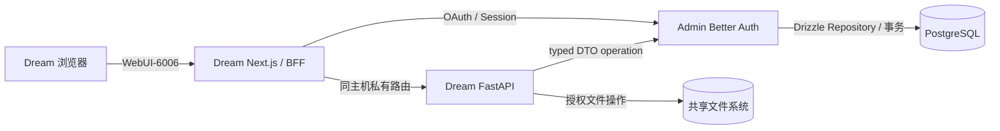

<!-- [输入] 当前 Dream/Admin 架构、AutoDL 直宿主发布与本机开发合同。 -->
<!-- [输出] 用户优先的启动、使用、本机配置、验证与恢复入口。 -->
<!-- [定位] 仓库中文 README；README.md 是同结构的英文正文。 -->
<!-- [同步] 2026-09-19：记录 Gateway service key 与 Claude Agent 完整发送链路发布门禁。 -->
<!-- [同步] 2026-09-18：将 AutoDL 启动与产品使用前置，恢复细节移入独立手册。 -->

# Ink & Memory Dream

<p align="center">
  
</p>

<p align="center">
  <a href="README.md">English</a> · 中文
</p>

Ink & Memory Dream 是面向长期对话、故事创作、可复用 Deck/Agent、文件、Notion 与 MCP 工具的 AI 写作工作空间。本仓库负责 Dream Web 应用与 FastAPI 业务 Runtime。

## 在 AutoDL 启动

1. 在 AutoDL 控制台打开正在运行的实例。
2. 点击 **WebUI-6006** 打开 Dream，不需要 SSH 隧道。
3. 从 Dream 原有登录卡进入。密码与 Google 登录由 Admin 处理，完成后返回原先请求的 Dream 页面。
4. 打开或创建 Chat，选择 Deck/Agent，然后发送消息。

AutoDL 实例变化后公网主机会变化。请使用控制台当前的 **WebUI-6006**，不要把公网主机名保存到源码或文档。**WebUI-6008** 是独立的 Admin 运维后台。

| 入口 | 内部监听 | 用途 | 使用者 |
| --- | --- | --- | --- |
| **WebUI-6006** | Next.js `127.0.0.1:6006` | Dream 页面、同源认证/BFF 与 API 路由 | Dream 用户 |
| Dream 后端 | FastAPI `127.0.0.1:8765` | Agent Runtime、SSE、业务编排与共享文件 | 私有；由 Next.js 访问 |
| **WebUI-6008** | Admin `127.0.0.1:6008` | 认证、数据库接口、Gateway 与管理后台 | Admin 运维人员 |
| 嵌入式 PostgreSQL | `54329` | Admin 管理的认证与业务持久化 | 私有；Dream 没有凭据 |

实例重启后 WebUI 不可用时，按 [AutoDL 恢复手册](docs/deploy/autodl-recovery.md)检查。手册覆盖状态、日志、重启与完整发布，不打印 secret，也不删除持久数据。最新发布证据见 [2026-09-18 发布回执](docs/exec/exec_autodl_release_20260918.md)。

## 使用 Dream

- **Chat** 保存 Thread 历史并流式输出 Agent 回复；继续、取消和重试都走同一生产路径。
- **Dream 与 Story Workspace** 用于发展故事、人物、场景、剧本和生成制品。
- **Deck 与 Agent** 组织可复用的指令、工具、资源和 Claude Plugin。注册用户默认获得代码内置“剧本创作团队”和“音乐创作”系统 Deck 的可编辑副本；“音乐创作”组合 YuE2 统筹、编曲师、作词师，并使用本机 `yue2-skills`、`music-composition-skills`、`lyric-writing-skills` Marketplace。
- **文件** 保存在 Thread 工作区，继续执行路径规范化、所有权检查和共享文件系统边界。
- **Resource Links** 连接 Notion 与受管 MCP Server；兼容的 MCP App 可显示在普通工具结果下方。


使用 MCP 连接时，打开 **Settings → Resource Links**，新增或选择 Server，完成授权，然后在 usage policy 中启用 **Use App in Chat**。App 关闭或不可用时，普通工具结果仍保留。完整流程见 [MCP Apps 设计](docs/design/claude-mcp/mcp-apps-integration-strategy.md#32-端到端调用链)。

## 认证与数据边界

Admin 是认证中心和唯一生产数据库访问服务。Dream 通过 typed DTO client 调用具名且带版本的 Admin operation；Admin Service 与 typed Drizzle Repository 负责权限、事务、锁与持久化。

Dream 产品用户与 Admin 运维账号属于不同业务身份。登录 Dream 不会获得 Admin 管理权限。Google 是 Admin Better Auth 的外部身份来源；Dream 业务接口不接受 Google token 或任意用户 ID 请求头。

Dream 继续负责产品路由、Agent Runtime、EventBus、SSE、turn/resume/cancel 行为与授权后的共享文件操作。Dream 不持有 PostgreSQL 密码，不存在生产 SQL/ORM 路径、migration、runtime DDL 或数据库 fallback。Admin Drizzle 是唯一 Schema 与 migration 权威。



## 本机运行

### 环境要求

- Dream `develop` 分支；Admin `main` 分支
- Python `>=3.12` 与 `uv`
- Node.js `>=22 <25`、Corepack 与 `pnpm@10.28.1`
- Admin 与 Dream 位于相邻目录

```bash
git clone https://github.com/glide-the/im-dream.git ink-dream-memory
git clone https://github.com/glide-the/dream-im-platform.git ink-admin-memory
```

准备 Admin、嵌入式 PostgreSQL、Gateway 与服务身份：

```bash
cd ink-admin-memory
pnpm install
pnpm env:setup
pnpm env:check
pnpm db:migrate
pnpm db:migrate:check
pnpm product:provision-local-dream
pnpm gateway:provision-local-dream
pnpm local:stable
```

安装 Dream 与精确版本 Runtime：

```bash
cd ../ink-dream-memory/backend
uv sync --frozen
npm install --global @glide-the/ink-claude-code-dream@0.1.10
npm install --global ntn@0.15.1
ink-claude-code-dream --version
ntn --version

cd ../frontend
corepack enable
corepack pnpm install --frozen-lockfile
```

Runtime 必须输出 `2.1.241 (Claude Code)`。`uv` 管理 Python SDK，npm 管理原生 Runtime 与 Notion CLI，pnpm 管理 Web workspace；`uv sync` 不会安装 Runtime。

从示例创建 `backend/.env` 与 `frontend/.env.local`。配置明确的 Admin origin/issuer、Dream resource 以及已注册的 service/BFF identity。Dream env 不得包含 `DATABASE_URL` 或 Provider secret。

分别启动拥有的服务：

```bash
# Dream backend
cd ink-dream-memory/backend
uv run uvicorn server:app --host 127.0.0.1 --port 8765

# Dream frontend
cd ink-dream-memory/frontend
INK_BACKEND_INTERNAL_URL=http://127.0.0.1:8765 NEXT_PUBLIC_WS_BASE_URL=ws://127.0.0.1:8765 corepack pnpm run dev --hostname 127.0.0.1 --port 5173
```

Dream 地址为 <http://127.0.0.1:5173>，Admin 地址为 <http://127.0.0.1:3000/admin>。

## 支持版本与所有权

| 组件 | 当前合同 |
| --- | --- |
| Dream metadata | backend `0.1.4`、frontend `0.0.4`、API schema `2.0.0` |
| Next.js / React | `16.1.6` / `19.1.0` |
| Python SDK | `ink-claude-dream-agent-sdk==0.2.145` |
| 原生 Runtime | `@glide-the/ink-claude-code-dream@0.1.10` |
| Runtime compatibility | `2.1.241 (Claude Code)` |
| Notion CLI | `ntn@0.15.1` |
| 认证、PostgreSQL、Drizzle、Gateway、计费 | Admin 仓库 |
| Dream Web、Runtime、SSE、Thread/Run 与文件 | 本仓库 |

## 构建与验证

```bash
# Backend provider-free suite
PYTHONPATH=backend uv run --native-tls --project backend --frozen   --with pytest==9.1.1 --with pytest-asyncio   python -m pytest backend/tests -q

# Frontend checks
corepack pnpm --dir frontend exec tsc --noEmit --incremental false
corepack pnpm --dir frontend lint
NODE_ENV=production corepack pnpm --dir frontend build

# 已发布 SDK/Runtime 身份
python3 scripts/verify_claude_registry_release.py   --sdk-version 0.2.145   --runtime-version 0.1.10   --expected-cli-version '2.1.241 (Claude Code)'
```

Provider-free 检查证明确定性合同。真实 Google、模型与业务验收必须使用正常 Dream/Admin/Gateway/PostgreSQL 服务和已授权真实账号。

## 故障排查

- **WebUI 返回 404 或无法打开：** 先确认 AutoDL 实例已运行，再按[恢复手册](docs/deploy/autodl-recovery.md)检查；不要新增隧道或硬编码当前公网主机名。
- **Unable to check your session：** 验证两个 WebUI 映射，先检查 Admin，并确认 issuer、Dream origin/resource 与 callback 都来自当前实例。
- **`ADMIN_SERVICE_AUTH_UNAVAILABLE` 或 `ADMIN_TIMEOUT`：** 先验证 Admin 与 PostgreSQL，再重启 Dream；Dream 不得回退数据库连接。
- **Runtime 未通过 production qualification：** 核对 `command -v ink-claude-code-dream`、package-root `cli.js`、相邻 manifest、Runtime `0.1.10`、compatibility `2.1.241` 与必需 capability。
- **`uv sync` 删除 pytest：** 使用上面的临时 `uv run --with pytest...` 命令，或单独评审开发依赖。
- **Chat 提示 Token allowance 不足：** Gateway 拒绝模型 reservation 前，用户消息已保存。先在 Admin 修正订阅/模型额度，重新加载 Thread 后再决定是否发送。
- **Chat 返回 `GATEWAY_API_KEY_INVALID`：** Dream service key 与 Admin 当前 active canonical-subject Gateway key 不匹配。AutoDL 现在会在替换运行环境前阻断 sync 和 qualified。必须通过 Admin 所有的发布操作恢复或轮换 Key，仅重启 Dream 以重新读取私有环境，然后完整重跑真实 `create Thread -> POST /api/claude-agent -> SSE` 验收后才能发布。
- **MCP App 没有显示：** 检查连接状态、App advertisement、usage policy 与 Admin capability；普通工具结果是预期 fallback。

## 文档

- [AutoDL 部署](deploy/autodl-ssh/README.md)
- [AutoDL 恢复](docs/deploy/autodl-recovery.md)
- [项目架构](docs/architecture/项目架构设计说明.md)
- [认证与数据合同](docs/architecture/admin-auth-data-interaction.md)
- [仓库规则](Agent.md)
- [产品 Agent 行为](docs/Agent.md)
- [规则索引](docs/rules/README.md)
