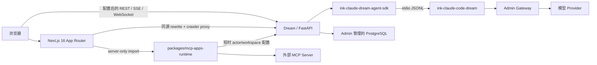

<!-- [输入] 当前 Dream/Admin/Gateway 拓扑，以及提交 54f3bbe5 的真实源码与配置。 -->
<!-- [输出] 说明所有权、精确依赖、安装、Next Runtime 边界、验证、部署缺口与 fail-closed 运维。 -->
<!-- [定位] README.md 英文仓库入口的同结构中文镜像。 -->
<!-- [同步] 2026-09-06：与唯一 Next.js 16/pnpm workspace、app/_dream 源码 owner、server-only MCP Apps Runtime 和 production-off 证据边界对齐。 -->

<!-- [同步] 2026-09-06：允许显式 loopback MCP discovery，同时保留其他 non-global 字面 IP、URL 形状、redirect 与 Node host allowlist 边界。 -->

# Ink & Memory

<p align="center">
  
</p>

<p align="center">
  <a href="README.md">English</a> · 中文
</p>

Ink & Memory 是一个面向写作、持久 Agent Chat、Dream 创作流程和版本化 Deck 的工作台。本仓库拥有 Dream 应用：由自托管 Next.js 16 Web 进程承载的 React 19 应用，以及 FastAPI 后端。

本仓库不拥有共享 PostgreSQL Schema、Provider 凭据、计费系统、公共 Claude Agent SDK 实现或原生 Claude Runtime 实现。

## 当前状态

| 范围 | 当前文档源码基线的状态 |
| --- | --- |
| Dream Web | `frontend/` 是唯一 Node workspace、Web package 和 Next project。Next `16.1.6` 通过唯一 App Router 与 client-only 兼容壳承载现有 Dream 浏览器应用。 |
| Dream 源码 | 全部浏览器应用模块位于私有、不可路由的 `frontend/app/_dream/` 树；独立 server-only Runtime 合法保留在 `frontend/packages/mcp-apps-runtime/src/`。不存在受支持的 `frontend/src`、嵌套 Next 项目或 Vite 生产源码入口。 |
| MCP Apps | Phase 0–3 已有 provider-free 技术预览证据。公开 health/status 合同仍返回 `productionAppsEffective: false`；这些代码不代表生产启用。 |
| MCP Apps 真实业务验收 | Provider-free 证据不能建立该验收。真实账号、外部 App Server/OAuth、正常 Admin/Gateway/PostgreSQL 记录与生产运维需要单独执行 Apps Host 验收；既有 Claude Agent/managed MCP 验收属于另一条链，不能满足该 gate。 |
| 部署 | 已存在 Next Dockerfile 与本机 Next launcher。若干旧 CI/direct-host 部署适配器仍引用已删除的 npm/Vite owner，不能作为生产证据；参见[构建与部署](#构建与部署)。 |

仓库集成主线是 `develop`。本文依据提交 `54f3bbe5` 核对；部署时必须选择经过评审的明确 commit 或 tag，不得从分支名或旧任务/进度回执推断发布就绪。

## 可以做什么

- **Writing** —— 保存 Session、浏览时间线并查看 Reflections。
- **Chat** —— 使用 Deck Agent 在持久 Thread 中完成流式对话、工具调用、resume、计划和 TODO。
- **Dream** —— 启动 Run，并审阅剧本、分镜、提示词和生成产物。
- **Decks** —— 创建并版本化 Deck、Agent、Prompt、资源和 Claude Plugin 引用。
- **Workspace 与工具** —— 使用 Thread 自有文件、沙箱工具、受管 MCP Server、通用 Skill 与插件。
- **Notion 资源** —— 在 Settings 中授权 actor 范围的连接器，并只把该 actor 当前选择范围投影到合资格的 Thread Runtime。
- **平台集成** —— 通过 Gateway 使用 Admin 所有的模型 alias、订阅资格、用量和计费能力。

Deck 市场分发当前明确延期，参见 [docs/design/deck-register/README.md](docs/design/deck-register/README.md)。

## 架构与所有权



| 仓库/服务 | 负责 | 禁止负责 |
| --- | --- | --- |
| `ink-dream-memory` | Dream Web/FastAPI、Thread/Run/Workspace 集成、最终 SDK/Runtime 选择 | 共享 Schema migration、Provider Key、计费或第二套 Agent 协议 |
| `ink-admin-memory` | Drizzle Schema、PostgreSQL、Admin、Gateway、模型目录、订阅和计费 | Dream Thread/Run 业务行为 |
| `ink-claude-dream-agent-sdk-python` | Python SDK distribution 和公共 `claude_agent_sdk` API | Dream DTO 或数据库访问 |
| `ink-claude-code-dream` | Clean-room CLI/Runtime、协议、工具、MCP 与原生 npm 包 | Dream/Admin 业务状态或用户数据 |

共享 PostgreSQL Schema 只能由 Admin Drizzle 修改。Dream 只依赖已经发布的 capability，并在必要 capability 缺失时 fail closed。

## 支持版本

| 组件 | 要求版本 |
| --- | --- |
| 仓库集成分支 | `develop` |
| 已核对源码基线 | `54f3bbe5` |
| Python | `>=3.12` |
| Node.js | `>=22 <25`；部署镜像使用 Node 22 |
| 前端包管理器 | 由 Corepack 管理的 `pnpm@10.28.1` |
| Next.js / React | `next@16.1.6`、`react@19.1.0`、`react-dom@19.1.0` |
| Python SDK | `ink-claude-dream-agent-sdk==0.2.144` |
| 原生 Runtime | `@glide-the/ink-claude-code-dream@0.1.4` |
| Runtime 兼容输出 | `2.1.241 (Claude Code)` |
| Notion CLI | `ntn@0.15.1` |

`uv` 管理 Python 环境；npm 分发原生 Claude Runtime 与 Notion CLI；pnpm 独占管理 `frontend/` workspace。`uv sync` 不会安装或升级 Runtime，前端也不存在 npm lock 或受支持的 npm 安装/构建路径。

已资格化 Runtime 支持 Darwin/Linux 的 arm64/x64；Windows 和 musl 目标会 fail closed。

## 安装

### 1. 获取明确 revision

```bash
git clone https://github.com/glide-the/im-dream.git ink-dream-memory
cd ink-dream-memory
git fetch origin
git switch develop
git pull --ff-only origin develop
git rev-parse HEAD
```

功能分支必须从最新 `develop` 创建。发布或验收时应记录最终精确 commit，不要假定它仍与上方已核对基线相同。

### 2. 准备 Admin、PostgreSQL 和 Gateway

```bash
test -d ../ink-admin-memory || git clone https://github.com/glide-the/ink-admin-memory.git ../ink-admin-memory
cd ../ink-admin-memory
pnpm install
pnpm env:setup
pnpm env:check
pnpm db:migrate
pnpm db:migrate:check
```

当前 Chat 历史链路要求 Admin migration `0042_chat_history_keyset_pagination` 和 capability `dream.chat-history-keyset-pagination.v1`。启动 Dream 前，Admin 必须报告 migration 已经 current。

首次本机安装时，按照 Admin 仓库说明发布默认订阅和 Dream 服务身份：

```bash
pnpm db:data:subscriptions -- --apply
pnpm product:provision-local-dream
pnpm gateway:provision-local-dream
```

这些命令会修改 Admin 所有的身份和数据。没有对应 Admin 评审时，不得对非本机数据库执行。

### 3. 安装 Dream Python 环境

```bash
cd ../ink-dream-memory/backend
uv sync --frozen
```

`uv sync` 会让 `backend/.venv` 匹配 `backend/pyproject.toml` 与 `backend/uv.lock`，并可能删除未声明的包。

### 4. 安装精确原生 Runtime 与 Notion CLI

```bash
npm install --global @glide-the/ink-claude-code-dream@0.1.4
export PATH="$(npm prefix --global)/bin:$PATH"
command -v ink-claude-code-dream
ink-claude-code-dream --version

npm install --global ntn@0.15.1
ntn --version
ntn login --help
ntn doctor --help
```

Runtime 命令必须输出 `2.1.241 (Claude Code)`，`ntn --version` 必须输出 `ntn 0.15.1`。随后使用 Dream 真实的 manifest-qualified resolver：

```bash
.venv/bin/python -c 'from libs.claude_agent_kit.server.sdk_env import resolve_claude_cli_path; print(resolve_claude_cli_path())'
```

禁止用 `CLAUDE_CODE_CLI_PATH` 掩盖普通安装过旧的问题。它只保留给经过明确评审的绝对路径回滚。

### 5. 安装前端 workspace

```bash
cd ../frontend
corepack enable
corepack pnpm --version
corepack pnpm install --frozen-lockfile
```

版本命令必须输出 `10.28.1`。`frontend/pnpm-workspace.yaml` 包含根 Web package 和 `packages/*`；`frontend/pnpm-lock.yaml` 是它们唯一的依赖锁。

## 配置与本机运行

需要时创建私有后端环境文件：

```bash
cd ../backend
test -f .env || cp .env.example .env
```

正常本机所有权模型从 Admin 加载数据库身份，并阻止 Provider Key 进入 Dream：

```dotenv
DATABASE_URL=
INK_LOAD_DATABASE_URL_FROM_ENV_FILE=1
INK_DATABASE_ENV_FILE=/absolute/path/to/ink-admin-memory/.env.local

INK_GATEWAY_ENABLED=1
INK_GATEWAY_BASE_URL=http://127.0.0.1:3000

AGENT_CWD=/absolute/path/to/agentdata/agent-workspace
INK_AGENT_SANDBOX_ENABLED=true
INK_NOTION_RUNTIME_ROOT=/absolute/path/to/agentdata/notion-runtime
```

从三个最初位于 Dream 仓库根目录的终端开始，在终端 A 启动 Admin/Gateway：

```bash
cd ../ink-admin-memory
pnpm dev
```

在终端 B 启动 Dream 后端：

```bash
cd backend
.venv/bin/python server.py
```

在终端 C 启动 Next 开发服务：

```bash
cd frontend
INK_BACKEND_INTERNAL_URL=http://127.0.0.1:8765 \
NEXT_PUBLIC_WS_BASE_URL=ws://127.0.0.1:8765 \
corepack pnpm run dev --hostname 127.0.0.1 --port 5173
```

`INK_BACKEND_INTERNAL_URL` 驱动 Next 到 Python 的 API/auth/OAuth rewrite、crawler Route Handler 和 Node 到 Python 的 MCP Apps 配置调用。语音仍是浏览器 WebSocket，因此本机开发还必须提供其后端 base；Next 不拥有该 WebSocket upgrade。

容器启动时则会先用 `API_BASE_URL` 与 `WS_BASE_URL` 渲染 `public/runtime-config.js`，再启动 standalone `server.js`。该启动文件是浏览器 Runtime URL 的首要 owner；可选 `NEXT_PUBLIC_*` 只是 fallback，不是凭据或策略通道。

托管 MCP discovery 允许与 Dream 后端共址的 Server 使用显式 IPv4 loopback 与 IPv6 `::1` endpoint。其他 non-global 字面 IP、URL credential/query/fragment 及上游 redirect 仍拒绝；MCP Apps Node Runtime host allowlist 继续作为独立执行边界。

访问地址：

- Dream：<http://127.0.0.1:5173>
- Dream API：<http://127.0.0.1:8765>
- Admin：<http://127.0.0.1:3000/admin>

仓库本机 launcher 使用同一个 Next 根，并为它启动的进程写入 pid/log：

```bash
./deploy/local/deploy.sh --check
./deploy/local/deploy.sh build
./deploy/local/deploy.sh start
./deploy/local/deploy.sh verify
./deploy/local/deploy.sh stop
```

该 launcher 仍有两个缺口。它当前不会投影 Browser Voice WebSocket base，需要语音能力的本机运行必须使用上方显式手工 Next 命令；它的 `stop`/`clean` 只信任已保存 PID 和配置的回滚容器名，不会重验进程启动时间、命令、cwd、image 或 ownership label。停止前必须人工确认这些标识仍属于同一轮 launcher；过期 PID 文件或复用容器名可能命中无关进程/容器。

## 前端与 Runtime 边界

```text
frontend/
├── package.json, pnpm-workspace.yaml, pnpm-lock.yaml
├── next.config.js, tsconfig.json
├── app/                            # 唯一 App Router
│   ├── layout.tsx                  # Server Component 文档/metadata owner
│   ├── client-shell.tsx            # 唯一 ssr:false Dream client mount
│   ├── [[...path]]/page.tsx        # 兼容路由
│   ├── api/                         # Node Route Handler
│   └── _dream/                     # 私有、不可路由的 Dream 浏览器源码
└── packages/mcp-apps-runtime/src/  # 独立 server-only Node Runtime
```

- `app/client-shell.tsx` 是浏览器边界。现有应用拥有浏览器状态、`localStorage`、DOM API、SSE 和 WebSocket 行为，因此该文件以禁用 SSR 的动态方式挂载 `app/_dream/App.tsx`。
- `app/_dream/**` 拥有浏览器 UI、API client、hook、路由和 MCP Apps Host 组件。Browser 代码创建标准 MCP `Client` 与同源 `StreamableHTTPClientTransport`，绝不导入 server-only Runtime package。
- `frontend/app/api/mcp-apps/[serverRef]/route.ts` 是精简 Node GET/POST/DELETE adapter，只导入 `@ink-dream/mcp-apps-runtime` 的公共入口。
- `phase1-status/route.ts` 与 `mcp-apps-sandbox/route.ts` 是当前例外：它们会导入 Browser 所有的 `host-policy`，并在 Route 层组合 preview policy。共享 manifest/Host contract 仍须抽到中立 shared/server owner；该缺口不代表独立 Runtime package 可以进入 Browser。
- `packages/mcp-apps-runtime/src/index.ts` 导入 `server-only`。该 package 拥有进程级 connector manager、上游 MCP session/catalog、策略重验与过期回收；禁止导入 React、DOM 或根 Web 模块。
- Python 继续拥有 actor、workspace、credential、managed-MCP 配置与业务数据权威。Node 只获得短时单 Server 建连视图；上游 URL、header、环境值与 credential 不会返回 Browser。
- `robots.txt`、`sitemap.xml` 与 `llms.txt` 是公开 Next Route Handler，但其正文仍由 Python 所有并在运行时读取。后端配置缺失或非法时返回明确 `502/503`，绝不回退 SPA HTML。
- Vite 与 `@vitejs/plugin-react` 作为隔离浏览器 fixture 的开发依赖可以合法保留，这些 fixture 会直接加载生产模块；它们不会恢复 Vite 生产入口、lock、build 或部署路径。

MCP Apps preview 默认全部拒绝。preview 环境、插件 manifest、default/desired/effective policy、actor/workspace scope、allowlist、限制值与精确 sandbox/parent origin 必须全部一致。技术上 effective 的 preview 也不会改变不可变的公开 `productionAppsEffective: false` 回执。

## 构建与部署

当前 Web 应用只能从前端 workspace 根构建：

```bash
corepack pnpm --dir frontend exec tsc --noEmit --incremental false
corepack pnpm --dir frontend lint
NODE_ENV=production corepack pnpm --dir frontend build
INK_NEXT_OUTPUT=standalone NODE_ENV=production corepack pnpm --dir frontend run build:docker
test -f frontend/.next/standalone/server.js
```

`build` 执行 `next build --webpack`；`build:docker` 还会打开条件式 standalone 输出。canonical 容器是 `frontend/Dockerfile`：Node 22 使用 frozen pnpm 构建，然后在 80 端口运行 `node server.js`；不使用 Nginx 或 Vite bundle。

提交 `54f3bbe5` 的部署事实：

| 路径 | 当前事实 |
| --- | --- |
| 本机直跑 | `deploy/local/deploy.sh` 使用 Next/pnpm 构建与启动；Vite 选项只接受单独具名的 immutable 回滚镜像。当前 launcher 尚未设置 Browser Voice WebSocket base，且 stop/clean 前不会强校验 PID/容器所有权。 |
| 本机 Docker Compose | `deploy/docker/deploy.sh` 构建当前 standalone Next Dockerfile；其 preflight 仍要求历史 Nginx 模板，根 Compose 仍传递被忽略的 `VITE_PUBLIC_SITE_URL` 参数。 |
| Remote SSH / 阿里云 profile | Remote Compose 构建同一 Next image，但仍传递被忽略的 Vite 命名参数；历史 Vite 内存证据不能建立当前 Next Node 的内存下限。 |
| Google Cloud Run | **整体生产路径阻塞。** 构建会选择 Next Dockerfile，但公开 metadata 参数仍过时且未执行目标环境验收；相邻 SQLite 同步脚本违反 Admin-owned PostgreSQL-only 合同，不受支持。 |
| AutoDL direct host | 仍要求已删除的 `frontend/package-lock.json` 和 `vite.config.ts`，执行退役的 npm/Vite 构建、检查 `dist/index.html` 并启动 Vite Preview；当前会在源码 preflight 失败，不是合法 Next 部署路径。 |
| GitHub 前端自动化 | 前端 CI/静态发布仍假设已删除的 npm lock 和 `dist/` 产物，并使用较旧 Node 版本；单独迁移前与当前 pnpm/Next 源码不兼容。 |

旧 `frontend/nginx.conf.template` 与测试自有 Vite fixture 只为历史/隔离用途保留，不支持从源码构建 Vite 发布。回滚只能选择已经构建并明确验证的 immutable image；不得重建已删除的 Vite owner 或第二个包锁。

## 测试与验收

Provider-free 检查不需要模型调用或生产账号：

```bash
# 后端
PYTHONPATH=backend uv run --native-tls --project backend --frozen \
  --with pytest==9.1.1 --with pytest-asyncio \
  python -m pytest backend/tests -q

# 前端源码与 Next build
corepack pnpm --dir frontend exec tsc --noEmit --incremental false
corepack pnpm --dir frontend lint
NODE_ENV=production corepack pnpm --dir frontend build

# MCP Apps server-only Runtime 与集成边界
corepack pnpm --dir frontend test:mcp-apps-runtime
corepack pnpm --dir frontend typecheck:mcp-apps
node --experimental-strip-types --experimental-transform-types --test \
  frontend/app/_dream/components/chat/mcp-apps/*.test.ts \
  frontend/app/_dream/components/chat/__tests__/chatUserMessageIngress.test.ts

# Python Phase 1-3 聚焦策略合同
PYTHONPATH=backend uv run --native-tls --project backend --frozen \
  --with pytest --with pytest-asyncio python -m pytest \
  backend/tests/mcp_apps_phase1 backend/tests/mcp_apps_phase2 backend/tests/mcp_apps_phase3 -q

# 已发布 SDK/Runtime registry 验收；provider-free
python3 scripts/verify_claude_registry_release.py \
  --sdk-version 0.2.144 \
  --runtime-version 0.1.4 \
  --expected-cli-version '2.1.241 (Claude Code)'
```

在已核对基线中，完整 TypeScript 与 Next build 均 exit `0`；lint exit `0` 并保留 17 个既有 `react-hooks/exhaustive-deps` warning；server-only Runtime suite 为 36 tests passed。这些都是技术回执，不是公网部署声明。

浏览器 E2E 必须优先复用本机已安装的兼容 Chrome。启动本轮自有的 Next server 后执行根页面聚焦旅程：

```bash
cd frontend
corepack pnpm exec playwright test e2e/root-next-shell.spec.ts --reporter=line --workers=1
```

部分聚焦浏览器测试会有意创建隔离 Vite fixture server。runner/browser 无法启动属于 harness 前置失败，不是页面或 API 缺陷。结束时只清理本轮具名的进程、端口、数据库和输出。

真实业务验收属于独立车道：使用正常 Dream/Admin/Gateway/当前 PostgreSQL、用户指定的现有账号与业务实体，并从正常公开入口执行。产生的 Run、Thread、Gateway request、结算与失败记录必须保留在正常 Admin 可见范围，除非用户要求清理。Provider-free、隔离或 mock 证据禁止汇报为生产验收。

## 安全与运维约束

1. **Fail closed。** 缺少 Schema capability、SDK/Runtime 不匹配、manifest 非法、revision 过旧、credential 不可用或模型 alias 缺失时必须失败，禁止选择 ambient CLI 或伪数据。
2. **Admin 拥有 Schema。** Dream 禁止新增 Alembic、runtime DDL、共享表自动创建或运行时 SQLite fallback。
3. **三个包管理器各有 owner。** `uv` 管理 Python，npm 管理原生 Runtime/Notion CLI，pnpm 管理前端 workspace。禁止用 install hook 跨生态安装或产生第二个 lock。
4. **Secret 不进入 Git 或 Browser。** 数据库密码、Gateway Service Key、Provider Key、OAuth Secret、registry token、transcript、用户 Workspace 正文与上游 MCP 建连材料均留在服务端。
5. **Thread 自有 Runtime 文件。** `CLAUDE_CODE_TMPDIR` 必须是经过验证的 `{AGENT_CWD}/{thread_id}/.claude-tmp`，权限 `0700`，位于真实 Thread workspace 内且不是 symlink；不得把 sandbox 放宽到 `/tmp` 或用户 Claude home。
6. **模型能力由服务端所有。** 全局 effort 来自 resource-policy LKG；context/compact/model max output 来自最终认证模型。Browser、用户 env、Deck、Plugin、workspace 与 Gateway body 改写均不得覆盖。
7. **Notion 投影绑定 actor/thread。** 只有当前 actor 的当前选择范围可复制进合资格 Thread；投影四个受支持变量前先移除 ambient `NOTION_*` 值。Actor-bound CLI read 仍须服从正常 confirmation/full-access/network policy；wrapper、shell composition、未声明调用或缺少绑定都会 fail closed。
8. **Editor 写入绑定实时权威。** 写入必须同时匹配 actor、live session 与 effective PostgreSQL capability；业务失败不得发布 success，Notion index 或按需页面正文也不得进入 EditorState。
9. **Sandbox 开关由部署所有。** `INK_AGENT_SANDBOX_ENABLED` 缺省启用，非法值也保持启用，用户 Settings 不得覆盖。关闭 bubblewrap 仍保留工具确认，但已批准 Bash 会直接以 Dream 服务账号执行。当前阻断的 AutoDL profile 历史上固定为 `false` 且 Dream 以 `root` 运行；未来迁移必须保留并重新验收这一可见风险。
10. **MCP Apps 只处于 preview。** Browser/Node revision、actor/workspace scope、expiry、manifest、policy、allowlist、origin isolation 与 no-redirect 均须重验。独立真实生产验收修改合同前，production effective 始终为 false。
11. **Crawler 正文仍由 Python 所有。** 发布与回滚 image 必须核对 `robots.txt`、`sitemap.xml`、`llms.txt` 的 media type 和必要正文；只返回 HTTP 200 但正文是 Dream HTML 仍属于失败。
12. **生产 Skill 必须进入 backend build context。** 仓库 `.claude/skills/<id>` 包必须存在精确一致的 backend common-catalog release mirror。未知 Runtime Skill 必须返回明确 turn error，禁止保存空成功 assistant。
13. **进程所有权。** 测试和安装只能停止或删除自己创建的资源。修改 `PATH` 后，只能重启自己拥有的运行进程才能生效。
14. **发布制品不可变。** 错误的已发布 Runtime 或前端 image 必须通过前向发布或显式评审回滚修复，禁止覆盖已验收制品。

## 故障排查

### `Dream Claude Runtime is not production-qualified`

```bash
command -v ink-claude-code-dream
readlink "$(command -v ink-claude-code-dream)"
ink-claude-code-dream --version
cd backend
.venv/bin/python -c 'from libs.claude_agent_kit.server.sdk_env import resolve_claude_cli_path; print(resolve_claude_cli_path())'
```

Manifest-qualified Runtime 必须为 `0.1.4`，兼容输出必须为 `2.1.241 (Claude Code)`。调整 `PATH` 顺序或替换普通旧安装后，只重启自己拥有的服务。

### `uv sync` 删除了 pytest

`uv sync` 会删除未声明包。使用文档中的临时 `uv run --with pytest...` 命令，或通过单独评审加入开发依赖组。

### 前端安装或构建仍查找 npm/Vite 文件

当前运行的是过时 workflow 或部署 adapter。现有 workspace 使用 frozen pnpm 安装、构建 `.next` 并启动 Next；已核对源码不存在 `frontend/package-lock.json`、`vite.config.ts` 或生产 `dist/index.html`。

### Next build 在 prerender `_global-error` 时失败

不要用非标准 `NODE_ENV=development` 构建。已核对的生产构建命令显式设置 `NODE_ENV=production` 并 exit `0`。

### API 路由失败、crawler 文件返回 `502/503` 或语音无法连接

分别核对各 owner：Next 到 Python rewrite/crawler proxy 使用 `INK_BACKEND_INTERNAL_URL`/`BACKEND_URL`，Browser REST/SSE 使用 `API_BASE_URL`，语音使用 Browser `WS_BASE_URL`。Crawler 失败应返回 text `502/503`，不得落入 Dream HTML shell。

### PostgreSQL capability 或可调用模型不可用

执行 Admin migration check，核对 Admin 所有的环境文件，并在 Admin 配置 enabled/priced 模型 alias 与 Provider credential。Dream 只接受平台 alias，不接受 Browser 提供的 Provider ID 或 Key。

## 文档与贡献规则

- 仓库维护规则：[Agent.md](Agent.md)
- Agent 产品交互说明：[docs/Agent.md](docs/Agent.md)
- 规则索引：[docs/rules/README.md](docs/rules/README.md)
- 部署入口矩阵：[deploy/README.md](deploy/README.md)
- 架构总览：[docs/architecture/项目架构设计说明.md](docs/architecture/项目架构设计说明.md)
- 前端迁移决策：[docs/design/claude-agent/dream-frontend-node-framework-migration-assessment.md](docs/design/claude-agent/dream-frontend-node-framework-migration-assessment.md)
- 当前 MCP Apps 技术证据：[docs/exec/mcp-apps/current-candidate-validation.md](docs/exec/mcp-apps/current-candidate-validation.md)
- SDK/Runtime 打包：[docs/deploy/claude-sdk-runtime-packaging-and-integration.md](docs/deploy/claude-sdk-runtime-packaging-and-integration.md)
- Registry 验收：[docs/deploy/claude-registry-release-acceptance.md](docs/deploy/claude-registry-release-acceptance.md)

保留工作区无关改动，同步受影响文件头与 `.folder.md`，保持中英文 README 结构和事实一致，并报告精确验证命令、退出码、未执行车道及剩余生产动作。
