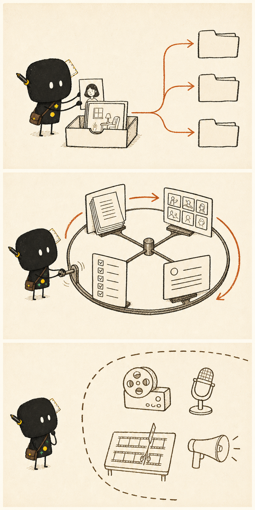
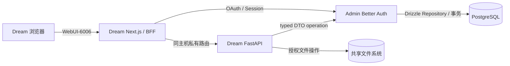

<!-- [Input] 现行 Story Workspace 设计、业务 PRD、前端导航、包清单与环境模板。 -->
<!-- [Output] 带图产品介绍、用户流程、运维安装与明确的功能启用边界。 -->
<!-- [Pos] 仓库中文入口；与 README.md 保持结构、命令及事实一致。 -->
<!-- [Sync] 2026-10-09: 按 Chat、Dream 和 Decks 重写介绍与配图，保留当前安装及验收边界。 -->

# Ink & Memory Dream

<p align="center">
  <a href="README.md">English</a> · 中文
</p>

**把对话、创作项目和可复用 Agent 团队放在一起的 AI 工作空间。** 从 Chat 开始，在 Dream 中推进创作，用 Decks 组织指令、工具和资源。保存的对话、工作区文件与项目产物帮助你回到同一份工作继续。


*依据[现行导航设计](docs/design/story-workspace/product-scope-and-navigation.md)绘制的产品关系图，用来解释功能关系，不是实际运行截图。*

## 可以做什么

| 功能区域 | 可以完成的工作 | 设计依据 |
| --- | --- | --- |
| **Chat 对话** | 选择模型和 Agent，添加附件，查看流式回复与工具反馈，搜索历史并定位较早轮次。Agent 工作时可继续排队输入、调整方向，或把待处理消息移至独立聊天。 | [Chat 首页](<docs/prd/Chat Dashboard.md>)、[输入队列](docs/prd/chat/queued-input.md)、[轮次导航](docs/prd/chat/turn-navigation.md) |
| **Dream / 创作工作台** | 启动或重新进入创作项目，在共享人物、场景和分集产物旁与 Agent 协作；阅读已到达的大纲、剧本、分镜和审阅报告。Dream 与 Chat 共用同一段对话。 | [Dream 重入](docs/design/story-workspace/dream-workspace-and-reentry.md)、[Project / Episode 工作台](docs/design/story-workspace/project-and-episode-workbench.md) |
| **Decks 卡组与 Agent** | 将指令、Agent、工具、资源和 Claude Plugin 组织成可复用团队。注册用户默认获得“剧本创作团队”和“音乐创作”系统 Deck 的可编辑副本。 | [Deck 设计索引](docs/design/deck/README.md) |
| **任务与活动** | 查看已创建任务、子智能体、计划和待办，打开关联聊天及任务详情；活动铃铛在同一侧栏汇集优先级事项和历史。 | [任务与进度](docs/prd/chat/task-activity.md)、[优先级活动](docs/prd/chat/priority-activity.md) |
| **日历** | 按选中日期切换定时任务、日记和 Notion，编辑周期、执行模型及会话模式，查看结果并打开对应聊天。 | [日历](docs/prd/calendar/calendar-right-panel-tabs-prd.md)、[定时任务](docs/prd/scheduled-tasks/codex-repeat-and-run-options.md) |
| **文件与资源连接** | 使用当前 Thread 工作区的文件，预览支持的报告和图片，在设置中连接选定的 Notion 资源或受管 MCP 工具。 | [文件存储](docs/design/file-storage/README.md)、[Notion 连接器](docs/prd/notion-session/resource-connector.md) |

主导航是 **Chat → Dream → Decks**。**更多**保留写作、时间线和回顾；设置管理语言、主题、模型与资源。界面沿用暖纸[色彩系统](docs/prd/color_system/README.md)，针对窄屏调整工作区布局。当前浏览器在登录及刷新后保留语言和主题，详见[设置设计](docs/design/story-workspace/settings.md)。

## 从想法到创作项目

1. **在 Chat 开始。** 登录后选择模型和 Deck/Agent，描述需求并添加参考文件；通过回复、工具活动和保存的对话追踪工作。
2. **复用团队。** 选择或编辑 Deck。“音乐创作”包含 YuE2 统筹、编曲师和作词师，使用 `yue2-skills`、`music-composition-skills`、`lyric-writing-skills` Marketplace。
3. **在 Dream 推进项目。** 启动或重新打开创作项目，在绑定的 Agent 对话中协作；查看共享资产及选中分集的产物，也可回到同一个 Thread 的 Chat。
4. **查看实际产物。** 阅读已有大纲、剧本、分镜和报告；缺失产物明确显示不可用。结果就绪后使用业务审阅及确认入口。
5. **回来继续。** 重新打开已保存的 Chat 或 Dream Run。页面加载只恢复状态，新模型轮次需要明确操作。重复性工作可在满足下方部署门槛后使用日历。

### 剧本创作流程

<p align="center">
  
</p>

*复用应用[创作指引](docs/design/story-workspace/project-and-episode-workbench.md#创作阶段指引)中的插图。画面从上到下对应三个阶段，最后一段表示未来方向。*

| 阶段 | 工作流程 | 可用范围 |
| --- | --- | --- |
| **项目共享资产** | `/drama-init` → `/drama-plan` → `/drama-asset`：建立项目、分集规划和可跨集复用的人物、场景。 | 使用已安装的剧本 Skills 及已授权的 Deck/工具。 |
| **逐集创作** | `/drama-script (EP01)` → `/drama-storyboard (EP01)` → `/drama-prompt (EP01)` → `/script-reviewer`：生成并审查当前分集产物。 | 工作台读取实际存在的产物，打开页面不会自动生成。 |
| **未来制作** | 渲染、配音、后期和宣发。 | **当前工作台尚未实现。** 指引仅展示制作方向。 |

### 连接自己的资源

在 **设置 → 资源链接**管理连接。使用 Notion 时，先授权账号，再选择 Agent 可以使用的资源并同步索引。Chat 展示已保存的资源摘要，日历从所选索引读取日期元数据。索引同步与正文读取是两个动作：Agent 按需获取已授权内容。详见[连接器设计](docs/design/notion-session/connector-interaction.md)。

受管 MCP 连接提供扩展工具。兼容 MCP Apps 已有技术预览 Host，但当前公开设置仍是 **`productionAppsEffective=false`**；公开 App 渲染仍关闭，普通工具结果可使用。详见[MCP Apps 接入设计](docs/design/claude-mcp/mcp-apps-integration-strategy.md)。

## 功能可用状态

设计稿定义目标行为，源码、已部署 capability 和验收证据共同决定实际可用范围。

| 功能 | 当前边界 |
| --- | --- |
| Chat 输入队列与独立任务 | 依赖 Admin Drizzle 0064–0066 发布的 `dream.chat-input-queue.v1` / `dream.chat-task-session.v2` capability；运行 owner 控制目前要求同一 Dream 进程。[任务与进度](docs/prd/chat/task-activity.md)说明关联 Thread 和返回来源入口。 |
| 定时任务 | 代码支持一次、每天、间隔、每小时及每周规则；日历提供每小时、每天、工作日、每周和自定义预设，可选择执行模型，以及继续来源聊天或每次新建聊天。依赖 Admin Drizzle 0077 的 v3 capability 和精确操作合同。[最近记录的真实业务回执](docs/design/scheduled-tasks/codex-repeat-and-run-options-real-e2e.md)仍需在权限修复加载后复验正常服务中的成功模型执行。 |
| Notion 同步增量 | 既有连接器与索引读取已实现；新增归属/接受版本路径已通过隔离技术检查，正常 capability 发布、旧 writer drain 及服务切换仍待完成，见[接入回执](docs/exec/notion-sync-ownership-dream-integration-20261007.md)。 |
| MCP Apps | 仅技术预览，公开 App 渲染关闭。 |
| Chat 原生图片生成/编辑；剧本渲染、配音、后期及宣发 | 尚未作为当前产品功能交付；既有文件/图片预览不代表已具备生成能力。 |

## 打开正在运行的实例

在 AutoDL 控制台打开正在运行的实例，选择 **WebUI-6006**。从 Dream 登录卡进入；Admin 完成密码或 Google 认证后返回 Dream。登录后的默认入口为 Chat。

实例变化时公网主机名会变化，请使用控制台当前的 WebUI 链接。**WebUI-6008**是独立的 Admin 运维后台。

| 入口 | 内部监听 | 用途 |
| --- | --- | --- |
| **WebUI-6006** | Next.js `127.0.0.1:6006` | Dream 页面、同源认证/BFF 与 API 路由 |
| Dream 后端 | FastAPI `127.0.0.1:8765` | 私有 Agent Runtime、SSE、业务编排与文件 |
| **WebUI-6008** | Admin `127.0.0.1:6008` | 运维后台、认证、数据接口与 Gateway |
| 嵌入式 PostgreSQL | `54329` | 私有的 Admin 持久化；Dream 不持有数据库凭据 |

重启后入口不可用时，按[AutoDL 恢复手册](docs/deploy/autodl-recovery.md)处理。[2026-09-18 发布回执](docs/exec/exec_autodl_release_20260918.md)记录当次部署，不表示后续全部功能已经验收。其他平台状态由[部署矩阵](deploy/README.md)维护。

## 认证与数据边界

Admin 是认证中心和唯一生产数据库访问服务。Dream 通过 typed DTO client 调用具名且带版本的 Admin operation；Admin Service 与 typed Drizzle Repository 负责权限、事务、锁与持久化。

Dream 产品用户与 Admin 运维账号属于不同业务身份。登录 Dream 不会获得 Admin 管理权限。Google 是 Admin Better Auth 的外部身份来源；Dream 业务接口不接受 Google token 或任意用户 ID 请求头。

Dream 继续负责产品路由、Agent Runtime、EventBus、SSE、turn/resume/cancel 行为与授权后的共享文件操作。Dream 不持有 PostgreSQL 密码，不存在生产 SQL/ORM 路径、migration、runtime DDL 或数据库 fallback。Admin Drizzle 是唯一 Schema 与 migration 权威。


```mermaid
flowchart LR
  Browser["Dream 浏览器"] -->|"WebUI-6006"| Next["Dream Next.js / BFF"]
  Next -->|"同主机私有路由"| FastAPI["Dream FastAPI"]
  Next -->|"OAuth / Session"| Admin["Admin Better Auth"]
  FastAPI -->|"typed DTO operation"| Admin
  Admin -->|"Drizzle Repository / 事务"| PG[("PostgreSQL")]
  FastAPI -->|"授权文件操作"| FS[("共享文件系统")]
```

## 本机运行

### 环境要求

- Dream `develop` 分支；Admin `main` 分支
- Python `>=3.12` 与 `uv`
- Node.js `>=22 <25`、Corepack 与 `pnpm@10.28.1`
- Admin 与 Dream 位于相邻目录
- 原生 Runtime 主机：macOS 或 Linux，arm64 或 x64；registry 验证器拒绝其他目标

```bash
git clone --branch develop https://github.com/glide-the/im-dream.git ink-dream-memory
git clone --branch main https://github.com/glide-the/dream-im-platform.git ink-admin-memory
```

为新安装准备 Admin、嵌入式 PostgreSQL、Gateway 与服务身份。Migration 与 provisioning 写入已配置数据库，应使用预期安装目标；可重复的 migration 测试必须使用具名、可删除的隔离数据库：

```bash
cd ink-admin-memory
pnpm install
pnpm env:setup
pnpm env:check
pnpm db:migrate
pnpm db:migrate:check
pnpm product:provision-local-dream
pnpm gateway:provision-local-dream
pnpm local:stable
```

安装 Dream 与精确版本 Runtime：

```bash
cd ../ink-dream-memory/backend
uv sync --frozen
npm install --global @glide-the/ink-claude-code-dream@0.1.10
npm install --global ntn@0.15.1
command -v ink-claude-code-dream
ink-claude-code-dream --version
ntn --version

# Verify the SDK and manifest-qualified normal PATH Runtime.
uv run python - <<'PY_RUNTIME'
from libs.claude_agent_kit.server.sdk_env import (
    require_dream_claude_sdk_distribution,
    resolve_claude_cli_path,
)
sdk = require_dream_claude_sdk_distribution()
cli = resolve_claude_cli_path()
if cli is None:
    raise SystemExit('Dream Runtime is missing from PATH')
print(f'SDK: {sdk.version}')
print(f'Qualified Runtime: {cli}')
PY_RUNTIME

cd ../frontend
corepack enable
corepack pnpm install --frozen-lockfile
```

Runtime 必须输出 `2.1.241 (Claude Code)`。`uv` 管理 Python SDK，npm 管理原生 Runtime 与 Notion CLI，pnpm 管理 Web workspace；`uv sync` 不会安装 Runtime。

根据[backend/.env.example](backend/.env.example)和[frontend/.env.example](frontend/.env.example)创建 `backend/.env` 与 `frontend/.env.local`。配置明确的 Admin origin/issuer、Dream resource 以及已注册的 service/BFF identity。Dream env 不得包含 `DATABASE_URL` 或 Provider secret。

公开浏览器 origin、OAuth callback、issuer/resource 统一使用 `localhost`，与前端模板一致；私有 Python 监听可使用 `127.0.0.1`。

<details>
<summary>Notion 元数据、同步与日记响应配置</summary>

选中独立页面同步和快照今天更新项的远程元数据读取要求在 `backend/.env` 配置服务器所有的 `INK_NOTION_TODAY_API_VERSION=2026-03-11`，模板已显式设置。loopback 请求头捕获确认固定的 `ntn@0.15.1` 默认请求和显式 `--notion-version` 均发送该日期，见[503 修复回执](docs/exec/notion-today-503-repair-20261006.md)。已有 env 文件须补此键并重启所拥有的 Dream 后端，因为配置在启动时读取。程序没有兜底日期：缺失或非法配置返回 HTTP 503 和 `detail.error_code=NOTION_API_VERSION_UNCONFIGURED`，此时连接列表和快照读取仍可成功。`INK_NOTION_ALLOWED_URL_HOSTS` 配置精确的 HTTPS 目的地主机，默认值见 `backend/.env.example`。这些配置用于远程元数据校验；真实账户的上游兼容性与[隔离技术回执](docs/exec/calendar-right-panel-tabs-implementation-20261005.md)分开验收。

选择 Notion 数据库后，已同步的数据库页面行进入日历候选索引，无需逐行手动选择。重启 Dream 不会重建持久化索引。旧索引缺上游创建/编辑时间时，进入 Notion 设置 → 管理已挂载来源 → 立即同步，然后刷新日历；该操作沿用现有仅同步元数据的入口。

新的 Notion 手动同步、首次选择同步和策略同步消费端要求精确的 `dream.notion-sync-ownership.v1` capability，以及固定的 request/claim/renew/finish 四操作。Admin 负责执行领取、续租与原子接受快照；Dream 随后缓存接受版本。日历、facade 读取和新 Thread 投影在缓存缺失时通过现有 Admin 读取恢复，并校验完整接受身份及仅含元数据的结构。Chat turn 不通过此索引路径触发 Notion 同步或正文下载。缺执行能力时新同步写入关闭，既有读取仍兼容。2026-10-07 集成回执记录正常 Admin 目录尚缺这些操作和 capability；正常库迁移、旧 writer 排空与 claim 启用仍是发布前置。不使用 runtime DDL 或按时间强制接管。详见[集成回执](docs/exec/notion-sync-ownership-dream-integration-20261007.md)及[正式连接器设计](docs/design/notion-session/connector-interaction.md)。

</details>

分别启动拥有的服务：

```bash
# Dream backend
cd ink-dream-memory/backend
uv run uvicorn server:app --host 127.0.0.1 --port 8765

# Dream frontend
cd ink-dream-memory/frontend
INK_BACKEND_INTERNAL_URL=http://127.0.0.1:8765 NEXT_PUBLIC_WS_BASE_URL=ws://127.0.0.1:8765 corepack pnpm run dev --hostname 127.0.0.1 --port 5173
```

Dream 地址为 [Dream](http://localhost:5173)，Admin 地址为 [Admin](http://localhost:3000/admin)。

## 支持版本与所有权

| 组件 | 当前合同 |
| --- | --- |
| Dream metadata | backend `0.1.4`、frontend `0.0.4`、API schema `2.0.0` |
| Next.js / React | `16.1.6` / `19.1.0` |
| Python SDK | `ink-claude-dream-agent-sdk==0.2.145` |
| 原生 Runtime | `@glide-the/ink-claude-code-dream@0.1.10` |
| Runtime compatibility | `2.1.241 (Claude Code)` |
| Notion CLI | `ntn@0.15.1` |
| 认证、PostgreSQL、Drizzle、Gateway、计费 | Admin 仓库 |
| Dream Web、Runtime、SSE、Thread/Run 与文件 | 本仓库 |

## 构建与验证

```bash
# Backend provider-free suite
PYTHONPATH=backend uv run --native-tls --project backend --frozen \
  --with pytest==9.1.1 --with pytest-asyncio \
  python -m pytest backend/tests -q

# Frontend checks
corepack pnpm --dir frontend exec tsc --noEmit --incremental false
corepack pnpm --dir frontend lint
NODE_ENV=production corepack pnpm --dir frontend build

# Published SDK/Runtime identity
python3 scripts/verify_claude_registry_release.py \
  --sdk-version 0.2.145 \
  --runtime-version 0.1.10 \
  --expected-cli-version '2.1.241 (Claude Code)'
```

Provider-free 检查证明确定性合同。真实 Google、模型与业务验收必须使用正常 Dream/Admin/Gateway/PostgreSQL 服务和已授权真实账号。

## 故障排查与运维边界

- **WebUI 返回 404 或无法打开：** 先确认 AutoDL 实例已运行，再按[恢复手册](docs/deploy/autodl-recovery.md)检查；不要新增隧道或硬编码当前公网主机名。
- **Unable to check your session：** 验证两个 WebUI 映射，先检查 Admin，并确认 issuer、Dream origin/resource 与 callback 都来自当前实例。
- **日记检索返回 `session_projection_unavailable` / `ADMIN_RESPONSE_INVALID`：** 元数据读取成功而正文读取失败时，应先核对服务器响应容量，不能仅凭错误码判断字段不匹配。后端模板显式设置 `INK_ADMIN_DREAM_MAX_RESPONSE_BYTES=16777216`（16 MiB）；未配置这个可选项时，代码仍采用 1 MiB。Admin HTTP 与私有 Session broker 共用这一字节上限。全文读取发生在 fuzzy 排序和 `limit` 之前，因此较小的结果数量限制不会减少输入正文。已有后端配置需要明确设置容量，并由进程所有者重启后端；后续 turn 才会取得新的 broker 上限。严格响应结构及请求编号校验保持生效。见[日记检索修复回执](docs/exec/agent-diary-retrieval-capacity-repair-20261006.md)。
- **`ADMIN_SERVICE_AUTH_UNAVAILABLE` 或 `ADMIN_TIMEOUT`：** 先验证 Admin 与 PostgreSQL，再重启 Dream；Dream 不得回退数据库连接。
- **Runtime 未通过 production qualification：** 核对 `command -v ink-claude-code-dream`、package-root `cli.js`、相邻 manifest、Runtime `0.1.10`、compatibility `2.1.241` 与必需 capability。
- **`uv sync` 删除 pytest：** 使用上面的临时 `uv run --with pytest...` 命令，或单独评审开发依赖。
- **Chat 提示 Token allowance 不足：** Gateway 拒绝模型 reservation 前，用户消息已保存。先在 Admin 修正订阅/模型额度，重新加载 Thread 后再决定是否发送。
- **Chat 提示消息队列不可用：** 检查目标 Admin PostgreSQL 是否存在 `chat_input_queue`、`chat_task_session` 及 `dream.chat-input-queue.v1` / `dream.chat-task-session.v2` schema capability。Admin Drizzle 迁移 0064–0066 提供这些能力；获准将迁移应用到目标数据库前，Dream 会保留草稿并拒绝排队。隔离数据库中的 provider-free 测试通过不代表正常业务数据库可用。
- **Chat 返回 `GATEWAY_API_KEY_INVALID`：** Dream service key 与 Admin 当前 active canonical-subject Gateway key 不匹配。AutoDL 现在会在替换运行环境前阻断 sync 和 qualified。必须通过 Admin 所有的发布操作恢复或轮换 Key，仅重启 Dream 以重新读取私有环境，然后完整重跑真实 `create Thread -> POST /api/claude-agent -> SSE` 验收后才能发布。
- **MCP App 没有显示：**公开 App 渲染仍关闭（`productionAppsEffective=false`）。检查连接和工具可用性；普通工具结果仍可使用。

不得提交 secret、对话正文或用户工作区内容。浏览器输入、用户 env、Deck、Plugin 和工作区设置不能覆盖服务器所有的模型/资源配置。Thread 临时文件使用服务器绑定的 `{AGENT_CWD}/{thread_id}/.claude-tmp`，不得将边界扩大到 `/tmp`。

`CLAUDE_CODE_CLI_PATH` 仅用于明确评审的绝对路径回滚，不能掩盖旧 PATH；Dream 不会静默选择 ambient `claude` 或 SDK 内置 CLI。应用回滚不会反向执行 Admin 数据库 migration。详见[SDK/Runtime 接入与回滚](docs/deploy/claude-sdk-runtime-packaging-and-integration.md)。

发送链路发布必须经过**创建 Thread → `POST /api/claude-agent` → 鉴权模型目录 → 接受 SSE**，规则见[Agent.md](Agent.md#8-claude-agent-send-path-release-gate)。测试只能清理自己命名的进程、端口和临时资源，浏览器检查复用兼容的已安装 Chrome。除非要求清理，保留正常业务 Run 与日志。

## 文档

| 主题 | 入口 |
| --- | --- |
| 现行产品设计 | [Story Workspace](docs/design/story-workspace/README.md)、[Decks](docs/design/deck/README.md)、[Chat PRD](docs/prd/chat/.folder.md) |
| 日历与重复任务 | [日历 PRD](docs/prd/calendar/calendar-right-panel-tabs-prd.md)、[定时任务设计](docs/design/scheduled-tasks/codex-repeat-and-run-options.md) |
| 资源与工具 | [Notion 连接器](docs/prd/notion-session/resource-connector.md)、[MCP Apps](docs/design/claude-mcp/mcp-apps-integration-strategy.md) |
| 架构与认证 | [项目架构](docs/architecture/项目架构设计说明.md)、[Admin 认证/数据合同](docs/architecture/admin-auth-data-interaction.md)、[后端 API](backend/API.md) |
| 安装与部署 | [平台状态](deploy/README.md)、[AutoDL](deploy/autodl-ssh/README.md)、[AutoDL 恢复](docs/deploy/autodl-recovery.md) |
| 仓库与 Agent 规则 | [仓库维护](Agent.md)、[Agent 行为](docs/Agent.md)、[规则索引](docs/rules/README.md) |
