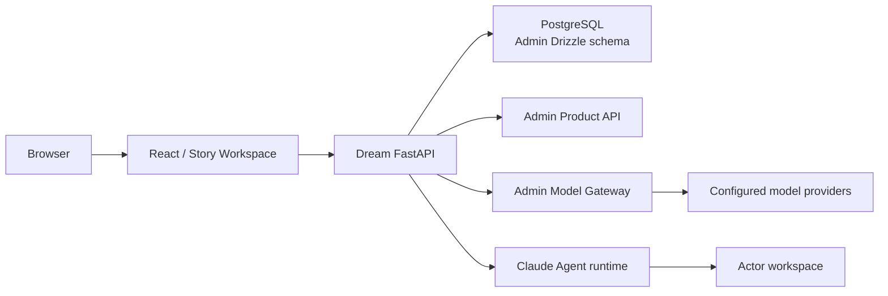

<!-- [Input] Current deployment topology, Admin contracts, and Dream runtime boundaries. -->
<!-- [Output] Concise current system architecture and data ownership. -->
<!-- [Pos] Canonical cross-module architecture reference. -->

# 当前系统架构

Ink & Memory 由 React/Vite 前端和 FastAPI 后端组成；Admin 是独立控制面，统一拥有 PostgreSQL
Schema、产品订阅、模型目录、Provider 凭据、定价和 Gateway Token 账本。

## 边界

- Browser 只提交用户操作和公开 DTO，不提交服务身份、Provider、数据库或权限覆盖字段。
- Dream 负责认证会话、Writing/Chat/Dream/Deck 业务适配、工作区与 Agent runtime。
- Admin 负责共享 Schema migration、Product API、Gateway、模型资格、额度和计费。
- Claude Agent runtime 由 Chat 和 Dream 共用；Thread 是对话、恢复、工具确认和 Stop 的唯一会话边界。
- 对象存储保存文件对象，PostgreSQL 保存业务引用和状态；工作区文件不直接替代业务数据库。

## 数据协议

共享 PostgreSQL Schema 只能由 Admin 仓库 `drizzle/**` 通过前向 migration 发布。Dream 启动时检查
明确 capability；缺少 capability 时关闭对应功能，不执行 Alembic、runtime DDL 或 SQLite fallback。

跨版本变更遵循 expand → Dream 双版本兼容 → backfill/validate → contract。Dream 的 schema importer
只处理明确的数据导入，不成为运行时建表入口。

## 安全协议

- 用户身份来自 Session/Bearer Token；服务间 Product/Gateway JWT 与 Service Key 只存在于服务端私有环境。
- Workspace 和临时目录必须解析为服务端允许的真实绝对路径，拒绝符号链接或相对路径逃逸。
- 写操作执行权限、Origin、版本/revision 和所有权校验；读接口不做隐式修复写入。
- 所有部署环境使用同一生产业务路径；测试差异只能通过公开入口、依赖注入和隔离资源表达。

业务模块与代码所有权见 [当前业务设计](../design/README.md)，部署拓扑见 [部署文档](../deploy/README.md)。
