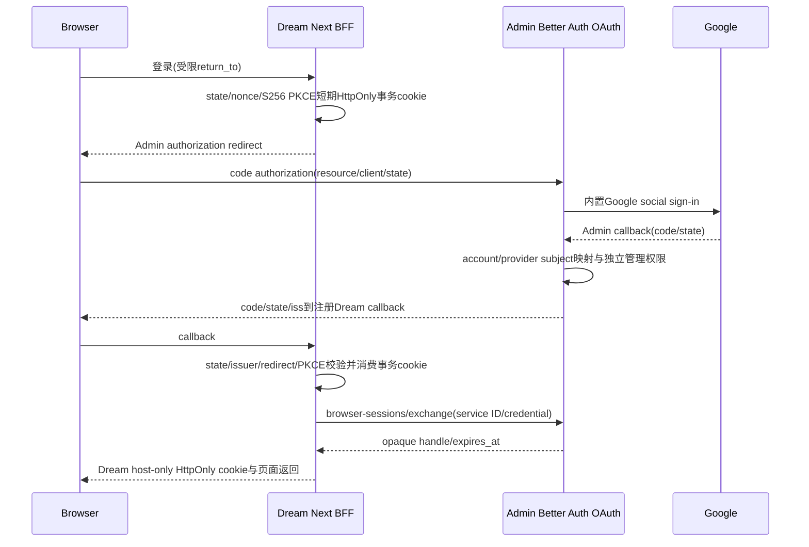
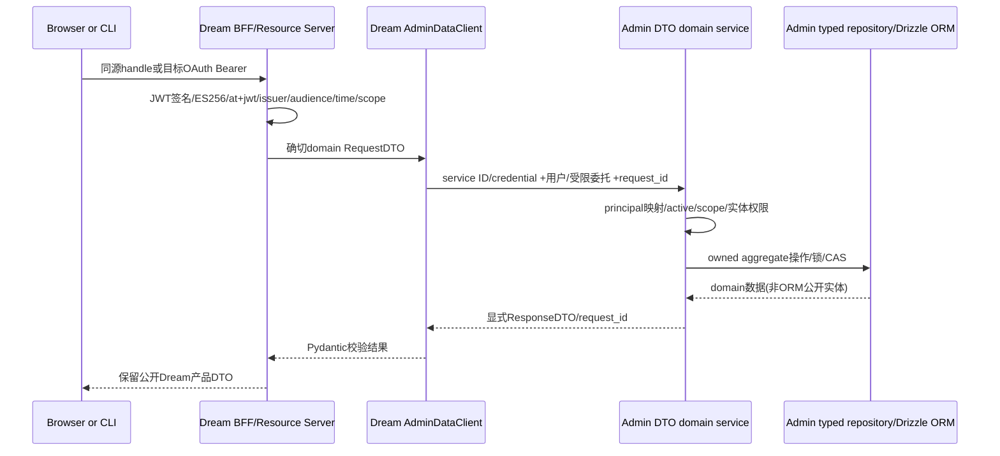
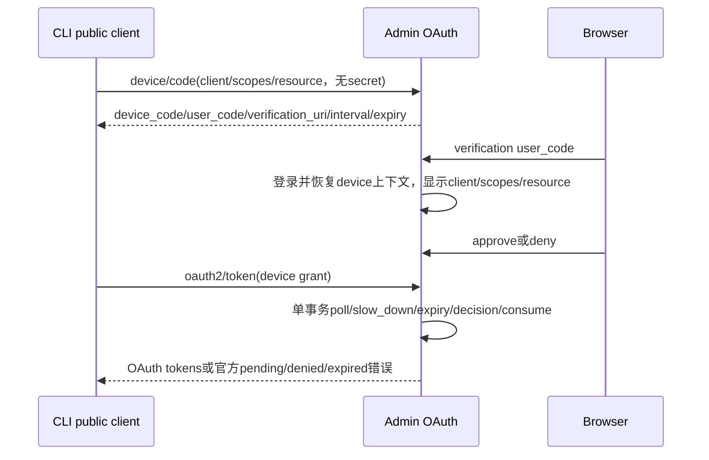
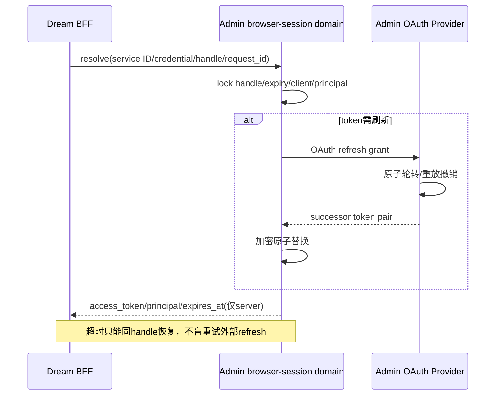
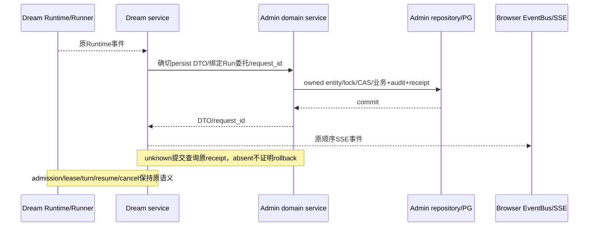
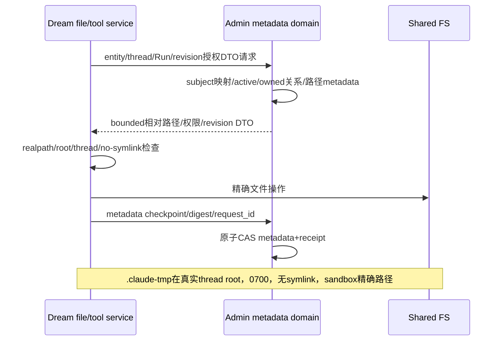

<!-- [Input] Admin canonical design v0.1, Dream entry/transaction scans and actual consumer DTO code. -->
<!-- [Output] Dream implementation review, six cross-project flows, state/failure and release gates. -->
<!-- [Pos] Dream consumer architecture; Admin owns API/DTO/domain/repository/ORM contracts. -->
<!-- [Sync] 2026-09-14: review the target before production integration; capabilities not yet published. -->

# Dream / Admin 认证与数据交互

## 背景与问题

Dream baseline `7d38715c` 的 Python/Next 架构保留，但 Python 登录 authority与全部生产DB访问移Admin。当前扫描108文件候选、835 SQL片段、159事务候选，见[清单](../exec/dream-admin-data-inventory.md)和[事务图](../exec/dream-admin-transaction-boundaries.json)。字符串片段与候选调用不等于全部可达SQL，后续必须补调用链和动态入口复查。

本稿是目标与具体评审表。Admin规范v0.1是设计状态；运行能力尚未发布。Dream现阶段已有统一[客户端](../../backend/services/admin_data/client.py)、[严格DTO](../../backend/services/admin_data/models.py)与[JWT验证器](../../backend/services/admin_data/jwt_verifier.py)，未接入生产路由/后台，不据局部源码声称迁移完成。

## 目标与边界

[Admin唯一规范](/Users/dmeck/.codex/worktrees/729f/ink-admin-memory/docs/architecture/admin-dream-auth-data-contract.md)定义API/DTO/operation/capability。Dream仅消费确切DTO并用Pydantic严格校验；Admin Request/Response DTO → domain service → typed repository → Drizzle ORM，ORM实体与公开DTO显式投影分离。不能把database函数RPC、PostgresRow、表列模型或远程逐statement transaction包装为HTTP。每个原事务组合变为明确业务操作，保留原公开Dream DTO/状态。

Next页面、FastAPI编排、Agent Runtime、Runner/ThreadFactory/service/EventBus/SSE、turn/resume/cancel、资源admission算法/比较/顺序与既有lease不改。共享FS仍Dream执行规范路径操作，Admin持有metadata与数据权限。Dream无生产PG凭据/连接库/SQL/pool/UOW/DDL路径；独立importer/技术fixture不得自动成为runtime依赖。

## 概念与规则

### 逐项设计评审

| 事项 | 现有证据/冲突 | 实现责任与调整 | 完成证据 |
| --- | --- | --- | --- |
| 认证authority | Authlib/HS256/默认secret/滑动renewal在Dream | Admin Better Auth/OAuth/JWKS；Dream Resource Server+BFF | 旧authority静态复查、Google/JWT/refresh生产入口 |
| 密码/注册产品能力 | AuthContext已有login/register，认证迁移不授权删功能 | Admin保留密码哈希/账户映射/注册并恢复OAuth上下文，Dream保留产品入口 | 既有密码登录、注册正常/失败与无旧JWT签发 |
| 数据访问 | database/独立Notion/MCP/Product pools与159事务候选 | Admin领域DTO/ORM单事务；Dream统一typed client/adapters | 每入口映射DTO/API/repository/commit/验证 |
| 服务与用户身份 | 旧任意actor env/服务HS256投影 | Admin client registry限定后台scopes；服务ID与credential两头、用户Bearer分开 | 权限拒绝/无actor override/后台tool委托 |
| BA与业务PK | BA sub为opaque ID，users.id仍业务PK | Admin显式subject_links；principal canonical_user_id十进制string | 映射/禁用/FK/billing验证，无邮箱自动合并 |
| 长turn | 用户access最多300s，后台持久化不能因过期丢事件 | Admin绑定subject/thread/run/scopes/service/client的opaque delegation与renew | 续期/禁用/权限/未知提交、不改cancel/lease |
| browser handle | Dream无DB，不能内存伪装durable session | Admin encrypted handle store，同client transaction/input绑定、refresh行锁 | PKCE/CSRF/并发refresh/原handle恢复 |
| Voice/REST/SSE | Browser bases可直达8765，Next无upgrade handler | Dream同源BFF；Voice受限upgrade/proxy委托 | 同源Cookie/origin与真实WS入口验证 |
| 写恢复 | HTTP超时不证明Admin事务rollback | request_id绑定输入摘要，业务+receipt单commit | 同键同值/异值/并发/unknown response/absent不重建ID |
| 资源与Runtime | PG policy/provider/observer，server-ownedRuntime调参 | API独立provider/sink，LKG和模型metadata所有权保留 | monotonic revision/精确memory/global effort/最终model |
| FS/metadata | tool和service直接SQL +共享FS | Admin授权DTO/CAS/checkpoint；Dream realpath/no-symlink/实体绑定 | 写文件未知metadata恢复与thread tmp精确路径 |

### Google登录（目标流程，BFF未接生产）

### Dream API → Admin领域数据

### Device OAuth（不能用Session兑换）

### Refresh（只在Admin保管token）

### Agent持久化与原SSE

### 共享FS与metadata

### 配置与状态

资源`default`由Dream配置提供，`desired`仅Admin持久化，`effective/revision`由Dream独立provider/composition的LKG拥有。合法更高revision替换；同rev同值仅diagnostics，同rev异值/回滚invalid；unavailable保留LKG。四值为JSON/TS正安全整数，组合memory bytes精确，不能把技术边界包装成产品配额或用0关闭保护。turn主路径不加policy HTTP查询。

`global effort`来自policy LKG；compact/context/model max output来自最终选中的Admin模型，未配置不注入，用户/parent/workspace/env不可覆盖。`ai_models.max_output_tokens`只投影vendor-scoped CLI capability。`CLAUDE_CODE_TMPDIR={AGENT_CWD}/{thread_id}/.claude-tmp`、真实thread/0700/no-symlink/关闭Workspace Mode行为与sandbox精确路径全部保留。

## 验收、发布与回滚

关联协调的[测试前完整影响表](/Users/dmeck/project/ink-dream-memory/docs/stage/stage_admin-auth-data-business-validation.md)，本任务为每入口补实际DTO/接口/repository/测试mapping，不复制冲突方案。Luna仅确定性技术验证；真实业务使用正常本机Dream/Admin/Gateway/PG与已授权现有账户数据，按正常model catalog限次，留下正常Admin可见Run/结算。凭据由协调保管，不复制至消息/文档/日志。

运行新Admin migration/backfill/破坏性测试仍只允许具名隔离DB并核验身份；数据授权不解除此边界。发布顺序expand → Dream兼容 → backfill/validate → contract， capability只代表实际已实现操作和Drizzle收据，不代替ACL/Schema物理迁移回执。回滚保留前向DDL/receipt，不复活已撤销旧token。全域覆盖、同源WS/REST/SSE、认证设备refresh、长turn委托与数据恢复未闭合时保持goal active。

## 首批生产资源接入事实

`agent_factory`、`resource_policy.load` 和 `resource_postgres_sink._write_sync` 已改为Admin HTTP依赖，两个领域方法移除直接SQL。Admin提供真实双向contract SHA256：read `1559c28cd5fbfbbf1b01a35fe6853ba5ccec2f26f45a428ac26ce22d005b3c78`，publish `409dfce5218c0471d9612016305698bba7388eb8d37c34be40b50b10488c1114`，版本均1；运行时须匹配capabilities广告，候选hash不是发布证明。正常读取返回严格状态DTO；非法desired保留LKG，网络/权限/capability/响应漂移不会应用配置。后台observer unknown写仅原request_id receipt恢复，未找到回执不重发、不越过旧写。Agent admission/revision/lease/SSE和共享FS合同不变。其他领域和认证切换仍未闭合。

## Runtime 环境阶段事实

新增Admin/Auth服务器秘密由SDK最终merge空值tombstone和内部/外部stdio MCP显式env过滤保护，server os.environ原值保持，二次merge不能复活。确切键/执行模块/正常失败流程见 [SDK环境设计](../design/claude-agent/claude-sdk-env-design.md#8-adminauth-服务器秘密与子进程边界)。现有Gateway helper和Editor DATABASE_URL仍需Admin长期委托/领域DTO替换；这项保护不是完整无PG/无全局凭据验收。
