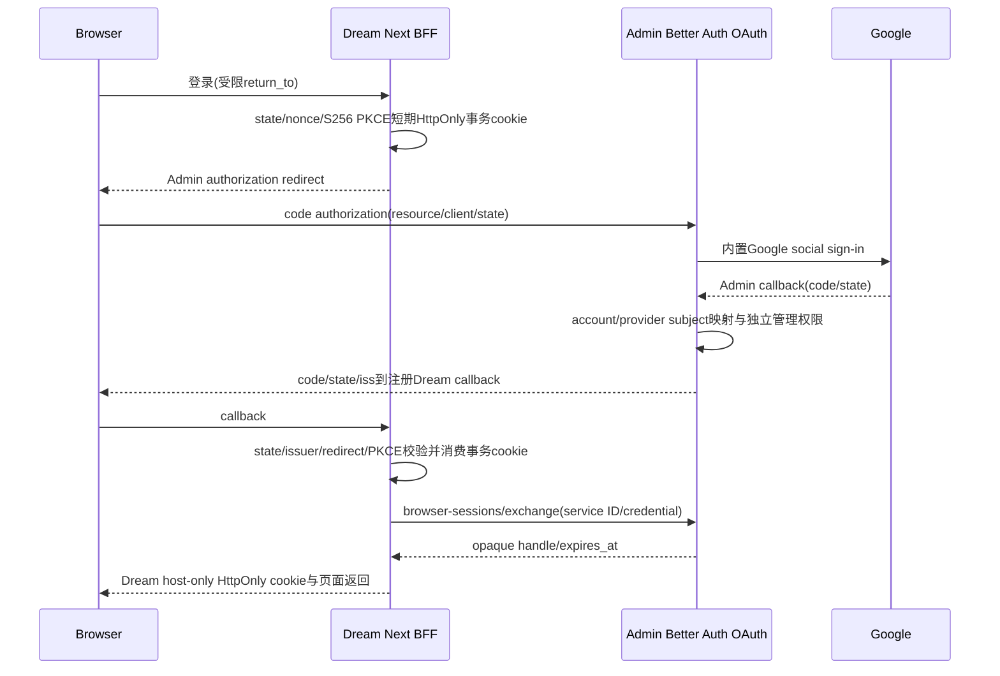
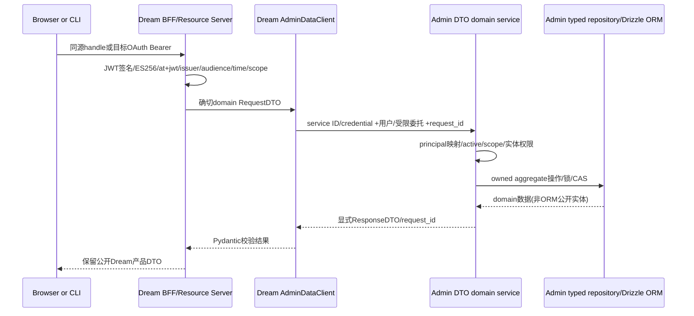
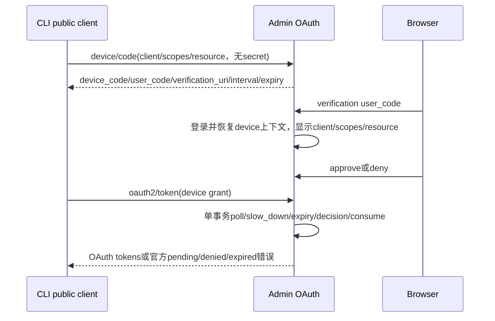
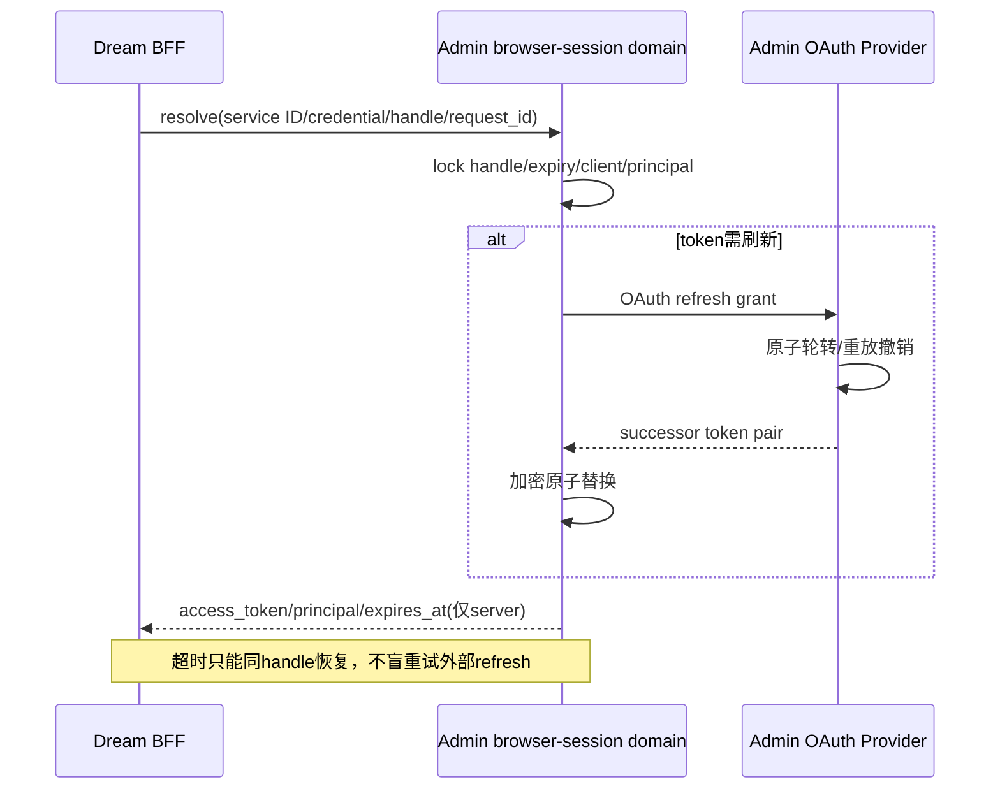
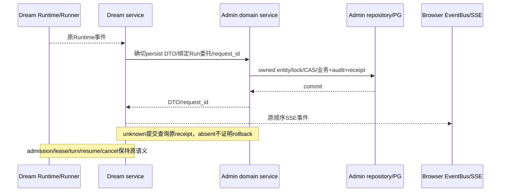
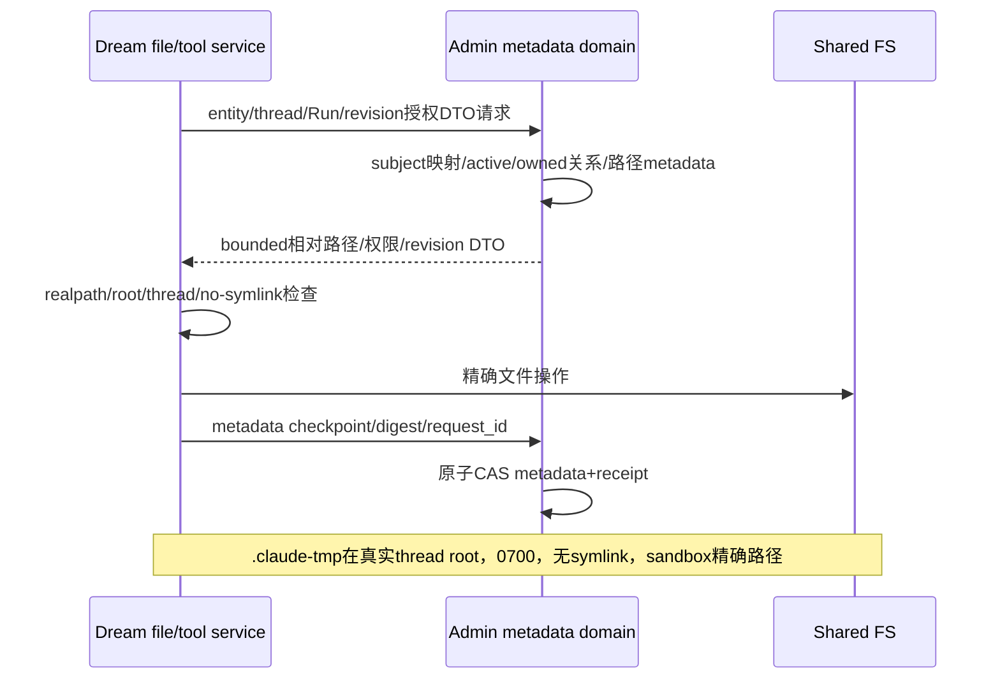

<!-- [Sync] 2026-09-15: public assistant complete/partial writes use the bound turn owner; internal dispatcher SQL remains open. -->
<!-- [Sync] 2026-09-15: record complete Admin Deck list modes and remaining SQL source candidates. -->
<!-- [Sync] 2026-09-15: record unregistered Run create/retry and original hidden-source dispatch ordering. -->
<!-- [Sync] 2026-09-15: record Admin-owned Deck detail and unchanged legacy Memory projection. -->
<!-- [Sync] 2026-09-15: index five Admin Deck writes, shared schema gate and closed deletion feedback. -->
<!-- [Sync] 2026-09-15: define Voice current OAuth/Memory/optional fields and mutation receipts. -->
<!-- [Sync] 2026-09-15: define social identity, policy, original errors and unknown receipts. -->
<!-- [Sync] 2026-09-15: specify shared catalog synchronization, failed refresh and per-request concurrent dispatch. -->
<!-- [Sync] 2026-09-15: specify prepare/local verification/source recheck and unknown refs writes. -->
<!-- [Sync] 2026-09-15: specify abort/read identity and success-only logout snapshot ownership. -->
<!-- [Input] Admin canonical design v0.1, Dream entry/transaction scans and actual consumer DTO code. -->
<!-- [Output] Dream implementation review, six cross-project flows, state/failure and release gates. -->
<!-- [Pos] Dream consumer architecture; Admin owns API/DTO/domain/repository/ORM contracts. -->
<!-- [Sync] 2026-09-15: define resource HTTP owner drain and final shutdown ordering. -->
<!-- [Sync] 2026-09-15: define preference raw object projection, NULL merge and unknown-save recovery. -->
<!-- [Sync] 2026-09-15: define OAuth-only Deck version consumers, four exact capabilities and unknown commit handling. -->
<!-- [Sync] 2026-09-15: specify bound Thread/SDK Session operations, mutable confirmation reuse and scoped unknown recovery. -->
<!-- [Sync] 2026-09-15: specify public Session projection/events and reusable closed Editor state DTOs. -->
<!-- [Sync] 2026-09-15: specify atomic raw user persistence, short-lock renewal and terminal/cancel cleanup. -->
<!-- [Sync] 2026-09-15: record standalone authority refusal and named script account validation; preserve outstanding domain gates. -->
<!-- [Sync] 2026-09-14: record actual BFF/Browser, request identity, Chat/resource consumers and pending Runtime/full-domain gates. -->

# Dream / Admin 认证与数据交互

共享Client以同一catalog锁覆盖readiness、完整refresh与operation广告检查，调用方不会读取加载期间的空广告。fresh成功后按exact合同判断；失败仍清空ready/广告，下一RequestAuth重新加载。领域HTTP在短检查锁外执行，DTO/token/request_id只属于该请求；多个refresh按获取锁顺序完成，不互相覆盖。receipt维持原二态、原UUID且不自动重发。

公开好友九操作只用current OAuth与identity/unified exact gate，Admin从subject确定actor，URL仅选择friend/request。Admin唯一执行邀请码policy/pair与code锁/状态转换/原receipt；Dream保留公开int PK/nullable微秒/label/thumbnail/full字段、closed业务400、timeline null403/full falsey404。写unknown原UUID只查receipt，无retry；旧database九helper在I/O前拒绝，其它图片/import/后台SQL未据此关闭。完整功能规则与验收见[好友现行稿](../design/social-friendship-current.md)。

公开Voice四mutation只持current OAuth，exact四schema/actualhash；create optional→requirednullable，update原None省略/emptyfalsezero保留，Python rawMemory数值与原sort规则不经JS重编码。Admin执行defaults/order/ownedDeck-Voice锁/内容与thread/draft语义/TX回执；changed:false原404/closed create-fork原400，unknown原UUID无retry。Editor present-fields serializer提取共享base，Editor nullable检查不变。完整规则见[Voice现行稿](../design/voice-crud-current.md)。

公开Deck update/delete/publish/collect/sync使用五项当前OAuth Admin写操作与four exact schema。Admin执行锁、字段比较/draft、发布切换/parent detach、收藏复制/计数、同步及原receipt单事务；Dream保留None省略/空falsezero与原结果/status，不再预读发布或拆分收藏。错误详情按code仅保留Version两revision或Delete四reason；unknown原UUID无retry。详见[Deck写操作现行稿](../design/deck-mutations-current.md)。

## 背景与问题

Dream baseline `7d38715c` 的 Python/Next 架构保留，但 Python 登录 authority与全部生产DB访问移Admin。当前扫描108文件候选、835 SQL片段、159事务候选，见[清单](../exec/dream-admin-data-inventory.md)和[事务图](../exec/dream-admin-transaction-boundaries.json)。字符串片段与候选调用不等于全部可达SQL，后续必须补调用链和动态入口复查。

本稿包含目标、评审与当前实现范围。Dream统一[客户端](../../backend/services/admin_data/client.py)、[严格DTO](../../backend/services/admin_data/models.py)与[JWT验证器](../../backend/services/admin_data/jwt_verifier.py)已接入Resource后台、共享请求身份/profile和Chat CRUD/history/ownership/初始message预留；Next BFF与Browser同源session已实现并通过类型/构建技术检查。Runtime server-persistence consumer/keeper已接公开user-turn、assistant完整/部分消息与Factory生命周期，CLI/Editor、内部dispatcher与其余后台持久化仍待接；旧Dream issuer已退役，其余数据库领域与正常本机真实业务验收尚未完成；候选source/isolated proof不能代替正常部署能力。

## 目标与边界

[Admin唯一规范](/Users/dmeck/.codex/worktrees/729f/ink-admin-memory/docs/architecture/admin-dream-auth-data-contract.md)定义API/DTO/operation/capability。Dream仅消费确切DTO并用Pydantic严格校验；Admin Request/Response DTO → domain service → typed repository → Drizzle ORM，ORM实体与公开DTO显式投影分离。不能把database函数RPC、PostgresRow、表列模型或远程逐statement transaction包装为HTTP。每个原事务组合变为明确业务操作，保留原公开Dream DTO/状态。

Next页面、FastAPI编排、Agent Runtime、Runner/ThreadFactory/service/EventBus/SSE、turn/resume/cancel、资源admission算法/比较/顺序与既有lease不改。共享FS仍Dream执行规范路径操作，Admin持有metadata与数据权限。Dream无生产PG凭据/连接库/SQL/pool/UOW/DDL路径；独立importer/技术fixture不得自动成为runtime依赖。

## 概念与规则

### 逐项设计评审

| 事项 | 现有证据/冲突 | 实现责任与调整 | 完成证据 |
| --- | --- | --- | --- |
| 认证authority | Authlib/HS256/默认secret/滑动renewal在Dream | Admin Better Auth/OAuth/JWKS；Dream Resource Server+BFF | 旧authority静态复查、Google/JWT/refresh生产入口 |
| 密码/注册产品能力 | AuthContext已有login/register，认证迁移不授权删功能 | Admin保留密码哈希/账户映射/注册并恢复OAuth上下文，Dream保留产品入口 | 既有密码登录、注册正常/失败与无旧JWT签发 |
| 数据访问 | database/独立Notion/MCP/Product pools与159事务候选 | Admin领域DTO/ORM单事务；Dream统一typed client/adapters | 每入口映射DTO/API/repository/commit/验证 |
| 服务与用户身份 | 旧任意actor env/服务HS256投影 | Admin client registry限定后台scopes；服务ID与credential两头、用户Bearer分开 | 权限拒绝/无actor override/后台tool委托 |
| BA与业务PK | BA sub为opaque ID，users.id仍业务PK | Admin显式subject_links；principal canonical_user_id十进制string | 映射/禁用/FK/billing验证，无邮箱自动合并 |
| 长turn | 用户access最多300s，后台持久化不能因过期丢事件 | Admin绑定subject/thread/run/scopes/service/client的opaque delegation与renew | 续期/禁用/权限/未知提交、不改cancel/lease |
| browser handle | Dream无DB，不能内存伪装durable session | Admin encrypted handle store，同client transaction/input绑定、refresh行锁 | PKCE/CSRF/并发refresh/原handle恢复 |
| REST/SSE/Voice | Browser bases可直达8765，Next无upgrade handler | REST/SSE经Dream同源BFF；现有speech-recognition WS固定关闭1008 | 同源Cookie/origin与流代理验证；不启用ASR |
| 写恢复 | HTTP超时不证明Admin事务rollback | request_id绑定输入摘要，业务+receipt单commit | 同键同值/异值/并发/unknown response/absent不重建ID |
| 资源与Runtime | PG policy/provider/observer，server-ownedRuntime调参 | API独立provider/sink，LKG和模型metadata所有权保留 | monotonic revision/精确memory/global effort/最终model |
| FS/metadata | tool和service直接SQL +共享FS | Admin授权DTO/CAS/checkpoint；Dream realpath/no-symlink/实体绑定 | 写文件未知metadata恢复与thread tmp精确路径 |

### Google登录（BFF已实现，正常本机Google待验收）

### Dream API → Admin领域数据

### Device OAuth（不能用Session兑换）

### Refresh（只在Admin保管token）

### Agent持久化与原SSE

### 共享FS与metadata

### 配置与状态

资源`default`由Dream配置提供，`desired`仅Admin持久化，`effective/revision`由Dream独立provider/composition的LKG拥有。合法更高revision替换；同rev同值仅diagnostics，同rev异值/回滚invalid；unavailable保留LKG。四值为JSON/TS正安全整数，组合memory bytes精确，不能把技术边界包装成产品配额或用0关闭保护。turn主路径不加policy HTTP查询。

`global effort`来自policy LKG；compact/context/model max output来自最终选中的Admin模型，未配置不注入，用户/parent/workspace/env不可覆盖。`ai_models.max_output_tokens`只投影vendor-scoped CLI capability。`CLAUDE_CODE_TMPDIR={AGENT_CWD}/{thread_id}/.claude-tmp`、真实thread/0700/no-symlink/关闭Workspace Mode行为与sandbox精确路径全部保留。

## 验收、发布与回滚

关联协调的[测试前完整影响表](/Users/dmeck/project/ink-dream-memory/docs/stage/stage_admin-auth-data-business-validation.md)，本任务为每入口补实际DTO/接口/repository/测试mapping，不复制冲突方案。Luna仅确定性技术验证；真实业务使用正常本机Dream/Admin/Gateway/PG与已授权现有账户数据，按正常model catalog限次，留下正常Admin可见Run/结算。凭据由协调保管，不复制至消息/文档/日志。

运行新Admin migration/backfill/破坏性测试仍只允许具名隔离DB并核验身份；数据授权不解除此边界。发布顺序expand → Dream兼容 → backfill/validate → contract， capability只代表实际已实现操作和Drizzle收据，不代替ACL/Schema物理迁移回执。回滚保留前向DDL/receipt，不复活已撤销旧token。全域覆盖、同源WS/REST/SSE、认证设备refresh、长turn委托与数据恢复未闭合时保持goal active。

## 首批生产资源接入事实

`agent_factory`、`resource_policy.load` 和 `resource_postgres_sink._write_sync` 已改为Admin HTTP依赖，两个领域方法移除直接SQL。Admin提供真实双向contract SHA256：read `1559c28cd5fbfbbf1b01a35fe6853ba5ccec2f26f45a428ac26ce22d005b3c78`，publish `409dfce5218c0471d9612016305698bba7388eb8d37c34be40b50b10488c1114`，版本均1；运行时须匹配capabilities广告，候选hash不是发布证明。正常读取返回严格状态DTO；非法desired保留LKG，网络/权限/capability/响应漂移不会应用配置。后台observer unknown写仅原request_id receipt恢复，未找到回执不重发、不越过旧写。Agent admission/revision/lease/SSE和共享FS合同不变。其他领域和认证切换仍未闭合。

### 资源 HTTP owner 当前生命周期

背景与问题：refresher/sink取消后，已经dispatch的同步HTTP可能仍在完成；关闭transport不能与该请求并发。目标与边界：只关闭resource composition拥有的独立client，不改变LKG、revision、resource算法、queue或Agent lease，shared request-auth owner仍有自己的生命周期。

概念与规则：AdminResourceData的read_policy/publish_observer/close共用原writer活动锁，整个capabilities/operation/receipt I/O在锁内。close等待已进入的操作，设closed后关闭client，重复close幂等；关闭后读写在创建client或HTTP前返回safe配置错误，provider按原unavailable规则保留fallback/LKG，不传播turn。未知observer write的原UUID记录保留，关闭不查receipt、不重发。

server先按原顺序stop publisher/refresher/sink/sampler，再Factory.aclose，随后asyncio.to_thread(resource_data.close)，最后Redis、数据库和shared request-auth关闭。各owner异常继续原安全日志与后续释放；即使sink已有detached同步调用，活动锁也等待其完成。测试用actual adapter/MockTransport/Event/明确命名ownedthreads覆盖active read/write drain、closed/no reopen/idempotence和provider fallback；shutdown测试仅编译原production注册函数并注入owner，避免full server的其它Runtime/DB初始化，不复制关闭实现。全域startup与正常业务验收仍开放。

## Runtime 环境阶段事实

新增Admin/Auth服务器秘密由SDK最终merge空值tombstone和内部/外部stdio MCP显式env过滤保护，server os.environ原值保持，二次merge不能复活。确切键/执行模块/正常失败流程见 [SDK环境设计](../design/claude-agent/claude-sdk-env-design.md#8-adminauth-服务器秘密与子进程边界)。现有Gateway helper和Editor DATABASE_URL仍需Admin长期委托/领域DTO替换；这项保护不是完整无PG/无全局凭据验收。

### Browser session 异步状态

唯一browserSession owner保存immutable public snapshot，CSRF仅由该snapshot导出。read开始使用对象identity，每个fetch/body await与失败检查当前identity/AbortSignal；旧成功、401、parse错误或transport错误返回null且不修改当前owner。clear/logout开始失效旧read，logout失败仍保留snapshot，strict成功clear也失效期间read。AuthContext异步commit额外检查snapshot identity，旧null不能覆盖新session。deferred HTTP/body技术测试不启真实Browser/server/模型，保持同源Cookie/CSRF和Apps显式headers合同。

## Thread/message 消费端阶段事实

14个Admin实际输入输出/hash已写入严格Chat DTO与typed consumer，actor token与原request_id显式提供。微秒ISO字符串校验后原样保持，canonical用户ID不按BA sub猜测。原Python最终正文校验已抽为 `backend/chat_message_projection.py`，database旧私有alias和新Message DTO调用同一函数；生成器未复制其规则。消息回复ID还必须匹配原显式message_id，否则写结果保持unknown并用原receipt恢复。

Chat router的create/get/list/search/delete、bind Deck/select Voice与message list/page/process-detail/latest、初始user-message预留和公开turn assistant回写已接typed consumer；现有搜索器、公开parts投影和微秒/NULL游标保持。共享请求身份与me profile已接入Admin。内部dispatcher persist/title/session与Deck context/settings等剩余直接DB入口未闭合；14个DTO不代表全域迁移完成。

## 当前用户资料与请求 actor 的接入状态

Admin `user-profile.current` 的闭集输入为空，输出仅当前调用主体的profile；Dream [typed consumer](../../backend/services/admin_data/profile_data.py)保留既有公开字段和微秒ISO字符串。canonical ID来自principal，与profile ID逐项比对，OAuth subject不转换为用户ID。profile不可通过runtime grant读取，不暴露token或密码字段。

[请求认证owner](../../backend/services/admin_data/request_auth.py)验证JWT scope，再向Admin读取active principal，要求subject/client/scopes一致，生成不可变server-owned actor。生产async依赖在线程池执行HTTP I/O，并在请求state显式保存actor；共享`get_current_user`与storage/workspace复用同一依赖，没有cookie/query token或旧JWT renewal fallback。composition root在已有业务owners关闭后释放自有client/verifier。token非法401、scope不足403、Admin配置/网络/DTO失败503；profile ID不一致按无效上游响应处理，禁止回查Dream PG。旧签发入口和long-turn/tool接入仍待完成，不代表认证产品全链路迁移完成。

## BFF API 请求规则

Next运行时auth与API Route Handler接入同一私有BFF owner，旧generic API/auth/OAuth rewrites已移除。Browser handle cookie存在时只解析该handle，非法、重复或空cookie直接401，不采用附带Bearer；所有Browser写须exact Origin与handle-bound CSRF。无handle cookie的Device/native请求只接受显式OAuth Bearer，Python验证Admin签名/scope/principal；Origin存在时仍须exact match。请求Cookie、服务/actor覆盖头、代理身份头及响应cookie/renewal credential不转发；URL token/access_token拒绝400。共享HTTP transport复用原Claude代理body/abort/SSE flush，不新增parser/EventBus。Browser state与显式MCP Apps已接同一session/CSRF owner；候选源码与技术构建并非正常部署或真实业务证明。

## Browser 与构建阶段事实

AuthContext现从同源BFF session读取strict公开user与内存CSRF；登录注册单一入口进入Admin同页email/signup/Google UI，device entry转Admin device UI。37个Browser API/hook/Chat/XHR模块与明确Node Apps adapter采用该owner，文件URL回到当前origin且去除旧token。静态旧getter/storage读取/Bearer写/options.token均0，full frontend typecheck与production Next build已通过。仍需受影响业务journey与真实模型验收；旧Dream authority已退役，其余数据域/后台grant仍未闭合。Chat initial user reserve采用下方原子user-turn命令与server-persistence委托，沿用原identity与409/unknown回执，不使用短OAuth token承担后台persist。

### Runtime purpose consumer 的当前边界

Admin以`auth.delegations`单独返回create/renew/revoke/原request_id receipt的method、path、版本与实际双向DTO hash；只在三项identity以及0033 `dream.schema.unified.v1` 全部published且匹配时广告。Dream server create同时检查这四项schema与四descriptor，调用独立create入口，不通过generic operation模拟。ID沿用非空text业务字段，不增加任意长度产品限制。

共有HTTP函数接收显式URL/header/DTO和timeout/响应大小，不持有身份配置。Internal consumer注入service身份与必要用户Bearer；public Runtime consumer只持exact idg，prepared request不继承httpx client的Cookie、auth或默认key headers。响应校验原request_id、闭集DTO和purpose/thread/run/EditorSession/scopes；renew不能改变maximum或降低expiry。

Server keeper在expiry前运行后台renew。响应丢失保留原ID，后续先查原receipt；absent继续保持pending，不新建动作。恢复原committed结果后仍以有效expiry判断是否可用，maximum不延长；到期或purpose不匹配时授权边界拒绝。后台异常只写安全diagnostics，不传播到Agent turn。当前仅consumer/keeper候选源码；Agent生命周期、CLI最小投影、Editor stdio和Workflow原确认保护接入仍未完成。

旧Dream password/Google/Device/token与Python local-cookie logout九条HTTP路径已改为明确410标准Admin authority迁移响应，不解析/转发敏感请求、不执行签发或相关DB动作。Standalone旧auth helpers已拒绝本地签发/密码/refresh权限，两个脚本改为显式Admin OAuth并核对正常生产profile账户；Authlib/bcrypt从manifest/lock/export原子移除，其余版本不变。Gateway subject helper、Agent purpose接线与其他数据库领域仍待迁移；MCP SDK外部OAuth协议保持。此项不等于正常本机登录/模型验收。

### 公开 Chat 的 Workflow 上下文

执行模块`AdminWorkflowData`只发送`workflow-context.resolve`的`{thread_id}`；Admin在同一事务校验唯一线性retry leaf、冻结binding、workspace owner和启动message来源/fingerprint/父状态，经过完整校验的terminal leaf或普通Chat返回`context:null`。Dream strict校验实际十字段、required nullable agent_id、原255边界、Run格式和正JSON-safe revision，operation hash为`f395682ec6cf8f308df652a1aa2792cca86d102eb1fff62a4c6a59792bfc1e66`，同时匹配identity/unified物理capabilities。

公开route在已有Deck/Voice绑定后、message预留与SSE前读取。409/权限/网络/capability/DTO失败直接返回安全错误，不写初始message、不启动runtime。成功时校验thread及当前Deck/Voice，并向内部RunRequest注入不可变`AdminWorkflowResolution`；公开DTO/SDK不含该字段。Service核对actor/thread，含ordinary null均直接复用，不调用旧PG mapper。snapshot不授予新增scope、长期runtime或CLI权限；内部confirmation/launch仍保留原guard/mapper，后续迁移其typed原子命令与三purpose生命周期。验收聚焦真实HTTP consumer、null/十字段、错配、失败-before-SSE和既有Service行为，技术fixture不代表正常本机业务回执。

### 原子 user-turn 与 server-persistence 生命周期

`chat-user-message.persist`的input仅`thread_id/message_id/parts_json/metadata_json/title_candidate`；metadata required nullable，JSON保持Python float、负零、大整数表示，禁NaN/非JSON对象。Dream复用原`extract_text_from_parts`得到包含attachments协议的未截断candidate；Admin在单一事务执行ownedThread update lock、stored confirmation guard，保护当前dispatch lease/control metadata，非confirmation时写rawmessage并按原配置仅填missing title。output仅`message_id/confirmation_preserved`，actualhash `2c5b20900ef867a237613e49a89b4073f4c0c89cd1d2161962f7132084696c37`。

公开ingress在已验证Workflow上下文后以当前OAuth创建最小server-persistence idg：仅dream read/write、exactthread、authoritativeRun或普通null、无EditorSession。`AdminTurnPersistence`只在server保存该grant/typedclient；初始原子预留成功后Service复用同输入的已知result，不再拆三次DB调用或重发。unknown保留原UUID，后续只查原receipt；absent或读取失败继续阻止新写/推理，不能认为取消/超时表示rollback。reply message ID错配按unknown处理。内部confirmation/launch尚未连接其服务身份，继续执行原guard，不借公开迁移删除保护。

Factory在原admission acquire之后启动该owner的独立renewal，EventBus/Runner/lease/resume/cancel顺序保留。SSE disconnect只取消subscription，后台turn及grant继续；terminal/cancel注册自有Phase4 cleanup，先等待已dispatch同步writer，再停止/等待renewal线程并关闭独立Runtime client，application client仍由composition关闭。Keeper network action与current/diagnostics短锁分离；expiry/max/purpose/actor/thread边界拒绝，不扩大授权。此server grant不进入CLI/Editor env、SDK或Browser；Gateway/Editor独立目的、内部dispatcher assistant/后台Session上下文和其他数据库领域仍需迁移。验收使用实际public route/Service/Factory与明确clock/MockTransport，覆盖unknown原ID、disconnect/cancel/drain、numeric/title和current不等待HTTP；未据此宣称正常本机模型验收。

### 公开 Agent Thread 恢复与 SDK Session 回写

执行模块`ClaudeAgentService._thread_record/_save_sdk_session`在公开request含server owner时复用`AdminTurnPersistence`，调用实际`chat-thread.get/update-session`；只有缺owner的现存内部dispatcher保留原PG入口。读取仅发送thread_id并核对reply Thread与canonical actor；更新只发送thread_id/claude_session_id/agent_contract_version，grant不进入Runtime options。恢复仍执行原当前project transcript与contract版本检查；只有SDK-native init触发early write，final/repair使用同一helper，不改变取消/SSE/lease顺序。

owner在单一activity锁中串行user/session/assistant命令及Thread读取，Phase4等待已dispatch的读写。未知写记录原operation/immutable input/request ID；不同操作或输入拒绝，已知user缓存也不能绕过pending。同操作同输入只能查原receipt，absent/读取失败继续unknown，committed恢复结果且不POST重试。Session是可变字段，只有最近一次确认的同输入更新可复用；A→B→A重新执行命令，user message identity冲突保持409。

初始user预留unknown仍在SSE/推理前拒绝。SDK init回写unknown保留原callback日志处理，已经运行的turn与cancel继续既有路径，随后owner管理的不同写被拒绝；公开assistant已进入该屏障，内部dispatcher assistant、Run与FS metadata数据库写仍不经过此owner，因此当前不是全域未知写屏障。验收通过actual Service/native SystemMessage/next-turn transcript/cancel和MockTransport/Thread DB fence，不代表正常本机数据库或模型验收。

### 公开 assistant 完整与部分消息持久化

背景与问题：公开Chat已经在RunRequest携带绑定当前actor、Thread与authoritative Run的`AdminTurnPersistence`，但成功assistant与cancel/error partial仍由Service直接调用旧`database.save_chat_message`。用户能够收到SSE终态而消息回写仍绕过Admin数据边界，且该写没有加入user/Session已建立的unknown提交屏障。

目标与边界：`ClaudeAgentService`继续按原SSE事件生成reasoning/tool/text parts、`turnStatus`、`finalPartIndex`、duration、usage、model、toolCount与Dream source metadata；公开request把同一值交给owner，owner调用既有`chat-message.persist`。完整消息带原`history_final_text/history_process_available/history_projection_version`，partial保持`null/false/null`。消息ID由Dream服务器生成，不能复用user message ID或SSE turn ID。内部dispatcher尚无authoritative owner，继续使用原SQL入口；本阶段不新增凭据、接口、数据库表、Runner状态或文件行为。

正常流程与状态：owner先取得当前renewed grant，重新读取catalog并逐项匹配identity、unified、history keyset与final projection四项schema，再提交required八字段DTO。Admin只接受`assistant`角色并返回同一message ID；确认后owner清除pending。成功assistant仍先提交再运行Dream Hook，SDK final safeguard仍在assistant确认后执行。cancel/error仅在收集到parts时写一条`is_partial=true`消息；无可持久化事件时保持原no-op。

失败反馈：actor或Thread与grant不匹配时在I/O前拒绝；schema缺失、重复或hash漂移返回503且不发消息POST。HTTP超时或回复ID/null/额外字段错误保留原operation、完整input与request ID，阻止后续不同user、Session或assistant写；只有相同输入查询原receipt，absent继续unknown，committed核对message ID后恢复，不重发。partial沿用原日志与吞错行为，完整assistant沿用`ClaudeAgentAssistantPersistenceError`并阻止后续Hook；这些规则不把取消解释为数据库回滚。

影响与验收：公开Service路径不得打开PG，parts/metadata/history构造、错误/取消、SDK顺序、admission/lease/Factory/Runner/EventBus/SSE、共享FS与`.claude-tmp`协议保持。provider-free验收覆盖完整/partial三种终态、四schema故障、reply错配、unknown跨操作阻断与原receipt恢复；normal本机账户、PG、模型、Runtime和Admin可见业务记录仍需独立验收。

### 公开 Session 与 Editor 状态边界

Admin `session.save/get/batch/list/text-list/delete`六operation负责owned Session持久化、state/writingThread绑定、name/labels null保留、UTC范围与排序。Dream复用闭集EditorEngine state DTO，覆盖text/widget/suggestion Cells、commentors/tasks/weight；optional在wire省略，只有selectedState可显式null，required nullable字段保留。有限JSON数值与微秒ISO按实际合同校验；错误state/ID/额外字段在I/O前返回安全400，Admin状态损坏返回503，missing get保持404。

公开Session走同一已认证request actor/OAuth与shared threadpool/error adapter，无外部user ID。metadata list移除内部text:null，Dream保留时区date_key、mixed-word metrics与aggregate响应；空batch不发domain request。update/delete收到confirmed result才publish原user-scoped Edit Session event；unknown保留原request ID，不retry、不发event，业务状态按原receipt确认。此Session合同不接受Thread server-persistence grant，后台ContextBuilder/Session tools尚待独立合同，不能投影Editor或扩大purpose绕过权限。公开HTTP/DTO/DB-fenced技术验收不代表正常账户业务验收。

### 公开 Deck 内容版本边界

`AdminDeckVersionData`消费state/preview/commit/history/detail五operation；当前request OAuth独立于Runtime purposes，Admin拒绝Thread grant作为Deck管理授权。Dream在domain调用前匹配identity/unified/content-versions/canonical-storage四项exact v1与operation hash，缺失/重复/错误version或hash时503；Admin继续逐事务验证物理ledger、principal/owner、CAS与输入。共享actor/threadpool adapter复用原权限规则，domain只定制安全JSON错误。

Admin负责snapshot/hash/diff、Deck锁、immutable append及latest/published revision同事务更新。Dream闭集校验v1 snapshot raw字符串，最终标准Python decode成原flat detail的snapshot dict；float/负零/bigint、required nullable、created_by公开int与微秒时间保持，不重算或改写canonical JSON。reply外层/nested Deck或selected version不匹配读503，commit按unknown处理。

commit的positive safe CAS与原description/limit合同保持。409 conflict只携带已校验current_draft_revision/current_version及固定安全message；已确认事务失败保留草稿/旧vN，网络/响应结果不明保留原UUID/outcome_unknown、不自动POST重试，absent不能证明rollback。catalog fresh fetch失败清除ready，下次共享身份重新加载，避免其他领域沿用空广告。公开五operation技术验收无Dream PG；其他Deck/Voice14、refs/voice6的actualFS/CLI证据、Runtime和内部content-version消费者继续开放，正常业务验收独立。

### 公开用户偏好边界

`AdminPreferencesData`消费user-preferences.get/save两个actualoperation，current OAuth、identity/unified exact schema与closed input由同一transport/actor adapter校验；Admin用户级Service拒绝全部idg管理授权。POST只允许五optional公共字段，转voice_configs_json/meta_prompt/state_config_json/selected_state/timezone五requirednullable wire；rawJSON用Python生成，不经JS重编码。null执行原COALESCE保留，{}与空字符串仍保存；不接受外部actor/firstlogin/systemconfig写。偏好route handler将typed请求校验失败转固定422，不回显正文/input，避免非finite输入在框架错误响应编码时失败。

GET null row仍{}；rawconfig还原原voice_configs/state_config对象，firstlogin整数/null只读，ISO offset/微秒保持。raw对象NaN/Infinity无法输出公共标准JSON时safe503/noheal。confirmed true返回原success；timeout/invalidwrite结果保留原UUID/outcome_unknown/no retry，不能由absent声明rollback。default-voices仍Dream config，System/Runtime策略/firstlogin/import/后台context仍独立；具体default/desired/effective/revision与状态见[现行稿](../design/user-preferences-current.md)，旧时序原文另存。actual公开DTO/DBfenced MockTransport是技术验收，与正常真实账户/模型验收分开。

### 公开Deck Claude Plugin refs

list/prepare/replace经当前OAuth与exactidentity/unified，拒绝全部entitygrant管理。prepared闭集installation无path，selectedIDs exact/unique/ready后由Dream原staticmethod验证制品摘要与CLI SemVer；body不接受package/digest/compat/actor。Admin按source evidence锁与重检当前ready/package/version/digest/rawcompat，在单TX refs/semanticdraft/receipt/audit，no-op/reorder不推进。Dream只校验replyDeck/IDs与原enabled0/1/ISO投影，unknown保留原UUID/no retry。共同scoped validation复用原偏好wrapper，固定422不回显正文；global install/catalog/runtime/Voice仍在清单开放。完整规则见[现行refs稿](../design/deck/deck-claude-plugin-refs-current.md)。

公开GET /api/decks/{deck_id}消费deck.detail/current OAuth，four exact schemas/hash，outer与每个Voice deck_id必须匹配。原null404/owner int/时间/Memory值保持；无read retry或DB fallback。实际Admin producer目前将empty Memory归null，与原Dream保留emptytext不同，仍需修正且不计该值真实验收完成。详见[Deck详情现行规则](../design/deck/deck-detail-version-history.md)。

### 尚未发布的Run创建/重试与隐藏来源

Admin prospective workflow-run.create/retry当前不在70 registry，发布冻结期间不能调用。create来源三字段要求全null或完整aware tuple；retry沿用原Run来源，不能替换。两输出保持完整WorkflowRun；源码/ingress PASS属于Admin报告，不能替代注册或公开业务验收。

隐藏来源必须沿用原执行顺序：Dream Application由verified actor/workspace/key canonical JSON确定UUIDv5 Thread/message；Admin未来领域事务在PF/Run前ensure_source，初始metadata不含workflowRunId。Run确认后原dispatch阶段的claim保存workflowRunId与dispatching，再调用turn dispatcher。持久化移Admin不改变该顺序、claim/lease/重入/失败或Runtime编排；实际source/dispatch capability未发布，消费端接线继续pending。

GET /api/decks的published false/true两mode均消费deck.list/current OAuth/dream:read与four exact schema/hash。Admin处理过滤/计数/排序/policy；user保留total_voice_count并省略author_display_name，community保留author_display_name并省略total_voice_count。无默认初始化/文件检查/DB fallback/read retry。详见[现行规则](../design/deck/deck-detail-version-history.md)。
