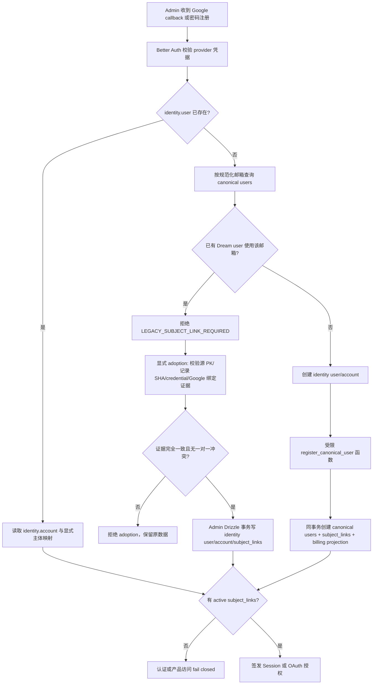
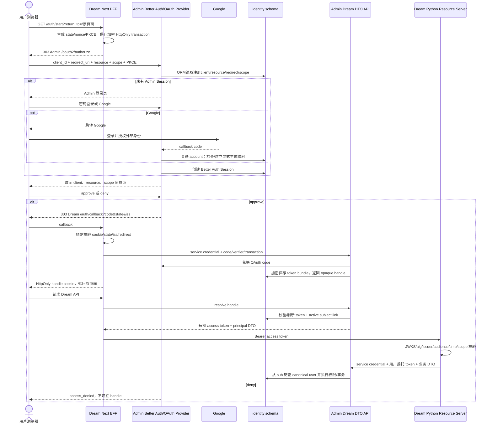
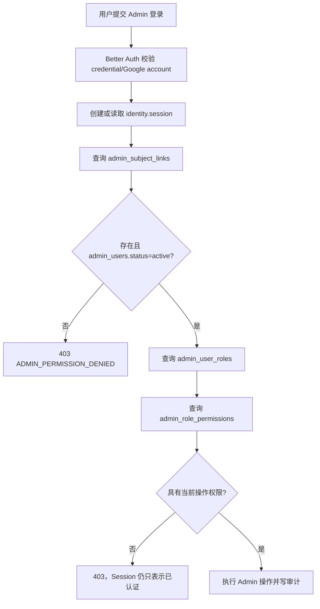
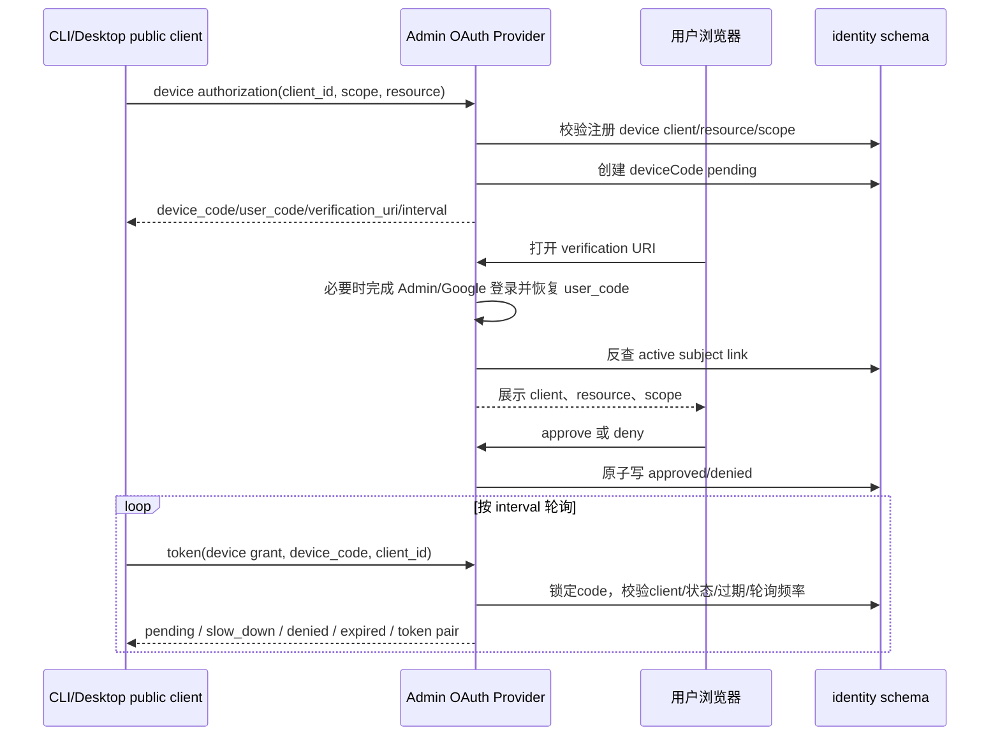

<!-- [Input] Admin Better Auth schema, canonical Dream user schema, Admin RBAC schema and current BFF/OAuth contracts. -->
<!-- [Output] Reviewable identity ER model and login/account-linking flow diagrams. -->
<!-- [Pos] Dream-side visual index; Admin remains the provider and database contract authority. -->
<!-- [Sync] 2026-09-16: document the unified identity model, conflict handling and browser/Admin/device flows. -->

# 登录认证体系：数据 ER 图与流程

## 1. 背景与问题

Admin 原有后台用户，Dream 原有业务用户。统一认证不能新建第二套 Dream 业务主体、改变既有业务主键，或把“邮箱相同”当作账户所有权证明。认证成功也不能自动授予 Admin 管理权限。

现行方案由 Admin Better Auth 统一产生协议身份、Account、Session 与 OAuth Token；Dream 原 `public.users` 继续作为业务主体真值。Admin 使用显式一对一映射连接协议身份与 Dream 主体，并使用另一条显式一对一映射连接协议身份与 Admin 成员。数据库 schema、约束和映射迁移都由 Admin Drizzle 管理。

提供方的完整接口、事务与数据库契约以 [Admin auth/data contract](https://github.com/glide-the/ink-admin-memory/blob/main/docs/architecture/admin-dream-auth-data-contract.md) 为准；本文件是 Dream 产品和评审使用的可视化索引。[认证主设计](./auth.md) 和 [Device Flow](./auth-device.md) 继续定义页面与调用行为。

## 2. 目标与边界

- `identity.user` 是 Better Auth 协议主体；它本身不等于 Dream 业务用户或 Admin 管理员。
- `public.users` 是现有 Dream canonical user；Deck、Thread、Run、订阅及权限继续引用原主键。
- `public.admin_users` 是 Admin 后台成员；角色与权限单独求值。
- `identity.subject_links` 和 `identity.admin_subject_links` 分别建立显式一对一关系。一个协议主体可以只有 Dream 关系、只有 Admin 关系，或两者都有。
- 相同邮箱只触发冲突检查。旧主体采用必须校验明确源记录、原主键和证据摘要；禁止自动合并。
- Dream 请求不提交任意 `user_id`。Admin 从已验证 OAuth `sub` 反查 `subject_links`，再在同一事务中执行实体权限过滤。
- Dream 浏览器只持有 HttpOnly opaque handle；Google token、OAuth access token 和 refresh token 不进入浏览器脚本。
- Admin 管理路由在 Session 认证之后继续检查 `admin_subject_links`、成员状态、角色和权限。

## 3. 概念与规则

| 概念 | 数据真值 | 用途 | 不能代表 |
| --- | --- | --- | --- |
| 协议身份 | `identity.user` | Better Auth 登录主体、`sub` | Dream 实体访问权、Admin 管理权 |
| 外部/密码账户 | `identity.account` | Google subject 或 credential 与协议身份的关系 | 根据相同邮箱自动合并 |
| 登录 Session | `identity.session` | Admin 登录页和授权页的浏览器会话 | Dream API OAuth access token |
| Dream 业务主体 | `public.users` | 原业务主键、内容所有权、订阅与历史 | Admin 成员 |
| Admin 成员 | `public.admin_users` | 后台成员状态、RBAC 起点 | 普通 Dream 产品访问 |
| Dream 主体映射 | `identity.subject_links` | `auth_user_id → canonical_user_id` | 任意客户端传入的 user ID |
| Admin 主体映射 | `identity.admin_subject_links` | `auth_user_id → admin_user_id` | 仅凭认证成功获得后台权限 |
| OAuth client/resource | `identity.oauthClient`、`oauthResource`、`oauthClientResource` | 注册 Dream browser/device public client、resource 与 scope | 动态注册或 client secret 打包 |
| Dream 浏览器句柄 | `identity.browser_sessions` | Admin 加密持有 token bundle，Dream BFF 使用 opaque handle | 浏览器可读 token |

`subject_links.auth_user_id` 是主键，`canonical_user_id` 也唯一；`admin_subject_links.auth_user_id` 是主键，`admin_user_id` 也唯一。因此同一个 Dream user 或 Admin member 不能被静默绑定给两个 Better Auth 主体。

### 3.1 旧 Dream 用户与 Admin 成员的冲突决策

| 旧数据事实 | 处理结果 | 登录与权限结果 |
| --- | --- | --- |
| 只有 Dream user | reviewed manifest 固定原 canonical PK/hash，建立 `identity.user + account + subject_links` | 可登录 Dream；没有 `admin_subject_links` 时 Admin 仍为 403 |
| 只有 Admin member | reviewed manifest 固定原 Admin PK/hash，建立 `identity.user + account + admin_subject_links` | 可登录 Admin 并继续检查 RBAC；没有 `subject_links` 时不能访问 Dream 业务数据 |
| Dream/Admin 同邮箱，两个旧 hash 可由同一明文凭据验证 | manifest 同时固定两个源记录摘要，选择一个原 hash 作为 Better Auth credential，建立两条映射 | 一个协议主体可进入两种产品；Dream ownership 与 Admin RBAC 仍分别求值 |
| Dream/Admin 同邮箱，但两个旧 hash 不可由同一凭据验证 | `ADOPTION_CREDENTIAL_CONFLICT`，不建立 identity、account 或映射 | 先完成可证明的 Google 绑定或显式 credential 恢复方案；禁止任选一侧 hash、覆盖另一侧或建立重复 email identity |
| 两条旧记录邮箱不同 | `ADOPTION_SEPARATE_IDENTITIES_REQUIRED` | 分别建立协议主体，不因角色或业务关系合并 |

本机指定验收账户当前属于“同邮箱、旧 hash 不同且现有口令证明未通过”分支，并且尚无 Better Auth user/account、Dream subject link 或 Admin subject link；因此密码登录返回 401 是预期结果，不是 DTO/ORM 数据接口故障。该账户保持原数据不变，直到具备可验证的关联证据。

## 4. 数据 ER 图

下面只画认证和授权直接依赖的物理关系。`deviceCode.clientId/oauthClientId` 由服务在协议事务中校验，但当前安装版本没有数据库外键，因此不伪画成物理 FK。

```mermaid
erDiagram
    IDENTITY_USER {
      text id PK
      text email UK
      boolean emailVerified
      timestamptz createdAt
    }
    IDENTITY_ACCOUNT {
      text id PK
      text userId FK
      text providerId
      text accountId
      text password
    }
    IDENTITY_SESSION {
      text id PK
      text userId FK
      text token UK
      timestamptz expiresAt
    }
    DREAM_USERS {
      bigint id PK
      text email UK
      text password_hash
      text status
    }
    SUBJECT_LINKS {
      text auth_user_id PK_FK
      bigint canonical_user_id UK_FK
      text evidence
    }
    ADMIN_USERS {
      text id PK
      text email UK
      text status
    }
    ADMIN_SUBJECT_LINKS {
      text auth_user_id PK_FK
      text admin_user_id UK_FK
    }
    ADMIN_ROLES {
      text id PK
      text code UK
    }
    ADMIN_PERMISSIONS {
      text id PK
      text code UK
    }
    ADMIN_USER_ROLES {
      text admin_user_id PK_FK
      text role_id PK_FK
    }
    ADMIN_ROLE_PERMISSIONS {
      text role_id PK_FK
      text permission_id PK_FK
    }
    OAUTH_CLIENT {
      text id PK
      text clientId UK
      text_array redirectUris
      text_array grantTypes
      text_array scopes
      text tokenEndpointAuthMethod
    }
    OAUTH_RESOURCE {
      text id PK
      text identifier UK
      text_array allowedScopes
      text signingAlgorithm
    }
    OAUTH_CLIENT_RESOURCE {
      text id PK
      text clientId UK_FK
      text resourceId UK_FK
    }
    OAUTH_CONSENT {
      text id PK
      text userId FK
      text clientId FK
      text_array scopes
    }
    OAUTH_ACCESS_TOKEN {
      text id PK
      text userId FK
      text clientId FK
      text_array resources
      text_array scopes
      timestamptz expiresAt
    }
    OAUTH_REFRESH_TOKEN {
      text id PK
      text userId FK
      text clientId FK
      text_array resources
      text_array scopes
      timestamptz revoked
    }
    BROWSER_SESSIONS {
      text handle_hash PK
      text auth_user_id FK
      text service_client_id
      text transaction_id UK
      text token_ciphertext
      text status
    }

    IDENTITY_USER ||--o{ IDENTITY_ACCOUNT : owns
    IDENTITY_USER ||--o{ IDENTITY_SESSION : has
    IDENTITY_USER ||--o| SUBJECT_LINKS : maps_to_Dream
    DREAM_USERS ||--o| SUBJECT_LINKS : has_protocol_identity
    IDENTITY_USER ||--o| ADMIN_SUBJECT_LINKS : maps_to_Admin
    ADMIN_USERS ||--o| ADMIN_SUBJECT_LINKS : has_protocol_identity
    ADMIN_USERS ||--o{ ADMIN_USER_ROLES : receives
    ADMIN_ROLES ||--o{ ADMIN_USER_ROLES : assigned
    ADMIN_ROLES ||--o{ ADMIN_ROLE_PERMISSIONS : grants
    ADMIN_PERMISSIONS ||--o{ ADMIN_ROLE_PERMISSIONS : included
    OAUTH_CLIENT ||--o{ OAUTH_CLIENT_RESOURCE : allowed_for
    OAUTH_RESOURCE ||--o{ OAUTH_CLIENT_RESOURCE : admits
    IDENTITY_USER ||--o{ OAUTH_CONSENT : approves
    OAUTH_CLIENT ||--o{ OAUTH_CONSENT : requests
    IDENTITY_USER ||--o{ OAUTH_ACCESS_TOKEN : delegated_subject
    OAUTH_CLIENT ||--o{ OAUTH_ACCESS_TOKEN : issued_to
    IDENTITY_USER ||--o{ OAUTH_REFRESH_TOKEN : delegated_subject
    OAUTH_CLIENT ||--o{ OAUTH_REFRESH_TOKEN : issued_to
    IDENTITY_USER ||--o{ BROWSER_SESSIONS : secures
```

## 5. 新用户注册与旧用户冲突处理

相同邮箱只用于发现冲突。adoption 清单必须指定协议主体、原 canonical/admin 主键、来源摘要和关联证据；脚本不选择“以哪边为准”。Dream/Admin 既有 credential 不一致时拒绝关联，不覆盖密码哈希。

## 6. Dream 浏览器登录流程

浏览器不能读取 access/refresh token。Dream BFF 不签发用户 token；Python 只验证 Admin OAuth access token，也不能把 Google token或 OIDC ID token当作 Dream API 凭据。

## 7. Admin 后台登录与权限隔离

同一个 `identity.user` 可以同时关联 Dream user 和 Admin member，但两条映射及权限求值互不替代。

## 8. Device Flow

设备 client 是无 secret 的 public client。Session token 只用于浏览器授权页，CLI 获得的是面向 Dream resource 的 OAuth access token。

## 9. 失败状态与评审检查

| 触发 | 结果 | 数据处理 |
| --- | --- | --- |
| 旧 Dream 邮箱与新 identity 注册冲突 | `LEGACY_SUBJECT_LINK_REQUIRED` | 不创建/覆盖 canonical user，转显式 adoption |
| adoption 主键、摘要、Google 关系或 credential 冲突 | adoption 失败 | 整个事务回滚，原记录不变 |
| identity 已登录但没有 active `subject_links` | Dream 访问拒绝 | 不签发可用产品主体 |
| identity 已登录但没有 active `admin_subject_links` | Admin 403 | 不授予任何角色或权限 |
| OAuth client/redirect/resource/scope 未注册 | 协议错误 | 不签 code/token |
| handle 过期、撤销或 refresh replay | 401，需要重新登录 | token bundle不返回浏览器 |
| canonical user 或 billing projection disabled | 产品访问拒绝 | 不接受客户端 user ID 绕过 |
| Admin DTO/数据库不可用 | 明确 503/504 | Dream 不回退 PostgreSQL |

评审时应同时检查数据库唯一约束、adoption manifest、Admin RBAC、OAuth client catalog、Dream BFF cookie、Python JWT 验证和 Admin DTO 权限过滤。登录成功不能单独证明 Dream 实体访问、Admin 管理权限或真实业务验收通过。
