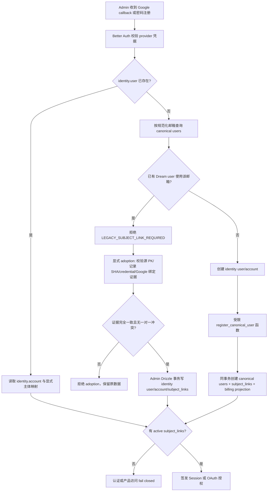
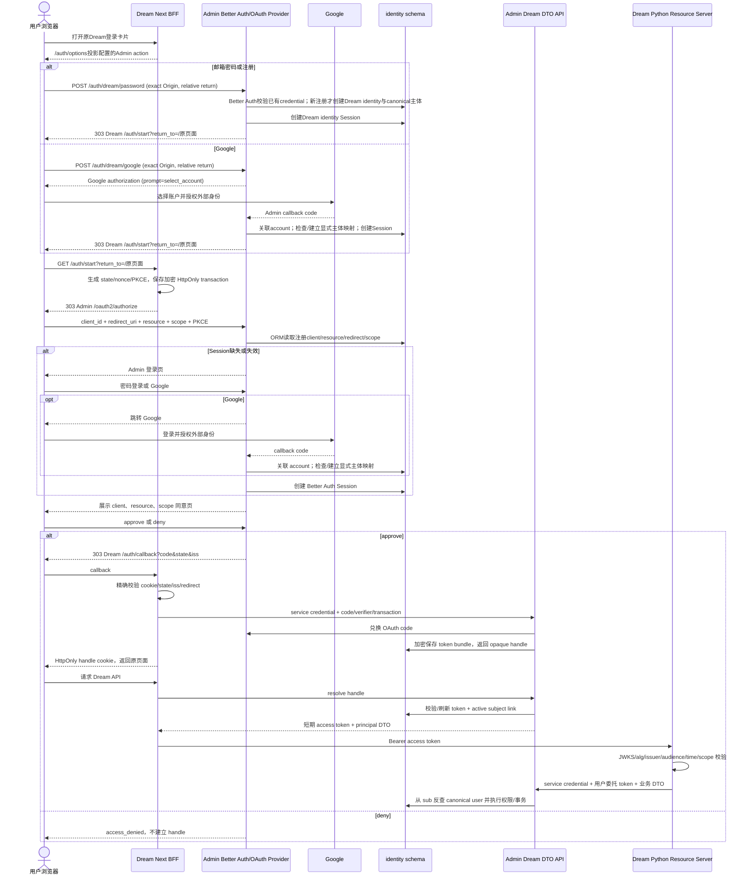
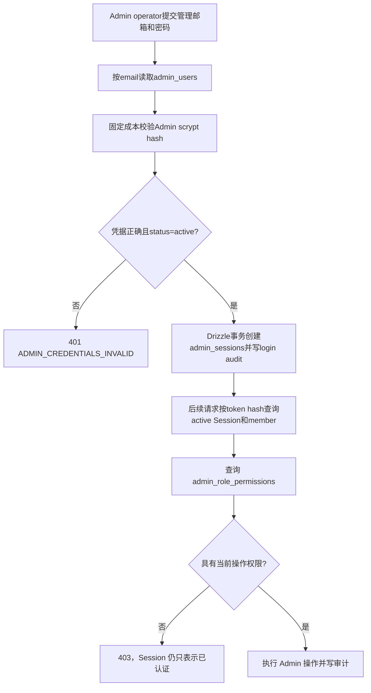
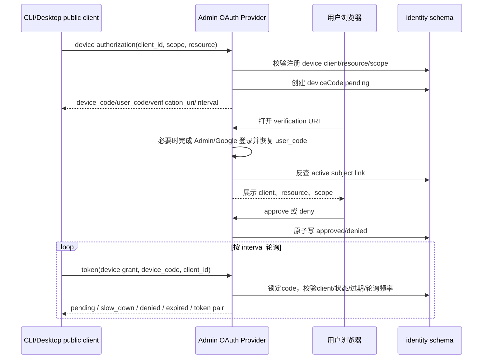

<!-- [Input] Admin Better Auth schema, canonical Dream user schema, Admin RBAC schema and current BFF/OAuth contracts. -->
<!-- [Output] Reviewable identity ER model and login/account-linking flow diagrams. -->
<!-- [Pos] Dream-side visual index; Admin remains the provider and database contract authority. -->
<!-- [Sync] 2026-09-17: record exact legacy Dream credential adoption and successful canonical-account login without Admin membership. -->
<!-- [Sync] 2026-09-17: restore the Dream product login card as browser-to-Admin form ingress before PKCE. -->
<!-- [Sync] 2026-09-17: freeze OAuth roles before further business changes; Dream applications are clients while Dream users remain delegated product subjects. -->
<!-- [Sync] 2026-09-17: record client-local Dream logout and retained central SSO without Admin-session crossover. -->
<!-- [Sync] 2026-09-17: separate Admin operator sessions from Dream OAuth subjects and model Dream browser/device/service as OAuth clients. -->
<!-- [Sync] 2026-09-16: document the unified identity model, conflict handling and browser/Admin/device flows. -->

# 登录认证体系：数据 ER 图与流程

## 1. 背景与问题

Admin 原有后台操作员，Dream 原有产品用户。两者属于不同业务域：Admin operator 管理系统配置和运营数据，Dream user 拥有 Deck、Thread、Run、订阅和文件。统一认证不能把两张用户表合并、共享密码、改变既有业务主键，或把“邮箱相同”当作跨业务域关系证明。

现行目标由 Admin Better Auth/OAuth Provider 产生 Dream 登录所需的协议身份、Account、授权页 Session 与 OAuth token；Dream 原 `public.users` 继续作为产品主体真值。Admin 后台操作员继续使用 `public.admin_users`、`public.admin_sessions` 与 RBAC。Dream browser、device 和 server 是 OAuth client；Dream user 是用户委托 token 的 `sub`，不是 OAuth client。

提供方的完整接口、事务与数据库契约以 [Admin auth/data contract](https://github.com/glide-the/ink-admin-memory/blob/main/docs/architecture/admin-dream-auth-data-contract.md) 和 [Admin / Dream 认证业务域评审](https://github.com/glide-the/ink-admin-memory/blob/main/docs/architecture/auth-domain-boundaries-review.md) 为准；本文件是 Dream 产品和评审使用的可视化索引。[认证主设计](./auth.md) 和 [Device Flow](./auth-device.md) 继续定义页面与调用行为。

## 2. 目标与边界

- `identity.user` 是 Dream OAuth 的 Better Auth 协议主体；它本身不等于 Dream 业务用户，也不是 Admin operator。
- `public.users` 是现有 Dream canonical user；Deck、Thread、Run、订阅及权限继续引用原主键。
- `public.admin_users` 是独立 Admin operator；其密码、Session、状态、角色与权限只在 Admin 业务域求值。
- `identity.subject_links` 只建立 Dream 协议主体到 canonical user 的显式一对一关系。`identity.admin_subject_links` 是已存在的迁移历史，不参与新登录路径。
- 相同邮箱只触发冲突检查。旧主体采用必须校验明确源记录、原主键和证据摘要；禁止自动合并。
- Dream 请求不提交任意 `user_id`。Admin 从已验证 OAuth `sub` 反查 `subject_links`，再在同一事务中执行实体权限过滤。
- Dream 浏览器只持有 HttpOnly opaque handle；Google token、OAuth access token 和 refresh token 不进入浏览器脚本。
- Admin 管理路由只接受独立 Admin Session，在每次请求检查 `admin_users` 状态、角色和权限；Dream Session/token 不参与。
- 浏览器和设备是 public OAuth client；Dream service 是 confidential client。`client_credentials` 只用于无用户后台 scope，不能代替用户委托 token。
- 无用户后台调用使用 `Authorization: Bearer <service token>`。用户数据调用使用 `Authorization: Bearer <user token>`，Dream 服务端另加 `X-Ink-Dream-Service-Authorization: Bearer <service token>`；Browser 不能写入或读取第二个头。
- Admin 对两个 token 分别验证 client、issuer/resource/scope 和 Dream user subject/entity 权限；service token 没有 canonical user，user token 也不能取得 Admin RBAC。

### 2.1 OAuth 协议角色与业务主体

| 角色 | 本项目中的实体 | 身份与权限 |
| --- | --- | --- |
| Authorization Server | Admin Better Auth/OAuth Provider | 签发、刷新 token 并提供 JWKS；它不是 Dream user |
| Admin operator | `public.admin_users` + `public.admin_sessions` | 独立后台主体，只按 Admin RBAC 授权 |
| Public client | Dream browser BFF、CLI/device | 无 secret，使用 code/PKCE 或 RFC 8628 请求用户委托 |
| Confidential client | Dream server | 使用 `client_credentials` 取得 service token，只能执行具名无用户后台操作 |
| Delegated subject/resource owner | Dream user：`identity.user → subject_links → public.users` | 用户 token 的 `sub`，拥有本人产品实体；不是 OAuth client registration |
| Resource Server | Admin Dream data API 与适用的 Dream/Gateway API | 分别验证 service client 和用户 `sub`，执行 scope 与实体权限过滤 |

`client_credentials` 不包含用户语义。用户数据请求仍需 Authorization Code 或 Device Flow 产生的 user bearer，并由 Dream 服务端附加自己的 service bearer。把每个 Dream user 建成 client 会丢失用户同意、产品所有权、禁用、Session、Device approval 和同一用户跨 client 授权，因此现行设计禁止这种映射。

## 3. 概念与规则

| 概念 | 数据真值 | 用途 | 不能代表 |
| --- | --- | --- | --- |
| Dream 协议身份 | `identity.user` | Better Auth 登录主体、用户 token 的 `sub` | Dream 实体访问权、Admin 管理权 |
| 外部/密码账户 | `identity.account` | Google subject 或 credential 与协议身份的关系 | 根据相同邮箱自动合并 |
| 登录 Session | `identity.session` | Admin 登录页和授权页的浏览器会话 | Dream API OAuth access token |
| Dream 业务主体 | `public.users` | 原业务主键、内容所有权、订阅与历史 | Admin 成员 |
| Admin operator | `public.admin_users` | 后台成员状态、独立密码、RBAC 起点 | 普通 Dream 产品访问 |
| Dream 主体映射 | `identity.subject_links` | `auth_user_id → canonical_user_id` | 任意客户端传入的 user ID |
| Admin Session | `public.admin_sessions` | Admin operator 的登录、过期与撤销 | Dream OAuth Session 或 resource token |
| OAuth client/resource | `identity.oauthClient`、`oauthResource`、`oauthClientResource` | 注册 Dream browser/device public client、service confidential client、resource 与 scope | Dream 用户业务记录 |
| Dream 浏览器句柄 | `identity.browser_sessions` | Admin 加密持有 token bundle，Dream BFF 使用 opaque handle | 浏览器可读 token |

`subject_links.auth_user_id` 是主键，`canonical_user_id` 也唯一，因此同一个 Dream user 不能被静默绑定给两个 Better Auth 主体。Admin operator 不通过该映射登录，也不与 Dream user 建立外键。

Dream 访问数据库的接口实现保持 strict Pydantic DTO → Admin Zod DTO → Domain Service → typed Drizzle Repository → transaction。Dream 不提交 SQL、表列、事务或任意 `user_id`，也不会在 Admin 不可用时回退 PostgreSQL。

### 3.1 Dream 用户与 Admin operator 的兼容决策

| 旧数据事实 | Dream 处理 | Admin 处理 |
| --- | --- | --- |
| 只有 Dream user | reviewed manifest 固定原 canonical PK/hash，建立 `identity.user + account + subject_links` | 无 Admin operator，不进入后台 |
| 只有 Admin operator | 不创建 Dream identity、account 或 subject link | 原 `admin_users` 密码签发 `admin_sessions`，继续检查 RBAC |
| Dream/Admin 同邮箱、密码相同 | 仍只使用 Dream hash 完成 Dream adoption | 仍只使用 Admin hash 完成 Admin 登录；不复制、不互验 |
| Dream/Admin 同邮箱、密码不同 | Dream 登录按自己的 Google/credential 证据处理 | Admin 登录按自己的 scrypt hash 处理；两者可以同时有效 |
| 任一侧禁用 | 只影响该业务域 | 不传播禁用状态到另一业务域 |

本机指定验收账户原先只有 canonical Dream user，没有 legacy Google provider-sub，也没有 Better Auth identity。发布期 credential adoption 已按 canonical ID 和源行指纹建立 Better Auth user、credential account 与 Dream subject link，保留原 Dream bcrypt 和业务主键，并确认没有 Admin subject link 或 membership。该 Dream 凭据只用于 Dream 登录；提交到 Admin 管理登录时返回 `401` 是预期结果。Admin 是否可登录只取决于独立 `admin_users` 凭据，不需要、也不能通过合并 Dream user 解决。

业务修改前的本轮设计审查已通过：Admin 独立登录/guard 不读取 Dream subject link；Dream 登录与 Device Flow 不创建 Admin Session；service token 的 `sub` 是 confidential `client_id`，用户 token 的 `sub` 是 Dream identity subject；用户接口要求双 Bearer；相同邮箱只触发显式采用/冲突检查。后续只有发现实际调用违反这些边界时才修改认证业务，不能为了“客户端模式”把 Dream user 改成 client。

## 4. 数据 ER 图

下面只画认证和授权直接依赖的物理关系。`deviceCode.clientId/oauthClientId` 由服务在协议事务中校验，但当前安装版本没有数据库外键，因此不伪画成物理 FK。

```mermaid
erDiagram
    IDENTITY_USER {
      text id PK
      text email UK
      boolean emailVerified
      timestamptz createdAt
    }
    IDENTITY_ACCOUNT {
      text id PK
      text userId FK
      text providerId
      text accountId
      text password
    }
    IDENTITY_SESSION {
      text id PK
      text userId FK
      text token UK
      timestamptz expiresAt
    }
    DREAM_USERS {
      bigint id PK
      text email UK
      text password_hash
      text status
    }
    SUBJECT_LINKS {
      text auth_user_id PK_FK
      bigint canonical_user_id UK_FK
      text evidence
    }
    ADMIN_USERS {
      text id PK
      text email UK
      text status
    }
    ADMIN_SESSIONS {
      text id PK
      text admin_user_id FK
      text token_hash UK
      timestamptz expires_at
      timestamptz revoked_at
    }
    ADMIN_ROLES {
      text id PK
      text code UK
    }
    ADMIN_PERMISSIONS {
      text id PK
      text code UK
    }
    ADMIN_USER_ROLES {
      text admin_user_id PK_FK
      text role_id PK_FK
    }
    ADMIN_ROLE_PERMISSIONS {
      text role_id PK_FK
      text permission_id PK_FK
    }
    OAUTH_CLIENT {
      text id PK
      text clientId UK
      text_array redirectUris
      text_array grantTypes
      text_array scopes
      text tokenEndpointAuthMethod
    }
    OAUTH_RESOURCE {
      text id PK
      text identifier UK
      text_array allowedScopes
      text signingAlgorithm
    }
    OAUTH_CLIENT_RESOURCE {
      text id PK
      text clientId UK_FK
      text resourceId UK_FK
    }
    OAUTH_CONSENT {
      text id PK
      text userId FK
      text clientId FK
      text_array scopes
    }
    OAUTH_ACCESS_TOKEN {
      text id PK
      text userId FK
      text clientId FK
      text_array resources
      text_array scopes
      timestamptz expiresAt
    }
    OAUTH_REFRESH_TOKEN {
      text id PK
      text userId FK
      text clientId FK
      text_array resources
      text_array scopes
      timestamptz revoked
    }
    BROWSER_SESSIONS {
      text handle_hash PK
      text auth_user_id FK
      text service_client_id
      text transaction_id UK
      text token_ciphertext
      text status
    }

    IDENTITY_USER ||--o{ IDENTITY_ACCOUNT : owns
    IDENTITY_USER ||--o{ IDENTITY_SESSION : has
    IDENTITY_USER ||--o| SUBJECT_LINKS : maps_to_Dream
    DREAM_USERS ||--o| SUBJECT_LINKS : has_protocol_identity
    ADMIN_USERS ||--o{ ADMIN_SESSIONS : opens
    ADMIN_USERS ||--o{ ADMIN_USER_ROLES : receives
    ADMIN_ROLES ||--o{ ADMIN_USER_ROLES : assigned
    ADMIN_ROLES ||--o{ ADMIN_ROLE_PERMISSIONS : grants
    ADMIN_PERMISSIONS ||--o{ ADMIN_ROLE_PERMISSIONS : included
    OAUTH_CLIENT ||--o{ OAUTH_CLIENT_RESOURCE : allowed_for
    OAUTH_RESOURCE ||--o{ OAUTH_CLIENT_RESOURCE : admits
    IDENTITY_USER ||--o{ OAUTH_CONSENT : approves
    OAUTH_CLIENT ||--o{ OAUTH_CONSENT : requests
    IDENTITY_USER ||--o{ OAUTH_ACCESS_TOKEN : delegated_subject
    OAUTH_CLIENT ||--o{ OAUTH_ACCESS_TOKEN : issued_to
    IDENTITY_USER ||--o{ OAUTH_REFRESH_TOKEN : delegated_subject
    OAUTH_CLIENT ||--o{ OAUTH_REFRESH_TOKEN : issued_to
    IDENTITY_USER ||--o{ BROWSER_SESSIONS : secures
```

## 5. 新用户注册与旧用户冲突处理

相同邮箱只用于 Dream 旧账户冲突检查。Dream adoption 清单只能指定协议主体、原 canonical 主键、来源摘要和 Google/credential 证据；它不读取或修改 Admin member。Admin 登录独立校验自己的密码哈希，不覆盖 Dream 密码。

## 6. Dream 浏览器登录流程

Dream渲染的表单由浏览器handler构造闭集请求并直接发送到Admin；Dream Next/Python不接收或持久化密码。浏览器不能读取 access/refresh token。Dream BFF 不签发用户 token；Python 只验证 Admin OAuth access token，也不能把 Google token或 OIDC ID token当作 Dream API 凭据。

## 7. Admin 后台独立登录与权限隔离

Admin 后台不读取 `identity.user`、Dream `subject_links` 或 canonical user。相同邮箱、Dream 登录成功和 Dream token 均不能创建 Admin Session。

## 8. Device Flow

设备 client 是无 secret 的 public client。Session token 只用于浏览器授权页，CLI 获得的是面向 Dream resource 的 OAuth access token。

## 9. 失败状态与评审检查

| 触发 | 结果 | 数据处理 |
| --- | --- | --- |
| 旧 Dream 邮箱与新 identity 注册冲突 | `LEGACY_SUBJECT_LINK_REQUIRED` | 不创建/覆盖 canonical user，转显式 adoption |
| adoption 主键、摘要、Google 关系或 credential 冲突 | adoption 失败 | 整个事务回滚，原记录不变 |
| identity 已登录但没有 active `subject_links` | Dream 访问拒绝 | 不签发可用产品主体 |
| Dream identity 已登录并持有有效 token | Admin 管理入口仍要求独立 Admin Session | 不转换为 Admin operator，不授予角色 |
| Admin 密码错误或 member inactive | Admin 401 | 不查询 Dream user，不创建 Session |
| OAuth client/redirect/resource/scope 未注册 | 协议错误 | 不签 code/token |
| handle 过期、撤销或 refresh replay | 401，需要重新登录 | token bundle不返回浏览器 |
| 当前Dream browser退出 | 撤销该client的refresh grant/lineage与BFF handle，清Dream cookie | 中央Dream SSO、其他client与Admin管理Session不变；再次登录可在中央Session有效时直接返回 |
| canonical user 或 billing projection disabled | 产品访问拒绝 | 不接受客户端 user ID 绕过 |
| Admin DTO/数据库不可用 | 明确 503/504 | Dream 不回退 PostgreSQL |

评审时应同时检查数据库唯一约束、Dream adoption manifest、Admin Session/RBAC、OAuth public/confidential client catalog、Dream BFF cookie、Python JWT 验证和 Admin DTO 权限过滤。Dream 登录成功、Admin 登录成功和service client认证是三份独立证据，不能互相替代。
