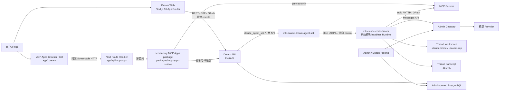
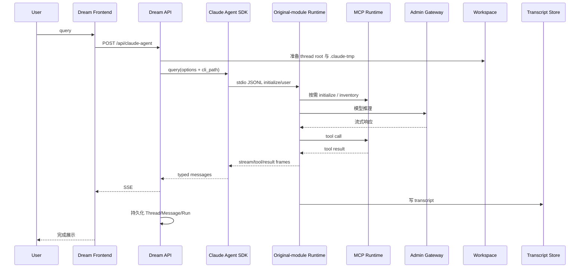
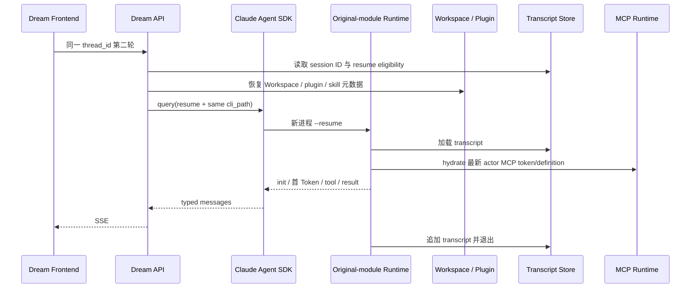
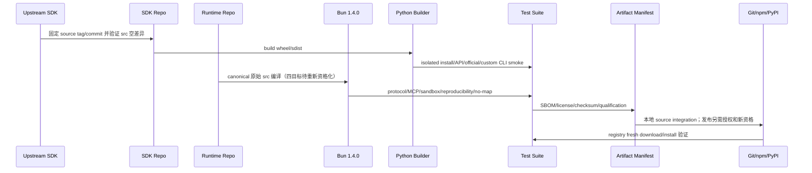

<!-- [输入] Dream 当前代码、Next.js/pnpm workspace、Admin/Gateway/PostgreSQL 合同、自有 Claude Agent SDK main 与原始模块 Runtime main/npm registry 证据。 -->
<!-- [输出] 说明 Ink & Memory 当前 Web/Python/Node 拓扑、版本矩阵、Claude Runtime 能力边界、发布物、业务验证和回滚合同。 -->
<!-- [定位] 项目级架构总览；各领域细节由 docs/design 与对应 .folder.md 继续维护。 -->
<!-- [同步] 2026-09-06：按 54f3bbe5 将当前前端更新为 Next.js 16 + pnpm 单根结构，登记 server-only MCP Apps package、Python owner 和 production effective=false。 -->
<!-- [同步] 2026-08-30：Dream 源码/Docker 精确采用公开 Runtime 0.1.4；记录 Notion Bash sandbox、same-SHA workflow、registry fresh install 和真实 Dream 验收。 -->
<!-- [同步] 2026-08-26：本机默认 Runtime 软链接已从保留的 0.1.0 回滚树切换到公开 registry 0.1.1 内容寻址安装树。 -->
<!-- [同步] 2026-08-26：更新 SDK 0.2.144 与 Runtime 0.1.1 的正式 registry、workflow、哈希和 Dream 精确版本合同。 -->
<!-- [同步] 2026-08-25：MCP HTTP 改为匿名优先连接，以正交 auth_state 和安全 Failure-Code 保留 OAuth、logout、cancel、inventory 与 resume 合同。 -->
<!-- [同步] 2026-08-25：记录目标匿名 MCP 与规范 OAuth MCP 的真实 Chat，以及 Dream Workflow、Workspace/sandbox、Runtime 故障恢复、Gateway/账本和 Admin UI 完整业务回执。 -->
<!-- [同步] 2026-08-25：MCP Resources 管理面迁移到 Dream PostgreSQL 与标准 MCP SDK，列表和认证状态不再调用 Runtime mcp list/get。 -->
<!-- [同步] 2026-09-13：当前配对为 SDK 0.2.145 × 已发布 Runtime 0.1.9；按通用产品设计原则同步模块职责、具体操作和验收范围。 -->

# 项目架构设计说明

> 前端代码证据：`54f3bbe539b086035bce5900618bf3d7ae5b9372`（2026-09-06）。Runtime registry 查询日期：2026-09-13。
>
> 当前状态：Dream 源码使用自有 Python SDK `0.2.145`，默认 Runtime 合同为已发布的原始模块统一实现 `0.1.9` package-root selector；官方 Claude CLI 只作为显式绝对路径回滚。本文不据源码推断正在运行的服务版本。
>
> 发布状态：SDK `0.2.145` 的正式 PyPI 精确版本/wheel/sdist SHA-256 锁不变。Runtime `0.1.9` 已完成同 SHA 四平台资格、五包公开归档 integrity、全新安装及本机 Dream 启动身份核对，具体范围见[发布接入回执](../deploy/runtime-0.1.9-release-and-local-dream-adoption.md)。本稿不以制品测试替代真实业务验收。
>
> 本文描述 Dream 当前 Web、Python、Node MCP Apps preview 和 Claude SDK/Runtime 制品架构；远程部署操作、数据库 migration 与新业务方案由各自文档维护。

## 1. 架构决策

Dream 与 Claude Runtime 的关系是公开接口兼容，不是源码耦合：

- Dream 业务代码继续使用 `claude_agent_sdk` 公共 import/API。
- 自有 Python distribution 名为 `ink-claude-dream-agent-sdk`，源码和公开 API 与固定上游基线一致。
- SDK 通过上游已有的 `ClaudeAgentOptions.cli_path` 启动 Runtime，不复制 transport、Agent 状态机或 MCP 状态机。
- Runtime 位于独立仓库 `ink-claude-code-dream`，实际实现为唯一原始 `src`，原始目录、模块、内容和权限摘要不变；重复 `restored-src` 已删除，provenance 保留来源事实。
- 默认构建读取 `src/entrypoints/cli.tsx`，不读取另一套外部源码。原始源码版权、制品来源和机器发布策略如实保留；每次升级须通过相同的资格与摘要门禁。
- IM 不需要的交互 Ink、remote/team/IDE 等产品面按现有图证明在构建层裁剪；原始模块仍在源码树中，shared diagnostics 等暂缓项不按名字删除。
- SDK、MCP、tools、SSE、Workspace、sandbox、transcript、resume、plugins/skills/hooks、普通 subagent 与 Gateway 接口继续保留。

## 2. 当前系统拓扑



| 组件 | 当前职责 | 禁止越界 |
| --- | --- | --- |
| Dream Web | `frontend/` 根 Next.js package；`frontend/app/**` 是唯一 App Router，`frontend/app/_dream/**` 是唯一 Dream 应用源码 | 不恢复 `frontend/src/**`、嵌套 Next、第二 lock 或第二 Web 入口；浏览器不持有 Provider Key、MCP Token 或数据库凭据 |
| Next Route Handler | 提供 health、crawler 资源和同源 MCP Apps HTTP 入口；`[serverRef]` transport handler 固定 Node runtime 并薄委派到独立 package | 不成为认证、业务数据、MCP credential 或长连接事实源；status/sandbox Route 反向导入 Browser host-policy 是待抽取缺口 |
| Node MCP Apps package | `frontend/packages/mcp-apps-runtime/src/**` 中的 server-only 配置 client、HTTP adapter、进程级 `PersistentConnectorManager` 与上游 MCP session/catalog | 不依赖 React/DOM 或 `app/_dream`；`productionAppsEffective` 当前固定为 `false` |
| Dream API | Python 认证、Thread/Run/Workspace、managed MCP 配置、SDK options、SSE、业务持久化 | 不管理共享 Schema，不实现第二套 Agent/Runtime 协议；Next 不接管这些职责 |
| Admin | Drizzle Schema、PostgreSQL、模型、订阅、计费、Gateway | Dream 不复制其账本和模型路由 |
| 自有 Python SDK | 上游兼容 API、transport、`cli_path` 注入 | 不加入 Dream DTO、数据库或业务状态机 |
| 原始模块 Runtime | JSONL、Provider/tool loop、resume、MCP、Workspace、sandbox | 不包含 IM 业务代码或用户可变数据；当前 0.1.9 同 SHA 发布资格已完成；后续版本仍须新资格 |
| Gateway | 模型 alias、推理和用量结算 | Runtime 不持有浏览器用户提供的 Provider Key |

## 3. 当前版本矩阵

下表区分 Dream 实际依赖、本机实际执行、构建工具和显式回滚物。Runtime 以唯一原始 `src` 为编译输入；外部目录只提供依赖和资源。

| 对象 | 当前版本或身份 | 当前适用性 |
| --- | --- | --- |
| Dream 项目元数据 | backend `0.1.3`、frontend `0.0.3`；API schema `2.0.0` 不变 | 现有项目版本序列的 patch 更新，不代表部署或 API 变更 |
| Dream Python | 本机 `3.12.9`；容器 Python `3.12` | 后端与 SDK 运行基线 |
| Dream Web | Next.js `16.1.6`、React `19.1.0` | `frontend/` 唯一 Web package 与 Next 项目根 |
| Node workspace | pnpm `10.28.1`；唯一锁 `frontend/pnpm-lock.yaml` | workspace 成员为 `.` 与 `packages/*`；不接受 npm lock 或嵌套 lock |
| MCP Apps Node SDK | `@modelcontextprotocol/sdk@1.30.0`、`@modelcontextprotocol/ext-apps@1.7.5`、`@mcp-ui/client@7.1.1` | 仅技术 preview；生产 effective 固定关闭 |
| 自有 SDK distribution | `ink-claude-dream-agent-sdk==0.2.145` | Dream `pyproject.toml` 固定精确版本，`uv.lock`/`requirements.txt` 固定 wheel 与 sdist SHA-256，Docker 使用 `--require-hashes` |
| SDK import/API | `claude_agent_sdk`、`ClaudeAgentOptions`、`ClaudeSDKClient`、`query` | 与上游公共 API 一致；官方 distribution 不得并存 |
| SDK 上游基线 | commit `542fefb3b94be87760b2513fff889b91bb5b6672`；tree `1c86f3a9144616da2a9435f0440066e23a4b580b` | SDK verifier 仅允许 `_version.py` 的下游版本赋值不同，其余 `src/` 与该 MIT 基线一致 |
| SDK 历史发布基线 | `v0.2.144@fa10c9ef04ec006d9dcf0a88b1b35dab4ef4723b` | 仅用于旧版本追溯，不是当前 Dream 版本 |
| 原始模块 Runtime package | source contract `@glide-the/ink-claude-code-dream@0.1.9` | `package/cli.js` selector；对 Dream 输出 `2.1.241 (Claude Code)`；manifest 配对 SDK `0.2.145`；同 SHA 四平台资格、五包发布与本机采用已验收 |
| Runtime 历史发布 | `0.1.4` / `main@0ebafe95db22101cf77db2c27e73b561d3af37a6` | qualification `33306855166` 与 publish `33306940462` 仅为旧制品证据 |
| Runtime 实现输入 | 原始 `src`，默认入口 `src/entrypoints/cli.tsx` + recovered dependencies/vendor assets | 实际编译原始模块，headless/MCP 变换在构建层；不维护第二套实现；source map 和用户数据不进入制品 |
| Runtime 原始源码 | 唯一 `src`：1,902 文件、35 模块目录；subtree `7640f58e…ebe30` | 原始目录/模块/内容/权限不变，重复 restored-src 删除；Anthropic 版权保留，不另设计一套 Runtime |
| Runtime 构建器 | Bun `1.4.0` | 四个 standalone target 的精确构建版本 |
| selector Node 合同 | `>=22 <25`；CI `24.13.0` | selector 支持范围；本机 Node `26.4.0` 只用于额外 smoke，不作为支持声明 |
| Anthropic Messages SDK | `@anthropic-ai/sdk@0.74.0`，MIT | Provider streaming 依赖 |
| MCP SDK | `@modelcontextprotocol/sdk@1.30.0`，MIT | stdio、HTTP、Resources、OAuth 依赖 |
| sandbox runtime | `@anthropic-ai/sandbox-runtime@0.0.73`，Apache-2.0 | macOS `sandbox-exec` 与 Linux `bubblewrap` 适配 |
| Python MCP SDK | Dream `1.27.1` | Dream MCP 服务端/测试依赖 |
| Runtime 平台 | darwin/linux × arm64/x64 | Windows、musl 和交叉选择 fail closed |
| registry 验收 Runtime（历史） | 0.1.4 source tree `266362ac…95de81`；darwin-arm64 executable `969f9193…980dd` | 只证明旧发布；当前 0.1.9 fresh-install 结果见独立发布回执 |
| Docker 默认 Runtime source pin | npm `@glide-the/ink-claude-code-dream==0.1.9` | 解析 package-root `cli.js` 与相邻 manifest；精确版本/摘要不符时失败；本轮未构建镜像 |
| 本机现有服务 Runtime | 本任务不变更、不重启、不推断 | 以受控进程自己的 startup identity/manifest 回执为准 |
| Docker official 回滚 CLI | `@anthropic-ai/claude-code==2.1.241` | 仅显式绝对 `CLAUDE_CODE_CLI_PATH=/usr/local/bin/claude` 选择 |
| ambient official CLI | 本机 `2.1.220` | 不是 Dream 默认路径，不可静默 fallback |

版本结论：`2.1.241` 是 Dream 面向 Runtime 的 CLI/协议兼容标识，不表示官方全产品等价。当前实现依据是实际编译的原始 `src`、源码绑定的 headless/MCP 变换、manifest 和协议测试。当前同 SHA 发布与安装、本机启动采用及真实业务范围分别见执行回执；不同版本证据不能互相替代。完整目录与模块统一见[接入说明](../deploy/runtime-0.1.9-release-and-local-dream-adoption.md)。

## 4. 仓库与职责边界

| 仓库 | 职责 | 当前分支规则 |
| --- | --- | --- |
| `ink-dream-memory` | SDK/Runtime 接入、业务入口与真实验收 | 不实现 SDK 或 CLI 内部逻辑 |
| `ink-claude-dream-agent-sdk-python` | SDK 同步、Python 打包、PyPI 流程 | SDK 任务只在该项目发起；统一使用 `main` |
| `ink-claude-code-dream` | 原始模块 Runtime、Bun、source-bound 兼容和协议测试、多平台资格计划 | CLI 任务只在该项目发起；统一使用 `main` |
| `ink-admin-memory` | PostgreSQL Drizzle、Admin、Gateway、订阅与计费 | Dream 不新增 migration |
| `claude-agent-sdk-python` | 只读上游 SDK 参考 | 禁止覆盖 |
| `claude-code-sourcemap/restored-src` | 只读原始参考；其 src 已原样对齐 Runtime canonical src | 外部 root 仅供应 recovered dependencies/vendor assets；不修改该参考 |

在代码快照 `54f3bbe5`，Dream 还包含根 Next.js compatibility shell、MCP Apps Browser Host、薄 Route Handler 和独立 server-only Node Runtime package。它们没有把身份或业务数据迁入 Next，也没有新增 Schema、migration 或第二套 Agent 状态机。

## 5. SDK 与 Runtime 启动合同

### 5.1 启动门

Dream 启动时按顺序验证：

1. 唯一安装的 distribution 是 `ink-claude-dream-agent-sdk==0.2.145`。
2. `claude_agent_sdk` 公共 API 与 canonical message types 存在。
3. Runtime 路径为显式 override 或 PATH 中的 `ink-claude-code-dream`。
4. 默认 npm Runtime 必须解析到 package-root `cli.js`，其相邻 release manifest、14 项 capability 清单和 selector checksum 必须匹配；另行资格化的 AutoDL local-core 只接受自身精确的 `bin/ink-claude-code-dream`、release-root manifest 与 13 项 baseline capability，二者不可冒充。
5. 任一门失败即 fail closed；禁止回退到 SDK bundled CLI 或 ambient `claude`。

### 5.2 解析顺序

| 优先级 | Runtime 来源 | 合同 |
| --- | --- | --- |
| 0 | 调用方已提供 `ClaudeAgentOptions.cli_path` | 完全复用上游注入点 |
| 1 | 绝对 `CLAUDE_CODE_CLI_PATH` | 人工回滚入口；必须预先验证版本、能力和哈希 |
| 2 | PATH 中 `ink-claude-code-dream` | 默认生产路径；selector 选择精确平台包 |
| 3 | 无匹配 | 抛出 Runtime unavailable，不静默降级 |

当前源码与 Docker 精确依赖 `0.1.9`。实际服务采用哪个 Runtime，以该进程启动时的 resolver/manifest 回执为准，不能从磁盘文件或 PATH 变更推断。安装内容不可变，正常入口只选择已校验的 package-root `cli.js` 与匹配平台 payload；上一已验证安装可保留供明确回滚，不覆盖现用目录或 npm 版本。

selector 只负责平台选择和启动 native standalone；Bun 已编译进可执行文件，不再依赖独立运行时软链接。

## 6. IM 所需能力矩阵

原始模块 Runtime 在构建层保留 Dream Agent 执行面；迁移前 MCP management identity
保留为显式回滚/导入背景，不进入 Dream Resources 正常生产图。状态“已验证”表示存在
provider-free 进程测试；真实业务列属于历史已资格化实现，不自动覆盖当前 0.1.9。

| 能力 | IM 使用状态 | 调用入口 | 加载时机 | 禁用影响 | 证据 |
| --- | --- | --- | --- | --- | --- |
| `protocol.streaming` | 已证实使用 | Runtime JSONL → SDK → SSE | turn 全程 | 首 Token、增量和终态丢失 | protocol tests；真实两轮 Chat |
| `protocol.control.bidirectional` | 已证实使用 | SDK stdin/control request | permission、hook、cancel | 工具确认和取消失效 | protocol/permission tests；真实确认 200 |
| `session.resume` | 已证实使用 | session ID、`--resume` | 第二轮及恢复 | 同一 Thread 无法续聊 | fresh/resume tests；真实刷新后同 Thread |
| `transcript.jsonl` | 已证实使用 | session store | turn 写入/恢复 | resume 无真相源 | session tests；真实持久化 parts |
| `workspace.cwd` | 条件使用 | SDK `cwd` 与文件工具 | Workspace Mode | 文件上下文失效 | workspace/tool tests |
| `tmpdir.thread-local` | 已证实使用 | `CLAUDE_CODE_TMPDIR` | CLI spawn 前 | 违反 Thread 隔离 | path/sandbox tests |
| `sandbox` | 条件使用 | production sandbox adapter | Bash/文件工具 | 宿主隔离退化 | macOS arm64 `sandbox-exec` 通过 |
| `mcp.stdio` | 条件使用 | MCP registry | 配置 stdio server 时 | 本地 MCP 失效 | MCP registry/integration tests |
| `mcp.http` | 已证实使用 | MCP registry | 远端 server initialize | Comfy/远端 MCP 失效 | HTTP/Resources tests；真实 Comfy |
| `mcp.oauth` | Agent 执行面条件使用 | Dream 注入的 DB snapshot；Runtime 标准 MCP SDK client | 已认证 Agent turn 与长连接 refresh | 远端 OAuth MCP 工具失效 | Runtime OAuth 回归；Dream 真实 Chrome OAuth/自然到期 refresh |
| `mcp.management.identity` | 正常生产图不使用 | 仅显式旧配置导入/独立回滚背景 | 不在 Resources 请求路径加载 | 无；Dream PostgreSQL 是管理事实来源 | 正常页面 PID tracing 0；Dream service 无 production import |
| `extensions.plugins` | 条件使用 | plugin/Skill/hook loader | turn 启动/工具生命周期 | Deck 扩展失效 | session-extension/runtime tests |
| `lifecycle.cancel` | 已证实使用 | interrupt/process group | 用户取消/超时 | 进程和子进程无法终止 | protocol/sandbox tests |

额外保留的业务合同：Provider streaming、tool use/result、PreToolUse/permission、文件工具、普通 Agent/Task subagent、Gateway `apiKeyHelper`、错误 DTO 与安全脱敏。

### 6.1 明确不进入生产图的功能

| 功能组 | IM 状态 | 原始 headless 构建处理目标 |
| --- | --- | --- |
| Remote Session / Remote Control / CCR | 已证实未使用 | 原始模块保留；图证明后构建裁剪 |
| swarm / team / teammate 产品面 | 已证实未使用 | 原始模块保留；图证明后构建裁剪 |
| IDE integrations / terminal UI / Ink REPL | 已证实未使用 | 原始模块保留；交互表面构建裁剪 |
| voice / SSH remote / browser product tool | 已证实未使用 | 依现有 feature/profile 图裁剪，不按目录名删除 |
| updater / feedback / reporting | 已证实未使用 | 命令/UI 裁剪；shared updater 依赖暂缓 |
| 交互 slash command UI / history selector | 已证实未使用 | 交互面裁剪；保留 Skill 调用 |
| 增强 telemetry / 产品实验服务 registry | 已证实未使用 | shared diagnostics 等暂缓项须另做图证明 |

源码树不删除这些原始模块，也不重设计最小 Runtime。源码绑定的 profile/transforms 决定产物保留与裁剪，元文件和 DCE 断言证明实际结果。

## 7. 正常 turn 与 resume 调用链

```text
POST /api/claude-agent
  → JWT / Thread / Deck 鉴权
  → Thread Workspace 与 .claude-tmp(0700)
  → ClaudeAgentOptions(cli_path, env, cwd, resume, sandbox, mcp_servers, hooks)
  → ink-claude-dream-agent-sdk
  → ink-claude-code-dream selector
  → 当前平台 native standalone
  → Admin Gateway / MCP / Workspace tools
  → SDK typed messages
  → Dream SSE EventBus
  → PostgreSQL Thread/Message/Run 与本地 transcript
```

PreToolUse hook 返回明确 `allow` 时，Runtime 直接继续该次原始 tool call，不再触发第二个 `can_use_tool`。无决定时才进入后续 permission policy；`deny` 始终不执行工具。这一修复避免了 MCP 调用被复制成第二个 UUID 工具卡。

## 8. Workspace、transcript 与运行时数据

| 数据 | 位置/所有者 | 生命周期 | npm/wheel |
| --- | --- | --- | --- |
| Thread Workspace | `{AGENT_CWD}/{thread_id}` | Dream 创建、鉴权和保留 | 禁止打包 |
| Claude config home | `{thread}/.claude-home` | transcript、plan、plugin/agent thread-local 状态 | 禁止打包 |
| Claude TMPDIR | `{thread}/.claude-tmp` | spawn 前创建；真实目录、非 symlink、`0700` | 禁止打包 |
| session transcript | `.claude-home/projects/**/*.jsonl` | Runtime 写入；session ID/resume 真相源 | 禁止打包 |
| MCP 用户配置/凭据 | server-owned actor root；`0600` | 与 Thread 解耦，按 turn 安全投影 | 禁止打包 |
| Plugin/Skill 文件生成与恢复 | Workspace/config home | 按 Deck/安装状态生成或恢复 | 禁止打包 |
| Runtime executable/manifest/SBOM | npm 平台包 | 不可变制品 | 允许打包 |

Workspace Mode 关闭时只创建 thread runtime root 与 `.claude-tmp`，不会因此启用 `cwd`、文件侧栏、Workspace context 或 sandbox settings。

## 9. MCP 与 OAuth 一致性

Resources 管理命令和 Agent turn 共用同一 Runtime resolver 与 actor identity。

- 支持 stdio、HTTP、Resources、tools inventory、带冒号 server name 和 user-scope 配置。
- HTTP(S) 只是 transport，不等于需要 OAuth：无匹配凭证时先匿名连接，握手与 inventory 成功后状态为 `connected + anonymous`，不会自动启动 login。
- 只有规范认证挑战、Runtime-owned 显式认证线索或用户主动 login 才能进入 OAuth discovery；匿名裸 `403`、网络错误、endpoint `404` 和 metadata 异常保持互斥分类。
- OAuth 支持 DCR、PKCE、无浏览器回调、token refresh/rotation、logout 和 needs-auth。
- Dream 使用标准 MCP SDK 的真实握手结果投影正交的连接与认证状态；Server 列表只读 PostgreSQL，不等待远端 discovery，也不调用 Runtime `mcp list/get`。HTTP 类型本身不代表 OAuth，只有规范认证挑战和 metadata discovery 才进入授权。
- Runtime 私有 `mcp-oauth/` 状态与 Dream 可投影的 `.credentials.json#mcpOAuth` 是两个持久边界。
- 只有私有 token 缺失时才允许从 Dream 投影 hydrate，避免旧 refresh token 覆盖新 token。
- refresh 成功后等待私有提交并原子更新 Dream 投影；下一个 Runtime 进程继续使用旋转后的 token。
- 不可恢复 `invalid_grant` 同时删除旧私有 token 和旧投影，进入 `needs-auth`。
- discovery/DCR 超时后封锁迟到写入，不能在操作失败后重新创建凭据文件。
- 匿名 `401` 表示认证挑战候选并由 discovery 决定能否 login；裸 `403` 不触发 OAuth。错误 DTO 不回显 token、header、provider body 或用户路径。

## 10. 构建、五包与许可证

### 10.0 Dream Web 构建边界

Dream Web 的唯一依赖事实源是 `frontend/package.json`、`frontend/pnpm-workspace.yaml` 与 `frontend/pnpm-lock.yaml`。所有命令从仓库根显式指定 `frontend/`，或先进入该目录执行；不得生成 `package-lock.json`，也不得给 Next 命令附加历史 `app` 项目位置参数。

```bash
pnpm --dir frontend install --frozen-lockfile
pnpm --dir frontend build
INK_NEXT_OUTPUT=standalone pnpm --dir frontend build:docker
pnpm --dir frontend start
```

`frontend/app/api/**` 的 Route Handler 与 `frontend/packages/mcp-apps-runtime/**` 同属一个自托管 Next 发布单元，但代码 owner 保持分离。Python API 通过同源 rewrite 暴露，身份和业务数据不迁入 Next。

### 10.1 构建输入

允许输入只有：

- Runtime canonical `src` 的完整原始模块，入口 `src/entrypoints/cli.tsx`；
- recovered `node_modules`/`vendor` 和 checksum-pinned platform assets；
- lockfile 固定且许可证兼容的第三方依赖；
- 从上述输入生成的 launcher、manifest、SBOM、license、checksum。

原始来源不是禁止输入，也不能隐藏成 MIT。构建收据必须声明 implementationRoot=src、implementationSource=repository 和 parallelImplementation=false；产物禁止 raw TypeScript、source map、Secret、Workspace 和用户数据。当前 `0.1.9` 发布状态见独立回执；任何新制品仍须验证其自身授权、资格和摘要。

### 10.2 npm 多平台布局

```text
@glide-the/ink-claude-code-dream@0.1.9
  ├─ cli.js：package-root selector
  └─ 根据 process.platform/process.arch 选择可选依赖

@glide-the/ink-claude-code-dream-darwin-arm64@0.1.9
@glide-the/ink-claude-code-dream-darwin-x64@0.1.9
@glide-the/ink-claude-code-dream-linux-arm64@0.1.9
@glide-the/ink-claude-code-dream-linux-x64@0.1.9
```

公开五包的精确 SHA-256、registry integrity、CI SHA 和安装结果统一记录在[发布与本机接入回执](../deploy/runtime-0.1.9-release-and-local-dream-adoption.md)，不在设计稿重复维护另一套摘要表。SBOM、source LICENSE、第三方 notices、manifest 和 checksum 必须描述实际制品；禁止 source map、源码树、用户数据和凭据进入发布包。

### 10.3 发布规则

SDK wheel/sdist 与 Runtime npm 是两条独立发布链。Bun 构建 Runtime，不替代 Python wheel/sdist。SDK 不携带 Runtime，通过相同的 `claude_agent_sdk` import 和 `ClaudeAgentOptions.cli_path` 连接二者。原始模块版权不因 selector 的 MIT 许可改变；npm policy 使用实际 source LICENSE 并记录用户确认的来源授权。每个平台以自身资格归档发布，registry 回下载摘要必须与 CI 原归档相同。

## 11. 内存验收边界

内存数据必须标注版本、制品摘要、宿主、场景、采样方法和范围；不同实现或初始化场景的样本不应变成当前产品容量承诺。此稿不保留废弃实现的对比数字，也不声称本轮测量了 Runtime `0.1.9` 的内存。真实 streaming、长 transcript、工具输出与外部 MCP 子进程须按目标业务单独评估。

## 12. 业务时序

### 12.1 正常会话



### 12.2 Resume



### 12.3 构建发布



## 13. 当前验证证据

### 13.1 MCP Apps 状态语义

| 层次 | `54f3bbe5` 事实 | 可以声明什么 |
| --- | --- | --- |
| 代码存在 | Browser Host、`app/api/mcp-apps/**`、sandbox Route Handler、`packages/mcp-apps-runtime/src/**` 和 Python connection-view API 已存在 | 只能声明实现已入源码 |
| 技术验证 | 当前 pnpm lock 下的 Node、Backend、Browser、Next build 与 standalone provider-free 回执已通过 | 可以声明 Phase 0—3 technical preview 完成 |
| 公开应用 | 仅以未修改的官方 `basic-server-vanillajs@1.7.5` 制品完成兼容验证；没有真实外部 Server、真实账号/OAuth 或面向用户的公开 Apps 发布证据 | 不得声明公开应用可用或已上线 |
| 生产启用 | `frontend/packages/mcp-apps-runtime/src/contracts.ts` 固定 `PRODUCTION_APPS_EFFECTIVE = false`，status DTO 也只返回 `productionAppsEffective: false` | Production 为 No-Go；preview flag 不能改写该结论 |

详细命令与退出码见 [`docs/exec/mcp-apps/current-candidate-validation.md`](../exec/mcp-apps/current-candidate-validation.md)。

### 13.2 Claude Agent / managed MCP 与 Runtime 的既有验收（不计入 MCP Apps Host gate）

下表记录的是 Python Claude Agent、managed MCP、对应版本 Runtime、Gateway、Workspace 与 Dream Workflow 的既有发布/真实业务证据。它们没有经过 Browser Host → Next Node Runtime → 外部 App Server 这条 MCP Apps 链，因此不能补足 13.1 的真实外部 Server/OAuth、公开应用或 production gate。

| 验证 | 结果 |
| --- | --- |
| SDK 完整测试 | `1500 passed, 5 skipped`；focused `15 passed`；SDK 仓库 CI 0 失败 |
| SDK PyPI 发布 | Actions run `32874352449` 全成功；wheel 151,704 B，SHA `50801104…85ca56`；sdist 373,286 B，SHA `1b2b6dfa…bd517`；正式 PyPI 远端字节复验通过 |
| Dream SDK 接入 | `uv lock`、带哈希 `uv export`、`uv sync --frozen --inexact` exit 0；Git 安装被 PyPI wheel 替换，唯一 provider 正确且无 `direct_url.json` |
| Dream 相关后端回归 | 既有完整回归 `592 passed, 1 skipped, 181 subtests passed`；本次 Runtime 版本/环境/Docker/请求接入聚焦 `101 passed, 16 subtests passed` |
| Dream MCP/Agent 最终回归 | MCP、Agent runner/service、SSE、Workspace、Gateway adapter 与 server 集合：332 passed、1 skipped、107 subtests passed，exit 0 |
| Runtime 测试 | release CI/qualification `130 total, 125 passed, 5 conditional external-fixture skips, 0 fail`；lint exit 0 |
| OAuth/management 回归 | management 5/5；OAuth 与 registry 聚焦 17/17；refresh rotation、`invalid_grant`、timeout late-write、401/403/404/metadata/网络分类均覆盖 |
| 四平台/五包 | 两次 clean build；4 executables、5 tgz、聚合 SHA256SUMS 逐字节一致 |
| 包安全 | SBOM 22 components；restricted-source 与 `.map` 零命中 |
| npm registry fresh install | `0.1.4` selector + darwin-arm64；两个 CLI alias `--version` 为 `2.1.241 (Claude Code)`；manifest 配对 SDK `0.2.144`；`sandbox.notion-cli=true`；无 `.map`；provider-free registry 验收通过 |
| Runtime 请求字段真实验收 | Admin 目录声明 `deepseek-v4-pro.max_output_tokens=384000`；同一 Thread 首轮/resume 的 Gateway 请求均为 `max_tokens=384000`、`output_config.effort=low`、`stream=true`、Authorization `[REDACTED]`；Playwright `1 passed (15.3s)` |
| 真实 IM/匿名 MCP | 账号 `dmeck123@suoxya.com`、现有 Deck、目标 authless Server；添加后 anonymous，Runtime 直连为 40 tools/0 resources/0 prompts，Dream UI 对未报告的 Resources/Prompts 显示 `—`，零自动 OAuth；主动 login 为 `AUTH_NOT_REQUIRED`；两轮 `auth_status`、SSE、Workspace API、transcript 与同 Thread resume；Playwright exit 0，`1 passed (1.0m)` |
| 真实 IM/OAuth MCP | 同一账号、`https://cloud.comfy.org/mcp`；真实 401 challenge/Protected Resource Metadata、Chrome OAuth callback/token exchange、41 tools；两轮 `get_server_info`、刷新后同 Thread resume、cancel、Logout/Remove；Playwright exit 0，`1 passed (2.2m)` |
| 真实 Dream Workflow | 现有 Dream Deck 启动 Run `run_9375b494d4744897a1e18cddc875b981`、Thread `1624db18-8bf4-5215-a01c-aba1b9fc194f`；两轮对话、SSE/首 Token、Draft → Sync、Canonical/EP01/Story Index、页面重入与 resume 均通过；Run 为 `confirmed`；Playwright exit 0，`1 passed (2.0m)` |
| 真实 Workspace/sandbox | 上述 Thread 的生产工具记录为 Read 2 次、Write 9 次，均 `output-available`；sandbox fail-closed，禁止 unsandboxed command，写入只开放 thread workspace 与精确 `.claude-tmp`，敏感配置路径保持 deny |
| 真实 Runtime 异常恢复 | 只终止 Thread `34221a5d-8afd-47f0-bf6d-191e7da307cc` 经 backend 父链核验的唯一 Runtime leaf；前端显示安全错误且不泄漏路径/凭据，同一 Thread `resume:true` 成功；Playwright exit 0，`1 passed (9.3s)` |
| Admin 可见性 | 正常 Admin 登录/只读页面确认本轮 4 个 Gateway request 均为 `settled/succeeded/200`，恢复 request 有 `reserve/capture/release` 3 条 Token 流水，正常 logout；Playwright exit 0，`1 passed (5.4s)` |

真实验收使用本机正常运行的 Dream、Admin、Gateway 和当前真实 PostgreSQL，全部业务步骤走公开生产入口；MCP 远端只调用只读 `auth_status`/`get_server_info`，没有创建、修改或删除远端 Comfy 内容。真实 Workflow Run、Thread、Message、Gateway request、账本、Workspace、transcript 与故障记录按协议保留。Runtime 故障注入只作用于已核验父链和 release root 的本轮唯一 leaf，不影响共享 backend 或其他业务进程；Admin 验收只走正常登录、只读查询和 logout。

## 14. 回滚、风险与未完成项

回滚只需要把 `ClaudeAgentOptions.cli_path` 或绝对 `CLAUDE_CODE_CLI_PATH` 指向预检过的 official CLI；不修改 Dream 业务代码、数据库 Schema、Thread ID、transcript 格式或 Workspace 布局。

当前剩余风险：

- 本轮对 Runtime 的真实故障注入覆盖单 leaf 非正常退出与同 Thread 恢复；共享 backend 崩溃、宿主断电和跨机器恢复仍属于部署/灾备范围，不由本次 MCP 认证路由变更扩张。
- SDK 后续版本仍必须在 SDK 项目使用不可变 source tag、Trusted Publisher、TestPyPI 验证和正式 PyPI 远端字节复验；Dream 只在这些门通过后更新版本/哈希锁。
- Dream Dockerfile 已改为从 npm 安装 selector/匹配 Linux 平台包；真实 glibc/bubblewrap 宿主的 sandbox 与 credential deny-read 仍应在对应部署拓扑执行非破坏性验收。
- 当前 0.1.9 四个平台已通过 native-host qualification；未来功能版本须重新执行各宿主 sandbox/协议门，不能以格式检查或其他版本回执代替。
- Node 26 安装会收到 selector engine warning；支持合同保持 Node 22–24。

## 15. 相关设计真相源

- [`docs/design/claude-agent/dream-frontend-node-framework-migration-assessment.md`](../design/claude-agent/dream-frontend-node-framework-migration-assessment.md)：当前 Next.js/pnpm/source ownership；历史迁移方案只保留为附录。
- [`docs/design/claude-agent/mcp-apps-integration-strategy.md`](../design/claude-agent/mcp-apps-integration-strategy.md)：MCP Apps technical preview 架构和 production-off 边界。
- [`docs/architecture/claude-agent.md`](claude-agent.md)：Dream Claude Agent 分层和 API。
- [`docs/design/claude-agent/claude-sdk-env-design.md`](../design/claude-agent/claude-sdk-env-design.md)：SDK env、config home、TMPDIR 和 Runtime resolver。
- [`docs/design/claude-agent/claude-agent-sdk-cli-compatibility-report.md`](../design/claude-agent/claude-agent-sdk-cli-compatibility-report.md)：SDK/Runtime 配对与发布门。
- [`docs/design/claude-agent/dream-managed-mcp-resources.md`](../design/claude-agent/dream-managed-mcp-resources.md)：MCP Resources、OAuth、inventory 和 Agent turn。
- [`docs/deploy/claude-sdk-runtime-packaging-and-integration.md`](../deploy/claude-sdk-runtime-packaging-and-integration.md)：SDK wheel/sdist、TestPyPI/PyPI、Runtime npm 五包和 Dream 精确版本/哈希接入操作手册。

文档和实现冲突时，以当前原始模块代码、source-derived manifest/SBOM、Admin Schema capability 和当前字节的自动化/真实业务回执为准，并立即同步文档。
