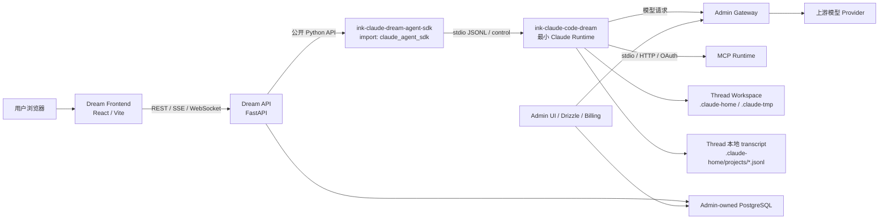
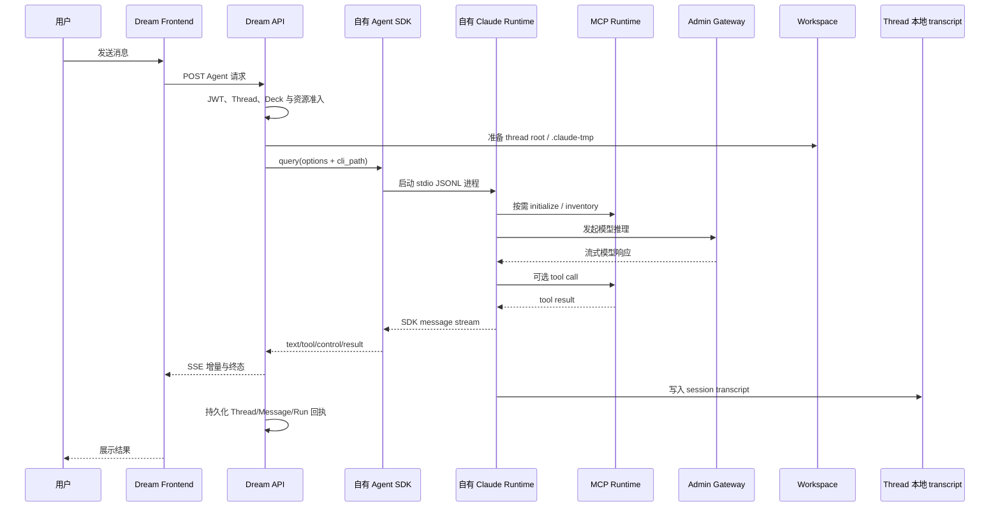
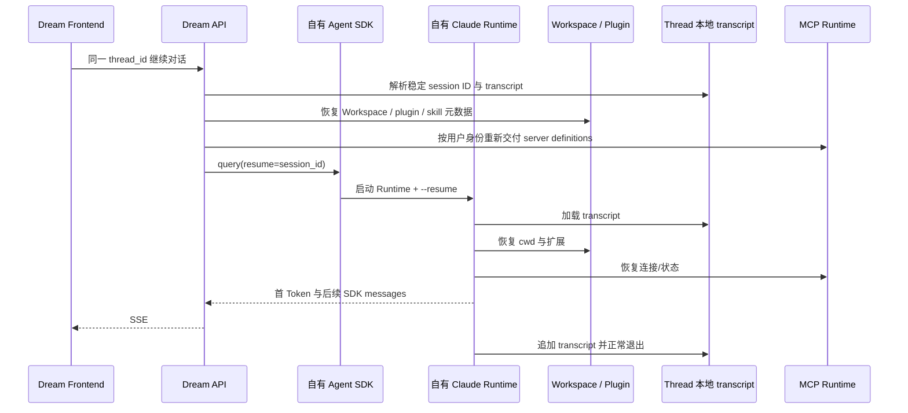

<!-- [输入] 当前 Dream 前后端、Admin/Gateway/PostgreSQL 合同、自有 Claude Agent SDK 与 production-qualified Claude Runtime 证据。 -->
<!-- [输出] 说明 Ink & Memory 当前系统拓扑、版本矩阵、Runtime 调用链、数据边界、发布门和回滚方式。 -->
<!-- [定位] 项目级架构总览；各业务域的细节由 docs/design 与对应 .folder.md 继续维护。 -->
<!-- [同步] 2026-08-24：更新自有 SDK/Runtime 的 main 分支、PyPI/npm 多平台发布链、零 source map 合同与当前未上架边界。 -->

# 项目架构设计说明

> 证据日期：2026-08-24
>
> 当前状态：本机 Dream 已默认使用自有 `ink-claude-dream-agent-sdk` 和 production-qualified `ink-claude-code-dream`；官方 Claude CLI 只保留为显式绝对路径回滚。
>
> 发布状态：两个实现仓库已统一以 `main` 为默认分支；SDK 的 PyPI 流程和 Runtime 的五包 npm 流程已合并，但 registry 包尚未发布，因此 Dream 当前依赖锁和本机内容寻址 Runtime 安装保持不变。
>
> 适用范围：Ink & Memory（Dream）当前本机与容器架构，不包含远程服务器部署和资源调优。

## 1. 架构定位与边界

Ink & Memory 是 React/Vite 前端与 FastAPI 后端组成的创作工作台。Chat、Dream、Deck、Story Workspace、Resources 和 ClaudePlugin 共用同一套用户、Thread、Workspace、Agent 流式协议与 Admin 平台能力。

当前架构遵循以下边界：

- Dream 只执行应用业务；共享 PostgreSQL Schema 由相邻 Admin 仓库的 Drizzle migration 唯一管理。
- Admin 提供管理界面、模型目录、订阅/计费、Gateway 和本机 PostgreSQL supervisor。
- Dream 不执行 runtime DDL，不创建业务表，不提供 SQLite 运行时 fallback。
- Dream 通过自有 Python SDK distribution 启动自有 Claude Runtime，但继续使用上游公开的 `claude_agent_sdk` import/API、`ClaudeAgentOptions.cli_path` 和 stdio JSONL 协议。
- Runtime 与 Dream 的兼容关系是进程接口合同；Dream 不复制 Claude Agent 或 MCP 状态机。
- transcript、Workspace 正文、插件物化、MCP 凭据、OAuth Token 和 Claude 用户配置属于运行时可变数据，不进入 Runtime 发布包。

## 2. 当前系统拓扑



关键关系：

| 组件 | 当前职责 | 禁止越界 |
| --- | --- | --- |
| Dream Frontend | Chat/Dream/Deck/Resources UI，消费公开 REST/SSE | 不持有 Provider Key、MCP Token 或数据库凭据 |
| Dream API | 认证、业务编排、Thread/Run/Workspace、SDK options、SSE | 不迁移 Schema，不实现第二套 Agent/Runtime 协议 |
| Admin | Drizzle Schema、PostgreSQL supervisor、模型/订阅/计费、Gateway | Dream 不复制其账本或模型路由 |
| 自有 Python SDK | 保持上游源码/API，负责公开 SDK transport 和 `cli_path` 注入 | 不加入 Dream DTO、数据库或业务状态机 |
| 自有 Runtime | headless stream-json、tools、resume、MCP、Workspace、sandbox | 不包含用户可变数据；未经授权不得公开再分发派生 bundle |
| Gateway | 按 Admin 发布的模型 alias 完成推理与结算 | 浏览器和 Runtime 不直接选择 Provider ID 或密钥 |

### 2.1 本机启动顺序

1. 在 Runtime 仓库完成本地 package 校验与 `node scripts/install-core-local.mjs`，再执行 `env -u CLAUDE_CODE_CLI_PATH -u INK_CLAUDE_CODE_BUN_PATH ink-claude-code-dream --version`；预期为 `2.1.241 (Claude Code)`，且实际工具链为独立 Bun `1.4.0`。
2. 在 `../ink-admin-memory` 执行 `pnpm dev`。该 supervisor 管理本机 PostgreSQL（默认 `127.0.0.1:54329`，以 Admin `.env.local` 为准），并在 `http://127.0.0.1:3000` 提供 Admin/Gateway。
3. 在 Dream 的 `backend/` 执行 `.venv/bin/python server.py`；启动门先验证 SDK distribution 和 Runtime，再在 `http://127.0.0.1:8765/api/health` 提供健康检查。
4. 在 `frontend/` 执行 `npm run dev`，访问 `http://127.0.0.1:5173`。

首次配置、Admin Drizzle migration、订阅/Gateway provision 的完整命令仍以仓库根 [`README.md`](../../README.md) 为准。Dream 启动不运行 migration；Runtime 缺失时应先安装本地 qualified release，不通过业务代码兜底。

## 3. 当前版本矩阵

版本必须区分“Dream 实际依赖”“本机实际执行”“容器回滚物”“恢复源码证据”，不能用其中一项代替另一项。

| 对象 | 当前版本或身份 | 适用性 |
| --- | --- | --- |
| Dream Python | 本机 `3.12.9`；容器 `python:3.12-slim-bookworm` | 当前后端和 SDK 构建/运行基线 |
| Dream 自有 SDK distribution | `ink-claude-dream-agent-sdk==0.2.143` | `pyproject.toml`、`uv.lock`、`requirements.txt` 均固定到 commit `bcdfbcf9f72bc34865d0efeb5f971d6df005f5b4` |
| SDK import/API | `claude_agent_sdk`；`ClaudeAgentOptions`、`ClaudeSDKClient`、`query` | 与上游公开 API 一致；official `claude-agent-sdk` 不得并存 |
| SDK 上游源码基线 | Anthropic commit `542fefb3b94be87760b2513fff889b91bb5b6672`，tree `1c86f3a9144616da2a9435f0440066e23a4b580b` | 自有 SDK `src/` 与该 MIT 源码基线一致；机器证明位于打包仓库 `packaging/upstream.json` 与 `scripts/verify_upstream.py` |
| SDK 打包仓库提交关系 | Dream 安装 `bcdfbcf9f72bc34865d0efeb5f971d6df005f5b4`；文档提交 `e3182c700838862129b7008f485621f07ee41ae1` 是其直接子提交 | `bcdfbcf...` 改 distribution/portable packaging，`e3182c...` 只补来源差异说明；两者的 `src/` 均由 upstream verifier 要求与 `542fef...` 空差异 |
| SDK registry 发布链 | 仓库默认分支 `main`，提交 `a7ea536` | wheel/sdist 经可复现双构建、隔离安装 smoke、TestPyPI 精确文件名/SHA-256/下载字节校验后才可进入 PyPI；所有输入和制品拒绝 `*.map`；尚未上传 |
| 自有 Runtime package | `ink-claude-code-dream==0.1.0`，Runtime commit `cb91a9901303dccb98c5b41cbfa6d56ab88ce97a` | 本机默认 PATH 入口；release manifest 为 `productionEligible=true` |
| Runtime npm 发布链 | 仓库默认分支 `main`，提交 `b927f01` | selector `@glide-the/ink-claude-code-dream` + darwin/linux 的 arm64/x64 四个平台包；仅 native runner，Bun `1.4.0`，Linux 仅 glibc，精确五包验证；许可证门关闭，尚未上传 |
| Runtime 恢复源码证据 | Claude Code `2.1.88`，4,471 文件，46,447,794 bytes，source digest `470ca57d6390e2f9df5e2bb0a6f32b8b62c64f262ae3d02a31349488a08c228e` | 只证明该恢复树及其调用图，不等同于官方 `2.1.241` 源码 |
| Runtime Dream-facing 兼容标识 | `2.1.241` | 自有 Runtime `--version` 和 manifest 的 Dream 所需接口资格标识；不声明与官方 `2.1.241` 的全部产品行为或内部源码等价 |
| Runtime core bundle | SHA-256 `a300fe7fb3da453e45b2f2cd7721bef1963aa991498c26a2826fef8b381161f5` | 1,989 inputs、48 outputs、0 resolution gaps、88 个非必要 feature gate 关闭 |
| Runtime 构建/执行 Bun | 独立安装的 `1.4.0`，命令名 `ink-claude-code-bun-1.4.0` | Runtime 启动器优先使用版本化 Bun；不会覆盖全局 Bun |
| 本机环境 Bun | `1.2.20` | 只表示用户全局工具；不是 Runtime 的执行 Bun |
| 本机 Node | `24.13.0` | Runtime 最终验证使用该精确 Node 版本 |
| 容器 Node | `22.18.0` | Docker build 固定版本，满足官方回滚 CLI 声明要求 |
| 本机 ambient official CLI | `~/.local/bin/claude` → `2.1.220` | 不是 Dream 默认路径，也不能冒充 Docker 的 `2.1.241` 回滚物 |
| Docker official rollback CLI | `@anthropic-ai/claude-code==2.1.241` | 只有显式绝对 `CLAUDE_CODE_CLI_PATH` 才会选择；默认 resolver 不回退到它 |
| MCP 兼容增量 | Claude Code `2.1.238`、`2.1.239` changelog 行为 | Runtime 仓库 `compat/mcp-auth/src/patch-spec.ts` 以目标文件 SHA-256 和六个 transform ID 绑定 `2.1.88` 恢复树；不是 `2.1.89–2.1.241` 全量源码移植 |
| Python MCP SDK | Dream 当前 `1.27.1`；OAuth fixture 固定 official MCP SDK `2.0.0` commit `6f69a3758ebf2ee55ce050f58b470ce11af71133` | 前者是 Dream 运行依赖，后者只用于完整 OAuth CLI 合同验证 |

版本适用性结论：官方 CLI/SDK 行为、Dream 当前代码和 release manifest 是当前接口证据；恢复源码只能证明 `2.1.88` 的内部图。`2.1.238`/`2.1.239` 行为通过独立兼容补丁和进程合同补齐，不能把恢复源码版本号直接改写为最新版源码，也不能把 Dream-facing `2.1.241` 解读为官方完整实现等价。

## 4. 仓库与模块边界

```text
ink-dream-memory/
├─ frontend/                         # React/Vite SPA
│  ├─ src/components/chat/           # Chat/SSE/tool/Workspace 展示
│  ├─ src/components/claude-mcp/     # Claude MCP Resources 与 Tools inventory
│  └─ src/pages/story-workspace/     # Chat、Dream、Deck、Work/Settings
├─ backend/                          # FastAPI/Python 3.12
│  ├─ server.py                      # app、router、startup Runtime/SDK fail-closed gate
│  ├─ database.py                    # PostgreSQL 业务访问；不拥有 Schema migration
│  ├─ claude_agent/                  # Thread 生命周期、Context、EventBus、持久化
│  ├─ claude_mcp/                    # user-scoped MCP config/OAuth/inventory
│  ├─ libs/claude_agent_kit/         # SDK adapter、runner、Workspace、sandbox
│  ├─ services/story_workspace/      # Dream/Story artifact projection
│  ├─ services/claude_plugin/        # Plugin 安装与 Marketplace 投影
│  └─ routers/                       # REST/SSE 公开生产入口
├─ docs/architecture/                # 项目级与模块级架构
└─ docs/design/                      # 业务与技术设计真相源
```

外部相邻仓库：

| 仓库 | 职责 |
| --- | --- |
| `ink-admin-memory` | PostgreSQL Drizzle migration、Admin、Gateway、模型、订阅与计费 |
| `ink-claude-dream-agent-sdk-python` | 自有 SDK distribution 与可复现 Python 打包流程 |
| `ink-claude-code-dream` | Runtime capability profile、Bun 构建、兼容补丁、资格门、安装器 |
| `claude-agent-sdk-python` | 只读上游 SDK 参考 |
| `claude-code-sourcemap/restored-src` | 只读恢复源码输入；不得提交到 Dream 或 Runtime 远程仓库 |

## 5. Claude Agent 启动与调用链

### 5.1 后端启动门

`backend/server.py::startup_claude_agent()` 在启动 Agent factory 前执行两层门禁：

1. `require_dream_claude_sdk_distribution()` 验证 distribution 名、精确版本、唯一 import provider、公开 API 和 canonical stream message types。
2. `resolve_claude_cli_path()` 解析 Runtime；默认路径必须带可读的 release manifest、capability evidence 和 `productionEligible=true`。

任一门失败，FastAPI 启动即 fail closed，不允许 SDK bundled CLI 或 ambient `claude` 静默形成第二条生产路径。

### 5.2 Runtime 解析顺序

| 优先级 | 来源 | 合同 |
| --- | --- | --- |
| 0 | 调用方已设置 `ClaudeAgentOptions.cli_path` | 保留上游公开注入点，不被 helper 覆盖 |
| 1 | `CLAUDE_CODE_CLI_PATH` | resolver 只强制“存在、可执行、绝对路径”；唯一人工回滚入口，版本、哈希和 capability 必须由发布/运维预检证明，Dream 启动门不会替操作者认证任意 override |
| 2 | PATH 中的 `ink-claude-code-dream` | 默认生产路径；必须通过 manifest/capability 资格门 |
| 3 | 无匹配 | 抛出 Runtime unavailable；禁止 bundled/ambient fallback |

本机安装器将 Runtime 与 Bun 复制到内容寻址目录，再建立两个 PATH 软链接：

```text
~/.local/bin/ink-claude-code-dream
  -> ~/.local/share/ink-claude-code-dream/releases/<version-payload>/bin/ink-claude-code-dream

~/.local/bin/ink-claude-code-bun-1.4.0
  -> ~/.local/share/ink-claude-code-dream/toolchains/<version-digest>/bun
```

Runtime 启动器会跟随自身软链接定位真实 release root，并按“显式 `INK_CLAUDE_CODE_BUN_PATH` → 版本化 Bun → ambient Bun 候选”选择工具链；每次启动仍校验 Bun 必须精确为 `1.4.0`。当前 ambient `1.2.20` 只会给出明确失败，不构成可用回滚。

当前容器边界必须单独说明：`backend/Dockerfile` 已安装自有 SDK，但没有把受再分发限制的自有 Runtime artifact 写入镜像源码。容器只有在构建/启动拓扑额外安装同一 production-qualified 本地 artifact 并把入口放入 PATH 时才走默认自有 Runtime；当前仓库自带的可启动回滚是显式设置 `CLAUDE_CODE_CLI_PATH=/usr/local/bin/claude` 选择 build-time 验证过的 official `2.1.241`。没有这两者时容器按设计 fail closed。

### 5.3 正常 turn 调用链

```text
POST /api/claude-agent
  → JWT / Thread / Deck 鉴权
  → ClaudeAgentThreadFactory
  → Context Assembly
      → Workspace Mode / Deck / Plugin / Skill / MCP user identity
      → {thread}/.claude-home
      → {thread}/.claude-tmp (0700)
  → ClaudeAgentRunner
      → ClaudeAgentOptions(env, cwd, resume, sandbox, mcp_servers, hooks, cli_path)
  → ink-claude-dream-agent-sdk
  → ink-claude-code-dream
  → Admin Gateway / MCP servers / Workspace tools
  → SDK messages
  → Dream SSE EventBus
  → PostgreSQL message/thread/run records
```

## 6. Runtime 能力边界

Dream startup manifest 要求以下能力全部保留：

| 能力组 | 当前状态 | 业务原因 |
| --- | --- | --- |
| headless stream-json / 双向 control | 保留并验证 | SDK query、SSE、permission、cancel 的基础协议 |
| tool use/result 与 confirmation | 保留并验证 | Bash、文件、MCP 和人工确认 |
| session / transcript / resume | 保留并验证 | Thread 连续多轮与恢复 |
| Workspace / cwd / 文件工具 | 保留并验证 | Chat/Dream 工作区与 artifact |
| sandbox / thread-local TMPDIR | 保留并验证 | 文件、凭据和临时配置边界 |
| MCP stdio / HTTP / OAuth / Resources / management identity | 保留并验证 | Resources 页面和 Agent MCP |
| plugins / skills / hooks / ordinary subagent | 保留并验证 | Deck 插件、Skill、Hook 同步和 Agent 工具链 |
| authentication / gateway/provider | 保留并验证 | Admin Gateway 推理路径 |

编译期关闭 88 个与当前 IM 合同无关的 feature gate，主要包括 Remote Control/CCR、team/swarm UI、IDE/terminal UI、voice、SSH remote、浏览器工具、反馈/上传设置、增强 telemetry、交互历史选择器和实验性产品功能。关闭的是经 profile、source assertion、DCE 和接口测试证明的分支；共享 diagnostics、协议、认证、MCP、tools、Workspace、sandbox、resume 等未按名称猜测删除。

## 7. Workspace、transcript 与运行时数据生命周期

| 数据 | 位置/所有者 | 生命周期 | 发布包 |
| --- | --- | --- | --- |
| Thread Workspace | `{AGENT_CWD}/{thread_id}` | Thread 所有权；由 Dream 创建和鉴权 | 禁止打包 |
| Claude config home | `{thread}/.claude-home` | plans/tasks/projects transcript/plugins/agents 等 thread-local 状态 | 禁止打包 |
| Claude 临时根 | `{thread}/.claude-tmp` | CLI spawn 前创建、非 symlink、权限 `0700` | 禁止打包 |
| session transcript | `.claude-home/projects/.../*.jsonl` | session ID 与 resume 的文件真相；路径解析统一走 config-home resolver | 禁止打包 |
| MCP 用户配置/凭据 | server-owned user root；平台 secure storage | 与 thread 解耦；每 turn 在 resume 探针前按需交付 | 禁止打包 |
| Plugin/Skill 物化 | Thread Workspace / config home | 根据 Deck/用户安装状态生成，退出后按各域合同维护 | 禁止打包 |
| Runtime bundle/manifest/SBOM/checksum | content-addressed Runtime release | 不可变安装资产 | 仅本地派生使用；公开再分发门关闭 |

Workspace Mode 关闭时仍会创建 thread runtime root 与 `.claude-tmp`，但不会因此设置 SDK `cwd`、注入 Workspace context、展示文件侧栏或启用 sandbox settings。

## 8. MCP 架构

Claude MCP Resources 与 Agent turn 共用 `resolve_claude_cli_path()`，保证管理命令和 SDK 会话执行同一 Runtime 身份。

- OAuth 使用公开 argv：`mcp login --no-browser`、`mcp logout`、`mcp get`、`mcp list`。
- user-scope server definitions 通过公开 `ClaudeAgentOptions.mcp_servers` 注入。
- 当前自有 Runtime 在所有平台把有效 `CLAUDE_SECURESTORAGE_CONFIG_DIR` 视为权威 actor-owned secure-storage 根，只读写其中权限为 `0600` 的 `.credentials.json`；默认业务路径不访问用户 Keychain。
- Linux 仍按现有 Dream synchronizer 合同把 opaque `mcpOAuth` 投影到 thread config home 的受保护凭据文件；macOS Agent 通过同一 selector 直接复用用户根文件，不把 Token 复制到 thread。
- Tools inventory 使用公开 `get_mcp_status()`；公共 SDK 未报告 Resources/Prompts 数量时显示 `not_reported`，不解析 `/mcp` TUI 猜测。
- `2.1.238` 增量：stdio 初始化先于 discovery、disabled server 不做 health connect、headers helper trust/cwd、凭据环境过滤。
- `2.1.239` 增量：远端 MCP mid-session reconnect / SDK `setMcpServers` 的瞬时 5xx 有界恢复；401/403 不重试，错误输出脱敏。

## 9. 数据、认证和 Gateway

### 9.1 PostgreSQL 与 Admin Schema

Dream 通过 `backend/database.py` 访问共享 PostgreSQL，但 Schema 只由 Admin Drizzle 管理。缺少精确 capability 时业务能力 fail closed。禁止 Alembic revision、runtime `CREATE/ALTER TABLE` 和 SQLite fallback。

### 9.2 用户认证

- 邮箱密码、Google OAuth/OIDC 和 OAuth Device Flow 均由 FastAPI auth 路由完成。
- Google token 只证明上游身份；业务 API 只接受 Dream 签发并校验的本系统 token。
- REST、SSE、Workspace 内容和 Resources API 均从 JWT 解析 canonical user identity。

### 9.3 模型与计费

- Dream 只使用 Admin 发布的模型 alias。
- Agent/Gateway 请求、首 Token、用量、reserve/capture/release 写入正常 Admin-owned PostgreSQL。
- 浏览器、Deck 或 Runtime 不直接接收 Provider Key、Provider ID 或未发布模型名。
- `ANTHROPIC_BASE_URL`、`ANTHROPIC_AUTH_TOKEN` 等仍是 Claude SDK/CLI 的协议字段名；Gateway 启用后，Dream 会清除直接 Provider 凭据，把 base URL 改为 Admin Gateway、通过 server-owned `apiKeyHelper` 发行短期 subject token，并注入 Gateway service header。这些值不是浏览器或用户提供的上游 Provider Key。

## 10. 业务时序

### 10.1 正常会话



### 10.2 Resume



## 11. 构建、安装、发布与回滚

### 11.1 自有 SDK

- Python 包名：`ink-claude-dream-agent-sdk`。
- import 名保持 `claude_agent_sdk`。
- wheel/sdist 使用规范 `pyproject.toml` 流程；Bun 不替代 Python 包格式。
- portable artifact 排除官方 bundled Claude executable。
- PyPI 发布链固定为 build → 隔离安装 smoke → TestPyPI → 精确字节校验 → PyPI；wheel、sdist、CI artifact 和 registry 下载物全部拒绝 `*.map`。
- 当前尚未上传 registry，Dream 仍依赖固定不可变 Git commit，并在启动时验证唯一 provider；只有真实 PyPI 版本存在且安装验证通过后，才原子更新 `pyproject.toml`、`uv.lock` 与 `requirements.txt`。

### 11.2 自有 Runtime

- Bun `1.4.0` 构建恢复源码的最小 headless bundle。
- 包含 entrypoint、核心 JS 资源、manifest、capabilities、SBOM、许可证清单、checksum 和资格摘要。
- 安装前再次验证 `productionEligible=true`、核心哈希、payload inventory 和可复现回执。
- Runtime 与 Bun 分开内容寻址安装，不升级全局 Bun。
- npm 目标布局是一个 selector 包和 `darwin-arm64`、`darwin-x64`、`linux-arm64`、`linux-x64` 四个精确平台包；Windows、musl 和交叉打包 fail closed。
- legacy envelope、minimal core、npm staging、prepack、dry-run inventory 与最终 tgz 均禁止 `*.map`；meta attestation 绑定四个平台 tgz、qualification、core 和 payload 摘要。

### 11.3 发布法律门

恢复源码和派生 core bundle 没有已确认的公开再分发授权，因此：

- 可以推送仓库自有的构建脚本、patch、manifest、测试和文档。
- 不得把恢复源码、派生 Runtime artifact、用户数据或凭据提交到公开远程仓库。
- 当前 manifest 保持 `publicationAllowed=false`、`redistributionAllowed=false`。
- `productionEligible=true` 只表示本地技术资格，不等于公开发布许可。
- npm 首发还要求 `glide-the` 账户启用 2FA，先手工创建五个包，再为后续发布配置 Trusted Publisher；这些账号动作不能绕过书面再分发授权。

### 11.4 回滚

显式设置绝对 `CLAUDE_CODE_CLI_PATH` 可切回经发布流程预检的 official CLI；当前 Docker 回滚绝对路径为 `/usr/local/bin/claude`。resolver 本身只做路径结构检查，因此禁止把未经版本/help/协议验证的任意可执行文件当成“已验证回滚”。回滚不改变 Dream 业务代码、SDK API、数据库 Schema、Thread ID、transcript 格式或 Workspace 布局。删除/替换本机 PATH 软链接属于独立运维动作，不应由 Dream 启动代码自动执行。

## 12. 当前验证证据

| 验证 | 结果 |
| --- | --- |
| Runtime 完整仓库验证 | exit 0；Node 44 passed / 2 external OAuth-fixture skips，MCP compatibility 46 passed / 6 authorized-source fixture skips，SDK/acceptance/release/reproducibility 全部通过 |
| Runtime 包校验 | 62 files、61 checksums、core SHA-256 `a300fe...161f5`、`productionEligible=true` |
| Runtime npm 多平台合同 | exit 0；Node 53 passed / 2 OAuth fixture skips；授权 fixture 实际执行 native stage、Bun postinstall、CLI smoke、四个平台 tgz、meta 聚合和精确五包验证；仓库非依赖 `*.map` 为 0 |
| SDK PyPI 发布合同 | 1498 passed / 5 skipped；Ruff、Mypy、YAML、Twine strict、双构建字节一致、fresh venv public query smoke 和 source-map 注入拒绝均通过 |
| Runtime 安装合同 | content-addressed Runtime + Bun `1.4.0`；ambient Bun 保持 `1.2.20` |
| Dream 启动 | 清除 `CLAUDE_CODE_CLI_PATH` 与 `INK_CLAUDE_CODE_BUN_PATH` 后，FastAPI 输出 `Claude Agent factory started` 和 `Application startup complete`，随后干净关闭 |
| SDK 真实进程差分 | 本轮 exit 0；stream、tool、permission、Workspace、plugin/skill/hook、subagent、transcript/resume、sandbox、cancel 全部对齐；不包含本轮 stdio/HTTP MCP comparator 重跑 |
| MCP management 合同 | exit 0；user HTTP lifecycle、带冒号名称、OAuth help、身份隔离与安全错误脱敏通过 |
| Dream 真实业务主链 | 同一 core hash 的既有回执：账号 `dmeck123@suoxya.com`、Deck `剧本创作团队`；新会话、多轮、resume、SSE、Workspace、Gateway 和 ledger 通过；本轮安装器修复未另建业务 Run |
| Comfy MCP OAuth | 当前自有 Runtime 对 `https://cloud.comfy.org/mcp` 的真实授权通过；fresh inventory 为 `connected`、`comfyui-cloud 0.40.1`、41 Tools；logout/remove 清理通过；因费用门禁未执行远端 Tool |

本轮安装修复未修改 Runtime core bytes，因此没有重新生成正常数据库中的业务 Run；既有完整业务回执继续绑定同一 core bundle hash。启动和安装变化由真实 FastAPI startup、SDK 进程差分、MCP management 与 package verifier 覆盖。最新 stdio/HTTP MCP comparator 校准在候选启动前即因参考环境漂移失败，本轮没有把它报告为“重跑通过”；当前依据是同 core hash 的既有完整差分回执和本轮 management/OAuth/inventory 回执。

## 13. 相关设计真相源

- [`docs/architecture/claude-agent.md`](claude-agent.md)：Claude Agent 模块分层与 API。
- [`docs/design/claude-agent/claude-sdk-env-design.md`](../design/claude-agent/claude-sdk-env-design.md)：SDK env、config home、TMPDIR 与 Runtime resolver。
- [`docs/design/claude-agent/claude-agent-sdk-cli-compatibility-report.md`](../design/claude-agent/claude-agent-sdk-cli-compatibility-report.md)：SDK/Runtime 配对、历史问题和发布门。
- [`docs/design/claude-mcp/claude-mcp-resource-connector-design.md`](../design/claude-mcp/claude-mcp-resource-connector-design.md)：MCP Resources/OAuth/Tools inventory。
- [`docs/design/dream-agent/architecture.md`](../design/dream-agent/architecture.md)：Dream/Chat 共享 Thread 与 artifact 工作台。
- [`docs/design/deck/README.md`](../design/deck/README.md)：Deck、Agent、Plugin 引用和版本化内容。

文档与实现发生冲突时，以当前代码、release manifest、Admin Schema capability 和自动化测试回执为准，并同步修正文档；不得用历史恢复源码推断当前官方 CLI 的全部行为。
