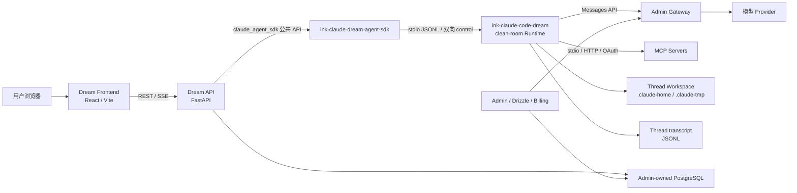
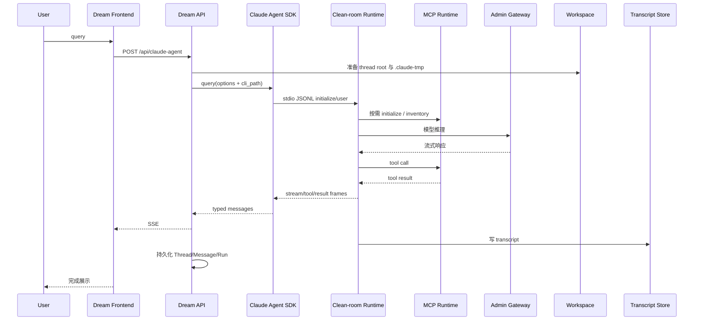
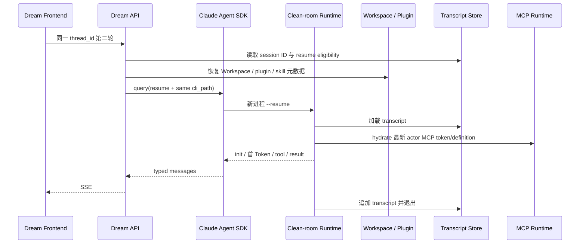
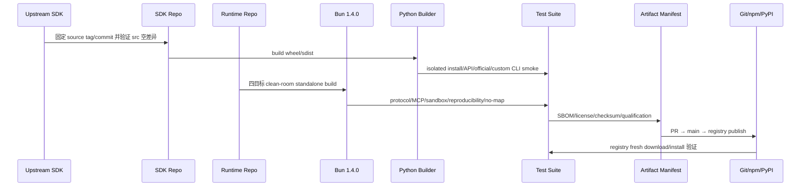

<!-- [输入] Dream 当前代码、Admin/Gateway/PostgreSQL 合同、自有 Claude Agent SDK main 与 clean-room Runtime main/npm registry 证据。 -->
<!-- [输出] 说明 Ink & Memory 当前拓扑、版本矩阵、Claude Runtime 能力边界、发布物、业务验证和回滚合同。 -->
<!-- [定位] 项目级架构总览；各领域细节由 docs/design 与对应 .folder.md 继续维护。 -->
<!-- [同步] 2026-08-30：Dream 源码/Docker 精确采用公开 Runtime 0.1.4；记录 Notion Bash sandbox、same-SHA workflow、registry fresh install 和真实 Dream 验收。 -->
<!-- [同步] 2026-08-26：本机默认 Runtime 软链接已从保留的 0.1.0 回滚树切换到公开 registry 0.1.1 内容寻址安装树。 -->
<!-- [同步] 2026-08-26：更新 SDK 0.2.144 与 Runtime 0.1.1 的正式 registry、workflow、哈希和 Dream 精确版本合同。 -->
<!-- [同步] 2026-08-25：MCP HTTP 改为匿名优先连接，以正交 auth_state 和安全 Failure-Code 保留 OAuth、logout、cancel、inventory 与 resume 合同。 -->
<!-- [同步] 2026-08-25：记录目标匿名 MCP 与规范 OAuth MCP 的真实 Chat，以及 Dream Workflow、Workspace/sandbox、Runtime 故障恢复、Gateway/账本和 Admin UI 完整业务回执。 -->
<!-- [同步] 2026-08-25：MCP Resources 管理面迁移到 Dream PostgreSQL 与标准 MCP SDK，列表和认证状态不再调用 Runtime mcp list/get。 -->

# 项目架构设计说明

> 证据日期：2026-08-30
>
> 当前状态：本机 Dream 默认使用自有 Python SDK 和仓库独立实现的 clean-room Claude Runtime；官方 Claude CLI 只作为显式绝对路径回滚。
>
> 发布状态：SDK `0.2.144` 已通过 Trusted Publisher 同时发布到 TestPyPI 与正式 PyPI；Dream 使用正式 PyPI 精确版本和 wheel/sdist SHA-256 锁。Runtime `main@0ebafe95db22101cf77db2c27e73b561d3af37a6` 的五个 `0.1.4` npm 包均已公开并通过 provider-free registry fresh install；最小五包权限 npm token 与 GitHub `npm` Environment Secret 按用户要求保留。
>
> 本文只描述 Dream 本机和制品架构，不讨论远程服务器部署、内存调优、数据库 migration 或 Dream 新业务功能。

## 1. 架构决策

Dream 与 Claude Runtime 的关系是公开接口兼容，不是源码耦合：

- Dream 业务代码继续使用 `claude_agent_sdk` 公共 import/API。
- 自有 Python distribution 名为 `ink-claude-dream-agent-sdk`，源码和公开 API 与固定上游基线一致。
- SDK 通过上游已有的 `ClaudeAgentOptions.cli_path` 启动 Runtime，不复制 transport、Agent 状态机或 MCP 状态机。
- 自有 Runtime 位于独立仓库 `ink-claude-code-dream`，公共发布路径只编译仓库自有 `src/cleanroom/` 与兼容许可证依赖。
- 恢复源码、旧派生 bundle、sourcemap 项目和 Anthropic 非公开实现不进入 clean-room 编译图、Git 发布内容或 npm tarball。
- 当前 IM 不需要的 Remote Control、team/swarm、IDE/TUI、voice、SSH remote、browser、updater、feedback、交互历史选择器和增强 telemetry 等产品模块，不存在于 clean-room Runtime 的生产图中。
- SDK、MCP、tools、SSE、Workspace、sandbox、transcript、resume、plugins/skills/hooks、普通 subagent 与 Gateway 接口继续保留。

## 2. 当前系统拓扑



| 组件 | 当前职责 | 禁止越界 |
| --- | --- | --- |
| Dream Frontend | Chat、Dream、Deck、Resources UI，消费 REST/SSE | 不持有 Provider Key、MCP Token 或数据库凭据 |
| Dream API | 认证、Thread/Run/Workspace、SDK options、SSE、业务持久化 | 不管理共享 Schema，不实现第二套 Agent/Runtime 协议 |
| Admin | Drizzle Schema、PostgreSQL、模型、订阅、计费、Gateway | Dream 不复制其账本和模型路由 |
| 自有 Python SDK | 上游兼容 API、transport、`cli_path` 注入 | 不加入 Dream DTO、数据库或业务状态机 |
| clean-room Runtime | JSONL、Provider/tool loop、resume、MCP、Workspace、sandbox | 不包含 IM 业务代码或用户可变数据 |
| Gateway | 模型 alias、推理和用量结算 | Runtime 不持有浏览器用户提供的 Provider Key |

## 3. 当前版本矩阵

下表区分 Dream 实际依赖、本机实际执行、构建工具和显式回滚物。历史恢复源码不再是当前 Runtime 的实现输入。

| 对象 | 当前版本或身份 | 当前适用性 |
| --- | --- | --- |
| Dream Python | 本机 `3.12.9`；容器 Python `3.12` | 后端与 SDK 运行基线 |
| 自有 SDK distribution | `ink-claude-dream-agent-sdk==0.2.144` | 正式 PyPI；Dream `pyproject.toml` 固定精确版本，`uv.lock`/`requirements.txt` 固定 wheel 与 sdist SHA-256，Docker 使用 `--require-hashes` |
| SDK import/API | `claude_agent_sdk`、`ClaudeAgentOptions`、`ClaudeSDKClient`、`query` | 与上游公共 API 一致；官方 distribution 不得并存 |
| SDK 上游基线 | commit `542fefb3b94be87760b2513fff889b91bb5b6672`；tree `1c86f3a9144616da2a9435f0440066e23a4b580b` | SDK 仓库 verifier 要求 `src/` 与该 MIT 基线空差异 |
| SDK 源码基线 | tag `v0.2.144` → commit `fa10c9ef04ec006d9dcf0a88b1b35dab4ef4723b` | 发布源码身份不可变；公开 API 与上游固定基线一致 |
| SDK 仓库/发布流 | `main@fa10c9ef04ec006d9dcf0a88b1b35dab4ef4723b` | PR #7；Actions run `32874352449` 的 TestPyPI、正式 PyPI 和远端字节复验全部成功 |
| clean-room Runtime package | `@glide-the/ink-claude-code-dream@0.1.4` | npm 公开 selector；对 Dream 输出 `2.1.241 (Claude Code)` 兼容标识；manifest 配对 SDK `0.2.144` |
| Runtime 仓库 | release `main@0ebafe95db22101cf77db2c27e73b561d3af37a6` | qualification run `33306855166` 与 publish run `33306940462` 均成功 |
| Runtime 实现输入 | `src/cleanroom/` 49 个文件、298,855 字节；tree SHA-256 `266362ac3543ca6d5dc7a400e2a23ac718e231abb761eab8f824726ab595de81` | 仓库自有 MIT 代码；禁止输入扫描不含 restored/vendor 代码 |
| Runtime 构建器 | Bun `1.4.0` | 四个 standalone target 的精确构建版本 |
| selector Node 合同 | `>=22 <25`；CI `24.13.0` | selector 支持范围；本机 Node `26.4.0` 只用于额外 smoke，不作为支持声明 |
| Anthropic Messages SDK | `@anthropic-ai/sdk@0.74.0`，MIT | Provider streaming 依赖 |
| MCP SDK | `@modelcontextprotocol/sdk@1.30.0`，MIT | stdio、HTTP、Resources、OAuth 依赖 |
| sandbox runtime | `@anthropic-ai/sandbox-runtime@0.0.73`，Apache-2.0 | macOS `sandbox-exec` 与 Linux `bubblewrap` 适配 |
| Python MCP SDK | Dream `1.27.1` | Dream MCP 服务端/测试依赖 |
| Runtime 平台 | darwin/linux × arm64/x64 | Windows、musl 和交叉选择 fail closed |
| registry 验收 Runtime | v2 source tree `266362ac…95de81`；darwin-arm64 executable `969f9193…980dd` | fresh install 只选择当前平台包；两个 CLI alias、manifest 配对、exact native digest、`sandbox.notion-cli` 与零 `.map` 通过 |
| Runtime executable | darwin-arm64 SHA `969f9193be8750e2573e4c4ea9c3556d48687925d9f57b8ea676669d753980dd` | `0.1.4` 公开平台包执行对象 |
| Docker 默认 Runtime | npm `@glide-the/ink-claude-code-dream==0.1.4` | 先装 selector/匹配 Linux 平台包；构建时执行版本、manifest 与 Dream resolver 门 |
| 本机现有服务 Runtime | 受控绝对路径运行 digest-bound `0.1.4` darwin-arm64 executable | 与公开 0.1.4 平台包的 source/executable binding 一致；全局 PATH 安装仍由操作者按 README 单独管理 |
| Docker official 回滚 CLI | `@anthropic-ai/claude-code==2.1.241` | 仅显式绝对 `CLAUDE_CODE_CLI_PATH=/usr/local/bin/claude` 选择 |
| ambient official CLI | 本机 `2.1.220` | 不是 Dream 默认路径，不可静默 fallback |

版本结论：`2.1.241` 是 Dream 面向 Runtime 的 CLI/协议兼容标识，不表示复刻官方全部产品功能或源码。当前实现真相源是 clean-room 代码、manifest、SBOM、协议测试和真实业务回执。

## 4. 仓库与职责边界

| 仓库 | 职责 | 当前分支规则 |
| --- | --- | --- |
| `ink-dream-memory` | SDK/Runtime 接入、业务入口与真实验收 | 不实现 SDK 或 CLI 内部逻辑 |
| `ink-claude-dream-agent-sdk-python` | SDK 同步、Python 打包、PyPI 流程 | SDK 任务只在该项目发起；统一使用 `main` |
| `ink-claude-code-dream` | clean-room Runtime、Bun、多平台 npm、协议测试 | CLI 任务只在该项目发起；统一使用 `main` |
| `ink-admin-memory` | PostgreSQL Drizzle、Admin、Gateway、订阅与计费 | Dream 不新增 migration |
| `claude-agent-sdk-python` | 只读上游 SDK 参考 | 禁止覆盖 |
| `claude-code-sourcemap/restored-src` | 只读历史研究参考 | 不得进入 clean-room 编译图或公共制品 |

Dream 当前只修改了 SDK 依赖固定、Docker/启动合同测试、真实 E2E harness 和中文文档；没有新增业务状态机、Schema、migration 或 Runtime 绕过逻辑。

## 5. SDK 与 Runtime 启动合同

### 5.1 启动门

Dream 启动时按顺序验证：

1. 唯一安装的 distribution 是 `ink-claude-dream-agent-sdk==0.2.144`。
2. `claude_agent_sdk` 公共 API 与 canonical message types 存在。
3. Runtime 路径为显式 override 或 PATH 中的 `ink-claude-code-dream`。
4. 默认自有 Runtime 必须有匹配的 release manifest、capability 清单和 checksum。
5. 任一门失败即 fail closed；禁止回退到 SDK bundled CLI 或 ambient `claude`。

### 5.2 解析顺序

| 优先级 | Runtime 来源 | 合同 |
| --- | --- | --- |
| 0 | 调用方已提供 `ClaudeAgentOptions.cli_path` | 完全复用上游注入点 |
| 1 | 绝对 `CLAUDE_CODE_CLI_PATH` | 人工回滚入口；必须预先验证版本、能力和哈希 |
| 2 | PATH 中 `ink-claude-code-dream` | 默认生产路径；selector 选择精确平台包 |
| 3 | 无匹配 | 抛出 Runtime unavailable，不静默降级 |

旧 `0.1.0` qualification/registry 安装树继续作为回滚证据；现有用户服务的本机默认软链接仍指向
已验证的 `0.1.1`，本轮没有重启或热切换服务。公开 `0.1.2` 已在 verifier 临时空目录完成 selector、
两个 alias、manifest 与 no-map 验收；Dream 源码与 Docker 默认版本固定为 `0.1.2`：

```text
~/.local/share/ink-claude-code-dream/acceptance/
  npm-cleanroom-0.1.0-8e0cdc0350b0/
    node_modules/@glide-the/ink-claude-code-dream/
    node_modules/@glide-the/ink-claude-code-dream-darwin-arm64/

~/.local/share/ink-claude-code-dream/releases/
  npm-registry-0.1.0-3c7c357eda41/  # 保留回滚
  npm-registry-0.1.1-1153970fe79f/
    node_modules/@glide-the/ink-claude-code-dream/
    node_modules/@glide-the/ink-claude-code-dream-darwin-arm64/

~/.local/bin/ink-claude-code-dream
  -> releases/npm-registry-0.1.1-1153970fe79f/.../bin/ink-claude-code-dream
```

selector 只负责平台选择和启动 native standalone；Bun 已编译进可执行文件，不再依赖独立运行时软链接。

## 6. IM 所需能力矩阵

clean-room Runtime 只实现 Dream Agent 执行面所需能力；迁移前 MCP management identity
保留为显式回滚/导入背景，不进入 Dream Resources 正常生产图。状态“已验证”表示存在
provider-free 进程测试；真实业务列另说明本机 IM 证据。

| 能力 | IM 使用状态 | 调用入口 | 加载时机 | 禁用影响 | 证据 |
| --- | --- | --- | --- | --- | --- |
| `protocol.streaming` | 已证实使用 | Runtime JSONL → SDK → SSE | turn 全程 | 首 Token、增量和终态丢失 | protocol tests；真实两轮 Chat |
| `protocol.control.bidirectional` | 已证实使用 | SDK stdin/control request | permission、hook、cancel | 工具确认和取消失效 | protocol/permission tests；真实确认 200 |
| `session.resume` | 已证实使用 | session ID、`--resume` | 第二轮及恢复 | 同一 Thread 无法续聊 | fresh/resume tests；真实刷新后同 Thread |
| `transcript.jsonl` | 已证实使用 | session store | turn 写入/恢复 | resume 无真相源 | session tests；真实持久化 parts |
| `workspace.cwd` | 条件使用 | SDK `cwd` 与文件工具 | Workspace Mode | 文件上下文失效 | workspace/tool tests |
| `tmpdir.thread-local` | 已证实使用 | `CLAUDE_CODE_TMPDIR` | CLI spawn 前 | 违反 Thread 隔离 | path/sandbox tests |
| `sandbox` | 条件使用 | production sandbox adapter | Bash/文件工具 | 宿主隔离退化 | macOS arm64 `sandbox-exec` 通过 |
| `mcp.stdio` | 条件使用 | MCP registry | 配置 stdio server 时 | 本地 MCP 失效 | MCP registry/integration tests |
| `mcp.http` | 已证实使用 | MCP registry | 远端 server initialize | Comfy/远端 MCP 失效 | HTTP/Resources tests；真实 Comfy |
| `mcp.oauth` | Agent 执行面条件使用 | Dream 注入的 DB snapshot；Runtime 标准 MCP SDK client | 已认证 Agent turn 与长连接 refresh | 远端 OAuth MCP 工具失效 | Runtime OAuth 回归；Dream 真实 Chrome OAuth/自然到期 refresh |
| `mcp.management.identity` | 正常生产图不使用 | 仅显式旧配置导入/独立回滚背景 | 不在 Resources 请求路径加载 | 无；Dream PostgreSQL 是管理事实来源 | 正常页面 PID tracing 0；Dream service 无 production import |
| `extensions.plugins` | 条件使用 | plugin/Skill/hook loader | turn 启动/工具生命周期 | Deck 扩展失效 | session-extension/runtime tests |
| `lifecycle.cancel` | 已证实使用 | interrupt/process group | 用户取消/超时 | 进程和子进程无法终止 | protocol/sandbox tests |

额外保留的业务合同：Provider streaming、tool use/result、PreToolUse/permission、文件工具、普通 Agent/Task subagent、Gateway `apiKeyHelper`、错误 DTO 与安全脱敏。

### 6.1 明确不进入生产图的功能

| 功能组 | IM 状态 | clean-room 处理 |
| --- | --- | --- |
| Remote Session / Remote Control / CCR | 已证实未使用 | 未实现、未打包 |
| swarm / team / teammate 产品面 | 已证实未使用 | 未实现、未打包 |
| IDE integrations / terminal UI / Ink REPL | 已证实未使用 | 未实现、未打包 |
| voice / SSH remote / browser product tool | 已证实未使用 | 未实现、未打包 |
| updater / feedback / reporting | 已证实未使用 | 未实现、未打包 |
| 交互 slash command UI / history selector | 已证实未使用 | 未实现；只保留 Dream 所需 Skill 调用 |
| 增强 telemetry / 产品实验服务 registry | 已证实未使用 | 未实现、未打包 |

这不是从恢复源码中按文件名猜测删除，而是以 Dream 调用链为规格重新实现最小 Runtime；不相关产品模块从一开始就没有进入 clean-room 源与 bundle。

## 7. 正常 turn 与 resume 调用链

```text
POST /api/claude-agent
  → JWT / Thread / Deck 鉴权
  → Thread Workspace 与 .claude-tmp(0700)
  → ClaudeAgentOptions(cli_path, env, cwd, resume, sandbox, mcp_servers, hooks)
  → ink-claude-dream-agent-sdk
  → ink-claude-code-dream selector
  → 当前平台 native standalone
  → Admin Gateway / MCP / Workspace tools
  → SDK typed messages
  → Dream SSE EventBus
  → PostgreSQL Thread/Message/Run 与本地 transcript
```

PreToolUse hook 返回明确 `allow` 时，Runtime 直接继续该次原始 tool call，不再触发第二个 `can_use_tool`。无决定时才进入后续 permission policy；`deny` 始终不执行工具。这一修复避免了 MCP 调用被复制成第二个 UUID 工具卡。

## 8. Workspace、transcript 与运行时数据

| 数据 | 位置/所有者 | 生命周期 | npm/wheel |
| --- | --- | --- | --- |
| Thread Workspace | `{AGENT_CWD}/{thread_id}` | Dream 创建、鉴权和保留 | 禁止打包 |
| Claude config home | `{thread}/.claude-home` | transcript、plan、plugin/agent thread-local 状态 | 禁止打包 |
| Claude TMPDIR | `{thread}/.claude-tmp` | spawn 前创建；真实目录、非 symlink、`0700` | 禁止打包 |
| session transcript | `.claude-home/projects/**/*.jsonl` | Runtime 写入；session ID/resume 真相源 | 禁止打包 |
| MCP 用户配置/凭据 | server-owned actor root；`0600` | 与 Thread 解耦，按 turn 安全投影 | 禁止打包 |
| Plugin/Skill 物化 | Workspace/config home | 按 Deck/安装状态生成或恢复 | 禁止打包 |
| Runtime executable/manifest/SBOM | npm 平台包 | 不可变制品 | 允许打包 |

Workspace Mode 关闭时只创建 thread runtime root 与 `.claude-tmp`，不会因此启用 `cwd`、文件侧栏、Workspace context 或 sandbox settings。

## 9. MCP 与 OAuth 一致性

Resources 管理命令和 Agent turn 共用同一 Runtime resolver 与 actor identity。

- 支持 stdio、HTTP、Resources、tools inventory、带冒号 server name 和 user-scope 配置。
- HTTP(S) 只是 transport，不等于需要 OAuth：无匹配凭证时先匿名连接，握手与 inventory 成功后状态为 `connected + anonymous`，不会自动启动 login。
- 只有规范认证挑战、Runtime-owned 显式认证线索或用户主动 login 才能进入 OAuth discovery；匿名裸 `403`、网络错误、endpoint `404` 和 metadata 异常保持互斥分类。
- OAuth 支持 DCR、PKCE、无浏览器回调、token refresh/rotation、logout 和 needs-auth。
- Dream 使用标准 MCP SDK 的真实握手结果投影正交的连接与认证状态；Server 列表只读 PostgreSQL，不等待远端 discovery，也不调用 Runtime `mcp list/get`。HTTP 类型本身不代表 OAuth，只有规范认证挑战和 metadata discovery 才进入授权。
- Runtime 私有 `mcp-oauth/` 状态与 Dream 可投影的 `.credentials.json#mcpOAuth` 是两个持久边界。
- 只有私有 token 缺失时才允许从 Dream 投影 hydrate，避免旧 refresh token 覆盖新 token。
- refresh 成功后等待私有提交并原子更新 Dream 投影；下一个 Runtime 进程继续使用旋转后的 token。
- 不可恢复 `invalid_grant` 同时删除旧私有 token 和旧投影，进入 `needs-auth`。
- discovery/DCR 超时后封锁迟到写入，不能在操作失败后重新创建凭据文件。
- 匿名 `401` 表示认证挑战候选并由 discovery 决定能否 login；裸 `403` 不触发 OAuth。错误 DTO 不回显 token、header、provider body 或用户路径。

## 10. 构建、五包与许可证

### 10.1 构建输入

允许输入只有：

- Runtime 仓库 `src/cleanroom/` 自有 MIT 源码；
- lockfile 固定且许可证兼容的第三方依赖；
- 从上述输入生成的 launcher、manifest、SBOM、license、checksum。

禁止输入扫描覆盖 `restored-src`、`core-package-local`、`claude-code-sourcemap`、`vendor` 和 `LicenseRef-Anthropic-All-Rights-Reserved`。最终 clean-room 源、Git inventory 和 tarball 均为零命中。

### 10.2 npm 多平台布局

```text
@glide-the/ink-claude-code-dream@0.1.4
  └─ selector：根据 process.platform/process.arch 选择可选依赖

@glide-the/ink-claude-code-dream-darwin-arm64@0.1.4
@glide-the/ink-claude-code-dream-darwin-x64@0.1.4
@glide-the/ink-claude-code-dream-linux-arm64@0.1.4
@glide-the/ink-claude-code-dream-linux-x64@0.1.4
```

| 包 | registry 匿名 `npm pack` 验收文件 SHA-256 |
| --- | --- |
| selector | `97c4dc3ab99280073e5322efe66beab81661115ec6ac98a2930e34237ca694de` |
| darwin-arm64 | `67e414cefcb44c04785533c208dae01add482af80b7b25e572f29b671a128bed` |
| darwin-x64 | `d3b5a4a54df1a3278fc406f85f1bddf462d2c77875325afef8ef52c4f053b4a4` |
| linux-arm64 | `f88f6ae79b45d4ac8edf16cd727e0d4d862c947c9a8d098beb140e4ca6a17b02` |
| linux-x64 | `9c4bc25e2e84fca5c4014a777623d391ce31568be8ef3642a16253b81c972fad` |

每包包含 CycloneDX 1.5 SBOM、22 个锁定第三方组件、根 MIT LICENSE、依赖许可证摘要、`THIRD_PARTY_NOTICES.txt`、manifest 和 checksum。所有源、stage、tgz 和安装树都拒绝 `*.map`。

五个包已按四个平台包优先、selector 最后的顺序发布到 npm。公共 packument 均返回 `0.1.4`、MIT 和对应 `os/cpu`；全新目录安装只选择 Darwin ARM64 平台包，`ink-claude-code-dream --version`、`claude --version`、manifest 配对、`sandbox.notion-cli` 和零 `.map` 检查全部退出 0。表中 SHA-256 来自 registry 匿名 `npm pack`；本次 registry 字节与 qualification 生成的五包 SHA-256 一致，publish job 没有重新构建。

### 10.3 发布判断

当前公共 Runtime 是仓库自有 clean-room MIT 实现，不是通过删除一个许可证文件把恢复源码改名发布。恢复源码和旧派生 bundle不在发布输入中，因此其再分发限制不适用于这五个 clean-room 包；实际发布仍必须通过仓库 license/SBOM/prepack/真实业务/registry 回下载门。

SDK wheel/sdist 与 Runtime npm 是两条独立发布链。Bun 只构建 JavaScript/TypeScript Runtime，不替代 Python `pyproject.toml`、wheel 或 sdist。

正式 PyPI `0.2.144` 制品为：

- wheel `ink_claude_dream_agent_sdk-0.2.144-py3-none-any.whl`，151,704 B，SHA-256 `50801104b1dcf8c0eb64555eb62f27f6238b37635c2ccbcb391bd562ee85ca56`；
- sdist `ink_claude_dream_agent_sdk-0.2.144.tar.gz`，373,286 B，SHA-256 `1b2b6dfad5bfa766de24682d7b26ef1f1394097b92a5d32be1eae40530fbd517`。

SDK wheel/sdist 不携带 Runtime；多平台 CLI 继续只由 npm selector/平台包分发。Dream 通过相同的 `claude_agent_sdk` import 与 `ClaudeAgentOptions.cli_path` 连接二者。

## 11. 内存观测

主机：macOS `15.7.4`、Darwin `24.6.0`、Apple arm64。数字为 `/usr/bin/time -l` 五次样本的最大 RSS，不是跨平台容量承诺。

| 场景 | 最大 RSS 中位数 | 样本范围 | 说明 |
| --- | ---: | ---: | --- |
| clean-room standalone `--version` | 47,267,840 B（45.08 MiB） | 47,218,688–47,513,600 B | Bun standalone 启动和版本输出 |
| provider-free initialize 后 EOF | 52,920,320 B（50.47 MiB） | 52,690,944–53,051,392 B | 精确 cwd/tmpdir/config，完成 initialize/control |
| 旧本地派生候选 idle | 约 129,376 KiB，且带额外 IDE MCP child | 历史同机样本 | 只作旧候选对比，不代表官方 CLI |

按同机历史 idle 样本比较，clean-room initialize 约减少 60% 最大 RSS，并消除了无关 IDE MCP 子进程。真实 Provider streaming、长 transcript、大 tool output 或外部 MCP 子进程会产生额外内存，需单独测量。

## 12. 业务时序

### 12.1 正常会话



### 12.2 Resume



### 12.3 构建发布



## 13. 当前验证证据

| 验证 | 结果 |
| --- | --- |
| SDK 完整测试 | `1500 passed, 5 skipped`；focused `15 passed`；SDK 仓库 CI 0 失败 |
| SDK PyPI 发布 | Actions run `32874352449` 全成功；wheel 151,704 B，SHA `50801104…85ca56`；sdist 373,286 B，SHA `1b2b6dfa…bd517`；正式 PyPI 远端字节复验通过 |
| Dream SDK 接入 | `uv lock`、带哈希 `uv export`、`uv sync --frozen --inexact` exit 0；Git 安装被 PyPI wheel 替换，唯一 provider 正确且无 `direct_url.json` |
| Dream 相关后端回归 | 既有完整回归 `592 passed, 1 skipped, 181 subtests passed`；本次 Runtime 版本/环境/Docker/请求接入聚焦 `101 passed, 16 subtests passed` |
| Dream MCP/Agent 最终回归 | MCP、Agent runner/service、SSE、Workspace、Gateway adapter 与 server 集合：332 passed、1 skipped、107 subtests passed，exit 0 |
| Runtime 测试 | release CI/qualification `130 total, 125 passed, 5 conditional external-fixture skips, 0 fail`；lint exit 0 |
| OAuth/management 回归 | management 5/5；OAuth 与 registry 聚焦 17/17；refresh rotation、`invalid_grant`、timeout late-write、401/403/404/metadata/网络分类均覆盖 |
| 四平台/五包 | 两次 clean build；4 executables、5 tgz、聚合 SHA256SUMS 逐字节一致 |
| 包安全 | SBOM 22 components；restricted-source 与 `.map` 零命中 |
| npm registry fresh install | `0.1.4` selector + darwin-arm64；两个 CLI alias `--version` 为 `2.1.241 (Claude Code)`；manifest 配对 SDK `0.2.144`；`sandbox.notion-cli=true`；无 `.map`；provider-free registry 验收通过 |
| Runtime 请求字段真实验收 | Admin 目录声明 `deepseek-v4-pro.max_output_tokens=384000`；同一 Thread 首轮/resume 的 Gateway 请求均为 `max_tokens=384000`、`output_config.effort=low`、`stream=true`、Authorization `[REDACTED]`；Playwright `1 passed (15.3s)` |
| 真实 IM/匿名 MCP | 账号 `dmeck123@suoxya.com`、现有 Deck、目标 authless Server；添加后 anonymous，Runtime 直连为 40 tools/0 resources/0 prompts，Dream UI 对未报告的 Resources/Prompts 显示 `—`，零自动 OAuth；主动 login 为 `AUTH_NOT_REQUIRED`；两轮 `auth_status`、SSE、Workspace API、transcript 与同 Thread resume；Playwright exit 0，`1 passed (1.0m)` |
| 真实 IM/OAuth MCP | 同一账号、`https://cloud.comfy.org/mcp`；真实 401 challenge/Protected Resource Metadata、Chrome OAuth callback/token exchange、41 tools；两轮 `get_server_info`、刷新后同 Thread resume、cancel、Logout/Remove；Playwright exit 0，`1 passed (2.2m)` |
| 真实 Dream Workflow | 现有 Dream Deck 启动 Run `run_9375b494d4744897a1e18cddc875b981`、Thread `1624db18-8bf4-5215-a01c-aba1b9fc194f`；两轮对话、SSE/首 Token、Draft → Sync、Canonical/EP01/Story Index、页面重入与 resume 均通过；Run 为 `confirmed`；Playwright exit 0，`1 passed (2.0m)` |
| 真实 Workspace/sandbox | 上述 Thread 的生产工具记录为 Read 2 次、Write 9 次，均 `output-available`；sandbox fail-closed，禁止 unsandboxed command，写入只开放 thread workspace 与精确 `.claude-tmp`，敏感配置路径保持 deny |
| 真实 Runtime 异常恢复 | 只终止 Thread `34221a5d-8afd-47f0-bf6d-191e7da307cc` 经 backend 父链核验的唯一 Runtime leaf；前端显示安全错误且不泄漏路径/凭据，同一 Thread `resume:true` 成功；Playwright exit 0，`1 passed (9.3s)` |
| Admin 可见性 | 正常 Admin 登录/只读页面确认本轮 4 个 Gateway request 均为 `settled/succeeded/200`，恢复 request 有 `reserve/capture/release` 3 条 Token 流水，正常 logout；Playwright exit 0，`1 passed (5.4s)` |

真实验收使用本机正常运行的 Dream、Admin、Gateway 和当前真实 PostgreSQL，全部业务步骤走公开生产入口；MCP 远端只调用只读 `auth_status`/`get_server_info`，没有创建、修改或删除远端 Comfy 内容。真实 Workflow Run、Thread、Message、Gateway request、账本、Workspace、transcript 与故障记录按协议保留。Runtime 故障注入只作用于已核验父链和 release root 的本轮唯一 leaf，不影响共享 backend 或其他业务进程；Admin 验收只走正常登录、只读查询和 logout。

## 14. 回滚、风险与未完成项

回滚只需要把 `ClaudeAgentOptions.cli_path` 或绝对 `CLAUDE_CODE_CLI_PATH` 指向预检过的 official CLI；不修改 Dream 业务代码、数据库 Schema、Thread ID、transcript 格式或 Workspace 布局。

当前剩余风险：

- 本轮对 Runtime 的真实故障注入覆盖单 leaf 非正常退出与同 Thread 恢复；共享 backend 崩溃、宿主断电和跨机器恢复仍属于部署/灾备范围，不由本次 MCP 认证路由变更扩张。
- SDK 后续版本仍必须在 SDK 项目使用不可变 source tag、Trusted Publisher、TestPyPI 验证和正式 PyPI 远端字节复验；Dream 只在这些门通过后更新版本/哈希锁。
- Dream Dockerfile 已改为从 npm 安装 selector/匹配 Linux 平台包；真实 glibc/bubblewrap 宿主的 sandbox 与 credential deny-read 仍应在对应部署拓扑执行非破坏性验收。
- darwin-x64、linux-arm64、linux-x64 已完成格式与可复现构建；目标宿主上的真实 sandbox 验收仍应在对应平台发布门执行。
- Node 26 安装会收到 selector engine warning；支持合同保持 Node 22–24。

## 15. 相关设计真相源

- [`docs/architecture/claude-agent.md`](claude-agent.md)：Dream Claude Agent 分层和 API。
- [`docs/design/claude-agent/claude-sdk-env-design.md`](../design/claude-agent/claude-sdk-env-design.md)：SDK env、config home、TMPDIR 和 Runtime resolver。
- [`docs/design/claude-agent/claude-agent-sdk-cli-compatibility-report.md`](../design/claude-agent/claude-agent-sdk-cli-compatibility-report.md)：SDK/Runtime 配对与发布门。
- [`docs/design/claude-agent/claude-code-memory-optimization.md`](../design/claude-agent/claude-code-memory-optimization.md)：Runtime 内存测量和边界。
- [`docs/design/claude-mcp/claude-mcp-resource-connector-design.md`](../design/claude-mcp/claude-mcp-resource-connector-design.md)：MCP Resources、OAuth、inventory 和 Agent turn。
- [`docs/deploy/claude-sdk-runtime-packaging-and-integration.md`](../deploy/claude-sdk-runtime-packaging-and-integration.md)：SDK wheel/sdist、TestPyPI/PyPI、Runtime npm 五包和 Dream 精确版本/哈希接入操作手册。

文档和实现冲突时，以当前代码、clean-room manifest/SBOM、Admin Schema capability 和自动化/真实业务回执为准，并立即同步文档。
