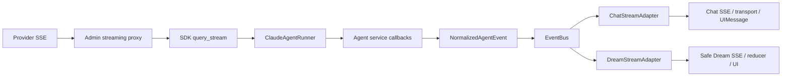
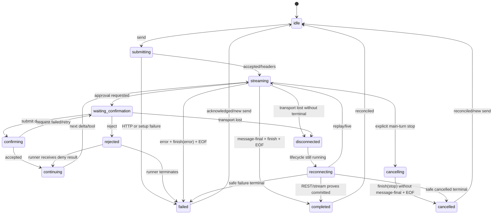
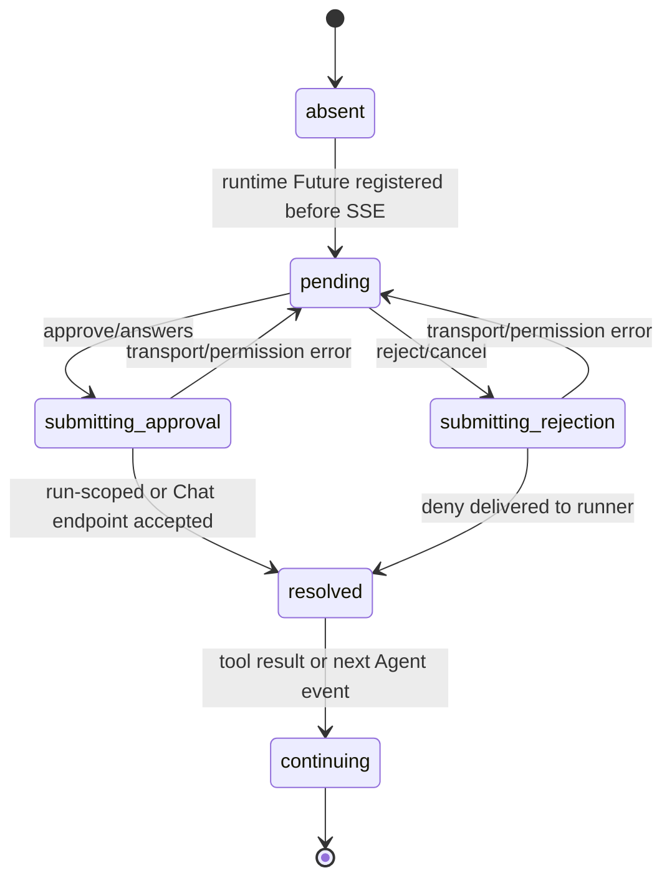
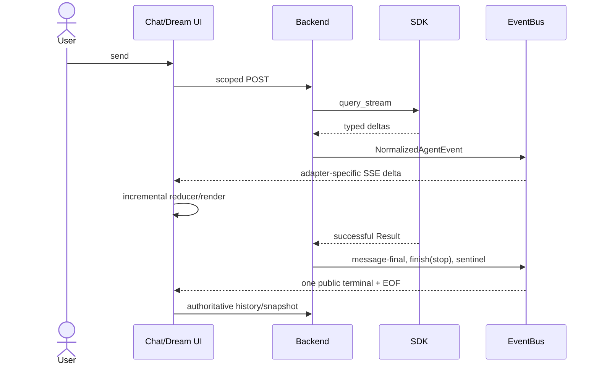
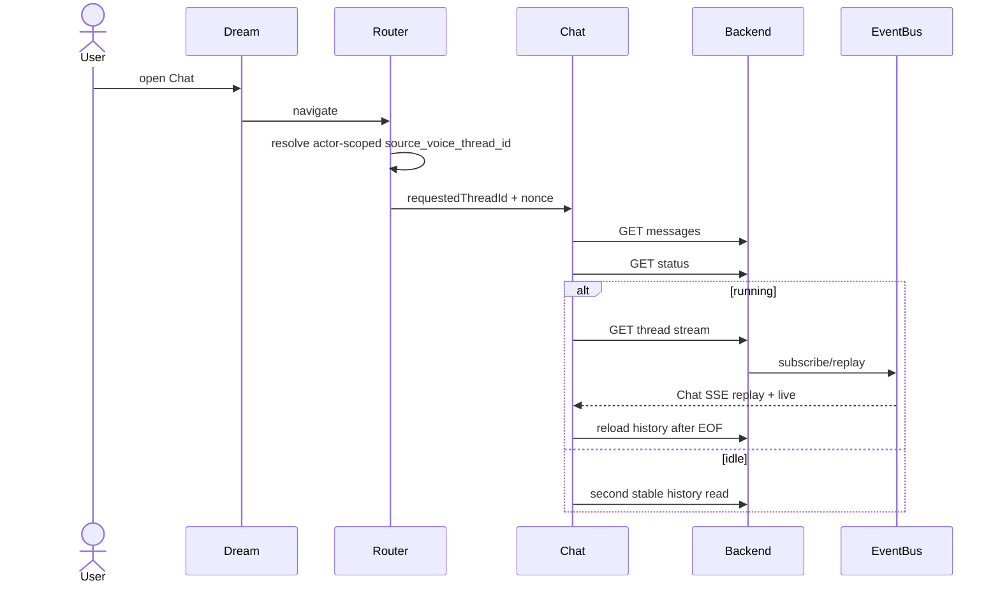
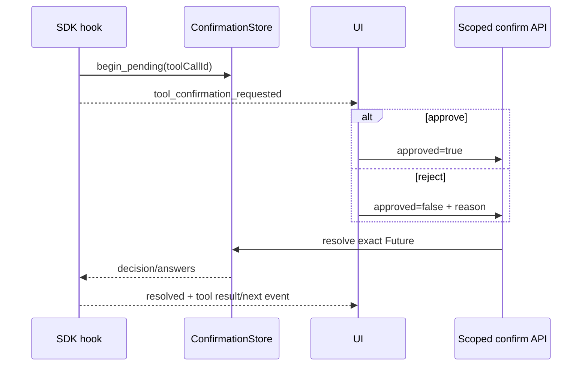
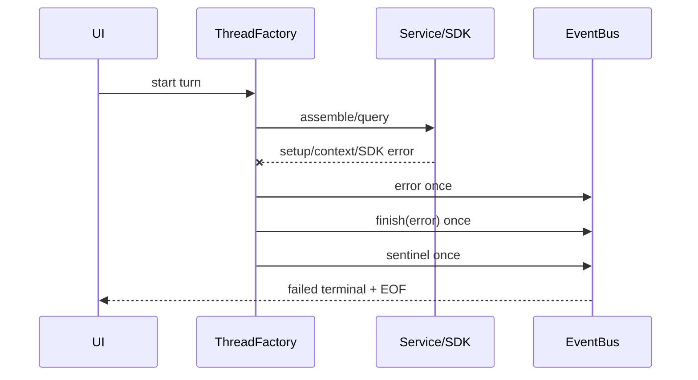
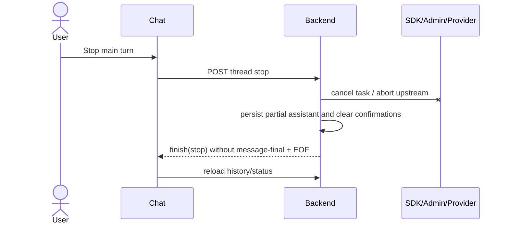
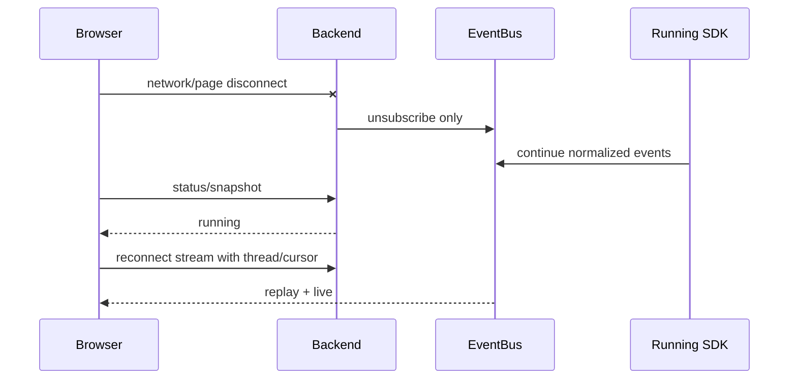
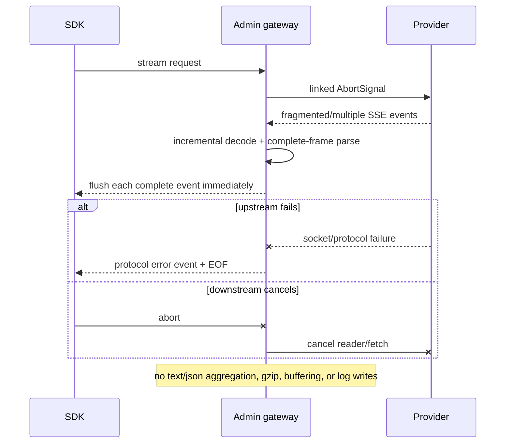

# ChatAgent 与 DreamAgent 交互一致性设计

> 状态：设计审查通过，Phase A 已实施并完成本地验证  
> 日期：2026-08-11（Asia/Shanghai）  
> 范围：`ink-dream-memory` 的 Claude Agent 后端与前端，以及
> `ink-admin-memory` 的模型网关流式代理

## 1. 背景、问题与用户影响

ChatAgent 与 DreamAgent 使用同一个 Claude Agent SDK runner、同一个线程运行时和
同一批标准事件，但面向不同产品表面：Chat 是完整交互协议，Dream 是 run-scoped、
脱敏且严格 allowlist 的业务投影。两者不应共享公共 SSE schema，却应共享一次请求的
生命周期、工具确认所有权、取消清理和唯一终态语义。

设计审查时的代码已经完成大部分协议分层，但存在三个可从实现直接证明、并已在
本轮 Phase A 修复的缺口：

1. `ClaudeAgentThreadFactory.run_events()` 的 context assembly 异常分支只发布 `error`
   和 sentinel，没有发布 `finish(error)`。这与正常 runner 失败路径不同。
2. `_run_turn_task()` 捕获 `execute_session()` 的非取消异常后只写日志；若 service 尚未
   发布 sentinel，订阅者会继续等待 keepalive，线程虽回到 idle，当前流却没有终态。
3. `DreamStreamAdapter` 忽略标准 `error`；`finish(stop)` 同时表示成功与取消，而 Dream
   页面只看到最后的 `status(idle)`，不能区分 completed、failed、cancelled。

用户可见影响是：Chat 在少数启动/持久化异常上可能只有错误或无结束；Dream 在失败或
取消后看起来像普通完成；重连、输入框和错误提示只能依赖 REST 的 `running/idle` 推断。

## 2. 目标与非目标

### 2.1 目标

- 一个 Agent turn 只产生一个 `finish` 和一个 EOF sentinel。
- context assembly、SDK 首输出前失败、部分输出后失败和 service 意外异常使用同一终态。
- 浏览器断线只取消订阅；用户显式取消才取消后台 turn。
- Chat 公共 SSE 保持兼容并继续暴露完整标准事件。
- Dream 继续只暴露安全、run-scoped、actor-scoped 的 allowlist 投影。
- Dream 能区分 completed、failed、cancelled，而不泄露原始错误、工具输入或路径。
- 确认恢复、AskUserQuestion 答案映射和子代理状态均以服务端权威状态为准。
- Admin/Provider 网关逐事件转发，禁止聚合、转换、压缩缓冲和日志混入正文。

### 2.2 非目标

- 不把 Chat SSE 和 Dream SSE 合并为一个公共协议。
- 不重写 `ClaudeAgentRunner._process_message()` 或删除 `agent_runner.py` 的现有处理。
- 不引入跨进程持久事件日志、Kafka 或新的 workflow engine。
- 不重命名既有 Chat 事件，不要求旧客户端迁移。
- 不把 Dream 原始 reasoning、工具参数、错误堆栈或私有控制消息公开。
- 不提供无法停止仅由子代理文件投影表示的工作的 Stop 操作。
- 不进行 Chat/Dream 页面布局或视觉系统重构。

## 3. 当前架构与完整链路

```text
Provider SSE
→ ink-admin-memory/app/lib/gateway/proxy-handler.ts
→ Claude Agent SDK query_stream
→ backend/libs/claude_agent_kit/server/agent_runner.py
→ backend/claude_agent/service.py callbacks
→ backend/agent_stream_events.py NormalizedAgentEvent
→ backend/claude_agent/event_bus.py
  ├→ ChatStreamAdapter → /api/claude-agent → ClaudeAgentChatTransport → UIMessage
  └→ DreamStreamAdapter → /dream-agent/events → Dream parser/reducer → Dream UI
```



关键代码证据：

- SDK 消费和既有分类：`backend/libs/claude_agent_kit/server/agent_runner.py` 的
  `run_streaming()`、`_process_message()`；这里继续拥有 SDK 类型、工具 policy、
  confirmation hook、异常组和取消处理。
- 标准事件：`backend/agent_stream_events.py:24`；兼容导入位于
  `backend/claude_agent/stream_events.py`。
- 生命周期生产：`backend/claude_agent/service.py:1636`；context assembly 编排位于
  `backend/claude_agent/thread_factory.py:130`。
- Chat adapter：`backend/claude_agent/chat_stream_adapter.py:10`，不执行 Dream 过滤。
- Dream adapter：`backend/services/story_workspace/dream_stream_adapter.py:37`，执行文本
  安全投影、cursor 与 allowlist。
- Dream 授权流：`backend/services/deck/story_workflow_gateway.py:1016` 和
  `backend/routers/story_workspace.py:1655`。
- Chat parser：`frontend/src/lib/claude-agent-sse-utils.ts`、
  `frontend/src/lib/claude-agent-transport.ts`。
- Dream parser/reducer：
  `frontend/src/hooks/story-workspace/useStoryWorkspaceDreamAgent.ts:371`。
- Dream→Chat 线程桥：`frontend/src/router/storyWorkspaceChatBridge.ts`。
- Admin 代理：`/Users/dmeck/project/ink-admin-memory/app/lib/gateway/proxy-handler.ts` 和
  `app/lib/gateway/sse.ts`。

## 4. ChatAgent 与 DreamAgent 差异矩阵

| 维度 | ChatAgent | DreamAgent | 应否一致 | 判断与当前原因 |
|---|---|---|---|---|
| 用户消息发送 | `POST /api/claude-agent`，Chat thread scoped | 先持久化/claim，再由 run-scoped coordinator dispatch | 生命周期一致，入口不同 | 合理业务差异；Dream 需要幂等 claim 和权限证明 |
| SDK 消息消费 | `ClaudeAgentRunner.query_stream()` | 同一 runner | 是 | 当前已一致 |
| 标准化事件 | `NormalizedAgentEvent` | 同一 EventBus 事件 | 是 | `b5b986c` 已修复旧的 SSE 字符串耦合 |
| 增量文本 | 完整 `text-*` | `assistant_text_delta` 安全投影 | 语义一致，协议不同 | 合理安全边界 |
| 工具调用 | 完整输入/输出 UI part | allowlist activity，不含原始输入/输出 | 否 | 合理安全边界 |
| 工具确认 | `/api/claude-agent/tool-confirm` | run-scoped `/dream-agent/tool-confirm` | 基础 Future 一致，授权不同 | 合理权限边界；不得互换 endpoint |
| AskUserQuestion | 原始 Chat form key | Dream 公开 `q0..qN`，服务端映回问题文本 | 交互一致，ID 不同 | 合理安全投影 |
| reject-only | 通常无 | 投影不安全时只能拒绝 | 否 | 合理 fail-closed 行为 |
| 子代理状态 | thread workspace REST 投影和轮询 | Dream 只显示安全 activity | 不完全一致 | 页面用途不同；Chat composer 必须准确反映 running |
| 正常完成 | `message-final → finish(stop) → EOF` | `assistant_message_committed → status(idle)` | 终态语义应一致 | 当前基本正确 |
| 异常 | `error → finish(error) → EOF`，但 assembly/意外异常有缺口 | 原始 `error` 被丢弃，只见 idle | 是 | 意外协议缺口，必须修复 |
| 用户取消 | Chat stop endpoint 取消主 task | Dream 无伪 Stop；后台取消时只见 idle | 清理一致，UI 能力可不同 | 不应显示无效 Stop；Dream 应投影 cancelled |
| 网络断开 | unsubscribe，GET stream replay | cursor + Last-Event-ID/after 重连 | 语义一致，策略不同 | 合理协议差异 |
| 页面切换重连 | history→status→stream→history | snapshot→SSE→snapshot | 权威性一致 | `b5b986c` 已修复 Dream→Chat 线程桥及 idle 竞态 |
| 历史恢复 | Chat 完整消息与 tool parts | Dream run/actor 安全消息快照 | 不同 | 合理安全边界 |
| 私有控制消息 | guidance/confirmation/episode action 必须过滤 | 可供 workflow 内部使用 | 否 | `cb04d07` 后按 server-attested metadata 过滤 |
| 输入框状态 | 主 stream 可 Stop；仅子代理 running 时显示被动状态 | 按 generating/confirmation/continuing/busy | 基础 busy 语义一致 | 当前近期修复合理；不能把子代理当可停止主 turn |
| Admin 代理 | SDK 上游均经相同模型网关 | 同左 | 是 | `1b8f890` 已修复已复现缓冲风险 |

## 5. 共享核心与独立适配边界

### 5.1 Shared Agent Runtime Core

负责：SDK 消息分类、标准事件、主 turn lifecycle、confirmation Future、子代理源状态、
EventBus 重放、唯一终态、异常/取消清理。它不包含 HTTP SSE 字符串和页面权限。

### 5.2 Chat Interaction Adapter

负责：把每个标准事件无损编码为既有 Chat JSON SSE；浏览器按任意网络 chunk 增量组帧，
映射为 AI SDK `UIMessageChunk`；历史、status、stream 和普通 Chat confirmation 全部再次
校验 thread ownership。

### 5.3 Dream Interaction Adapter

负责：从已认证 workflow run 解析可信 thread/turn；只投影安全文本、活动、确认和终态；
Dream confirmation 只接受公开投影中仍由 runtime Future 拥有的 toolCallId。

## 6. 消息与事件契约

### 6.1 内部标准事件

内部至少承载 `message-metadata`、`text-start/delta/end`、reasoning、tool input/output、
`tool-approval-request`、`message-final`、`error`、`finish` 和 keepalive。JSON 可序列化性
在 `NormalizedAgentEvent` 创建时验证。EventBus 不保存 Chat/Dream SSE 字符串。

终态规则：

- completed：`message-final → finish(stop) → sentinel`；
- failed：`error → finish(error) → sentinel`；
- cancelled：`finish(stop) → sentinel`，且之前没有 `message-final`；
- `error`、`finish`、sentinel 各至多一次；
- `error` 后只能继续 `finish` 和 sentinel；
- `finish` 后只能继续 sentinel。

### 6.2 Chat SSE

保持 `data: {"type":"..."}\n\n`。未知事件继续忽略或透传，不把 Dream 过滤规则放进
Chat adapter。成功与取消在兼容协议中都使用 `finishReason=stop`，前端以是否观察到
`message-final` 和用户 stop intent 区分。

### 6.3 Dream SSE

| event | data | 说明 |
|---|---|---|
| `status` | `lifecycle=streaming/idle` | 连接与 REST 对账信号，不单独表示结果 |
| `assistant_text_delta` | `turnId, delta` | 已过滤增量 |
| `assistant_message_committed` | `turnId` | completed |
| `agent_activity_started/finished` | `turnId, activity` | 安全工具活动 |
| `tool_confirmation_requested/resolved` | 安全确认字段 | run-scoped confirmation |
| `agent_turn_failed` | `turnId, code` | 失败；固定安全 code，不含原始 errorText |
| `agent_turn_cancelled` | `turnId` | 主 turn 被取消 |

新增 Dream 事件是向后兼容扩展：旧客户端忽略未知事件，仍会收到 `status(idle)`；新客户端
记录结果并等待 idle/REST reconciliation。Dream 绝不公开原始错误堆栈。

## 7. 生命周期状态机



页面状态可细分，但不得成为第二个服务端 truth source。`running`、pending tool IDs、Dream
run binding 和持久消息仍由后端权威接口提供。

## 8. 工具确认状态机



确认请求先注册 Future，再发送 SSE；REST snapshot 的 `known` 才可把历史确认判定为 settled。
Dream 使用 opaque question ID，服务端只按仍在公开投影中的 ID 接受答案并映回 runner key。

## 9. 子代理状态投影

Shared core 保留 Task/Agent 工具事件和 thread workspace transcript。Chat 用
`/threads/{id}/subagents` 投影并在 `SubagentButton` 挂载期间轮询：

- 主 Agent streaming：composer 可显示真正可执行的 Stop；
- 主 Agent idle、子代理 running：composer 显示被动 running 状态，不显示 Stop；
- 子代理全部 terminal：恢复普通输入；
- completed/failed/cancelled 分别保留，不能只按“有任务”判断 busy。

Dream 只显示 allowlist activity，不复制 Chat 的完整子代理 transcript。

## 10. 页面切换与重连策略

Chat 使用 `history → status → optional stream → final history`。Dream 使用
`snapshot → cursor SSE → terminal snapshot`。Dream→Chat 只传可信 run 的
`source_voice_thread_id`；Chat endpoint 仍重新鉴权。

浏览器断线不触发 stop。EventBus subscriber 释放后后台 turn 继续。重连必须携带正确
thread/turn/cursor；旧 turn 被替换时清理 transient reducer 状态。

## 11. 业务时序图

### 11.1 正常发送与增量输出



### 11.2 Dream 切换到 Chat 后重连



### 11.3 工具批准、拒绝与继续



### 11.4 AskUserQuestion 安全答案转换

```mermaid
sequenceDiagram
  participant SDK as Runner
  participant D as Dream adapter
  participant UI as Dream/bridged Chat dock
  participant API as Dream run-scoped API
  SDK->>D: raw questions
  D->>D: validate text/options; assign q0..qN
  D-->>UI: safe questions with opaque IDs
  UI->>API: answers keyed by q0..qN
  API->>API: validate exact pending projection
  API->>SDK: map IDs back to runner question text
```

### 11.5 子代理与按钮状态

```mermaid
sequenceDiagram
  participant MAIN as Main Agent
  participant SUB as Subagent
  participant API as Subagent projection
  participant UI as Chat composer/sidebar
  MAIN->>SUB: Task/Agent start
  SUB->>API: running transcript
  UI->>API: poll thread subagents
  API-->>UI: running > 0
  UI->>UI: passive running label; no Stop
  SUB->>API: completed/failed/cancelled
  UI->>API: refresh/poll
  API-->>UI: running = 0
  UI->>UI: restore send action
```

### 11.6 SDK 在输出前失败



### 11.7 SDK 在部分输出后失败

```mermaid
sequenceDiagram
  participant SDK as SDK
  participant S as Service
  participant UI as UI
  SDK-->>S: delta A, delta B
  S-->>UI: incremental A, B
  SDK--xS: provider/CLI error
  S->>S: persist partial assistant
  S-->>UI: error, finish(error), EOF
  Note over UI: preserve A/B; do not accept later delta
```

### 11.8 用户主动取消



### 11.9 浏览器断线与重连



### 11.10 Admin 代理异常或缓冲



### 11.11 正常完成且终态只产生一次

```mermaid
sequenceDiagram
  participant SDK as SDK
  participant S as Shared service/factory lifecycle
  participant C as Chat adapter
  participant D as Dream adapter
  SDK-->>S: successful result
  S->>S: publish message-final
  S->>S: claim terminal; publish finish(stop)
  S->>S: publish sentinel
  S-->>C: message-final + finish + EOF
  S-->>D: committed once + idle
  SDK-->>S: late duplicate completion/error
  S->>S: ignore after terminal
```

## 12. 完成、失败、取消与断线

| 场景 | Shared core | Chat | Dream |
|---|---|---|---|
| completed | final, finish(stop), EOF | finish UI then history | committed then idle |
| failed before output | error, finish(error), EOF | error UI | safe failed event then idle |
| failed after output | persist partial, same failed terminal | retain partial | retain safe delta, failed event |
| explicit cancel | cancel task/Futures, partial, finish(stop), EOF | stop state then history | safe cancelled event if subscribed |
| browser disconnect | unsubscribe only | reconnect by thread | reconnect by cursor/run |
| process restart | no live in-memory replay | REST history + interrupted state | REST snapshot + retry affordance |

## 13. Admin 代理约束

Admin 的 `proxyStreaming()` 和 `parseSseStream()` 必须保留：增量 TextDecoder、跨 chunk
组帧、同 chunk 多事件、取消传播、有界审计队列。响应至少包含：

```http
Content-Type: text/event-stream; charset=utf-8
Cache-Control: no-cache, no-transform
Connection: keep-alive
X-Accel-Buffering: no
```

不得设置 `Content-Length`/`Content-Encoding`，不得调用 `response.text()`/`json()` 聚合
流式响应，不得把 SSE 包进 JSON，不得让审计写入阻塞首事件。

## 14. 前端展示与 reducer 约束

- Chat transport 和 reconnect parser 都必须保留未完成 frame，支持一个 frame 跨多个
  network chunk 和一个 chunk 包含多个 frame。
- reducer 只追加业务 delta；metadata、finish、heartbeat 和私有控制事件不创建空气泡。
- Dream reducer 以 cursor 去重；tool confirmation resolution 使用精确 turn/tool key tombstone。
- 普通 Dream 用户消息和 assistant 消息在 Chat 可见；guidance、Dream confirmation command
  和 server-attested episode action envelope 在所有 render/export seam 隐藏。
- 主 Agent 与子代理 busy 分开；只有真正可取消的主 turn 显示 Stop。

## 15. 向后兼容

- Chat HTTP path、请求体和 SSE JSON schema 不变。
- Dream 新终态事件为 additive；未知事件的旧客户端继续忽略。
- Dream confirmation endpoint、run/actor/thread 验证不变。
- legacy Chat SSE→Normalized event decoder 只保留在滚动升级兼容入口，不回到生产主链。
- 不更改数据库消息 schema；失败/取消显示先由活跃 SSE 和既有 dispatch metadata 支持。

## 16. 可观测性

结构化记录 request/thread/turn/run ID、首事件耗时、事件计数、终态、取消来源、重连次数、
Admin upstream/downstream abort 和异常类别。日志不得记录 key、secret、完整 prompt、原始
Dream 私有输入或输出，也不得通过 `yield`/`enqueue` 混入 SSE 正文。

## 17. 测试与验收标准

必须覆盖：

1. Chat/Dream 普通 Unicode/中文/换行流式输出；
2. Dream→Chat 正确 thread 重连及普通 Chat 下一轮；
3. 普通 Dream 消息可见、三类私有控制消息隐藏；
4. Chat 与 Dream confirmation endpoint 不串线；
5. AskUserQuestion opaque ID、安全 network 和 reject-only；
6. 子代理 running/completed/failed/cancelled 与输入按钮；
7. context assembly、输出前、部分输出后和意外 service 异常；
8. explicit cancel 与 browser disconnect 的不同语义；
9. SSE frame 分片、合并、CRLF、Unicode 字节分割；
10. `error`、`finish`、sentinel 各一次，终态后无业务事件；
11. FastAPI 和 Admin 防缓冲响应头与首事件早于 EOF；
12. 真实 Chromium 中 delta 在终态前可见。

## 18. 分阶段实施与明确推迟

### Phase A：本轮最小修复

- 给 context assembly 和意外 background exception 补齐共享失败终态。
- 复用 `IEventBus.is_done` 只为异常兜底判断；不在 EventBus/queue 新增第二套
  lifecycle 状态。正常 service 路径继续由既有局部 `error_event_emitted` 和固定
  `message-final/error → finish → sentinel` 顺序保证终态，factory 只补尚未 done 的流。
- Dream adapter 增加安全 failed/cancelled 投影，前端 parser/reducer 识别。
- 增加根因匹配单元与 Chromium 回归。

### Phase B：部署复测

- 生产反向代理 `curl -N`/DevTools TTFB；
- Redis EventBus 多进程重放；
- Provider 真实异常与取消传播。

### 推迟/拒绝的过度设计

- 版本化三套 JSON Schema：有价值，但不是当前终态缺口的前置条件；
- 新持久 event store 或 workflow orchestrator；
- 统一 Chat/Dream 公共 SSE；
- 重写 runner 或页面 reducer 框架；
- 为子代理文件投影伪造 Stop。

## 19. 根因与 Git 历史证据

### 主因

1. 2026-06-01 lazy-thread 改造后，首个 ChatPanel 在历史 hydration 中 remount，queued
   prompt 重发；`a89b5b4` 已用 fresh-thread skip 和 parent claim gate 修复。
2. Admin 初始 `c6a7c88` 流响应可被 Next 转换/缓冲；Admin `1b8f890` 已加入
   `no-transform`、`X-Accel-Buffering`、增量和取消测试。
3. 旧 Chat transport 自 `bb30325` 起按 network chunk 解析完整 JSON；
   `b5b986c` 现已使用 buffer/drain 修复。

### 次因

- Dream 页面最初自 `61f70fc` 反向解析 Chat SSE，造成内部/公共协议耦合；`b5b986c`
  建立 `NormalizedAgentEvent` 与两个 adapter 后已消除生产主链耦合。
- `8c34d48` 的 Dream→Chat 路由未传 source thread；`b5b986c` 已补 bridge 和重连竞态。
- `cb04d07` 才补齐 Dream confirmation 在 Chat 的 run-scoped endpoint、reject-only、私有
  episode action 过滤和被动子代理状态，说明这些差异是近期修复而非稳定旧设计。

### 审查时剩余缺口（本轮已修复）

- context assembly 与意外 task exception 原先不满足单终态；现由 factory 的
  `bus.is_done == false` 异常兜底补齐，并有精确事件序列测试。
- Dream 失败/取消原先被压成 idle；现由安全 adapter 事件、cursor 去重 parser/reducer
  和真实 Chromium 慢速流回归覆盖。
- Redis 多进程重放、生产反向代理和真实 Provider 故障尚未在本机事实链中验证。

## 20. 实施前设计审查

### 20.1 审查问题

| 问题 | 结论 | 依据 |
|---|---|---|
| 是否解决当前真实问题 | 是 | 直接覆盖 assembly 缺 `finish`、background exception 缺 EOF、Dream 吞失败/取消三个已证实缺口 |
| 是否维持 Chat 原有交互 | 是 | 不改 Chat path、请求体、adapter、`finishReason` 或 reducer；只让异常路径符合其已有契约 |
| 是否保留 Dream 安全与权限边界 | 是 | 新失败事件只含固定 code；确认仍走 workflow run/actor/thread 校验后的 endpoint |
| 是否错误统一两个公共 SSE | 否 | Chat 仍用 JSON `type`；Dream 仍用 `event:` allowlist 与 cursor |
| 是否引入新的重复状态源 | 草案原方案会 | 在 BusProxyQueue 增加终态门闩会与 service 的 `error_event_emitted`、EventBus `is_done`、AgentRunState lifecycle 重叠，已从 Phase A 删除 |
| 是否需要修改 SDK 标准化层 | 不需要 | runner 已能把 SDK exception、`AssistantMessage.error` 和取消送到 service；缺口发生在 service/factory 终态和 Dream projection |
| 是否可用更小修改实现 | 可以 | factory 两个异常分支补终态，Dream adapter/parser/reducer做 additive 投影即可；无需重写 EventBus/runner |
| 是否为了抽象而抽象 | 修订后否 | 不新增 terminal coordinator、event store、统一协议或 reducer 框架 |
| 哪些内容应推迟 | 见 Phase B | Redis 多进程、生产反代/Provider 现场、版本化 schema 与持久事件日志独立推进 |

### 20.2 审查结论

**修改后接受。** 原草案提出在 EventBus queue 增加轻量终态门闩，虽然能防止晚到事件，
但会形成新的 lifecycle 状态源，超出已复现问题所需范围。本文已先修改 Phase A：正常路径
继续由现有 service 顺序负责，factory 仅在 `bus.is_done == false` 的异常兜底中补
`error → finish(error) → sentinel`。Dream 只新增安全的 additive 终态投影。

修订完成后设计可实施；不修改 `agent_runner.py` 的 SDK 分类、工具 policy 或现有回调逻辑。

## 21. 实施与验证记录

### 21.1 已实施

- `backend/claude_agent/thread_factory.py`：仅在仍开放的 EventBus 上补
  `error → finish(error) → sentinel`，并保证异常后 lifecycle、confirmation 与 session
  lock 的既有清理继续执行。
- `backend/services/story_workspace/dream_stream_adapter.py`：把标准 `error` 安全投影为
  固定 code 的 `agent_turn_failed`；把没有先出现 `message-final` 的 `finish(stop)` 投影为
  `agent_turn_cancelled`。成功仍由 `assistant_message_committed` 终结。
- Dream 前端 contract/parser/reducer/hook/UI：识别 completed/failed/cancelled，按 cursor
  去重、清空 transient state 并触发 REST 对账；失败不接收后端原始错误文本。
- Admin 无需修改：现有 `1b8f890` 已满足逐事件转发与防缓冲约束，本轮只读验证。

### 21.2 本地验证结果

- 后端聚焦套件：`294 passed, 1 skipped, 189 subtests passed`；跳过项为既有条件跳过。
- 前端协议、确认、composer 状态测试：`35 passed`。
- 真实 Chromium：Chat lazy 首轮、Dream→Chat 重连、私有消息/子代理状态三项通过；新增
  Dream 慢速 SSE 用例验证中文与 Unicode delta 在失败终态前已经渲染，终态后执行一次
  受控 Abort 清理并完成 REST 对账。首次运行暴露的是夹具把预期 Abort 当作任意网络错误，
  将断言改为“恰好一次终态后的受控 Abort、其他诊断为零”后通过。
- Dream 主前端：`tsc -b && vite build` 通过；完整 ESLint 通过，只有 21 条与本轮无关的
  既有 React Hook dependency warning，变更文件无 warning。
- Admin：Next.js 生产构建与 TypeScript 通过，完整 ESLint 通过；SSE parser、stream adapter、
  proxy handler 共 `20 passed`，覆盖 header、分块、同块多事件、取消与首事件早于 EOF。
- `git diff --check` 通过；Admin 工作区验证后保持 clean。

### 21.3 尚未声称完成的生产现场验证

- 未调用真实付费 Provider 制造线上故障或取消；以 runner/service 异常与取消测试替代。
- 未在生产 Nginx/CDN 上执行 `curl -N`，也未启动 Redis 多进程重放；Admin 代码契约、
  Next 生产构建和真实 Chromium 本地分块流已通过，但上线后仍应执行 Phase B。

## 22. 指定线上 thread 的控制生命周期对账

### 22.1 事实样本

2026-08-11 对账号 `dmeck123@suoxya.com`、workflow run
`run_fdd7012110c74d1db96c1ff396dd6491` 和 thread
`465c9122-bdb0-583f-b59a-b3e645688f4a` 做脱敏接口检查：

- `/api/claude-agent/threads/{thread}/status` 返回 `idle`，pending confirmation 为空；
- `/api/story-workspace/workflow-runs/{run}/dream-agent/messages` 返回 `idle`、`canSend=true`；
- `/api/claude-agent/threads/{thread}/subagents` 却返回 `running=3`；三个 transcript 都没有
  terminal record，其中两条始于 8 月 7 日，一条始于 8 月 11 日较早的已结束 turn；
- `ChatPanel` 使用 `agentBusy || subagentCounts.running > 0` 控制输入，因此历史文件投影
  覆盖了两个权威 runtime 接口共同给出的 `idle`。

Chat 页面读取 Dream snapshot 的直接用途是恢复 run-scoped pending confirmation；但该 GET
端点在返回持久快照后还会 reclaim 并 schedule 同一 run 中 `pending/dispatching` 的 Dream
消息。因此它可能合法启动共享 thread runtime，并非严格无副作用的读取。Chat 历史仍只来自
thread messages，主 lifecycle 仍只来自 thread status/SSE；两个 GET 同时出现不等于存在两个
Chat 历史或两个 SDK runtime，但客户端必须等待 recovery 后的权威 thread status。已证实的
缺陷仍是 subagent 观察投影被错误提升成第二个控制状态源。

### 22.2 修正设计

- 主 turn 的提交、Stop、输入门闩、重连和终态只接受 Chat transport/thread runtime 状态；
- subagent transcript 继续提供侧栏时间线，但不直接禁用 composer；
- subagent API 在 thread runtime 非 running 时，把没有 terminal record 的历史任务安全收敛
  为 `cancelled`，重新计算 counts；不修改或伪造原始 transcript；
- thread runtime 真正 running 时保留 subagent `running`，主 Agent 仍显示可执行 Stop；
- Dream snapshot 触发 durable dispatch recovery 后也以同一 thread runtime 为控制真值，不把
  恢复前的 idle snapshot 当作最终状态；
- Dream confirmation 恢复继续使用 run-scoped API，不把权限边界并入普通 Chat endpoint。

### 22.3 实施前设计审查

| 问题 | 结论 |
|---|---|
| 是否解决真实问题 | 是；直接解释并消除指定 thread 的 `idle`/`running=3` 冲突 |
| 是否维持普通 Chat 交互 | 是；普通主 turn 的 loading、Stop、send 逻辑不变 |
| 是否保留 Dream 安全与权限 | 是；Dream snapshot/confirmation endpoint 不变 |
| 是否统一两个公共 SSE | 否；只统一同一 thread 的控制 truth source |
| 是否引入重复状态源 | 否；移除 subagent counts 对 composer 的控制权 |
| 是否需要修改 SDK 标准化层 | 否；缺陷发生在历史文件投影与 UI 控制合并处 |
| 是否能以更小修改实现 | 是；subagent API 对账加 ChatPanel 一处门闩调整 |
| 是否过度抽象 | 否；不新增协议、状态机框架或持久事件表 |

审查结论：**接受**。推迟新的 `interrupted` 公共状态和 transcript 回写；本轮沿用既有
`cancelled` 终态表示“runtime 已结束、该历史 subagent 不再运行”。

### 22.4 实施与线上验证

- `/subagents` 读取 thread factory 的 runtime snapshot：runtime 非 running 时只在响应投影中
  将未闭合任务收敛为 `cancelled`，runtime running 时仍保留真实 `running`；原 JSONL 不改写。
- Chat composer 不再订阅 subagent counts 作为 loading 门闩，只由主 Chat runtime 决定
  Send/Stop；subagent 状态仍在观察按钮和时间线展示。
- runtime idle 时，更新后的指定 thread 返回 `running=0`、`completed=6`、`ended=4`、
  `total=10`，与 Chat lifecycle 的 `idle` 一致。
- 使用账号级临时认证的真实有头 Chromium 从指定 Dream run 切换到 Chat，确认打开目标 thread；
  页面不存在 `3 subagents running` 和虚假 Stop，空输入时 Send disabled、输入草稿后 enabled，
  subagent 按钮显示 `6 completed`，Chat 就绪后没有再次读取 Dream snapshot，控制台和非预期
  API 失败均为零；最终 `--headed` 复测 `1 passed`。
- 首次有头运行还发现 GET snapshot reclaim 了一条既有 durable pending 消息，SDK runtime
  随即变为真实 `running`，此时保留三个 running subagent 是正确投影。验收通过正式 thread
  Stop 接口终止该恢复任务并确认 `idle`，没有提交新的用户消息；这也证明测试必须区分真实
  runtime running 与历史 transcript 虚假 running。未来可评估把恢复动作拆为显式 resume
  command，降低 GET 副作用带来的测试与运维意外，但本轮不改变兼容语义。
