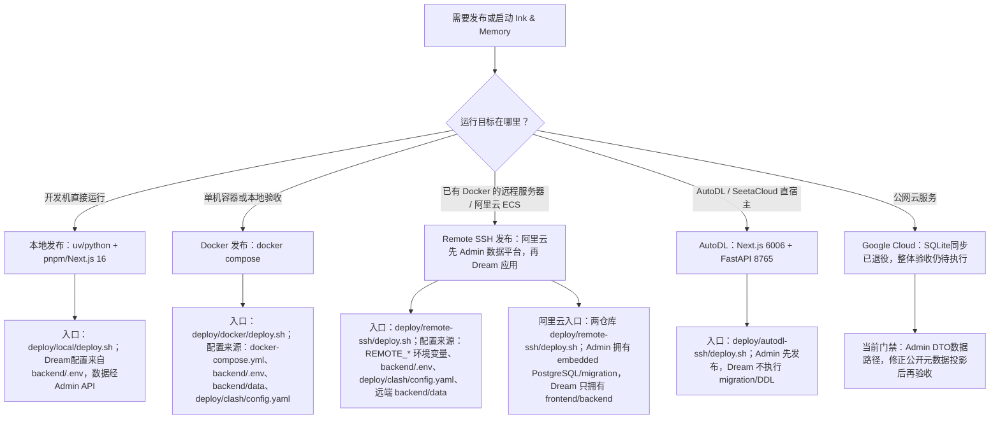

# docs/deploy
<!--
[Input] Executable deployment entries and platform-specific release contracts.
[Output] Index the supported deployment paths, ownership boundaries, and public service origins.
[Pos] Canonical deployment-document index; executable entry status is cross-checked against ../../deploy/README.md.
[Sync] 2026-08-22: clarify that Alibaba embedded PG stays on the shared alias
                    while Gateway/Product API use the Admin HTTPS origin.
[Sync] 2026-08-22: record the Alibaba backend block-I/O resource budget used
                    to keep Dream/Admin/SSH responsive during Claude turns.
[Sync] 2026-08-24: add the Chinese SDK/Runtime packaging, PyPI/npm publishing,
                    Dream exact-version/hash integration, validation, and rollback guide.
[Sync] 2026-08-31: remove the unused legacy models.json deployment prerequisite.
[Sync] 2026-09-04: add post-release verification for Dream post-commit sync terminals and Execution asset refresh; no migration or config change is required.
[Sync] 2026-09-06: migrate AutoDL to the sole Next.js 16 + pnpm workspace and Node MCP Apps runtime; Cloud SQLite and ignored VITE build-arg gaps remain elsewhere.
[Sync] 2026-09-12: add the explicit NATAPP edge-relay switch, verification, and rollback contract without changing application or data ownership.
[Sync] 2026-09-16: remove Dream PostgreSQL credentials from local, AutoDL and Alibaba deployment contracts.
[Sync] 2026-09-16: move Google/Session/JWT secret ownership to Admin, retire Google Cloud SQLite sync, and retain only the server-only Next BFF handle secret in Dream.
-->

## 定位

`docs/deploy/` 是 Ink & Memory 发布体系的文档入口，负责说明本地直跑、Docker 容器发布、Remote SSH（包含阿里云 ECS 配置）、AutoDL 直宿主和 Google Cloud 拓扑的边界、配置来源、操作顺序和验证方式。

当前可执行脚本按平台组织在 [`../../deploy/`](../../deploy/)：

| 发布方式 | 脚本入口 | 说明 |
|----------|----------|------|
| 本地发布 | [`../../deploy/local/deploy.sh`](../../deploy/local/deploy.sh) | 包装本地 backend/frontend 启动与验证；尚未投影 Browser Voice WS base，stop/clean 也未强校验 PID/容器所有权 |
| Docker 发布 | [`../../deploy/docker/deploy.sh`](../../deploy/docker/deploy.sh) | 包装根目录 Compose 构建、启动、验证和清理；backend 出站默认通过 Mihomo TUN |
| Remote SSH 发布（含阿里云 ECS） | [`../../deploy/remote-ssh/deploy.sh`](../../deploy/remote-ssh/deploy.sh) | Dream-only Compose；overlay只通过Admin HTTPS origin访问Gateway/Product API，不连接PostgreSQL network，并从mode-0600 topology配置backend block-device read budget |
| NATAPP 边缘转发 | [`../../deploy/remote-ssh/switch-edge-relay.sh`](../../deploy/remote-ssh/switch-edge-relay.sh) | 仅更新现有 Dream/Admin nginx 公开入口，要求显式 relay origins，自动备份、测试、reload 与可验证回滚 |
| Google Cloud 发布 | [`../../deploy/google-cloud/deploy.sh`](../../deploy/google-cloud/deploy.sh) | 前端可构建Next standalone，旧SQLite/GCS同步已fail closed；仍需修正公开元数据投影并完成整体验收，当前不是已支持的Dream生产入口 |
| AutoDL 直宿主 | [`../../deploy/autodl-ssh/deploy.sh`](../../deploy/autodl-ssh/deploy.sh) | frozen pnpm构建standalone Next.js，运行Node MCP Apps与FastAPI；Dream env不含PostgreSQL配置 |

## 现有文档

| 文档 | 作用 | 当前状态 |
|------|------|----------|
| [`overview.md`](overview.md) | Cloud Run 历史操作文档 | 前端镜像已走Next standalone，旧SQLite/GCS同步已退役；剩余配置漂移与发布验收尚未关闭 |
| [`data-sync.md`](data-sync.md) | 历史 SQLite/GCS 回执说明 | 仅用于识别旧脚本行为；共享业务数据由 Admin PostgreSQL/Drizzle 管理，不得执行该 SQLite 同步作为当前发布步骤 |
| [`remote-ssh.md`](remote-ssh.md) | Remote SSH 部署文档 | 说明远程 Docker 服务器的 SSH/rsync/docker-compose 发布路径；旧 SQLite 数据维护命令不属于当前业务数据合同 |
| [`natapp-edge-relay.md`](natapp-edge-relay.md) | NATAPP 边缘转发文档 | 说明现有公开域名到显式 Dream/Admin relay origins 的原子切换、验证、上游降级识别与回滚 |
| [`aliyun.md`](aliyun.md) | 阿里云 ECS 部署文档 | 说明 Admin-owned 数据平台栈、Dream-only 应用栈、首次数据引导、发布顺序、验证与回滚 |
| [`autodl.md`](autodl.md) | AutoDL 直宿主部署文档 | 说明 frozen pnpm/standalone Next、Node MCP Apps、FastAPI、固定 sandbox capability、验证与回滚 |
| [`release-system-design.md`](release-system-design.md) | 历史发布体系设计 | 保留旧 Vite/npm/nginx/SQLite/GCS 判断；不是当前操作手册 |
| [`claude-sdk-runtime-packaging-and-integration.md`](claude-sdk-runtime-packaging-and-integration.md) | Claude SDK/Runtime 打包发布与 Dream 集成 | PyPI SDK、npm 五包、OIDC、精确版本/哈希、验证和回滚的中文执行手册 |
| [`claude-registry-release-acceptance.md`](claude-registry-release-acceptance.md) | Claude registry 发布后验收 | provider-free 校验 PyPI/npm 制品身份、安装和 fail-closed 条件 |

## 推荐目录大纲

后续拆分时建议保持轻量结构，不引入额外层级：

```text
docs/deploy/
├── README.md                 # 发布文档入口与分流
├── overview.md               # 发布总览；拆分完成后只保留入口和索引
├── local.md                  # 本地直跑发布/维护
├── docker.md                 # Docker Compose 容器发布
├── remote-ssh.md             # Remote SSH + docker-compose 发布
├── aliyun.md                 # 阿里云 ECS 双仓库发布
├── autodl.md                 # AutoDL 直宿主发布
├── google-cloud.md           # Google Cloud Run 发布
├── data-sync.md              # 数据同步、备份、恢复
├── claude-sdk-runtime-packaging-and-integration.md # SDK/Runtime 打包发布与 Dream 接入
├── claude-registry-release-acceptance.md           # registry 发布后验收
└── release-system-design.md  # 发布体系改造设计稿
```

## 发布路径分流



## 通用四类发布方式对比

AutoDL 的 direct-host 差异（固定端口、screen、root Dream Runtime、sandbox
capability）单列在 [AutoDL 手册](autodl.md)，不混入下表的通用容器对比。

| 维度 | 本地发布 | Docker 发布 | Remote SSH 发布 | Google Cloud 发布 |
|------|----------|-------------|-----------------|-------------------|
| 主要入口 | [`../../deploy/local/deploy.sh`](../../deploy/local/deploy.sh) | [`../../deploy/docker/deploy.sh`](../../deploy/docker/deploy.sh) | [`../../deploy/remote-ssh/deploy.sh`](../../deploy/remote-ssh/deploy.sh) | [`../../deploy/google-cloud/deploy.sh`](../../deploy/google-cloud/deploy.sh) |
| 使用对象 | 开发者、调试者 | 本地验收、单机自托管维护者 | 有远程 Docker 服务器的维护者 | 线上 Cloud Run 发布维护者 |
| 运行形态 | 两个本地进程 | 前后端两个容器 | 远端前后端两个容器 | Cloud Run 前后端两个服务 |
| 配置来源 | `backend/.env`中的Admin API/auth与Dream Runtime配置 | `backend/.env`、`deploy/clash/config.yaml`、Compose env、`API_BASE_URL` | `REMOTE_*`环境变量、`backend/.env`、`deploy/clash/config.yaml` | shell export、`.storage-env`、`.cloud-env`、Secret Manager、`API_BASE_URL` |
| 业务数据库 | Admin启动PostgreSQL并提供DTO API；Dream无DSN | Admin-owned PostgreSQL；Dream Compose无凭据或migration | Admin-owned PostgreSQL；Dream-only栈只调用Admin API | Admin-owned PostgreSQL；Dream只调用Admin DTO API，SQLite入口fail closed |
| 非数据库运行文件 | 由显式路径配置决定 | `./backend/data:/app/data` 仅承载配置允许的非数据库文件 | 远端 `${REMOTE_APP_DIR}/backend/data` 可承载非数据库文件；不得当作业务数据库同步 | 共享文件拓扑须独立验收；退役SQLite脚本不承担文件同步 |
| API 访问 | Next rewrite 同源 fallback，或 runtime-config 显式 API base | 浏览器直连 `http://127.0.0.1:8765`；`BACKEND_URL` 由容器入口投影为 `INK_BACKEND_INTERNAL_URL` 供 Next rewrite 使用 | 同一 Next rewrite fallback；可用 `REMOTE_API_BASE_URL` 改为跨域直连 | 浏览器跨域直连后端；Cloud Run整体仍需配置修正与发布验收 |
| Claude-agent Bash sandbox | 本机进程使用宿主运行时 | backend 容器启用 `SYS_ADMIN`、`seccomp=unconfined`、`apparmor=unconfined` 供 bubblewrap 创建 mount namespace | backend 容器启用 `SYS_ADMIN`、`seccomp=unconfined`、`apparmor=unconfined` 供 bubblewrap 创建 mount namespace | Cloud Run 不使用 Docker Compose runtime 权限模型 |
| 边界 | 不构建镜像，不访问 GCS | 不创建云资源，不使用 Secret Manager；Docker 外层容器是主隔离边界 | 不创建云资源，不使用 GCS/Secret Manager，资源默认对齐 Cloud Run，不默认同步数据库；Docker 外层容器是主隔离边界 | 不依赖本地端口和本地数据卷 |

## 生产认证配置

发布到 `https://ink-frontend.suoxya.com` / `https://ink-backend.suoxya.com` 时，所有平台必须满足：

| 项 | 生产值 |
|----|--------|
| `INK_DREAM_PUBLIC_ORIGIN` | `https://ink-frontend.suoxya.com` |
| `INK_DREAM_BFF_REDIRECT_URI` | `https://ink-frontend.suoxya.com/auth/callback` |
| `INK_ADMIN_DREAM_BASE_URL` | `https://ink-admin.suoxya.com` |
| `INK_ADMIN_AUTH_ISSUER` | `https://ink-admin.suoxya.com/api/auth` |
| `INK_DREAM_API_RESOURCE` | `https://ink-frontend.suoxya.com/api` |
| `INK_DREAM_BFF_COOKIE_SECRET` | 独立的Dream Next服务器secret，不进入浏览器或FastAPI |
| `INK_CORS_ALLOW_ORIGINS` | `https://ink-frontend.suoxya.com` |
| `INK_CORS_ALLOW_CREDENTIALS` | `true` |
| Google callback | `https://ink-admin.suoxya.com/api/auth/callback/google`，由Admin Better Auth处理 |

Remote SSH通过mode-0600拓扑文件把Admin issuer、Dream resource、注册service credential与BFF cookie secret分别投给FastAPI/Next；backend Compose把旧Dream Google/JWT/Session/OAuth secret和Next-only BFF key置空，frontend仍取得BFF key。AutoDL共用安全env文件时，FastAPI入口会在导入业务模块前移除BFF key。Google Cloud使用独立backend/frontend service account和逐secret IAM：服务凭据按调用方绑定，BFF cookie secret只绑定Next；旧FastAPI认证绑定会被清除。完整Cloud Run发布重验尚未执行。

## Docker TUN 出站

Docker 和 Remote SSH Compose 默认包含 `tun-proxy` 服务，使用
`metacubex/mihomo:latest` 加载 `deploy/clash/config.yaml`，并让
`ink-backend` 通过 `network_mode: service:tun-proxy` 共享网络命名空间。
真实 `config.yaml` 已 gitignored；配置准备见 [`../../deploy/clash/README.md`](../../deploy/clash/README.md)。

## 维护规则

### 当前 frontend/部署缺口

- 当前 frontend 唯一事实源是 `frontend/package.json` + `frontend/pnpm-workspace.yaml` + `frontend/pnpm-lock.yaml`；开发、构建和容器运行分别使用根 Next `dev/build/start` 与 standalone `server.js`。Dream 应用源码唯一位于 `frontend/app/_dream/**`，`frontend/packages/mcp-apps-runtime/src/**` 是合法独立的 server-only package，不是旧 `frontend/src` 的残留。
- `deploy/local/deploy.sh` 当前只向 Next 传入 Python internal base，没有投影 Browser Voice WebSocket base；默认空 runtime config 会回退同源 WS，而 Next 没有 `/ws/**` upgrade。其 stop/clean 也只信任保存的 PID 和配置的容器名。需要语音的本机运行须按根 README 显式设置 WS base；停止前须人工核对进程/容器身份，直到代码加入 start-time/command/cwd/label 强校验。
- `deploy/autodl-ssh/**` 已迁移到根 Next.js/pnpm workspace：构建 standalone server、验证 Node MCP Apps routes，并用独立 supervisor 运行 Next/FastAPI；[AutoDL 文档](autodl.md) 是当前操作合同。
- 根 Compose、Remote SSH Compose 和 Google Cloud 脚本会传入 `VITE_PUBLIC_SITE_URL`，但当前 `frontend/Dockerfile` 不声明也不消费该 build arg；根 Compose 还保留“nginx serving Vite”与 nginx fallback 注释。这些都是待修正的配置/注释漂移，不得当作 Next metadata 已注入的证据。
- `deploy/docker/deploy.sh` 与 `deploy/remote-ssh/deploy.sh` 仍将 `frontend/nginx.conf.template` 列为 preflight 文件，但当前 Next 镜像不消费该模板；只能视为历史兼容检查。
- `deploy/google-cloud/sync-data.sh` 已退役：除 `--help` 外全部 fail closed，不再执行 SQLite/GCS 上传、备份或 Cloud Run 重启。共享文件维护使用独立文件系统拓扑；业务数据只经 Admin DTO API 与 PostgreSQL/Drizzle 路径处理。

### 历史：Dream 回合同步发布后检查

该段记录先前回合同步修复；当时没有PostgreSQL migration、runtime DDL、环境变量或部署拓扑变更。对应版本发布Dream frontend/backend后，使用已有测试Run与授权账号执行一轮可写人物/场景的正常Dream Turn，并按同一业务链确认：

1. assistant 正文进入同一 Thread 历史；canonical `assets/characters` / `assets/scenes` 的变更由 after-turn Hook 发布到对应 Run-private artifact；
2. authenticated `dream-files` 与 Story/Episode API 返回新 revision，Execution“故事资产”无需整页刷新即可出现人物/场景；
3. 在隔离故障注入中让 Hook 尾部失败时，SSE 只出现 `DREAM_ARTIFACT_SYNC_FAILED_AFTER_COMMIT` 与唯一 `finish(error)`，页面提示回复已保存，reload 后正文保留且 Agent POST 不增加；
4. 若 PostgreSQL capability 不可用，Dream 必须 fail closed 并保留已提交回复；从 Admin Drizzle 修复 capability，禁止在 Dream 新增 DDL、Alembic 或 fallback。

回滚只需回滚本次 Dream frontend/backend 版本；没有数据回滚或 schema contract 操作。该 provider-free 故障注入不能替代真实业务发布验收。

- 本地 Dream 不启动或连接 PostgreSQL；先运行 Admin `pnpm dev`，Dream 通过
  `INK_ADMIN_DREAM_BASE_URL` 和注册的服务/OAuth 配置调用 Admin API。
- 修改发布路径、脚本参数、配置来源或验证流程时，同步更新本目录文档。
- 修改 `deploy/` 脚本时，同步更新 [`../../deploy/.folder.md`](../../deploy/.folder.md)、对应平台目录 `.folder.md` 和相关发布文档。
- 不把项目 ID、bucket、主机、服务名、镜像仓库、密钥值写死到文档示例之外；示例必须标明通过环境变量或部署参数覆盖。
