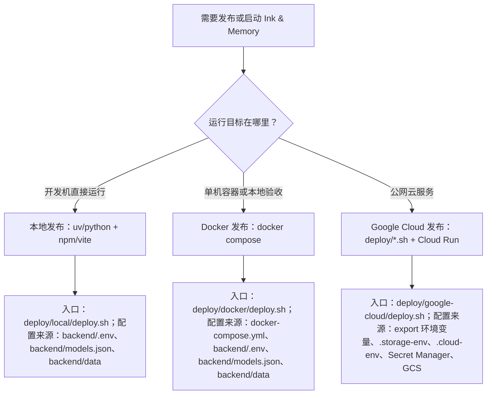

# docs/deploy

## 定位

`docs/deploy/` 是 Ink & Memory 发布体系的文档入口，负责说明本地直跑、Docker 容器发布、Google Cloud 发布三类路径的边界、配置来源、操作顺序和验证方式。

当前可执行脚本按平台组织在 [`../../deploy/`](../../deploy/)：

| 发布方式 | 脚本入口 | 说明 |
|----------|----------|------|
| 本地发布 | [`../../deploy/local/deploy.sh`](../../deploy/local/deploy.sh) | 包装本地 backend/frontend 启动、验证、停止和清理 |
| Docker 发布 | [`../../deploy/docker/deploy.sh`](../../deploy/docker/deploy.sh) | 包装根目录 Compose 构建、启动、验证和清理 |
| Google Cloud 发布 | [`../../deploy/google-cloud/deploy.sh`](../../deploy/google-cloud/deploy.sh) | 包装旧 Cloud Run 脚本，保留旧路径兼容 |

## 现有文档

| 文档 | 作用 | 当前状态 |
|------|------|----------|
| [`overview.md`](overview.md) | Cloud Run 部署主文档 | 仍可作为云发布操作入口，但包含本地 Docker Compose 说明，后续应拆分 |
| [`data-sync.md`](data-sync.md) | 本地与 GCS 数据同步说明 | 覆盖手动 gsutil 操作；需要和 `deploy/sync-data.sh` 的实际行为对齐 |
| [`release-system-design.md`](release-system-design.md) | 本次发布体系梳理与方案设计 | 处理判断、三类发布方案、文档与脚本改造计划、验收清单 |

## 推荐目录大纲

后续拆分时建议保持轻量结构，不引入额外层级：

```text
docs/deploy/
├── README.md                 # 发布文档入口与分流
├── overview.md               # 发布总览；拆分完成后只保留入口和索引
├── local.md                  # 本地直跑发布/维护
├── docker.md                 # Docker Compose 容器发布
├── google-cloud.md           # Google Cloud Run 发布
├── data-sync.md              # 数据同步、备份、恢复
└── release-system-design.md  # 发布体系改造设计稿
```

## 发布路径分流



## 三类发布方式对比

| 维度 | 本地发布 | Docker 发布 | Google Cloud 发布 |
|------|----------|-------------|-------------------|
| 主要入口 | [`../../deploy/local/deploy.sh`](../../deploy/local/deploy.sh) | [`../../deploy/docker/deploy.sh`](../../deploy/docker/deploy.sh) | [`../../deploy/google-cloud/deploy.sh`](../../deploy/google-cloud/deploy.sh) |
| 使用对象 | 开发者、调试者 | 本地验收、单机自托管维护者 | 线上发布维护者 |
| 运行形态 | 两个本地进程 | 前后端两个容器 | Cloud Run 前后端两个服务 |
| 配置来源 | `backend/.env`、`backend/models.json` | `backend/.env`、`backend/models.json`、Compose env | shell export、`.storage-env`、`.cloud-env`、Secret Manager |
| 数据位置 | `backend/data/` | `./backend/data:/app/data` | GCS bucket 挂载到 `/app/data` |
| 边界 | 不构建镜像，不访问 GCS | 不创建云资源，不使用 Secret Manager | 不依赖本地端口和本地数据卷 |

## 维护规则

- 修改发布路径、脚本参数、配置来源或验证流程时，同步更新本目录文档。
- 修改 `deploy/` 脚本时，同步更新 [`../../deploy/.folder.md`](../../deploy/.folder.md)、对应平台目录 `.folder.md` 和相关发布文档。
- 不把项目 ID、bucket、主机、服务名、镜像仓库、密钥值写死到文档示例之外；示例必须标明通过环境变量或部署参数覆盖。
