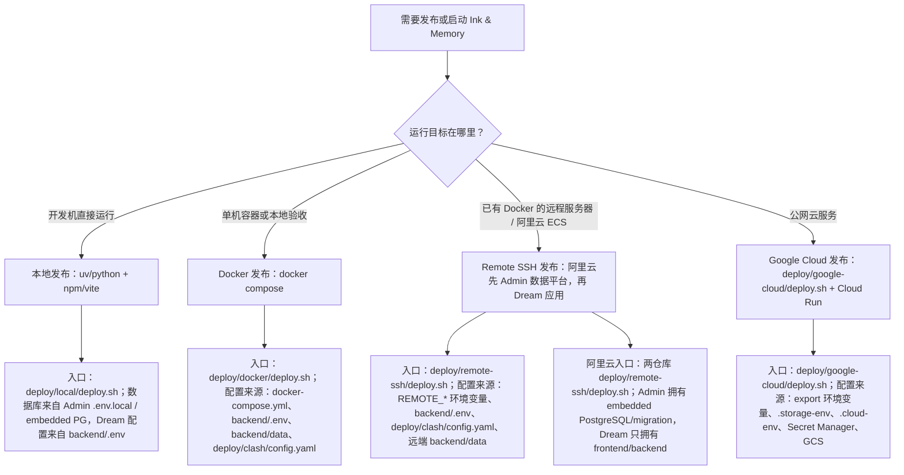

# docs/deploy
<!--
[Input] Executable deployment entries and platform-specific release contracts.
[Output] Index the supported deployment paths, ownership boundaries, and public service origins.
[Sync] 2026-08-22: clarify that Alibaba embedded PG stays on the shared alias
                    while Gateway/Product API use the Admin HTTPS origin.
[Sync] 2026-08-22: record the Alibaba backend block-I/O resource budget used
                    to keep Dream/Admin/SSH responsive during Claude turns.
[Sync] 2026-08-24: add the Chinese SDK/Runtime packaging, PyPI/npm publishing,
                    Dream exact-version/hash integration, validation, and rollback guide.
[Sync] 2026-08-31: remove the unused legacy models.json deployment prerequisite.
[Sync] 2026-09-04: add post-release verification for Dream post-commit sync terminals and Execution asset refresh; no migration or config change is required.
-->

## 定位

`docs/deploy/` 是 Ink & Memory 发布体系的文档入口，负责说明本地直跑、Docker 容器发布、Remote SSH（包含阿里云 ECS 配置）和 Google Cloud 四类路径的边界、配置来源、操作顺序和验证方式。

当前可执行脚本按平台组织在 [`../../deploy/`](../../deploy/)：

| 发布方式 | 脚本入口 | 说明 |
|----------|----------|------|
| 本地发布 | [`../../deploy/local/deploy.sh`](../../deploy/local/deploy.sh) | 包装本地 backend/frontend 启动、验证、停止和清理 |
| Docker 发布 | [`../../deploy/docker/deploy.sh`](../../deploy/docker/deploy.sh) | 包装根目录 Compose 构建、启动、验证和清理；backend 出站默认通过 Mihomo TUN |
| Remote SSH 发布（含阿里云 ECS） | [`../../deploy/remote-ssh/deploy.sh`](../../deploy/remote-ssh/deploy.sh) | Dream-only Compose；overlay 通过共享网络访问 embedded-PG alias，通过 Admin HTTPS origin 访问 Gateway/Product API，并从 mode-0600 topology 配置应用 backend block-device read budget，MinIO 暂停 |
| Google Cloud 发布 | [`../../deploy/google-cloud/deploy.sh`](../../deploy/google-cloud/deploy.sh) | 完整 Cloud Run 发布入口，旧根路径仅保留兼容 |

## 现有文档

| 文档 | 作用 | 当前状态 |
|------|------|----------|
| [`overview.md`](overview.md) | Cloud Run 部署主文档 | 仍可作为云发布操作入口，但包含本地 Docker Compose 说明，后续应拆分 |
| [`data-sync.md`](data-sync.md) | 本地与 GCS 数据同步说明 | 覆盖手动 gsutil 操作；需要和 `deploy/google-cloud/sync-data.sh` 的实际行为对齐 |
| [`remote-ssh.md`](remote-ssh.md) | Remote SSH 部署文档 | 说明远程 Docker 服务器的 SSH/rsync/docker-compose 发布路径 |
| [`aliyun.md`](aliyun.md) | 阿里云 ECS 部署文档 | 说明 Admin-owned 数据平台栈、Dream-only 应用栈、首次数据引导、发布顺序、验证与回滚 |
| [`release-system-design.md`](release-system-design.md) | 本次发布体系梳理与方案设计 | 处理判断、发布方案、文档与脚本改造计划、验收清单 |
| [`claude-sdk-runtime-packaging-and-integration.md`](claude-sdk-runtime-packaging-and-integration.md) | Claude SDK/Runtime 打包发布与 Dream 集成 | PyPI SDK、npm 五包、OIDC、精确版本/哈希、验证和回滚的中文执行手册 |
| [`claude-registry-release-acceptance.md`](claude-registry-release-acceptance.md) | Claude registry 发布后验收 | provider-free 校验 PyPI/npm 制品身份、安装和 fail-closed 条件 |

## 推荐目录大纲

后续拆分时建议保持轻量结构，不引入额外层级：

```text
docs/deploy/
├── README.md                 # 发布文档入口与分流
├── overview.md               # 发布总览；拆分完成后只保留入口和索引
├── local.md                  # 本地直跑发布/维护
├── docker.md                 # Docker Compose 容器发布
├── remote-ssh.md             # Remote SSH + docker-compose 发布
├── aliyun.md                 # 阿里云 ECS 双仓库发布
├── google-cloud.md           # Google Cloud Run 发布
├── data-sync.md              # 数据同步、备份、恢复
├── claude-sdk-runtime-packaging-and-integration.md # SDK/Runtime 打包发布与 Dream 接入
├── claude-registry-release-acceptance.md           # registry 发布后验收
└── release-system-design.md  # 发布体系改造设计稿
```

## 发布路径分流



## 四类发布方式对比

| 维度 | 本地发布 | Docker 发布 | Remote SSH 发布 | Google Cloud 发布 |
|------|----------|-------------|-----------------|-------------------|
| 主要入口 | [`../../deploy/local/deploy.sh`](../../deploy/local/deploy.sh) | [`../../deploy/docker/deploy.sh`](../../deploy/docker/deploy.sh) | [`../../deploy/remote-ssh/deploy.sh`](../../deploy/remote-ssh/deploy.sh) | [`../../deploy/google-cloud/deploy.sh`](../../deploy/google-cloud/deploy.sh) |
| 使用对象 | 开发者、调试者 | 本地验收、单机自托管维护者 | 有远程 Docker 服务器的维护者 | 线上 Cloud Run 发布维护者 |
| 运行形态 | 两个本地进程 | 前后端两个容器 | 远端前后端两个容器 | Cloud Run 前后端两个服务 |
| 配置来源 | Admin `.env.local` 中的 `DATABASE_URL`、`backend/.env`；可用 `LOCAL_ADMIN_ENV_FILE` 覆盖 Admin env 路径 | `backend/.env`、`deploy/clash/config.yaml`、Compose env、`API_BASE_URL` | `REMOTE_*` 环境变量、`backend/.env`、`deploy/clash/config.yaml` | shell export、`.storage-env`、`.cloud-env`、Secret Manager、`API_BASE_URL` |
| 数据位置 | `backend/data/` | `./backend/data:/app/data` | 远端 `${REMOTE_APP_DIR}/backend/data` 挂载为 `/app/data`，默认不从本地覆盖 | GCS bucket 挂载到 `/app/data` |
| API 访问 | Vite 同源代理 fallback | 浏览器直连 `http://127.0.0.1:8765`，后端端口由 `tun-proxy` 发布，nginx fallback 访问 `tun-proxy:8765` | 默认 nginx 同源代理 fallback；后端端口由 `tun-proxy` 发布；可用 `REMOTE_API_BASE_URL` 改为跨域直连 | 浏览器跨域直连 `https://ink-backend.suoxya.com` |
| Claude-agent Bash sandbox | 本机进程使用宿主运行时 | backend 容器启用 `SYS_ADMIN`、`seccomp=unconfined`、`apparmor=unconfined` 供 bubblewrap 创建 mount namespace | backend 容器启用 `SYS_ADMIN`、`seccomp=unconfined`、`apparmor=unconfined` 供 bubblewrap 创建 mount namespace | Cloud Run 不使用 Docker Compose runtime 权限模型 |
| 边界 | 不构建镜像，不访问 GCS | 不创建云资源，不使用 Secret Manager；Docker 外层容器是主隔离边界 | 不创建云资源，不使用 GCS/Secret Manager，资源默认对齐 Cloud Run，不默认同步数据库；Docker 外层容器是主隔离边界 | 不依赖本地端口和本地数据卷 |

## 生产认证配置

发布到 `https://ink-frontend.suoxya.com` / `https://ink-backend.suoxya.com` 时，所有平台必须满足：

| 项 | 生产值 |
|----|--------|
| `WEBUI_URL` | `https://ink-frontend.suoxya.com` |
| `API_BASE_URL` | `https://ink-backend.suoxya.com` |
| `COOKIE_SECURE` | `true` |
| `COOKIE_SAMESITE` | `none` |
| `INK_CORS_ALLOW_ORIGINS` | `https://ink-frontend.suoxya.com` |
| `INK_CORS_ALLOW_CREDENTIALS` | `true` |
| Google callback | `https://ink-backend.suoxya.com/oauth/google/callback` |

Cloud Run 通过 `deploy/google-cloud/deploy.sh` 写入这些值；Remote SSH 通过 `deploy/remote-ssh/docker-compose.yml` 的 environment 覆盖本地 `.env`。

## Docker TUN 出站

Docker 和 Remote SSH Compose 默认包含 `tun-proxy` 服务，使用
`metacubex/mihomo:latest` 加载 `deploy/clash/config.yaml`，并让
`ink-backend` 通过 `network_mode: service:tun-proxy` 共享网络命名空间。
真实 `config.yaml` 已 gitignored；配置准备见 [`../../deploy/clash/README.md`](../../deploy/clash/README.md)。

## 维护规则

### Dream 回合同步发布后检查

本修复没有 PostgreSQL migration、runtime DDL、环境变量或部署拓扑变更。发布 Dream frontend/backend 后，使用已有测试 Run 与授权账号执行一轮可写人物/场景的正常 Dream Turn，并按同一业务链确认：

1. assistant 正文进入同一 Thread 历史；canonical `assets/characters` / `assets/scenes` 的变更由 after-turn Hook 发布到对应 Run-private artifact；
2. authenticated `dream-files` 与 Story/Episode API 返回新 revision，Execution“故事资产”无需整页刷新即可出现人物/场景；
3. 在隔离故障注入中让 Hook 尾部失败时，SSE 只出现 `DREAM_ARTIFACT_SYNC_FAILED_AFTER_COMMIT` 与唯一 `finish(error)`，页面提示回复已保存，reload 后正文保留且 Agent POST 不增加；
4. 若 PostgreSQL capability 不可用，Dream 必须 fail closed 并保留已提交回复；从 Admin Drizzle 修复 capability，禁止在 Dream 新增 DDL、Alembic 或 fallback。

回滚只需回滚本次 Dream frontend/backend 版本；没有数据回滚或 schema contract 操作。该 provider-free 故障注入不能替代真实业务发布验收。

- 本地 Dream 不启动 PostgreSQL；必须先运行 Admin `pnpm dev`，由 `@ink-memory/db`
  supervisor 启动 embedded PostgreSQL。`deploy/local/deploy.sh` 会让 Dream 只读取 Admin env
  文件中的 `DATABASE_URL`，避免复制的端口或凭据在 topology 切换后失效。
- 修改发布路径、脚本参数、配置来源或验证流程时，同步更新本目录文档。
- 修改 `deploy/` 脚本时，同步更新 [`../../deploy/.folder.md`](../../deploy/.folder.md)、对应平台目录 `.folder.md` 和相关发布文档。
- 不把项目 ID、bucket、主机、服务名、镜像仓库、密钥值写死到文档示例之外；示例必须标明通过环境变量或部署参数覆盖。
