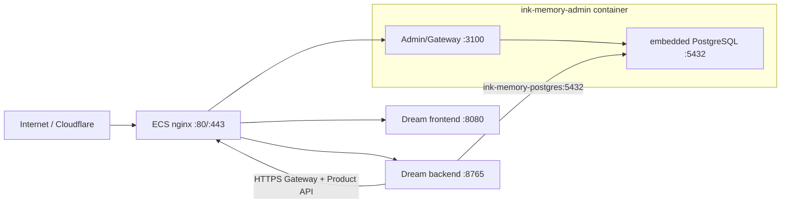

# 阿里云 ECS 部署
<!--
[Input] Admin/Dream Remote SSH topology, embedded PostgreSQL alias, and public HTTPS service origins.
[Output] Define Alibaba ECS release order, secure cross-repository configuration, verification, and rollback.
[Sync] 2026-08-22: route Dream Gateway and Product API through the public HTTPS
                    Admin origin while retaining the shared network only for embedded PG.
[Sync] 2026-08-22: add calibrated backend read BPS/IOPS limits after a real
                    Claude resume turn saturated the ECS system disk and blocked SSH/health.
-->

## 服务与仓库边界

| 发布单元 | 权威仓库 | 服务/数据 |
|----------|----------|-----------|
| Admin 平台 | `../ink-admin-memory` | 单 Admin/Gateway 容器、内嵌 PostgreSQL、Artifact volume、Drizzle migration |
| Dream 应用 | 当前仓库 | frontend、backend、Mihomo TUN |

独立 PostgreSQL 和 MinIO 容器已经移除。Admin 镜像内的 `@ink-memory/db`
supervisor 管理 PostgreSQL 18.1；对象存储设置为 `FILE_STORAGE_TYPE=disabled`。
Dream 不发布数据库、不执行 migration，也不管理 Admin volume。



Admin Compose 同时在 external network 发布 `ink-memory-admin` 与
`ink-memory-postgres` alias。PG 只监听容器/共享网络，不映射 ECS host port。

## ECS 前置条件

- Docker Engine 与 `docker-compose` 兼容命令；
- nginx；
- `/dev/net/tun`（Dream Mihomo）；
- 至少 2GB swap；
- 安全组按管理方式放行 `22`、`80`、`443`，不要开放 3000/3100、5432、8080、8765。

```bash
export REMOTE_SSH_HOST=39.97.252.88
export REMOTE_SSH_USER=root
export REMOTE_PLATFORM_NETWORK=ink-memory-platform
```

## 1. 发布 Admin 与内嵌 PostgreSQL

```bash
cd ../ink-admin-memory

ADMIN_PUBLIC_ORIGIN=https://ink-admin.suoxya.com \
DREAM_PUBLIC_ORIGIN=https://ink-frontend.suoxya.com \
./deploy/remote-ssh/prepare-env.sh

export REMOTE_APP_DIR=/srv/ink-admin-memory
./deploy/remote-ssh/deploy.sh check
./deploy/remote-ssh/deploy.sh plan
```

生成的 `deploy/remote-ssh/.env` 为 mode `0600`，保留 PostgreSQL、Session、
Gateway、Provider encryption 和 Product API secrets；不包含 MinIO/S3/AWS 凭据。
ECS 内嵌 PG 默认 `shared_buffers=96MB`、`max_connections=50`。
低内存 ECS 的 Admin image build 固定为 1 个 Next worker、640MB V8 heap，并串行
安排 Next build 与系统包安装；这些是 build 配置，不改变运行时业务路径。Dream
Remote SSH 同步会排除本机 virtualenv、QA artifacts、generated output 与 vendor
worktree，避免非构建输入挤占 ECS 发布盘。

### 首次导入现有 PostgreSQL

只有目标 embedded volume 没有用户表时才使用：

```bash
./deploy/remote-ssh/deploy.sh bootstrap
```

脚本从 mode-0600 `.env.local` 验证 Admin package 管理的本机 embedded cluster，临时
启动后生成 PG18 gzip 压缩纯 SQL，上传到远端 `backups/`，再由同 major 的
`@ink-memory/db`/`psql` 流式导入空目标。目标非空会 fail closed；本机 data directory
保留，MinIO 数据不迁移。其他源配置必须通过 `LOCAL_SOURCE_ENV_FILE` 显式选择。

常规发布：

```bash
./deploy/remote-ssh/deploy.sh deploy
```

顺序固定为 image build → package migration → 38/38 check → Admin start →
embedded PG/Admin/nginx verify。`RUN_DB_MIGRATIONS=false`，应用启动不执行 DDL。

## 2. 发布 Dream frontend/backend

```bash
cd ../ink-dream-memory

DREAM_ADMIN_ENV_FILE=../ink-admin-memory/deploy/remote-ssh/.env \
DREAM_GATEWAY_ORIGIN=https://ink-admin.suoxya.com \
DREAM_PRODUCT_ORIGIN=https://ink-frontend.suoxya.com \
DREAM_BACKEND_BLOCK_DEVICE=/dev/vda \
DREAM_BACKEND_READ_BPS=32mb \
DREAM_BACKEND_READ_IOPS=400 \
./deploy/remote-ssh/prepare-env.sh

export REMOTE_APP_DIR=/srv/ink-and-memory
export REMOTE_FRONTEND_PUBLIC_ORIGIN=https://ink-frontend.suoxya.com
export REMOTE_BACKEND_PUBLIC_ORIGIN=https://ink-backend.suoxya.com
export REMOTE_API_BASE_URL=${REMOTE_BACKEND_PUBLIC_ORIGIN}
export REMOTE_CORS_ALLOW_ORIGINS=${REMOTE_FRONTEND_PUBLIC_ORIGIN}
export REMOTE_COMPOSE_OVERRIDE_FILE=deploy/remote-ssh/docker-compose.platform.yml
export REMOTE_COMPOSE_ENV_FILE=deploy/remote-ssh/.env

./deploy/remote-ssh/deploy.sh check
./deploy/remote-ssh/deploy.sh deploy
```

Dream env generator 从 Admin 的 mode-0600 env 读取生产 PG 帐号，生成指向
`ink-memory-postgres:5432` 的 DSN；该 alias 现在落在 Admin 容器内，而不是独立 PG
container。Gateway 与 Product API 都使用 HTTPS origin
`https://ink-admin.suoxya.com`，分别访问同一 Admin 容器公开的对应路由，满足两个
客户端的传输安全合同。共享 Docker network 只承载 embedded PostgreSQL alias。

`DREAM_BACKEND_BLOCK_DEVICE` 必须由 ECS 实际根磁盘解析结果显式提供，不从部署
环境名推断。当前 `39.97.252.88` 的根设备为 `/dev/vda`；真实 Claude resume 事故
采样达到约 93.9 MiB/s、1360 read IOPS、157 ms await、214 平均队列深度与
69.85% iowait，因此此 topology 先将 Dream backend 限制为 32 MB/s / 400 IOPS。
限制只约束承载 Claude 子进程的 backend 容器读取，不修改 Admin、PostgreSQL、
workspace、sandbox 或公开业务协议。调整值必须先保留 Admin/SSH 磁盘余量并重新测量
首 Token；回滚时删除 overlay 的 `blkio_config` 或恢复上一版 Compose 后只重建
Dream backend。

## 验证、备份与回滚

```bash
cd ../ink-admin-memory
./deploy/remote-ssh/deploy.sh ps
./deploy/remote-ssh/deploy.sh verify
./deploy/remote-ssh/deploy.sh backup

cd ../ink-dream-memory
./deploy/remote-ssh/deploy.sh ps
./deploy/remote-ssh/deploy.sh verify

docker inspect -f '{{json .HostConfig.BlkioDeviceReadBps}} {{json .HostConfig.BlkioDeviceReadIOps}}' ink-backend

curl -fsS https://ink-admin.suoxya.com/admin/login >/dev/null
curl -fsS https://ink-backend.suoxya.com/api/health
curl -fsS https://ink-frontend.suoxya.com/ >/dev/null
```

Admin `backup` 短暂停止单容器，归档已关闭的 PostgreSQL data volume，然后立即启动
并复验。物理备份只允许恢复到相同 embedded PostgreSQL major/runtime。

```bash
cd ../ink-admin-memory && ./deploy/remote-ssh/deploy.sh rollback
cd ../ink-dream-memory && ./deploy/remote-ssh/deploy.sh rollback
```

镜像回滚不回滚 PG/Artifact/Dream 数据。跨版本继续遵守 expand → 双版本兼容 →
backfill/validate → contract。

## Secret 与数据规则

- 两仓库 `deploy/remote-ssh/.env` 均 gitignored、mode `0600`，不得写入 issue/日志；
- Dream Product JWT secret 必须与 Admin 一致；
- Dream Gateway service key、issuer/audience 必须与 Admin 数据和 Gateway JWT 配置一致；
  `DREAM_GATEWAY_ORIGIN` 必须是 HTTPS，并同时作为 Dream Product API base origin；
- PostgreSQL volume 只由 Admin Compose 管理；Dream 不执行 restore、migration、DROP、
  TRUNCATE 或 runtime DDL；
- `bootstrap` 只用于首次空目标；后续使用物理备份与经过审核的恢复维护窗口；
- Admin object storage 当前 disabled；不得假设 MinIO URL/volume 仍然存在。
