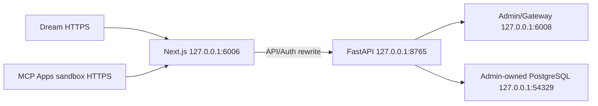

# AutoDL SSH 部署
<!--
[Input] AutoDL direct-host scripts, Admin env, MCP Apps env, and SeetaCloud mappings.
[Output] Current Next.js/FastAPI/MCP Apps release, verification, and rollback contract.
[Pos] AutoDL Dream production runbook.
[Sync] 2026-09-06: migrate the direct-host release from Vite/npm/dist to standalone Next.js and frozen pnpm.
[Sync] 2026-09-11: add safe discovery of the AutoDL-injected public mappings (AutoDLService6006URL/AutoDLService6008URL) and how they fill platform.env origins.
-->

## 拓扑与边界

AutoDL 先发布 Admin，再发布 Dream。Dream 不安装 Docker/nginx：



唯一 Web 源码位于 `frontend/app/_dream/**`；构建使用
`frontend/pnpm-lock.yaml` 和 standalone Next.js。MCP Apps 的 Browser Host 随
Dream 页面构建，server-only Node Runtime 位于
`frontend/packages/mcp-apps-runtime/**` 并由 Next Route Handler 执行。

MCP Apps sandbox 必须使用与主 Dream 不同的 HTTPS origin，但仍路由到
6006；主 origin 作为允许的 parent origin。Dream 只消费 Admin 已发布的
PostgreSQL capability，不执行 migration、DDL、restore 或 SQLite fallback。

## 配置

公网 origin 取自 AutoDL 注入的只读服务变量。SSH 登录实例后只输出这两个变量——
不要打印整个 `/etc/profile.d/autodl.env.sh`，其中还包含 AutoDL 面板令牌：

```bash
source /etc/profile.d/autodl.env.sh
printf 'Dream: %s\nAdmin: %s\n' "${AutoDLService6006URL}" "${AutoDLService6008URL}"
```

`AutoDLService6006URL`（前端 6006）填入 `AUTODL_DREAM_PUBLIC_ORIGIN`，
`AutoDLService6008URL`（Admin 6008）填入 `AUTODL_ADMIN_PUBLIC_ORIGIN`。AutoDL
代理不保证转发 `Forwarded` / `X-Forwarded-*`，公网 origin 必须显式配置；更换
实例后地址会重新生成，需重新发现并重新投影 runtime env。

从 `deploy/autodl-ssh/platform.env.example` 创建 gitignored
`platform.env`，设置 SSH、Dream/Admin HTTPS origin、独立 sandbox origin
和本机 MCP Apps env 文件。然后生成 mode-0600 runtime env：

```bash
AUTODL_ADMIN_ENV_FILE=../ink-admin-memory/deploy/autodl-ssh/.env \
  ./deploy/autodl-ssh/prepare-env.sh
```

投影会保留 backend-owned MCP Apps service token，读取 frontend 的 manifest、
feature 和资源/network policy，并覆盖为生产 sandbox/parent origins。AutoDL
固定 `INK_AGENT_SANDBOX_ENABLED=false`：外层容器无法提供 namespace sandbox，
approved Bash 将以 Dream root 身份运行。

## 发布与验证

```bash
./deploy/autodl-ssh/test-topology.sh
./deploy/autodl-ssh/deploy.sh check
./deploy/autodl-ssh/deploy.sh deploy
```

脚本安装固定 Node/pnpm、Claude Runtime 与 Notion CLI，执行 frozen pnpm
install 和 standalone Next build；release gate 验证 MCP Apps Node routes、
FastAPI/Next/同源 API、`robots.txt`、`sitemap.xml`、`llms.txt`、内置
Skills、默认 Deck Plugin、Admin 依赖和公网 origin。全部通过后才推进
`qualified`。

运维命令为 `status`、`logs`、`verify`、`start`、`stop` 和 `rollback`。
启动/停止仅处理具名 Dream screen/PID；未知端口占用会 fail closed。回滚只
切换 Dream release，不回滚 Admin migration、PostgreSQL 数据或 workspace。
