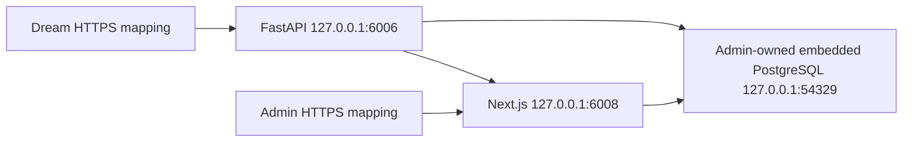

# AutoDL SSH 部署
<!--
[Input] AutoDL direct-host platform scripts and SeetaCloud service mappings.
[Output] Define Dream/Admin ordering, secure environment projection, verification, and rollback.
[Sync] 2026-08-26: add the non-Docker, non-nginx AutoDL release path.
-->

## 拓扑与发布顺序

AutoDL 由两个仓库各自的 `deploy/autodl-ssh` 平台发布，先 Admin、后 Dream：



不安装 Docker/nginx。`screen` 保持 SSH 断开后的服务进程；业务进程和 PostgreSQL 使用专用非 root 用户。代码、配置和版本化 release 位于 `/root/ink-autodl`，持久数据位于 `/root/autodl-tmp/ink-memory`。

两个仓库均先将 `platform.env.example` 复制为 gitignored 的 `platform.env`，填写 SSH endpoint、`/root` 路径和 SeetaCloud HTTPS 映射。`deploy.sh` 会自动读取该文件；npm token 等秘密仍只通过进程环境传入。

## Admin 首次发布

在 Admin 仓库生成 gitignored runtime env，首次空目标执行 `bootstrap` 导入当前本机 embedded PostgreSQL；后续只执行 `deploy`：

```bash
AUTODL_ADMIN_PUBLIC_ORIGIN=https://admin-tunnel.example.com:8443 \
AUTODL_DREAM_PUBLIC_ORIGIN=https://dream-tunnel.example.com:8443 \
./deploy/autodl-ssh/prepare-env.sh

./deploy/autodl-ssh/deploy.sh check
./deploy/autodl-ssh/deploy.sh bootstrap
```

`bootstrap` 对非空目标 fail closed。migration 始终由 Admin 的 `@ink-memory/db` 显式运行，Dream 不执行 DDL。

## Dream 发布

Dream env 从自身安全配置和上一步 Admin env 投影。浏览器-facing URL 使用 HTTPS mapping；同机 Gateway/Product API 使用 `127.0.0.1:6008`：

```bash
AUTODL_ADMIN_ENV_FILE=../ink-admin-memory/deploy/autodl-ssh/.env \
AUTODL_DREAM_PUBLIC_ORIGIN=https://dream-tunnel.example.com:8443 \
AUTODL_ADMIN_PUBLIC_ORIGIN=https://admin-tunnel.example.com:8443 \
./deploy/autodl-ssh/prepare-env.sh

./deploy/autodl-ssh/deploy.sh check
./deploy/autodl-ssh/deploy.sh deploy
```

私有 npm 包需要认证时，通过进程环境传入 `AUTODL_NPM_TOKEN`。脚本只生成临时 mode-0600 npmrc，完成 `ink-claude-code-dream` 与官方回滚 CLI 安装后立即删除；token 不进入 Dream runtime env、Git 或日志。

## 验证与回滚

`verify` 同时检查本机 Dream/Admin、screen、监听端口和 Dream 公网 `/api/health`；Admin 平台另行验证公网 `/admin/login`。回滚只切换相应仓库的 `current`/`previous` release，不回滚 PostgreSQL migration、用户数据或 workspace。
