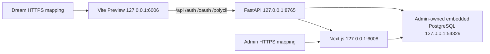

# AutoDL SSH 部署
<!--
[Input] AutoDL direct-host platform scripts and SeetaCloud service mappings.
[Output] Define Dream/Admin ordering, frontend/API topology, secure environment projection, verification, and rollback.
[Sync] 2026-08-26: install the standalone stack launcher under /root/ink-autodl.
-->

## 拓扑与发布顺序

AutoDL 由两个仓库各自的 `deploy/autodl-ssh` 平台发布，先 Admin、后 Dream：



不安装 Docker/nginx。Dream 公网 8443 只映射前端 6006，FastAPI 8765 保持本机私有并由 Vite Preview 同源代理。`screen` 保持 SSH 断开后的服务进程；业务进程和 PostgreSQL 使用专用非 root 用户。代码、配置和版本化 release 位于 `/root/ink-autodl`，持久数据位于 `/root/autodl-tmp/ink-memory`。

Claude 插件的不可变 artifacts 位于 `/root/autodl-tmp/ink-memory/claude-plugin-runtime`，不放入版本化 release。发布时可通过 `AUTODL_PLUGIN_ARTIFACTS_SOURCE` 从受信任的本机 artifact store 幂等补充；未提供本机 seed 时保留远端已有内容。远端 store 为空则发布失败，`verify` 还会解析并校验默认 Deck 插件，避免数据库 `ready` 记录与磁盘 artifact 脱节后产生注册 500。

两个仓库均先将 `platform.env.example` 复制为 gitignored 的 `platform.env`，填写 SSH endpoint、`/root` 路径和 SeetaCloud HTTPS 映射。Dream 的 `prepare-env.sh` 与两个仓库的 `deploy.sh` 会自动读取该文件；npm token 等秘密仍只通过进程环境传入。

## Admin 首次发布

在 Admin 仓库生成 gitignored runtime env，首次空目标执行 `bootstrap` 导入当前本机 embedded PostgreSQL；后续只执行 `deploy`：

```bash
AUTODL_ADMIN_PUBLIC_ORIGIN=https://admin-tunnel.example.com:8443 \
AUTODL_DREAM_PUBLIC_ORIGIN=https://dream-tunnel.example.com:8443 \
./deploy/autodl-ssh/prepare-env.sh

./deploy/autodl-ssh/deploy.sh check
./deploy/autodl-ssh/deploy.sh bootstrap
```

`bootstrap` 对非空目标 fail closed。migration 始终由 Admin 的 `@ink-memory/db` 显式运行，Dream 不执行 DDL。

## Dream 发布

Dream env 从自身安全配置和上一步 Admin env 投影。浏览器-facing URL 使用 HTTPS mapping；前端 6006 同源代理后端 8765，同机 Gateway/Product API 使用 `127.0.0.1:6008`：

```bash
AUTODL_ADMIN_ENV_FILE=../ink-admin-memory/deploy/autodl-ssh/.env \
AUTODL_DREAM_PUBLIC_ORIGIN=https://dream-tunnel.example.com:8443 \
AUTODL_ADMIN_PUBLIC_ORIGIN=https://admin-tunnel.example.com:8443 \
./deploy/autodl-ssh/prepare-env.sh

./deploy/autodl-ssh/deploy.sh check
./deploy/autodl-ssh/deploy.sh deploy
```

私有 npm 包需要认证时，通过进程环境传入 `AUTODL_NPM_TOKEN`。脚本只生成临时 mode-0600 npmrc，完成 `ink-claude-code-dream` 与官方回滚 CLI 安装后立即删除；token 不进入 Dream runtime env、Git 或日志。

## 已发布服务的一键启动

Dream 的 `sync`、`build` 和 `deploy` 会自动将独立启动脚本安装到 `/root/ink-autodl/start-ink-memory.sh`。已有 source 但尚未重新发布时，也可手动安装：

```bash
install -m 0755 \
  /root/ink-autodl/dream/source/deploy/autodl-ssh/runtime/start-ink-memory.sh \
  /root/ink-autodl/start-ink-memory.sh

bash /root/ink-autodl/start-ink-memory.sh
```

该脚本无需 GPU，不执行构建、migration 或 restore。它会幂等检查现有端口，先恢复 Admin/内嵌 PostgreSQL，再恢复 Dream 前端与后端；健康服务不会被重复启动，未知进程占用端口时 fail closed。完整说明见 [`deploy/autodl-ssh/README.md`](../../deploy/autodl-ssh/README.md)。

## 验证与回滚

`verify` 同时检查本机 frontend 根页面、FastAPI 8765、6006 代理 `/api/health`、默认 Deck 插件 artifact、Admin、screen 和 Dream 公网根页面/API；Admin 平台另行验证公网 `/admin/login`。回滚只切换相应仓库的 `current`/`previous` release；首次拓扑回滚能识别旧 backend-only release 并恢复 6006 旧路径，不回滚 PostgreSQL migration、用户数据或 workspace。
