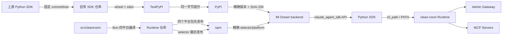

<!-- [输入] SDK/Runtime 仓库当前构建脚本、Trusted Publisher 工作流、Dream 依赖锁与 Runtime resolver 合同。 -->
<!-- [输出] 自有 Python SDK 与多平台 clean-room Runtime 的打包、发布、Dream 集成、验证和回滚操作手册。 -->
<!-- [定位] Claude SDK/Runtime 发布与 IM Dream 接入的中文执行真相源；不负责服务器部署。 -->
<!-- [同步] 2026-08-28：记录 PyPI SDK 0.2.144、npm Runtime 0.1.2、same-SHA workflow、持久最小权限 token 边界及 Dream 精确接入。 -->

# Claude SDK/Runtime 打包、发布与 IM Dream 集成

## 1. 目的与结论

IM Dream 的 Python 后端需要两个独立制品：

| 制品 | 包名 | 分发渠道 | Dream 使用方式 |
| --- | --- | --- | --- |
| Python SDK | `ink-claude-dream-agent-sdk` | TestPyPI → PyPI | 安装后继续 `import claude_agent_sdk` |
| Claude Runtime | `@glide-the/ink-claude-code-dream` + 四个平台包 | npm | SDK 通过 `ClaudeAgentOptions.cli_path` 或 PATH 启动 |

Python SDK 不放到 npm，Runtime 不放进 wheel。Bun 只负责编译 Runtime；Python SDK
继续使用 `pyproject.toml`、wheel 和 sdist。Dream 不复制 SDK transport、Agent 状态机、
MCP 状态机或 Runtime 实现。

当前已发布并由 Dream 使用的版本：

| 对象 | 当前身份 |
| --- | --- |
| SDK | PyPI `ink-claude-dream-agent-sdk==0.2.144` |
| SDK 源码/发布仓库 | `v0.2.144@fa10c9ef04ec006d9dcf0a88b1b35dab4ef4723b` |
| SDK 发布 workflow | `32874352449`；TestPyPI、PyPI 与远端字节复验成功 |
| Runtime selector | npm `@glide-the/ink-claude-code-dream@0.1.2` |
| Runtime 仓库 | release `main@c3e4d4e2f74960c75b42b1cd48adedf90345a10b` |
| Runtime 发布 workflow | qualification `33149053281`；publish `33151128000` |
| Dream Runtime 接口标识 | `2.1.241 (Claude Code)` |

## 2. 仓库职责

先为本机路径设置任务专用变量，后续命令不依赖固定用户名：

```bash
SDK_REPO=/path/to/ink-claude-dream-agent-sdk-python
RUNTIME_REPO=/path/to/ink-claude-code-dream
DREAM_REPO=/path/to/ink-dream-memory
```

| 仓库 | 只负责 |
| --- | --- |
| `ink-claude-dream-agent-sdk-python` | 上游源码同步、Python 构建、TestPyPI/PyPI 发布 |
| `ink-claude-code-dream` | clean-room Runtime、Bun 四平台构建、npm 五包发布 |
| `ink-dream-memory` | 固定 SDK/Runtime 版本、哈希、启动路径和业务验收 |

SDK 与 Runtime 最终都使用 `main`。禁止 force push、移动已发布 tag、覆盖已存在的
PyPI/npm 版本，禁止在 Dream 中加入替代 SDK/Runtime 的业务实现。

## 3. 认证方式

浏览器只用于一次性的登录、2FA、账号恢复或 Trusted Publisher 配置。配置完成后，
构建、发布、验证、Git 和 PR 全部使用 CI/OIDC 或已有 CLI 会话。

推荐认证方式：

- PyPI/TestPyPI：GitHub Actions OIDC Trusted Publishing；不保存 PyPI 长期 Token。
- npm：GitHub Actions OIDC Trusted Publishing；首次创建包或配置 2FA 时才进入网页。
- GitHub：已认证的 `gh` 会话。

Token 不得进入命令行参数、日志、Git、文档、环境转储或构建产物。若组织策略必须使用
Token，只能使用项目级、最小权限、可撤销 Token，并通过 CI secret/env 注入。

## 4. Python SDK 打包

### 4.1 打包边界

SDK distribution 名为 `ink-claude-dream-agent-sdk`，import namespace 保持
`claude_agent_sdk`。同一 Python 环境禁止同时安装 official `claude-agent-sdk`。

wheel/sdist 必须排除：

- `_bundled/claude`、`_bundled/claude.exe`；
- 任意 `*.map`；
- transcript、Workspace、插件物化数据；
- MCP/OAuth 凭据、Token、环境变量；
- 自定义 Runtime 二进制。

### 4.2 本地可复现构建

```bash
cd "$SDK_REPO"
git status --short --branch

python3.12 -m venv .venv-packaging
.venv-packaging/bin/python -m pip install \
  --only-binary=:all: \
  --require-hashes \
  -r packaging/build-requirements.lock

.venv-packaging/bin/python scripts/verify_upstream.py
.venv-packaging/bin/python scripts/reproducible_build.py

python3.12 -m venv .venv-archive-check
.venv-archive-check/bin/python -m pip install 'twine==7.0.0'
.venv-archive-check/bin/python -m twine check --strict \
  dist/reproducible/*.whl \
  dist/reproducible/*.tar.gz

cd dist/reproducible
if command -v sha256sum >/dev/null 2>&1; then
  sha256sum --check SHA256SUMS
else
  shasum -a 256 -c SHA256SUMS
fi
```

`reproducible_build.py` 会独立构建两次并比较字节，检查归档路径、distribution
metadata、源码来源、CLI 排除和零 `.map`。正式发布前工作树必须干净；
`--allow-dirty` 只能用于本地预检，不能作为发布输入。

对版本 `X.Y.Z`，最终只能产生：

```text
ink_claude_dream_agent_sdk-X.Y.Z-py3-none-any.whl
ink_claude_dream_agent_sdk-X.Y.Z.tar.gz
SHA256SUMS
```

### 4.3 版本与 tag

发布前确认以下版本完全一致：

- `pyproject.toml` 的 `project.version`；
- `src/claude_agent_sdk/_version.py` 的 `__version__`；
- source tag `vX.Y.Z`；
- workflow 输入 `version=X.Y.Z`、`source_ref=vX.Y.Z`。

source tag 是不可变源码身份。如果 source tag 中的 workflow 存在编排缺陷，应在
`main` 修复后创建 `vX.Y.Z-publish.N` runner tag，但 `source_ref` 仍必须是原始
`vX.Y.Z`。禁止移动或删除 source tag。

## 5. Python SDK 发布到 TestPyPI/PyPI

SDK 唯一发布入口是 `.github/workflows/publish-portable.yml`。它会：

1. 从 `source_ref` 检出不可变源码；
2. 校验上游来源并执行两次可复现构建；
3. 检查 SHA-256、`twine check`、无 CLI、无 `.map`；
4. 在独立环境安装 wheel smoke；
5. 使用 OIDC 发布 TestPyPI；
6. 从 TestPyPI 重新下载并逐字节复验；
7. 将同一 GitHub artifact 发布到正式 PyPI。

从 source tag 直接触发：

```bash
cd "$SDK_REPO"

SDK_VERSION=X.Y.Z
SDK_SOURCE_REF="v${SDK_VERSION}"

git tag "$SDK_SOURCE_REF" <reviewed-commit>
git push origin "$SDK_SOURCE_REF"

gh workflow run publish-portable.yml \
  --ref "$SDK_SOURCE_REF" \
  -f version="$SDK_VERSION" \
  -f source_ref="$SDK_SOURCE_REF"

gh run list \
  --workflow publish-portable.yml \
  --limit 5
```

若只修复了 workflow 编排：

```bash
SDK_RUNNER_REF="v${SDK_VERSION}-publish.1"
git tag "$SDK_RUNNER_REF" <workflow-fix-main-commit>
git push origin "$SDK_RUNNER_REF"

gh workflow run publish-portable.yml \
  --ref "$SDK_RUNNER_REF" \
  -f version="$SDK_VERSION" \
  -f source_ref="$SDK_SOURCE_REF"
```

等待并查看运行：

```bash
SDK_RUN_ID=<workflow-run-id>
gh run watch "$SDK_RUN_ID" --exit-status
gh run view "$SDK_RUN_ID" --log-failed
```

PyPI 版本不可覆盖。错误版本只能停止后续审批、按治理需要 yank，并以新版本修复。

## 6. Runtime 多平台打包

### 6.1 五包布局

Runtime 发布一个 selector 和四个平台 standalone 包：

```text
@glide-the/ink-claude-code-dream
@glide-the/ink-claude-code-dream-darwin-arm64
@glide-the/ink-claude-code-dream-darwin-x64
@glide-the/ink-claude-code-dream-linux-arm64
@glide-the/ink-claude-code-dream-linux-x64
```

selector 暴露 `ink-claude-code-dream` 和兼容 alias `claude`，两者指向同一个 launcher。
平台包内是已编译的 standalone；Bun `1.4.0` 是构建身份，不是目标机器运行依赖。

### 6.2 本地构建与资格验证

```bash
cd "$RUNTIME_REPO"
git status --short --branch

bun install --frozen-lockfile
npm run lint
npm test

npm run cleanroom:build:targets
npm run cleanroom:npm:package
npm run cleanroom:npm:verify
```

也可执行仓库聚合门：

```bash
bun run verify
```

打包门必须验证：

- Darwin/Linux × arm64/x64 四个 target；
- release manifest、artifact manifest、capabilities 和 checksum 互相绑定；
- CycloneDX SBOM 与第三方许可证清单存在；
- `productionEligible`、`publicationAllowed`、`redistributionAllowed` 为真；
- 源、stage、tgz 和安装树均没有 `*.map`；
- 不读取、编译或打包 `restored-src`、旧派生 bundle 或用户数据。

## 7. Runtime 发布到 npm

先运行资格 workflow：

```bash
cd "$RUNTIME_REPO"

gh workflow run qualify-npm-runtime.yml --ref main
gh run list \
  --workflow qualify-npm-runtime.yml \
  --branch main \
  --limit 5
```

确认资格 run 的 `head_sha` 与准备发布的 Runtime `main` 完全一致。随后触发发布：

```bash
RUNTIME_QUALIFICATION_RUN_ID=<successful-run-id>

gh workflow run publish-npm.yml \
  --ref main \
  -f qualification_run_id="$RUNTIME_QUALIFICATION_RUN_ID" \
  -f trusted_publishers_configured=true

gh run list --workflow publish-npm.yml --limit 5
```

`publish-npm.yml` 会重新下载并验证资格 run 的五个 tgz，然后严格按以下顺序发布：

1. darwin-arm64；
2. darwin-x64；
3. linux-arm64；
4. linux-x64；
5. selector。

禁止 selector 先发，禁止使用 range/tag 替代精确平台版本，禁止覆盖已经存在的 npm
版本。发布 workflow 应使用 OIDC；已有认证会话后不再使用浏览器逐包操作。

## 8. Registry 发布后 smoke

### 8.1 SDK

```bash
SDK_VERSION=X.Y.Z
SDK_SMOKE_DIR=$(mktemp -d /tmp/ink-sdk-smoke.XXXXXX)

python3.12 -m venv "$SDK_SMOKE_DIR/venv"
"$SDK_SMOKE_DIR/venv/bin/python" -m pip install \
  --isolated \
  --no-cache-dir \
  --index-url https://pypi.org/simple \
  "ink-claude-dream-agent-sdk==$SDK_VERSION"

"$SDK_SMOKE_DIR/venv/bin/python" - <<'PY'
from importlib import metadata
from pathlib import Path
import claude_agent_sdk

custom = metadata.distribution("ink-claude-dream-agent-sdk")
assert custom.version == claude_agent_sdk.__version__
assert metadata.packages_distributions()["claude_agent_sdk"] == [
    "ink-claude-dream-agent-sdk"
]
assert not (Path(custom._path) / "direct_url.json").exists()
try:
    metadata.distribution("claude-agent-sdk")
except metadata.PackageNotFoundError:
    pass
else:
    raise AssertionError("official claude-agent-sdk must not coexist")
print("sdk_registry_smoke=ok")
PY
```

### 8.2 Runtime

```bash
RUNTIME_VERSION=X.Y.Z
RUNTIME_SMOKE_DIR=$(mktemp -d /tmp/ink-runtime-smoke.XXXXXX)

cd "$RUNTIME_SMOKE_DIR"
npm init -y
npm install \
  --registry=https://registry.npmjs.org \
  "@glide-the/ink-claude-code-dream@$RUNTIME_VERSION"

./node_modules/.bin/ink-claude-code-dream --version

test -z "$(find node_modules -type f -name '*.map' -print -quit)"
npm view \
  "@glide-the/ink-claude-code-dream@$RUNTIME_VERSION" \
  version bin optionalDependencies dist.integrity \
  --json
```

当前主机只会安装匹配平台包。跨平台的真实 sandbox 验收必须在对应 target host 执行，
不能用一个 Darwin ARM64 主机冒充四个平台。

## 9. 集成到 IM Dream

### 9.1 固定 Python SDK

在 `backend/pyproject.toml` 中使用精确版本：

```toml
dependencies = [
  "ink-claude-dream-agent-sdk==X.Y.Z",
]
```

更新锁文件和容器 requirements：

```bash
cd "$DREAM_REPO/backend"

uv lock
uv export \
  --locked \
  --no-dev \
  --output-file requirements.txt
uv lock --check
uv sync --frozen --inexact
```

必须满足：

- `uv.lock` 的 SDK source 是 `https://pypi.org/simple`；
- `uv.lock` 记录 wheel/sdist URL、size 和 SHA-256；
- `requirements.txt` 保留 archive `--hash=sha256:...`；
- Docker pip 使用 `--require-hashes`；
- 不再出现 SDK Git URL；
- official `claude-agent-sdk` 不共存。

### 9.2 固定 Runtime

Dream Docker 使用精确 Runtime selector：

```dockerfile
ARG INK_CLAUDE_CODE_VERSION=X.Y.Z

RUN npm install -g \
    --registry="${INK_CLAUDE_NPM_REGISTRY}" \
    "@glide-the/ink-claude-code-dream@${INK_CLAUDE_CODE_VERSION}"
```

selector 的 optional dependency 自动选择当前 Linux 平台包。Docker 可以另装 official
Claude CLI 作为显式回滚，但 Dream 默认 resolver 仍选择 `ink-claude-code-dream`。

Runtime 解析顺序：

1. `ClaudeAgentOptions.cli_path`；
2. 绝对 `CLAUDE_CODE_CLI_PATH`；
3. PATH 中的 `ink-claude-code-dream`；
4. 无合格 Runtime 时 fail closed。

禁止静默回退 SDK bundled CLI 或 ambient `claude`。

### 9.3 Dream 安装后验证

```bash
cd "$DREAM_REPO/backend"

.venv/bin/python - <<'PY'
from importlib import metadata
from pathlib import Path
import claude_agent_sdk

custom = metadata.distribution("ink-claude-dream-agent-sdk")
providers = metadata.packages_distributions()["claude_agent_sdk"]
assert providers == ["ink-claude-dream-agent-sdk"], providers
assert custom.version == claude_agent_sdk.__version__
assert not (Path(custom._path) / "direct_url.json").exists()
try:
    metadata.distribution("claude-agent-sdk")
except metadata.PackageNotFoundError:
    pass
else:
    raise AssertionError("official claude-agent-sdk must not coexist")
print("dream_sdk_source=pypi")
PY

.venv/bin/python -m pytest -q \
  tests/test_dockerfile_claude_contract.py \
  tests/test_sdk_env.py \
  tests/test_verify_claude_registry_release.py
```

Runtime implementation 字节或协议合同变化时，再执行完整 Claude/MCP 回归和真实业务验收，
至少覆盖新会话、首 Token、SSE、连续多轮、tool call/result、Workspace、sandbox、
transcript、resume、MCP stdio/HTTP/OAuth/Resources、cancel 和异常退出。

如果只是把已经通过资格与真实业务验证的同一字节从 CI artifact 提升到 registry，再在
Dream 中切换分发来源，可以复用原业务证据，只补 registry 安装、metadata、resolver 和
聚焦合同测试；不要重复执行无关的全量审计。

## 10. 端到端关系



## 11. 回滚

### SDK 回滚

1. 将 `backend/pyproject.toml` 改回上一个已发布 PyPI 版本；
2. 重新运行 `uv lock`、带哈希 `uv export` 和 `uv sync --frozen --inexact`；
3. 重跑 distribution/import-provider 和聚焦合同测试。

不要覆盖或删除已经发布的 PyPI 文件。

### Runtime 回滚

优先把 Dream/Docker 的 selector 版本改回上一个已发布 npm 版本。紧急情况下可把绝对
`CLAUDE_CODE_CLI_PATH` 指向预检过的 official CLI。回滚不得修改 Dream 业务状态机、
Thread ID、Workspace、transcript 或数据库 Schema。

## 12. 发布清单

### SDK

- [ ] 版本、source tag、源码 commit 和 import version 一致。
- [ ] 上游来源验证通过。
- [ ] wheel/sdist 两次构建字节一致。
- [ ] SHA-256、`twine check`、无 CLI、无 `.map` 通过。
- [ ] TestPyPI 发布和远端字节复验通过。
- [ ] 同一 artifact 提升到正式 PyPI。
- [ ] 新鲜 Python 3.12 安装通过。

### Runtime

- [ ] `main` 和 qualification run SHA 一致。
- [ ] 四平台 standalone、manifest、SBOM、license、checksum 通过。
- [ ] 源、stage、tgz、安装树无 `.map`。
- [ ] 四个平台包先发布，selector 最后发布。
- [ ] registry fresh install、`--version`、Dream resolver 通过。

### Dream

- [ ] `pyproject.toml` 固定 SDK 精确 PyPI 版本。
- [ ] `uv.lock`/`requirements.txt` 固定 archive SHA-256。
- [ ] Docker 固定 Runtime selector 精确 npm 版本。
- [ ] `.venv` 唯一 provider 正确且无 Git `direct_url.json`。
- [ ] 聚焦测试通过；实现字节变化时完整业务验收通过。
- [ ] 中文架构、设计和目录文档同步。

## 13. 当前发布回执示例

SDK `0.2.144`：

```text
wheel: ink_claude_dream_agent_sdk-0.2.144-py3-none-any.whl
size: 151704
sha256: 50801104b1dcf8c0eb64555eb62f27f6238b37635c2ccbcb391bd562ee85ca56

sdist: ink_claude_dream_agent_sdk-0.2.144.tar.gz
size: 373286
sha256: 1b2b6dfad5bfa766de24682d7b26ef1f1394097b92a5d32be1eae40530fbd517
```

Runtime `0.1.2`：五个 npm 包均已公开；selector 与 `claude` alias 均输出
`2.1.241 (Claude Code)`，release manifest 配对 SDK `0.2.144`，四个平台包均为 standalone，
registry fresh install 只选择当前平台包且安装树无 `.map`。qualification `33149053281` 与 publish
`33151128000` 均成功；五包 granular npm token 与 GitHub `npm` Environment 的 `NPM_TOKEN` 按用户
要求保留且不进入日志、Git 或制品，本地明文中转副本已清除。

这些值只是当前版本示例。发布新版本时必须从新 workflow/registry 回执重新取得，不得
复制旧摘要。
