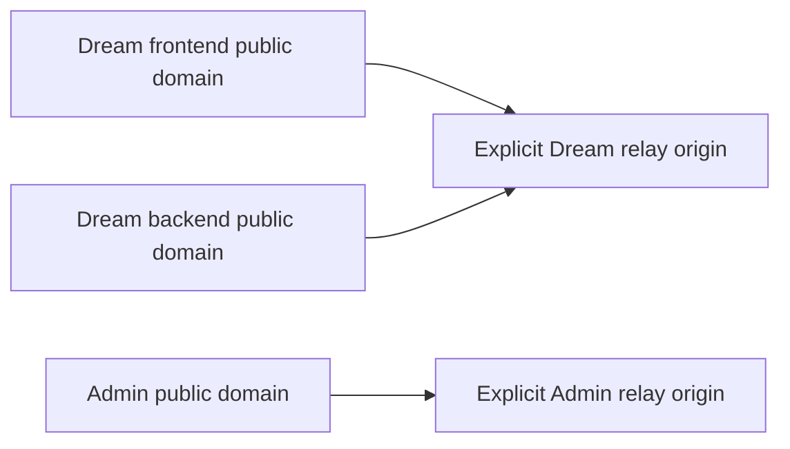

<!--
[Input] 已验证的 NATAPP 公网 origins、阿里云 SSH 目标和现有三个公开域名。
[Output] 两份 nginx 站点的可恢复切换、验证和回滚操作合同。
[Pos] 仅改变阿里云边缘代理；不发布或停止 AutoDL/NATAPP/Admin/Dream 服务。
[Sync] 2026-09-12: 新增从旧 AutoDL 映射切换到显式 NATAPP origins 的操作路径。
-->

# NATAPP 边缘转发切换

## 边界与拓扑

此操作只更新阿里云边缘主机的：

- `/etc/nginx/sites-enabled/ink-and-memory` 对应的 Dream 站点；
- `/etc/nginx/sites-enabled/ink-memory-admin` 对应的 Admin/Gateway 站点。

Dream 前端、同源 API、Auth、OAuth、SSE 与 WebSocket 必须指向同一个 Dream
origin；Admin/Gateway 单独指向 Admin origin。脚本要求显式提供两个完整 origin，
不会按 NATAPP/AutoDL 名称、历史端口或本机监听端口猜测上游。NATAPP origin 本身的
进程、隧道和认证状态不由本脚本创建或修改。



## 切换

先直接检查两个 origin 的身份：Dream 根页面与 `/api/health` 应属于 Dream，Admin
`/admin/login` 应属于 Admin。然后运行：

```bash
export REMOTE_SSH_HOST=<edge-host>
export REMOTE_SSH_USER=<ssh-user>
export REMOTE_DREAM_FRONTEND_DOMAIN=<existing-dream-frontend-domain>
export REMOTE_DREAM_BACKEND_DOMAIN=<existing-dream-backend-domain>
export REMOTE_ADMIN_DOMAIN=<existing-admin-domain>
export REMOTE_DREAM_RELAY_ORIGIN=https://<dream-relay-host>
export REMOTE_ADMIN_RELAY_ORIGIN=http://<admin-relay-host>

./deploy/remote-ssh/switch-edge-relay.sh apply
```

`apply` 对 origin、域名和端口 fail closed，在
`/etc/nginx/backups/ink-memory-relay-<timestamp>/` 保存两份原配置及 SHA-256，安装
候选配置后执行 `nginx -t`，成功后才平滑 reload。候选验证失败会自动恢复两份备份。
成功输出中的 `REMOTE_NGINX_BACKUP_DIR` 是精确回滚标识，必须保留在本次发布回执中。

HTTPS 上游通过 SNI 连接并传递其真实 `Host`；面向用户的原始域名通过
`X-Forwarded-Host` 保留。Dream 与 Admin 都关闭响应缓冲并保留 3600 秒读写超时；
WebSocket upgrade 与 SSE 长连接不会被边缘配置降级。Dream 模板继续导出
`suoxya-root` 使用的共享 `ink_backend` upstream，避免只更新目标两份站点时破坏
apex SEO 路由的跨配置依赖。

## 验证与回滚

```bash
./deploy/remote-ssh/switch-edge-relay.sh verify

export REMOTE_NGINX_BACKUP_DIR=/etc/nginx/backups/ink-memory-relay-<timestamp>
./deploy/remote-ssh/switch-edge-relay.sh rollback
```

`verify` 检查 nginx 语法/服务状态，并分别通过边缘本机 Host 路由和公网 HTTPS 检查
Dream 前端、Dream `/api/health` 与 Admin 登录页。
业务验收还应使用既有授权账号检查登录、一个现有 Thread 的 SSE 重连及正常 API；
若直接 origin 已经返回 5xx，应记录为 NATAPP 上游阻断，不能把边缘切换汇报为登录或
Agent 业务验收通过。回滚先核对 SHA-256，再同时恢复两份站点、`nginx -t` 并 reload；
不接触数据库、容器、用户数据或 NATAPP/AutoDL 实例生命周期。
