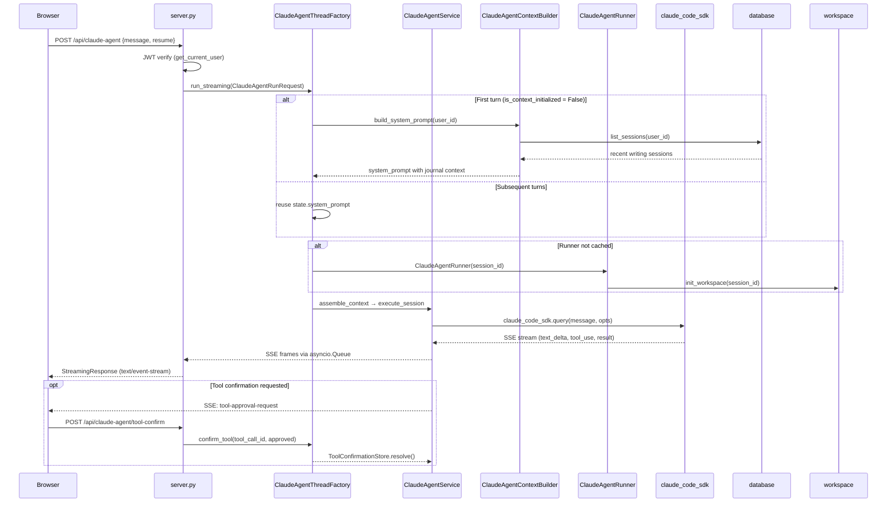

# Claude Agent 设计文档

**功能边界**：为 Ink & Memory 用户提供基于 Claude Code SDK 的流式写作助手，  
支持多轮对话、写作上下文注入、工具确认，以及跨请求会话保活。  
本模块与现有 PolyCLI agent 会话完全隔离，不存在任何共享状态或导入依赖。

---

## 1. 功能边界

| 功能 | 是否包含 | 备注 |
|------|----------|------|
| 多轮对话（会话保活 10min TTL）| ✅ | Flyweight 会话池 |
| 写作上下文注入（近期日记条目）| ✅ | 首轮构建，后续轮复用缓存 |
| SSE 流式输出 | ✅ | text-delta / tool-event / finish |
| 工具确认（手动审批）| ✅ | ToolConfirmationStore |
| 用户认证 | ✅ | 复用现有 JWT `get_current_user` |
| Mem0 长期记忆 | ❌ | 不引入；通过写作会话提供上下文 |
| IoT/硬件 MCP（项圈）| ❌ | Ink & Memory 无此设备 |
| 宠物/角色 persona | ❌ | Ink & Memory 无宠物领域 |
| 自定义 MCP 子进程 | ❌ | 最小可运行版本不引入 |

---

## 2. 用户/系统交互流程



---

## 3. API 设计

### 3.1 POST `/api/claude-agent`

**请求**：
```json
{
  "message": "帮我分析一下我最近写的关于孤独的文字",
  "resume": false,
  "tool_choice": "auto",
  "model": null,
  "max_turns": 100,
  "cwd": null
}
```

**响应**（`text/event-stream`）：
```
data: {"type": "message-metadata", "sessionId": "user_42", "turnIndex": 0}

data: {"type": "text-delta", "text": "我注意到你在"}

data: {"type": "text-delta", "text": "最近几篇日记中..."}

data: {"type": "text-done", "text": "我注意到你在最近几篇日记中..."}

data: {"type": "message-final", "text": "...", "usage": {...}, "sessionId": "user_42"}

data: {"type": "finish", "reason": "success"}
```

**错误响应**：
```
data: {"type": "error", "message": "..."}
data: {"type": "finish", "reason": "error"}
```

**认证**：Bearer JWT（必需）  
**错误码**：401（认证失败）、400（参数非法）

---

### 3.2 GET `/api/claude-agent/chat-history`

**响应**：
```json
{
  "sessions": [
    {
      "id": "abc",
      "name": "关于孤独",
      "updated_at": "2026-05-20T10:30:00",
      "first_line": "今天的会面让我..."
    }
  ]
}
```

---

### 3.3 POST `/api/claude-agent/message-latency`

**请求**：`{"sessionId": "...", "latencyMs": 1234}`  
**用途**：前端上报消息延迟指标（日志记录）。

---

### 3.4 GET `/api/claude-agent/session`

**Query 参数**：`session_id`（可选，默认为 `user_id`）

**响应**：
```json
{
  "session_id": "user_42",
  "lifecycle": "idle",
  "turn_count": 3,
  "idle_seconds": 45.2,
  "remaining_seconds": 554.8,
  "ttl_seconds": 600,
  "runner_present": true,
  "context_initialized": true
}
```

**错误码**：404（无活跃会话）

---

### 3.5 DELETE `/api/claude-agent/session`

**Query 参数**：`session_id`（可选，默认为 `user_id`）  
**响应**：`{"ok": true, "session_id": "user_42"}`  
触发 Phase 4 生命周期钩子。

---

### 3.6 POST `/api/claude-agent/tool-confirm`

**请求**：
```json
{
  "tool_call_id": "toolu_01XYZ",
  "approved": true,
  "reason": "用户明确授权",
  "answers": null
}
```

**响应**：`{"ok": true, "approved": true}`  
**错误码**：404（没有待确认的工具调用）

---

## 4. 服务职责划分

| 组件 | 职责 |
|------|------|
| `thread_factory.py / ClaudeAgentThreadFactory` | 会话入口；每 session 一把锁；四阶段编排；Observer 调度 |
| `thread_pool.py / AgentRunStatePool` | Flyweight 会话状态注册表；TTL 保活；per-session Lock |
| `thread_pool.py / AgentRunStateSweeper` | 后台定时清理过期会话 |
| `service.py / ClaudeAgentService` | Phase 1（上下文组装）+ Phase 3（流式执行 + SSE 发送）|
| `context_builder.py / ClaudeAgentContextBuilder` | 读取 `database.list_sessions`，渲染 system_prompt |
| `runner.py / ClaudeAgentRunner` | `claude_code_sdk.query` 封装；SDK env 配置；回调分发 |
| `tool_confirmation_store.py` | asyncio.Future 工具确认；跨 loop 安全 |
| `observer.py / SessionObserverRegistry` | 生命周期事件广播（Phase 1–4）|
| `workspace.py` | 每 session 隔离工作区目录（`{AGENT_CWD}/{session_id}/`）|

---

## 5. 隔离约束（不与现有 agent 模块交叉关联）

| 约束维度 | 说明 |
|----------|------|
| **代码层**| `claude_agent` 不导入 `polycli`、`polyagent` 任何模块 |
| **路由层**| `claude_agent` 端点前缀 `/api/claude-agent/*`；PolyCLI 挂载于 `/polycli` |
| **会话层**| `AgentRunStatePool` 独立于 PolyCLI `get_registry()`；互不可见 |
| **工厂层**| `ClaudeAgentThreadFactory` 单独实例化，不加入任何共享容器 |
| **鉴权层**| 两套路由均用 `Depends(get_current_user)` 但路由处理函数完全独立 |

---

## 6. 后续扩展点

| 扩展方向 | 扩展位置 | 说明 |
|----------|----------|------|
| 多 session 支持（per-topic）| `build_session_id()` | 返回 `f"{user_id}__{topic}"` |
| 消息持久化 | `service.execute_session` | 在 `message-final` 后写 DB |
| 自定义 MCP 工具 | `runner._build_sdk_options` | 添加 MCP 子进程配置 |
| Mem0 长期记忆 | `context_builder.build_system_prompt` | 注入 Mem0 recall 结果 |
| 速率限制 | `thread_factory.run_streaming` 入口 | 检查 per-user 频率 |
| 多工作区 | `workspace.get_workspace_root` | 支持 S3/NFS 远程工作区 |
| 管理员 session 列表 | 新增 `/api/claude-agent/sessions` | `list_session_snapshots()` |
