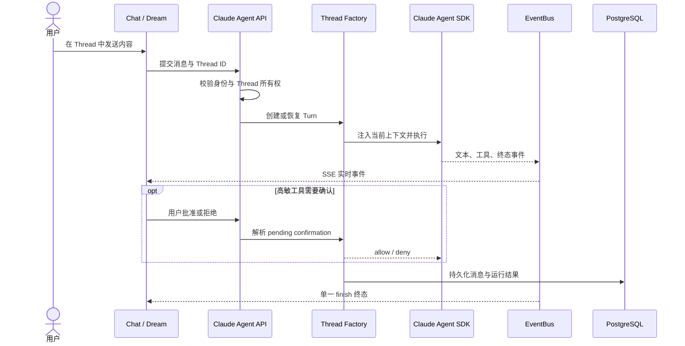

# Claude Agent 模块

Claude Agent 是 Chat 与 Dream 共用的执行运行时，负责按 Thread 组装上下文、调用 Claude Agent SDK、流式发布事件、处理工具确认，并把对话与运行状态持久化。它不拥有 Deck 定义、Story Project 或订阅计费真值。

> [Sync] 2026-07-23: 新增 `claude-agent-sandbox-network-sdk-gap.md` — SDK 通道缺口分析：headless 链路触达不到原生 SandboxPermissionRequest 弹窗的三层实证（Ink 弹窗仅 REPL 渲染 / `can_use_tool` 控制请求后端零处理 / `claude_code_sdk 0.0.25` 无该能力）、残留缺口场景（沙箱内 Bash 访问清单外域名 → fail-closed 403 黑盒）、弥合方案 A（升级 SDK + 桥接）/B（fail-closed + 收窄）/C（双层清单对齐），附持久化路径差异、Bridge 模式、Swarm worker mailbox 路由（双重不可达 + 多 Agent 按 thread 隔离启示）三处概念澄清。
> [Sync] 2026-07-23: 新增 `claude-agent-bridge-mode-forwarding-catalog.md` — Bridge 模式远端转发操作全编目：v1/v2 两代协议、can_use_tool 族四路径（通用权限五方竞争 / 沙箱网络同 host 批量解决 / headless SDK 竞争 / spawn 守护）、消息同步过滤与脱敏 system/init、远端控制请求五 subtype、会话生命周期与 outbound-only mirror、文件产物流、可靠性清单、TTY vs headless 能力对照、§7 对 Ink & Memory 的七条映射启示。
> [Sync] 2026-07-26: 新增 `claude-agent-env-allowlist-audit.md` — `INK_AGENT_*` 环境变量白名单清除机制审计：`server.py::_drop_unsupported_agent_env` 进程级 pop 致 `SANDBOX_SECCOMP_APPLY_PATH`/`SANDBOX_EXTRA_ALLOW_READ` 静默失效（生产事故复盘）、四层环境快照排查方法论、A–F 全量键分类表、清理点错位分析与子进程过滤改进建议、排查命令手册。
> [Sync] 2026-07-29: 新增 `claude-agent-sdk-cli-compatibility-report.md` — SDK × npm CLI 兼容性报告定稿：路线 A 配对（SDK 0.2.128 + CLI 2.1.108 vendor 补丁 + cli_path 锁定）生产验证通过；五大兼容问题实录（序列化方言、HookJSONOutput deny 丢失、bundled 抢占、2.1.220 单二进制与 settings seccomp 证伪、env 四层快照）、兼容性矩阵、残留风险与版本管理规约。
> [Sync] 2026-07-29: 新增 `claude-agent-issue-1151-sandbox-seccomp-en.md` / `-zh.md` — 上游 issue [claude-agent-sdk-python#1151](https://github.com/anthropics/claude-agent-sdk-python/issues/1151) 双语存档：`sandbox.seccomp.applyPath` 被内嵌转换器忽略的证据链（转换器零读取 / 硬编码 `seccomp:jCu()` / shim 零调用）、Docker apply-seccomp passthrough 补丁完整方案（Dockerfile 配方 + 运行时参数 + 安全性论证）。

> [Sync] 2026-08-03: `claude-sdk-env-design.md` 新增 §5.5B — CLAUDE_CONFIG_DIR 范围修正（重定向覆盖 plans/tasks/projects 转录/plugins/agents/缓存整个 config home，非 Plan Mode 专属）：`sdk_env.resolve_claude_config_home` 成为 config-home 路径解析单一真相源，决策上移到 Phase 1（`assemble_context`，随 cwd 建立），经 `AgentRunOptions.claude_config_home` 透传，`apply_claude_config_home_to_options`（原 `apply_plan_mode_env_to_options` 更名保留兼容）在 runner options 构建第一步注入；`session_files.get_projects_root(cwd)` 按同优先级定位转录。`claude-plan.md` §3.2/§5.1/§12、`claude-todo.md` taskListId 决策注记同步更新。
> [Sync] 2026-08-04: 新增 `subagent-sidebar/` 文档集，归档参考图、PRD、结构/层级/UI 规格与实现记录；实现记录补充 Agent 后台完成通知无人消费的根因和强制 foreground 修复。
> [Sync] 2026-07-20: `chat-markdown-mermaid.md` 新增 §2.6 图表工具栏 — 预览/源码分段切换、复用 `useCopy` 复制源码、viewBox + 2x canvas 栅格化导出 PNG；`MermaidBlock.tsx` 同步落地。
> [Sync] 2026-07-20: 新增 `chat-markdown-mermaid.md` — Chat 会话 Markdown 中 ```mermaid 围栏代码块的 SVG 渲染设计：mermaid 动态导入单例 + strict securityLevel + base 主题映射 CSS 语义变量、共享 `ChatMarkdown` 渲染链收敛三处 ReactMarkdown 调用点、`pre` 渲染器解包修正 `[<pre /> in Markdown ...]` 非法嵌套报错、300ms 防抖流式重试与源码降级。
> [Sync] 2026-07-20: 新增 `claude-todo.md` — Todo 功能设计：v1 TodoWrite 流内捕获（P0）+ v2 文件任务捕获（`INK_AGENT_TASK_V2_ENABLED` 门控，`CLAUDE_CODE_TASK_LIST_ID=main` 固定防串扰）、统一 TodoItem 模型、`todo-updated` SSE 与 `GET /threads/{id}/todos` REST 契约、PlanButton 升级「计划与待办」双区弹层（新增 `IconPlanTasks`）、五 Todo 工具低敏分级（含 TaskUpdate 非只读偏差记录）、4 张交互时序图、§13 固化 Expert Prompt Architect 规划前优化工作流。
> [Sync] 2026-07-20: claude-todo §7 业务代码全部落地（后端捕获/契约 + 前端 store/弹层 + 五工具低敏 + `backend/tests/test_claude_agent_todo.py` 26 用例）；`claude-agent-api-contracts.md` §4.5.2/§4.5.4/§4.7.9 与 `claude-agent-permission-policy.md` §3/§8 同步登记。
> [Sync] 2026-07-20: 新增 `claude-task-tools-source-analysis.md` — Claude Code 源码（sourcemap 恢复版）任务工具分析：TodoWrite（纯内存）/ TaskOutput（已废弃，后台任务族）/ TaskCreate / TaskUpdate / TaskList / TaskGet（v2 文件任务族）schema 与机制、`.claude/tasks/` 路径自定义杠杆（仅环境变量与 `--team-name`）、proper-lockfile 两级锁 + highwatermark ID 自增、blockedBy/blocks 双文件冗余边、6 张 mermaid 交互时序图。
> [Sync] 2026-07-20: 新增 `claude-plan.md` — Plan Mode 计划文件落盘路径解析（`CLAUDE_CONFIG_DIR` 主方案 / `plansDirectory` 备选）、后端捕获点、`plan-mode-changed` / `plan-updated` SSE 事件与 `GET /threads/{id}/plan` REST 契约、前端 PlanPanel 挂载点、EnterPlanMode/ExitPlanMode 低敏分级结论。
> [Sync] 2026-05-28: 新增 `claude-agent-prompt-optimization.md`，并将 `claude-agent-context-assembly.md` / `claude-agent-service-design.md` 更新为 Ink & Memory 当前 `assemble_context` 合同。
> [Sync] 2026-05-28: 新增跨模块生命周期综合视图 → [`docs/design/lifecycle/claude-agent-lifecycle.md`](../lifecycle/claude-agent-lifecycle.md)，覆盖 Thread Engine 四阶段、状态机、上下文交互设计、TTL Sweeper、Observer 钩子、工具确认侧路与端点速查。
> [Sync] 2026-05-29: edit-point/ 新增 `editor-state-lifecycle.md`（editor_state 快照完整生命周期）；`workspace-context.md` 补充 §9 双层架构与 editor_state 加载路径说明。
> [Sync] 2026-05-29: `claude-agent-context-assembly.md` 新增 §4.7（existing_session / resume 解析设计）、§7（failure handling 扩展）、§8（跨部署安全边界）、§9（resume 可测试性要求）、§10（checklist 新增 3 条 resume 项）。`claude-agent-session-persistence.md` 更新 §2.2/2.3/2.4（chat_thread 新增 claude_session_id / agent_contract_version 列）、§4.2（_persist_turn 第 5 步 write-back）、§7（Phase 接合点更新）、§8（"未持久化"条目标记为已落地）。
> [Sync] 2026-05-31: 新增 `session-labels-and-retrieval.md` — `user_sessions.labels` 属性 + `mcp__user__get_sessions_range` MCP 工具设计（数据库变更、API 变更、近期上下文格式、env var 注入路径）。
> [Sync] 2026-06-01: edit-point/workspace-switch.md 新增 §8 — Agent 提示工程集成（系统提示 Switch-Editor Workflow + workspace_context Step 0）。
> [Sync] 2026-06-07: `claude-agent-tool-confirmation-flow.md` / `claude-agent-runner-design.md` / `claude-agent-api-contracts.md` 补充 auto 模式敏感度分流策略：workspace `files/` 内置文件工具和低敏查询工具显式 allow；执行/写入/交互/状态切换工具进入前端确认侧路，批准后返回显式 allow；frontend transport 通过 `toolMetadata.approvalRequested` 驱动 auto 模式高敏工具确认 UI。
> [Sync] 2026-06-09: 新增 `claude-agent-permission-policy.md` 作为权限策略真相源；新增缺失的 `claude-agent-prompt-optimization.md`，并在 `context_builder.py` 系统提示中加入 Expert Prompt Architect 规划前优化模板。
> [Sync] 2026-06-09: Settings `im_full_access_enabled` 接入权限策略；`claude-agent-runner-design.md` / `claude-agent-tool-confirmation-flow.md` 说明完全访问模式下已暴露工具直接 PreToolUse allow。
> [Sync] 2026-06-13: 完全访问模式新增 AskUserQuestion 例外；
> `AskUserQuestion` / `mcp__user__ask_user` 仍走前端确认窗口收集 answers。
> [Sync] 2026-06-09: 新增 `sse-reconnect-and-event-bus.md` — SSE 断线重连与 EventBus 设计（v2.1）：Port/Adapter、重连流程、§11 环境变量与 `backend/.env.example` EventBus 段对齐。
> [Sync] 2026-08-11: EventBus 当前广播 `NormalizedAgentEvent` 并只在 HTTP 边界经 `ChatStreamAdapter` 编码；Chat/Dream surface 共用 thread history/status/SSE/confirmation/Stop。Dream 收敛规范见 `../dream-agent/README.md`。
> [Sync] 2026-06-06: `claude-agent-tool-confirmation-flow.md` / `claude-agent-runner-design.md` 补充 auto 模式下 workspace `files/` 内置文件工具显式 allow 策略，区分 hook fall-through 与 Claude Code 文件权限层。
> [Sync] 2026-06-06: `workspace-filesystem.md` 校准 Memory Workspace 边界：`init_workspace()` / `assemble_context()` 不初始化 `/memory/`，文件接口 `POST /api/workspace/memory-init` 读取分区配置表写入。
> [Sync] 2026-06-12: `claude-sdk-env-design.md` 补充 Cloud Run / Secret Manager 进程环境注入路径：SDK 子进程 env 来源为 `backend/.env` + 当前进程环境 + 显式 `options.env`。
> [Sync] 2026-06-13: 新增 `claude-agent-workspace-sandbox.md` — Settings
> Workspace Mode 写入每个 thread 的 `.claude/settings.json` sandbox 配置；
> Bash 目录隔离交给 Claude Code 原生 sandbox，不在 PreToolUse 中解析复杂 shell。
> [Sync] 2026-06-14: `claude-agent-workspace-sandbox.md` 增补运行时只读依赖
> allowlist；`Grep`/`Read` 等内置文件工具仍由 PreToolUse 阻断 workspace 外路径。
> [Sync] 2026-06-14: `claude-agent-workspace-sandbox.md` 记录 Remote SSH
> Docker nested sandbox 模式：后端检测到 Linux 容器运行时后自动写入
> `enableWeakerNestedSandbox=true`。
> [Sync] 2026-06-16: `claude-agent-workspace-sandbox.md` 和 interaction plan
> 修正 sandbox `denyWrite`：不再 deny 整棵 `.claude/`，保留
> `.claude/skills/` 完整操作能力。
> [Sync] 2026-06-17: `claude-agent-workspace-sandbox.md` 补充 Docker Compose
> backend 下 bubblewrap 需要 `SYS_ADMIN` 与 unconfined seccomp/AppArmor。
> [Sync] 2026-06-17: `claude-agent-workspace-sandbox.md` 补充 Linux `sbin`
> 目录 runtime allowlist，处理 `bwrap` 在 `/newroot/sbin` 挂载 tmpfs 失败。
> [Sync] 2026-06-21: 新增
> `claude-agent-sandbox-network-interaction-plan.md`，定义 Settings
> 沙箱网络策略、问题分层和最小实现边界。
> [Sync] 2026-06-22: `claude-agent-context-assembly.md` / `claude-agent-service-design.md`
> / `claude-agent-workspace-sandbox.md` / `workspace-filesystem.md` 记录 Settings
> SYSTEM_PROMPT 低优先级拼接，以及 Workspace Mode 关闭时停止初始化 thread
> workspace、隐藏前端文件侧边栏入口。
> [Sync] 2026-06-22: `claude-agent-workspace-sandbox.md`,
> `claude-agent-sandbox-network-interaction-plan.md`, and
> `user-env-injection-design.md` record that Sandbox Network and user env-var
> Settings controls are hidden while Workspace Mode is disabled.
> [Sync] 2026-06-25: `claude-agent-docker-sandbox-egress-incident-plan.md`
> 根据已验证的 `HTTP 403` / `blocked-by-allowlist` 收束为 sandbox network
> allowlist policy deny，并保留 proxy env、local listener、bridge、
> parent proxy/TUN 和 runtime startup 的分层排除路径。
> [Sync] 2026-06-25: `claude-agent-workspace-sandbox.md`,
> `claude-agent-sandbox-network-interaction-plan.md`, and
> `claude-agent-docker-sandbox-egress-incident-plan.md` record that open
> sandbox network mode omits `sandbox.network` instead of writing
> `allowedDomains:["*"]`.
> [Sync] 2026-06-25: 新增 `claude-agent-stop-interaction.md`，定义前端主动停止
> Agent 的最小交互/API/取消路径；明确普通 SSE 断线仍只 unsubscribe，
> stop API 才取消后台 turn。
> [Sync] 2026-06-27: 新增 `chat-history-search.md`，定义 Chat 历史对话搜索交互、
> `/api/claude-agent/threads` 检索参数、插件式 fuzzy/vector retriever 边界与业务时序图。
> [Sync] 2026-06-28: `chat-history-search.md` 更新搜索入口：历史面板标题栏搜索按钮打开居中弹窗，弹窗内展示新聊天入口、分组历史和搜索结果摘要。
> [Sync] 2026-06-28: `notion-point/` 新增 `interaction-snapshot-lifecycle.md`，并将资源连接器数据层收敛为 canonical snapshot source of truth；edit-point workspace/context/switch 文档补齐 Notion connector 边界。
> [Sync] 2026-06-17: `claude-agent-workspace-sandbox-interaction-plan.md` 新增
> `apply-seccomp: Permission denied` 根因归类、最小处理策略和本机 Docker
> 验证清单。
> [Sync] 2026-06-16: `workspace-filesystem.md` 与
> `claude-agent-workspace-sandbox.md` 记录 `.claude/skills/` 真实写入会在
> workspace sync 时导入 `workspace/skills/`。
> [Sync] 2026-06-13: 新增 `write-tool-terminal-preview.md`，定义内置 `Write` 工具 `tool-input-delta` SSE 转发与前端终端式写入预览方案；`claude-agent-service-design.md` / `claude-agent-api-contracts.md` 同步补充事件契约。
> [Sync] 2026-06-14: `write-tool-terminal-preview.md` 补充长文件内容默认折叠、展开/收起与完整复制策略。
> [Sync] 2026-06-16: `session-labels-and-retrieval.md` 增强 `get_sessions_range` 设计：默认 query 字符模糊检索，labels 仅作为过滤维度之一，vector_query 只保留接口边界。

## 核心概念定义

| 概念 | 定义 | 边界 |
|---|---|---|
| Thread | 用户可恢复的对话业务容器 | 持有消息和 Deck/Agent 上下文，不等于 SDK session |
| Turn | Thread 中一次用户输入到单一终态的执行 | 同 Thread 串行，不产生多个终态 |
| AgentRunState | 当前 Thread 的进程内运行状态 | 保存跨轮 intrinsic 与当轮 extrinsic 状态 |
| SDK Session | Claude Agent SDK 的可恢复执行会话 | 由服务端映射，不向浏览器暴露内部路径 |
| Workspace | Thread 隔离的文件与 Skill 目录 | 受 sandbox 与权限策略约束 |
| Tool confirmation | 高敏工具或运行时网络请求的用户授权 | 未确认时 fail closed；取消不执行工具 |
| NormalizedAgentEvent | Chat 与 Dream 共用的运行事件 | EventBus 持久/回放，HTTP 边界编码为 SSE |

## 业务交互时序图



## 当前设计入口

- [模块总览与 API](../claude-agent.md)
- [生命周期](../lifecycle/claude-agent-lifecycle.md)
- [上下文组装](./claude-agent-context-assembly.md)
- [权限策略](./claude-agent-permission-policy.md)
- [工具确认](./claude-agent-tool-confirmation-flow.md)
- [SSE 重连与 EventBus](./sse-reconnect-and-event-bus.md)
- [工作空间与沙箱](./claude-agent-workspace-sandbox.md)
- [Chat 历史搜索](./chat-history-search.md)
- [子智能体侧栏](./subagent-sidebar/prd.md)
