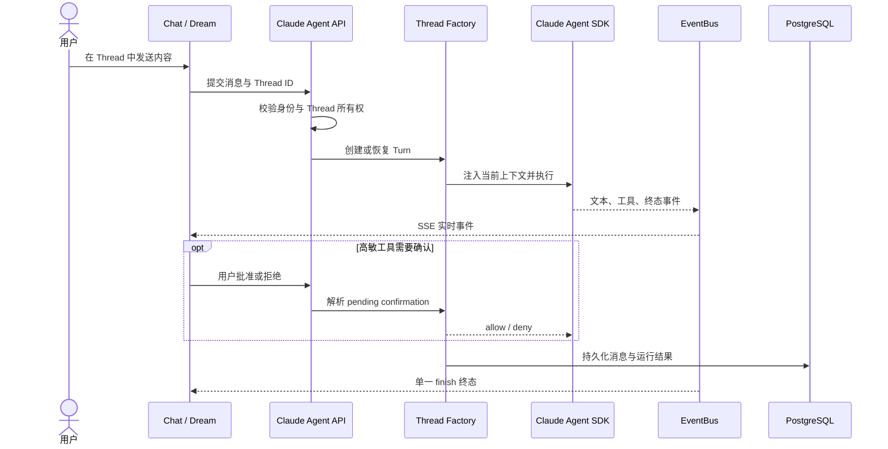

# Claude Agent 模块

Claude Agent 是 Chat 与 Dream 共用的执行运行时，负责按 Thread 组装上下文、调用 Claude Agent SDK、流式发布事件、处理工具确认，并把对话与运行状态持久化。它不拥有 Deck 定义、Story Project 或订阅计费真值。

## 核心概念定义

| 概念 | 定义 | 边界 |
|---|---|---|
| Thread | 用户可恢复的对话业务容器 | 持有消息和 Deck/Agent 上下文，不等于 SDK session |
| Turn | Thread 中一次用户输入到单一终态的执行 | 同 Thread 串行，不产生多个终态 |
| AgentRunState | 当前 Thread 的进程内运行状态 | 保存跨轮 intrinsic 与当轮 extrinsic 状态 |
| SDK Session | Claude Agent SDK 的可恢复执行会话 | 由服务端映射，不向浏览器暴露内部路径 |
| Workspace | Thread 隔离的文件与 Skill 目录 | 受 sandbox 与权限策略约束 |
| Tool confirmation | 高敏工具或运行时网络请求的用户授权 | 未确认时 fail closed；取消不执行工具 |
| NormalizedAgentEvent | Chat 与 Dream 共用的运行事件 | EventBus 持久/回放，HTTP 边界编码为 SSE |

## 业务交互时序图

## 当前设计入口

- [模块总览与 API](../claude-agent.md)
- [生命周期](../lifecycle/claude-agent-lifecycle.md)
- [上下文组装](./claude-agent-context-assembly.md)
- [权限策略](./claude-agent-permission-policy.md)
- [工具确认](./claude-agent-tool-confirmation-flow.md)
- [SSE 重连与 EventBus](./sse-reconnect-and-event-bus.md)
- [工作空间与沙箱](./claude-agent-workspace-sandbox.md)
- [Chat 历史搜索](./chat-history-search.md)
- [子智能体侧栏](./subagent-sidebar/prd.md)
