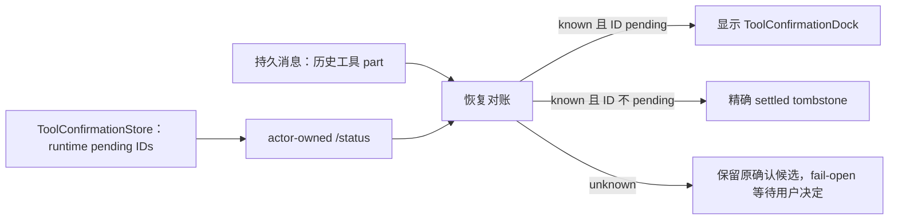

# Chat 非完全访问模式工具确认刷新恢复返工记录

> 日期：2026-08-07
> 上游：`claude-agent-tool-confirmation-flow.md`、`2026-08-06-chat-tool-confirmation-reconnect-recovery-record.md`
> 范围：通用 Chat `ToolConfirmationDock`；不修改 Dream Agent adapter，不使用 localStorage

## 0. 本轮规划前置器

### Optimized Prompt

诊断并修复通用 Chat 页面中 ToolConfirmationDock 已完成确认、但在 I&M 非完全访问（`tool_choice=manual`）时刷新或重新进入页面又从持久消息恢复的问题。必须区分“历史曾请求确认”和“runtime 当前仍待确认”两个事实，以 thread 所有权校验后的 runtime pending `tool_call_id` 为当前确认真相；采用 TDD 覆盖已解决刷新不再出现、真实 pending 刷新仍出现、unknown 观察不误隐藏、单次 dispatch、manual/auto 权限模式与 thread 隔离。不得通过开启完全访问、隐藏错误、localStorage 或直接吞掉所有历史工具 part 规避问题。

### Optional Enhancers

- 让 `/threads/{id}/status` 同时返回 pending ID 观察状态，供刷新和 SSE EOF 后恢复复用。
- 严格解析状态响应；旧后端或畸形响应必须降级为 `unknown`。
- 保存 Chromium 的“确认 → 刷新 → 不再出现”截图与 trace。

### 执行计划

1. 核对历史 message part、manual classifier、组件内 tombstone 与 runtime `ToolConfirmationStore`。
2. 裁决唯一恢复 owner 与 known/unknown 行为。
3. Red：后端状态缺少 pending snapshot；前端刷新无法从历史候选扣除已解决 ID。
4. Green：后端 actor-owned status 投影 + 前端历史/runtime reconciliation。
5. 独立评审、pytest、Playwright seam、TypeScript、ESLint 与 Chromium 刷新验收。

### 验收标准

- manual 模式下，已处理的历史 `input-available` 工具刷新后不再显示。
- manual 模式下，runtime 仍 pending 的精确 ID 刷新后继续显示。
- auto/完全访问的显式 approval、AskUser 与 sandbox network 逻辑不变。
- runtime 观察失败不把真实确认误标为已解决。
- 状态端点继续先校验 thread 所有权，不泄露其他 thread pending ID。
- 确认最多 dispatch 一次；普通权限/网络错误不被当成 settled。

## 1. 问题判定

问题

→ 用户在非完全访问模式同意工具后，刷新 Chat 页面，原 ToolConfirmationDock 再次出现；重复点击得到 `No pending confirmation for tool_call_id=...`。

现状证据

→ 历史 tool part 的确认分类入口见 `frontend/src/components/chat/toolConfirmation.ts:267-283`；runtime `ToolConfirmationStore.pending_ids()` 只返回尚未完成的 Future，见 `backend/claude_agent/tool_confirmation_store.py:184-189`。修复后的首次加载必须把二者对账后再把集合交给 `ChatPanel`，见 `frontend/src/components/chat/ChatView.tsx:665-674`。

根因

→ 持久消息只证明“曾经出现工具输入/审批事件”，不证明“现在仍等待”。上一轮只解决了当前页面与 SSE replay 的精确 tombstone，没有把 runtime pending truth 纳入首次历史恢复。

可选方案：

1. 非完全访问时忽略所有历史工具 part：会隐藏真实 pending，拒绝。
2. 把 settled ID 写 localStorage：不是跨浏览器/重新登录权威事实，拒绝。
3. 再次点击后把 409 当成功：只能事后收敛，仍会重复弹窗，作为防御保留但不是主修复。
4. actor-owned status 返回 runtime pending snapshot，历史恢复取候选与 pending 的差集建立 tombstone：采用。

最终决策

→ `ToolConfirmationStore` 唯一拥有“当前是否 pending”；持久消息拥有“历史展示内容”。首次加载和 SSE EOF 恢复严格依次读取 messages → status：只有 observation=`known` 时，历史中不在 runtime pending 集合内的 ID 才成为 settled；observation=`unknown` 时不猜测。前端本地集合只缓存此次权威对账和当前点击结果。

## 2. 恢复关系

这里的 fail-open 只指“不误隐藏确认 UI”，不表示工具自动获批；所有允许/拒绝仍必须走原 `/tool-confirm` 权限合同。

## 3. 实现与验证台账

### 3.1 Red

- 后端首次加入 runtime snapshot/status 断言时，定向测试有 5 个失败，证明原 `/status` 没有当前 pending ID 合同。
- 前端首次加入刷新恢复断言时，`deriveSettledToolCallIdsFromHistory` 与顺序加载 seam 尚不存在，测试失败。
- 第一版对 257 个有效 pending ID 截断为 256 个并仍返回 `known`；新增溢出测试失败，暴露“部分观察被误当完整观察”的风险。

### 3.2 Green

- Generic Chat runtime snapshot：非运行态返回 `known + empty`；运行态读取失败或超过 256 个有效 ID 返回 `unknown + empty`，避免错误 tombstone；见 `backend/claude_agent/thread_factory.py:547-610`。
- actor-owned 状态合同：先按用户校验 thread，再读取 runtime snapshot；见 `backend/routers/claude_agent.py:693-738`。
- 前端先加载历史再采样 runtime；严格解析响应，`unknown` 不产生 settled ID，`known` 只按精确差集产生 tombstone；见 `frontend/src/components/chat/toolConfirmation.ts:33-113`。
- 首次进入和 SSE EOF 后恢复共用上述对账；ChatPanel 挂载前完成首次对账，重连结果仍受 thread/reconnect/turn checkpoint 保护；见 `frontend/src/components/chat/ChatView.tsx:657-713`、`frontend/src/components/chat/ChatView.tsx:1149-1162`、`frontend/src/components/chat/ChatPanel.tsx:367-386`、`frontend/src/components/chat/ChatPanel.tsx:438-463`。
- runtime 精确拥有的 ID 即使恢复消息缺少 `approvalRequested` 仍显示；新 SSE ID 不在历史 tombstone 中，不被误抑制；见 `frontend/src/components/chat/toolConfirmation.ts:267-283`。

### 3.3 测试输出

| 验证 | 结果 |
|---|---|
| `backend/.venv/bin/pytest backend/tests/test_claude_agent_thread_factory.py backend/tests/test_server_claude_agent.py -q` | `108 passed, 16 warnings in 1.54s`；warnings 为既有 FastAPI `on_event` 弃用提示 |
| `npx playwright test src/components/chat/__tests__/ToolConfirmationRecovery.test.ts --reporter=line --workers=1` | `8 passed (871ms)` |
| `npx tsc -b` | 通过 |
| `npm run build` | 通过；仅有既有 dynamic-import/chunk-size warnings |
| scoped ESLint（全部 4 个改动前端文件） | 通过 |
| `git diff --check` | 通过 |

后端 snapshot、上限与所有权测试分别见 `backend/tests/test_claude_agent_thread_factory.py:721-791` 和 `backend/tests/test_server_claude_agent.py:647-751`；前端 manual、真实 pending、unknown、加载顺序、reconnect 与 typed 409 测试见 `frontend/src/components/chat/__tests__/ToolConfirmationRecovery.test.ts:29-205`。

### 3.4 独立评审

独立评审结论：批准，无 P0/P1/P2。评审重点核对 actor ownership、known/unknown、manual/auto、真实 pending、新 SSE ID、跨 thread checkpoint、typed stale 409 与 Dream 边界；未发现需要返工的问题。

### 3.5 Chromium 验收

在真实 Chromium 中挂载生产 `ChatView`/`ChatPanel`，以确定性 API fixture 执行：非完全访问配置 → runtime pending 显示确认框 → 点击同意且 POST 仅一次 → 浏览器刷新 → 相同历史 tool part 恢复、runtime 返回 `known + empty` → 确认框数量为 0；同时断言刷新请求顺序为 messages → status。

- 结果：`1 passed (3.1s)`。
- 截图：`frontend/output/playwright/chat-manual-tool-confirmation-refresh-2026-08-07/after-refresh.png`。
- trace：`frontend/output/playwright/chat-manual-tool-confirmation-refresh-2026-08-07/final-results/e2e-chat-tool-confirmation-a9159-led-after-a-browser-refresh/trace.zip`。
- 诚实边界：浏览器验收使用真实组件和 Chromium、mock runtime API；未让真实 Claude SDK 保持长时间 pending。runtime store 与 actor-owned route 由 108 个定向后端测试覆盖。

### 3.6 清理

- 浏览器进程由 Playwright 正常关闭；临时 QA spec 已删除。
- 未停止用户原有的 5173/8765 开发服务。
- 未修改 Dream adapter，未执行归档操作。

## 4. 边界

- 不改变完全访问开关的含义，不用开启完全访问规避 manual 缺陷。
- 不把 generic Chat pending 投影给 Dream Agent。
- 不把 thread、tool input 或确认内容写入 localStorage。
- 不修改数据库 DDL，不执行归档操作。
