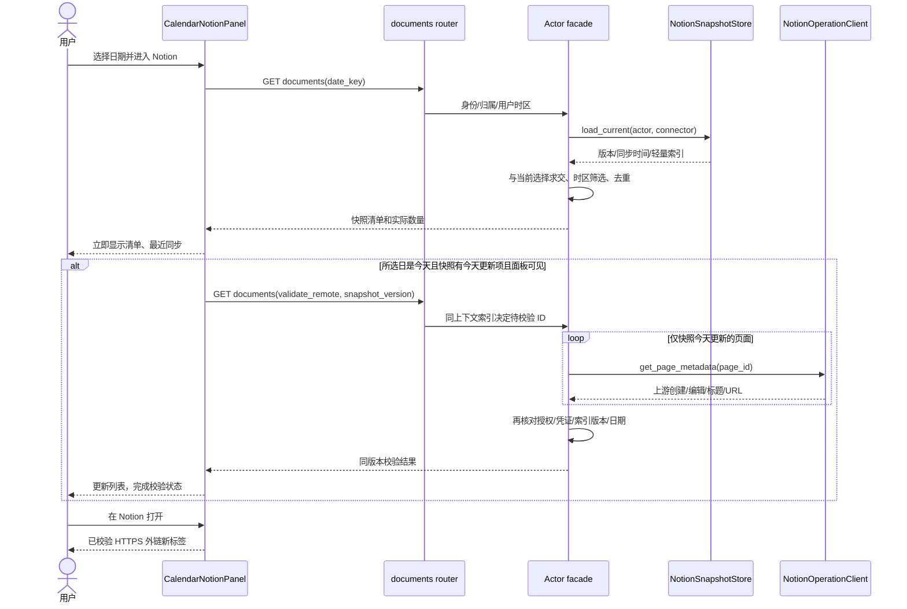
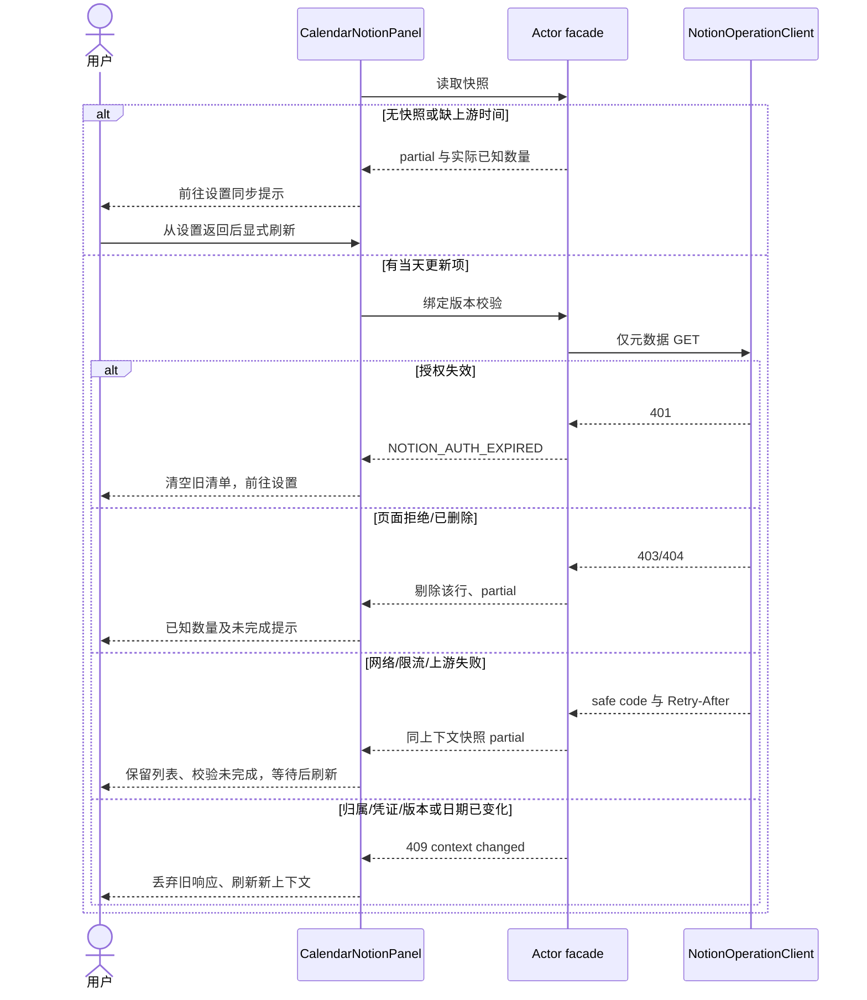
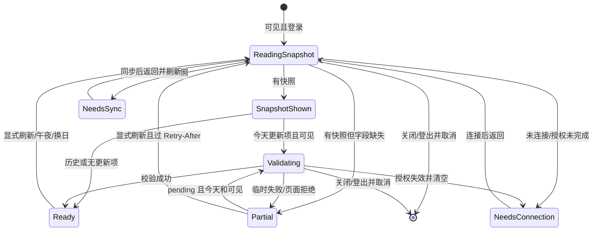

<!-- [Input] Calendar PRD、现有索引/同步/权限边界和用户快照优先要求。 -->
<!-- [Output] 快照显示、当天更新元数据校验与原互斥页签交互、时序和状态。 -->
<!-- [Pos] 正式交互设计正文；技能证据不替代业务图。 -->
<!-- [Sync] 2026-10-06: 取代 Search 每次扫描及非今天禁读；保存此前完整正文。 -->
<!-- [Sync] 2026-10-06: 明确已选数据库行的同步、索引持久化及旧索引恢复链路。 -->
# 日历右侧页签与 Notion 日期文档交互设计

## 1. 背景与问题

[现行 PRD](../../prd/calendar/calendar-right-panel-tabs-prd.md)按用户要求改为连接器快照优先，解决每次全量 Search 的长时间等待，并支持所选历史日期创建文档。此前交互细节完整保存在[历史稿](./calendar-right-panel-tabs-ui-design-pre-snapshot-20261006-history.md)，其 Search/非今天禁读规则已被取代。

## 2. 目标与边界

互斥页签、任务/日记/Chat 导航保持既有实现。Calendar 只消费当前选择与索引交集，不增加配置入口。历史只读创建日；今天读取创建和最近编辑，先显示快照，仅校验快照当天更新项。既有同步更新索引，新页面发现仍属于连接器同步，不承诺全集或历史编辑事件。

## 3. 概念与规则

快照版本和 `fetched_at` 表达最近成功同步，`observedAt` 为当前投影时间，不能混用。页面显示“最近同步”，校验状态独立。`createdOnDate/editedOnDate` 使用上游原始时间与所选日区间判断，缺字段为 null，缺标题用未命名。旧字段 `last_edited` 保留 Runtime 兼容，日历不从含糊别名或本地 updatedAt 筛选。

公开生产入口（2026-10-06 实现，技术验证见回执）：`GET /api/connectors/{connector_id}/notion/documents?date_key=...`。首次返回快照；同入口 `validate_remote=true&snapshot_version=...` 校验，仅由服务器索引选出今天更新项。旧 `/notion/today` 作为同一处理函数兼容路由，不保留 Search 业务分支。返回 coverage=connector_snapshot，snapshotVersion/snapshotFetchedAt、todayKey、verificationState（not_required/pending/complete/partial）、items/counts/partialReasons/retryAfter。无快照为 partial + snapshot_unavailable，缺字段为 metadata_missing，不是正常空列表。

第一次读无需远程 API 日期配置；第二阶段使用 `INK_NOTION_TODAY_API_VERSION`（现有名称保持）明确合同，经实际 CLI 请求头核对 2026-03-11。`NotionOperationClient.get_page_metadata` 仅新增元数据读取，仅调用 v1/pages/{id}，禁止 Markdown/blocks。校验 ID 与请求 ID 匹配，异步期间再核对归属/授权/凭证/索引版本和日期时区。上游归档/删除/拒绝访问的页面剔除；401 清空；临时错误保留同上下文结果并标记未完成，Retry-After 期间刷新禁用。URL 使用服务器精确 HTTPS host 白名单，默认包含官方 page.url 的 app.notion.com（见[Notion Page 文档](https://developers.notion.com/reference/page)），不开放任意子域、userinfo 或异常端口。只读结果不发布快照、修改 Admin、同步或扩大正文权限。metadata-only GET（包括既有同步新增的独立页面读取）统一要求服务器显式 API 日期，缺失时 fail closed，同步失败保留 LKG。整次校验复用现有 INK_NOTION_OPERATION_TIMEOUT_SECONDS 预算；429 停止后续调用。初次列表可同时 partial 与 pending，仍展示实际已知行。409 的 NOTION_CONTEXT_CHANGED（归属/选择/凭证）必须清空旧列表；NOTION_SNAPSHOT_CHANGED（版本）停止校验并提示刷新；NOTION_DATE_CONTEXT_CHANGED（午夜/时区）重新投影所选日期，不能提交旧校验。

## 4. 页面与交互

继续使用现有 paper/surface/text tokens、App 字体、IconFile/NotionMark。选中页签显示圆角背景、图标及名称，未选中保留可访问名称和 hover/focus tooltip。tablist 与 panel 关联、visible focus 2px 内边偏移、手动键盘激活；不重写任务状态机。既有 64rem/40rem 响应式断点、窄屏标题换行及内容滚动保持，页面骨架由 PRD 正文提供。

Notion 标题为“Notion 文档”，日期来自左月历。历史只显示“当日创建”组；今天显示创建/编辑组。列表先呈现快照及“最近同步”；后台校验时显示“正在校验今天更新的文档…”，列表保持可打开。首次加载只显示“正在读取连接器快照…”。缺快照/缺上游时间提示“请前往连接器同步以更新索引”；显示 Settings 入口，不自动同步。部分结果仅显示已知数量。刷新重新投影快照并可校验当天更新项，没有重复确认或远程扫描进度。

同日切栏保存局部数据、滚动、任务结果和安排输入，不重复读取；隐藏时不发起新的第二阶段请求。已开始请求可在后台结束，但不夺焦点/播报列表。关闭、登出、换日、时区或连接变动取消并清空对应旧状态；返回该日重新从本地索引读取。跨午夜保留选中日，按历史创建规则重新投影，不强行跳今天。

## 5. 正常业务时序

## 6. 异常与恢复时序

## 7. 交互状态图

## 8. 影响、接口与验收

执行模块：router 校验 OAuth/归属及偏好；facade 读取私有索引并做前后提交检查；today.py 负责日期/投影/只校验当天更新项；operations 提供 metadata-only GET；sync 保留上游字段并刷新选中独立页面元数据；前端保留快照再校验。Admin JSON DTO 可承载新增字段，无共享 schema 依赖。

数据库选择沿用 `resource_type=notion_database`：`select_resources` 保存选择后调用 `sync`，`build_canonical_snapshot` 对选中 data source 执行 `query_database` 全页查询，数据库 page 行同时进入 `index` 与对应 `database_pages`。`filter_snapshot_for_connector` 用仍选中的数据库关系允许这些页面进入日历候选，不需要把每行另存为独立选择。重启不重建持久化索引；缺原始时间的旧索引按异常图返回 partial，用户从“管理已挂载来源 → 立即同步”恢复，再返回日历刷新。测试必须经过实际 builder 和持久化，不能仅用预置快照证明数据库选择链路。

测试矩阵按 PRD §6；额外覆盖旧快照字段缺失、规范化 ID 去重、remote ID 不匹配、同步版本变化、取消选择、已有列表在慢校验期间可用，以及历史请求含 validate_remote 仍零远程调用。任务和日记全旅程继续调用公开生产入口及真实 DTO。隔离技术结果与真实账户业务验收分开报告。

[影响评估、独立评审与测试回执](../../exec/notion-calendar-snapshot-repair-20261006.md)记录门禁与实际命令；阶段文档不能宣称实现或验证完成。
