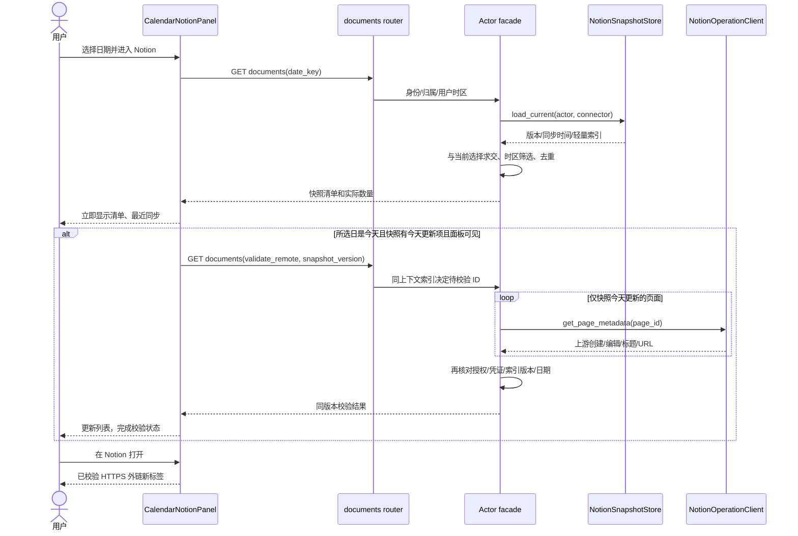
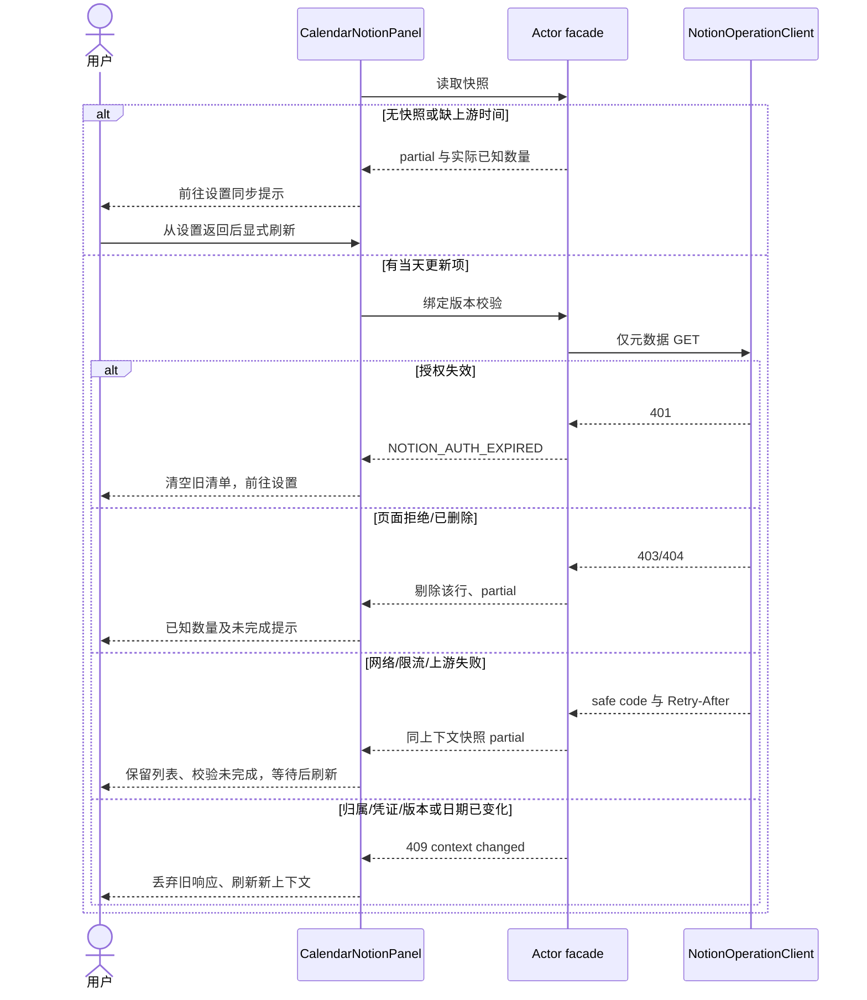
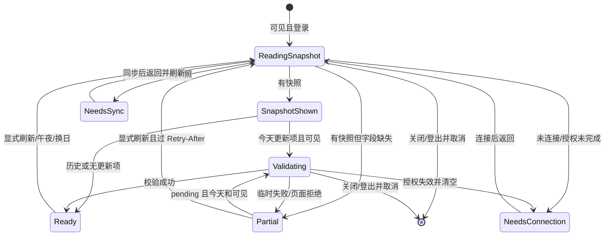

<!-- [Input] Calendar PRD、现有索引/同步/权限边界、快照优先要求与 UI Design v2.pdf 第5页。 -->
<!-- [Output] 快照与原互斥页签业务时序/状态，及右侧无边框浅纸面视觉规格和验收。 -->
<!-- [Pos] 正式交互设计正文；技能证据不替代业务图。 -->
<!-- [Sync] 2026-10-06: 取代 Search 每次扫描及非今天禁读；保存此前完整正文。 -->
<!-- [Sync] 2026-10-06: 明确已选数据库行的同步、索引持久化及旧索引恢复链路。 -->
<!-- [Sync] 2026-10-06: 连续浅纸、留白/文字层级及原响应式滚动已按独立评审落地，实际回执归本轮 exec；原三幅业务图保留。 -->
<!-- [Sync] 2026-10-06: 日记删除标签不收缩/不折行，保留原字号和命中区；实际渲染行矩形纳入视觉回归。 -->
# 日历右侧页签与 Notion 日期文档交互设计

## 1. 背景与问题

[现行 PRD](../../prd/calendar/calendar-right-panel-tabs-prd.md)按用户要求改为连接器快照优先，解决每次全量 Search 的长时间等待，并支持所选历史日期创建文档。此前交互细节完整保存在[历史稿](./calendar-right-panel-tabs-ui-design-pre-snapshot-20261006-history.md)，其 Search/非今天禁读规则已被取代。

用户随后要求右侧栏目符合 [UI Design v2.pdf](../../prd/Ink%20%26%20Memory%20UI%20Design%20v2.pdf) 第5页 §5.4：轻纸面、多留白、普通内容无卡片。右侧原大圆角、外框/阴影、未选页签实底与日记条目卡片需要调整。[此次视觉修改前全文](./calendar-right-panel-tabs-ui-design-pre-borderless-20261006-history.md)按字节保存；原业务正常、异常、状态图原文保持。

## 2. 目标与边界

互斥页签、任务/日记/Chat 导航保持既有实现。Calendar 只消费当前选择与索引交集，不增加配置入口。历史只读创建日；今天读取创建和最近编辑，先显示快照，仅校验快照当天更新项。既有同步更新索引，新页面发现仍属于连接器同步，不承诺全集或历史编辑事件。

视觉仅修改现有 `CalendarPopup.css` 的右侧 workspace、tabs、section、普通行与 RESULT 装饰分隔线；复用 React DOM、Tokens、字体、图标、断点及状态 owner。左月历、功能输入/按钮、tooltip/菜单和独立编辑/历史 Modal 保持。无需 Tailwind、Font Awesome、外部字体/CDN、新原型应用或新增组件。本稿视觉规则已通过[独立评审](../../exec/calendar-borderless-ui-design-review-20261006.md)并由现有 CSS 落地；[本轮 exec](../../exec/calendar-borderless-ui-20261006.md)记录代码与实际验证范围。

## 3. 概念与规则

快照版本和 `fetched_at` 表达最近成功同步，`observedAt` 为当前投影时间，不能混用。页面显示“最近同步”，校验状态独立。`createdOnDate/editedOnDate` 使用上游原始时间与所选日区间判断，缺字段为 null，缺标题用未命名。旧字段 `last_edited` 保留 Runtime 兼容，日历不从含糊别名或本地 updatedAt 筛选。

公开生产入口（2026-10-06 实现，技术验证见回执）：`GET /api/connectors/{connector_id}/notion/documents?date_key=...`。首次返回快照；同入口 `validate_remote=true&snapshot_version=...` 校验，仅由服务器索引选出今天更新项。旧 `/notion/today` 作为同一处理函数兼容路由，不保留 Search 业务分支。返回 coverage=connector_snapshot，snapshotVersion/snapshotFetchedAt、todayKey、verificationState（not_required/pending/complete/partial）、items/counts/partialReasons/retryAfter。无快照为 partial + snapshot_unavailable，缺字段为 metadata_missing，不是正常空列表。

第一次读无需远程 API 日期配置；第二阶段使用 `INK_NOTION_TODAY_API_VERSION`（现有名称保持）明确合同，经实际 CLI 请求头核对 2026-03-11。`NotionOperationClient.get_page_metadata` 仅新增元数据读取，仅调用 v1/pages/{id}，禁止 Markdown/blocks。校验 ID 与请求 ID 匹配，异步期间再核对归属/授权/凭证/索引版本和日期时区。上游归档/删除/拒绝访问的页面剔除；401 清空；临时错误保留同上下文结果并标记未完成，Retry-After 期间刷新禁用。URL 使用服务器精确 HTTPS host 白名单，默认包含官方 page.url 的 app.notion.com（见[Notion Page 文档](https://developers.notion.com/reference/page)），不开放任意子域、userinfo 或异常端口。只读结果不发布快照、修改 Admin、同步或扩大正文权限。metadata-only GET（包括既有同步新增的独立页面读取）统一要求服务器显式 API 日期，缺失时 fail closed，同步失败保留 LKG。整次校验复用现有 INK_NOTION_OPERATION_TIMEOUT_SECONDS 预算；429 停止后续调用。初次列表可同时 partial 与 pending，仍展示实际已知行。409 的 NOTION_CONTEXT_CHANGED（归属/选择/凭证）必须清空旧列表；NOTION_SNAPSHOT_CHANGED（版本）停止校验并提示刷新；NOTION_DATE_CONTEXT_CHANGED（午夜/时区）重新投影所选日期，不能提交旧校验。

## 4. 页面与交互

继续使用现有 paper/surface/text tokens、App 字体、IconFile/NotionMark。选中页签显示圆角浅底、图标及名称，未选中透明图标且保留可访问名称和 hover/focus tooltip。tablist 与 panel 关联、visible focus 2px outline 与现有 inset -3px、手动键盘激活；不重写任务状态机。页面骨架由 PRD 正文直接提供。

### 4.1 视觉与 CSS 映射

| 区域 / selector | 正常态与留白规格 | 状态与保留边界 |
| --- | --- | --- |
| `__workspace` | 透明布局容器，gap=0，border/radius/box-shadow=0；高度与原布局约束不变 | 不新增容器组件或状态；左月历不匹配这些覆盖规则 |
| `__tabs` 与当前 `__section` | 相接的 opaque `--color-bg-paper` 平面；两处 border/radius/box-shadow=0，无透明缝隙；不以外框或大圆角表达整体范围 | 未选 tab 与焦点有确定背景；两个原 media 断点的 section 阴影/圆角也必须去除 |
| `__tabs [role='tab']` | 未选 transparent、无 border/shadow；沿用 .82rem/700、2.75rem 最小命中区与原图标 | selected 使用 `--color-bg-active` 圆角浅底及 primary 文字；未选 hover 使用 `--color-bg-hover`，selected hover 维持 active；不位移、不加阴影 |
| tabs / heading / body 横向对齐 | >40rem 同为 1.5rem 水平内距；<=40rem 同为 1rem。tabs 上/下内距 .75/.5rem；以内部留白代替 workspace gap | 不改变原 Modal 视口外围留白和左月历尺寸；tooltip 仍固定定位并受视口约束 |
| `__section-heading` / `__card-header` | 无 border-bottom，顶部 1rem；主标题 1.1rem、原标题字体与 primary 色；计数/状态 .78rem secondary 色 | 原刷新、数量、注意事项按钮、完整文案与 aria-live 保留；长标题/状态允许换行，header 可自然增高 |
| `__card-body` | 上内距 1rem，横向与 header 对齐，下内距沿用原值；不新增内嵌卡片 | 任务、日记、Notion 原条件渲染与恢复入口保持 |
| `__task-list` / `__task` / `__undo-row` | 普通行透明、无外框/静态阴影/装饰分隔线；行距 .75rem，保留已有行内 padding，避免另加大块留白 | 最终现有任务标题 .94rem、副文字 .77rem 沿用；状态图标自身描线、edit/more/撤销与禁用逻辑保留，hover/focus-within 可用轻 hover 底 |
| `__diary-list` / `__diary` / `__diary--current` | 普通行透明，无外框、圆角卡片轮廓或阴影；当前项使用轻 active 底及原当前文字标记，不用整行成功色描边 | 时间 .75rem secondary 色、标题原字重与打开/删除入口保持；长标题仍省略，`__diary-delete` flex:0 0 auto/nowrap 保持标签单行，原字号、命中区、危险 hover、当前标记不变 |
| `__notion-group h4/ul/li` / `__notion-meta` | 分组标题 .94rem primary 色，组间 1.5rem、标题到列表 .75rem、页面行之间 .75rem；透明行、无组/行卡片；时间 .77rem secondary 色 | 创建/编辑组、双标识、计数、标题换行、URL 反馈和外链行为不变 |
| `__task-result` header/footer | 删除纯装饰 border-bottom/top，以原 padding 和留白分隔；原结果内层 scroll 不变 | 返回、精确结果、时间、Thread 按钮及其功能边界保留；不是修改独立历史 Modal |
| 输入、按钮、状态与浮层 | 原功能输入边界、主次/危险按钮、错误反馈、tooltip/menu/Modal 识别保持；不新增状态卡片或确认 | 不能把全部 border/outline 清零；去装饰的 selector 必须限定右侧普通内容，避免误伤 editor/history Portal |

### 4.2 响应式、滚动与 owner

1440px 继续原左右结构：左月历原尺寸，右侧当前 section 独立滚动，tabs 在其滚动范围外；heading 保持 section 内正常流，不新增 sticky。`@media (max-width: 64rem)` 已使 1024px 进入上下堆叠：原 `.calendar-popup` 整体滚动，workspace 高度 auto，section 高度 auto / overflow visible，tabs 继续 sticky top:0，并使用 opaque paper 而非未知遮罩背景。430/390px 沿用原 40rem 规则和外围留白，只收紧右侧水平内距到 1rem；不缩小或重绘月历，不隐藏状态/操作、不扩大视口。

同日各栏滚动仍由 CalendarPopup 原 refs 保存；LIST/RESULT、安排输入、已读取结果保持。任务 RESULT 内层滚动及编辑/历史 Modal 原滚动、Portal 和焦点陷阱保持。隐藏面板继续 hidden/inert，不新增查询、轮询或可见 Portal。

### 4.3 主题、焦点与微反馈

只使用既有 `--color-bg-paper`、`--color-bg-hover`、`--color-bg-active`、`--color-text-primary/secondary`、`--color-border-focus` 及原状态/操作 Tokens。浅、深、系统主题均由现有 tokens.css 提供 opaque paper；hover/active 为 alpha 值，须先与实际纸底合成再测文字/焦点对比度，不能取透明 RGB 伪造比值。透明未选 tab 不直接落在未知壁纸/遮罩上。

保留现有 focus-visible outline，tab 的 inset -3px 不被滚动裁切；普通行与输入的可见焦点不能被无边框规则覆盖。保留原鼠标/键盘 tooltip。微反馈只用现有轻 hover/active，不引入 scale、漂浮、入场位移、额外 keyframes 或闪烁；原 reduced-motion 规则保持。

### 4.4 视觉与回归验收

| 验收组合 | 必须核对的实际证据 |
| --- | --- |
| tasks / diary / Notion，1440/1024/430/390px，浅/深主题 | 右侧 tabs/section 无 border/shadow/大圆角；未选 tab 透明、连续 paper 承载；header/普通行/RESULT 装饰线为无；左月历及原 Modal 原样 |
| normal/hover/selected/focus，浅/深/系统主题 | actual computed style 与实际背景合成后的文字/焦点对比；selected/hover 不位移；可见 focus、鼠标/键盘 tooltip 无裁切或视口溢出 |
| 长内容、长标题/状态、三个栏目同日往返 | 原桌面 section、窄屏 Calendar 外层和 RESULT/Modal 内层滚动 owner 不变；滚动和草稿/LIST/RESULT 保留；操作可触达 |
| 原三个完整 E2E specs | 任务安排/编辑成功失败冲突/运行/历史分页/准确结果/Thread/暂停恢复/删除撤销，日记打开/返回/当前/删除，Notion 快照/校验/异常/并发保持；复用公开生产入口及真实 DTO |

视觉断言区分右侧与左月历的原 border/shadow；三份完整旅程保留，不以截图或单组件检查替代。设计门禁已通过，代码与实际验证回执见[本轮执行记录](../../exec/calendar-borderless-ui-20261006.md)；文档检查、截图复核与资源清理结论同样以实际回执为准。

### 4.5 原业务交互（不变）

Notion 标题为“Notion 文档”，日期来自左月历。历史只显示“当日创建”组；今天显示创建/编辑组。列表先呈现快照及“最近同步”；后台校验时显示“正在校验今天更新的文档…”，列表保持可打开。首次加载只显示“正在读取连接器快照…”。缺快照/缺上游时间提示“请前往连接器同步以更新索引”；显示 Settings 入口，不自动同步。部分结果仅显示已知数量。刷新重新投影快照并可校验当天更新项，没有重复确认或远程扫描进度。

同日切栏保存局部数据、滚动、任务结果和安排输入，不重复读取；隐藏时不发起新的第二阶段请求。已开始请求可在后台结束，但不夺焦点/播报列表。关闭、登出、换日、时区或连接变动取消并清空对应旧状态；返回该日重新从本地索引读取。跨午夜保留选中日，按历史创建规则重新投影，不强行跳今天。

## 5. 正常业务时序

## 6. 异常与恢复时序

## 7. 交互状态图

## 8. 影响、接口与验收

执行模块：router 校验 OAuth/归属及偏好；facade 读取私有索引并做前后提交检查；today.py 负责日期/投影/只校验当天更新项；operations 提供 metadata-only GET；sync 保留上游字段并刷新选中独立页面元数据；前端保留快照再校验。Admin JSON DTO 可承载新增字段，无共享 schema 依赖。

数据库选择沿用 `resource_type=notion_database`：`select_resources` 保存选择后调用 `sync`，`build_canonical_snapshot` 对选中 data source 执行 `query_database` 全页查询，数据库 page 行同时进入 `index` 与对应 `database_pages`。`filter_snapshot_for_connector` 用仍选中的数据库关系允许这些页面进入日历候选，不需要把每行另存为独立选择。重启不重建持久化索引；缺原始时间的旧索引按异常图返回 partial，用户从“管理已挂载来源 → 立即同步”恢复，再返回日历刷新。测试必须经过实际 builder 和持久化，不能仅用预置快照证明数据库选择链路。

测试矩阵按 PRD §6；额外覆盖旧快照字段缺失、规范化 ID 去重、remote ID 不匹配、同步版本变化、取消选择、已有列表在慢校验期间可用，以及历史请求含 validate_remote 仍零远程调用。任务和日记全旅程继续调用公开生产入口及真实 DTO。隔离技术结果与真实账户业务验收分开报告。

[影响评估、独立评审与测试回执](../../exec/notion-calendar-snapshot-repair-20261006.md)记录门禁与实际命令；阶段文档不能宣称实现或验证完成。
