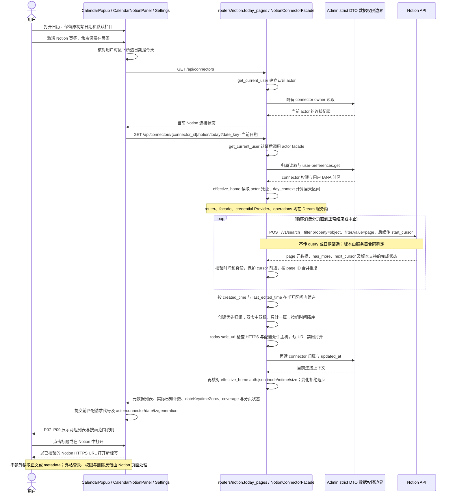
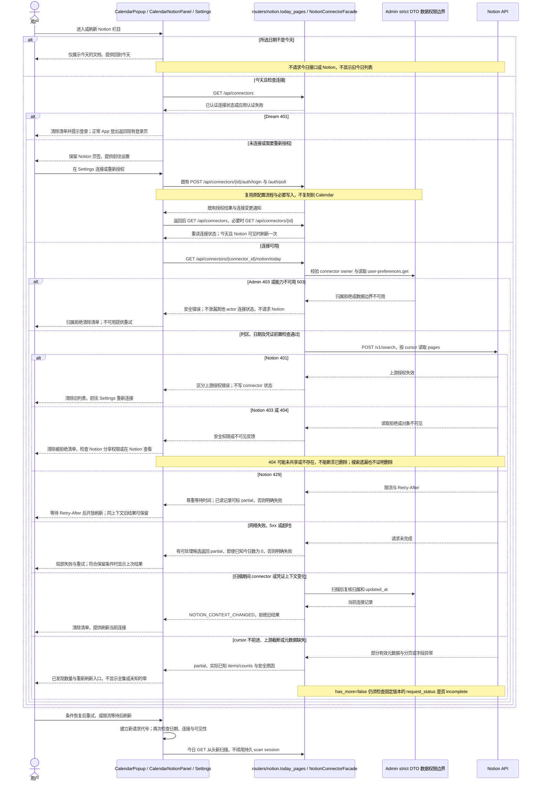
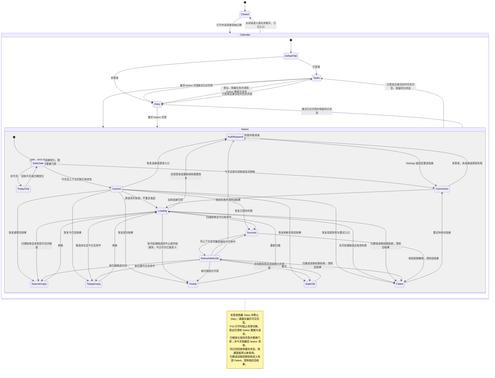

<!-- [Sync] 2026-10-06: current Search-scope implementation, public route/module names, credential recheck, recovery diagrams and completed tab/metadata-action contrast validation; preserve preimplementation history. -->
<!-- [Sync] 2026-10-06: clarify the captured API date, operator configuration adoption and safe 503 recovery without changing business/state diagrams. -->
<!-- [Input] 当前 Calendar/Chat/Notion 源码、现行产品合同、附件图标页签与四阶段设计产物。 -->
<!-- [Output] 日历右侧互斥页签的视觉、交互、业务时序/异常恢复/状态图、接口与验收规格。 -->
<!-- [Pos] docs/design/claude-agent 的现行增量交互设计；保留原任务、日记与 Settings 业务合同。 -->
<!-- [Sync] 2026-10-04: 仅设计文档；独立评审统一 URL 校验缺口、日期与身份状态边界，新接口未实现且严格全部今日文档仍阻塞。 -->

<!-- [Sync] 2026-10-05: PRD owns page skeletons in the calendar business module; this formal design directly contains Mermaid business and state diagrams. -->

# 日历右侧页签与 Notion 今日文档交互设计

> 2026-10-05 实施补充：用户已接受 Search 可发现的今日页面。服务器显式配置 API 日期，今日路径通过 `--notion-version` 传入本机已核对的 ntn 0.15.1；缺失配置明确失败。安全 URL 来源使用服务器配置，Calendar 不接受浏览器主机或凭证。实施前正文另存[阶段历史稿](./calendar-right-panel-tabs-ui-design-preimplementation-20261005-history.md)，当前业务/异常/状态图对应源码，本轮不声称 Search 可枚举授权全集。[实施及技术验证记录](../../exec/calendar-right-panel-tabs-implementation-20261005.md)负责报告实际完成状态。

## 1. 背景与问题

**推荐将右侧同时可见的任务、日记卡栈改为三个图标页签与一个当前栏目纸面：定时任务 / 日记 / Notion。** 保留左月历、透明弹窗画布和原任务、日记生产入口。Notion 列表只发现元数据、按用户时区筛选今天并打开 Notion，不自动同步正文或保存资源选择。

**用户已接受 Search 可发现的今日页面。** 当前实现包含互斥页签、上游时间、只读今日接口、安全 URL 与失败恢复；scan_complete 仍只代表当前搜索扫描结束。服务器必须配置 API 日期，本轮隔离技术自动化不表示真实 Notion 账户或正常服务配置已验收。

### 1.1 实施前证据与差距（2026-10-04）

| 实施前源码事实 | 位置与行为 | 设计处理 |
| --- | --- | --- |
| 右侧两个业务纸面同时渲染 | `CalendarPopup.tsx` 的 `calendar-popup__workspace-scroll`，任务与日记分别为 section | 改呈现归属，只显示一个栏目；保留原业务模块 |
| 任务纸面内部为 LIST/RESULT | `selectedResultTaskId` 决定结果视图；当前进入 RESULT 卸载任务列表 | 切栏目保留同日 LIST/RESULT 和已读结果，不扩展结果路由 |
| 编辑、历史由任务卡与共享 Modal 管理 | `ScheduledTaskCard` 持有编辑字段、revision、历史和 Modal 状态 | 保留 owner；编辑或历史 Modal 打开时背景不可操作 |
| RESULT 当前没有编辑、历史按钮 | 结果区包含返回与执行会话入口 | 返回 LIST 使用既有操作即可，不为旧文档描述增添按钮 |
| 任务 effect 仅依赖 `isAuthenticated`、所选日期和时区 | 认证布尔变化会重新读取/清空；不能据此证明两个已登录 actor 切换已被保护 | 新 Notion 请求与旧结果另按 actor 绑定，不把建议保护写成现状 |
| 弹窗初始日期可能是当前日记创建日 | `App.tsx` 传入 `initialDateKey` 与 `userTimezone` | 不强行改今天；非今天 Notion 只显示日期提示 |
| Chat 页签为内联按钮 | `ChatView.tsx` 的 `role="tablist"`，两项均有可见文字 | 复用选中表面、字体、图标与状态习惯；补本页键盘/面板关联，不声称已有公共 TabBar |
| Settings 有 Notion 字形与外链入口 | `ConnectorNotionDetailPage.tsx` 的局部 `NotionMark` 函数 | 字形可最小提取为共享图标；当前不能直接 import 为公共组件 |
| pages/databases 是上游发现，resources 是已选记录 | `backend/notion/factory.py`、`operations.py`、`routers/notion.py` | 今日元数据边界与选择、同步边界分开 |
| 上游创建时间未保留 | `normalize_page_item` 和前端 `NotionResourceOption` | 新今日 DTO 从原始 page 投影，不使用 sources 的 `updatedAt` |

源码事实、接口原名与官方链接集中在[本轮 PRD](../../prd/calendar/calendar-right-panel-tabs-prd.md)。任务和日记原有业务仍由[现行任务 PRD](../../prd/claude-agent/scheduled-task-diary-page-prd.md)及[原交互稿](./scheduled-task-diary-page-ui-design.md)定义；该稿顶部已索引历史原文。连接、资源选择和同步仍由[Notion 连接器合同](../notion-session/connector-interaction.md)负责。

### 1.2 附件采用方式

附件[原图](./calendar-right-panel-tabs-workflow-20261004/inputs/target_image.png)中的选中项有圆角背景、图标和名称，其他项主要显示图标。采用这三个视觉特征；真实名称固定为定时任务、日记、Notion。主题由项目明暗 token 决定，不复制示例的 Home 名称、背景色或图标。未选中图标始终有可访问名称，hover 与键盘焦点都有名称提示。

## 2. 目标与边界

1. 右侧一次只有一个可见 `tabpanel`，已登录栏目顺序固定为三项；未登录沿用现状隐藏任务入口，仅提供日记/Notion。保留左月历和现有关闭、日期导航、日记标记。
2. 保留安排未发送输入、任务 LIST/RESULT、精确结果消息、编辑、历史、立即运行、暂停/恢复、删除/撤销、执行 Thread 打开及日记打开/删除。
3. Notion 页签始终存在，未连接时沿用 Settings 唯一配置入口；读取只使用 actor 当前连接，不另建账号或工作区选择器。
4. 只有今天查询上游。时间使用项目用户 IANA 时区和 Notion page 原始创建/最新编辑字段；计数表达实际已知唯一文档。
5. 查询、刷新可重复执行，没有选择、同步、正文读取、导入、写回或配置更新副作用；外链直接去 Notion。
6. 所有失败反馈在 Notion 当前面板内恢复，不干扰日历、任务、日记。错误来源、权限撤销与旧结果规则明确。

本次交付生产 Calendar 组件、只读今日接口、相关回归测试与现行设计文档。四阶段设计材料保留为过程证据；实现复用现有 React 组件、字体和图标。实现范围不需要通用连接器框架、全文编辑器、Webhook、历史活动数据库、全文缓存、扫描任务、消息队列、同步调度、确认弹窗或 schema 变化。后续若发现真实合同缺口需要新 schema，必须先由 Admin Drizzle 发布前向 migration 与 capability。

### 2.1 当前范围决定

“文档”采用 Notion page，包含 Search 返回的数据库行页面；data source 容器、附件、评论、block 不计文档。不限定当前用户本人创建或编辑，不额外读取人员信息。沿用 Settings 的当前 Notion 连接规则；若历史连接记录有歧义，前往设置处理，不自动增加多账号产品。用户已经接受 Search 可发现范围；严格全集不属于本轮实施或验收范围。

## 3. 概念与规则

### 3.1 范围、连接、选择与同步

| 名称 | 程序定义 | 当前设计使用方式 |
| --- | --- | --- |
| 工作区资源 | Notion 工作区的所有对象 | 无全集承诺 |
| 授权可访问范围 | 有效凭证、Read content capability 与 Notion 页面分享权限允许的对象 | 上游权限边界，不能从连接成功推断每页可读 |
| Search 可发现页面 | 当前凭证实际搜索返回的 page | 候选范围，受索引延迟、遗漏及扫描期间变化影响 |
| 项目已选择资源 | Admin 中用户保存的选择集合 | 继续用于 Agent 正文读取与索引，不限制本栏目元数据发现 |
| 本地同步范围 | 成功索引与当前选择的交集 | 不替代发现范围或上游时间 |
| 扫描完成 | 本次分页正常结束且没有截断、cursor、元数据或请求异常 | 仍只是搜索扫描完成，不代表授权范围完整枚举 |

连接成功、已选择资源、同步成功、查询成功、今天有命中是独立状态。打开 Calendar 元数据列表不将页面纳入 Thread，不扩大 Agent 的已选正文读取权限。即使所有分页完成，也保留必要说明：“部分文档可能尚未显示，可刷新或在 Notion 查看。”不在页面展示 API 日期、CLI、内部 ID 或服务器路径。

### 3.2 日期、分组与排序

服务端从已认证 actor 的 Admin 用户偏好取得与 `App.userTimezone` 同一 IANA 时区，以一次 clock 确定当地今天 D。D 当地零点及下一日当地零点分别转 UTC 得 S、E，判断 **S ≤ 上游时间 < E**；不能用服务器时区、固定 UTC 偏移或 S 加 24 小时。缺失、非法、不可读时区明确失败，不静默代替。

| 组与标识 | 条件 | 行内时间与排序 |
| --- | --- | --- |
| 今天创建 | `created_time` 在区间内 | 创建当地时间降序；同时间按资源身份稳定排序 |
| 今天编辑 | `last_edited_time` 在区间内，且不在创建组 | 最近编辑当地时间降序；同时间按资源身份稳定排序 |
| 双命中 | 两字段都在区间内 | 只归创建组，显示“创建”“编辑”两标识；主时间为创建，补充最近编辑时间 |

身份使用 connector ID 与 page ID，标题/URL 不作身份。跨页重复按较新 `last_edited_time` 对应的完整元数据合并，只计一次；不可比较或冲突记录标记扫描变化/元数据缺失，不能任意覆盖。两组互斥，总计为实际已知唯一页面数之和。缺失、非法或无时区的时间不补“现在”，不能判定的记录不计今日结果且使本次为部分结果。`last_edited_time` 只表示当前最新编辑，不表示完整编辑历史、次数或当日全部编辑事件。

非今天只显示“Notion 栏目只展示今天的文档。”与“回到今天”，不请求上游、不显示旧今日清单或计数。回到今天更新左月历并保留 Notion 页签。跨午夜/时区变更时重新核对服务端 `dateKey/timeZone`，更新服务器今天/时区上下文后先重做日期门禁，保留用户原选日；原选日若已不是今天，显示日期提示并等待“回到今天”，不静默改月历。只有原选日仍为今天才重新请求，旧日期响应不能直接提交。

### 3.3 生命周期与状态保留

| 动作 | 页面行为 |
| --- | --- |
| 首次打开 | 采用 App 原初始日期；已登录提供三项并默认定时任务，未登录隐藏任务项、默认日记。默认选择仅适用于首次打开，键盘只遍历可见项，Notion 提供原登录提示 |
| 弹窗已开时登录/登出 | 登录只补任务入口，保留当前日记或 Notion；登出清除旧身份数据和请求，当前任务项消失则回日记。不强行使用首次打开的默认选择，也不新增登录弹窗 |
| 同日切栏目 | 保留各栏目滚动、安排输入、任务 LIST/RESULT 与已读结果；关闭锚定更多菜单；不触发自动重新查询 |
| 编辑/历史 Modal 打开 | 维持原焦点陷阱，背景月历与页签不可操作；字段、错误、revision 冲突及保存失败由原 owner 保留 |
| 关闭/取消原编辑 Modal | 沿用现状丢弃未提交编辑草稿，不新增确认；不得把切栏目实现为销毁正在编辑的 owner |
| 日期变化 | 保留当前页签；任务按新日读取并回 LIST，列表回顶部；日记按所选日；未发送安排输入保留；Notion清除前日期内容后执行日期门禁 |
| 弹窗关闭再开 | 重新挂载，恢复 App 原初始日期和默认栏目，重新读服务器状态；不建立跨次全局缓存 |
| 打开任务聊天或日记 | 原 App callback 导航并关闭 Calendar；不另造路由或编辑器 |

可以在现有 state owner 或已显示过的局部面板保留状态，不引入全局 store。隐藏面板不可读出、不可聚焦，不留可见 Portal，不发起新加载/轮询。正在执行的查询只按本次上下文提交到该面板保存状态；后台完成不得夺焦点或播报完整列表。任务 RESULT → LIST 保持原业务行为；同日切栏目保护的重点是结果选择及状态，不擅自重构任务状态机。

## 4. 页面信息架构与视觉规格

### 4.1 模块结构

| 编号 | 层级与内容 | 最小责任 |
| --- | --- | --- |
| P01 | 原 Calendar Modal | 遮罩、透明画布、关闭、滚动锁、焦点恢复 |
| P02 | 左月历；窄屏上方 | 原日期导航、选中日、日记标记 |
| P03 | 右栏顶的三个页签 | 唯一 active 栏目、独立 focused 项、提示与键盘 |
| P04 | P03 下的当前纸面 | 唯一可见 panel、栏目标题和内容滚动 |
| P05 | 定时任务 LIST/RESULT | 安排输入与原操作；结果正文保留原内部滚动 |
| P06 | 所选日日记 | 原打开、当前标记、删除 |
| P07 | Notion 面板头 | 今天标题、已知数、上次读取、刷新 |
| P08 | Notion 创建/编辑清单 | 互斥分组、去重、时间、直接外链 |
| P09 | 局部状态区 | 日期、连接、加载、失败与恢复 |
| P10 | 原编辑/历史 Modal | 覆盖 P01、独立表单和历史权限/焦点 |

### 4.2 桌面示意

```text
透明 Calendar 画布                                   [关闭]
┌ 月历纸面 P02 ─────────┐   P03 [◷ 定时任务] [▤] [N]
│ [上一月]  年月 [下一月]│   ┌ 当前纸面 P04 ─────────────────┐
│ 周一 … 周日           │   │ 定时任务               原计数 │
│ 日期格与原日记标记    │   ├──────────────────────────────┤
│                       │   │ P05 安排输入                 │
│ 原日期选择与滚动      │   │ LIST：原任务与操作           │
│                       │   │ 或 RESULT：返回、结果、会话  │
└───────────────────────┘   └──────────────────────────────┘

Notion 选中时：P03 [◷] [▤] [N Notion]
┌ 当前纸面 P04 ────────────────────────────────────────────┐
│ 今天的 Notion 文档               已发现 N 篇      [刷新] │
│ 上次读取：当地时间                                        │
├─────────────────────────────────────────────────────────┤
│ P09：部分文档可能尚未显示，可刷新或在 Notion 查看。        │
│ 今天创建（已发现 N 篇）                                   │
│ [图标] 标题 [创建] [编辑]                  [在 Notion 打开]│
│        创建 HH:mm · 最近编辑 HH:mm                       │
│ 今天编辑（已发现 N 篇）                                   │
│ [图标] 标题 [编辑]                         [在 Notion 打开]│
│        最近编辑 HH:mm                                    │
└─────────────────────────────────────────────────────────┘
```

示意里的 N/HH:mm 是响应占位，不是预置计数或固定日期。只有选中项显示名称，未选中 tooltip 为“定时任务”“日记”“Notion”；ASCII 图形最终替换为项目 SVG/现有字形。页签位于右栏顶端，不覆盖月历，不增加重复的所选日期总栏。

### 4.3 窄屏示意

```text
┌ 视口内 Calendar ───────────────[关闭] ┐
│ P02 月历纸面                          │
│ 年月导航、日期与原标记                │
├───────────────────────────────────────┤
│ P03 [◷] [▤] [N Notion]               │
├ 当前纸面 P04 ─────────────────────────┤
│ 今天的 Notion 文档              [刷新]│
│ 已发现 N 篇 · 上次读取：当地时间       │
│ P09 范围/失败反馈与恢复操作            │
│ 今天创建（已发现 N 篇）               │
│ [图标] 标题最多两行 [创建] [编辑]     │
│        创建 HH:mm · 最近编辑 HH:mm    │
│        [在 Notion 中打开]             │
│ 今天编辑（已发现 N 篇）…              │
└───────────────────────────────────────┘
```

沿用现有 `64rem`/`40rem` 布局断点与 Modal 视口边距，这些是已有响应式技术规格，不是产品限制。桌面延续现有左右 grid、纸面圆角/阴影和内边距；右栏标题与导航可达、当前内容独立滚动。窄屏按月历→页签→当前面板单列，页签在当前栏目区域滚动时粘附于顶部，切栏不要求先滚回导航，主 Modal 单向滚动，不再叠加第二个列表纵向滚动区域；任务结果保留原长正文容器并核对视口包含。容器 `min-width:0`，控制区可换行，按钮不越界；长标题在桌面省略、窄屏最多两行且保留完整可访问名称，长词可换行。

### 4.4 现有 Tokens 与尺寸

| 元素 | 表面、文字与边界 | 几何/排版规格 |
| --- | --- | --- |
| Modal/月历/当前纸面 | 原透明画布；`--color-bg-paper`、`--color-border-paper`、`--color-shadow-soft`、`--color-shadow-medium` | 延续 Calendar 现有桌面 24px、窄屏 20/18px 纸面圆角，不新建主题 |
| 选中页签 | `--color-bg-paper`，`--color-text-primary`，paper border 混合；hover 保持不透明 paper | 延续 Chat 胶囊圆角，功能字号约 `0.82rem`、字重 700、图标与文字间距约 `0.4rem` |
| 未选中页签 | 不透明 `--color-bg-surface-solid`，`--color-text-secondary`，hover `--color-bg-paper` | 图标约 `1rem`，触控区至少沿用关闭按钮 `2.75rem`，三个项固定顺序 |
| 焦点 | `--color-border-focus` | Calendar 2px outline 与 -3px offset，描边位于按钮内且不能裁切 |
| 列表正文与时间 | `--color-text-primary`、`--color-text-body`；时间 `--color-text-secondary` | 标题约 `0.94rem`，时间约 `0.77rem`，沿用任务行密度；状态标识可换行 |
| hover/分隔 | `--color-bg-hover`、`--color-border-paper` | 延续任务行轻表面/分隔，不为每行叠纸面阴影 |
| 局部失败/部分结果 | 现有 danger/warning token 与项目 alert 表面，正文 body | 文案+恢复按钮说明含义，颜色不作为唯一状态来源 |
| 打开/刷新 | `--color-action-primary`；外链 hover 保持颜色并显示下划线 | 复用现有 quiet/外链按钮与主操作色，保证纸面上的操作文字可读；无新增确认步骤 |

字号、间距及断点为与源码对齐的视觉规格；可随现有系统 token 调整，不进入业务 DTO。字体继承 App 当前本地 Excalifont/Xiaolai 与功能界面的既有 sans 规则，不引入 Google Fonts 或新 font stack。选中表面采用项目 Chat 的低对比表面，不复刻附件暗灰色；明暗主题切换直接由 token 生效。动效延续现有项目反馈，切栏无横向滑动、弹跳或人为加载延时；`prefers-reduced-motion` 沿用 Calendar 当前关闭过渡规则。

## 5. 页签和资源行交互

### 5.1 页签状态

| 状态 | 可见形式 | 操作与焦点 |
| --- | --- | --- |
| 选中 | 圆角背景、图标、完整名称；`aria-selected=true` | 再点不重复查询，不切回其他面板 |
| 未选中 | 图标为主，无可见名称；始终具完整可访问名称 | 点击激活，仅一个 panel 可见 |
| hover | hover token，未选中出现名称 tooltip | 不改变选中项，不发请求 |
| 键盘焦点 | 独立 outline；未选中同样显示 tooltip | 焦点可停在未选中项，不能把焦点当选中 |
| 切换 | 当前面板原子显示；隐藏其他面板 | 焦点保留页签，Tab 再进入当前面板，不跳到列表首行 |
| P10 打开 | 页签为背景内容，不可操作 | Modal 处理焦点与关闭；关闭后恢复原触发控件，缺失时当前面板标题/页签 |

`tablist` 名称为“日历栏目”，每项为 button `role=tab`，以稳定 `id/aria-controls` 关联 `tabpanel` 的 `aria-labelledby`。仅一个项进入普通 Tab 顺序。左右键移动焦点，Home/End 到当前可见首末项，Enter/Space 手动激活；未登录不渲染任务项，键盘不访问不存在的项；方向键不触发读取。图标 `aria-hidden`，视觉隐藏名称或 `aria-label` 提供完整名称；tooltip 同时支持鼠标与焦点，Escape 关闭，不能以 HTML title 作为唯一名称。隐藏面板不进入读屏与 Tab 顺序，保留挂载时用明确 hidden/inert 行为保证，而非只降低透明度。

### 5.2 Notion 行结构与打开

每行为图标、完整标题对应的外链、创建/编辑标识、该组当地时间、明确的“在 Notion 中打开”入口。两个打开入口指向同一服务端校验的 HTTPS Notion URL，在新标签打开，沿用 `noopener noreferrer`；读屏名称说明标题与新标签语义。图标优先安全 emoji，缺失或其他类型使用项目资源图标；不新增远程图像下载/代理。空白或缺标题显示“未命名文档”，page ID 不作为产品标题。

URL 缺失或未通过 `today.safe_url` 的 HTTPS/服务器精确主机/端口/userinfo 校验时，该行显示“暂时无法打开，可刷新重试”，打开入口不可用，其他可见行可用。今日 DTO 的 URL 为已校验字符串或 null；原 Settings 发现 DTO 保留原行为。不自行用 ID 拼地址、不允许用户指定主机，也不硬编码业务主机。点击外链不追加 page/blocks/fulltext 读取或权限预检。外站的登录、资源不可见、权限拒绝、删除由 Notion 目的地展示；Dream 无法从外链响应或 Search 缺行诊断删除。只有已有接口明确返回页级错误时，Dream 才呈现“此文档当前不可用，可能已移除或访问权限已变化”，只清除被拒绝记录，其他已知可见记录保留；404 不能断言删除。

### 5.3 数量呈现

聚合 GET 返回前，“正在读取今天的文档…”与 `aria-busy=true`，数量未知；不展示虚构 0、实时“已发现 N”、进度百分比或“正在读取第 X 页”。本方案无实时流或持久 scan session。返回后总计和两组数量只根据已接受的 items 去重计算，文案“已发现 N 篇”。空组可显示 0 仅当本次扫描正常结束且无无法判定记录；部分结果不把未知组计数写成最终 0。部分结果已知总数可以为 0，但必须与“尚未读取完整”并列，不能显示正常空结果。范围说明不使计数成为工作区全部数量。

## 6. 用户流程与全部状态反馈

### 6.1 首次、刷新与连接返回

1. 打开 Calendar 后保留原默认日期/栏目。用户激活 Notion，先核对今天，再读取现有 `GET /api/connectors` 与服务器有效连接状态；未连接只提供 Settings 入口。
2. 连接可用后调用今日 GET，首次加载计数未知；成功提交前再次核对当前请求上下文，显示两组、实际已知数与上次读取时间。
3. 显式刷新从头新扫描。相同 actor、connector、日期、时区且权限仍允许时保留旧行与滚动，头部显示“正在刷新”；成功以新响应原子替换，不拼接两次扫描。刷新中按钮不发重复请求，仍允许切栏目或关闭。
4. Settings 完成连接/重新授权后消费原 `RESOURCE_CONNECTORS_CHANGED_EVENT`，先重读 connector，只有今天且 Notion 当前可见时刷新一次。若 Settings 导航已卸载弹窗，再打开按初次流程；不改变设置导航框架或增加轮询。
5. 更改日期/时区/身份/连接/授权、关闭或发起新请求时取消失效请求并推进本地请求代号。响应提交匹配 actor、connector、date、tz、generation；取消失败也拒绝旧响应。快速 A→B→A 不能让第一轮 A 覆盖最后一轮 A。

### 6.2 状态文案、操作与恢复

| 状态/判定 | 界面与计数 | 可用操作与恢复 |
| --- | --- | --- |
| 未登录 | “登录后可连接 Notion 并查看今天的文档。”；无计数 | 原登录入口，日记等原可用功能保留 |
| 未连接 | “连接 Notion 后可查看今天的文档。”；保留页签，无计数 | “前往设置连接 Notion”，返回重新核对 |
| 连接/授权进行中 | “Notion 连接尚未完成。”；无计数 | “前往设置继续连接” |
| 有效授权失效 | “Notion 授权已失效，请重新连接。”；清除旧清单 | “前往设置重新连接”，成功后重新查询 |
| 连接正常、搜索无候选 | “当前连接尚未发现可访问文档。可以在 Notion 检查分享权限后刷新。” | 刷新/前往设置；不是断言授权范围完全为空，不要求先选择资源 |
| 初次加载或服务器仍处理分页 | “正在读取今天的文档…”；骨架/`aria-busy`，数量未知 | 可切栏/关闭；不提供假定分页完成数 |
| 候选存在、今日无命中 | “今天暂未发现新建或编辑的文档。”；正常结束时已知两组 0 | 刷新，保留搜索遗漏说明 |
| 加载成功 | 两组列表、当地时间、“已发现 N 篇”、上次读取 | 在 Notion 打开、刷新 |
| 分页中止/截断/元数据缺失 | “部分文档尚未读取，当前已发现 N 篇。”；无最终总量承诺 | “重新刷新”，新扫描；缺时间记录不补值 |
| 同上下文刷新失败、有可保留旧结果 | “刷新失败，仍显示上次读取的文档。”；标明旧读取时间 | 重试；不能将旧计数标成新成功 |
| 查询读取权限拒绝 | “当前连接没有权限读取这些文档。”；清除被拒绝清单，无完整计数 | 检查 Notion 分享与 Read content、前往设置；恢复后刷新 |
| 页级不可见/不存在/已删除的明确反馈 | “此文档当前不可用，可能已移除或访问权限已变化。” | 已有接口明确反馈才在 Dream 显示；否则 Notion 目的地展示；不新增预检，不由 Search 遗漏推断删除 |
| 打开 URL 缺失/无效 | 行内“暂时无法打开，可刷新重试”；打开不可用 | 刷新；其他行不受影响 |
| 网络失败、无本次结果 | “暂时无法读取 Notion 文档，请重试。”；数量未知 | 重试，其他栏目仍可用 |
| Notion 限流 | “Notion 请求较多，请稍后重试。”；有本次已知记录则 partial | 尊重上游 Retry-After 后开放重试；可显示服务端提供的等待提示，不定义产品配额 |
| Notion 5xx/超时/不可用 | “Notion 暂时无法响应，请稍后重试。” | 重试；旧结果符合上下文保留条件时加失败提示 |
| Admin/capability/连接设置不可用 | “暂时无法读取连接或日期设置，请重试。” | 上游请求前失败，重试；不改本地数据/默认时区 |
| 用户时区缺失或非法 | “无法读取日期设置，请重试。” | 重试与现有设置入口；其他栏目保留 |
| 日期不是今天 | “Notion 栏目只展示今天的文档。”；无今日列表/计数 | 回到今天，更新左月历后读取 |
| 应用会话失效（Dream 401） | 清除清单，使用原应用登录反馈 | 回原登录，不能错当 Notion 授权失效 |
| connector 归属拒绝 | 安全权限/不可用反馈，清除清单 | 返回当前可用连接/设置；不泄露另一 actor 标题或连接状态 |

未连接、读取失败、权限不足、搜索未发现与今日无命中绝不共用“暂无数据”。授权/归属撤销、应用登出、凭证上下文变化清除旧结果；网络、429、Admin/上游临时不可用才可保留同上下文且权限未撤销的旧结果。取得可处理候选但今日无已知命中，同时有截断/无法判定时，partial 的已知今日数可为 0，必须并列不完整提示；未取得任何可处理候选且请求中止才是明确失败，不能称正常空结果。失败只在本面板局部使用 alert；状态与计数用 polite live，隐藏面板或旧响应不宣告，不重复读出全列表。

## 7. 接口、权限与数据所有权

### 7.1 当前最小读取合同

**当前入口：`GET /api/connectors/{connector_id}/notion/today?date_key={当前日期}`。** 复用现有 connector router → actor facade → Admin 归属/偏好读取 → credential Provider → operations；不创建旁路控制通道。现有 `/pages`/`/databases` 发现方法可复用 driver/cursor 保护，`/resources` 和 sources 不能作为今日全集。

| 边界 | 输入、输出与失败处理 |
| --- | --- |
| 前端→Dream | 同源 Cookie 会话、当前 connector ID 与 date_key；不接受 token/user_id/任意区间/home/host |
| Dream→Admin | strict DTO 校验 actor 的 connector 归属与 `user-preferences.get`；不可用/能力缺失请求上游前 fail closed |
| Dream→Provider | `credential_store.effective_home(actor)` 的服务器有效凭证；禁止用户 home/workspace/ambient env 替代 |
| Dream→Notion | `POST /v1/search` 的真实 object filter 为 `{"property":"object","value":"page"}`，不传标题 query 或不存在的日期 filter；顺序 cursor |
| 返回上下文 | connectorId、dateKey、timeZone、intervalStart/End、observedAt |
| 返回文档 | pageId、title、url、createdTime、lastEditedTime、emoji/资源图标、group、createdToday/editedToday；无正文、人员档案或原始 opaque 对象 |
| 返回数量/覆盖 | 响应 items 的实际已知组/总计、候选页数量；`coverage=search_discoverable`、`paginationState=scan_complete/partial` 与安全 partialReason；未知不填 0 |
| 错误 | 明确区分 Dream 认证、Admin 归属/能力和 Notion 401/403/404/429/网络/5xx；保留安全 Retry-After，不泄露原 CLI 输出 |

Dream 一次 GET 顺序消费分页。复用不前进 cursor 拒绝，补 page ID 去重、字段校验和固定 API 版本的完成状态；分页超时或上游失败时，已取得可处理候选则返回 partial，今日 items 可以为 0 并明确只是已知下界；未取得任何可处理候选且请求失败则明确失败。刷新是新扫描，不增加客户端 cursor 通道、扫描表、实时流或恢复会话。今日路径通过 `NotionTodayError` 区分认证、权限、限流、配置与上游失败，router 只返回安全错误码、必要上下文与 Retry-After，不把 CLI stderr 传入页面。

`ntn` 已固定 `0.15.1`。今日 `NotionOperationClient` 从服务器 `INK_NOTION_TODAY_API_VERSION` 取得合法日期并显式 `--notion-version`，缺失/非法日期 fail closed；程序没有默认日期，也不修改旧同步路径。2026-10-06 隔离 HTTP 捕获确认该固定 CLI 默认与显式调用均发送 `2026-03-11`，配置模板和本机 env 因此显式采用该日期。已有 env 缺此键会在 Search 前返回 `NOTION_API_VERSION_UNCONFIGURED` 503；运营补键并重启所拥有的 Dream 后端后，前端通过原显式刷新入口重读，详见[修复回执](../../exec/notion-today-503-repair-20261006.md)。配置故障不要求用户重新授权，不扩大正文权限。测试检查公开恢复路径与真实 CLI 请求头，没有访问正常账户。所返回 `request_status` 不完整、异常 cursor、时间缺失或扫描变化产生 partial；`has_more=false` 不是授权范围全集。[官方 Search](https://developers.notion.com/reference/post-search)不支持日期 filter，[搜索限制](https://developers.notion.com/reference/search-optimizations-and-limitations)说明完整枚举与延迟限制。本轮不引入 source 分片扫描。

### 7.2 所有权与副作用

Admin 拥有 connector、选择、同步策略、用户偏好与持久业务数据；Dream 拥有本次元数据扫描、筛选和短期返回；Notion 决定上游授权与对象权限。只读今日 GET 不更新 connector/resources/snapshots/sync-policy、不推进 lastSyncedAt，不调用选择、sync、Markdown、blocks、正文或导入。Settings 授权仍走原配置写入，属于用户主动连接行为，不能由列表刷新隐式执行。元数据清单不变更 default、desired、effective、revision 或 Agent Read 范围。

## 8. 响应式与可访问性验收规格

宽屏核对左右月历/单栏目、独立滚动及长任务结果；现有两个断点附近核对换行、关闭按钮与 tooltip；窄屏和文字缩放核对控制区不溢出视口。触控不依赖 hover，选中项显示名称，所有图标始终可读出名称。CalendarPopup 用当前页签与 tooltip 的矩形计算固定位置，向视口内夹取坐标并在下方空间不足时置于上方；resize/容器 scroll 时重算，tooltip 不接收 pointer events。tooltip 留在视口内且不遮挡主要按钮；outline 不被 overflow 裁切。使用现有颜色后仍需验收文字和焦点对比度，不仅凭截图观感通过。

页签基础、选中及 hover 背景采用现有不透明 surface/paper token，键盘 focus 描边位于按钮内部，避免文字、图标或描边直接与弹窗遮罩及下层正文叠加。浏览器回归在明暗主题、1440px 和390px实际读取前景、背景和焦点样式，按[WCAG 2.2 文字对比度](https://www.w3.org/WAI/WCAG22/Understanding/contrast-minimum.html)核对小字、tooltip、Notion 刷新与打开操作文字不低于4.5:1，按[非文字对比度](https://www.w3.org/WAI/WCAG22/Understanding/non-text-contrast.html)核对可操作图标及焦点不低于3:1，并记录未经取整的比值；这是本组件的色彩验证，不表示全站 WCAG 认证。

键盘旅程为打开日历→Tab 到页签→左右/Home/End 移动→Enter/Space 激活→Tab 进入当前面板→触发原编辑/历史→关闭恢复焦点。切栏目不强行读出列表或重设焦点。读屏应读出“定时任务/日记/Notion，选中/未选中”及当前 panel 名称；隐藏 panel 不读出，数量变化 polite，不使用图标作为唯一名称。任务/日记原焦点和确认规则继续有效；本轮不新增确认。

## 9. 业务时序、交互与页面状态图

页面骨架、产品规则与验收由 [日历业务 PRD](../../prd/calendar/calendar-right-panel-tabs-prd.md)所有；以下三幅图直接位于本正式设计稿，读者无需打开技能阶段文件。参与者仅有用户、前端 Calendar/Settings、Dream、Admin 数据权限边界和 Notion API；router/facade/Provider/operations 是 Dream 内模块，不加入无关服务。新今日接口已在 `routers/notion.py:today_pages` 实现，Search 扫描完成与完整枚举不是同一结果。

### 9.1 正常业务时序图

**当前生产入口：`GET /api/connectors/{connector_id}/notion/today?date_key={当前日期}`。** 本图说明已接受的搜索可发现今日页面流程，不证明严格全部文档目标已满足。



### 9.2 异常与恢复业务时序图

未连接和重新授权沿用 Settings；分别处理 Dream 认证、Admin 归属/能力与 Notion 授权/权限/限流/网络失败。查看和刷新只读，错误恢复不自动同步正文、保存选择或导入资源。



### 9.3 页面交互与状态转换图

首次默认、页签切换、任务可见性、同日状态保留、日期门禁、加载、成功、两种空结果、partial、刷新旧结果与授权撤销按 §3、§6 的规则转换。P10 打开期间背景不可操作，关闭后恢复可见焦点。



三图与本稿状态表、PRD 业务规则和 R01–R14 同步维护。`partial` 可以显示已知今日 0 篇并列不完整提示，不能当作正常空结果；跨午夜保留原选日、重新判断是否今天，不静默修改左月历。原图保留在 [Stage 3](./calendar-right-panel-tabs-workflow-20261004/3_hierarchy_logic.md)作为阶段证据，正式业务图由本设计稿所有。

## 10. 验收、追踪与实施评审

完整“需求→设计→实现→测试”矩阵见[PRD §10](../../prd/calendar/calendar-right-panel-tabs-prd.md)。以下映射当前规格与实现边界；实际命令/结果由实施记录提供。

| 编号 | 本稿设计位置 | 当前实现责任 | 关键验收 |
| --- | --- | --- | --- |
| R01 | §4、§5.1 | Calendar 本地页签/单纸面布局 | 已登录三项，未登录仅日记/Notion；任意时刻唯一可见 panel，键盘只遍历可见项，左月历原行为 |
| R02 | §1.2、§4.4、§5.1 | 已有 SVG/token；Notion 字形最小提取 | 图标+选中名称，未选中 tooltip/可访问名称，明暗主题 |
| R03 | §3.3、P05/P06/P10 | 复用原 callback、卡、结果和 Modal | 安排不直接发送；结果精确 final message；全部原动作可达 |
| R04 | §3.3、§6.1 | 既有 owner/局部状态保留 | 同日滚动/结果/安排保留；编辑 Modal 不丢字段；换日/重开符合规则 |
| R05 | §3.2、§7 | Dream actor 偏好+clock 区间 | S 包含/E 排除，夏令时与跨午夜，无服务器默认代替 |
| R06 | §3.2、§6.2 | 日期门禁 | 非今天无上游请求或旧今日列表；回到今天同步月历 |
| R07 | §3.2、§5.2/5.3 | 上游 DTO/去重/分组 | 双命中只计一篇，重复分页稳定，缺时间不补现在 |
| R08 | §3.1、§7.2 | Admin owner/Provider/上游权限 | 另一 actor 连接无泄露；空选择可发现；Agent 正文范围不扩大 |
| R09 | §1、§5.3、§7.1 | coverage/partial/版本完成状态 | scan_complete 不是全集；Search 扫描不能承诺授权全集 |
| R10 | §6.2 | 局部安全错误及 driver 分类 | 所列全部状态不同文案/计数/恢复，Retry-After 生效 |
| R11 | §6.1、§7.2 | Abort+请求代号/上下文提交 | A→B→A 乱序与关闭拒绝旧响应，重复刷新无持久写/正文调用 |
| R12 | §5.2 | Settings 新标签打开；today.safe_url 校验 | 有效 URL 直接打开、缺/恶意 URL 不拼地址，不加预检/全文 |
| R13 | §2、§7.1 | 明确 API 日期与固定 CLI 合同 | 无额外 schema/queue/Webhook/全量历史系统 |
| R14 | 本稿头部与索引、§9–11 | 文档清单/历史/独立评审 | 路径、Mermaid、diff 检查有回执，不称真实业务验收 |

本轮测试聚焦上述生产入口/DTO 与交互边界；文档检查不替代 Notion 真资源、真实用户或真实模型验收，不运行无关 E2E/环境检查。当前任务/日记已有正确行为，以保留、文档一致和缺口回归为主，不制造业务重写。

### 10.1 当前实施范围和验证边界

- 用户已接受 Search 可发现范围，保留遗漏提示与刷新；严格全集不属于本次验收。
- 已补 `created_time/last_edited_time`、今日 DTO/GET、HTTPS/配置主机、去重/partial、安全错误/Retry-After、服务器 API 日期与扫描完成合同。
- 页签保留原任务/日记 owner，隐藏内容暂停新读取/轮询；共享 Modal 过滤 hidden/inert 焦点。没有 schema、控制通道或 Agent 生命周期变化。
- 正常 App 未登录时显示登录页，不提供 Calendar 入口。Calendar 自身未登录默认日记/弹窗内登录保留栏目规则，以生产组件及显式 auth 投影 DI 技术测试验证；完整 App 登出旅程验证原登录 gate 与迟到结果清除，不改 App 权限或新增匿名入口。
- 最后源码的完整39项浏览器旅程与37项后端合同通过，静态检查和构建退出码均为0。明暗1440/390下实际页签、tooltip、焦点、刷新与外链文字比值通过；390×844的125%文字测量无水平溢出且入口可达。文字缩放只覆盖本组件和该比例，不宣称全站或200%验收；真实Notion账户与正常服务未执行。
- [实施记录](../../exec/calendar-right-panel-tabs-implementation-20261005.md)区分接口/组件/完整页面/文档技术结果。原[设计评审](../../exec/calendar-right-panel-tabs-design-review-20261004.md)保留当时缺口结论，不覆盖为验收结果。

## 11. 交付与验证入口

- [现行 PRD](../../prd/calendar/calendar-right-panel-tabs-prd.md)：事实、官方 API、业务规则与全追踪矩阵。
- [四阶段目录](./calendar-right-panel-tabs-workflow-20261004/.folder.md)：原始输入、产品、结构、流程与本阶段记录。
- [独立设计评审](../../exec/calendar-right-panel-tabs-design-review-20261004.md)：独立结论、缺口与阻塞。
- [文档验证回执](../../exec/calendar-right-panel-tabs-doc-validation-20261004.md)：实际命令、退出码、Markdown/引用路径/Mermaid/diff 检查；不是功能或真实业务验收。

原任务和连接器文档的完整旧稿已独立保存并索引；本稿只增加当前增量设计，没有删除历史功能、接口、测试或原型。本轮实施更新本稿和受影响目录合同，保持规则、状态文案、图表与验收一致。
