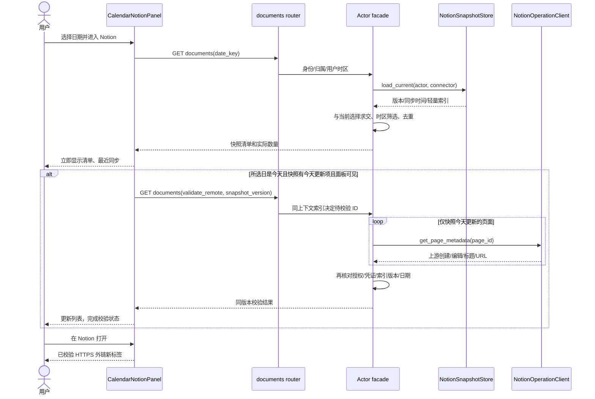
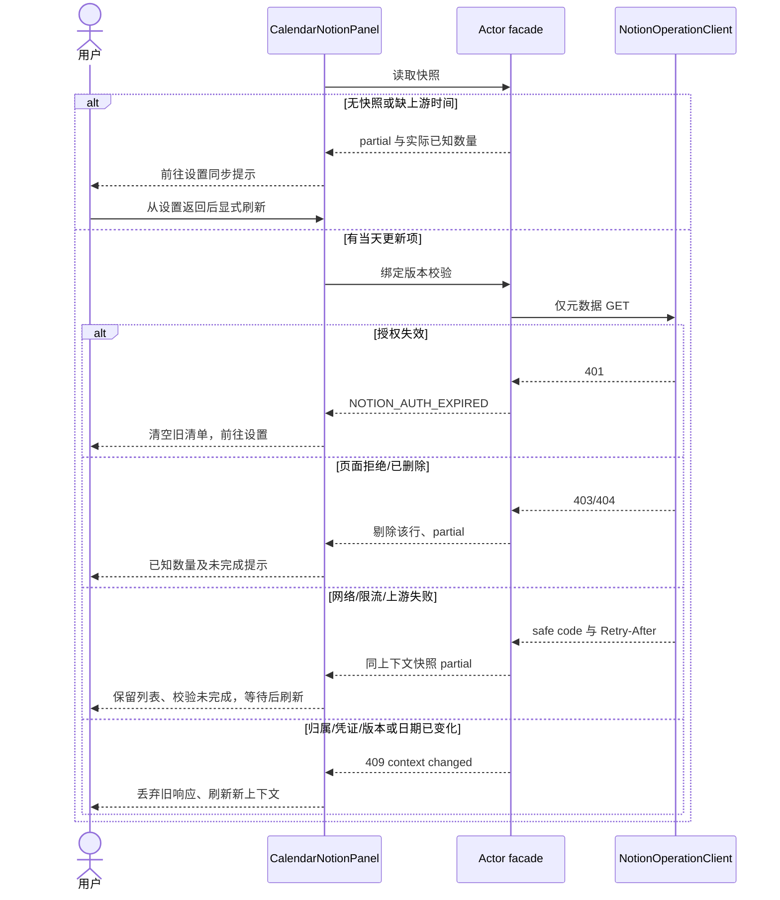
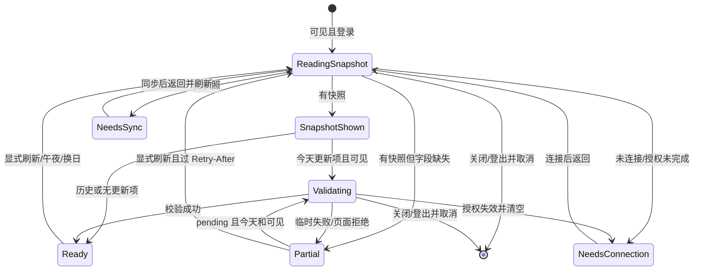

<!-- [Input] Calendar PRD、现有索引/同步/权限及UI v2.pdf，用户2026-10-07右侧浮空外壳/自然高度修正。 -->
<!-- [Output] 原快照/页签业务图及右侧唯一浮空外壳、内部留白、CSS自然高度/菜单与验收规格。 -->
<!-- [Pos] 正式交互设计正文；技能证据不替代业务图。 -->
<!-- [Sync] 2026-10-06: 取代 Search 每次扫描及非今天禁读；保存此前完整正文。 -->
<!-- [Sync] 2026-10-06: 明确已选数据库行的同步、索引持久化及旧索引恢复链路。 -->
<!-- [Sync] 2026-10-06: 连续浅纸、留白/文字层级及原响应式滚动已按独立评审落地，实际回执归本轮 exec；原三幅业务图保留。 -->
<!-- [Sync] 2026-10-06: 日记删除标签不收缩/不折行，保留原字号和命中区；实际渲染行矩形纳入视觉回归。 -->
<!-- [Sync] 2026-10-07: 保存修正前完整原文；单一圆角浮空workspace、自然高度与短高菜单方案待独立评审，原3幅业务图不变。 -->
<!-- [Sync] 2026-10-07: 独立评审通过且现有CSS落实外壳/高度/menu；实际验证待Luna，业务3图保留。 -->
# 日历右侧页签与 Notion 日期文档交互设计

## 1. 背景与问题

[现行 PRD](../../prd/calendar/calendar-right-panel-tabs-prd.md)按用户要求改为连接器快照优先，解决每次全量 Search 的长时间等待，并支持所选历史日期创建文档。此前交互细节完整保存在[历史稿](./calendar-right-panel-tabs-ui-design-pre-snapshot-20261006-history.md)，其 Search/非今天禁读规则已被取代。

用户先要求符合 [UI Design v2.pdf](../../prd/Ink%20%26%20Memory%20UI%20Design%20v2.pdf) 第5页 §5.4 的少面板、多留白。2026-10-07进一步明确：右侧外层仍为圆角浮空纸片，只有内部简约留白，左右不必等高。本稿据此修正2026-10-06平面外壳规则；[修正前完整原文](./calendar-right-panel-tabs-ui-design-pre-floating-20261007-history.md)按字节保存，[更早视觉前文](./calendar-right-panel-tabs-ui-design-pre-borderless-20261006-history.md)及当时评审/回执保留。原正常、异常、状态3幅业务图不变。

## 2. 目标与边界

互斥页签、任务/日记/Chat 导航保持既有实现。Calendar 只消费当前选择与索引交集，不增加配置入口。历史只读创建日；今天读取创建和最近编辑，先显示快照，仅校验快照当天更新项。既有同步更新索引，新页面发现仍属于连接器同步，不承诺全集或历史编辑事件。

视觉仅修正现有 `CalendarPopup.css` 的右侧 workspace外壳/高度及最后行菜单的布局空间，保留已实现内部留白。复用React DOM、Tokens、字体/图标/断点和状态owner；不改左月历CSS尺寸、原编辑/历史Modal、API/权限/缓存/文案，不新增组件、框架或测量JS。2026-10-06[评审](../../exec/calendar-borderless-ui-design-review-20261006.md)和[回执](../../exec/calendar-borderless-ui-20261006.md)仅证明当时范围；本次[影响与门禁](../../exec/calendar-floating-workspace-20261007.md)记录新规格，[本轮独立评审已通过](../../exec/calendar-floating-workspace-design-review-20261007.md)，现有CSS源码已实施，**实际验证待Luna回执**。

## 3. 概念与规则

快照版本和 `fetched_at` 表达最近成功同步，`observedAt` 为当前投影时间，不能混用。页面显示“最近同步”，校验状态独立。`createdOnDate/editedOnDate` 使用上游原始时间与所选日区间判断，缺字段为 null，缺标题用未命名。旧字段 `last_edited` 保留 Runtime 兼容，日历不从含糊别名或本地 updatedAt 筛选。

公开生产入口（2026-10-06 实现，技术验证见回执）：`GET /api/connectors/{connector_id}/notion/documents?date_key=...`。首次返回快照；同入口 `validate_remote=true&snapshot_version=...` 校验，仅由服务器索引选出今天更新项。旧 `/notion/today` 作为同一处理函数兼容路由，不保留 Search 业务分支。返回 coverage=connector_snapshot，snapshotVersion/snapshotFetchedAt、todayKey、verificationState（not_required/pending/complete/partial）、items/counts/partialReasons/retryAfter。无快照为 partial + snapshot_unavailable，缺字段为 metadata_missing，不是正常空列表。

第一次读无需远程 API 日期配置；第二阶段使用 `INK_NOTION_TODAY_API_VERSION`（现有名称保持）明确合同，经实际 CLI 请求头核对 2026-03-11。`NotionOperationClient.get_page_metadata` 仅新增元数据读取，仅调用 v1/pages/{id}，禁止 Markdown/blocks。校验 ID 与请求 ID 匹配，异步期间再核对归属/授权/凭证/索引版本和日期时区。上游归档/删除/拒绝访问的页面剔除；401 清空；临时错误保留同上下文结果并标记未完成，Retry-After 期间刷新禁用。URL 使用服务器精确 HTTPS host 白名单，默认包含官方 page.url 的 app.notion.com（见[Notion Page 文档](https://developers.notion.com/reference/page)），不开放任意子域、userinfo 或异常端口。只读结果不发布快照、修改 Admin、同步或扩大正文权限。metadata-only GET（包括既有同步新增的独立页面读取）统一要求服务器显式 API 日期，缺失时 fail closed，同步失败保留 LKG。整次校验复用现有 INK_NOTION_OPERATION_TIMEOUT_SECONDS 预算；429 停止后续调用。初次列表可同时 partial 与 pending，仍展示实际已知行。409 的 NOTION_CONTEXT_CHANGED（归属/选择/凭证）必须清空旧列表；NOTION_SNAPSHOT_CHANGED（版本）停止校验并提示刷新；NOTION_DATE_CONTEXT_CHANGED（午夜/时区）重新投影所选日期，不能提交旧校验。

## 4. 页面与交互

继续使用现有 paper/surface/text tokens、App 字体、IconFile/NotionMark。选中页签显示圆角浅底、图标及名称，未选中透明图标且保留可访问名称和 hover/focus tooltip。tablist 与 panel 关联、visible focus 2px outline 与现有 inset -3px、手动键盘激活；不重写任务状态机。页面骨架由 PRD 正文直接提供。

### 4.1 外壳、内部与 CSS 映射

| selector | 具体规格 | 边界与状态 |
| --- | --- | --- |
| `.calendar-popup` / `__calendar` | 桌面沿用原确定height/padding，两列；仅将desktop grid row明确为`minmax(0,1fr)`以提供可解析上限，左月历原height/尺寸/圆角/shadow保持 | <=64rem还原原自动grid rows与整体滚动，不强制两个区域等高 |
| `__workspace` | 唯一右侧opaque `--color-bg-paper`，border0/gap0/overflow visible/box-sizing border-box；height auto、align-self start、max-height100%；radius24px、shadow`0 8px 18px var(--color-shadow-soft), 0 18px 36px var(--color-shadow-medium)`（复用原左纸面值） | 不设固定大min-height；不使用outer overflow hidden/clip、contain paint、mask或transform剪掉focus/tooltip/menu；未选tab有确定纸底 |
| `__workspace-scroll` / 直接`__section` | scroll wrapper为column flex、`flex:0 1 auto; min-height:0`；active section也`flex:0 1 auto; min-height:0; height:auto; overflow:auto`，只它承担普通长列表桌面滚动 | 旧height100%两处移除，短/空自然结束；max-height由确定grid area传给workspace，再通过flex shrink分配减去tabs，不写固定tabs高度；hidden display none原规则保留 |
| `__tabs` / `__section` | 同色opaque paper，内部border/shadow0；tabs仅顶部两角、section仅底部两角继承workspace半径，接缝直角/gap0 | 圆角只完成同一外壳绘制，不是两个独立卡片；sticky时tabs保有opaque背景；不新增容器 |
| 内部标题、普通行、RESULT | 2026-10-06已实现留白/字号/字重、透明行、无装饰线/静态阴影保持；tabs/heading/body横向1.5rem，<=40rem1rem | 原安排输入、按钮、状态、当前标记与日记delete `flex:0 0 auto; nowrap`不变；RESULT精确消息原内层scroll保留 |
| `__more-wrap:has(__more-menu)` / `__more-menu`（本轮已通过独立裁决） | menu打开时wrap `display:contents`，同一个menu改position static、grid-column2/-1、justify-self end、width max-content/max-width100%、margin-top .25rem；原功能菜单border/shadow/按钮字号/命中区保留 | menu参与原task下方实际高度，关闭不留空间；不把菜单Portal迁出或复制内容，不加菜单状态/高度常量；DOM结构与refs/contains、原键盘和操作保持 |
| <=64rem（包括1024px） | workspace radius20px，shadow`0 6px 14px soft, 0 10px 20px medium`；height auto/max-height none；scroll wrapper flex none/display block/padding-bottom0；section height auto/overflow visible | 原Calendar整体overflow auto、tabs sticky top0；`.calendar-popup`画布padding-bottom2.25rem（36px），side沿用1.25rem（20px），保障外壳阴影末端 |
| <=40rem（430/390px） | workspace radius18px，shadow`0 4px 10px soft, 0 8px 16px medium`；同样自然高度/整体滚动 | 原画布side1rem（16px），padding-bottom1.75rem（28px）；不缩小左月历或原外层Modal，不以workspace-scroll尾部垫片隔开底角 |

右侧24/20/18px半径及shadow值来自既有左paper断点，不添加主题色常量。可用仅组件内`--calendar-popup-paper-radius`统一workspace/tabs/section角值，仍由现有CSS断点所有，不扩展通用Token系统。

### 4.2 自然高度与滚动传递

桌面Modal和Calendar当前确定高度、原2.25rem侧边/3.5rem底部留白保持。右workspace height auto、max-height100%解析到确定grid row，内部scroll wrapper与section允许min-height0/flex-shrink1：短内容按max-content实际高度结束，超过可用高度才收缩active section，tabs仍在其滚动范围外。正文直接给出关键CSS片段；本轮已按通过评审的规格修改原定义，实际高度/menu验证待回执：

```css
.calendar-popup { grid-template-rows: minmax(0, 1fr); }
.calendar-popup__workspace {
  --calendar-popup-paper-radius: 24px;
  box-sizing: border-box; height: auto; max-height: 100%;
  align-self: start; min-height: 0; gap: 0; overflow: visible;
  border: 0; border-radius: var(--calendar-popup-paper-radius);
  background: var(--color-bg-paper);
  box-shadow: 0 8px 18px var(--color-shadow-soft), 0 18px 36px var(--color-shadow-medium);
}
.calendar-popup__workspace-scroll { display: flex; flex-direction: column; flex: 0 1 auto; min-height: 0; }
.calendar-popup__workspace-scroll > .calendar-popup__section { flex: 0 1 auto; min-height: 0; height: auto; overflow: auto; }
.calendar-popup__tabs { border-radius: var(--calendar-popup-paper-radius) var(--calendar-popup-paper-radius) 0 0; }
.calendar-popup__section { border-radius: 0 0 var(--calendar-popup-paper-radius) var(--calendar-popup-paper-radius); }
.calendar-popup__more-wrap:has(.calendar-popup__more-menu) { display: contents; }
.calendar-popup__more-menu { position: static; grid-column: 2 / -1; justify-self: end; width: max-content; max-width: 100%; margin-top: .25rem; }
@media (max-width: 64rem) {
  .calendar-popup { grid-template-rows: none; padding-bottom: 2.25rem; }
  .calendar-popup__workspace {
    --calendar-popup-paper-radius: 20px; height: auto; max-height: none;
    box-shadow: 0 6px 14px var(--color-shadow-soft), 0 10px 20px var(--color-shadow-medium);
  }
  .calendar-popup__workspace-scroll { display: block; flex: none; padding-bottom: 0; }
  .calendar-popup__workspace-scroll > .calendar-popup__section { height: auto; overflow: visible; }
}
@media (max-width: 40rem) {
  .calendar-popup { padding-bottom: 1.75rem; }
  .calendar-popup__workspace {
    --calendar-popup-paper-radius: 18px;
    box-shadow: 0 4px 10px var(--color-shadow-soft), 0 8px 16px var(--color-shadow-medium);
  }
}
```

CSS以修改原定义和两个现有media块实施，片段不是额外叠覆整套样式；不改左月历selector。需实际验证auto/max-height及双层flex的收缩链：空/短明显低于原calendar，长内容workspace不超grid可用范围、section `scrollHeight>clientHeight`；切长→短必须重新自然收回，不能只读取computed height:auto作为成功。菜单打开会使task参与实际高度，短paper随内容增高直到上限；达到上限时原section滚动允许最后项进入视口并操作。

<=64rem沿用整个Calendar滚动，workspace取消max-height，section overflow visible，不增加外壳或列表scroll owner；tabs sticky于原Calendar且受workspace边界约束。末尾必须能滚到右外壳bottom及完整shadow留白。桌面图形测量使用`.calendar-popup`边界与workspace外壳，窄屏滚到底时测calendar/workspace两个外壳相对Calendar边界，不能拿section内边界冒充浮空纸片。既有`readFloatingPaperSafety`需要换成真实workspace测量，`expectFloatingPaperSafety(expected)`必须比较实际side/bottom而非`void expected`：桌面36/56px、1024为20/36px、430/390为16/28px（16px root；其他root按实际computed rem值）。shadow仍允许blur衰减，以实际padding边界和截图检验不被画布裁切。

同日scroll refs、安排输入和LIST/RESULT保持；hidden/inert面板不参与高度、不产生新请求/轮询。异步snapshot/loading/校验、日期变化及错误/恢复只由已有状态触发布局，旧响应guard不变，不增加resize observer/测量JS或高度动画。RESULT精确消息原内层scroll和编辑/历史Modal原owner是既有内容子区，不因外壳改造新增其他滚动层。

### 4.3 主题、焦点、菜单和恢复

沿用opaque paper、alpha hover/active、primary/secondary、focus及soft/medium shadow Tokens，浅/深/系统主题均使用actual合成背景测对比；透明tab不能落在遮罩上。selected文字4.5、图标/focus3、原tooltip/action文字4.5阈值不降低。选中浅底、未选hover和visible outline、原鼠标/键盘tooltip保持，不添加缩放/漂浮/高度动画。

more菜单仍由当前task的`moreOpen/moreMenuRef/moreButtonRef/onLayerChange`所有；源码已有ArrowUp/Down/Home/End与首个可用项聚焦。in-flow只改变盒子布局，需验证DOM/ref包含关系、more原命中区、Tab顺序、原菜单键盘和Calendar Escape处理、tab切换关闭及编辑/历史返回焦点；现有outside点击语义以源码/原旅程为准，不新增不存在的关闭规则。短/长最后一行逐项实际点击（可使用公开DTO fixture恢复）和状态截图必须证明功能可达，不仅比较menu rectangle。用户可以按既有操作返回LIST或关闭menu，纸片自然收回；错误、partial、刷新、登录/登出或换日仍保持原恢复路径。原3幅业务时序/状态图说明API和owner，本轮CSS排版不改变图逻辑。

### 4.4 本次视觉与完整回归验收（待执行）

| 场景 | 实际证据与必要断言 |
| --- | --- |
| 三栏目×1440/1024/430/390×浅/深，含系统 | workspace为唯一圆角shadow纸片；tabs顶角/section底角接缝无缺口，内部无独立border/shadow；actual alpha对比、focus/tooltip与操作不裁切，左月历尺寸保持 |
| 短/空/加载/失败/partial | 实际wrapper短高随可见内容，内部恢复入口可点击；无固定大min-height；隐藏长面板不撑高 |
| 短→长→短、切tabs/换日、刷新加载→命中/空、LIST↔RESULT | right实际高度更新/收回、长达到可用上限；桌面只原active section列表滚动，窄屏只原Calendar整体滚动；草稿/scroll/结果/焦点owner保留 |
| 一行任务和长列表最后行menu | 打开时in-flow只增当前task实际高度；原more命中区与tab顺序、refs、实际支持键盘、Escape/切栏关闭、菜单最后项实际点击与editor/history焦点返回；功能menu可保留border/shadow |
| 外壳shadow安全区 | `readFloatingPaperSafety`基于workspace外边界，真实computed padding和expected side/bottom实际比较；窄屏滚到底的底角/阴影完整截图，不将section内距计作外部安全留白 |
| 原三份完整E2E | 保留Calendar、所有task/diary、Notion正常/异常/并发/API无写完整旅程及首帧focus-ready前置；新增高度/menu场景不替代这些旅程 |
| 代码/文档/资源 | Luna实际执行必要TypeScript/ESLint/build、Markdown inventory/links、Mermaid、diff check；只清理新命名端口/副本，保留用户服务；技术不冒充真实账户验收 |

本轮独立评审已明确批准外壳、高度flex链、sticky阴影与in-flow菜单方案，现有CSS已落实。2026-10-06回执只属于旧平面规则；本次不能提前宣称新代码或自动化完成。业务骨架直接在PRD正文，正常/异常/状态图继续在本稿下面。

### 4.5 原业务交互（不变）

Notion 标题为“Notion 文档”，日期来自左月历。历史只显示“当日创建”组；今天显示创建/编辑组。列表先呈现快照及“最近同步”；后台校验时显示“正在校验今天更新的文档…”，列表保持可打开。首次加载只显示“正在读取连接器快照…”。缺快照/缺上游时间提示“请前往连接器同步以更新索引”；显示 Settings 入口，不自动同步。部分结果仅显示已知数量。刷新重新投影快照并可校验当天更新项，没有重复确认或远程扫描进度。

同日切栏保存局部数据、滚动、任务结果和安排输入，不重复读取；隐藏时不发起新的第二阶段请求。已开始请求可在后台结束，但不夺焦点/播报列表。关闭、登出、换日、时区或连接变动取消并清空对应旧状态；返回该日重新从本地索引读取。跨午夜保留选中日，按历史创建规则重新投影，不强行跳今天。

## 5. 正常业务时序



## 6. 异常与恢复时序



## 7. 交互状态图



## 8. 影响、接口与验收

执行模块：router 校验 OAuth/归属及偏好；facade 读取私有索引并做前后提交检查；today.py 负责日期/投影/只校验当天更新项；operations 提供 metadata-only GET；sync 保留上游字段并刷新选中独立页面元数据；前端保留快照再校验。Admin JSON DTO 可承载新增字段，无共享 schema 依赖。

数据库选择沿用 `resource_type=notion_database`：`select_resources` 保存选择后调用 `sync`，`build_canonical_snapshot` 对选中 data source 执行 `query_database` 全页查询，数据库 page 行同时进入 `index` 与对应 `database_pages`。`filter_snapshot_for_connector` 用仍选中的数据库关系允许这些页面进入日历候选，不需要把每行另存为独立选择。重启不重建持久化索引；缺原始时间的旧索引按异常图返回 partial，用户从“管理已挂载来源 → 立即同步”恢复，再返回日历刷新。测试必须经过实际 builder 和持久化，不能仅用预置快照证明数据库选择链路。

测试矩阵按 PRD §6；额外覆盖旧快照字段缺失、规范化 ID 去重、remote ID 不匹配、同步版本变化、取消选择、已有列表在慢校验期间可用，以及历史请求含 validate_remote 仍零远程调用。任务和日记全旅程继续调用公开生产入口及真实 DTO。隔离技术结果与真实账户业务验收分开报告。

[影响评估、独立评审与测试回执](../../exec/notion-calendar-snapshot-repair-20261006.md)记录门禁与实际命令；阶段文档不能宣称实现或验证完成。

本次外壳/高度的[影响、设计门禁及待执行矩阵](../../exec/calendar-floating-workspace-20261007.md)和[四阶段增量过程](./calendar-floating-workspace-workflow-20261007/README.md)仅作修正证据；本稿正文规格和原业务图为正式交付。
