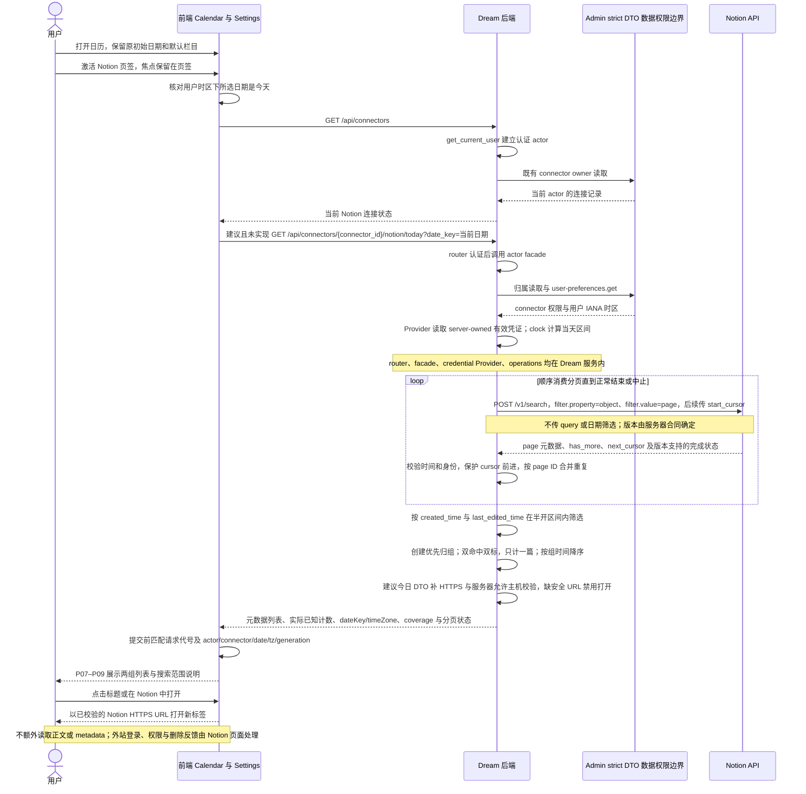
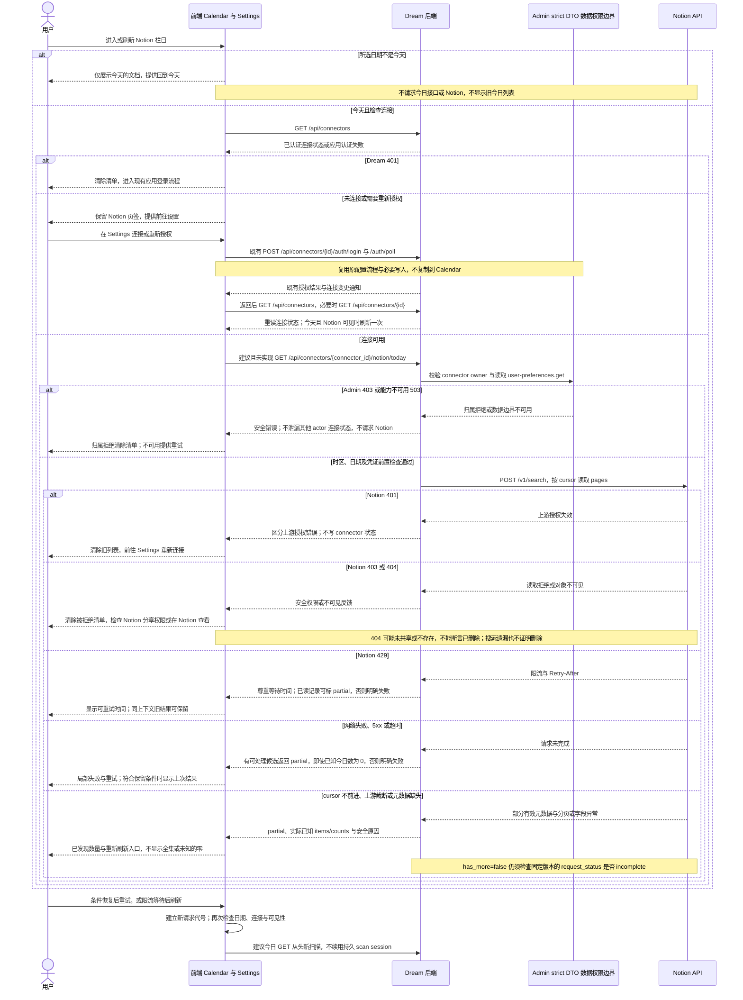
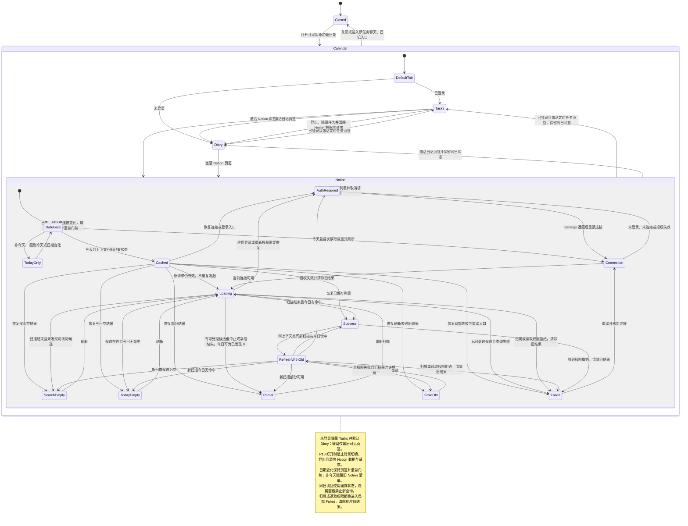

<!-- [Input] 1_prd_draft.md、2_structure_sketch.md、inputs/target_image.png、inputs/topic.txt 与现行 PRD。 -->
<!-- [Output] Stage 3 层级树、精炼结构图、正常与异常业务时序及页面状态图；仅中文设计文档。 -->
<!-- [Pos] 日历右侧页签设计流程 Stage 3，供正式交互稿与后续独立评审引用。 -->
<!-- [Sync] 2026-10-04: 统一权限/时间/页签身份守卫，独立评审补齐 URL 校验缺口、午夜门禁和 partial 零计数；完整枚举仍阻塞。 -->

<!-- [Sync] 2026-10-05: keep stage evidence; PRD owns skeletons and formal interaction design owns business/state diagrams. -->

# Stage 3：页面层级与业务流程

> 2026-10-05：本文件保留 2026-10-04 阶段产物原图作为过程证据；正式骨架已纳入 [日历业务 PRD 正文 §4](../../../prd/calendar/calendar-right-panel-tabs-prd.md)，三幅业务图已直接纳入[正式交互设计稿 §9](../calendar-right-panel-tabs-ui-design.md)。后续产品规则/骨架由 PRD 所有，业务交互图由正式设计稿同步维护。

优化后的执行提示词：综合 Stage 1、Stage 2、附件与现行 PRD，用一致的 P01–P10 编号解释已登录时右侧三个互斥栏目的结构及状态所有权；未登录仅显示日记与 Notion，补齐任务身份守卫、登出回日记及旧数据清除规则。输出层级树、精炼结构草图、正常与异常恢复时序图、页面状态图。仅使用实际参与本流程的前端、Dream、Admin strict DTO 与 Notion API；现有接口使用真实名称，新今日读取接口显著标为建议且未实现。完整覆盖用户时区、上游时间、分页与计数、权限拒绝、连接恢复、只读效果及旧响应防覆盖；保留 Search 无法保证全集的阻塞，不编写功能或原型代码。

交付项：本层级与流程稿，以及同目录清单条目；产品规则以[现行 PRD](../../../prd/calendar/calendar-right-panel-tabs-prd.md)为准，结构依据见 [Stage 2](./2_structure_sketch.md)，图片观察见 [Stage 1](./1_prd_draft.md)。

## 1. 背景与问题

当前右侧任务与日记同时显示，任务内部已存在 LIST/RESULT 切换及编辑、历史 Modal。附件仅提供选中项的圆角背景、图标和名称组合；不能把其栏目名称或深色主题当作项目规则。新增 Notion 需要元数据与错误合同，不能把现有手动选择或同步记录改名为今日文档。

## 2. 目标与边界

左月历及原任务、日记生产入口保持原职责；右侧只显示一个业务面板。本文将流程分为页面呈现、连接配置和只读元数据查询，不新增全文、同步调度、历史活动或持久扫描系统。连接与重新授权仍走 Settings 既有配置流程，允许其原有业务写入；仅查看或刷新清单不得更新 Admin 业务数据。

已登录时完整三个页签与搜索可发现页面候选方案能够被本结构表达，但功能尚未实施。未登录沿用现状隐藏定时任务，仅显示日记与 Notion，默认日记。Search 即使完成所有分页也不能保证授权范围完整枚举，严格“全部今日创建或编辑文档”的目标仍存在阻塞，不得由结构图或文档检查宣布验收通过。

## 3. 概念与规则

P04 只有 P05、P06 或 P07–P09 组合中的一个可见面板；P03 的选中栏目与键盘焦点分别管理。手动激活后焦点保留在页签，按 Tab 才进入内容，不强制跳转列表。P10 打开时沿用 Modal 焦点陷阱，禁止背景月历和页签切换；关闭后恢复原触发控件或当前栏目可用位置。

定时任务页签与 P05 仅在已登录时可见，键盘只遍历当前可见页签。登录后显示完整三项，不强行改变当前栏目；登出使当前任务页签消失时切换到日记并恢复可见焦点。任何登出均取消 Notion 在途请求、清除旧列表，不新增登录弹窗或配置入口。

同日切栏保留安排输入、LIST/RESULT、已加载结果与各栏目滚动，关闭锚定菜单。隐藏面板不可聚焦、不可读出、不显示 Portal，也不得发起新查询或轮询。换日期保留页签、任务回 LIST、列表回顶部，未发送安排输入保留；关闭后重开采用 App 原初始日期和默认栏目，重新读取服务器状态，不建立跨次缓存。

服务器从已认证 actor 的 Admin 用户偏好读取 IANA 时区，以同一次 clock 计算当地当天起点到次日起点的半开区间；不能用服务器时区、固定偏移或加固定 24 小时替代。只有所选日是今天时查询；跨午夜或时区变化造成响应上下文不匹配时，更新服务器今天/时区上下文后重做日期门禁，保留原选日；原选日若已非今天则显示日期提示并等待“回到今天”，不自动改月历或继续查询，旧日期数据不可显示。

## 4. 页面层级树与精炼结构图

```text
P01 现有日历 Modal：遮罩、关闭、滚动锁与焦点恢复
├── P02 月历纸面：年月导航、所选日期、日记标记
├── 右侧工作区：桌面与 P02 并列，窄屏排在 P02 下方
│   ├── P03 日历栏目 tablist：已登录为定时任务 / 日记 / Notion
│   └── P04 当前栏目纸面：唯一可见 tabpanel 与栏目滚动
│       ├── P05 定时任务：仅已登录，安排输入 → LIST 或 RESULT
│       │   └── LIST 既有操作 → P10；RESULT 返回 LIST 后继续操作
│       ├── P06 日记：所选日条目、当前标识、打开与既有删除
│       └── Notion 内容组合
│           ├── P07 面板头：今日标题、已知计数、上次读取、刷新
│           ├── P09 局部状态：日期、连接、加载、部分与恢复
│           └── P08 两组清单：创建优先归组，编辑组排除创建组
└── P10 既有编辑或历史 Modal：复用原状态 owner 与权限
```

```text
桌面：P01                              窄屏：P01
┌ P02 左月历 ┐ ┌ P03 三个图标页签 ┐   ┌ P02 月历 ────────────┐
│日期与标记  │ ├ P04 当前纸面 ────┤   ├ P03 三个图标页签 ───┤
│原业务保留  │ │P05 或 P06        │   ├ P04 当前纸面 ───────┤
│            │ │或 P07 + P09 + P08│   │P05 / P06 / Notion   │
└────────────┘ └──────────────────┘   └──────────────────────┘
             P10 覆盖 P01，打开期间背景不可操作
```

草图表示已登录布局；未登录时 P03 仅为日记 / Notion，P05 不显示。图标继续使用项目 Clock、File 和现有 Notion 字形；选中项呈现图标与名称，未选中项仍有可访问名称及悬停、焦点提示。语义与视觉规则由正式交互稿负责，不在业务时序中加入图标组件参与者。

## 5. 正常业务时序

**建议接口，未实现：`GET /api/connectors/{connector_id}/notion/today?date_key={当前日期}`。** 现有 `GET /api/connectors` 与 `GET /api/connectors/{id}` 只负责连接记录读取；后者沿用 Admin 归属读取边界。本图是待实施设计，不表示今日接口已存在。



Search 可发现集合与连接器授权范围、项目已选择范围、本地同步范围分别定义。候选 pages 的上游原始时间必须保留；来源更新时间、同步时间和读取时间不能判定今日创建或编辑。数据源容器不作为文档计数，不按当前用户本人过滤。缺标题显示“未命名文档”，缺安全 URL 禁用打开并允许刷新。

一次聚合 GET 没有进度流：服务端分页尚未返回时前端保持加载且不报告实时数量；扫描结束或中止返回后，才显示响应中已发现数量。即便分页正常结束，`coverage=search_discoverable` 仍必须保留，`scan_complete` 不是授权范围全集。

## 6. 异常与恢复时序



时区无法读取、非法或当前日期不匹配也在上游请求前失败；前者显示日期设置错误，后者更新服务器今天与时区后重做门禁，保留用户所选日期；若该日期已非今天，等待“回到今天”，不静默改月历。每次 Dream 请求独立认证，其 401 均恢复应用登录。Admin 不可用、网络、限流与上游异常可保留同一 actor、connector、date、tz 的旧结果；应用登出、归属拒绝、授权失效、权限撤销或连接凭证上下文变化必须清除。外链打开后 Dream 不实时获知外站删除。

## 7. 页面状态转换



`SearchEmpty` 的文案是“暂未发现可访问的 Notion 文档”，不能证明授权范围为空；`TodayEmpty` 是“暂未发现今天创建或编辑的文档”。`Partial` 仅报告实际已知今日数量：取得有效候选但无已知今日命中且扫描中止/无法判定时可以为 0，必须并列不完整提示，不进入正常 TodayEmpty。刷新失败保留旧结果时必须标明上次读取时间与恢复操作，不把它显示成新查询成功。

## 8. 并发、所有权与交付限制

前端请求以请求代号和 actor、connector、date、tz、generation 绑定，使用 Abort 取消失效请求，并在提交状态时再次校验。日期、连接、身份、授权或关闭变化推进 generation；旧响应即使取消失败也不得覆盖当前结果。同日切栏保留已接受结果及滚动，不允许隐藏面板发起新请求；返回同一面板按保存状态继续，只有首次加载、显式刷新或连接返回触发读取。

Admin 负责连接归属、用户偏好与配置持久化；Dream 负责当前元数据扫描、过滤和短期返回；Notion 决定上游读取权限。新元数据范围不扩大 Agent 已选资源的正文权限。本文不调用 `/sync`、选择保存或正文接口，不请求新 schema。图表语法由后续统一文档检查验证；本文完成不表示功能已实现、真实业务已验收或独立评审已通过。
