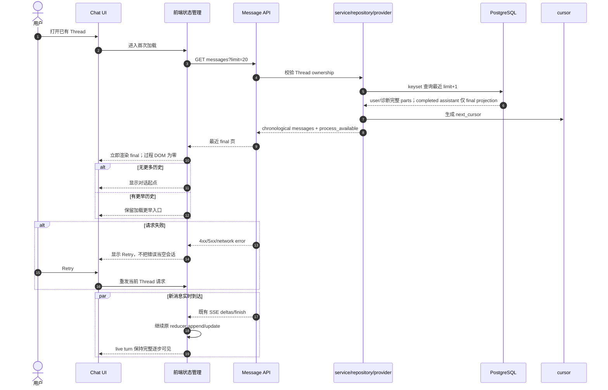
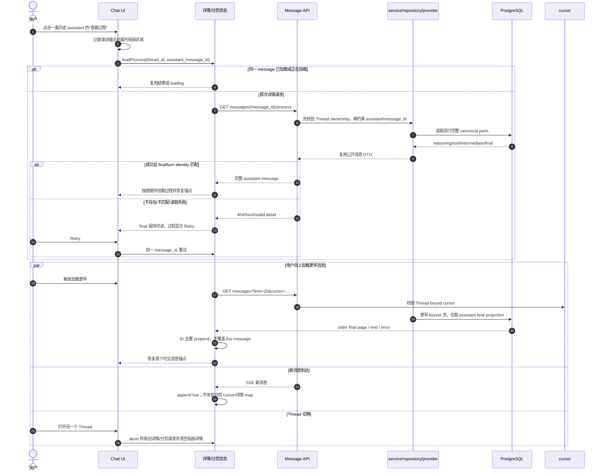

# Chat 历史最终正文投影与过程按需读取设计

<!-- [Input] 现有 chat_message 完整 parts、assistant 成功终态/final 判定、keyset 消息页、历史过程折叠与 Admin Drizzle Schema 协议。 -->
<!-- [Output] Admin-owned final-text projection、可审计历史回填、轻量消息页与按 assistant message_id 延迟读取完整过程的端到端合同。 -->
<!-- [Pos] Chat 单条超大 assistant JSON 的存储/读取性能真相源；继承 chat-history-keyset-pagination.md 的排序、分页、实时合并与滚动语义。 -->
<!-- [Sync] 2026-09-02: 选择不破坏 canonical parts 的 additive final projection，并定义 Admin expand/backfill、Dream 保存/列表/详情和 UI 延迟展开合同。 -->

## 背景与问题

上一阶段已把 Chat 首屏从全量 Thread 历史改为最近一页，并把历史 completed assistant turn 的过程 DOM 默认卸载。生产证据仍显示：一个 86 条消息的 Thread，完整 `parts + metadata` 约 2.67MB，最近 20 条仍约 1.28MB。数据库分页查询本身只有亚毫秒级，但页面请求仍必须从 PostgreSQL TOAST 读取完整 `parts`、在 Python 中解码、经网络发送并由浏览器解析。

根因是 `chat_message.parts` 同时承载一个 assistant turn 的 reasoning、工具 input/output、中间 text 和最后 final text。前端折叠能避免过程 DOM，却不能阻止消息接口读取和传输已经折叠的过程 JSON。用户展开前并不需要这些过程内容。

现有成功保存路径已经具备可靠分界：`_persist_assistant_turn()` 只在 runner 成功终态调用，`_completed_turn_final_part_index()` 只接受“最后一个 reasoning/tool 之后唯一的非空 text 后缀”。错误、取消或结构不可信的 turn 走 partial/诊断语义。因此 final 投影应在这个服务端成功边界生成，而不是由浏览器猜测数组最后一项。

## 目标与边界

### 目标

- completed assistant 保存时，在同一事务写入完整 canonical `parts` 和单独的 final text 投影。
- 分页消息接口对有效投影的 assistant 行只读取 final text、公开 metadata 和过程可用标记，不读取完整 `parts` TOAST。
- 用户点击“查看过程/用时”后，才按当前 Thread 与 assistant message ID 获取该条完整过程。
- 过程请求具备 ownership 校验、single-flight、失败重试和 Thread 切换取消；折叠时不创建过程 DOM。
- 历史旧行通过 Admin-owned、默认 dry-run、可审计的数据 runner 回填；无法安全判定 final 的行继续返回完整诊断消息。
- 保持 keyset cursor、消息顺序、实时 SSE、turn/resume/stop/cancel、工具确认、Dream repair、全文导出和 Reflections 读取语义。

### 边界

- 原 `parts` 继续是不可变 canonical source，本阶段不删除 final、不拆除旧列、不改变 exact message identity。
- 无 `limit` 的完整历史接口继续返回完整 `parts`；显式导出、Reflections 和尚未迁移的消费者不使用轻量投影。
- partial/error/cancel、无 final、未知 part 或 projection 不合法的 assistant 行继续完整读取，不能用不完整正文冒充成功历史。
- 不按字节数截断 final，不定义虚构性能 SLA，不新增 Redis、缓存、队列、后台服务或测试专用业务路径。
- Dream 不执行 DDL/自动建表/回填；共享 Schema、capability 和历史数据 runner 只由 `ink-admin-memory` Drizzle 管理。
- 本阶段是 expand：保留旧 Dream 双版本兼容。后续是否从 canonical `parts` 移除 final 属于 contract 阶段，不在本次范围。

## 概念与规则

### Canonical parts 与历史投影

`chat_message.parts` 保留完整 UIMessage parts，继续服务恢复、导出、Reflections、审计和按需过程读取。新增投影只服务历史列表：

| 字段 | 含义 | 规则 |
| --- | --- | --- |
| `history_final_text` | completed assistant 的最终可见 Markdown | 非空；必须与完整 `parts` 的严格 final text 完全一致 |
| `history_process_available` | final 之前是否存在过程 part | 仅说明是否展示展开入口，不代表工具数量或数据大小 |
| `history_projection_version` | 行级投影合同版本 | 当前只接受 `1`；NULL 表示列表必须回退完整 `parts` |

这些字段是 derived projection，不参与 message ID 的 canonical replay identity。保存时 projection 不合法会拒绝该 projection，而不是改变完整消息。数据库约束保证 versioned projection 只能属于 assistant、final 非空；应用仍逐行验证版本和形状后使用。

### final 判定

新 completed turn 继续使用现有严格 predicate：

1. part 只能是 `text`、`reasoning` 或 `tool-invocation`；
2. 最后一个 reasoning/tool 后必须恰好有一个非空 text；
3. 该 text 必须是 parts 最后一项；
4. `turnStatus=completed` 与 `finalPartIndex` 必须匹配；
5. error/cancel/partial 不生成投影。

`_save_assistant` 在形成完整 `asst_parts` 和 metadata 后提取 final text，并把 projection 参数交给 `save_chat_message()`；repository 再验证 final、索引和过程标记一致后与 canonical 行同事务插入。

### 轻量分页读取

分页 SQL 仍按 0042 keyset 索引取 `limit + 1`。对 `history_projection_version=1` 且字段合法的 assistant 行，SQL 使用 `CASE` 返回 NULL 代替完整 `parts`，repository 从 `history_final_text` 构造唯一 text part；其他行返回原 `parts`。因此常规 completed assistant 不发生完整过程 TOAST 解压，用户/诊断行仍保持原协议。

分页 DTO 增加只供 Chat hydration 使用的 `projection_version=1` 与 `process_available`。前端把它们映射为 typed history metadata；它们不显示为用户文案，也不允许浏览器写回。无参数完整历史响应不携带轻量标记。

### 过程详情读取

```http
GET /api/claude-agent/threads/{thread_id}/messages/{assistant_message_id}/process
```

路由先验证 Thread 属于当前用户，再读取同 Thread、assistant role、version 1 且 `history_process_available=true` 的完整 canonical message。不存在、跨 Thread、user message、无过程或不可用 projection 均返回同一 404，不泄漏其他用户 message identity。响应复用现有 `PublicChatMessageDto` 的 metadata 隐私和 parts fail-closed 投影，不创建第二套消息 DTO。

前端详情 helper 要求响应 ID、assistant role、strict final 和 turn identity 与列表项一致；不一致视为可重试的详情错误，不用不可信过程替换列表 final。

### 加载与合并状态

| 状态 | 列表 final | 过程区域 | 动作 |
| --- | --- | --- | --- |
| 折叠 | 常驻 | 不存在 | 展开 |
| 首次展开/加载中 | 常驻 | 局部 loading | 可收起；同 ID 不重复请求 |
| 成功 | 常驻 | 原顺序 reasoning/tool/intermediate | 收起后卸载 DOM；当前挂载期可复用已取 JSON |
| 失败 | 常驻 | 局部错误 | Retry 同一 message ID |
| Thread 切换 | 新 Thread final | 旧请求取消且结果丢弃 | 无跨 Thread 写入 |

详情数据只保存在当前 `ChatMessageList` 实例，不写入全局 useChat reducer，避免迟到的历史 tool part 干扰 pending confirmation、SSE 或 turn 合并。详情成功后仍使用原 `AssistantTurnGroup` 与原 part renderer；`AssistMessagePart` 继续是共享 text leaf。

### 旧数据回填与发布顺序

1. Admin Drizzle 0043 expand：增加三个 nullable/additive 投影字段、约束、数据 migration definition 与 exact capability。
2. 旧 Dream 继续使用完整 `parts`，不受新列影响。
3. Admin 数据 runner 默认 dry-run，验证目标数据库身份、0043 capability、advisory lock 和行结构；`--apply` 批量填充可证明的 assistant 行并写脱敏 receipt。
4. 验证剩余未投影行只属于 partial/error/ambiguous/corrupt 等安全回退类别。
5. 部署要求 exact capability 的新 Dream；新保存行原子写 projection，分页按行使用 final。

回填不打印正文、用户 ID、Thread ID、message ID 或 DSN。重复执行只处理 NULL version 行，并通过 migration receipt/advisory lock 保持可审计和幂等。

## 业务时序图

### 首次打开 Chat 并加载最近 final



### 展开一条 assistant 过程并继续加载旧页



## 方案审查

| 方案 | PostgreSQL/网络收益 | 兼容与风险 | 结论 |
| --- | --- | --- | --- |
| 仅前端折叠 | 不减少完整 `parts` 读取/传输 | 已实现，DOM 收益明确 | 保留但不足 |
| API 读取完整 parts 后删除过程 | 仅减少响应，仍付出 TOAST/Python 解码 | 服务器内存和 CPU 不解决 | 拒绝 |
| 直接把原 parts 改成 process-only | 可避免 duplication | 破坏导出、恢复、Reflections、旧 Dream 与 exact replay | 本 expand 阶段拒绝 |
| 独立详情表 | 可行 | 新表、join、双写与 FK 比三列投影更复杂 | 当前不选 |
| canonical parts + 同行 final projection | 列表跳过过程 TOAST；详情按 ID 精确回源 | 少量写/storage duplication，旧消费者兼容 | **选择** |

最小充分方案是同行 additive projection：它直接覆盖已证实的请求体瓶颈，又不改变 canonical message、实时 reducer 或完整消费者。`history_process_available` 是真实交互事实，不是大小阈值；页大小继续沿用已发布的分页批次合同。

## 实现与验证要求

- Admin：0043 migration/snapshot/journal、exact capability、默认 dry-run 的 backfill runner、registry receipt、Schema/data-runner contract tests。
- Backend：capability fail closed；保存 projection 参数校验；轻量 page SQL；单 message process repository/API；ownership 和非法详情测试。
- Frontend：typed DTO；详情 fetch；per-message single-flight/abort/error/retry；折叠时零过程 DOM；展开成功后原 renderer、顺序和锚点保持。
- 回归：完整无参数 history、导出、Reflections、SSE、turn/resume/cancel、pending confirmation、分页去重与 Dream 两个宿主。
- 性能：同一 Thread 比较完整 history、旧分页完整 parts 与新分页 final projection 的 message 数、响应 bytes、数据库查询计划/BUFFERS；不虚构固定毫秒阈值。
- 发布：Admin migration → dry-run → apply backfill → validation receipt → Dream deployment → 公共 API/生产浏览器只读验收。

## 本地验证证据（2026-09-02）

- Admin 0043 migration 在本地 Admin-owned PostgreSQL 前向应用成功；显式 runner dry-run 识别 1,452 条可投影 assistant、182 条保守回退，apply 更新 1,452 条并产生审计回执，`remainingProjectableRows=0`。
- 从“最近 20 条内已投影 assistant canonical parts 总量最大”的会话取同一页，只输出聚合值：20 条中 9 条 assistant 使用 v1 投影；按真实 API DTO 形状估算，完整页为 2,240,345 bytes，final-first 页为 68,181 bytes，减少 96.96%。
- 同一热缓存本地样本中，完整查询为 10.404ms，final-first 查询为 1.621ms；该数值只作前后对照，不定义产品 SLA。
- `EXPLAIN (ANALYZE, BUFFERS)` 为 `Limit → Index Scan`，使用 `idx_chat_message_thread_created_id_desc`，实际返回 20 行、41 个 shared hits、0 reads，execution time 0.114ms。
- 本机 Chrome 的 1,224,000-byte 过程 Markdown：折叠态 21 个 DOM 节点，展开态 60,023 个节点；新详情测试证明折叠态 0 请求、重复展开 single-flight、错误可重试、收起后过程 DOM 卸载。耗时因机器而异，不作为固定阈值。
