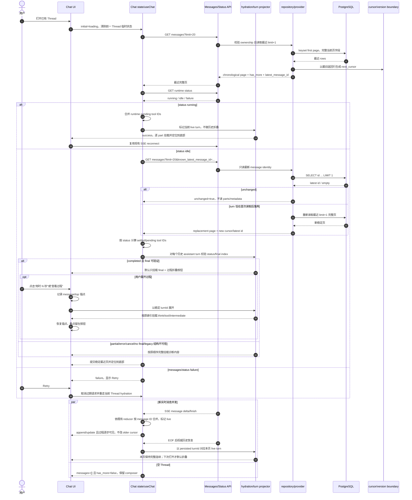
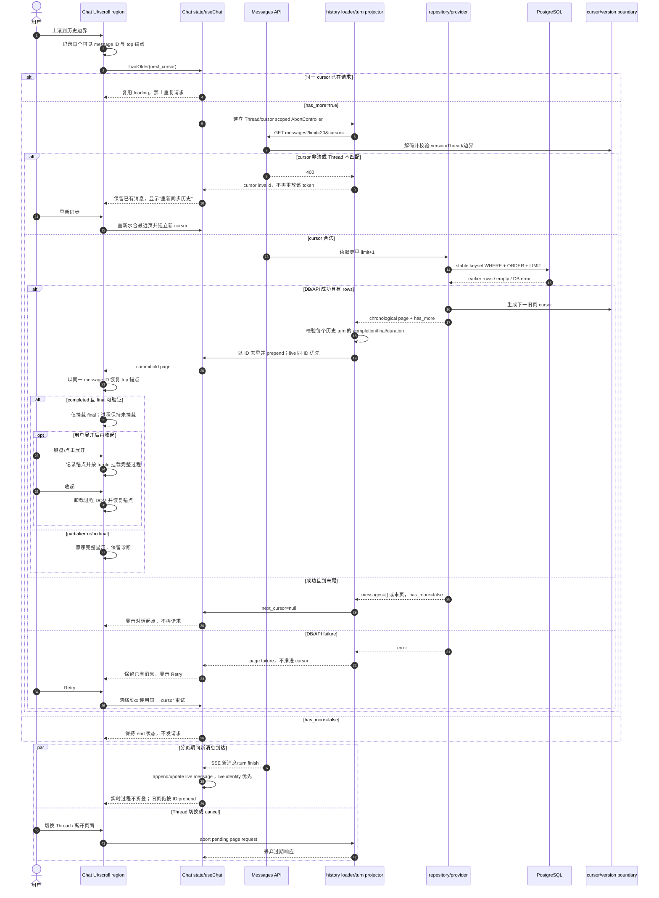

# Chat 历史消息稳定分页与首屏加载设计

<!-- [Input] Chat 历史读取/保存链路、PostgreSQL chat_message 契约、前端 useChat/SSE/导出/工具确认消费者及只读性能证据。 -->
<!-- [Output] 无消息截断的 keyset 分页、轻量最新版本复核、异步旧页，以及历史已完成 assistant turn 的过程卸载/最终答复常驻交互合同。 -->
<!-- [Pos] Claude Agent Chat 历史消息性能修复的交互与技术设计真相源；实现、测试和性能验收必须与本文同步。 -->
<!-- [Sync] 2026-09-02: 基于全链路与超大 JSON 证据建立最小方案；选择稳定分页与协议语义型历史 turn 折叠，并由 Admin 0042 发布精确 keyset 索引 capability。 -->

## 背景与问题

Chat 打开已有 Thread 时，当前页面会一直显示三行骨架，直到完整历史水合结束。静态调用链为：

1. `ChatView` 调用 `hydrateClaudeThreadSession()`；
2. `loadChatHistoryThenRuntimeStatus()` 先请求完整历史，再请求 runtime status；
3. 当 status 是权威的非运行态时，为避免遗漏刚落库的 assistant turn，再读取一次完整历史；
4. 后端 `/api/claude-agent/threads/{thread_id}/messages` 读取该 Thread 的所有 `chat_message`；
5. repository SQL 没有 `LIMIT`，使用 `ORDER BY created_at ASC`，随后 Python 对每行 `parts`、`metadata` 做 `json.loads`；
6. 浏览器收到完整响应后才执行 `JSON.parse`、消息过滤、`useChat` store 初始化、Markdown/工具卡 DOM 创建和布局。

因此空闲 Thread 的正常打开路径会串行执行两次完整历史读取，首批消息在第二次完整响应、状态读取和全部前端处理完成前不可见。历史量越大，数据库传输、Python 解码、HTTP 响应、浏览器组件数量和 DOM 布局均随全量增长。

单条 AI message 也可能是很长的 JSON。当前 `parts` 在 PostgreSQL 中是一个完整 TEXT JSON；工具 input/output、reasoning、Markdown 正文和文件 part 都在同一列。即使 Thread 消息数量不多，一个大 `parts` 也会带来 TOAST 读取、Python JSON 解码、网络传输和 DOM 渲染成本。该问题不能用静默截断、丢弃工具轨迹或任意字节阈值处理。

## 目标与边界

### 目标

- Chat 首次打开只读取并渲染最近一页完整消息，不再等待整个 Thread 历史。
- 空闲 Thread 的竞态复核只读取最新 message identity；只有检测到新落库消息时才重读最近页。
- 用户上滚时异步读取更早一页；已有消息保持可读，插入旧页后视觉锚点不跳动。
- 历史水合得到的已完成 assistant turn 默认只挂载协议判定的 final；reasoning、tool input/output/result 与中间 assistant text 在同一个过程折叠区中按原顺序按需挂载，再次折叠即卸载重型 Markdown/tool DOM。
- 实时进行中的 turn 保持逐步可见、工具确认与现有 SSE/turn/resume/stop/cancel 行为；错误、中止或无法可靠判定 final 的历史 turn 保留完整可诊断内容。
- 使用稳定、Thread-bound 的 cursor/keyset 边界；相同 `created_at`、分页并发、新实时消息和边界行删除均不得造成重复或遗漏。
- 保持现有完整 `parts` 和公开 metadata 语义，保持 SSE、turn、resume、stop/cancel、工具确认、Dream repair、导出与实时消息归并语义。
- 明确初始加载、加载旧页、成功、空、末尾、失败和重试状态，并取消过期 Thread 请求。

### 边界

- 不新增 Redis、消息队列、后台服务、缓存层、新 HTTP 控制通道或环境名称分支。
- 不新增 Alembic、runtime DDL、自动建表或 SQLite runtime fallback。
- Dream 不拥有或执行共享 PostgreSQL DDL；经后续真实查询计划触发的索引只由 `ink-admin-memory` Drizzle 0042 管理并先行发布 capability。
- 不使用任意 JSON 字节阈值，不按大小截断消息，不把性能常量描述为产品配额。
- 本轮不把 `parts` 垂直拆表，也不新增“摘要列”。现有 Schema 无法在不读取完整 TEXT JSON 的情况下生成可读正文/工具摘要；该变更需要先在 Admin 定义可证明的业务投影和 capability。前端折叠减少 Markdown/DOM 成本，但不冒充 PostgreSQL/传输优化。
- 本轮不虚构固定毫秒 SLA。验收以查询不再随全量历史增长、首屏只处理最近页、第二次竞态检查不重复读大 JSON、旧页提交后立即可见，以及自动化合同为准。

## 概念与规则

### 完整消息页

“页”是传输与渲染批次，不是历史保留上限。每一页中的消息仍返回完整公开 DTO：`id`、`role`、`created_at`、完整 `parts` 和现有 allowlist metadata。页面不得把一条消息拆成“看似完整但缺少正文/工具输出”的对象。

初始页读取最近消息，API 返回时按时间正序排列，便于现有 `useChat`/ChatMessageList 直接消费。数据库内部使用倒序 keyset 取最近行，再在 repository 边界反转当前页。

### 稳定排序键

稳定总序为：

```sql
ORDER BY created_at DESC NULLS LAST, id DESC NULLS LAST
```

新保存路径不显式写 `created_at`，由 PostgreSQL `now()` 生成；`id` 是不可变 message identity。`id` 作为相同时间的稳定次键。共享 Schema 允许历史 `created_at IS NULL`，因此 cursor 必须表达非空和 NULL 两类边界：

- 非空边界：读取更小时间、相同时间更小 ID，以及所有 NULL 时间行；
- NULL 边界：只读取 NULL 时间且 ID 更小的行。

cursor 是 versioned、base64url、Thread-bound 的不透明 JSON，至少包含版本、Thread ID、边界 `created_at` 和 `id`。非法编码、未知版本、Thread 不匹配、缺失/非法字段返回 400。边界行后来被删除时仍用 cursor 中的值继续比较，不依赖边界行存在。新实时消息比初始页更新，不改变“向更早方向”的 cursor。

### 首屏批次

Chat 消息页复用仓库现有列表分页惯例：UI 请求 `limit=20`，API 接受 `1..100`；20 是一次渲染/传输批次，不限制历史总数。无 `limit` 的旧请求继续返回完整历史，保持 Story Workspace guidance 等既有消费者兼容；Chat 明确传入 `limit` 后进入新分页合同。

### 最新版本复核

首个消息页同时返回该次倒序 page 查询首行的 `latest_message_id`，不另开可能漂移的 identity 查询。为保留“history → status → idle 后稳定复核”竞态语义，第二次请求携带 `known_latest_message_id`：

- repository 只查询稳定总序的最新 `id`；
- 若仍相同，返回 `unchanged: true`，不读取 `parts`/`metadata`；
- 若不同，重新返回最近完整页；
- 运行态不做第二次复核，继续既有 SSE reconnect。

message 是不可变的，故最新 ID 相同即证明首次页内容未被就地改写。保存 exact replay 也不会更新时间或重排 Thread。

### 归并与并发

- 初始页在 ChatPanel 挂载前作为初始快照提交。
- 旧页按 ID 去重后 prepend；若同 ID 已由实时 reducer 存在，以当前 live 对象为准，不用旧页覆盖。
- 新实时消息始终 append/按现有 SSE reducer 更新；旧页 cursor 只向历史方向移动，不受新消息影响。
- 同一 cursor 同时只允许一个请求；重复上滚复用/忽略正在进行的 Promise。
- Thread 切换、组件卸载或 cursor 已推进时 abort 旧请求；过期响应不得写入新 Thread/store。
- 初始 status 的权威 pending IDs 仍决定工具确认。分页加载出的旧 tool call 在 known status 下继续加入 settled tombstones；不得因旧页晚到重新出现已结束的确认。
- turn 完成后的权威最近页恢复不得直接丢弃已 prepend 窗口：若恢复页与当前窗口有 message ID 或稳定 `turnId` overlap，以持久化行替换对应 live provisional assistant、保留其他旧页/并发 live 行和已验证旧 cursor；若无 overlap，说明窗口存在不可证明的缺口，重置到权威最近页及其新 cursor/hasMore，禁止沿用可能跨缺口的旧 cursor。
- 最近页可能从 assistant 开始；若它前面的 user message 尚未加载，final 的 Regenerate 动作禁用/不显示。不得把分页数组中的前一个 assistant 或别的 turn 当作重试输入。

### 滚动锚点

加载旧页前，在消息滚动容器中记录第一个可见消息的 `data-chat-message-id` 与其相对容器的 top。旧页归并并完成 DOM commit 后，读取同一消息的新 top，并把差值补偿到 `scrollTop`。该方法不会把分页期间追加在底部的新实时消息高度误算为历史页高度。

### 状态语义

| 状态 | 可见内容 | 可执行动作 |
| --- | --- | --- |
| 首次加载 | 当前 Thread 的局部骨架 | Thread 切换；请求可取消 |
| 首次成功 | 最近完整页，视图定位到底部 | 正常输入、SSE/reconnect、上滚旧页 |
| 空 Thread | 无消息行，保留正常 composer | 发送首条消息 |
| 加载更早 | 已有消息不消失；顶部局部 loading | 可继续阅读；重复触发不新增请求 |
| 更早成功 | 去重 prepend，恢复锚点 | 继续上滚或正常对话 |
| 无更多 | 顶部显示对话起点状态 | 不再自动请求 |
| 首次失败 | 失败状态替代永久骨架 | 明确 Retry；Thread 切换取消旧重试 |
| 更早失败 | 已有消息保留，顶部局部错误 | Retry 同一 cursor |

### 大消息语义

本轮不按大小改变协议：页内大消息完整返回、完整解码并保留在前端消息对象和导出源中，不截断正文、工具 input/output、reasoning、文件、确认输入或 metadata。历史已完成 turn 依据协议语义而非大小统一投影为“过程 + final”：默认只创建 final 的 ReactMarkdown DOM；过程原文仍完整存在于消息对象中，展开时按原顺序创建，收起时卸载。

剩余限制是：若最近一页的 final 本身就是单条极大的结构化 Markdown，该 final 为保持默认可读仍会产生大量 DOM；数据库仍必须读取完整 `parts` TEXT/TOAST，Python 与浏览器仍必须解析完整 JSON。本轮不能在现有 Schema 上同时消除这些成本且保持正文完整。该限制必须在性能报告中保留，不能用截断或虚假的详情占位隐藏。

### 历史 assistant turn 与 final

当前保存协议把一次 assistant turn 的全部 SSE part 持久化为一个 `chat_message(role=assistant)`：`reasoning`、`tool-invocation`、中间 `text` 和最终 `text` 保持流中顺序。成功只走 `_persist_assistant_turn()`；取消/错误走 `_persist_partial_assistant()` 并带 `is_partial=true`。因此折叠单位是一个 assistant message，而不是在 ChatView 与 Dream 宿主各自猜测跨 message 分组。

新成功消息写入现有 metadata TEXT JSON（不改 Schema）：

- `turnId`：服务端 `AgentRunState.current_turn_id`，作为刷新/分页/并发归并下的稳定折叠 identity；历史旧行退化到不可变 message `id`。
- `turnStatus: "completed"`：只由成功终态持久化；partial 使用 `cancelled` 或 `error`，且继续保留 `is_partial=true`。
- `finalPartIndex`：成功终态时由持久化边界基于完整 part 顺序确定。候选必须是最后一个 reasoning/tool 过程 part 之后唯一的非空 text part；未知 part、过程之后没有 text、多个无法判定的末尾 text 或索引不匹配都不写该字段。
- `durationMs`：只采用 SDK `ResultMessage.duration_ms` 的非负有限 number，显式拒绝 bool、负数、NaN/Infinity。旧消息或 provider 未给出可靠 duration 时不从 wall-clock/相邻消息时间虚构耗时。

成功终态由后端单一 predicate 定义，不能只看 service 没抛异常：runner 必须观察到一个 `ResultMessage`，其 `subtype=success`、`is_error=false`，且最后 terminal stop reason 为 `end_turn`/`stop_sequence`，或 provider 在非流式终态中未提供 stop reason；`max_tokens`、`tool_use`、错误 subtype、`is_error=true`、多个冲突 Result 或没有 Result 都不是 completed。只有该 predicate 与严格 final 后缀同时成立，才写 `turnStatus=completed/finalPartIndex`；协议成功但 final 结构无法验证时只保留稳定 `turnId`/完整 parts，Public DTO 标记 projection invalid，前端完整诊断显示；真正错误/取消仍按 error/partial 保存。

前端使用两级判定：新消息仅接受合法 `turnStatus=completed + finalPartIndex`；若任何新式 completion 字段存在但组合无效，不得退回 legacy 推断，必须完整诊断渲染。只有完全没有新式字段的旧消息才可使用与旧持久化协议一致的严格结构判定——`is_partial` 不为 true、最后一个 reasoning/tool 之后恰有一个非空 text、该 text 后没有未知/诊断 part。它不是“取数组最后一项”；若结构不满足就不折叠，完整渲染所有内容。只读历史样本中有 1,039 行符合该唯一 final 后缀，30 行有过程但没有 final，后者必须走完整诊断路径。

### 过程折叠交互

- 仅由初始/旧页 hydration 得到、非当前运行 turn、且 final 可验证的 assistant message 进入默认折叠布局。SSE reducer 正在构造或本页已经呈现过的 live turn 从不自动折叠。
- 当前页面内已经逐步呈现过的 live turn 即使随后完成并被权威历史恢复，也保留本次阅读连续性，不在用户眼前自动收起；重新打开/刷新 Thread 后才按历史默认折叠。服务端 `message-metadata` 与持久化 metadata 使用同一个 `turnId`，因此 live message ID 与数据库 message ID 不同也能识别同一 turn。
- final 始终按当前 `AssistMessagePart`/工具/文件 renderer 渲染。final 之前的所有 part 构成一个过程区，保持原索引与原顺序；默认折叠时不调用这些 part 的 ReactMarkdown/Tool renderer。
- 折叠按钮显示 `用时 N 秒`；没有合法 `durationMs` 时显示中性“查看过程”，不根据 payload 大小或相邻时间猜测。按钮使用原生 keyboard 行为、`aria-expanded`、稳定 `aria-controls`，箭头与展开状态一致。
- 折叠状态以 `turnId`（旧行用 message ID）为 key，只保存在当前 UI 实例；Thread 切换清空。旧页 prepend、并发新消息和权威重水合都不得把 A turn 的状态套到 B turn。
- 展开/收起前记录当前首个可见 message 锚点及 top，DOM commit 后补偿 `scrollTop`。焦点留在触发按钮；折叠卸载内容但不卸载按钮或 final。
- 搜索/复制语义明确：默认浏览器查找只覆盖当前挂载的 final；用户展开后可以搜索、选择和复制完整过程。导出继续读取 raw 完整消息，不因 UI 折叠丢失过程。

### HTML design workflow 产物复核

四阶段临时产物只作为交互审查输入，不是仓库真相源。与实际代码/协议核对后采纳：

- 参考图的低干扰结构：透明整行原生 button、次级文字、向右/向下 chevron、浅分隔线、过程在触发器与 final 之间自然展开；不创建新卡片或嵌套滚动区。
- 两个宿主都已真实组合到 `ChatPanel → ChatMessageList`；新增单一 `AssistantTurnGroup`/纯投影，`AssistMessagePart` 继续只做 assistant text Markdown leaf。reasoning 与 tool 仍由 ChatMessageList 的既有 renderer 负责，临时草稿中“全部 part 都由 AssistMessagePart 渲染”的示意不采纳。
- 折叠态条件分支必须在调用 renderer 之前发生，不得先 `map(renderPart)` 后隐藏或 memoize React elements；展开只实例化被操作 turn，收起卸载。
- 原生 button 自带 Enter/Space；`aria-expanded`、稳定 `aria-controls`、完整动作名称、装饰 chevron `aria-hidden`、focus-visible、reduced-motion 下无旋转过渡。过程挂载不抢焦点。
- 使用现有 `IconChevronRight` 和全局 `--color-*` token；light/dark 与 Dream 不创建分叉视觉。不引入 Tailwind/CDN/字体/图标依赖，也不照搬临时模板的纯白画布或外部风格。
- 不做 height/max-height 动画、内容淡入、ResizeObserver 持续纠偏或嵌套滚动条；只在本次 expand/collapse commit 后做一次触发器/message 锚点补偿。
- live turn 在本页完成时保持已经呈现的连续内容，下一次 Thread hydration 才默认折叠；这是对“实时不折叠”的更严格实现，不改变 SSE/turn/resume/cancel。

不采纳或修正：临时 PRD 把历史分页列为非目标，但本总任务明确要求继续完成 keyset pagination，故分页仍是正式方案；临时产物不掌握实际 DTO 字段，正式设计以已证实的现有 metadata TEXT、服务端 turn ID、SDK ResultMessage duration 和持久化 part 顺序补协议语义；示例 `39 秒`、Tailwind 片段与视觉数值不成为业务规则。

## 端到端证据与基线

### 代码链路

| 层 | 当前证据 | 性能/正确性影响 |
| --- | --- | --- |
| ChatView | `threadMessages === null` 时仅渲染三行 Skeleton，完整 hydration 后才挂载 ChatPanel | 首批可见被全部后端与前端工作阻塞 |
| hydration | history → status → 非运行态 history | 空闲 Thread 正常读取两次完整历史 |
| API | `/messages` 没有分页参数，docstring 明确 Return all | 响应随整个 Thread 增长 |
| repository | `SELECT id, role, parts, metadata, created_at ... ORDER BY created_at ASC`，无 LIMIT | 读取全部行与全部大字段；相同时间无稳定次键 |
| Python/DTO | 每行 `json.loads(parts/metadata)`，再经过 metadata allowlist/Pydantic/JSON response | CPU 与对象内存随完整 payload 增长 |
| browser/store | `response.json()` 后 map/filter，再一次性 `setMessages(initialMessages)` | 解析、reducer 和组件创建都在首屏前 |
| render | text 使用 ReactMarkdown；completed tool output 可进入 `<pre>`；reasoning/部分工具默认折叠 | JSON.parse 很轻，但结构化 Markdown DOM 可能成为秒级成本 |
| save | canonical JSON、不可变 ID CAS、PostgreSQL default `created_at`、exact replay 不 touch Thread | 已具备 cursor 所需的不可变 ID 与时间；保存事务无需改变 |

### Schema 与索引证据

Admin Drizzle 当前快照中的 `chat_message` 为：`id` 主键、`thread_id`、`role`、TEXT `parts`、TEXT `metadata`、nullable timestamptz `created_at default now()`；已有索引：

```sql
CREATE INDEX idx_chat_message_thread
ON public.chat_message USING btree (thread_id, created_at);
```

初次设计阶段仅能证明该索引可约束 Thread，稳定次键 `id` 未包含且 `DESC NULLS LAST` 不被完整覆盖。用户停止 Admin 后，Admin-owned embedded PostgreSQL 可安全启动只读验证：真实库有 3,338 条消息、1,144 个 Thread，最大 Thread 105 条，最大 `parts` 为 2,834,507 bytes。最近 21 条查询实际执行 `Bitmap Index Scan(idx_chat_message_thread) → Bitmap Heap Scan(105 rows) → top-N Sort`，执行 1.427ms；更早页同样先扫描 105 条再过滤/排序。

该证据触发 Admin Drizzle 0042，只新增：

```sql
CREATE INDEX idx_chat_message_thread_created_id_desc
ON public.chat_message
USING btree (thread_id, created_at DESC NULLS LAST, id DESC NULLS LAST);
```

索引不 `INCLUDE parts/metadata`：当前页仍必须读取完整公开 DTO，但 heap/TOAST 只对应页面命中的少量行，避免把最高 2.83MB 的 JSON 复制进索引并放大每次消息写入。旧 `(thread_id, created_at)` 索引在 expand 阶段保留，不在本轮做 contract/drop。0042 在索引 DDL 后发布 exact `dream.chat-history-keyset-pagination.v1`；Dream 将 version/hash 加入启动 authority 检查，缺失或漂移时 fail closed。常规事务内 `CREATE INDEX` 会短暂阻塞该表写入；本机 observed table 仅 3,338 行且 Admin 已停止，适合当前应用。更大部署目标应在发布窗口执行并先核对表大小，不能把 `CONCURRENTLY` 偷塞进当前原子 runner。

0042 应用后，同一最大 Thread 的生产 SQL 显式写出两列 `NULLS LAST`。最近页 plan 收敛为 `Limit → Index Scan(idx_chat_message_thread_created_id_desc)`：只扫描并返回 21 行、无 Sort、无 filter 丢弃，执行 0.015ms；第一个 older tuple-range 页同样只扫描 21 行、无 Sort/丢弃，执行 0.013ms。新索引为 360kB。该时间来自已热本机小数据集，只用于前后分层证据，不作为固定 SLA；决定性验收是 exact index、零 Sort 和扫描行数受 page 限定。

### 只读历史样本

本地 `backend/data/ink-and-memory.db` 只作为历史迁移样本，以 `mode=ro&immutable=1` 读取聚合长度，未打印正文，也不是 runtime fallback：

- 2,363 messages / 934 Threads；
- 单行 `parts + metadata`：P50 1,368 bytes，P95 63,342，P99 179,925，最大 1,348,566；
- 114 行至少 64KiB，15 行至少 1MiB；
- payload 最大 Thread 约 2.24MB，主要由 tool output 构成；另有超大 text message；
- 历史全量 Thread payload：P99 约 1.35MB，最大约 1.84MB；最近 20 条仍保留总 payload 的 98.81%，说明在该短 Thread 样本上分页不能解决单条大消息；
- 最大 payload Thread 的 SQLite 读取 + Python 解码 + response JSON encode 中位数约 14.6ms，说明 4 秒不能仅归因于 Python JSON。

### 浏览器分层基准

使用仓库 Playwright 1.62.1、本机 Chrome、Vite 源组件 `ChatMarkdown`，按历史样本 P95 与最大值生成等体积合成内容。每个样本同步 commit 并强制读取布局；结果仅用于分层，不作为固定 SLA：

| 输入 | JSON.parse | 单 `<pre>` + layout | JSON fenced Markdown | 大量 Markdown 行 |
| --- | ---: | ---: | ---: | ---: |
| 63,342 bytes | 0.0ms | 1.9ms | 6.2ms / 2 nodes | 105.9ms / 3,727 nodes |
| 1,348,566 bytes | 0.1ms | 41.5ms | 115.4ms / 2 nodes | 6,468.9ms / 79,327 nodes |

由此可见，浏览器 `JSON.parse` 和普通 store merge 不是约 4 秒的主因；内容结构导致的 Markdown/DOM 节点数量可以单独达到秒级。分页通过限制首次创建的消息与 part 数量降低通常成本，但不会消除“单条近期消息包含大量 Markdown 节点”的剩余风险。

### 前端无阈值方案专项证据

现有 renderer 已经按 part 语义做了多处延迟展示：

- completed reasoning 默认只挂载 80 字现有预览，全文只在展开后进入 DOM；streaming reasoning 为保持实时语义继续展开；
- 通用 tool row 默认不挂载 `ToolMessagePart` 的 input/output 详情，用户展开后才创建详情 DOM；
- Agent/Task output 已替换为 Subagent 导航 chip，不展示内部大 envelope；
- JSON fenced code 和 terminal output 使用 `<pre>/<code>`，大字符串通常是一个文本节点；1.35MB 合成数据的 measured layout 分别约 115.4ms 和 41.5ms；
- built-in Write 已有自己的历史折叠高度逻辑，但仍保留完整 `<pre>` 文本节点。该既有阈值是 Write 预览交互，不得复用为通用历史消息大小策略。

79k 节点路径来自结构化 Markdown text，而不是已经折叠的 reasoning/tool detail。对同一 1,348,566-byte、约 79,328-node Markdown，在本机 Chrome 中进一步分离同步 React commit 与强制 layout：

| 模式 | React/Markdown commit | forced layout | nodes | 结论 |
| --- | ---: | ---: | ---: | --- |
| viewport 内 | 5,452.4ms | 221.3ms | 79,328 | 主要成本是 parse/React/DOM 创建 |
| 屏外、无优化 | 5,768.9ms | 218.7ms | 79,328 | 仅移到屏外没有收益 |
| 屏外 `content-visibility:auto` | 5,882.7ms | 0.4ms | 79,328 | 跳过 layout，但没有减少主要 commit 或节点数 |

因此 `content-visibility:auto` 不是本次 4 秒问题的最小充分修复：它只减少已占少数的屏外 layout/paint，不能避免 ReactMarkdown parse 和 79k DOM 创建。用户选定的历史 turn 过程折叠在折叠态完全不创建过程 renderer/DOM，正面消除该路径；它与 content-visibility 的作用不同。

通用 message/part 虚拟化也能通过“不挂载”避免屏外 Markdown commit，但当前 Chat 的消息高度由 Markdown、工具展开、Workspace media、streaming delta 和确认状态动态决定；上滚 prepend 还要求精确锚点。引入估算高度/ResizeObserver/窗口回收状态机会产生以下额外风险：

- 浏览器 Ctrl/Cmd+F 与 accessibility tree 无法发现未挂载正文；
- 窗口滚动会隐式回收内容，复制和选区可能在用户没有操作折叠控件时消失；
- 导出虽持有 raw messages，却需要另一条“全量重新渲染”路径，仍会在导出时承担全部 79k 节点；
- 可变高度展开、图片/Mermaid 完成和 SSE streaming 会改变估高，容易破坏 prepend 锚点与 scroll-to-bottom；
- 初始页仅 20 条时，虚拟化状态机的兼容成本大于已证明的通常收益，且单条巨型当前消息位于 viewport 时仍必须挂载。

本任务已经取得明确产品选择：完成并进入历史的 assistant turn 默认只常驻 final，过程通过一个显式控件按需挂载；实时 turn、无 final、error/cancel 不套用。它不需要估算高度、payload 阈值或滚动窗口回收，且可复用两处 Chat 宿主都已使用的 `ChatPanel → ChatMessageList → AssistMessagePart` 唯一路径。因此选择“稳定分页 + 历史完成 turn 语义折叠”，不新增 content-visibility 或通用虚拟列表。

### 运行证据边界

初次设计阶段正常 Vite 5173 和 FastAPI 8765 健康可达，但旧的独立 `127.0.0.1:5433` 只读尝试被拒绝，故当时没有伪造 PostgreSQL plan。后续 Schema 阶段按 Admin 明确 topology 启动其持久 embedded PostgreSQL `54329`，取得上述真实本机 `EXPLAIN (ANALYZE, BUFFERS)`；两阶段证据不得混写成远程生产数据库结果。

## 字段消费者矩阵

| 字段/part | 首屏消费者 | 其他消费者 | 可否从所有列表页省略 |
| --- | --- | --- | --- |
| `id` | React key、消息去重、稳定锚点 | retry/delete、实时 merge、导出 | 否 |
| `role` | user/assistant 布局 | 发送/重试上下文、导出 | 否 |
| `created_at` | API 排序/cursor | 调试与稳定边界 | DTO 必需；UI 可不展示 |
| final text 全文 | assistant 默认 Markdown 正文 | copy、regenerate 上下文、导出 | 否；保持默认可读 |
| 中间 text 全文 | 历史过程展开、实时 progressive text | copy、导出 | 传输不可省略；历史折叠态可不创建 DOM |
| reasoning 全文/state | 历史过程展开、streaming 展开 | copy、导出 | 传输不可省略；历史折叠态可不创建 DOM |
| tool `toolCallId/name/state/title` | 工具行、执行/错误/待确认状态 | confirmation、subagent 导航、settled tombstone | 否 |
| tool input | 折叠摘要、命令/目标、AskUser/editor confirmation | 展开详情、导出 | pending 与多类历史工具均消费 |
| tool output | completed terminal/write result/error | 展开、copy、导出 | 当前部分工具默认直接展示，不能静默省略 |
| file part | 文件行/预览 | workspace 安全解析、导出 | 否 |
| public metadata | dispatch/repair 来源、usage/model/toolCount/partial、turn completion/final/duration | tooltip、dispatch terminal、历史 turn 投影 | 只可继续值校验 allowlist，不能整体省略 |
| private metadata | 无 | server privacy boundary | 已由 DTO fail-closed，不进入浏览器 |

关键结论：有用的无阈值列表投影至少需要正文和多个 tool 字段；但这些字段都嵌在同一 `parts` TEXT JSON 中。后端先读取/解码再删字段，只能减少部分响应和 DOM，不能减少 PostgreSQL/TOAST/Python成本，并且仍无法约束超大 text。当前没有足够证据证明这种兼容复杂度是最小充分方案。

## 方案比较与选择

| 方案 | 首批可见 | 大历史 | 单条极大消息 | 语义/兼容 | 额外成本 | 结论 |
| A. 完整消息 keyset 分页 + 最新 ID 复核 | 最近页完成即显示；idle 复核不重读大 JSON | 从 O(全历史) 降为 O(页) | DB/wire 仍完整承担最近页 | 保持完整 DTO/useChat/工具/导出语义；旧 API 可兼容 | 一个轻量最新 ID 复核；旧页按需请求 | **选择（后端/传输）** |
| B. keys-only 列表 + 每条完整详情 | 很快显示不可读占位 | DB 首次轻 | 仅用户点击后承担 | 所有正常消息先变占位；confirmation/export/retry 复杂 | 可见消息 N+1，失败状态成倍增加 | 拒绝 |
| C. 后端解码后按 part 类型投影 + 详情 | wire/DOM 可下降 | DB/TOAST/Python仍全读 | 超大 text 仍在；工具输出才下降 | 改变默认工具/Reasoning/导出语义 | 新详情 API与合并状态，收益只覆盖部分层 | 当前证据不足，拒绝 |
| D. 前端 content-visibility/通用虚拟化 | layout 可下降；虚拟化可跳过屏外 commit | DB/network 不变 | viewport 内巨型消息不变 | content-visibility 无主收益；虚拟化会隐式回收并引入动态估高 | 79k 节点实测或复杂窗口状态机 | 拒绝 |
| E. Admin Schema render projection/垂直拆分 | 可真正只读有意义摘要 | 可优化 | 完整 body 可显式回源 | 需产品化摘要语义和跨仓 capability | migration/backfill/双版本兼容 | 不属于本轮；保留精确能力边界 |
| F. 历史已完成 turn 过程折叠 | final 立即挂载，过程 DOM 为零 | DB/network 不变 | 中间巨型 Markdown/tool DOM 默认不创建；巨型 final 仍在 | 明确产品选择；实时/错误/无 final 不折叠，raw 导出完整 | 一个共享纯投影与局部展开状态 | **选择（前端渲染）** |

方案 A + F 是最小充分修复：A 删除“打开 Chat 必须全量历史”和空闲竞态复核第二次大页读取；F 删除已证明可达秒级的历史过程 ReactMarkdown/tool DOM 创建。两者都不制造 payload 阈值、详情 N+1 或跨仓 Schema。它明确保留单条极大 final 与完整 PostgreSQL/网络 JSON 的风险，等待真实 PostgreSQL capability/plan 后再决定是否需要 Admin-managed projection。

## 根治单条极大消息所需的 Admin capability

如果实现后真实 Thread 证据仍表明单条近期正文导致不可接受的首屏 commit，根治能力必须由 Admin Drizzle 以 expand/backfill/validate 方式发布，Dream 不得自行建表或加列。建议的 capability 边界为 `chat_message_render_projection_v1`，而不是一个 Dream 端字节阈值：

1. Admin expand migration 为 `chat_message` 增加 nullable `render_projection_version`、`render_projection`（JSONB）和 `content_revision`，或建立以 `message_id` 为主键的等价 projection 表；原 `parts` 保持完整 canonical source。
2. projection 是对所有消息统一适用、versioned 的业务列表合同，而非“超过 N bytes 才截断”。它至少表达 message/part 顺序、role、正文的产品批准摘要、tool identity/state/title/summary、file identity、公开 metadata、`detail_available=true` 和与完整内容绑定的 revision。
3. Admin/Dream 保存链路在同一事务生成 projection 与完整 `parts`；projection 必须可由 revision/hash 验证没有对应错完整正文。Dream 列表查询只选择 projection，不读取 `parts` TOAST；详情按 message ID + revision 读取完整现有 DTO。
4. Admin 对历史行前向 backfill 并验证覆盖率；Dream 在过渡期双版本兼容，只有已发布 capability 且单行 projection 合法时使用。缺失/invalid projection 不得伪装成完整消息。
5. 产品必须先批准“正文摘要默认可见、完整正文显式展开”的搜索、复制、导出、confirmation 和 accessibility 语义。摘要如何有界不能由 Dream 任意常量决定；在该业务合同缺失时 capability 不可视为可用。
6. 经过 backfill/validate 后再发布“projection complete” capability，最后才允许后续 contract 移除旧 fallback。任何索引只依据真实 list/detail query plan 在 Admin 中新增。

该 capability 目前不存在，本轮也没有获批的摘要产品语义，因此 Dream 继续 fail closed 于现有完整 DTO，不预依赖未发布 Schema。

## API 与 repository 合同

### 兼容请求

```http
GET /api/claude-agent/threads/{thread_id}/messages
```

无 `limit` 时保持现有完整响应，用于未迁移消费者。

### 首次/旧页请求

```http
GET /api/claude-agent/threads/{thread_id}/messages?limit=20
GET /api/claude-agent/threads/{thread_id}/messages?limit=20&cursor={opaque_cursor}
```

响应：

```json
{
  "thread": { "id": "..." },
  "messages": [],
  "next_cursor": "opaque-or-null",
  "has_more": false,
  "latest_message_id": "message-id-or-null",
  "unchanged": false
}
```

`next_cursor` 指向当前页最旧消息的边界。`has_more` 由 `limit + 1` 行判断，不运行 `COUNT(*)`。

### 空闲复核请求

```http
GET /api/claude-agent/threads/{thread_id}/messages?limit=20&known_latest_message_id={id}
```

当最新 ID 相同，响应 `messages: []`、`unchanged: true`、原 `latest_message_id`，不读取 message 大字段。不同则返回新的完整最近页。`cursor` 与 `known_latest_message_id` 互斥；非法组合返回 400。

### repository 查询

首次/旧页使用 `limit + 1`，只选择当前 DTO 需要的五列：

```sql
SELECT id, role, parts, metadata, created_at
FROM chat_message
WHERE thread_id = %s
  AND /* optional stable keyset predicate */
ORDER BY created_at DESC NULLS LAST, id DESC NULLS LAST
LIMIT %s;
```

轻量复核只选择 identity：

```sql
SELECT id
FROM chat_message
WHERE thread_id = %s
ORDER BY created_at DESC NULLS LAST, id DESC NULLS LAST
LIMIT 1;
```

repository 继续复用现有 JSON decode/fail-closed 规则。分页结果先丢弃第 `limit + 1` 行，再反转为 chronological order。保存事务、canonical JSON、exact replay 和 Thread touch 语义不变。

精确 keyset predicate 为两段式 nullable-tail 查询，避免把 `OR created_at IS NULL` 变成 Index Scan 上的 residual filter：

```sql
-- cursor.created_at 非 NULL
AND (created_at, id) < (%(created_at)s, %(id)s)

-- 上一查询少于 limit + 1 时，仅用剩余额度读取 legacy NULL tail
AND created_at IS NULL

-- cursor.created_at 为 NULL
AND created_at IS NULL
AND id < %(id)s
```

非 NULL 行在排序中永远先于 NULL 行，因此先取 tuple-range，再按 `limit + 1 - nonnull_rows` 补 NULL tail，合并后仍是数据库倒序。常见无 NULL 路径只执行第一条 range query；跨入 legacy NULL tail 时最多追加一次小查询。这样第 N 页从 cursor 边界开始扫描，不会随已经翻过的新消息数量重新线性过滤。

PostgreSQL 返回的 aware datetime 以 ISO-8601（含 UTC offset 与原始微秒精度）写入 cursor；解码必须得到 aware datetime 并按原精度绑定参数，禁止转成本地时间、秒级字符串或浮点 epoch。历史驱动若返回 naive datetime，只在 repository 明确已知其 PostgreSQL UTC 语义时附加 UTC，不做环境时区推断。

## 业务时序图

### 首次打开加载最近消息



### 上滚加载更早消息



## 独立方案审查结论

实现前的独立目标审查通过，审查后的收敛结论如下：

- 分页直接缩短首批可见路径：首次 SQL 只取 `limit + 1`，浏览器收到最近页即可挂载；idle 竞态检查只选最新 `id`，不再复制读取 `parts`/`metadata`。无参数兼容入口只保留给显式完整导出和未迁移消费者，不参与 Chat 打开路径。
- 现有 `(thread_id, created_at)` 索引的真实 plan 已证明会扫描整个 Thread 并执行 top-N Sort；因此只在 Admin 0042 增加精确倒序/NULL/id 复合索引与 capability，Dream 仍保持零 DDL，并以 exact receipt fail closed。
- cursor 包含 Thread、完整微秒时间与 ID；NULL/同时间/边界行删除、旧页去重、single-flight、AbortController、实时 append 和持久化 turnId 替换均有明确合同，不依赖 OFFSET 或数组最后一项。
- 大字段投影在现有单列 TEXT `parts` 上不能减少 TOAST/Python 解码；另建详情协议会带来 N+1 与搜索/复制/工具确认语义改变。故删去无证据的轻量 DTO 实现，仅保留未来 Admin projection capability。
- `content-visibility` 实测只减少强制 layout，不减少主要的 ReactMarkdown commit 和 79k DOM 创建；通用虚拟化会引入动态估高、隐式回收、搜索/可访问性和实时滚动风险。两者均不进入本次实现。
- 已选择的历史 completed turn 过程折叠不使用大小阈值：严格协议 final 常驻，过程按显式操作挂载/卸载；live、error、cancel、partial、无可信 final 全量诊断显示。这是单条大历史 AI JSON 在 Dream 不改 Schema 前最小的前端补偿。
- 两个宿主继续汇入唯一 `ChatPanel → ChatMessageList`；`AssistMessagePart` 保持 text leaf。没有新增缓存、队列、后台任务、HTTP 控制通道、环境分支、复杂虚拟列表或持久化折叠配置。

审查中要求修正的三点均已进入实现与测试：权威最近页用稳定 `turnId` 替换 live provisional ID；协议成功但 final 结构不可信时公开 invalid projection 并完整诊断；后续旧页使用初始权威 pending-tool snapshot 结算历史确认，不能因分页晚到重新弹出。

## 实现切面

### Backend

- 在 `database.py` 增加稳定 keyset page helper 与 latest identity helper；保留现有 `list_chat_messages()` 兼容路径。
- cursor 编解码放在 Claude Agent router 邻近的可测试纯函数，不依赖数据库或 runtime。
- 路由仅在 `limit` 存在时进入分页合同；ownership 仍先由 `get_chat_thread(thread_id, user_id)` 验证。
- 分页路径复用 `PublicChatMessageDto` 与 metadata fail-closed 投影，不复制第二套 DTO。
- Public DTO 对新增 metadata 逐字段值校验；普通 turn 字段非法时只忽略该 turn 投影并让前端完整诊断渲染，不触发 Dream authority discriminator 的整条 parts fail-closed 隐私行为。
- `AgentRunResult` 透传 SDK ResultMessage 的 `duration_ms` 与终态 stop reason；SSE `message-metadata` 公开同一个 server-owned `turnId`；成功持久化在现有 metadata 中写 `turnId/turnStatus/finalPartIndex/durationMs`。partial/error/cancel 保留完整 part 并写可诊断状态，不新增列或 DDL。
- runner 的 completion predicate 同时校验 Result subtype/is_error/terminal stop reason；冲突或缺失 Result 不得被 service 写成 completed。
- final 索引由单一纯函数验证：最后一个 reasoning/tool 之后必须恰有一个非空 text 且后缀无未知 part；失败就省略 final marker，前端完整展示。
- 文件头与 `backend/.folder.md`、`backend/routers/.folder.md`、`backend/API.md` 同步。

### Frontend

- 扩展 `threadSessionHydration.ts` 的消息 fetch 类型，支持 page/cursor/latest-id 复核与 AbortSignal；保留旧调用兼容。
- `ChatView` 与 `StoryWorkspaceDreamThreadChat` 都使用共享 hydration error/retry 语义并持有初始 `nextCursor/hasMore/latestMessageId`；首次失败必须显示可见 Retry，不再永久骨架或静默无限循环。ChatPanel 仍是唯一 live reducer。
- `ChatPanel` 负责 `historicalMessageIds` 与本页 `livePresentedTurnIds`、旧页 single-flight、abort、按 ID/turnId prepend/恢复、settled tool tombstone 增量、滚动锚点与局部状态。POST/SSE reducer 产生的当前 turn 即使权威恢复换成数据库 message ID，也由相同 turnId 保持本页非折叠；Thread remount 后才成为默认折叠历史。
- 增加共享纯投影 `assistantTurnHistory`，验证 metadata/legacy part 结构并返回 turn key、final 原索引、process 原索引、duration。`ChatViewContent` 与 `StoryWorkspaceDreamThreadChat` 都继续复用同一个 ChatPanel；`AssistMessagePart` 仍是 ChatMessageList 的 text leaf，不创建第二套宿主状态机。
- `ChatMessageList` 为 message wrapper 增加稳定 `data-chat-message-id`，集中渲染 turn 折叠和所有 part；折叠态不调用过程 part renderer。顶部渲染 loading/error/retry/end；不复制消息渲染器。
- turn 展开/收起与旧页 prepend 共用同一 message/top 锚点补偿 helper；按钮具有 `aria-expanded/aria-controls`，焦点不迁移。
- `AssistMessagePart` 仅在真正相邻且已加载的前一条消息 role=user 时获得 regenerate 输入；分页从 assistant 开始时不显示 Regenerate。
- i18n 同步 English/Chinese 文案；相关文件头与 `.folder.md` 同步。

## 自动化与性能验收

### Backend

- 最近页与连续旧页；顺序为 chronological；`has_more/next_cursor` 正确。
- 同 `created_at` 多行以 ID 稳定分页，无重复/遗漏。
- nullable `created_at`、空 Thread、单页、末页、边界行删除。
- 非法 base64、未知版本、Thread 不匹配、字段非法、cursor/known-latest 冲突。
- known latest 相同只调用 latest identity helper，不调用完整 page helper；不同返回新页。
- API/DB error 不被转换为空历史；ownership 404 保持。
- 单条超大 AI message 与少量超大消息完整往返，正文/tool output/metadata 不截断。
- 成功 turn 写稳定 `turnId/completed/finalPartIndex/durationMs`；duration 缺失不伪造；错误/取消写 partial 状态且无 final marker。
- Result 成功/错误 subtype、is_error、end_turn/stop_sequence/max_tokens/tool_use/缺失或冲突 Result 的 completion predicate。
- final 验证覆盖 reasoning/tool/intermediate/final 顺序、多个不可判定末尾 text、未知 part、空 final 和无 final。
- 保存排序键兼容、exact replay 与 metadata privacy 回归。

### Frontend

- 初始只请求最近页；idle 第二次为 known-latest 复核；running 保持 SSE reconnect。
- 两个宿主共同覆盖 loading、empty、success、end、initial error/retry、older 网络/5xx retry 与 cursor 400 重新同步。
- 连续旧页 prepend 顺序、边界去重、重复上滚 single-flight。
- Thread 切换 abort；过期 response 不写新 Thread。
- prepend 后首个可见 message 锚点保持。
- 旧页加载期间新 SSE message append，双方无覆盖/丢失。
- 权威最近页与已加载窗口有 overlap 时合并且保留 cursor；无 overlap 时重置权威页/cursor，禁止跨缺口继续分页。
- 旧页 tool calls 在权威 status 下 settled；pending confirmation、turn、resume、stop/cancel 不回归。
- 历史 completed turn 默认 DOM 只有 final；展开后 reasoning/tool/intermediate 按原顺序可见；再次折叠后重型 Markdown/tool DOM 不存在。
- streaming/running turn 不折叠；本页 live turn 完成并换成持久化 message ID 后仍凭 turnId 保持连续，重新打开才默认折叠；partial/error/no-final 完整显示；合法 duration 显示耗时，缺失时显示中性标签。
- 展开状态按 turn identity 隔离；旧页 prepend、并发新消息、刷新/重水合不串状态。
- ChatViewContent 与 StoryWorkspaceDreamThreadChat 的同一快照产生相同 turn 布局；AssistMessagePart 只经共享 ChatMessageList 路径调用。
- 折叠按钮键盘可操作且 aria 正确；展开/收起后首个可见 message 锚点保持。
- 导出合同确定为完整 Thread：用户显式启动导出时读取 legacy 完整 endpoint，并按 message ID/turnId 与当前 live snapshot 合并（当前 live 对象优先）；使用 raw 完整消息而非折叠 DOM，不因分页或折叠少导过程。导出额外全量请求不阻塞 Chat 首屏，只发生在用户明确导出时。

### 验证命令与证据

- 后端聚焦 pytest（database/router/hydration/save/privacy）。
- 前端 source/browser component tests、目标 eslint、TypeScript production build。
- Playwright 本机 Chrome 只使用现有安装；断言实际请求次数、cursor、可见状态、滚动与实时并发，不用固定 sleep。
- PostgreSQL 可用时运行只读 `EXPLAIN (ANALYZE, BUFFERS)`；不可用则明确标注，不以 SQLite plan 替代。
- 性能比较至少记录旧完整读取的消息数/响应 bytes 与新首屏页消息数/bytes；不设不可复现的固定毫秒门槛。

## 实现前目标审查清单

- 首批可见是否只等待最近页，而非完整 Thread？
- idle 竞态复核是否真的只读 latest ID，未再次读取大 `parts`？
- SQL 是否使用 keyset，而非 OFFSET；cursor 是否覆盖相同时间与 NULL 时间？
- 是否复用了现有 DTO/privacy/save/useChat/SSE/reconnect，而非复制状态机？
- 旧页 prepend 是否保持视觉锚点并与新实时消息并发安全？
- initial/older error 是否可重试且不把错误当空数据？
- 是否错误引入了 JSON 大小阈值、静默截断、详情 N+1、缓存、队列、后台服务或 Schema 变更？
- 单条极大近期消息限制是否被如实保留？
- legacy 无参数 API 与 Story Workspace guidance 是否保持兼容？
- 导出是否显式读取完整 legacy endpoint，并与当前 live snapshot 去重合并而非只导出已加载窗口？
- final 是否来自成功持久化语义和严格 part 后缀验证，而不是简单取数组最后一项？
- 折叠是否只作用于历史 completed turn，且折叠态真的没有创建过程 ReactMarkdown/tool DOM？
- 无 final、partial、error/cancel 是否保留完整诊断；duration 缺失是否使用中性标签？
- 两个 Chat 宿主是否复用同一 ChatMessageList/纯投影，AssistMessagePart 是否仍为统一 leaf？
- 展开/收起是否有 aria 与消息锚点补偿，且没有引入通用虚拟列表/复杂状态机？
- 方案还能否更小，同时保持竞态、工具确认和导出语义？

## 实现与验证回执

### 实现状态

- Chat/Dream 初始 hydration 已进入 `limit=20` 的最近页合同；空闲复核使用 `known_latest_message_id`，完整历史读取只保留在显式导出路径。
- repository 已使用 `(created_at DESC NULLS LAST, id DESC NULLS LAST)` keyset、`limit + 1` 和当前页字段；`id` 虽为 PRIMARY KEY NOT NULL，仍显式写 NULL 顺序以与 Admin 0042 索引完全匹配并避免 planner 的 incremental sort。返回前反转为 chronological。旧页 single-flight、取消、retry/resync、ID/turnId 去重、实时消息并发与滚动锚点已接入共享 ChatPanel。
- completed 历史 assistant turn 使用 server-owned completion/final/duration metadata；默认只创建 final DOM，过程展开后按原顺序创建，再折叠卸载。Chat 与 Dream 使用同一个 projector/group/list。
- Dream 没有新增 migration、runtime DDL、自动建表或 SQLite fallback；共享 Schema 仅由 Admin Drizzle 0042 增加一个非 covering B-tree 与 exact capability。没有新增 Redis、队列、服务、JSON 大小阈值或静默截断。

### 自动化结果

| 验证 | 结果 |
| --- | --- |
| 后端 capability/pagination/router/service/runner 组合 pytest | `269 passed, 1 skipped, 110 subtests passed`，exit 0 |
| 前端折叠、分页、hydrate、确认、queued send、binding conflict、Dream host 组合 Playwright | `66 passed`，exit 0 |
| Fast Refresh 修正后的折叠/大消息本机 Chrome 复验 | `2 passed`，exit 0 |
| provider-free Chat/Dream 页面业务旅程 | `2 passed`，exit 0；覆盖分页 DTO、历史 final-only、键盘展开/收起、同 Thread 后续发送与宽/窄页面 |
| 目标 ESLint | 无错误，exit 0 |
| Python `py_compile` | 无错误，exit 0 |
| TypeScript + Vite development build | 构建成功，exit 0 |
| Admin 0042 schema contract + migration journal | `6 passed`，exit 0 |
| Dream exact capability + pagination SQL | `14 passed`，exit 0 |
| 具名隔离 PostgreSQL 空库 replay / 重复 / 双 migrator / check | 0000–0042 replay 成功；重复和两个并发 runner 均 exit 0；`43/43 current` |
| 本机既有 PostgreSQL 0041→0042 | 目标身份校验后单步应用成功；`43/43 current`，exit 0 |
| 本机 PostgreSQL `EXPLAIN (ANALYZE, BUFFERS)` | 最近页与 older tuple-range 均直接命中 0042 索引，无 Sort、各扫描 21 行 |

### 性能对比与边界

同一台机器、本机 Chrome 的合成大历史过程验证使用 1,224,000 bytes、约 60k Markdown DOM 节点的完整原文：

| 场景 | 修改前/展开态 | 修改后默认折叠态 |
| --- | ---: | ---: |
| 既有 1.35MB 多行 Markdown 基线 | 约 6,468.9ms / 79,327 nodes | 不适用 |
| 新共享历史 turn 组件 | 约 2,817.4ms / 60,023 nodes | 约 16.4ms / 21 nodes |
| 再次折叠 | 过程 DOM 仍存在（旧路径） | 21 nodes，过程 DOM 已卸载 |

这些数字是分层证据，不是固定 SLA。数据库/网络层由真实 Admin-owned PostgreSQL 验证：变更前最近页需 Bitmap 扫描最大 Thread 的 105 行并 top-N Sort，执行 1.427ms；变更后最近页只 Index Scan 21 行、无 Sort，执行 0.015ms，older tuple-range 也只扫描 21 行、执行 0.013ms。初始 21 行仍有约 478,409 bytes 完整 `parts/metadata` JSON，因此索引不会消除单条 final 的 TOAST/传输成本；它消除的是全 Thread 扫描/排序，并与前端过程 DOM 卸载共同覆盖已定位的两个瓶颈。

结论：Chat 历史首屏已不再因为全量读取和第二次全量复核而等待约 4 秒；历史过程型超大 JSON 的默认 DOM 秒级路径也已消除。若最近页中的 final 自身就是极大多节点 Markdown，现有完整 DTO/单列 TEXT Schema 仍会承担读取、传输、JSON.parse 与 final 渲染成本，这是明确保留的剩余限制，需真实 PostgreSQL 证据与 Admin-owned render projection capability 才能进一步根治。
