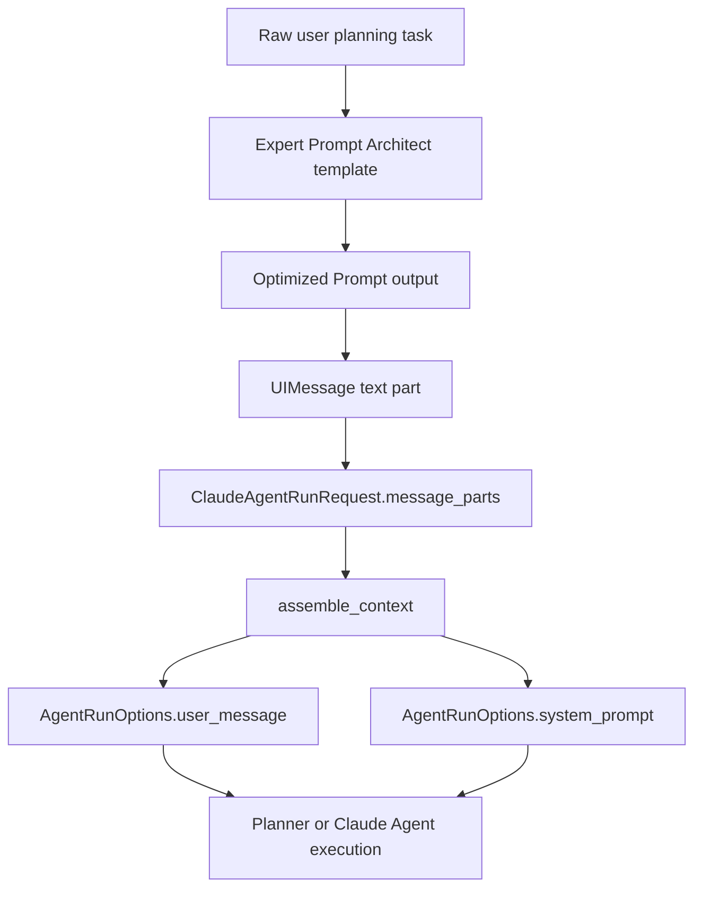

> [Input] `docs/design/claude-agent/claude-agent-context-assembly.md`, `backend/routers/claude_agent.py`, `backend/claude_agent/context_builder.py`
> [Output] Define the planning-turn prompt optimization contract and the required Expert Prompt Architect template.
> [Pos] prompt-design-doc in `docs/design/claude-agent`
> [Sync] 2026-05-28: added pre-planning prompt optimization design and lifecycle relation to `assemble_context`.

# Claude Agent Prompt Optimization Design

This document defines the prompt optimization step used before each planning task. It is not the Claude Agent runtime `system_prompt`; it is an upstream task-normalization layer that turns a raw user requirement into a clearer planning input before `assemble_context` builds the executable context.

## 1. Purpose

Before every planning task, the system should run the raw user requirement through an Expert Prompt Architect prompt. The output becomes the planning input passed as the user text in `message_parts`.

This step exists to:

- clarify the user's objective without changing intent;
- add useful constraints, structure, and output expectations;
- make planning prompts copy-paste ready for the target AI tool or agent;
- keep `assemble_context` focused on context assembly rather than prompt rewriting.

Casual chat turns and direct execution turns can bypass this step unless they are explicitly routed through a planning workflow.

## 2. Required Template

The following template is required for "每轮规划任务前的任务规划输入优化":

```text
You are an Expert Prompt Architect.
Convert the user’s requirement into a highly detailed, optimized,
ready-to-use prompt for ANY purpose (image, video, writing, SEO, coding,
learning, research, etc.).
Instructions
Identify what the user is trying to achieve.
Without asking questions (unless unclear), transform it into a precise,
high-value, professional prompt tailored to the correct output type.
Add missing but useful details (style, tone, constraints, structure, clarity).
Ensure the prompt is copy-paste ready for the intended AI tool.
Deliver:
Optimized Prompt - the final refined prompt
Optional Enhancers - optional add-ons that the user can include

OUTPUT FORMAT
Optimized Prompt:
[Expert-level prompt based on the requirement]

USER REQUIREMENT:        {{task}}
```

Implementation should load the template from a prompt asset or prompt registry when this becomes code. Do not embed long prompt bodies inside route handlers or service methods.

## 3. Invocation Contract

| Field | Meaning |
|---|---|
| `task` | Raw user requirement exactly as received for the planning turn. |
| Optimizer output | Text containing `Optimized Prompt:` and, when useful, `Optional Enhancers:`. |
| Provenance | Upstream planner should keep the raw task and optimized output available for audit/debug metadata. |
| Idempotency | If the user already supplied a clearly optimized prompt and asks to use it as-is, do not re-optimize unless the planning policy explicitly requests it. |

If the raw requirement is unclear, the optimizer may ask a short clarifying question. If the workflow requires no interruption, it should state assumptions inside the optimized prompt instead of blocking.

## 4. Lifecycle Relation



`assemble_context` consumes the optimized prompt as user text. It still adds the runtime context block, recent writing context, workspace-file metadata, attachments, and tool mode. It must not call the optimizer, mutate the optimized prompt, or treat optimizer output as a trusted system prompt.

## 5. Input And Output Format

Planner input after optimization should be represented as a normal UIMessage text part:

```json
[
  {
    "type": "text",
    "text": "Optimized Prompt:\n..."
  }
]
```

The final `build_user_message` output then becomes Claude content blocks:

```json
[
  {
    "type": "text",
    "text": "<runtime_context>\n...\n</runtime_context>"
  },
  {
    "type": "text",
    "text": "Optimized Prompt:\n..."
  }
]
```

Attachments, source URLs, and workspace files remain separate UIMessage parts before extraction. The optimizer should not inline unreadable binary payloads or invent file contents.

## 6. Failure Handling

| Failure | Handling |
|---|---|
| Optimizer unavailable | Continue with the raw task or follow a configurable retry/fallback policy before `assemble_context`. |
| Invalid optimizer output | Reject, retry through policy, or fall back to raw task. Do not pass malformed control text as a system prompt. |
| User intent changed by optimizer | Treat as a bug. The optimized prompt must preserve the original requirement and only add helpful detail. |
| Missing raw task provenance | Treat as observability debt; the system should retain raw and optimized forms for review. |

## 7. Example

### Raw User Task

```text
帮我设计 claude-agent 的规划前 prompt 优化流程，并说明 assemble_context 怎么消费它。
```

### Prompt Architect Output

```text
Optimized Prompt:
You are designing a planning-input optimization flow for the Claude Agent module in Ink & Memory. Produce a technical design that explains when a raw user planning task is converted into an optimized prompt, what template is used, what input and output fields are required, how raw and optimized task text are retained for audit, and how the optimized prompt is passed into assemble_context as UIMessage text. Include lifecycle boundaries, failure handling, and tests. Do not treat the optimized prompt as a system prompt, and do not move runtime context assembly out of ClaudeAgentContextBuilder.

Optional Enhancers:
- Add a Mermaid diagram showing raw task -> prompt optimization -> assemble_context -> planning execution.
- Add a checklist for implementation reviewers.
```

### `assemble_context` Input

```python
ClaudeAgentRunRequest(
    user_id="<authenticated-user-id>",
    thread_id="<chat-thread-id>",
    resume=False,
    tool_choice="auto",
    model=None,
    max_turns=<configured-max-turns>,
    cwd=None,
    message_parts=[
        {
            "type": "text",
            "text": "Optimized Prompt:\nYou are designing a planning-input optimization flow..."
        }
    ],
    attachments=None,
)
```

### Final Planning Context

```text
system_prompt:
  Ink & Memory writing assistant behavior
  Recent Journal Entries block from database.list_sessions(...)

user_message content blocks:
  1. <runtime_context>
     Date, optional model, configured max turns, session ID, resume status
     </runtime_context>
  2. Optimized Prompt:
     You are designing a planning-input optimization flow...

run_options:
  thread_id = <chat-thread-id>
  tool_choice = auto
  cwd = workspace resolved from <chat-thread-id>
```
