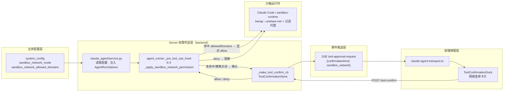
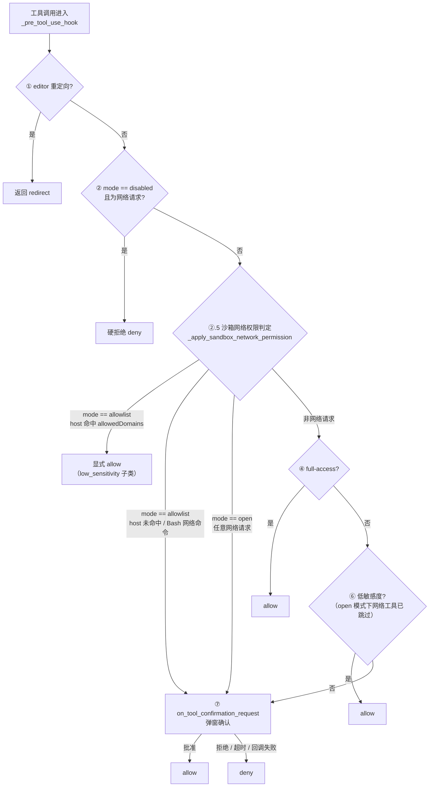
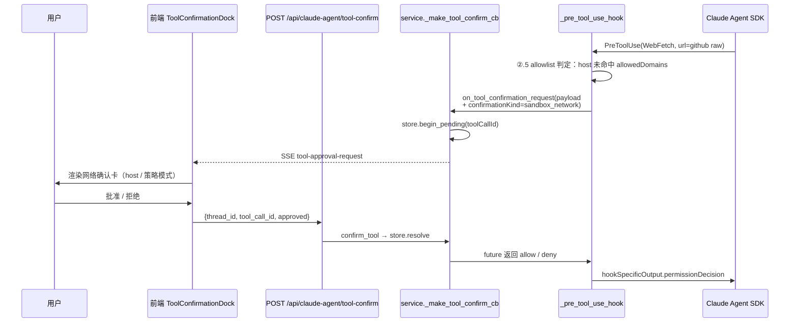

# SandboxPermissionRequest 模块交互图

> 关联设计：`claude-agent-sandbox-network-permission-tool.md`
> 状态：已实现（2026-07-23）——实现与本图一致；步骤 ④（full-access）与
> ⑥（低敏 allow）在存在待审批网络请求时均被跳过（D→G 直连语义）。
> 日期：2026-07-23

## 1. 模块总览

## 2. 判定流程（PreToolUse 决策链）

## 3. 确认时序（policy ON · 未命中域名）

## 4. 三种模式行为对照

| 触发 | disabled | allowlist（命中） | allowlist（未命中） | open |
|---|---|---|---|---|
| WebFetch/WebSearch | 硬拒绝（现状） | 自动放行（新增低敏感度子类） | 弹窗 | 弹窗（每次） |
| 网络类 Bash 命令 | 硬拒绝（现状） | 弹窗（不解析 host，保守） | 弹窗 | 弹窗（每次） |
| 非网络工具 | 现有分类不变 | 现有分类不变 | 现有分类不变 | 现有分类不变 |
