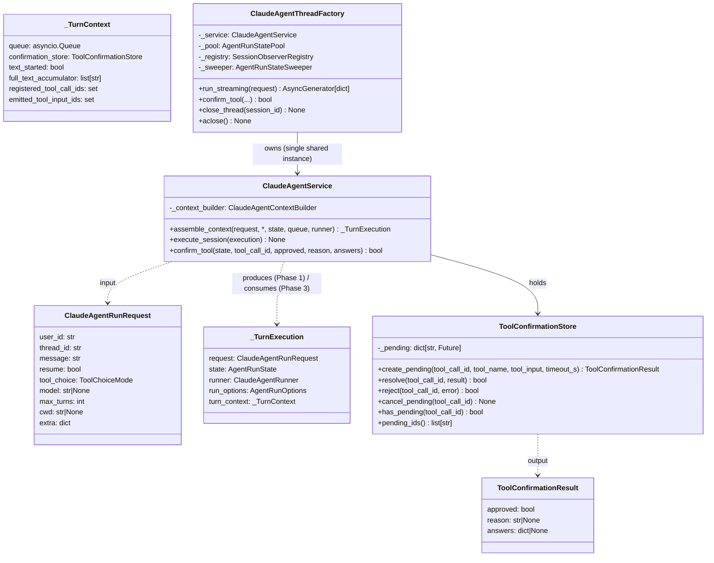
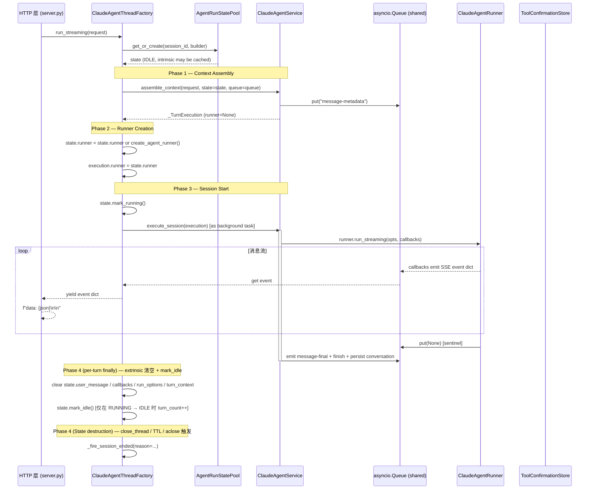
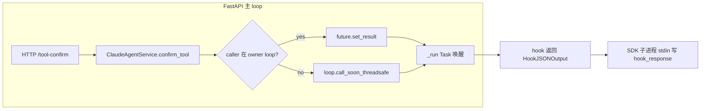
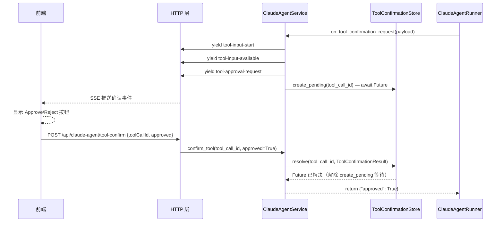

> **迁移来源**: Pawkeyland docs/app/design/ClaudeAgentService 模块设计.md — 路径已适配 Ink & Memory 工程规范。
> **[Sync] 2026-05-24**: 类图与 SSE 事件表对齐当前 service.py：`ClaudeAgentRunRequest` 字段替换为 Ink & Memory 实际字段；`ClaudeAgentService` 移除 `has_pending_tool` / `pending_tool_ids`（Pawkeyland 专属）；`_TurnExecution.turn_context` 字段名修正；SSE 事件表移除 `reasoning-*`（未启用 thinking）、`tool-approval-request.approvalId`（I&M 不发）；新增 `on_tool_event` 改为 `event.type` 分发注记、`_TurnContext` 新增 `registered_tool_call_ids` / `emitted_tool_input_ids`。

# ClaudeAgentService 模块设计

> 来源：从 TypeScript 迁移自 `glide-the/claude-agent-next-kit → app/api/claude-agent`
> 迁移语言：TypeScript → Python
> 落地路径：`backend/claude_agent/`（子包，2026-05-11 完成扁平 → 子包迁移）

> **阅读顺序提示**：本文聚焦 `ClaudeAgentService` 自身的两个 phase-aware 入口（`assemble_context` / `execute_session`）、Tool Confirmation 协议、以及 SSE 事件契约。生产环境的 4 阶段编排、并发 Lock、Observer、Flyweight State、TTL Sweeper 等"会话生命周期"层职责由 `ClaudeAgentThreadFactory` 承担，详见 [`claude-agent-thread-session-patterns.md`](./claude-agent-thread-session-patterns.md)。Service 不再持有 all-in-one 的 `run_streaming` orchestrator——该方法已于 2026-05-11 删除。

---

## 1. 迁移背景与目标

| 项目 | 说明 |
|------|------|
| 源模块 | `glide-the/claude-agent-next-kit` 的 `app/api/claude-agent`（TypeScript / Next.js API Route） |
| 目标模块 | `backend/claude_agent/service.py` + `backend/claude_agent/tool_confirmation_store.py`（Python 3.11+） |
| 依赖 | `backend/claude_agent/` — 已完成迁移的 `ClaudeAgentRunner` Python 包；`infrastructure/persistence/chat.py` — DB 持久化层；`backend/claude_agent/thread_factory.py` — 生产环境的 SSE 入口 |
| 迁移目标 | 1. 等价功能的 Python 服务层；2. 会话持久化（`onFinish` 迁移）；3. `claude_session_id` 续接逻辑；4. 在 `docs/app/design/` 中完整记录模块设计；5. 与 Thread Session（Observer/Flyweight-State/Builder/Factory）四模式协同 |

---

## 2. 模块目录结构

```
backend/claude_agent/
├── __init__.py                  # Re-export 公共符号
├── service.py                   # ClaudeAgentService（phase-aware：assemble_context + execute_session）
├── thread_factory.py            # ClaudeAgentThreadFactory（Factory：生产入口，驱动 4 阶段）
├── thread_pool.py               # AgentRunState / AgentRunStatePool / AgentRunStateSweeper（Flyweight + State）
├── state_builder.py             # AgentRunStateBuilder（Builder：极简 3-setter）
├── observer.py                  # SessionLifecycleObserver / SessionObserverRegistry / LoggingObserver
├── context_builder.py           # ClaudeAgentContextBuilder（system_prompt / user_message 拼接）
└── tool_confirmation_store.py   # ToolConfirmationStore（asyncio.Future 实现）
```

> `backend/claude_agent_service.py` / `backend/tool_confirmation_store.py` 旧扁平路径已删除；引用时请使用 `from backend.claude_agent import ClaudeAgentService, ClaudeAgentThreadFactory, ToolConfirmationStore`。

---

## 3. 核心类图



> _(Pawkeyland 专属，Ink & Memory 中不适用)_

`ClaudeAgentService` 不再暴露 all-in-one orchestrator，只提供两个 phase-aware 方法：

- **`assemble_context(request, *, state, queue, runner)`** — Phase 1 单一所有者（Ink & Memory）。首轮调用 `ClaudeAgentContextBuilder.build_system_prompt(user_id)` 构建 system prompt，写入 `state.system_prompt`（享元缓存）；后续轮复用缓存，跳过重建。构建 `user_message`、`AgentRunOptions`、`_TurnContext`（包含 `registered_tool_call_ids` / `emitted_tool_input_ids` 去重集合），发射初始 `message-metadata` SSE。返回 `_TurnExecution` 载体，`runner` 字段由 Phase 2 填入。
- **`execute_session(execution)`** — Phase 3 纯消费者。构造 5 个 `AgentStreamingCallbacks` 闭包（`on_text_delta`、`on_text_done`、`on_tool_event`、`on_tool_confirmation_request`、`on_error`），驱动 `runner.run_streaming(opts, callbacks)`，emit `message-final` / `finish` / `error`，持久化用户和助手消息到 `chat_messages` 表。

> _(Pawkeyland 专属，Ink & Memory 中不适用)_

---

## 4. 数据流：Factory 驱动的 Phase 1 → 4

> **2026-05-11 重构**：生产链路完全由 `ClaudeAgentThreadFactory._run_lifecycle` 编排。本节描述真实的生产时序；Service 不再独自跑 `_run()` 后台任务。



### 4.1 worker 不变量（队列 + 后台 Task + StreamingResponse 协作）

> [Sync] 2026-05-10: 与「Claude Agent SDK 交互式工具时序图.md」事件循环泳道呼应，明确 manual 模式下 FastAPI 主 loop 不会被任何一条等待路径独占。
> [Sync] 2026-05-10: `server.py` 的 `_event_generator` 在 `claude_agent_thread_factory.run_streaming` 上加了**带超时的下一帧等待 + `: keepalive` 注释帧**（默认 15s，可经 `INK_AGENT_SSE_KEEPALIVE_S` 调），既补 nginx/移动网关的 idle 超时缺口，又保留 Factory 端"队列+后台 Task+StreamingResponse"的 worker-non-blocking 不变量；客户端断开会通过 `agent_iter.aclose()` + `CancelledError` 透传到 Factory 的 `_run_lifecycle.finally`，确保 `cancel_pending` 仍清理 `ToolConfirmationStore` 的 Future。
> [Sync] 2026-05-11: `ClaudeAgentService.run_streaming` 已删除 —— 生产链路改由 `ClaudeAgentThreadFactory._run_lifecycle` 显式驱动 `service.assemble_context` (Phase 1) + `create_agent_runner` (Phase 2) + `service.execute_session` (Phase 3) + 自身 `finally` (Phase 4)。Service 不再有 all-in-one orchestrator。
> [Sync] 2026-05-12: `state.mark_idle()` 仅在 `lifecycle == RUNNING` 时递增 `turn_count`；Phase 1 / Phase 2 失败（未到达 `mark_running`）的 finally 调用只刷新 `last_active_at`，不会让首轮 Mem0 preflight 误命中"已完成"分支（`state.turn_count == 0` gate）。

> _(Pawkeyland 专属，Ink & Memory 中不适用)_

| 不变量 | 实现位置 | 失效后果 |
|---|---|---|
| `execute_task = asyncio.create_task(self._service.execute_session(execution))` 唯一持有 `runner.run_streaming` 协程；它把事件写进**共享的** `asyncio.Queue` 而非直接 yield | `backend/claude_agent/thread_factory.py::_run_lifecycle` | 否则 SDK 错误会沿 `StreamingResponse.body_iterator` 泄漏，BaseHTTPMiddleware 会把 worker 锁住 |
| `execution.ctx.pending_confirmation_ids` 跟踪每个 `on_tool_confirmation_request` 注册的 `tool_call_id`，Factory 的 `finally` 调 `self._service._store.cancel_pending` 清理（封装泄漏，后续应迁到 Service 公开 API） | `backend/claude_agent/thread_factory.py::_run_lifecycle.finally` | 否则客户端断开后 store 残留 Future，下次同 id 再入会触发 `RuntimeError: already has a pending Future` |
| `_run_lifecycle` 用 `except BaseException` 兜底但保留 CancelledError 透传（`_exception_group_contains_cancelled`） | 同上 | 否则 SDK 抛 `BaseExceptionGroup(CancelledError)` 时被吞掉，generator 既不收 sentinel 也不传播取消 |
| `_PureASGIRequestLogger` 替换 `@app.middleware("http")` | `server.py` | 否则 BaseHTTPMiddleware 把 `StreamingResponse.body_iterator` 包进 anyio TaskGroup，与背后挂起的 Future 形成"事件循环 worker 协程槽被占满"现象 |
| `@app.on_event("shutdown")` 调 `claude_agent_thread_factory.aclose()` | `server.py` | 否则 TTL sweeper 无法干净停止，SDK 子进程句柄留给 GC，shutdown 不会发出 Phase 4 `reason="factory_aclose"` 事件 |

### 4.2 跨边界 resolve 流向



---

## 5. 工具确认流程（交互工具确认）

> **宠物动作（动画事件）说明**：当 LLM 调用 `AskUserQuestion` 工具且 `input` 包含
> `{ act, duration, interaction }` 时，为动画事件确认流程。前端动画层播放完成后
> 调用 `confirm_tool(tool_call_id, approved=True, answers={trigger, choiceId?, elapsedMs?})`。
> 详细状态机见 [LLM 驱动动画事件图设计方案](./LLM驱动动画事件图设计方案.md)。

> _(Pawkeyland 专属，Ink & Memory 中不适用)_



---

## 6. TypeScript → Python 关键映射

> 所有 Python 列引用的路径均已迁到 `backend/claude_agent/` 子包；与"假设 `backend/claude_agent_service.py` 还在"的旧文档不同，下表反映 2026-05-11 重构后的真实状态。

| TypeScript（route.ts）| Python（backend/claude_agent/）| 说明 |
|---|---|---|
| `createUIMessageStream({ execute })` | `service.assemble_context()` 构造 `_TurnExecution` 载体 + `service.execute_session()` 驱动 runner；二者由 `thread_factory._run_lifecycle` 串联 | Factory 边读 `execution.queue` 边 yield；Service 端没有独立的 AsyncGenerator |
| `writer.write(part)` | `queue.put_nowait(event)` | 向**共享** `asyncio.Queue` 写入事件 dict（Factory 和 Service 共用同一队列）|
| `streamedParts.push({ ...part })` | `response_parts.append(copy.copy(event))` in `_TurnContext._put` | SSE parts 采集（用于持久化） |
| `extractTextFromParts(...)` | `"".join(full_response_text)` | 响应文本聚合 |
| `createId("msg")` | `str(uuid4())` | 消息 ID 生成 |
| `createPendingToolConfirmation(id, name, input)` | `await store.create_pending(...)` | 创建 Future 并阻塞等待 |
| `resolvePendingToolConfirmation(id, result)` | `store.resolve(id, result)` | 设置 Future 结果 |
| `req.signal.aborted` / `AbortController` | `task.cancel()` / `asyncio.CancelledError` 经 `_run_lifecycle.finally` 处理 | 中止信号处理 |
| `setInterval(heartbeat)` | 由 HTTP 层（`server.py::_event_generator`）的 keepalive 注释帧处理 | SSE 心跳由 FastAPI StreamingResponse 管理 |
| `getConversationById(conversationId)` | `await asyncio.to_thread(load_conversation_by_persona, user_id, persona_id)` in `service.assemble_context` | pre-run 加载现有会话；后续轮在享元短路时跳过 |
| `shouldResume = !!existingConversation?.claude_session_id` | `should_resume = bool(request.resume and existing_claude_session_id and agent_contract_version matches)` | 续接判断；空 assistant、跨日会话、旧工具 transcript（如已移除的 `mcp__necklace__get_pet_live_context`）都会新开 SDK session |
| `threadIdForAgent = existingConversation?.claude_session_id ?? conversationId` | `thread_id_for_agent = existing_claude_session_id or None`（首轮不传 thread_id，Runner 自动生成） | 续接 ID |
| `capturedSessionId = result.sessionId` | `captured_session_id = result.session_id` | 捕获 SDK 会话 ID |
| `onFinish({ responseMessage })` → `createConversation` / `updateConversation` | `await asyncio.to_thread(_persist_conversation, upsert_conversation_by_persona, ...)` in `service.execute_session` | 会话持久化（post-run）|

> _(Pawkeyland 专属，Ink & Memory 中不适用)_

详细持久化设计见：[claude-agent-session-persistence.md](./claude-agent-session-persistence.md)

---

## 7. SSE 事件类型（Ink & Memory 实际发射）

| 事件类型 | 触发场景 | 关键字段 |
|---|---|---|
| `message-metadata` | 流开始（Phase 1） | `sessionId`, `turnIndex` |
| `text-start` | 首个文本 delta 前（`on_text_delta` 内自动发射） | `id`（固定 `"text-0"`） |
| `text-delta` | 文本增量 | `id`, `delta` |
| `text-end` | 文本块结束（`on_text_done` 或工具事件前） | `id` |
| `reasoning-start` | thinking 块开始（`thinking_delta` / `thinking` 触发） | `id` |
| `reasoning-delta` | thinking 内容增量 | `id`, `delta` |
| `reasoning-end` | thinking 块结束（`content_block_stop` / `thinking` 触发） | `id` |
| `tool-input-start` | 工具调用开始（`tool_use_start` / `tool_input_available` 触发） | `toolCallId`, `toolName` |
| `tool-input-available` | 工具输入完整（`tool_input_available` 触发） | `toolCallId`, `toolName`, `input` |
| `tool-approval-request` | 交互工具等待确认（`tool_choice="manual"`） | `toolCallId`, `toolName`, `input` |
| `tool-output-available` | 工具执行结果（`tool_result` 触发） | `toolCallId`, `output`, `isError` |
| `message-final` | 流成功结束前 | `text`, `usage`, `sessionId` |
| `finish` | 流结束 | `finishReason`（`"stop"` 或 `"error"`） |
| `error` | 任意异常 | `errorText` |

> **`on_tool_event` 分发模式**（2026-05-24 对齐 Pawkeyland）：回调按 `ToolEventPayload.type` 分发（`tool_use_start`、`tool_input_available`、`tool_result`），而非旧的 `payload.state` 分发。`result`、`thinking`、`message_*`、`tool_progress` 等类型在 Ink & Memory 中明确忽略。
>
> **与 Pawkeyland 差异**：Pawkeyland 还额外发射 `reasoning-start/delta/end`（thinking 模式）、`message-metadata.unstableData`、`tool-approval-request.approvalId`，Ink & Memory 均未启用。详细对比见 [`claude-agent-api-contracts.md §4.5.3`](./claude-agent-api-contracts.md)。

---


## 10. 上下文拼接扩展

详见 [`claude-agent上下文拼接设计.md`](./claude-agent上下文拼接设计.md)：系统提示词、用户工具、外部数据注入、动态策略（贴图、动作动画）的完整设计。

> _(Pawkeyland 专属，Ink & Memory 中不适用)_

---

## 8. 使用示例

```python
import asyncio
import json
from fastapi import FastAPI, HTTPException
from fastapi.responses import StreamingResponse
from backend.claude_agent import ClaudeAgentThreadFactory, ClaudeAgentRunRequest

app = FastAPI()
claude_agent_thread_factory = ClaudeAgentThreadFactory()

@app.on_event("shutdown")
async def _shutdown_thread_factory() -> None:
    # Stop the background keepalive sweeper and release every cached
    # SDK runner subprocess handle on graceful shutdown.
    await claude_agent_thread_factory.aclose()

@app.post("/api/claude-agent")
async def claude_agent(user_id: str, thread_id: str, message: str):
    request = ClaudeAgentRunRequest(
        user_id=user_id,
        thread_id=thread_id,
        message=message,
        max_turns=10,
        tool_choice="auto",
    )

    async def event_generator():
        # Factory drives Phase 1 → 4 internally:
        #   service.assemble_context → create_agent_runner → service.execute_session
        async for event in claude_agent_thread_factory.run_streaming(request):
            yield f"data: {json.dumps(event, ensure_ascii=False)}\n\n"

    return StreamingResponse(
        event_generator(),
        media_type="text/event-stream",
        headers={"Cache-Control": "no-cache", "X-Accel-Buffering": "no"},
    )

@app.post("/api/claude-agent/tool-confirm")
async def tool_confirm(tool_call_id: str, approved: bool, reason: str = ""):
    ok = claude_agent_thread_factory.confirm_tool(
        session_id="",  # API symmetry; lookup is by tool_call_id
        tool_call_id=tool_call_id,
        approved=approved,
        reason=reason or None,
    )
    if not ok:
        raise HTTPException(404, f"No pending confirmation for {tool_call_id}")
    return {"success": True, "toolCallId": tool_call_id, "approved": approved}
```

---

## 9. 依赖关系

| 包 / 模块 | 说明 |
|---|---|
| `backend.claude_agent` | ClaudeAgentRunner、AgentRunOptions、AgentStreamingCallbacks、ToolEventPayload |
| `infrastructure.persistence.chat` | `load_conversation`（pre-run 加载会话）、`upsert_conversation`（post-run 持久化） |
| `asyncio` | asyncio.Queue（事件桥接）、asyncio.Future（工具确认阻塞）、asyncio.Task（后台运行）、asyncio.to_thread（DB 同步操作异步化）|
| `uuid` | uuid4() 用于生成 ID |
| `copy` | copy.copy() 用于 response_parts 快照 |
| `datetime` | datetime.now(timezone.utc).isoformat() 用于时间戳 |
| Python 3.12 标准库 | 无第三方新增依赖 |

---

## 10. Thread Session 扩展（ClaudeAgentThreadFactory）

> 详细设计见 `docs/app/design/claude-agent-thread-session-patterns.md`

`ClaudeAgentService` 是所有业务逻辑的核心实现，但只暴露两个 phase-aware 方法：`assemble_context`（Phase 1）和 `execute_session`（Phase 3）。
`ClaudeAgentThreadFactory`（2026-05-11 新增）在其基础上封装了 4 阶段生命周期、并发隔离、Observer 钩子、享元状态池、TTL 后台 sweeper 等能力，并通过显式调用 Service 的两个 phase-aware 方法（而不是任何 all-in-one orchestrator）来串起 SSE 业务逻辑（DB、Mem0、贴纸过滤、session rollover、reasoning 事件、keepalive、message-final）。

> _(Pawkeyland 专属，Ink & Memory 中不适用)_

### 10.1 与 Service 的职责对比

| 能力 | ClaudeAgentService | ClaudeAgentThreadFactory |
|------|--------------------|--------------------------|
| 业务逻辑（DB/Mem0/贴纸/rollover/etc.） | 内置 | ✅ 委托给内部 service 实例 |
| 并发隔离 | 无 | `asyncio.Lock` per `session_id` (FIFO) |
| 生命周期钩子 | 无 | `SessionObserverRegistry`（8 个钩子） |
| 状态追踪 | 无状态 | `AgentRunStatePool`（turn_count / IDLE/RUNNING） |
| 工具确认 | `self._store` 直接管理 | 委托给 `self._service.confirm_tool()` |

> _(Pawkeyland 专属，Ink & Memory 中不适用)_

### 10.2 使用 Factory 替换 Service（渐进迁移）

```python
# 应用启动时
factory = ClaudeAgentThreadFactory()
factory.register_observer(LoggingObserver())

# HTTP 流式端点（与 Service 完全相同的 SSE 事件合同）
async for event in factory.run_streaming(request):
    yield f"data: {json.dumps(event)}\\n\\n"

# 工具确认端点（委托给内置 ClaudeAgentService）
ok = factory.confirm_tool(session_id, tool_call_id, approved=True)
```

### 10.3 设计模式组成与代码位置

```
backend/claude_agent/          ← 子包，所有 Claude Agent 业务在此处
├── observer.py      Observer   → SessionLifecycleObserver / SessionObserverRegistry / LoggingObserver
├── thread_pool.py   Flyweight+State → AgentRunLifecycle / AgentRunState / AgentRunStatePool
├── state_builder.py Builder   → AgentRunStateBuilder
├── thread_factory.py Factory  → ClaudeAgentThreadFactory (直接驱动 service.assemble_context + service.execute_session)
├── service.py                 → ClaudeAgentService（主链路）
├── context_builder.py         → ClaudeAgentContextBuilder
└── tool_confirmation_store.py → ToolConfirmationStore
```
