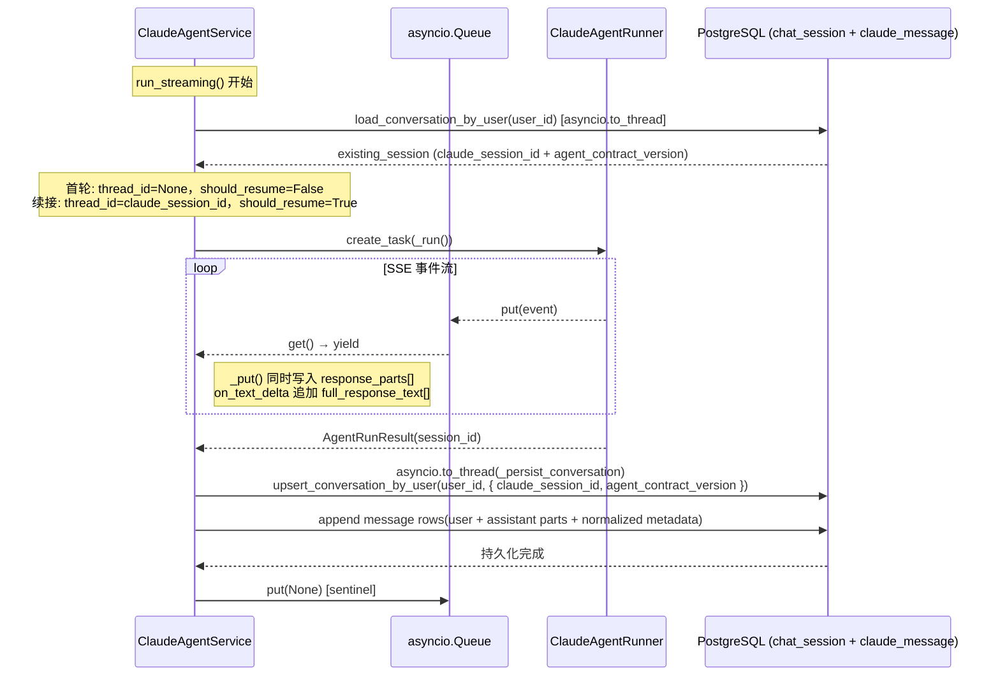

> **迁移来源**: Pawkeyland docs/app/design/claude-agent-session-persistence.md — 路径和环境变量已适配 Ink & Memory 工程规范。

# Claude Agent 会话持久化设计

> **迁移来源**: Pawkeyland docs/app/design/claude-agent-session-persistence.md — 路径和环境变量已适配 Ink & Memory 工程规范。

> **来源**：从 TypeScript 迁移自 `glide-the/claude-agent-next-kit → app/api/claude-agent/route.ts`（`onFinish` 回调 + `getConversationById` / `createConversation` / `updateConversation`）  
> **迁移语言**：TypeScript → Python  
> **落地路径**：`（Ink & Memory 中尚未实现，可按此设计扩展）`（DB 层）、`backend/claude_agent/service.py`（服务层）、`backend/claude_agent/thread_factory.py`（Thread Session 工厂层）
>
> **关联设计**：[claude-agent-thread-session-patterns.md](./claude-agent-thread-session-patterns.md)
>
> **会话持久化分两层**：
>
> | 层 | 落地 | 生命周期 | 作用 |
> |---|---|---|---|
> | **进程内 Thread Session（享元 + 状态）** | `backend/claude_agent/thread_pool.py::AgentRunStatePool` | `INK_AGENT_TTL_S`（默认 600 s）keepalive；TTL 超时 / `close_thread` / `aclose` 销毁 | 在上下文加载之前维护一个绑定到 `session_id` 的 `ClaudeAgentRunner` + 已组装的 `system_prompt` / `cwd`，后续轮次只通过 `session_id` 复用，不再重复构造 |
> | **DB 持久化（chat_session + claude_message）** | `（Ink & Memory 中尚未实现，可按此设计扩展）` | 与业务身份 `user_id` 同生命周期 | 跨进程 / 跨重启的真源；保存 Claude SDK `claude_session_id` 用于 SDK 续接（resume）、`agent_contract_version` 用于会话契约校验、message 行用于历史回放 |

---

## 1. 迁移背景与目标

| 项目 | 说明 |
|------|------|
| 源模块 | `glide-the/claude-agent-next-kit` → `app/api/claude-agent/route.ts` 的 `onFinish` 回调；`app/lib/db.ts` 的 `conversations` 表 DB 层 |
| 目标模块 | `（Ink & Memory 中尚未实现，可按此设计扩展）` 新增 `load_conversation` / `upsert_conversation`；`backend/claude_agent/service.py` 新增 pre-run 加载 + post-run 持久化（Phase 1 / Phase 3） |
| 迁移目标 | 1. `chat_session` 只保存会话 metadata + `claude_session_id`；2. `claude_message` 以一条消息一行保存 user/assistant 明细和顶层 `parts`；3. 支持 Claude SDK 会话续接（resume via `chat_session.claude_session_id`） |

---

## 2. 数据库设计

### 2.1 源项目（claude-agent-next-kit） `conversations` 表

```typescript
// app/lib/db/schema.ts
export const conversations = pgTable("conversations", {
  id: text("id").primaryKey(),
  title: text("title"),
  status: text("status"),
  created_at: timestamp(...),
  updated_at: timestamp(...),
  messages: jsonb("messages").$type<Conversation["messages"]>(),
  attachments: jsonb("attachments"),
  context_customer_ids: text("context_customer_ids").array(),
  ai_outputs: jsonb("ai_outputs"),
  linked_customer_id: text("linked_customer_id"),
  /** Claude SDK session_id for resuming conversations */
  claude_session_id: text("claude_session_id")
});
```

### 2.2 迁移方案：normalized `chat_session + claude_message`

> 设计原则：保留一套表名，但采用 claude-runner / better-chatbot 的职责分离：`chat_session` 不存 transcript，`claude_message` 是唯一消息真源。

```sql
CREATE TABLE IF NOT EXISTS chat_session (
    chat_id            TEXT        PRIMARY KEY,
    user_id            TEXT        NOT NULL DEFAULT '',
    title              TEXT        NOT NULL DEFAULT '与 AI 的对话',
    status             TEXT        NOT NULL DEFAULT 'pending',
    claude_session_id  TEXT,
    agent_contract_version TEXT    NOT NULL DEFAULT '',
    created_at         TIMESTAMPTZ NOT NULL DEFAULT NOW(),
    updated_at         TIMESTAMPTZ NOT NULL DEFAULT NOW()
);

CREATE TABLE IF NOT EXISTS claude_message (
    message_id   TEXT PRIMARY KEY,
    chat_id      TEXT NOT NULL REFERENCES chat_session(chat_id) ON DELETE CASCADE,
    user_id      TEXT NOT NULL DEFAULT '',
    role         TEXT NOT NULL,
    content_type TEXT NOT NULL DEFAULT 'text',
    content      TEXT NOT NULL DEFAULT '',
    parts        JSONB NOT NULL DEFAULT '[]'::jsonb,
    media_url    TEXT NOT NULL DEFAULT '',
    extra        JSONB NOT NULL DEFAULT '{}'::jsonb,
    created_at   TIMESTAMPTZ NOT NULL DEFAULT NOW()
);
```

> _(Pawkeyland 专属字段 `persona_id` / `pet_id` / `pet_name` 已从 Ink & Memory 版 schema 中移除，以 `user_id` 作为唯一会话键)_

当前 schema bootstrap 只声明活动表和必要索引：

```sql
ALTER TABLE chat_session ADD COLUMN IF NOT EXISTS title TEXT NOT NULL DEFAULT '与 AI 的对话';
ALTER TABLE chat_session ADD COLUMN IF NOT EXISTS status TEXT NOT NULL DEFAULT 'pending';
ALTER TABLE chat_session ADD COLUMN IF NOT EXISTS claude_session_id TEXT;
ALTER TABLE chat_session ADD COLUMN IF NOT EXISTS agent_contract_version TEXT NOT NULL DEFAULT '';
ALTER TABLE claude_message ADD COLUMN IF NOT EXISTS parts JSONB NOT NULL DEFAULT '[]'::jsonb;

-- 如果历史消息表已存在但缺对应 chat_session，先按 chat_id 回填 metadata 占位行，
-- 再添加 claude_message.chat_id -> chat_session.chat_id 的 FK cascade。
INSERT INTO chat_session (...)
SELECT ...
FROM claude_message
LEFT JOIN chat_session ON chat_session.chat_id = claude_message.chat_id
WHERE chat_session.chat_id IS NULL
GROUP BY claude_message.chat_id
ON CONFLICT (chat_id) DO NOTHING;
```

> **当前口径**：`claude_message` 是 Claude Agent user/assistant 消息真源，供历史回放、评测使用；`chat_session` 只负责会话 metadata、`claude_session_id` 和 `agent_contract_version`。

---

## 3. `claude_message.parts` 格式

```python
ChatMessage = {
    "message_id": str,      # uuid4()
    "chat_id": str,
    "role": "user" | "assistant",
    "content": str,         # 纯文本摘要（用于检索/展示）
    "parts": list[dict],    # 顶层 JSONB；assistant 为 SSE 事件流副本
    "created_at": str,      # ISO 8601
}
```

### parts 格式（assistant 消息）

assistant 消息的 `parts` 存储的是 SSE 事件流副本，类型与 route.ts `streamedParts` 对齐：

| part type | 说明 | 关键字段 |
|-----------|------|----------|
| `text-start` | 文本块开始 | `id` |
| `text-delta` | 文本增量 | `id`, `delta` |
| `text-end` | 文本块结束 | `id` |
| `reasoning-start/delta/end` | 思考链 | `id`, `delta` |
| `tool-input-start` | 工具调用开始 | `toolCallId`, `toolName` |
| `tool-input-available` | 工具入参完整 | `toolCallId`, `input` |
| `tool-output-available` | 工具执行结果 | `toolCallId`, `output` |

> `finish`、`error`、`message-metadata` 类型不存入 `parts`（与 route.ts `streamedParts` 过滤规则一致）。

---

## 4. 会话续接（Resume）设计

### 4.1 源项目（route.ts）逻辑

```typescript
let shouldResume = false;
let threadIdForAgent = conversationId;
if (resume) {
    shouldResume = !!existingConversation?.claude_session_id;
    threadIdForAgent = existingConversation?.claude_session_id ?? conversationId;
}
const result = await agentRunner.runStreaming({ threadId: threadIdForAgent, resume: shouldResume, ... });
capturedSessionId = result.sessionId;
// onFinish:
conversationData.claude_session_id = capturedSessionId ?? existingConversation?.claude_session_id;
```

### 4.2 Python 实现（`backend/claude_agent/service.py`）

```python
# pre-run—以 user_id 为键查询，不再依赖请求方传入 conversation_id
existing_session = await asyncio.to_thread(
    load_conversation_by_user, request.user_id
)
existing_claude_session_id = (existing_session or {}).get("claude_session_id")
should_resume = bool(request.resume and existing_claude_session_id and agent_contract_version matches)
# 首轮：thread_id=None，Runner 自动分配新 session_id
# 续接：thread_id=claude_session_id（来自 DB）
thread_id_for_agent = existing_claude_session_id if should_resume else None

# opts
opts = AgentRunOptions(
    thread_id=thread_id_for_agent,
    resume=should_resume,
    ...
)

# post-run—将 Runner 返回的 session_id 绑定到 user_id 会话表
captured_session_id = result.session_id
await asyncio.to_thread(
    _persist_conversation, upsert_conversation_by_user,
    user_id=request.user_id,
    claude_session_id=captured_session_id, ...
)
```

---

## 5. 会话持久化时序图（onFinish 迁移）



---

## 6. 新增 DB 层函数

### `load_conversation_by_user(user_id) → Optional[dict]`

以 `user_id` 为键，从 `chat_session` 表加载会话 metadata（含 `claude_session_id` 和 `agent_contract_version`）。
不再使用外部传入的 `conversation_id`，落地为单一用户对应唯一活跃会话的设计目标。

对照来源：`app/lib/db.ts` → `getConversationById(id)`，但改用 `user_id` 为查找键。

> _(Pawkeyland 中为 `load_conversation_by_persona(user_id, persona_id)`，Ink & Memory 简化为单 user_id 键)_

### `upsert_conversation_by_user(user_id, data: dict) → dict`

按 `user_id` 键 UPSERT `chat_session` 表，更新 `claude_session_id`、`agent_contract_version`、`title`、`status` 等 metadata。该函数不接受也不返回 transcript。
`chat_session.chat_id` 如未设置则在首轮自动生成（`uuid4()`）。

对照来源：`app/lib/db.ts` → `createConversation` / `updateConversation`（合并为单 UPSERT）

---

## 7. TypeScript → Python 关键映射

| TypeScript（route.ts / db.ts） | Python（chat.py / `backend/claude_agent/service.py`） | 说明 |
|---|---|---|
| `getConversationById(conversationId)` | `load_conversation_by_user(user_id)` | pre-run 加载；改用 user_id 查询 |
| `existingConversation?.claude_session_id` | `existing_session.get("claude_session_id")` | 续接 ID |
| `shouldResume = !!existingConversation?.claude_session_id` | `should_resume = bool(request.resume and existing_claude_session_id and agent_contract_version matches)` | 续接判断 |
| `threadIdForAgent = existingConversation?.claude_session_id ?? conversationId` | `thread_id_for_agent = existing_claude_session_id or None`（首轮不传 thread_id） | 续接 ID |
| `streamedParts.push({ ...part })` | `response_parts.append(copy.copy(event))` 在 `_put()` 中 | parts 采集 |
| `extractTextFromParts(responseMessage.parts)` | `"".join(full_response_text)` | 响应文本 |
| `onFinish({ responseMessage })` | `await asyncio.to_thread(_persist_conversation, ...)` | 异步持久化 |
| `createConversation(data)` / `updateConversation(data)` | `upsert_conversation(data)` | 合并写入 |
| `conversation.messages` JSONB | `claude_message.parts` rows | `claude_message` 是消息真源 |
| `conversation.claude_session_id` | `chat_session.claude_session_id` | 续接字段 |
| `conversations` 表（独立） | `chat_session` 表（扩展） | Ink & Memory 只保留 user_id |

---

## 8. 消息去重规则

当前主链路只从 `claude_message` 读取 user/assistant 明细。本轮消息通过
消息写入 helper 写入 `claude_message`，以 `message_id` 作为幂等键：

```sql
INSERT INTO claude_message (...) VALUES (...)
ON CONFLICT (message_id) DO NOTHING
```

这把重试去重放在 DB 层处理，避免读出整段消息数组后再覆盖写回。

---

## 9. 降级策略

* **DB 不可用**：`_session.py` 自动 fallback 到 `_SESSIONS` 内存字典，持久化逻辑不变，重启后丢失。
* **持久化失败**：`_persist_conversation` 内部 catch 所有异常并记录 WARNING 日志，不影响 SSE 流式响应的正常推送。
* **`claude_session_id` 丢失**：若本次 `result.session_id` 为空，回退到 `existing_session.claude_session_id`，保障已有续接 ID 不丢失。

---

## 10. Thread Session — 进程内 sessionId 享元层

> 本节描述在 §1–§9 持久化合同之上新增的"进程内 Thread Session"模型。  
> 详细模式拆解（Observer / Flyweight + State / Builder / Factory）见
> [claude-agent-thread-session-patterns.md](./claude-agent-thread-session-patterns.md)。

### 10.1 设计目标

回到任务起点：

```
上下文加载之前 → 创建 Thread，发送一次 [工作空间初始化 + 系统上下文]
后续每轮       → 只通过 sessionId 复用 Runner / system_prompt / cwd，
                仅重建本轮 user_message / callbacks / AgentRunOptions / _TurnContext
单 sessionId  → 通过 asyncio.Lock 串行排队，单消费者保障
```

> _(Pawkeyland 原文还包含 `persisted_pet_info` / `mem0_user_id` / `resolved_identity` 的享元缓存，Ink & Memory 中不适用)_

为此引入两条配套机制：

1. **进程内享元（Flyweight + State）**：`AgentRunState` 把 runner 运行所需的全部组件（intrinsic + extrinsic）按 `session_id` 享元缓存，由 `AgentRunStatePool` 统一持有。
2. **生命周期观察者（Observer）**：`SessionLifecycleObserver` 8 钩子（4 阶段 × before/after），让 Factory 作为生产者驱动相位，让 ClaudeAgentService 作为消费者承接业务，工厂模式与服务实际业务在类型层面对齐解耦。

### 10.2 sessionId ↔ DB 持久化身份映射

```text
HTTP 请求体
  user_id
        │
        ▼
canonical { user_id }        ← Service.assemble_context Phase 1 首轮解析
        │
        ├──► chat_session(user_id)    ← DB 主键（§2.2）
        │       └─ claude_session_id  ← Claude SDK 续接 ID（§4）
        │       └─ agent_contract_version  ← 续接合约版本（§4）
        │
        └──► session_id = f"{user_id}"    ← 进程内 Thread Session 享元键
                ├─ AgentRunStatePool 中的 AgentRunState 实例
                ├─ workspace_key（get_or_create_workspace 输入）
                └─ asyncio.Lock per session_id（FIFO 单消费者）
```

> _(Pawkeyland 原文中包含 `IdentityService.resolve_real_pet / resolve_system_persona` 以及 `persona_id` 复合键，Ink & Memory 中不适用)_

> **关键约束**：
>
> - `session_id`（进程内享元键）只承载 *runner 运行时缓存*，不承载消息真源；
> - `claude_session_id`（DB 字段）承载 *Claude SDK 跨进程续接 ID*，是 `AgentRunOptions.thread_id` 的真源；
> - 两者互为正交：销毁享元（`close_thread` / TTL / `aclose`）不影响 `claude_session_id`，下一轮 SDK 仍可基于 DB 中的 `claude_session_id` 续接对话；同理，DB 端 rollover（`agent_contract_version` 升级）不影响享元缓存的 `system_prompt` / `cwd`。

### 10.3 4 阶段生命周期与持久化的接合点

> Phase 命名见 [claude-agent-thread-session-patterns.md §2](./claude-agent-thread-session-patterns.md#2-生命周期模型4-个阶段)。

| Phase | Factory 触发点 | Service 持久化交互 |
|---|---|---|
| **Phase 1 — Context Assembly**（每轮，首轮全量 / 续轮享元短路） | `Service.assemble_context(request, state, queue)` | DB pre-run 加载：`load_conversation_by_user(user_id)` 取出 `claude_session_id` + `agent_contract_version`，决定 `should_resume` / `thread_id_for_agent`（§4）；首轮额外构建 `system_prompt` / `cwd`，续轮全部走享元短路。 |
| **Phase 2 — Runner Creation**（首轮 / TTL 重建后第一轮） | `state.runner = create_agent_runner()` | 不直接 DB 交互；`state.runner` 实例按 `session_id` 享元，TTL 内复用，避免每轮新建 SDK 子进程句柄。 |
| **Phase 3 — Session Start**（每轮） | `Service.execute_session(execution)` | 驱动 `runner.run_streaming(opts, callbacks)`；run 完成后 `_persist_conversation`：UPSERT `chat_session.claude_session_id` + `agent_contract_version`，APPEND `claude_message` 行（user + assistant + parts，幂等键 `message_id`）。 |
| **Phase 4 — Session End**（State 销毁，**非每轮**） | `_fire_session_ended` 在 `close_thread` / TTL Sweeper / `aclose` 三条路径上各发一次 | 享元销毁不会触发 DB 变更；DB 中的 `claude_session_id` / `agent_contract_version` / `claude_message` 行保持原状，下一轮 `Service.assemble_context` 重新加载即可。 |

> **每轮收尾 ≠ Phase 4**：每轮 `_run_lifecycle.finally` 只清空 extrinsic 三件套（`state.user_message` / `state.callbacks` / `state.run_options` / `state.turn_context`）并 `state.mark_idle()` 刷新 `last_active_at`，**不发** `emit_*_session_ended`。State 仍以 IDLE 留在 keepalive 缓存中，等待下一轮复用或 TTL 销毁。

### 10.4 时序图（Thread Session + 持久化）

```mermaid
sequenceDiagram
    participant Client as HTTP 调用方
    participant Factory as ClaudeAgentThreadFactory
    participant Pool as AgentRunStatePool
    participant State as AgentRunState
    participant Svc as ClaudeAgentService
    participant DB as chat_session + claude_message
    participant Runner as ClaudeAgentRunner
    participant SDK as Claude Code SDK

    Client->>Factory: run_streaming(turn_1)
    Factory->>Pool: get_or_create(session_id) — 新建 State (turn_count=0)
    Factory->>Svc: assemble_context(request, state, queue)  ← Phase 1（首轮）
    Svc->>Svc: build_system_prompt + get_or_create_workspace → state.system_prompt + state.cwd
    Svc->>DB: load_conversation_by_user(user_id)
    DB-->>Svc: existing_session (claude_session_id, agent_contract_version)
    Note over Svc: should_resume=False (首轮);<br/>thread_id_for_agent=None (SDK 自动分配 sessionId)
    Svc->>Svc: 构造 AgentRunOptions / 5 callbacks / _TurnContext → state.{run_options, callbacks, turn_context}
    Factory->>Runner: create_agent_runner() → state.runner   ← Phase 2（首轮）
    Factory->>Svc: execute_session(execution)                ← Phase 3
    Svc->>Runner: runner.run_streaming(opts, callbacks)
    Runner->>SDK: query_stream(...)
    SDK-->>Runner: AgentRunResult(session_id=cs_001)
    Runner-->>Svc: result.session_id
    Svc->>DB: _persist_conversation:<br/>UPSERT chat_session.claude_session_id=cs_001, agent_contract_version=v1<br/>APPEND user + assistant claude_message
    Svc->>Factory: queue.put(None) sentinel
    Factory->>State: 清空 extrinsic + mark_idle (turn_count=1, last_active_at 刷新)
    Note over State: lifecycle=IDLE, intrinsic 全部保留
    Factory-->>Client: SSE 完整事件流

    Note over Client,SDK: 5 分钟后 (< TTL)，turn_2 到来

    Client->>Factory: run_streaming(turn_2)
    Factory->>Pool: get_or_create(session_id) — 复用 State (turn_count=1)
    Factory->>Svc: assemble_context(request, state, queue)  ← Phase 1（续轮）
    Note over Svc: 享元短路全开:<br/>state.system_prompt / state.cwd 全部命中,<br/>仅重建 user_message / AgentRunOptions / callbacks / _TurnContext
    Svc->>DB: load_conversation_by_user → existing.claude_session_id=cs_001
    Note over Svc: should_resume=True;<br/>thread_id_for_agent=cs_001 (SDK 续接同一会话)
    Factory->>Runner: 复用 state.runner（不再 create_agent_runner）   ← Phase 2 命中享元
    Factory->>Svc: execute_session(execution)                            ← Phase 3
    Svc->>Runner: runner.run_streaming(opts.thread_id=cs_001, opts.resume=True, ...)
    Runner->>SDK: query_stream(... resume cs_001)
    SDK-->>Runner: AgentRunResult(session_id=cs_001)
    Svc->>DB: _persist_conversation:<br/>UPSERT (chat_session.claude_session_id 已是 cs_001 → 幂等)<br/>APPEND user + assistant claude_message
    Factory-->>Client: SSE 完整事件流

    Note over Client,State: 11 分钟后 (> TTL=600s)，turn_3 到来

    Client->>Factory: run_streaming(turn_3)
    Factory->>Pool: evict_expired() → 销毁 IDLE+过期 State
    Factory->>Pool: on_evicted → _fire_session_ended(reason="ttl_expired")  ← Phase 4
    Factory->>Pool: get_or_create(session_id) — 重新构造 State (turn_count=0)
    Note over Factory,Svc: assemble_context 走首轮全量重建,<br/>但 DB 中 chat_session.claude_session_id=cs_001 仍在,<br/>SDK 仍可续接到同一 Claude 会话
```

### 10.5 与单一持久化层的差异

| 维度 | 仅 §1–§9 持久化层 | §10 Thread Session + §1–§9 持久化层 |
|---|---|---|
| 每轮上下文构建 | 全量重建 `system_prompt` / `cwd` | 首轮构建并享元缓存；续轮 / TTL 内零成本复用 |
| Runner 实例 | 每轮 `create_agent_runner()` | 首轮创建并按 `session_id` 享元；TTL 内复用 SDK 子进程句柄 |
| Workspace 初始化 | 每轮 `get_or_create_workspace()` 检查并刷新模板 | 首轮调用并把 path 缓存到 `state.cwd`；续轮直接读 |
| 并发请求 | 无串行保障，可能 race | `asyncio.Lock` per `session_id`，FIFO 单消费者 |
| Phase 边界观测 | 无 | Observer 8 钩子在四阶段 before/after 精确发火 |
| `claude_session_id` 复用 | DB 一次性查询 | DB 查询 + 享元 `state.runner` SDK 子进程复用，双层节流 |
| 资源释放 | 进程退出 GC | TTL 自动驱逐 + `close_thread` 显式 + `aclose` 优雅停机三条路径，可观测 |

### 10.6 失效与重建场景

| 场景 | 享元缓存动作 | DB 持久化动作 | SDK 续接 |
|---|---|---|---|
| **TTL 超时（10 min IDLE）** | Sweeper 销毁 `AgentRunState`，清空 runner / system_prompt / cwd；触发 Phase 4 (`reason="ttl_expired"`) | 不变；`chat_session.claude_session_id` 保留 | 下一轮 Phase 1 重新加载 `claude_session_id`，SDK 仍按 `thread_id=claude_session_id` + `resume=True` 续接同一对话 |
| **`close_thread(session_id)` 显式关闭** | 立即销毁；触发 Phase 4 (`reason="explicit_close"`，`turn_count` 携带快照) | 不变 | 同上 |
| **`aclose()` 进程优雅停机** | Sweeper `destroy_all` 销毁所有 session；触发 Phase 4 (`reason="factory_aclose"`) | 不变 | 进程重启后下一轮重新建立享元，DB 续接 |
| **`agent_contract_version` 升级** | 享元缓存的 `state.agent_contract_version` 与新版本不一致 → Service 自然走"首轮全量重建"分支 | DB 中旧 `claude_session_id` 因合约版本不一致被 Service 拒绝复用，新轮次 SDK 自动分配新 `session_id`，UPSERT 覆盖 | 不续接，开新会话 |

### 10.7 与 §4 Resume 决策的合并视图

§4 的 Resume 决策矩阵在 Thread Session 模式下不变，新增"享元命中与否"维度：

```text
Phase 1 决策：
  resume_existing_session = (request.resume) ∧ (DB.claude_session_id 非空) ∧ (合约版本一致)
  thread_id_for_agent     = DB.claude_session_id  if resume_existing_session else None
  should_resume           = bool(resume_existing_session)

享元命中：
  is_intrinsic_cached = state.system_prompt ∧ state.cwd
  is_runner_cached    = (state.runner is not None)

执行路径：
  ┌─ is_intrinsic_cached ─ True  → 跳过 build_system_prompt / get_or_create_workspace
  │                       False → 全量首轮重建
  ├─ is_runner_cached    ─ True  → 复用 state.runner
  │                       False → state.runner = create_agent_runner()
  └─ should_resume       ─ True  → opts.thread_id=DB.claude_session_id, opts.resume=True
                          False → opts.thread_id=None,                  opts.resume=False
```
