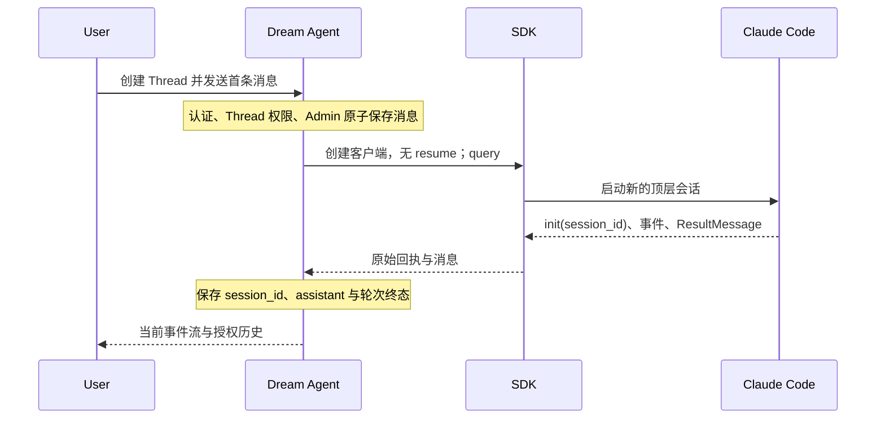
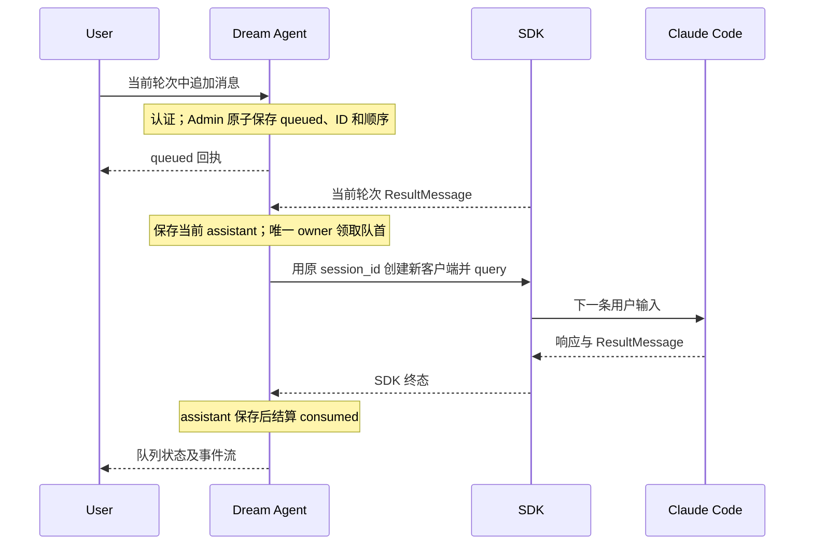
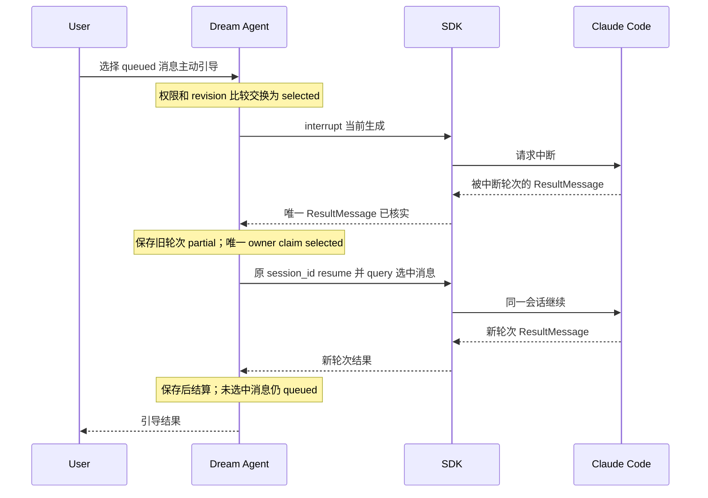
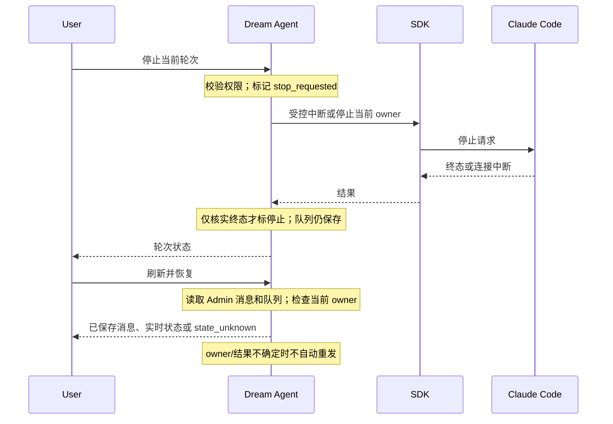

<!-- [Input] Dream public Chat, ThreadFactory, Service, Runner, Admin Chat operations; Claude Agent SDK documentation rechecked 2026-09-27 and restored source inspected 2026-09-26. -->
<!-- [Output] Thread input queue design, evidence boundaries, target flows, failure handling, and implementation review. -->
<!-- [Pos] Current design for receiving input while a Dream Agent turn runs; task-session-tools.md owns independent task Tools. -->
<!-- [Sync] 2026-09-27: record Admin 0064-0067 schema/ACL publication and the live-turn acceptance boundary before final E2E. -->
<!-- [Sync] 2026-09-27: link the implemented task-session v2 capability and four Tools while keeping the per-Thread queue design distinct. -->
<!-- [Sync] 2026-09-27: close the live-turn acceptance boundary with normal-account Chrome, real SDK and normal-database evidence. -->
<!-- [Sync] 2026-09-28: distinguish durable queue outcomes from composer card visibility once dispatch begins. -->
<!-- [Sync] 2026-09-28: classify an acknowledged selected-input interrupt against the old turn's SDK terminal. -->
<!-- [Sync] 2026-09-26: distinguish durable queue requirements from the current process-local turn and message contracts. -->

# Dream Agent 运行中输入与 Thread 队列

## 背景与问题

改动前，Dream 的每条公开 Chat 请求进入一次 ThreadFactory 轮次。前端 AIInputDock 在 loading 时禁用发送，ChatPanel 将运行中状态传给该控件。后端虽然按业务 thread_id 持有锁、运行任务与事件流，但每轮 Runner 通过 SimpleClaudeAgentSDKClient 新建、查询并关闭 ClaudeSDKClient。此时再次发送会等待 Thread 锁，不能将消息登记为可查询的待处理输入，也没有选择队列消息引导当前会话的状态转换。现有研究稿 claude-code-multi-session-interaction.md 讨论会话 A 创建独立业务任务 B；当前跨任务实现见 [task-session-tools.md](task-session-tools.md)。本文讨论一个业务 Thread 内的输入。

## 目标与边界

1. 一个 Dream thread_id 只绑定一个 Claude 顶层 session_id。首轮在无可恢复记录时不传 resume；从 SDK init 回执保存真实标识。每轮独立的 Gateway 授权和结算标识要求 Runner 在轮次结束后关闭客户端；队列后续轮次必须以保存的 session_id 恢复，禁止回退到新会话。
2. 运行中提交先由公开入口认证、校验 Thread 所有权及消息合法性，再由 Admin 原子保存用户消息和队列接收记录。确定的消息 ID 与队列序号供重试、刷新和排序使用。前端断流只取消订阅。
3. 默认顺序消费；引导只选择一个 queued 消息。一个 Thread 同时至多一个 SDK 响应读取者和一个派发中的消息。不同 Thread 保持现有独立锁及资源 admission。
4. 首期针对单个 Dream 进程的运行 owner；无本地 owner 时返回明确的 owner_unavailable 或 state_unknown，不能启动另一个消费者。跨进程路由、分布式队列和远端进程控制不在本期范围。
5. 不改变现有用户身份、Deck、Workflow、Runtime grant、消息持久化、工具确认、停止当前轮次、EventBus 或资源 admission 的判断。队列派发必须进入同一公开生产业务服务，不能模拟一个测试专用入口。

## 能力调查与结论

以下路径相对本仓库，Claude 还原源码相对 /Users/dmeck/project/claude-code-sourcemap/restored-src。查阅日期为 2026-09-26。还原源码是实现线索，不代表当前安装包的公开合同；Python SDK 文档与当前安装包分别标明。

| 问题 | 判断与证据 |
| --- | --- |
| 同一个长期运行客户端连续接收消息 | SDK 支持，Dream 当前有附加条件。[官方 Python 参考](https://code.claude.com/docs/zh-CN/agent-sdk/python)的继续对话示例连续调用 query 和 receive_response；本机 backend/.venv/lib/python3.12/site-packages/claude_agent_sdk/client.py:248-282、532-565 也暴露这组方法。Dream 的 backend/libs/claude_agent_kit/server/agent_runner.py:3886-3900 每轮设置独立 Gateway 凭证和结算键，因此本期按 session_id 恢复同一个 Claude 会话，每轮使用新的客户端。 |
| 当前生成过程中提交后续输入 | 需附加条件。官方流式输入文档展示异步消息生成器和顺序队列，但 Python receive_response 只读到首个 ResultMessage。并发调用 query 与当前读取者的边界没有官方保证；服务端先登记队列，在 ResultMessage 后串行提交最稳妥。[官方流式输入](https://code.claude.com/docs/zh-CN/agent-sdk/streaming-vs-single-mode) |
| 主动引导是否需要中断 | 需附加条件。选中消息要求当前生成停止时，先调用客户端 interrupt，再等待读取者收完该轮唯一 ResultMessage，随后才能按保存的 session_id 恢复并发送选中消息。SDK 未提供独立的“中断成功”终态枚举；interrupt 回执只说明控制请求已处理，不能单凭回执宣称引导完成。[官方 Python 中断示例](https://code.claude.com/docs/zh-CN/agent-sdk/python) |
| 客户端退出后恢复 | 支持，条件是 session_id、转录及原配置目录仍可访问；官方 resume 参数可继续历史，不能恢复已退出的进程或其未确认的中断。[官方 Python 参考](https://code.claude.com/docs/zh-CN/agent-sdk/python)；Dream backend/claude_agent/service.py:2080-2120 选择 resume，2965-2997 处理并保存 SDK init。 |
| 一个 Thread 绑定一个 Claude 会话 | 需附加条件。backend/claude_agent/service.py:2080-2120、2965-2997 与 Admin chat-thread.update-session 已保存标识；队列派发若结果未知，不得再无 resume 启动新的 Claude 会话。 |
| 不同 Thread 并发 | 支持，受资源 admission 约束。backend/claude_agent/thread_pool.py:342-375 按业务 Thread 建锁；backend/claude_agent/thread_factory.py:627 对每个运行请求申请资源。 |
| 同 Thread 单消费者 | 当前轮次支持，队列需附加条件。backend/claude_agent/thread_factory.py:380-415 持锁并设置唯一 bg_task；489-530 在 Admin 比较交换成功后领取队列消息。 |
| 跨进程停止与恢复 | 当前不支持。backend/claude_agent/thread_factory.py:936-994 只操作本进程 bg_task；status 的 not_found 只说明本进程没有 owner。共享事件流不提供远程 SDK 中断能力。 |
| 公开 SDK 与还原源码边界 | 官方公开 query、receive_response、interrupt、resume、消息队列。还原源码 src/cli/print.ts:465-466、775-776 展示内部 resume 参数判断，src/entrypoints/agentSdkTypes.ts:140-144 中 `unstable_v2_resumeSession` 明确未实现、429 描述控制请求；这些只能辅助解释内部路径，不能作为 Dream 可用的公开能力。详见相邻研究稿的源码限制。 |

当前业务证据：backend/routers/claude_agent.py:921-1330 完成认证、权限、Admin owner 构建与公开发送；backend/claude_agent/service.py:2863-2910 在推理前写入用户消息，2965-2997 保存 SDK init，2998-3110 写入 assistant；backend/routers/claude_agent.py:1660-1710 提供流和队列查询，1922-1960 停止；frontend/app/_dream/components/chat/ChatPanel.tsx:400-480 使用单 useChat transport，923-925 合并忙碌状态；AIInputDock.tsx:453-495、790-860 控制发送。权限请求继续使用既有 ToolConfirmationStore 和公开确认路由。

## 概念与业务规则

| 对象 | 所有者与字段 | 判断 |
| --- | --- | --- |
| Dream Thread | Admin chat_thread.id；公开路由按 actor 校验所有权 | 业务会话身份，不是 Claude 子代理或任务清单 ID。 |
| Claude 会话 | SDK init.session_id；Admin chat_thread.claude_session_id | 只作服务端恢复标识；不可由浏览器或 Tool 指定。 |
| 运行轮次 | ThreadFactory 的当前 turn_id、bg_task、EventBus 和 admission lease | 响应终态来自 SDK ResultMessage 与现有 Service 持久化；页面断开不改变轮次。 |
| 队列消息 | Admin 拥有 message_id、thread_id、接收序号、状态、revision、派发轮次及调用幂等键 | 必须与用户 chat_message 在同一持久化操作中登记；列表和状态变更由 Admin 授权操作返回。 |
| 进程 owner | 本地 ThreadFactory 当前运行上下文 | 只允许本 owner 向其 SDK 客户端输入；不在本进程则不猜测其是否停止。 |

队列数据结构按 thread_id 分区，以 Admin 分配的单调序号排序；同一个 message_id 在一个 Thread 内只对应一条内容与一个接收回执。数据库状态为事实来源，进程内队列只作唤醒和当前 SDK 句柄索引。接收操作在数据库事务内保存消息和 queued 状态；客户端重试沿用同一 message_id 和内容，Admin 返回原记录，未知回执不能改用新 ID。Admin Drizzle 0064 和 dream.chat-input-queue.v1 capability 提供队列序号、revision 比较交换和列表；0067 向已激活的受限 Dream 数据角色授予新表与序列权限，并同步未来激活时的 ACL 计划。2026-09-27 本机 `ink-memory` 已应用 0064–0067，数据角色只读 readiness 返回 `ready`；其他目标数据库仍须独立发布并验证。

| 当前状态 | 触发与必要回执 | 下一状态 |
| --- | --- | --- |
| 无记录 | Admin 原子保存授权消息、序号及幂等键 | queued |
| queued | 用户选择且 Admin 比较交换成功 | selected |
| queued / selected | 唯一 owner 持有 Thread 锁、通过 admission、Admin claim 成功 | dispatching |
| dispatching | SDK ResultMessage 与 Service 用户/assistant 持久化结果均核实 | consumed |
| queued / selected | 有权用户取消，Admin 比较交换成功 | cancelled |
| selected | SDK interrupt 调用失败且 Admin 比较交换成功 | failed |
| dispatching | SDK 明确失败且持久化失败结果已核实 | failed |
| dispatching | SDK 回执、持久化结果或 owner 存活不确定 | state_unknown |
| state_unknown | 管理员或明确的业务核对操作取得 SDK 与 Admin 原始回执 | consumed / failed；不得自动重发 |

selected 是选中待引导、尚未提交 SDK 的状态；dispatching 是 Admin claim 已持久化且即将或正在发送。SDK query 返回不等于 consumed。失败或取消的消息不能再次选择；如需重发，必须创建新的用户消息和新 ID。普通停止仅停止当前响应，队列消息保留 queued；关闭业务任务需要独立业务操作。

前端输入区只为 `queued` 和 `selected` 显示队列卡片。Admin claim 将状态推进到 `dispatching` 后，该消息退出输入控制栏，由已保存的用户消息和原对话回复承接显示；之后的 `consumed`、`failed`、`cancelled` 不重新生成卡片。`state_unknown` 通过输入区独立反馈提示核对并提供只读队列刷新。此展示规则不删除 Admin 记录、不改变状态转换，也不把卡片消失解释为 SDK 消费成功。已派发轮次失败仍由对话错误呈现；选中阶段的中断失败由操作错误呈现。已确认引导中断的旧轮次保存部分回复为 `cancelled`，不在消息区显示普通发送失败；选中的消息仍由自己的后续轮次给出结果。

## 推荐架构与接口

Admin 提供原子 enqueue、list、select、claim、settle、cancel，并将 message_id、thread_id、用户消息、排序序号、revision、状态和派发轮次留在 PostgreSQL。Dream route 复用现有认证、Thread 所有权与消息 DTO；ThreadFactory 负责本地唯一 owner、队列唤醒、锁和 admission；Service 继续负责上下文、SDK 消息、权限确认与 assistant 持久化。Runner 每轮用新的 SDK 客户端，旧轮收到唯一 ResultMessage 后关闭；后续轮按已保存 session_id 恢复。EventBus 仍发布当前轮次事件；前端通过授权队列 GET 轮询恢复状态。

公开协议：POST /api/claude-agent/threads/{thread_id}/inputs 接受原 Chat message.id 与单个非空文字 part，返回 message_id、queue_sequence、status、revision、text；GET 同路径返回授权队列与当前进程是否拥有 owner；POST /inputs/{message_id}/select 接受 expected_revision，返回新状态与 interrupt_signalled。首轮继续走原 POST /api/claude-agent；运行中前端改走输入端点。附件和 Editor 快照暂不进入排队路径；前端保留草稿并显示拒绝。现有 stop 路由继续返回 stop_requested 与核实后的 lifecycle。HTTP 接收成功只代表已排队，不代表 SDK 消费。

首条消息创建 Thread 的现有 API 可复用。首轮不传 resume；SDK init 回执保存到 Admin。队列默认在旧轮唯一 ResultMessage 被接收且 Service 完成持久化后按序领取。新轮的 Service 必须找到已保存的 session_id 与本地转录；SDK connect 不能把缺失的 resume 降级为新会话。主动引导只能由本地 owner 操作：Admin 先选中，Runner interrupt 发控制请求，收到控制回执后将当前 turn_id 记为引导中断目标；旧轮读取者继续等待唯一 ResultMessage。Service 仅当该 turn_id 匹配、Runner 收到唯一 `error_during_execution` ResultMessage、未报告其他运行错误且终态校验未通过时，将旧轮部分回复持久化为 `cancelled` 并发送 `finish(cancelled=true)`，不发送通用 `error`。该判断只归类旧轮次，不代表 selected 已交给 SDK；唯一消费者仍须等旧轮终态后领取。其他 SDK 错误按原失败路径处理。中断调用失败则把 selected 记为 failed；状态写入失败则停止本地消费。SDK 流断裂或进程 owner 消失时不得从 SSE 片段推断成功。

前端沿用 ChatPanel、AIInputDock、ChatMessageList 和现有 API 客户端。运行中发送成功后显示排队条目；卡片在服务端确认 `dispatching` 后退出输入区，且不触发第二个 useChat 推理流。选择仅对 queued 且有本地 owner 的记录可用。刷新时读历史和队列，并按现有运行状态决定是否重连 SSE；轮询只读取队列状态，不启动推理。队列不可用时保持草稿和同一重试消息 ID，展示明确失败。队列 capability 可用时，普通 Chat 请求先查询本 Thread 是否还有 queued、selected、dispatching 或 state_unknown；若有则返回 CHAT_INPUT_RECONCILIATION_REQUIRED，不能越过孤儿消息。服务端不把 Claude session_id、进程 ID、转录位置或取消句柄投影到浏览器。

## 四参与者时序

## 失败、影响与验收

### 独立任务 Tool

`create_thread`、`list_threads`、`read_thread`、`send_message_to_thread` 注册为当前轮次的私有 MCP Tool。Admin Drizzle `dream.chat-task-session.v2` 为 `create_thread` 提供 `task_id → thread_id` 来源关系与 `pending → starting/failed` 首轮启动状态；Dream 在该 capability 缺失时拒绝创建。列表、读取和发送以业务 `thread_id` 为参数并逐次核实当前 owner，不接受用户身份、Claude `session_id` 或进程句柄。模型侧不注册停止 Tool；页面继续使用现有停止 API。独立任务和侧边聊天的流程、失败反馈及验收见 [task-session-tools.md](task-session-tools.md)。

### 失败与验收

权限拒绝发生在持久化和 SDK 调用之前；队列 capability 缺失返回服务不可用并保留前端草稿。Admin enqueue 结果未知时凭原 request_id 查回执。SDK init 未保存、派发回执不确定、中断失败或 owner 丢失均不得从 SSE 片段推断 consumed，也不得自动重复发送。前端断开仅取消订阅；Dream 重启后读取历史与 Admin 队列，原 dispatching 必须经过核对才继续，不能把 not_found 当作已停止。权限确认仍通过现有确认请求与对应运行轮次处理。

自动化验收使用公开入口与真实 DTO：同 Thread 单消费者、不同 Thread 并发、消息 ID 重试、运行中追加、序号消费、引导中断并排空旧 ResultMessage、中断失败、未知派发不重试、刷新重连不启动新轮次、init 保存与 resume、未授权读取/发送/选择/停止、前端状态及草稿保留。浏览器验证使用本机 Chrome。2026-09-27 又在正常 Dream、Admin、Gateway 和 `ink-memory` 上执行真实账户与真实模型流程，核对默认 FIFO、主动引导、中断、取消、刷新、停止、同一 Claude 会话恢复、不同 Thread 独立会话、侧边 Thread 和四个任务 Tool；数据库回执与浏览器状态一致。

## 编码前目标符合性评审

2026-09-26 评审结论：前端禁用与缺少持久化队列是直接原因；仅修改按钮不能形成可靠队列。必须实现 Admin 原子队列 capability、公开受权入口、唯一消费与结果确认、前端状态恢复。每轮 Gateway 授权与结算键不同，因此客户端跨轮常驻会沿用旧凭证；本期按同一个 Claude session_id 顺序恢复。2026-09-27 补充评审将任务关系 Tool 纳入必做：Admin `chat-task-session.v2` 负责业务绑定及首轮单次 claim，Dream Tool 和侧边入口复用受权 Thread、队列与 SDK 路径。可延后跨进程 owner 路由、孤儿 queued 的受控重启消费、任务归档与附件排队。明确不实现分布式队列、新 Dream 控制平面、按部署环境切换路径、确认弹窗或新的资源算法。Admin capability 应用前，Dream 只能提供安全拒绝；owner 消失后的排队消息可查询，但本期不得自动派发或换用新的业务消息 ID。Admin 的 `scripts/run-chat-input-queue-contract.mjs` 在具名隔离 PostgreSQL 中执行前向迁移，并通过 `probe-chat-input-queue.ts` 调用正式 Chat Service 验证幂等、授权和状态转换。正常库按用户授权应用 0064–0067，并通过受限数据角色 readiness、实时 Admin capability 读取和上述真实业务 E2E 分别核对 schema、权限与运行行为。
