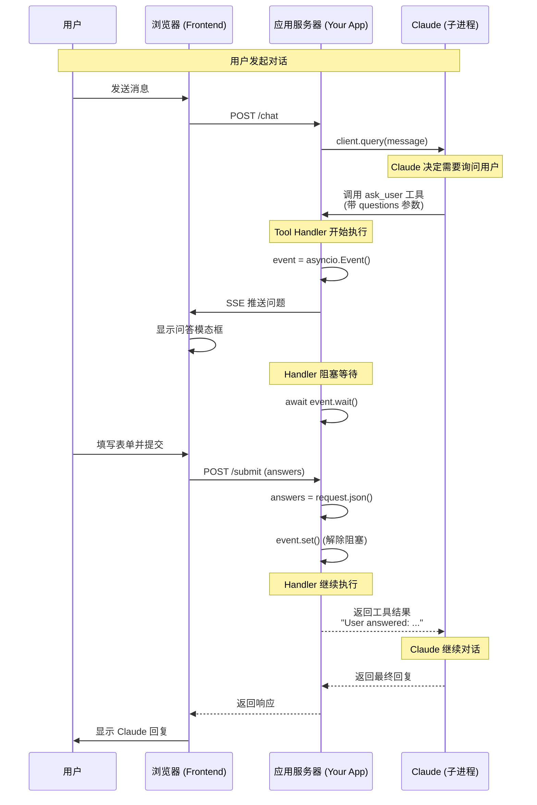
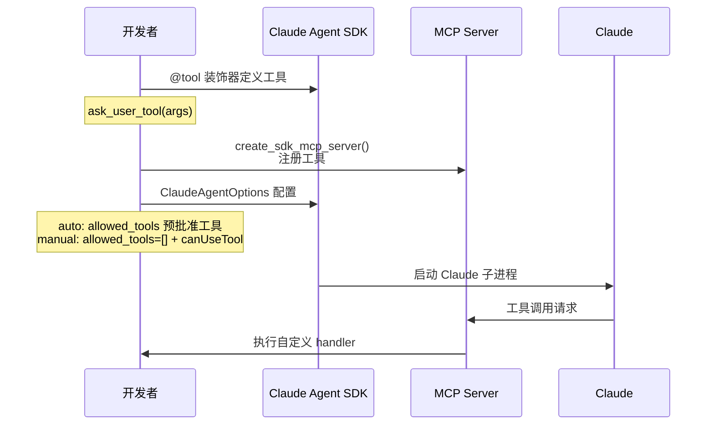
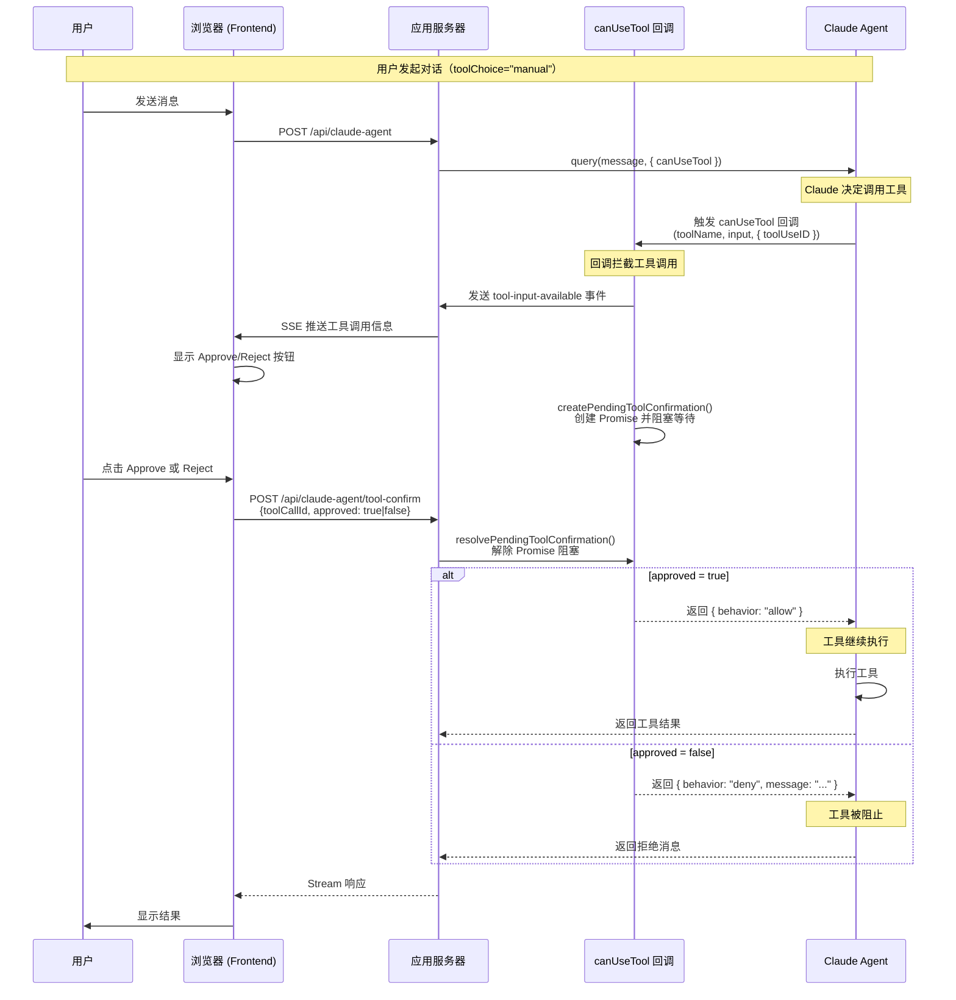
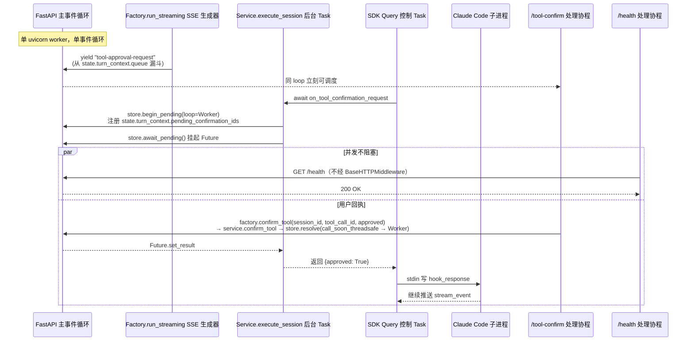
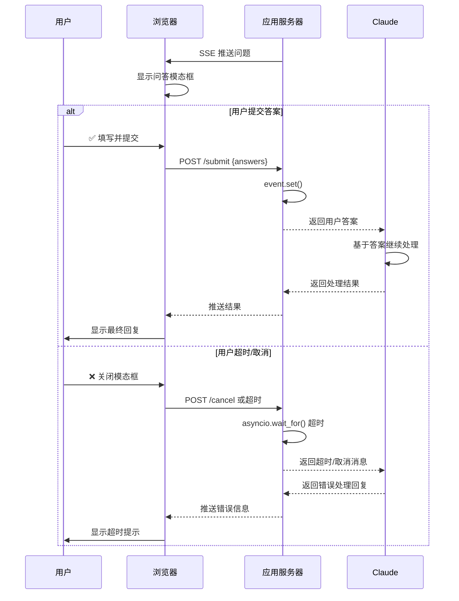

> **迁移来源**: Pawkeyland docs/app/design/Claude Agent SDK 交互式工具时序图.md
> SDK 工具确认交互模式的通用设计参考，与 Ink & Memory `backend/claude_agent/tool_confirmation_store.py` 对应实现。
> **[Sync] 2026-05-24**: `_make_tool_confirm_cb` 新增 `turn_ctx` 参数，注册 `registered_tool_call_ids` / `emitted_tool_input_ids` 去重；新增 `CancelledError` 处理（调 `store.cancel_pending` 后 re-raise）；`payload` 字段同时兼容 `tool_call_id`（runner）和 `toolCallId`（遗留）。
> **[Sync] 2026-05-27**: `PreToolUse` hook `hookSpecificOutput` 格式迁移至 CLI ≥2.1 规范；新增 `_ALWAYS_CONFIRM_TOOL_NAMES` 机制在 auto 模式下对 `AskUserQuestion` 触发确认；新增前端 `isManualToolInvocation` / `toolChoice` prop 逻辑说明（§6、§7）。
> **[Sync] 2026-06-06**: auto 模式新增 workspace `files/` 内置文件工具权限策略：`Read` / `Write` / `Edit` / `MultiEdit` 仅在路径解析后位于当前 `{cwd}/files/` 下时返回显式 `permissionDecision:"allow"`，避免 Claude Code 独立文件写权限层阻塞 Agent 产物写入；manual 模式仍走前端确认。

> 来源: When Claude Can't Ask: Building Interactive Tools for the Agent SDK
>  https://oneryalcin.medium.com/when-claude-cant-ask-building-interactive-tools-for-the-agent-sdk-64ccc89558fa

## 核心交互模式

当 Claude 调用自定义 MCP 工具时，整个流程如下：



## 工具定义与注册



## 使用 canUseTool 实现工具确认

Claude Agent SDK 提供 `canUseTool` 回调作为官方权限处理器，用于在工具执行前控制是否允许。这是实现工具确认的推荐方式。

> 参考: https://platform.claude.com/docs/en/agent-sdk/user-input



### canUseTool 配置（TypeScript）

```typescript
import type { CanUseTool, PermissionResult } from "@anthropic-ai/claude-agent-sdk";

// canUseTool 回调函数
const canUseTool: CanUseTool = async (
  toolName: string,
  toolInput: Record<string, unknown>,
  options: { signal: AbortSignal; toolUseID: string }
): Promise<PermissionResult> => {
  const toolCallId = options.toolUseID;
  
  // 通知 UI 显示确认按钮
  await sendToolApprovalRequest(toolCallId, toolName, toolInput);
  
  // 阻塞等待用户确认
  const result = await createPendingToolConfirmation(toolCallId, toolName, toolInput);
  
  if (result.approved) {
    return {
      behavior: 'allow',
      toolUseID: toolCallId,
    };
  } else {
    return {
      behavior: 'deny',
      message: result.reason || '用户拒绝',
      toolUseID: toolCallId,
    };
  }
};

// SDK Options 配置
const sdkOptions = {
  canUseTool,  // 注册权限处理器
  allowedTools: [],  // manual 模式不要预批准目标工具，否则不会触发 canUseTool
};
```

> Python 落地注意：当前实现已从 Python SDK `can_use_tool` 迁移到 `PreToolUse` hook。`toolChoice="auto"` 默认允许 allowlist 内的动画和 necklace 工具自主执行；`toolChoice="manual"` 才通过 `PreToolUse` 进入确认侧路。

## 事件循环 / 线程 / 子进程边界（manual 模式）

> [Sync] 2026-05-10: 修复一次生产事故 —— `tool-approval-request` 发出后整个 FastAPI 进程挂起。补充三层泳道，明确每个 await 所属的边界。
> [Sync] 2026-05-10: 经端到端真实 uvicorn 复现，**真正的根因是前后端字段名 mismatch**：SSE 下发 camelCase `toolCallId`，前端原样回传 `/api/claude-agent/tool-confirm`，但后端 `ToolConfirmRequest` schema 仅认 snake_case `tool_call_id` → 422 Unprocessable Entity → 前端表现为"无法响应"，5 分钟后 SSE 因超时被动结束，看起来像"全局阻塞"。已让 `ToolConfirmRequest` 同时接受 `tool_call_id` 与 `toolCallId`（`Field(alias="toolCallId")` + `populate_by_name=True`），契约同时兼容 Java/BFF snake_case 与 Web SSE-echo camelCase。
> [Sync] 2026-05-10: 上一轮加固（去 BaseHTTPMiddleware、call_soon_threadsafe 桥、cancel_pending、BaseExceptionGroup 不掩盖 CancelledError）保留为防御性硬化：单 uvicorn worker 上 SSE 暂停时 `/health` 与 `/tool-confirm` 真实测得 5–9ms 内返回，与 Streaming generator 完全并发。
> [Sync] 2026-05-10: "SSE 占用时整个服务无法访问"实测复现 — 服务端 manual-confirm 期间 4 条 SSE + 60 次并发 side-probe 全部 5–15ms 返回，**根因不在 worker**。真正堵点叠加：(1) 前端 `app.js` 在 SSE reader loop 内同步 `await postToolConfirmation(...)` → 浏览器 HTTP/1.1 同源 6 连接限制下 fetch 排队会反过来 stall SSE reader；(2) 反向代理/移动网关 idle timeout 切线 SSE 在等用户确认。修复：服务端 SSE generator 加 `: keepalive` 心跳（默认 15s，可改 `PAWKEYLAND_SSE_KEEPALIVE_S`）；`demo_ui/app.js` 把 tool-confirm 改 fire-and-forget；部署层强烈建议反向代理启用 HTTP/2 让浏览器在同条 TCP 上多路复用。`scripts/diag_sse_concurrency.py` 给出可重跑诊断。
> [Sync] 2026-05-12: Thread Session 模式接入 — 生产 HTTP 入口现在是 `ClaudeAgentThreadFactory.run_streaming(request)`。`tool-approval-request` 帧由 Phase 1 内的 5 个 `AgentStreamingCallbacks` 闭包通过 `state.turn_context.queue` 推送；`/tool-confirm` 经 `factory.confirm_tool(session_id, tool_call_id, approved, reason, answers)` 委托到内部 `Service.confirm_tool` → `ToolConfirmationStore.resolve`，与 Phase 1 注册的 `state.turn_context.pending_confirmation_ids` 在 owner loop 上 `set_result`。Phase 4 finally / 客户端断开会调用 `_store.cancel_pending(...)` 释放残留 Future，与享元 State 的 "create in Phase 1 / destroy in Phase 4" 契约对齐。详见 [claude-agent-thread-session-patterns.md §6.4](./claude-agent-thread-session-patterns.md#64-工具确认manual-模式)。



要点（Thread Session 模式）：

1. `store.begin_pending` 在 `Service.assemble_context` 构造的 callback 闭包内执行，闭包绑定到 FastAPI worker loop（即 `state.turn_context` 创建的 owner loop）。`tool_call_id` 同时被注册到 `state.turn_context.pending_confirmation_ids`，让 Phase 4 finally / 客户端断开有单一句柄做批量取消。
2. SDK 的 `_handle_control_request` 通过 anyio TaskGroup 创建 `SDKTask`，目前与主 loop 共用，未来如果 Anthropic SDK 把 hook 迁到 `anyio.from_thread`，`_await_confirmation` 会用 `asyncio.run_coroutine_threadsafe` 切回 owner loop，再执行 `await_pending`，避免在错误的 loop 上挂起 Future。
3. `/tool-confirm` 调 `factory.confirm_tool(session_id, tool_call_id, ...)` → `service.confirm_tool` → `store.resolve`：调用方若已在 owner loop 上，则直接 `set_result`；否则通过 `loop.call_soon_threadsafe` 跨边界唤醒。`session_id` 仅用于 API 对称性 — 实际查找以全局 `tool_call_id` 为键。
4. `/health` 等无关请求改走纯 ASGI 中间件 `_PureASGIRequestLogger`，不再经过会把 `StreamingResponse` 锁进 anyio TaskGroup 的 `BaseHTTPMiddleware`，因此即便 SSE 在等待 Future 也不会被排队。
5. 前台关闭 SSE 时，Factory 的 `_run_lifecycle.finally` 会遍历 `state.turn_context.pending_confirmation_ids` 调用 `store.cancel_pending(tool_call_id)` 把残留 Future 立刻丢弃，再清空 `state.turn_context = None`，杜绝内存泄漏；State 仍以 IDLE 留在享元缓存内等待下一轮或 TTL 销毁。
6. 接口契约层面：SSE 事件统一发 camelCase（与现有前端代码一致），`ToolConfirmRequest` 同时接受 `tool_call_id`（snake_case）与 `toolCallId`（camelCase）两种字段名 —— 这是 2026-05-10 根因的最终修复。任何客户端只要把 `tool-approval-request` 里的 `toolCallId` 原样回传到 POST body，即可被服务端校验通过，再由 `factory.confirm_tool` → `store.resolve` 走同 loop set_result 路径唤醒 SSE generator。

## 用户批准/拒绝决策分支



## 关键代码模式

### Tool Handler 阻塞模式（Python）

```python
# 在工具 handler 中:
event = asyncio.Event()
await send_questions_to_browser(questions)  # SSE 推送
await event.wait()  # 阻塞等待用户响应
return answers

# 在 /submit endpoint 中:
answers = request.json()
event.set()  # 解除阻塞

```

### Tool Confirmation Store（TypeScript/Node.js）

```typescript
// tool-confirmation-store.ts
// 创建待确认项并返回 Promise（阻塞）
export function createPendingToolConfirmation(
  toolCallId: string,
  toolName: string,
  input: Record<string, unknown>
): Promise<ToolConfirmationResult> {
  return new Promise((resolve, reject) => {
    pendingConfirmations.set(toolCallId, { resolve, reject, ... });
    
    // 超时保护
    setTimeout(() => {
      if (pendingConfirmations.has(toolCallId)) {
        pendingConfirmations.delete(toolCallId);
        reject(new Error('Confirmation timeout'));
      }
    }, 300000); // 5分钟
  });
}

// 解除阻塞（在 /api/claude-agent/tool-confirm 中调用）
export function resolvePendingToolConfirmation(
  toolCallId: string,
  result: { approved: boolean; reason?: string }
): boolean {
  const pending = pendingConfirmations.get(toolCallId);
  if (pending) {
    pending.resolve(result);
    pendingConfirmations.delete(toolCallId);
    return true;
  }
  return false;
}
```

### 超时处理

```python
# Python: 添加超时保护，防止 handler 永久阻塞
await asyncio.wait_for(event.wait(), timeout=300)  # 5分钟超时

```

```typescript
// TypeScript: 在 createPendingToolConfirmation 中已内置超时
// timeout 参数可配置，默认 5 分钟
```

## 应用场景

此模式可扩展到多种交互场景：

| 场景 | 描述 |
| --- | --- |
| 审批工作流 | 显示 diff，等待批准/拒绝 |
| 文件选择器 | 让用户基于提示浏览和选择文件 |
| 配置向导 | 带验证的多步骤表单 |
| 人工介入 | 在执行破坏性操作前暂停审核 |
| 富输入 | 图片标注、拖放等前端支持的任何交互 |

---

## 5. `PreToolUse` Hook `hookSpecificOutput` 格式 — CLI ≥2.1 规范 **[2026-05-27]**

> **背景**：CLI v2.1+ 更改了 PreToolUse hook 的 `hookSpecificOutput` 协议。旧格式 `{"tool_input": ...}` 被 CLI 静默忽略，导致 `AskUserQuestion` 以无 `answers` 字段的原始 input 执行，返回 `isError:true / output:null`。

### 5.1 旧格式（CLI < 2.1，已废弃）

```python
# ❌ 旧格式：CLI 静默忽略，工具 input 不会被更新
return HookJSONOutput(
    hookSpecificOutput={"tool_input": updated_input}
)

# ❌ 旧格式 block：
return HookJSONOutput(decision="block", systemMessage=reason)
```

### 5.2 新格式（CLI ≥2.1，当前实现）

```python
# ✅ 允许并更新 input（携带 answers）
return HookJSONOutput(
    hookSpecificOutput={
        "hookEventName": "PreToolUse",
        "permissionDecision": "allow",
        "updatedInput": updated_input,   # 包含 answers 的完整 tool_input
    }
)

# ✅ 允许，不更新 input
return HookJSONOutput()  # 空 dict，CLI 默认 allow

# ✅ 拒绝，附带 Claude 可见的原因
return HookJSONOutput(
    hookSpecificOutput={
        "hookEventName": "PreToolUse",
        "permissionDecision": "deny",
        "permissionDecisionReason": reason,  # Claude 收到拒绝原因，避免无效重试
    }
)
```

### 5.3 关键规则

- `updatedInput` 必须放在 `hookSpecificOutput` 内，**不能**放在顶层。
- 使用 `updatedInput` 时必须同时声明 `permissionDecision: "allow"` 或 `"ask"`。
- `hookEventName` 必须与 hook 事件类型一致（这里固定为 `"PreToolUse"`）。

---

## 6. `_ALWAYS_CONFIRM_TOOL_NAMES` — auto 模式下强制确认的工具 **[2026-05-27]**

```python
# backend/libs/claude_agent_kit/server/agent_runner.py
_ALWAYS_CONFIRM_TOOL_NAMES: frozenset[str] = frozenset({
    "AskUserQuestion",
    "mcp__user__ask_user",
})
```

### 6.1 决策逻辑

```python
# _pre_tool_use_hook 内
if tool_choice != "manual" and tool_name not in _ALWAYS_CONFIRM_TOOL_NAMES:
    return HookJSONOutput()   # auto 模式下，普通工具立即放行
# 否则（manual 模式，或 auto+AskUserQuestion）→ 进入确认侧路
```

### 6.2 工具决策矩阵

| 工具 | `tool_choice=auto` | `tool_choice=manual` |
|------|:------------------:|:--------------------:|
| `AskUserQuestion` | 走确认流 → 显示 AskUserQuestion 表单 | 走确认流 → 显示 AskUserQuestion 表单 |
| `mcp__user__ask_user` | 走确认流 → 显示 AskUserQuestion 表单 | 走确认流 → 显示 AskUserQuestion 表单 |
| `mcp__user__touch_animation` | **自动执行**（动画由 Agent 驱动） | 走确认流 → 显示 Approve/Cancel |
| `Read` / `Write` / `Edit` / `MultiEdit` 且目标位于 `{cwd}/files/**` | 显式 allow → 自动执行 | 走确认流 → 显示 Approve/Cancel |
| `Read` / `Bash` / 其他工具 | **自动执行**（不额外授予文件写权限） | 走确认流 → 显示 Approve/Cancel |

> `mcp__user__touch_animation` 不在 `_ALWAYS_CONFIRM_TOOL_NAMES` 内，auto 模式下 Agent 自主触发动画，符合设计预期。

---

## 7. 前端 `tool_choice` 路由逻辑 **[2026-05-27]**

### 7.1 组件层级

```
ChatPanel
  ├─ currentToolChoice: ToolChoice   ('auto'|'manual'|'none')
  ├─ AIInputDock               ← 「逐步确认」开关 → 发送 toolChoice='manual'
  └─ ChatMessageList(toolChoice=currentToolChoice)
       └─ ToolMessagePart(isManualToolInvocation: bool)
            ├─ shouldShowAskUserUI   = isAskUserQuestion && !isCompleted && state∈{input-available,...}
            └─ shouldShowApprovalUI  = isManualToolInvocation && !shouldShowAskUserUI && !isCompleted
```

### 7.2 `ChatMessageList` 渲染决策

```typescript
// 优先级从高到低：
// 1. 已完成 + 有输出 → 终端/折叠视图
if (isCompleted && outputText) { /* terminal view */ }

// 2. AskUserQuestion + 未完成 → 直接展开 AskUserQuestionUI
//    (isManualToolInvocation=false，表单由 shouldShowAskUserUI 驱动)
const needsUserInput = isAskUserQuestionTool(toolPart) && !isCompleted;
if (needsUserInput) { /* AskUserQuestion form */ }

// 3. manual 模式 + 非 AskUserQuestion + 未完成 → Approve/Cancel UI
const needsManualApproval = toolChoice === 'manual' && !isCompleted;
if (needsManualApproval) { /* isManualToolInvocation=true → Approve/Cancel */ }

// 4. 其他 → 折叠视图
```

### 7.3 `shouldShowApprovalUI` 生命周期

```
工具调用到达
  ↓ state='input-available', isCompleted=false
  isManualToolInvocation=true → shouldShowApprovalUI=true → 显示 Approve/Cancel
  ↓ 用户点击 Approve → POST tool-confirm
  ↓ 工具执行 → tool-output-available
  isCompleted=true → shouldShowApprovalUI=false → 恢复折叠/终端视图
```
