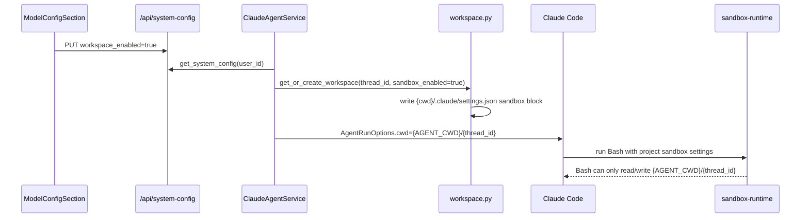
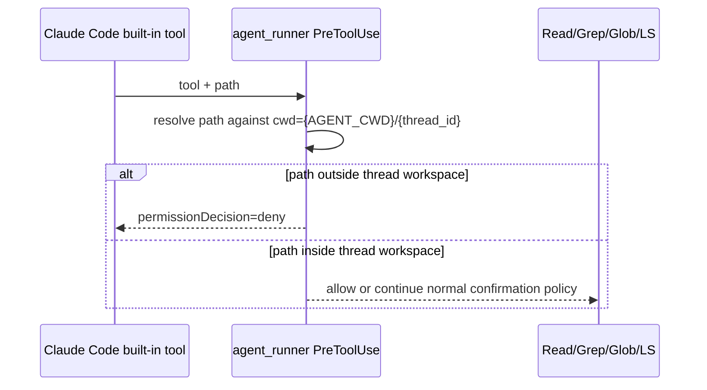

> [Input] `docs/design/claude-agent/claude-agent-workspace-sandbox.md`,
> Claude Code Bash sandbox docs, `anthropic-experimental/sandbox-runtime`,
> `backend/libs/claude_agent_kit/server/workspace.py`,
> `backend/claude_agent/service.py`, Settings `workspace_enabled`.
> [Output] Interaction design for enabling per-thread workspace sandboxing from
> Settings and diagnosing why the previous config still allowed other paths.
> [Pos] workspace-sandbox-interaction-plan in `docs/design/claude-agent`
> [Sync] 2026-06-13: initial design for strict per-thread Bash read/write scope.

# Claude-Agent Workspace Sandbox Interaction Plan

## 1. Optimized planning prompt used for this round

```text
You are an Expert Prompt Architect.
Convert the requirement into an implementation-ready engineering plan.
Goal: when Settings Workspace Mode is enabled, each Claude Agent thread must run
Claude Code from the server-owned workspace {AGENT_CWD}/{thread_id}, and Bash
subprocesses must only read/write that single thread workspace through the
thread-local .claude/settings.json sandbox configuration.
Tasks:
1. Diagnose why the current sandbox still appears able to access other paths.
2. Design the minimal interaction and backend integration path.
3. Verify the design directly matches the goal and avoids over-engineering.
4. Implement only the necessary code and regression tests.
Constraints: use Claude Code's built-in sandbox settings for Bash, use
PreToolUse for built-in file/search tools such as Read/Grep/Glob, do not parse
shell commands in Python, do not add a custom sandbox-runtime wrapper, preserve
existing workspace initialization behavior, and keep the Settings
`workspace_enabled` switch as the product control.
Output: concise diagnosis, design, non-goal boundaries, implementation points,
and validation commands.
```

## 2. Diagnosis

The previous per-thread sandbox config correctly forced `cwd` to
`{AGENT_CWD}/{thread_id}` and wrote `sandbox.enabled=true`, but its read policy
was too narrow:

```json
"denyRead": ["{AGENT_CWD}", "{PROJECT_ROOT}", "~/.ssh", "~/.aws", "~/.config", "~/.npmrc"],
"allowRead": ["{AGENT_CWD}/{thread_id}"]
```

Claude Code / sandbox-runtime read isolation is deny-then-allow. Reads are
allowed by default unless a path is under `denyRead`; `allowRead` only re-allows
paths that were denied by a broader deny rule. Therefore, denying only the
workspace parent and a few sensitive locations still leaves unrelated host paths
outside those denied prefixes readable.

For the stated product goal — "a single thread can only access its own
`{AGENT_CWD}/{thread_id}`" — the sandbox read policy must deny the filesystem
root and re-allow only the resolved thread workspace:

```json
"denyRead": ["/"],
"allowRead": ["{AGENT_CWD}/{thread_id}"]
```

Write isolation was already aligned for Bash because sandbox-runtime writes use
an allow-only model, and the implementation only grants `allowWrite` to the
thread workspace while denying workspace-local config/index files.

A separate issue explains the reported `Grep` / `Read` examples: those are
Claude Code built-in file/search tools, not Bash subprocesses. Claude's sandbox
documentation says sandboxing applies to Bash and child processes, while
Read/Edit-style permissions govern built-in file tools. Therefore the backend
must also enforce the thread-workspace boundary in the SDK `PreToolUse` hook for
`Read`, `Grep`, `Glob`, `LS`, `NotebookRead`, `Write`, `Edit`, and `MultiEdit`.

## 3. Interaction design

### 3.1 User-facing switch

Settings → AI model configuration → Workspace Mode remains the single product
switch. When enabled, it means:

1. the application uses the server-owned thread workspace as Claude Code `cwd`;
2. the workspace sidebar/context is active; and
3. Bash subprocesses are sandboxed to the current thread workspace.

When disabled, workspace initialization still keeps `.claude/settings.json` in
sync, but writes `sandbox.enabled=false` and `allowUnsandboxedCommands=true`.

### 3.2 Backend entry point

`ClaudeAgentService.assemble_context` is the correct access point because it is
the phase that already resolves `thread_id`, reads user system config, and
constructs `AgentRunOptions.cwd` for Claude Code.

Flow:



Built-in file/search flow:



### 3.3 Sandbox settings contract

Enabled workspace mode writes this minimal strict contract:

```json
{
  "sandbox": {
    "enabled": true,
    "failIfUnavailable": true,
    "autoAllowBashIfSandboxed": true,
    "allowUnsandboxedCommands": false,
    "filesystem": {
      "denyRead": ["/"],
      "allowRead": ["{AGENT_CWD}/{thread_id}"],
      "allowWrite": ["{AGENT_CWD}/{thread_id}"],
      "denyWrite": [
        "{AGENT_CWD}/{thread_id}/.claude/settings.json",
        "{AGENT_CWD}/{thread_id}/.claude/settings.local.json",
        "{AGENT_CWD}/{thread_id}/.claude/hooks",
        "{AGENT_CWD}/{thread_id}/.claude/.clawhub",
        "{AGENT_CWD}/{thread_id}/.claude/worktrees",
        "{AGENT_CWD}/{thread_id}/.editor",
        "{AGENT_CWD}/{thread_id}/.mcp.json"
      ]
    }
  }
}
```

`.claude/skills/` is excluded from `denyWrite` on purpose: it is the canonical
Claude Code skill discovery directory and must support create/update/replace
operations inside the thread workspace. The next workspace sync imports real
files/directories created there into `workspace/skills/`, then rebuilds the
canonical entries as symlinks.

## 4. Fit-to-goal / over-design check

This design fits the target because the only path re-allowed after the root read
deny is the resolved thread workspace. Sibling workspaces under the same
`AGENT_CWD`, the application repo, home directories, and arbitrary host paths are
not in `allowRead`.

This is intentionally not over-designed:

- no custom Python Bash parser;
- no separate `sandbox-runtime` wrapper around the whole SDK process;
- no Docker/container/VM layer;
- no MCP gateway change;
- no new frontend state beyond the existing `workspace_enabled` setting;
- no broad rewrite of built-in file-tool policy; only a path-boundary guard is
  added because Claude Code's Bash sandbox is Bash-scoped.

## 5. Validation plan

- Unit-test workspace initialization writes `denyRead: ["/"]` and `allowRead`
  equal to the resolved current thread workspace.
- Unit-test disabled workspace mode still writes disabled sandbox flags.
- Unit-test `Read` / `Grep` outside the thread workspace are hard-denied before
  frontend confirmation or full-access allow paths can approve them.
- Compile the touched backend modules.
- Keep the existing design document as the canonical architecture reference and
  this document as the issue-specific interaction plan.
