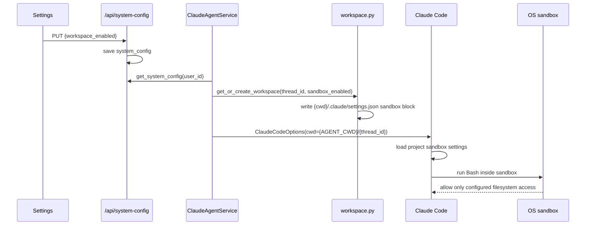

> [Input] Claude Code sandbox docs, restored Claude Code `sandbox-adapter.ts`,
> `backend/libs/claude_agent_kit/server/workspace.py`,
> `backend/claude_agent/service.py`, Settings `workspace_enabled`.
> [Output] Design for Settings-controlled per-thread Claude Code Bash sandbox.
> [Pos] workspace-sandbox-design-doc in `docs/design/claude-agent`
> [Sync] 2026-06-13: initial design and implementation contract.

# Claude-Agent Workspace Sandbox

## 1. Decision

Use Claude Code's built-in `.claude/settings.json` `sandbox` field as the
kernel-level boundary for Bash. Do not implement thread-directory isolation in
`agent_runner.py::_pre_tool_use_hook`.

Reasoning:

- Claude Code already converts `settings.sandbox` into sandbox-runtime config
  and enforces it with OS primitives: macOS Seatbelt, Linux/WSL bubblewrap.
- Sandbox enforcement applies to Bash and all child processes, including complex
  shell syntax that is brittle to parse correctly in a Python hook.
- `PreToolUse` remains a product permission layer. It should decide whether a
  tool call needs frontend approval; it should not try to emulate an OS sandbox.

The target boundary is:

```text
{AGENT_CWD}/{thread_id}
```

`AGENT_CWD` is the shared parent workspace root. The sandbox allowlist is the
resolved per-thread workspace path, not the parent root.

## 2. Product Switch

Settings → AI 模型配置 → 工作区模式 controls both:

- whether workspace file/sidebar context is active for the conversation; and
- whether each thread workspace writes an enabled Claude Code Bash sandbox block.

When `system_config.workspace_enabled=true`, workspace initialization writes:

```json
{
  "sandbox": {
    "enabled": true,
    "failIfUnavailable": true,
    "autoAllowBashIfSandboxed": true,
    "allowUnsandboxedCommands": false,
    "filesystem": {
      "denyRead": ["/"],
      "allowRead": ["{AGENT_CWD}/{thread_id}"],
      "allowWrite": ["{AGENT_CWD}/{thread_id}"],
      "denyWrite": [
        "{AGENT_CWD}/{thread_id}/.claude",
        "{AGENT_CWD}/{thread_id}/.editor",
        "{AGENT_CWD}/{thread_id}/.mcp.json"
      ]
    }
  }
}
```

When `workspace_enabled=false`, the same per-thread settings file is kept in
sync but `sandbox.enabled=false`, `failIfUnavailable=false`, and
`allowUnsandboxedCommands=true`.

## 3. Access Semantics

Claude Code sandbox filesystem paths use normal path semantics:

| Prefix | Meaning |
|---|---|
| `/path` | absolute filesystem path |
| `~/path` | home-relative path |
| `./path` or `path` | relative to the settings file's project root |

Because each Claude SDK process runs with `cwd={AGENT_CWD}/{thread_id}` and the
SDK runtime is forced to project settings, the thread's
`{cwd}/.claude/settings.json` is the project settings source for sandboxing.

Read policy is deny-then-allow: deny the filesystem root, then re-allow only the current thread workspace. Write policy is allow-only:
write access is granted to the current thread workspace and common sandbox temp
locations added by Claude Code itself. We additionally deny writes to
workspace-local config/index files that should not be mutated by Bash.

## 4. Interaction Flow



## 5. Relationship To Tool Permissions

Sandboxing and permissions are separate layers:

| Layer | Scope | Owner |
|---|---|---|
| `PreToolUse` permission policy | whether a tool call may run or needs frontend confirmation | `agent_runner.py` |
| Claude Code Bash sandbox | what filesystem resources Bash and child processes can access after the tool is allowed | `.claude/settings.json` + Claude Code |

This design intentionally does not add a `_pre_tool_use_hook` directory parser
for Bash. Complex commands are allowed to reach Claude Code's Bash permission
and sandbox path, where the OS-level sandbox enforces the boundary.

Existing PreToolUse behavior remains:

- `.editor/` virtual-index `Read` redirects to a safe temporary snapshot.
- Workspace `files/` built-in file tools can receive explicit allow in auto
  mode after path validation.
- Low-sensitivity query tools, `Skill`, and `switch_editor` can be auto-allowed.
- High-sensitivity execution/write/interactive tools still go through frontend
  confirmation unless Settings full-access approval is enabled.

## 6. Implementation Points

| File | Responsibility |
|---|---|
| `backend/libs/claude_agent_kit/server/workspace.py` | Merge the per-thread `sandbox` block into `{workspace}/.claude/settings.json` on every init. |
| `backend/claude_agent/service.py` | Read `system_config.workspace_enabled` before cwd resolution; always resolve Claude Code cwd through the server-owned `{AGENT_CWD}/{thread_id}` workspace instead of trusting client-supplied cwd. |
| `backend/routers/claude_agent.py` | Initialize attachment workspaces with the same Settings-backed sandbox flag before file sync. |
| `backend/libs/claude_agent_kit/server/sdk_env.py` | Already forces project-only setting sources, so the thread-local settings file is authoritative for Claude Code. |
| `frontend/src/components/dashboard/ModelConfigSection.tsx` | Describes Workspace Mode as enabling workspace context plus Bash sandbox. |

## 7. Non-Goals

- No custom `@anthropic-ai/sandbox-runtime` wrapper process in this phase.
- No Docker/container/VM sandbox.
- No Python parsing of arbitrary shell syntax for directory isolation.
- No custom network allowlist in this phase; Claude Code's default sandbox
  network behavior remains in effect.
- No attempt to sandbox non-Bash built-in Claude tools through
  `settings.sandbox`; Claude Code documents sandboxing as Bash-scoped.

The standalone `anthropic-experimental/sandbox-runtime` remains a future option
if the product later wants to wrap the whole Claude Code process or individual
MCP servers. That would be a broader runtime architecture change and is not
needed for the current goal.

## 8. Validation

Required checks for this design:

- Workspace tests confirm enabled/disabled sandbox settings are written and
  non-sandbox settings are preserved.
- Python compile checks cover `workspace.py`, service and route integration.
- `bash -n .claude/hooks/protect-files-bash.sh` confirms the existing sensitive
  file hook remains syntactically valid.
- Markdown path/link checks cover this design and affected folder docs.

## 9. References

- [Claude Code: Configure the sandboxed Bash tool](https://code.claude.com/docs/en/sandboxing)
- [anthropic-experimental/sandbox-runtime](https://github.com/anthropic-experimental/sandbox-runtime)
- Claude Code restored source:
  `/Users/dmeck/project/claude-code-sourcemap/restored-src/src/utils/sandbox/sandbox-adapter.ts`
