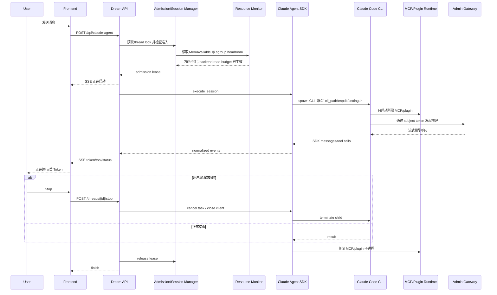
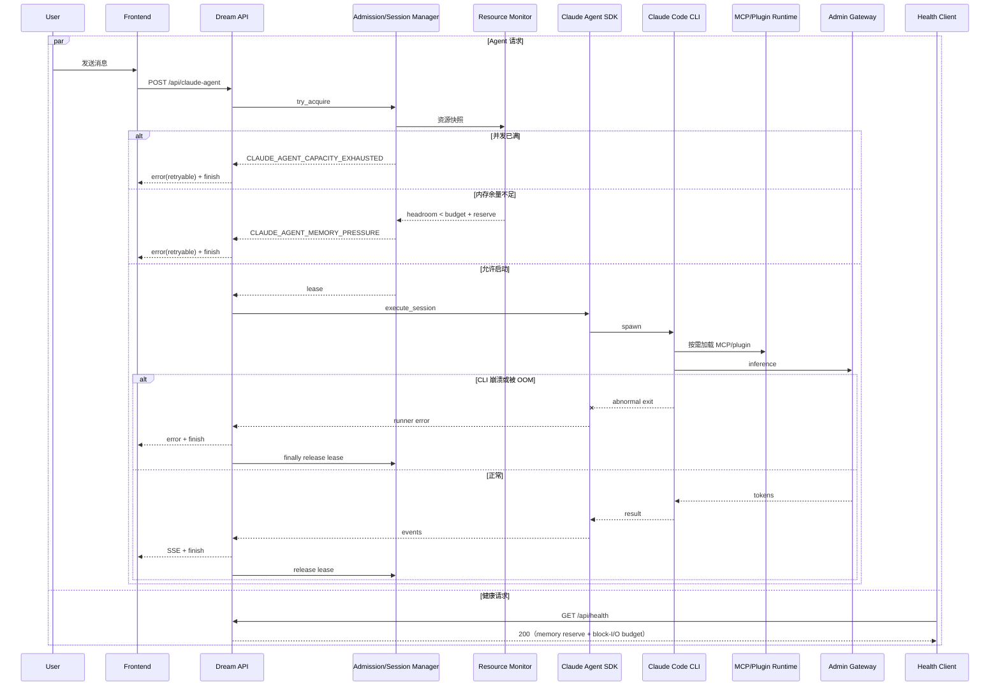

# Claude Code 会话内存优化与资源准入设计
<!--
[Input] Remote OOM/process evidence, current Dream runtime, official Claude Code docs, and restored CLI 2.1.88 source.
[Output] Define root-cause classification, interaction states, minimum implementation, rollback, and validation contracts.
[Sync] 2026-08-22: initial evidence-driven diagnosis and self-reviewed minimum design.
[Sync] 2026-08-22: record the deployed ECS-specific 416+128 MiB budget after
                    the generic 512+128 MiB default proved too close to idle host headroom.
[Sync] 2026-08-22: record the real deployed new/resume turn evidence and add a
                    topology-owned block-I/O limit after read pressure blocked the host.
[Sync] 2026-08-22: record the post-I/O-budget production resume acceptance,
                    resource recovery, health continuity, and tmpdir receipt.
-->

> 状态：最小内存方案与 I/O 隔离已部署；同一真实 thread 的 resume 生产验收通过  
> 日期：2026-08-22  
> 适用版本：Dream `claude-agent-sdk==0.2.128`、Claude Code CLI `2.1.108`、远端 Node.js `18.20.4`  
> 范围：Dream/Chat 共用的 `/api/claude-agent` 生产运行路径  
> 不包含：数据库变更、Claude Code vendor 补丁、Node heap workaround

## 1. 背景与问题定义

Dream 服务在阿里云 ECS 上可以启动，但一次 Claude Code 对话会令整机长时间无响应并触发后端重启。2026-08-22 的历史只读证据确认一种事故是宿主机级 OOM：内核在 backend 容器 cgroup 中杀死 `uvicorn`，而非单纯的 SSE 超时或 Gateway 失败。部署 MCP 裁剪与准入后，新 turn 完成且无 health 失败；同一 thread 的 resume turn 又复现整机无响应，但本次没有 cgroup OOM，而是宿主在内存回收下持续读取系统盘，形成高 iowait 和大量阻塞任务。

本设计要降低单次会话的可避免内存峰值，在宿主机没有安全余量时拒绝创建新的 Claude 进程树，并为 Claude 所在容器设置可回滚的读取预算，防止它耗尽共享系统盘吞吐。必须保留 Claude Agent SDK、CLI、工具调用、服务端插件、SSE、Workspace、sandbox、Stop 和 resume 的同一条生产路径。

## 2. 当前架构与调用链

```text
POST /api/claude-agent
  -> 持久化用户消息
  -> ClaudeAgentThreadFactory.run_streaming
  -> 每 thread 的 AgentRunState + asyncio.Lock
  -> _run_turn_task
  -> ClaudeAgentService.execute_session
  -> ClaudeAgentRunner.run_streaming
  -> SimpleClaudeAgentSDKClient
  -> ClaudeSDKClient context manager
  -> Claude Code CLI 子进程
     -> subject_token_helper
     -> user / memory / necklace MCP stdio 子进程
     -> 按当前上下文启用的 editor / plugin MCP
```

当前 thread lock 只能防止同一会话并行执行。不同 thread 可以同时创建各自的 CLI 进程树，没有进程级全局准入。`AgentRunStatePool` 的 600 秒 TTL 只缓存轻量 Python runner；每个 turn 仍通过 SDK context manager 创建并关闭一棵 CLI 进程树，因此降低 TTL 不能解决启动峰值。

SDK runner 的默认工具列表还包含 memory、necklace 与 touch-animation 工具；memory/necklace 开关和承载 session retrieval 的 user MCP 在未设置时均返回 true。只要工具前缀存在，runner 就配置独立 stdio MCP；user MCP 还会同时 materialize 未迁移的动画 schema。该行为与当前架构文档中“Pawkeyland 专属 MCP 在 Ink 中不可用”的声明矛盾。

## 3. 版本与适用性基线

| 位置 | Python | Node.js | Claude CLI | Python SDK |
|---|---:|---:|---:|---:|
| 远端实际容器/宿主 | 3.11.16 | 18.20.4 | 2.1.108 | 0.2.128 |
| 本地诊断环境 | 3.13.12 | 24.13.0 | 2.1.220 | 0.2.128 |
| 旧版还原源码 | - | - | 2.1.88 | - |

生产结论只以远端 2.1.108 和当前 SDK 为准。2.1.88 源码比部署版本落后 20 个 patch，仅用于解释导入和初始化形态，不能证明当前二进制内部完全相同。

## 4. 真实性能基线

### 4.1 宿主与容器

| 指标 | 事故后只读采样 |
|---|---:|
| 宿主 RAM | 1.6 GiB |
| 宿主 MemAvailable | 约 673 MiB |
| swap | 2.0 GiB，事故后未使用 |
| backend 容器限制 | memory 1 GiB，memory+swap 2 GiB，CPU 1 |
| backend 当前 RSS / PSS | 262,060 / 260,115 KiB |
| backend cgroup current / peak | 约 281.5 / 424.4 MiB（重启后周期） |
| Admin Next 进程 RSS | 约 191,872 KiB |

### 4.2 OOM 时进程树

| 进程 | RSS | 判断 |
|---|---:|---|
| `uvicorn backend.server:app` | 337,460 KiB | 被内核 OOM killer 终止 |
| Claude Code CLI | 200,544 KiB | 单次 Agent turn 的主要 Node 进程 |
| `subject_token_helper` Python | 44,228 KiB | Gateway token helper |
| `user_mcp_stdio` Python | 44,192 KiB | 包含当前会话检索能力；保留 |
| `memory_mcp_stdio` Python | 44,052 KiB | 当前 Ink 默认业务不需要；可避免 |
| `necklace_mcp_stdio` Python | 44,276 KiB | Pawkeyland 领域能力；可避免 |
| 两个 `socat` | 各不足 1 MiB | 不是主要内存来源 |

可直接归因的 Agent 子进程约 368 MiB；禁用两个遗留 MCP 可直接减少约 88 MiB/活跃 turn。事故采样同时出现 load average 56.81、内存 PSI `some=15%` / `full=13%`、I/O wait 57%，解释了 OOM 前“卡死”而不只是瞬时退出。

内核在 `2026-08-22 02:00:45+08:00` 报告 global OOM 并杀死 backend 内的 uvicorn。容器没有先达到 1 GiB hard limit，因此根因是宿主总内存竞争；可用 swap 在事故路径中没有及时提供保护。

### 4.3 证据分类

| 判断 | 状态 | 证据 |
|---|---|---|
| 宿主 OOM 是历史事故的一种直接原因 | 已证实 | kernel journal 的 global OOM、uvicorn kill 回执 |
| 单次 CLI 加 4 个 Python helper/MCP 形成显著峰值 | 已证实 | OOM 进程表与 atop 采样 |
| memory 与 necklace MCP 被默认启动 | 已证实 | 进程树；`agent_runner.py` 默认工具与开关调用链 |
| memory/necklace/touch animation 是当前 Ink 核心能力 | 已排除 | 当前架构文档明确标注为未迁移或 Pawkeyland 专属 |
| 不同 thread 存在无界并发入口 | 已证实 | 只有 per-session lock，没有全局 active-turn 上限 |
| RemoteSessionManager 自动启动 | 已排除 | SDK 未发送 remote-control 请求；旧源码只在显式请求时动态导入 bridge |
| swarm/agent teams 自动启动 | 已排除 | 远端 opt-in env 未设置；旧源码和官方文档均要求显式启用 |
| 正常结束后存在 CLI 子进程泄漏 | 证据不足 | 事故先杀父进程；SDK context manager 和 active-child cleanup 路径存在 |
| Node heap 本身失控 | 证据不足 | CLI RSS 约 196 MiB，没有 heap profile；整体进程树已足以解释 OOM |
| plugin materialization 是主因 | 证据不足 | 事故进程树未见额外 plugin MCP；现有插件能力仍需保留 |
| Admin/Gateway 阻塞是主因 | 已排除 | 资源压力先发生；token helper 是预期子进程但不是最大项 |
| 优化后 resume turn 仍会产生宿主级读取风暴 | 已证实 | `sar`：93,858.51 KiB/s、1360 read IOPS、69.85% iowait、11 blocked；SSH/health/Admin 同时超时 |
| 第二次失响应由 CPU 执行饱和造成 | 已排除 | 同期 `%usr + %sys + %soft` 约 21.66%，backend 已有 1 CPU quota；主要时间为 iowait |
| 第二次失响应由 swap storm 造成 | 已排除 | 同期 `pswpin/s=0`、`pswpout/s=0`；读取来自 page-cache reclaim/文件访问而非 swap |

### 4.4 部署后真实会话与 I/O 复现

首次新建 Chat turn 通过公开生产入口完成，thread 为
`c0577997-fef6-4d8d-ad36-c429f5e6ff09`。backend cgroup 从
292,696,064 bytes 增长到 696,225,792 bytes，增量约 384.8 MiB；宿主最小
`MemAvailable` 约 247 MiB，health 采样 0 次失败。进程树只有 Claude CLI、
subject helper、user MCP 与 editor MCP；没有 memory/necklace MCP，证明裁剪生效。

随后在同一 thread 发起普通 resume turn。backend cgroup 峰值至少约 705 MiB，
没有记录到 cgroup OOM，但 Dream health、Admin 与 SSH 先后超时。重启后读取前一 boot
的 `sar` 数据得到：

| 14:31 指标 | 实测值 |
|---|---:|
| load average / blocked tasks | 21.43 / 11 |
| CPU user + system + softirq | 约 21.66% |
| CPU iowait | 69.85% |
| MemAvailable | 293,852 KiB |
| memory PSI some / full | 32.11% / 27.91% |
| read throughput / IOPS | 93,858.51 KiB/s / 1360.06 |
| block device await / queue / util | 157.17 ms / 214.25 / 81.27% |
| swap in / out | 0 / 0 |

内核在 14:26 同时记录 `systemd-journald: Under memory pressure, flushing
caches`，阿里云控制台记录同一时段“系统盘读写带宽达到规格上限”。因此第二条根因链
为：Agent 进程树压缩宿主 page cache → Claude/运行时文件读取造成回收抖动 → 系统盘
读队列和 iowait 饱和 → uvicorn、Admin、sshd 虽未 OOM 仍无法及时调度完成 I/O。

### 4.5 I/O 预算部署后的同 thread resume 验收

在 backend 的 `/dev/vda` 容器 cgroup 部署 `32 MiB/s` 读带宽和 `400`
读 IOPS 上限后，再次通过公开生产入口对同一 thread 发起 `resume=true`
的受控短回复；请求按当前 `ChatPanel` 合同由平台选择模型，不再由验收
harness 强制模型别名。结果如下：

| 指标 | 部署后实测 |
|---|---:|
| HTTP / SSE | `200`；`text-delta` 4、`message-final` 1、`finish` 1，无 error |
| 整个 turn 时间 | 32.824 s |
| backend cgroup 峰值 | 722,554,880 bytes（约 689 MiB） |
| 宿主最低 `MemAvailable` | 478,864 KiB |
| 宿主读取峰值 | 25.51 MiB/s（未再达到事故速率） |
| health 连续采样 | 67 次、0 失败；最慢 4.65 s |
| 结束后 cgroup / 宿主可用内存 | 稳定在约 355–360 MiB / 806–816 MiB |
| 结束后进程 | 只剩 uvicorn；Claude CLI 与 MCP/helper 已退出 |
| cgroup memory events | `oom=0`、`oom_kill=0`、`max=0` |

`docker inspect` 与容器 `io.max` 均回执
`rbps=33554432,riops=400`。宿主 `/proc/diskstats` 包含 Admin、Docker 和系统进程，
因此其宿主级瞬时 IOPS 不用来代替 backend cgroup 的限额回执。结束后
thread 状态为 `idle`、`turn_count=1`，新的 user/assistant 消息对已持久化。
`CLAUDE_CODE_TMPDIR` 实际为
`/app/data/agent-workspace/c0577997-fef6-4d8d-ad36-c429f5e6ff09/.claude-tmp`，
真实路径一致、thread 与 tmpdir 均非 symlink，权限为 `0700`。

## 5. 用户影响

- 会话从“正在启动”进入长时间无首 Token，页面表现为持续等待。
- backend 健康检查和其他用户请求与 Agent 共享宿主资源，会一并超时。
- OOM 杀死 uvicorn 后，现有 SSE 中断，容器重启期间所有 API 暂时不可用。
- 即使未触发 OOM，系统盘读取饱和也会让 health、Admin 与 SSH 同时超时。
- 用户无法区分资源不足、Claude CLI 崩溃和普通模型错误，也没有明确重试语义。

## 6. 目标与非目标

### 6.1 目标

1. 默认不启动与 Ink 无关的 legacy memory/necklace MCP。
2. 在创建 CLI 进程树前检查进程级并发和真实可用内存。
3. 资源不足时快速返回可重试业务错误，不无限排队。
4. 任意结束路径都释放准入 lease，保持 backend 健康。
5. 通过 topology-owned Docker I/O budget 为 Admin、health 与 SSH 保留系统盘余量。
6. 保留现有 SDK、SSE、resume、Workspace、sandbox、插件与工具确认路径。

### 6.2 非目标

- 不新增数据库表、migration、runtime DDL 或 SQLite fallback。
- 不实现分布式队列、跨 Pod lease、per-user 持久化配额或新状态机。
- 不修改 Claude Code vendor 源码，不升级当前生产版本配对。
- 不把 Node heap 上限当作本轮修复。
- 不改变 `CLAUDE_CODE_TMPDIR`、workspace 或 sandbox 放行边界。
- 不直接部署或在真实生产做破坏性 OOM 注入。

## 7. 约束条件

- Dream/Chat 在所有 topology 中执行同一条业务路径，配置只表达资源能力。
- `CLAUDE_CODE_TMPDIR={AGENT_CWD}/{thread_id}/.claude-tmp`，真实目录、无符号链接、`0700`，sandbox 只放行该精确路径。
- 插件目录、project settings、hooks 与 `can_use_tool` 必须保留。
- 资源阈值集中从环境配置读取，不得散落在路由或 runner 中。
- 日志不得记录 prompt、用户正文、完整命令环境、secret 或 DSN。

## 8. 官方文档证据

1. [Agent SDK Hosting](https://code.claude.com/docs/en/agent-sdk/hosting) 明确一个 SDK session 对应一个 Claude Code 子进程；并发 session 会形成相同数量的独立进程树。官方给出的起始规划值是每个 Agent 1 GiB RAM、1 CPU，并要求以代表性负载的峰值 RSS 重新测量。当前 1.6 GiB 宿主还承载 backend、Admin 和其他服务，不具备无界并发余量。
2. [Python SDK reference](https://code.claude.com/docs/en/agent-sdk/python) 说明 `strict_mcp_config=True` 会只使用显式 `mcp_servers`，忽略 settings/plugin MCP。Dream 的服务端插件是核心能力，因此不能把 strict MCP 作为无差别内存开关。
3. [Remote Control](https://code.claude.com/docs/en/remote-control) 要求 `remote-control` 子命令、`--remote-control` 或交互命令显式启用；Dream 的 headless SDK 参数没有启用它。
4. [Environment variables](https://code.claude.com/docs/en/env-vars) 将 `CLAUDE_CODE_EXPERIMENTAL_AGENT_TEAMS=1` 定义为 experimental agent teams 的 opt-in；远端环境未设置。
5. [MCP](https://code.claude.com/docs/en/mcp) 说明 MCP server 在会话生命周期内启动/连接，plugin MCP 在启动期连接；因此减少不需要的 MCP 数量会直接减少每个活跃 turn 的进程和初始化开销。
6. [Agent loop](https://code.claude.com/docs/en/agent-sdk/agent-loop) 说明恢复和长上下文会随轮次增长；这属于持续优化项，但本次启动即 OOM 的证据首先指向固定进程树成本。
7. [Docker Compose services / `blkio_config`](https://docs.docker.com/reference/compose-file/services/#blkio_config) 是当前自托管 topology 的官方资源控制面，支持按设备设置 `device_read_bps` 与 `device_read_iops`。它不要求修改 Claude Code 参数或 vendor 源码，且能由 Compose 独立回滚。

## 9. 旧源码调用链证据

### 9.1 Remote Session

- `src/remote/RemoteSessionManager.ts:95` 定义 manager。
- `src/hooks/useRemoteSession.ts:156` 只在交互 hook 中实例化。
- headless `src/cli/print.ts:3892-3920` 只有收到 SDK consumer 的 `remote_control` control request 才动态导入 `initReplBridge`。

Dream 当前 SDK 没有发送该 control request，故 RemoteSessionManager 不在事故调用链。即使部署版本内部有变化，远端进程和启动参数也没有 Remote Control 证据。

### 9.2 Swarm / Agent Teams

- `src/utils/agentSwarmsEnabled.ts:21-38` 要求 env 或 `--agent-teams` opt-in。
- `src/setup.ts:106-108` 仅在开关开启时动态导入 teammate snapshot。
- 远端 `CLAUDE_CODE_EXPERIMENTAL_AGENT_TEAMS` 未设置，runner 未传 `--agent-teams`。

因此 swarm 不是本次根因，不应添加虚构的“关闭 swarm”配置。

### 9.3 Services

旧 `setup.ts` 同时存在静态 services 引用和按 feature gate 动态导入。没有当前 2.1.108 source map 或 heap profile，不能安全地删改内部 service。使用官方 `--bare` 会同时跳过 hooks、plugin sync、project discovery 等 Dream 依赖能力，故本轮不采用。vendor patch 只有在官方配置和 Dream 应用层控制均失败后才有评估价值。

## 10. 候选方案比较

| 方案 | 官方支持 | 预期收益 | 功能影响 | 成本/升级风险 | 回滚 | 结论 |
|---|---|---|---|---|---|---|
| 默认关闭 legacy memory/necklace MCP | 应用层 capability，SDK 官方 MCP 配置 | 已测约 88 MiB/turn | 不影响当前 Ink 核心；memory 可显式 opt-in | 低/低 | 配置 opt-in 或还原默认列表 | 推荐 |
| user MCP 进程按需 | SDK 官方 MCP 配置 | 约 44 MiB/turn | 整体关闭会丢失 `get_sessions_range` | 中/低 | 保留进程 | 本轮保留 |
| user MCP schema 收窄 | 应用层 MCP 能力合同 | 小幅启动/上下文收益，未单独量化 | 删除未迁移动画；保留 `get_sessions_range` | 低/低 | 恢复注册 | 推荐 |
| plugin/hook/tool 进一步裁剪 | 官方支持 | 取决于插件 | 可能破坏 Deck/Dream 工具与权限链 | 中/中 | 恢复 manifest/config | 延期到逐插件测量 |
| 全局并发准入 + 快速失败 | 应用层进程治理 | 防止 N 倍进程树 | 第二个并发用户需重试 | 低/低 | 最大并发调大或关闭预检 | 推荐 |
| 内存预算预检 | Linux `/proc` + cgroup，应用层治理 | 防止低余量时启动 | 资源紧张时显式拒绝 | 低/低 | 调整集中配置 | 推荐 |
| backend 设备读取 BPS/IOPS 上限 | Docker Compose 官方 `blkio_config` | 直接阻止已证实的约 94 MiB/s / 1360 IOPS 风暴耗尽系统盘 | Claude 冷启动或文件工具可能变慢，API 协议不变 | 低/低 | 删除 overlay 配置并重建 backend | 推荐 |
| 只设置 blkio weight | Docker Compose 官方 | 有竞争时提供相对权重 | 当前 `mq-deadline` 与单容器突发下收益不确定 | 低/低 | 删除 weight | 不单独采用 |
| CLI `nice` wrapper / 更低 CPU quota | SDK `cli_path` 支持 wrapper；OS 调度能力 | 只缓解 CPU 执行竞争 | 实测主要是 69.85% iowait，CPU 执行约 20%；增加 wrapper 维护面 | 低/中 | 恢复 cli_path/CPU | 证据不支持，删除 |
| 持久化排队 | 非 Claude 官方能力 | 平滑突发 | 新状态机、等待/取消/公平性复杂 | 高/中 | 较难 | 不推荐 |
| per-user 并发配额 | 应用层治理 | 多租户公平 | 当前全局上限 1 下无额外收益 | 中/低 | 删除策略 | 延期 |
| 更短 TTL / 空闲清理 | SDK 生命周期管理 | 对泄漏才有效 | 可能增加初始化频率 | 低/低 | 恢复 TTL | 非启动峰值根因 |
| 工作区/上下文限额 | 官方建议 | 长会话可能显著 | 影响 resume/大项目 | 中/中 | 配置恢复 | 后续基于 profile |
| Node heap 上限 | Node 官方能力 | 限制单 Node heap | 可能只把宿主 OOM 变成 CLI OOM | 低/低 | 删除 `NODE_OPTIONS` | 不作为本轮修复 |
| 升级/固定 CLI、SDK | 官方版本治理 | 取决于版本 | 当前 vendor sandbox 配对敏感 | 高/高 | 固定 2.1.108/0.2.128 | 保持当前固定配对 |
| `strict_mcp_config=True` | SDK 官方 | 可能减少隐式 MCP | 会忽略 plugin MCP | 低/中 | 关闭 strict | 不推荐 |
| `--bare` | CLI 官方 | 可能降低启动成本 | 跳过 hooks/plugin sync/CLAUDE.md 等 | 低/中 | 去掉 flag | 不推荐 |
| vendor service patch | 非稳定内部实现 | 未知 | 高回归与升级风险 | 高/高 | 重建原镜像 | 不推荐 |

## 11. 推荐方案

### 11.1 遗留 MCP 按 capability 启动

- 默认工具只保留 Ink 当前需要的 `mcp__user__get_sessions_range`，删除 `mcp__user__touch_animation`、memory 和 necklace 默认工具。
- 保留的 user stdio server 只注册 `get_sessions_range`；不导入 touch handler、不读取动画字典，也不向 CLI 返回动画 schema。
- `INK_AGENT_ENABLE_MEMORY_MCP=1` 是 memory 的明确 opt-in；未设置时不启动。启用后才把 memory 工具加入默认允许列表。
- necklace 没有 Ink capability，legacy 兼容开关保持可识别但默认 false；只有显式 legacy 工具列表与显式开关同时满足时才能启动。
- user MCP 保持启用，因为当前 session retrieval 复用该 server。后续若需再减约 44 MiB，应先把 `get_sessions_range` 拆到更轻的独立 MCP，而不是破坏接口。

### 11.2 单进程准入

在 `_run_turn_task` 调用 service 之前申请进程内 lease：

1. `active_turns >= max_concurrent_runs`：立即拒绝。
2. 读取 `/proc/meminfo` 的 `MemAvailable`。
3. 读取 cgroup v2 `memory.current` / `memory.max`；`max` 为 `max` 时只使用宿主指标。
4. 任一可用指标的剩余量低于 `run_memory_budget + memory_reserve`：立即拒绝。
5. 通过后登记 session；正常完成、取消、timeout、runner 异常、CLI OOM 都在 `finally` 释放 lease。

不持久化排队。SSE 立即得到结构化 `error` 和既有 `finish`，用户可重试；健康检查和其他请求不被排队任务占用。

### 11.3 阿里云 backend 块 I/O 预算

在既有 `docker-compose.platform.yml` 的 `ink-backend` service 上配置：

```yaml
blkio_config:
  device_read_bps:
    - path: ${DREAM_BACKEND_BLOCK_DEVICE:?required}
      rate: ${DREAM_BACKEND_READ_BPS:?required}
  device_read_iops:
    - path: ${DREAM_BACKEND_BLOCK_DEVICE:?required}
      rate: ${DREAM_BACKEND_READ_IOPS:?required}
```

当前 ECS 的 mode-0600 topology 配置为 `/dev/vda`、`32mb`、`400`。该值约为
事故峰值读取带宽与 IOPS 的三分之一，为 Admin、sshd、nginx 与文件系统元数据保留
余量；不是通用默认值。`prepare-env.sh` 要求操作方显式提供设备路径和两个正数预算，
避免环境名分支和路径/阈值散落。限制作用于整个 Dream backend cgroup，因此 Claude
CLI、MCP 及 uvicorn 共用预算；真实验收必须确认 health 仍快速、首 Token 最终成功。

不设置 write 限制：事故写入只有约 22 KiB/s，没有证据支持。也不添加 `ionice`：
目标设备使用 `mq-deadline`，进程级 I/O class 的收益不可验证；容器 `io.max`/Docker
device limits 才是可回执的边界。

## 12. 用户交互状态

| 状态 | 后端信号 | 用户文案/行为 |
|---|---|---|
| 正在启动 | 请求已接收，准入检查中 | “正在启动 Claude…” |
| 等待资源/排队 | v1 不实现持久排队 | 不展示无限等待；直接进入资源不足 |
| 正在运行 | 准入 lease 已获得，收到 start/内容 SSE | 保持现有流式 UI 与 Stop |
| 资源不足 | `CLAUDE_AGENT_MEMORY_PRESSURE` | “服务器资源暂时不足，请稍后重试” |
| 并发已满 | `CLAUDE_AGENT_CAPACITY_EXHAUSTED` | “已有对话正在运行，请稍后重试” |
| 启动失败 | 既有 runner error | 展示错误，保留重试入口 |
| 子进程异常退出 | 既有 error + finish | 明确 Claude 进程异常，不令页面无限 loading |
| 可重试 | error 的 `retryable=true` | UI 可展示重试按钮；本轮保留现有文本兼容 |

## 13. 后端状态机与错误码

```text
IDLE
  -> ADMISSION_CHECK
     -> REJECTED_CAPACITY -> ERROR -> FINISHED -> IDLE
     -> REJECTED_MEMORY   -> ERROR -> FINISHED -> IDLE
     -> ADMITTED          -> RUNNING
        -> COMPLETED      -> RELEASE -> IDLE
        -> CANCELLED      -> RELEASE -> IDLE
        -> FAILED/OOM     -> RELEASE -> IDLE
```

| code | retryable | retryAfterSeconds | HTTP/SSE 语义 |
|---|---:|---:|---|
| `CLAUDE_AGENT_CAPACITY_EXHAUSTED` | true | sweep interval | HTTP 已进入 SSE 时发送 error + finish |
| `CLAUDE_AGENT_MEMORY_PRESSURE` | true | sweep interval | HTTP 已进入 SSE 时发送 error + finish |

不新增公开 route 或 DTO。error event 增加向后兼容字段 `errorCode`、`retryable`、`retryAfterSeconds`；旧前端继续读取 `errorText`。

## 14. 配置合同

| 变量 | 默认值 | 作用 | 校验 |
|---|---:|---|---|
| `INK_AGENT_MAX_CONCURRENT_RUNS` | `1` | 单 backend 进程同时活跃 turn 上限 | 正整数 |
| `INK_AGENT_RUN_MEMORY_BUDGET_MIB` | `512` | 每次新 turn 的保守增量预算 | 正整数 |
| `INK_AGENT_MEMORY_RESERVE_MIB` | `128` | 启动后必须留给 API/系统的余量 | 非负整数 |
| `INK_AGENT_ENABLE_MEMORY_MCP` | `0` | 显式启用 procedural memory MCP | true/false 集合 |
| `DREAM_BACKEND_BLOCK_DEVICE` | 无；ECS profile 必填 | backend I/O 预算对应的宿主块设备 | 绝对 `/dev/...` 路径 |
| `DREAM_BACKEND_READ_BPS` | 无；当前 ECS `32mb` | backend 每秒设备读取上限 | 正数 Compose byte rate |
| `DREAM_BACKEND_READ_IOPS` | 无；当前 ECS `400` | backend 每秒设备读取操作上限 | 正整数 |

事故进程树的实测 Agent 增量约 368 MiB，其中默认关闭的 memory/necklace MCP
合计约 86 MiB；优化后的直接可解释增量约 282 MiB。通用默认继续向上取整为
512 MiB，128 MiB reserve 用于健康检查与非 Agent 请求。首次部署后的实际静置
`MemAvailable` 在约 574–651 MiB 波动，通用 `512+128 MiB` 阈值会在正常波动下
随机拒绝新 turn。因此当前 1.6 GiB ECS 通过 `backend/.env` 显式采用
`416+128 MiB`。首次真实 turn 的 backend cgroup 增量峰值为 403,529,728 bytes
（约 384.8 MiB），416 MiB 预算在实测峰值上保留约 31 MiB 余量，同时给宿主机
保留 128 MiB；该 turn 中宿主最小 `MemAvailable` 约 247 MiB，health 采样无失败。
同一 thread 的后续 resume 在并发 lease 已释放后正常获准，但暴露了独立的磁盘读取
瓶颈；因此内存准入保持，另由 ECS block-I/O budget 约束运行中读取峰值。后续长上下文
峰值决定是否继续调整两组预算。

这不是声称 Claude 官方每 session 只需 512 MiB。官方起始规划仍是 1 GiB；这里是针对现有集成的 admission 增量预算，部署后必须以优化后峰值重新校准。解析或指标缺失时保留并发保护并记录一次 warning；指标存在且不足时 fail closed。

## 15. 内存与并发预算计算

```text
required_headroom = run_memory_budget + memory_reserve

host_admissible = MemAvailable >= required_headroom
cgroup_admissible = memory.max 为 max
                    或 memory.max - memory.current >= required_headroom

admit = active_turns < max_concurrent_runs
        且所有可用资源指标均 admissible
```

宿主容量上限的长期估算遵循官方建议：

```text
max_agents_per_host = floor((host_ram - resident_service_overhead - reserve)
                            / measured_optimized_peak_per_agent)
```

当前远端默认固定为 1，不根据环境名切换。

## 16. 安全边界

- 准入组件只读取 numeric `/proc` 与 cgroup 文件，不读取进程 env 或命令行。
- 日志只记录 session 的安全哈希/现有 session ID、active 数、字节计数和错误码。
- 不改变凭据过滤、用户隔离、plugin manifest、`can_use_tool` 或 sandbox。
- 不改变临时目录：仍由现有 `ensure_claude_code_tmpdir` 在 spawn 前验证真实目录、无 symlink、`0700`。
- memory MCP opt-in 只影响 server-owned capability，不接受用户 env 绕过。

## 17. 日志、指标与可观测性

`sweep_stats()` 合并以下无敏感信息的 admission 快照：

- `active_runs` / `max_concurrent_runs`
- `run_memory_budget_mib` / `memory_reserve_mib`
- 最近 `host_available_mib`
- 最近 `cgroup_headroom_mib`
- `capacity_denials` / `memory_denials`
- `metrics_available`

准入、拒绝和 release 使用结构化字段记录；不得记录 prompt、CLI 完整 argv/env 或用户文件。部署监控可据拒绝计数和 cgroup memory pressure 告警，但本轮不新增外部监控服务。

## 18. 业务时序图

### 18.1 正常启动、运行、取消或结束



### 18.2 资源不足、CLI 崩溃与健康隔离



## 19. 兼容与回滚

- API route、request DTO、SSE 既有字段和 EventBus 均不改变；新增 error 字段向后兼容。
- runner、session pool、resume ID、workspace、plugin manifest 和 SDK context manager 均复用。
- 回滚 legacy MCP：显式 `INK_AGENT_ENABLE_MEMORY_MCP=1`；necklace 仅作为迁移期 legacy 配置，不写入 Ink 示例配置。
- 回滚准入：调高 `INK_AGENT_MAX_CONCURRENT_RUNS` 和预算；代码回滚只涉及独立 admission 模块与 factory 接线。
- 回滚 I/O budget：从 Alibaba overlay 删除 `blkio_config`（或回退 Compose 文件）并只重建 Dream backend；Admin、PG 与数据不变。
- 不改版本与 vendor，故不引入 SDK/CLI 配对漂移。

## 20. 验收标准

### 20.1 本地技术验证

- legacy memory/necklace/touch-animation 不在默认工具和默认 MCP tool list 中。
- memory 显式 opt-in 后恢复对应工具和 MCP。
- 一个 turn 获得 lease；第二个不同 thread 快速得到可重试 capacity 错误。
- host/cgroup 任一余量不足时不调用 runner。
- 正常、取消和异常路径均释放 lease。
- 相关 pytest、语法检查、Markdown 路径检查、`git diff --check` 通过。
- 既有 `CLAUDE_CODE_TMPDIR` 测试继续证明真实路径、无 symlink、`0700` 和精确 sandbox 放行。

### 20.2 部署后真实验收

必须走当前 Dream/Admin/Gateway/PostgreSQL 的公开生产入口，记录：

1. 会话前、启动、首 Token、空闲、结束后的完整父子进程树与 RSS/PSS。
2. 优化后的单 turn 峰值、结束回收，以及相对事故基线至少减少两个 MCP 进程和约 88 MiB 固定 RSS。
3. 对话期间 `/api/health` 持续响应。
4. Stop、timeout、CLI 崩溃后进程树清理且准入 active 回到 0。
5. 第二个并发用户收到可重试 capacity 错误，不创建第二棵 CLI 进程树。
6. 核心 user MCP、plugin、tool call、SSE、resume 正常。
7. `.claude-tmp` 位于真实 thread workspace、无 symlink、权限 `0700`。
8. `docker inspect` 回执包含配置的 read BPS/IOPS；真实 turn 中系统盘读取不突破预算。
9. `sar -u/-d/-q ALL` 证明 iowait、await、队列和 blocked tasks 不再令 SSH/Admin/health 超时。

首次新 turn 已满足首 Token、持久化、MCP 裁剪、内存峰值与 health 要求；未加 I/O
budget 的 resume turn 失败并触发本设计增量。重建后的同 thread resume 已完成并满足
首 Token、health 连续可响应、读带宽受控、结束回收和 tmpdir 合同，因此最小生产
修复验收通过。真实生产不做 CLI kill/OOM 破坏性故障注入；该项只能在隔离环境执行，
且不得以影子服务冒充真实业务验收。

## 21. 设计自审

| 审查问题 | 结论 | 说明 |
|---|---|---|
| 是否直接解决服务器卡死 | 通过 | 去除 88 MiB 固定开销、低余量不 spawn，并硬限制已证实的 backend 读取风暴 |
| 是否有真实证据支持 | 通过 | kernel OOM、进程树、真实 Chat turn、`sar` I/O/CPU/memory PSI、阿里云磁盘告警 |
| 是否保留核心 Claude Code 能力 | 通过 | SDK/CLI/plugins/hooks/user MCP/SSE/resume/sandbox 不变 |
| 是否引入第二套运行路径 | 通过 | 只在现有 `_run_turn_task` 前加 lease |
| 是否引入不必要队列/分布式服务/持久化 | 通过 | v1 快速失败，无新服务 |
| 是否修改数据库 | 通过 | 零 schema 与持久化变更 |
| 是否降低安全边界 | 通过 | tmpdir/sandbox/凭据过滤不变 |
| 是否依赖旧源码内部实现 | 通过 | 旧源码仅用于排除项；实现只改 Dream 应用层 |
| 是否可独立回滚 | 通过 | 配置与独立模块均可回滚 |
| 是否为当前服务器最小方案 | 通过 | 只保留 legacy MCP 裁剪、单进程准入和 Alibaba overlay 资源上限 |

自审删除项：持久化队列、per-user 配额、strict MCP、`--bare`、Node heap cap、CLI
`nice` wrapper、更低 CPU quota、写 I/O 上限、CLI 升级、vendor service patch、分布式
admission。它们没有本次根因所需的证据或会增加当前能力/维护风险。

## 22. 已知风险与延期事项

- 官方建议的 1 GiB/Agent 高于当前宿主可提供的独占预算；本方案降低风险但不能代替服务器扩容。
- 512+128 MiB 是通用保守初值；当前 ECS 使用 416+128 MiB 的显式 topology
  配置，必须用优化后真实峰值继续校准。
- user MCP 与 token helper 每个仍约 44 MiB；进一步合并/轻量化需独立 profile。
- 长 resume context、超大 workspace 和插件 MCP 的增长未在本次事故中单独量化。
- 32 MiB/s / 400 IOPS 是当前 `/dev/vda` 事故峰值校准值，不是跨主机默认；过低会增加首 Token 延迟，过高会重新挤占 Admin/SSH，必须用真实 turn 与 `sar` 联合校准。
- 本次 health 虽然 67/67 成功，但启动期最慢为 4.65 s；2 GiB 级 ECS 仍只有较小的峰值余量，应保留告警并考虑扩容。
- Compose 限制覆盖整个 backend，不只 Claude 子进程；若未来 backend 增加磁盘密集型非 Agent 任务，应拆独立容器或重新分配预算，而不是绕过限制。
- 多 backend 进程/多 Pod 时，进程内并发上限不是全局上限；当前单 backend topology 适用。扩容 topology 后应由每实例资源预算和平台副本数共同约束，不应直接引入数据库锁。
