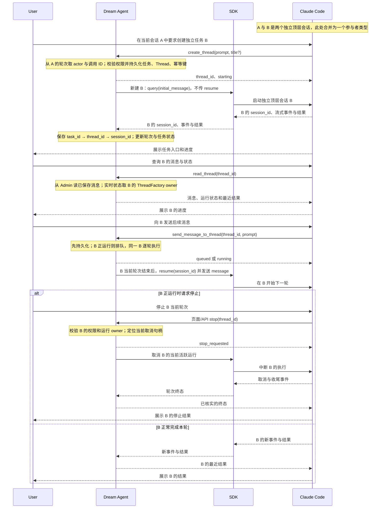

<!-- [Input] Notion「近期需求」任务系统段落、Claude Code restored-src a8a678c、Dream 源码 3206751b 与 2026-09-26 查阅的 Claude Code 官方文档。 -->
<!-- [Output] 顶层 Claude 会话跨会话读取与控制的能力判断、源码证据、任务工具协议、交互状态及验收。 -->
<!-- [Pos] Claude Agent 跨业务会话交互评审稿；现行恢复与停止细则仍见相邻专题文档。 -->
<!-- [Sync] 2026-09-26: 按“在会话 A 中创建并读取独立顶层会话 B”纠正子代理歧义；区分公开会话记录读取、条件开放的命令行能力和拟建任务工具。 -->
<!-- [Sync] 2026-09-28: record the implemented create/list/read/send Dream Thread tools and retain stop as a page/API action. -->

# Claude Code 多会话交互问题判断与任务交互方案

## 一、背景与问题

[Notion「近期需求」](https://app.notion.com/p/3d630b7547c380939b7ef1e16a886b6f)的“任务系统设计”段落设想：笔记弹窗的任务模块按时间展示计划信息和任务进度，左侧预览优先级，右侧浮动窗口展示定时任务及由当前任务发起的其他任务。紧接着的原文提出“还没确认Claude code是否支持多回话交互”，并以 Codex“查询另一个会话的状态，以及对应回话的控制能力”为例。后文分别讨论任务系统、资源下载与 Dream 工作台；由此**推断**问题涉及一个任务界面或执行者观察、控制另一个独立业务会话。原文没有指定控制命令的全集，也没有要求多个调用方同时写入同一个 Claude 会话。

“任务系统通过 Tool 发起一个会话”是本次研究问题的明确表述，但上述页面的可读取正文没有这句话，也没有定义 Tool 的输入输出；不能把它当作笔记原文。这里的目标是**会话 A 通过工具创建一个独立的顶层 Claude 会话 B，之后从 A 列出、读取 B 的记录和运行结果，并向 B 发送消息**，类似 Codex 的独立任务操作；B 不是 A 的子代理。停止 B 保留为用户页面/API 操作。笔记中的页面布局是原始设想，不代表现有任务关系、定时派发或跨任务控制已经实现。[Notion「临时记事本-9-26」](https://app.notion.com/p/3e730b7547c3806183b0d2d5681e062b)另有“要确认Claude code是否支持多回话交互”“还需要支持单个会话流输入”，也未给出 Tool 创建会话的协议。

四项能力必须分开。这里的“支持”仅指对应层的代码或官方接口存在；Dream 是否已提供业务入口见表中边界。官方文档均于 **2026-09-26** 查阅。

| 含义 | 判断 | 证据与边界 |
| --- | --- | --- |
| 单个会话内多轮交互 | **支持**。同一长寿命 `ClaudeSDKClient` 可多次 `query/receive_response`；流式输入允许后续消息与当前进程的中断控制。 | 公开 Agent SDK 能力：[会话](https://code.claude.com/docs/en/agent-sdk/sessions)、[流式输入](https://code.claude.com/docs/en/agent-sdk/streaming-vs-single-mode)；内部还原源码 `src/cli/print.ts:2807-2816,4059-4122`。恢复指定历史标识另见 `src/cli/print.ts:5027-5102`；恢复历史不恢复文件系统或已结束的运行轮次。 |
| 同一进程或任务系统管理多个独立会话 | **需附加条件**。多个客户端或进程可持有不同标识；官方 Remote Control 的 server mode 可由单进程承载多个远端会话，但属于另一个账户与服务入口。Dream 以多个业务 Thread 建立独立状态；任务关系和调度尚未存在。 | 内部 `src/utils/concurrentSessions.ts:49-104`、`src/utils/sessionStorage.ts:198-225`；[Remote Control](https://code.claude.com/docs/en/remote-control)；Dream `backend/claude_agent/thread_pool.py:333-375`。进程登记不等于全局任务管理接口。 |
| 会话 A 的内置 Tool 创建独立顶层会话 B，并让后续消息继续进入 B | **当前不支持**作为已证实的内置工具链。Claude Code `TaskCreate` 创建任务清单项，`Agent` 创建子代理；`SendMessage` 有子代理通信及受条件控制的跨会话文字消息分支，但没有形成顶层会话 B 的创建、读取、恢复和取消协议。`--bg`、`ps`、`logs`、`attach`、`kill` 是受 `BG_SESSIONS` 条件控制的命令行分支，其实现文件在还原目录缺失，不能推断当前 Dream Runtime 可用。宿主可以新增工具：创建独立 Dream Thread 并运行新的 Claude SDK 会话，保存回执标识，后续请求按该标识定位。 | `src/tools/TaskCreateTool/TaskCreateTool.ts:80-89`、`src/tools/AgentTool/AgentTool.tsx:734-760`、`src/tools/SendMessageTool/prompt.ts:5-20`、`src/entrypoints/cli.tsx:182-205`；Dream `backend/routers/claude_agent.py:916-935,1346-1364`。拟建工具不是已发布接口。 |
| 读取另一个独立顶层 Claude 会话 B 的已保存消息 | **支持**，但这是公开 SDK 的会话记录读取接口，需要有 B 的会话标识和可访问的本地转录或配置好的会话存储。`listSessions` 列举会话，`getSessionMessages` 读取消息；读取记录不能证明 B 此刻是否运行。还原源码中的 SDK 入口是占位函数，不能用该目录单独证明已安装包的实际行为。 | [官方会话文档](https://code.claude.com/docs/en/agent-sdk/sessions)“Resume across hosts”；`src/utils/listSessionsImpl.ts:439-453`、`src/utils/sessionStoragePortable.ts:383-409`、`src/entrypoints/agentSdkTypes.ts:167-183,185-210`。公开接口与还原样本分开判断。 |
| 多会话并发运行、恢复、取消和结果回传 | **需附加条件**。独立运行可由宿主按 Thread 调度，指定 Claude 标识可恢复历史；当前进程控制通道只能取消自己持有的运行，Dream 进程内状态池只定位本进程的轮次。跨进程 owner 路由、业务权限、持久化终态和真实包行为仍须验证。 | 内部 `src/cli/print.ts:2830-2862,5027-5102`、`src/tasks/stopTask.ts:38-65`；Dream `backend/routers/claude_agent.py:1634-1707,1792-1814`；公开 [会话](https://code.claude.com/docs/en/agent-sdk/sessions)。不能用 Task ID 推断任意会话可被取消。 |

**结论：读取另一个顶层 Claude 会话已经保存的消息，有公开 SDK 接口；Claude Code 本身没有已证实的内置顶层会话工具链。Dream 已通过宿主 MCP 实现 `create_thread`、`list_threads`、`read_thread`、`send_message_to_thread`：任务对应独立业务 Thread 和 Claude 会话，宿主保存标识并管理运行中的进程。**停止继续使用按业务 Thread 授权的页面/API 路由，不注册模型 Tool。

### 证据口径与还原限制

以下源码路径均相对 `/Users/dmeck/project/claude-code-sourcemap/restored-src/`；Dream 路径相对本仓库。调查时源码仓库提交为 `a8a678c`，Dream 提交为 `3206751b`。还原目录是从 sourcemap 重建的观察样本，不能代替已发布二进制的实际构建。尤其 `src/tools.ts:126-127` 条件引用的 `src/tools/ListPeersTool/ListPeersTool.ts` 和命令行入口条件引用的 `src/cli/bg.js` 在还原目录缺失；`feature('UDS_INBOX')`、`feature('BG_SESSIONS')` 是否进入当前分发包尚未验证。`src/entrypoints/agentSdkTypes.ts:178-182` 的 `getSessionMessages` 也是抛出未实现错误的占位函数，公开 SDK 的实际实现须以安装包验证。源码出现远端控制或跨会话文字消息，只能说明存在相应分支，不能证明本机包已经开放或能可靠控制任意会话。官方资料描述当前公开能力；与还原样本版本不一致时，以运行版本的实测为准。

## 二、目标与边界

1. 用户在笔记任务模块看到与计划关联的任务、其最近业务状态，以及由当前任务发起的其他任务；选择任务可进入其业务 Thread，查看消息和实时进展。Agent 经拟建工具发起任务时，后续消息仍进入该任务绑定的 Thread。
2. 用户可对自己有权操作的正在运行的 Thread 发送消息或停止当前轮次；查看另一个任务的状态不改变当前任务运行。
3. 本稿定义多会话交互和拟建工具合同。计划生成规则、定时调度、任务优先级规则和资源下载的派发合同需要业务设计另行确定；任务与 Thread 的持久化关系是实施前置条件，本轮不新增数据库表或迁移。
4. 不把 Claude Code 的转录列表、后台 Task ID、Subagent ID 当作用户任务实体；不通过杀进程、转录文件修改或另开 Claude 控制服务来实现停止。

## 三、概念与规则

| 概念 | 输入与所有者 | 判断、输出与规则 |
| --- | --- | --- |
| 计划 | 笔记已有计划内容与业务关联；任务模块读取 | 计划文字可展示，但不能仅凭文本推断任务已执行或完成；计划至任务的映射须有业务记录。 |
| 业务任务 | Admin 所有的拟建任务记录，关联唯一业务 `thread_id`；任务服务管理生命周期 | 父子关系和定时触发属于业务数据；任务列表从授权业务数据读取，不扫描 Claude 转录。创建阶段由同一 Admin 数据操作提交任务与 Thread 的绑定；同一个任务的后续消息总是解析到原 `thread_id`。 |
| Dream Thread | Admin 持久化，Dream 路由通过当前 actor 读取 | 一个任务在本方案中绑定一个 Thread；此为待实现的业务约束，不是 Claude SDK 自带能力。一个 Thread 不能同时绑定两个仍开放的任务，避免消息与结果归属不明。 |
| Claude 会话 | Claude SDK 回执，Dream 服务保存关联 | 仅用于当前 Thread 下一轮的恢复；转录缺失依现行恢复规则处理，不在前端作为控制 ID。 |
| 运行轮次 | `ClaudeAgentThreadFactory` 按 Thread 建立的当前 `bg_task`、EventBus 和状态 | 同一 Thread 同时只有一个消费中的推理轮次；查询和流订阅不创建轮次；停止只取消当前轮次。 |
| 状态来源 | 任务记录、持久化轮次结果、`/status` 的进程内快照与运行流 | 任务完成由业务完成动作决定，单个 Claude 轮次成功只使任务进入“等待后续消息”；`not_found` 只说明当前进程没有状态，不能当作“任务不存在”或“已完成”。 |

读取和控制其他任务之前，服务端先用当前 actor 校验目标 Thread 所有权，再判断任务关系与当前操作权限；关联关系本身不能授予跨用户访问。页面上只显示对用户决策有帮助的状态、结果和操作。重复点击停止时只保留一项请求，不加无必要的确认弹窗。

### Dream Thread Tool 与会话标识协议

以下接口由当前仓库实现。工具执行器从当前已认证 Agent 轮次取得 actor、来源 `thread_id` 与 `tool_use_id`；模型不得在参数中自报用户身份、Claude `session_id` 或目标进程。读取和发送对目标 Thread 重新校验 owner，再调用与页面相同的消息、队列和运行服务。创建请求的幂等键由服务端以来源消息和 `tool_use_id` 构造；调用方重试同一次工具结果时返回同一个任务与 Thread，不能新建第二个 Thread。

| 工具与输入 | 成功输出 | 校验和失败反馈 |
| --- | --- | --- |
| `create_thread`：`prompt`、可选 `title` | `thread_id`、`starting|failed` | Admin 幂等建立内部来源关系与独立 Thread 后派发首轮。内部 `task_id` 不进入模型协议；SDK 不传 `resume`，真实 Claude `session_id` 只保存于服务端。 |
| `list_threads`：可选 `query`、`limit` | 当前用户可见的 Thread ID、标题和时间摘要 | 使用 Admin owner 过滤的列表/搜索操作；不读取 Claude 标识，不启动推理。 |
| `read_thread`：`thread_id`、可选 `message_limit` | `starting|running|idle|failed|not_started`、近期已保存消息 | 先核实当前用户拥有目标 Thread；实时运行状态取 ThreadFactory，消息取 Admin，不从一帧 SSE 或自然语言推断状态。 |
| `send_message_to_thread`：`thread_id`、`prompt` | 稳定 `message_id` 与 `queued|dispatching|state_unknown` | 服务端以来源消息、调用 ID 和目标 Thread 生成幂等消息 ID；B 正运行时排队，空闲时以保存的会话 ID `resume`。 |

业务任务状态的修改另由有权用户或明确授权的任务完成动作执行；不能从 Claude 工具结果中的自然语言推断“任务已完成”。页面发送后续消息仍用现有 `POST /api/claude-agent` 和授权取得的 `thread_id`；Agent 使用 `send_message_to_thread` 的同一 `thread_id`。两条入口汇入同一运行服务和同一持久化、锁、admission、EventBus 路径。B 正运行时接收并顺序派发，不允许第二轮与第一轮并发。

任务关系和后续消息队列需要新表或字段时，先在 Admin Drizzle 提交前向 migration 与 capability，再实现 Admin 数据操作及 Dream 消费；缺少 capability 时创建工具明确失败，不在 Dream 建表。首轮模型尚未返回 Claude 标识时，映射只有 `task_id → thread_id`；收到真实 SDK 初始化回执后，沿用现有 Service 持久化 `thread_id → claude_session_id`。后续消息和读取只能由服务端解析此映射，不能接受模型传入的 Claude 标识。SDK 的会话记录读取要求本机转录仍可访问，跨机器则需要已配置的会话存储；读取失败返回明确错误，不能把空结果当作会话不存在。

## 四、源码证据与能力结论

| 环节 | 文件、函数和行号 | 观察到的行为 | 结论边界 |
| --- | --- | --- | --- |
| 命令行入口 | `src/entrypoints/cli.tsx:28-47,108-127` `main`；`src/main.tsx:976-988` 命令选项 | 启动器进入主命令，主命令声明打印、流式输入输出、恢复与 fork 参数。 | 参数存在不代表多调用方共享同一进程。 |
| 打印模式输入 | `src/cli/print.ts:5199-5233` `getStructuredIO`；`:2807-2816,4059-4122` | 一个输入流持续读结构化消息；用户消息进入命令队列，`run()` 消费。 | 这里是单个 Claude 进程的输入队列，不是全局会话路由。 |
| 模型与工具流 | `src/cli/print.ts:2147-2244` `ask` 消费循环；`src/query.ts:219-279` `query/queryLoop` | `ask` 逐步产出消息；输出队列向调用方写流式消息和结果。 | 结果与流属于当前进程当前会话。 |
| 会话标识 | `src/cli/print.ts:4062-4109,5210-5220`；`src/utils/sessionStorage.ts:198-225` | 用户消息去重按当前 `getSessionId()`，转录路径以当前会话标识命名。 | 消息里的 `session_id` 并非可直接访问另一进程的控制句柄。 |
| 保存与查询历史 | `src/utils/sessionStorage.ts:1128-1155` `appendEntry`；`src/utils/listSessionsImpl.ts:29-65,235-295` | 当前记录写入转录；其他标识的写入需已找到相应文件；列表读取转录元数据并去重。 | 历史列表是磁盘记录，不是实时运行状态。 |
| 恢复或切换 | `src/cli/print.ts:4907-4985,5027-5102,5147-5186` `loadInitialMessages`；`src/utils/sessionRestore.ts:403-505` | `continue` 找最近记录，`resume` 找指定记录；非 fork 时切换当前会话标识并恢复内存状态；缺失记录报错。 | 恢复记录不等于接管仍在运行的进程。 |
| 独立进程登记 | `src/utils/concurrentSessions.ts:49-104,163-203` `registerSession/countConcurrentSessions` | 顶层进程写进程号和会话标识登记并统计存活进程；该文件的错误按日志处理。 | 登记用于发现与统计，未提供任务业务状态或跨进程强一致取消。 |
| 当前进程取消 | `src/cli/print.ts:2830-2862`；`src/query.ts:1011-1051,1484-1515` | `interrupt` 控制消息中止当前控制器；查询循环在流和工具阶段处理取消，生成中断结果。 | 需要持有目标进程的控制通道；收到控制响应也不等于已完成全部取消收尾。 |
| 远端连接分支 | `src/remote/RemoteSessionManager.ts:95-140,219-241,291-296` | 远端管理器以单个配置的 `sessionId` 建立连接、发送消息及 `interrupt`。 | 属于远端服务协议，不应直接作为 Dream 本地接口承诺。 |
| 跨会话消息分支 | `src/tools.ts:126-127,226-227`；`src/tools/SendMessageTool/prompt.ts:5-20`；`src/tools/SendMessageTool/SendMessageTool.ts:585-665` | `UDS_INBOX` 控制 `ListPeers` 和跨会话发送；远端消息要求权限，且跨会话只接受纯文本。 | `ListPeersTool` 源文件缺失，构建开关未知；消息排队不等于状态查询、取消或交互式共享会话。 |
| Claude 任务清单与子代理 | `src/tools/TaskCreateTool/TaskCreateTool.ts:18-42,80-89,121-127`；`src/tools/AgentTool/AgentTool.tsx:82-100,140-155,734-760,1327-1337`；`src/tools/SendMessageTool/SendMessageTool.ts:800-868` | `TaskCreate` 返回任务清单 ID；`Agent` 后台分支返回代理 ID；`SendMessage` 按代理 ID 排队后续文本，已停止或状态已清除时尝试从转录恢复。 | 子代理与任务清单 ID 的所有者均为 Claude 当前工具运行环境，代码没有创建或绑定 Dream 业务 Thread；转录缺失时后续消息失败，不能将此证据写成“Tool 已可创建产品会话”。 |
| 后台任务工具 | `src/tools/TaskOutputTool/TaskOutputTool.tsx:183-239`；`src/tasks/stopTask.ts:31-65` | `TaskOutput`、`stopTask` 从当前 `AppState.tasks` 取任务并检查状态。 | 任务标识不是任意 Claude 会话标识；不能用它控制 Dream 另一业务会话。 |
| Dream 业务身份与隔离 | `backend/routers/claude_agent.py:1346-1364,1423-1451`；`backend/claude_agent/thread_pool.py:333-375` | 建立并列出业务 Thread；内存状态和锁按 `thread_id` 维护。 | 线程列表与内存运行状态分属持久化和进程内两层。 |
| Dream 运行与订阅 | `backend/claude_agent/thread_factory.py:322-369`；`backend/routers/claude_agent.py:1634-1658` | 新轮次按业务标识加锁；重连只订阅已有 EventBus，未运行时返回冲突。 | 并发订阅允许多个读取者，不应发起第二个推理轮次。 |
| Dream 查询与停止 | `backend/routers/claude_agent.py:1661-1707,1792-1814`；`backend/claude_agent/thread_factory.py:711-764` | 路由先核对 actor 对 Thread 的权限；状态来自进程内快照；停止取消目标 `bg_task`，不删除 Thread。 | `not_found` 表示没有进程内状态，不能解释为业务 Thread 不存在；停止只覆盖持有该任务的进程。 |
| 已有 Agent 跨笔记查询工具 | `backend/libs/claude_agent_kit/server/sessions_tool.py:11-32,66-74`；`backend/libs/claude_agent_kit/server/user_mcp_stdio.py:9-19` | `mcp__user__get_sessions_range` 经当前轮次的私有投影读取历史日记 Session。 | 这里的 Session 是笔记业务数据，未返回其他 Dream Thread 的实时状态，也没有停止操作。 |
| Dream Claude 恢复 | `backend/claude_agent/service.py:2066-2116,2228-2245`；`backend/libs/claude_agent_kit/server/agent_runner.py:3893-3944`；`backend/libs/claude_agent_kit/server/simple_cas_client.py:87-121` | 从授权 Thread 取 Claude 标识，检查当前转录后设 `resume`；SDK `ClaudeSDKClient` 执行 `query/receive_response`，结果返回真实标识。 | Dream `thread_id`、Claude `session_id` 与进程内状态是不同身份；缺失转录可 fresh，数据库故障不得按 fresh 处理。 |

### 官方资料对照

| 等级 | 判断 | 来源 |
| --- | --- | --- |
| 源码已证实 | 本地打印模式可持续读取多条输入、流式输出、按标识恢复、接收当前进程 `interrupt`；Dream 已有授权后的按 Thread 状态、订阅与停止入口。 | 上表对应函数与行号。 |
| 官方资料说明，但本次还原源码未完整证实 | Agent SDK 可用一个 `ClaudeSDKClient` 连续对话，进程重启后用指定标识 `resume`；会话历史不包含文件系统快照。 | [Work with sessions](https://code.claude.com/docs/en/agent-sdk/sessions)、[Streaming Input](https://code.claude.com/docs/en/agent-sdk/streaming-vs-single-mode)，查阅于 2026-09-26。 |
| 仍需实验验证 | 当前已安装 Runtime 的构建开关、跨会话消息与状态能力；多客户端指向同一 Claude 标识时的写入竞争；Dream 多进程或多实例时状态和停止的 owner 路由。 | 还原缺失 `ListPeersTool`，进程内 `AgentRunStatePool` 无跨进程定位；本文不将这些能力作为当前业务承诺。 |

Claude [Managed Agents sessions](https://platform.claude.com/docs/en/managed-agents/sessions) 是另一项托管服务的资源和接口，不能据其 `GET /v1/sessions/{id}` 或 `user.interrupt` 推断本仓库所用本地 Claude Code Agent SDK 具备相同控制平面；该官方页面查阅于 2026-09-26。

## 五、处理建议

### 可行路径与推荐

| 路径 | 适用条件 | 取舍 |
| --- | --- | --- |
| **推荐：Dream 业务 Thread 控制** | 笔记中的任务要关联用户可见 Chat/Run；沿用现有授权 Thread 与正常业务持久化。 | 列表、状态、订阅、停止可复用；定时派发、父子任务关联和汇总另按业务设计；跨进程部署前须补 owner 路由。 |
| 长寿命 `ClaudeSDKClient` | 单个调用方在同一进程内连续多轮、需要即时 SDK 控制消息。 | 简单，但生命周期绑在调用方进程；不提供另一业务 Thread 的查控。 |
| 每轮新客户端加 `resume` | 已有 Claude 标识、转录可用，且业务已把请求串行化。 | 可跨进程重启恢复历史；必须保存精确标识并检查转录；不能接管旧进程的运行中轮次。 |
| Claude 远端控制或跨会话消息 | 构建、账号、服务和具体协议均经运行包实验核实，并有明确业务授权。 | 当前仅为调查候选；不能替代 Dream 的权限检查、任务状态和停止结果。 |

Agent 工具以 `task_id` 定位业务任务；任务服务授权后解析唯一的 `thread_id`。页面从授权任务详情取得 `thread_id` 并调用现有 Dream 路由。Dream 保持现有 `thread_id → claude_session_id` 持久化关联，持有运行轮次的进程保存内存状态和取消句柄。Claude 标识、进程句柄及用户凭证不进入工具参数或浏览器状态。不同业务 Thread 可并发；同一 Thread 的新轮次遵守既有锁和 admission。多个页面可订阅同一运行流；停止由用户显式动作触发，且只作用于选定 Thread 的当前轮次。多个调用方同时向同一个 Claude 标识写入的结果尚未证实，业务层不得允许绕过 Thread 串行化。

如果“一个任务中的 Agent 查询或控制另一个任务”也属于目标，先复用 Dream 的业务 Thread 状态与停止服务，提供按当前 actor 和目标任务关系授权的内部操作入口，再投影为 Agent 工具。已有 `mcp__user__get_sessions_range` 只检索日记记录，不能直接承担实时任务控制。Agent 的只读状态查询与停止请求分别定义输入、授权和结果；停止回报 `stop_requested` 与后续核实的终态，不把一条发往其他 Claude 会话的文本消息视为控制成功。下节列出的工具均为拟建合同，本轮未实现。

**最小验证方法（待实施，不属于本次研究已通过的测试）：**在明确命名且可删除的隔离数据上，以假模型调用拟建创建工具一次、重试同一调用 ID、向返回的 `task_id` 发送后续消息，并通过公开 Dream 路由核对只有一个任务和 Thread、两轮消息落在同一 Thread。再创建第二个任务，检查独立事件流、跨任务状态读取、只停止目标轮次而另一任务持续运行；模拟断开后订阅而不重启推理；进程重建后检查历史与 Claude 标识恢复。权限拒绝、停止响应不确定及 `not_found` 的语义分别断言。若要宣称真实业务验收，必须按仓库协议使用正常本机 Dream、Admin、Gateway、PostgreSQL 与指定真实账户，并保留 Admin 可查记录；本次没有执行该类验收。

## 六、交互流程与验收

1. **Tool 创建：**当前 Agent 调用 `create_thread`；服务从轮次上下文取得 actor 和调用 ID。Admin 幂等创建来源关系与 Thread，Dream 在该 Thread 非阻塞派发首轮消息；工具立即返回业务 `thread_id` 和启动状态，后续结果写入该 Thread 的正常消息与完成交接记录。
2. **任务模块：**以当前笔记或计划业务标识请求授权任务关系、进度和子任务摘要；输入为业务标识，输出为可见任务及其 `thread_id`。没有关系记录时只展示已有计划。
3. **任务详情：**`read_thread(thread_id)` 先校验目标 Thread owner，再读取 Admin 已保存消息并合并 ThreadFactory 当前运行状态；查询 B 不切换 A 的 Claude 标识，也不发起新的模型调用。页面仍可按同一 `thread_id` 读取消息、状态和流。
4. **发送消息：**页面在目标 Thread 内通过现有 `POST /api/claude-agent` 提交正常业务轮次；Agent 用 `send_message_to_thread(thread_id,prompt)` 进入同一路径。目标轮次正在运行时先持久化消息并排队；轮次结束后按顺序由 SDK 使用 B 保存的 Claude 标识 `resume`，继续 B 而非创建 C。Factory 使用目标 `thread_id` 的锁和 admission。
5. **停止与完成：**用户在目标任务详情执行停止当前轮次时，调用现有 `POST /threads/{thread_id}/stop`；Route 校验所有权，Factory 取消该 Thread 的当前后台轮次；随后读取状态和消息终态。只有独立的业务完成或取消动作改变任务终态。停止轮次不删除任务、Thread 或 Claude 转录。
6. **刷新或恢复：**重新读取持久化任务、Thread 与消息，再由运行轮次 owner 提供状态和流。单纯离开页面或流断开不等于停止任务；进程重启后先核对最近已持久化轮次，未确定结果时不得自动重发首轮或 Tool 调用。
7. **Agent 跨 Thread 操作：**`list_threads`、`read_thread`、`send_message_to_thread` 使用当前 actor 对目标 Thread 逐次做 owner 校验；模型无停止 Tool，停止由页面/API 处理。

| 模块 | 输入 | 输出与失败处理 |
| --- | --- | --- |
| 笔记任务模块 | 笔记/计划业务标识、当前 actor | 授权任务关系、进度摘要；关系数据不可用时展示加载失败，不推断 Claude 状态。 |
| `backend/routers/claude_agent.py` | actor、目标 `thread_id`、查询/流/停止/消息请求 | 先校验 Thread 所有权；不存在或无权返回 404，未运行的流返回 409；不向浏览器返回 Claude 标识。 |
| `ClaudeAgentThreadFactory` 与状态池 | `thread_id`、Run 请求或 Stop 请求 | 单 Thread 锁、当前运行状态、事件订阅、取消句柄；进程无状态时返回 `not_found`。 |
| `ClaudeAgentService` 与 Runner | 授权 Thread、设置、消息、可恢复 Claude 标识 | 选择 fresh/resume，运行 SDK 并产出事件和真实会话回执；持久化失败或转录读取错误依现有规则反馈，不把未知结果写为完成。 |
| Admin 数据所有者 | actor grant、Thread、消息与未来任务关系 | 返回授权业务数据与持久化结果；若任务关系需要新 schema，先在 Admin Drizzle 发布 migration/capability，Dream 仅消费已发布能力。 |
| Thread Tool 适配器 | 当前 Agent 轮次 actor、`tool_use_id`、业务 `thread_id` | 创建来源关系、列出/读取授权 Thread、记录发送幂等键；复用 Dream 生产运行入口，不复刻 Claude 消息循环。能力缺失时明确失败。 |

### 状态转换和失败反馈

| 业务任务状态 | 触发与证据 | 下一状态或反馈 |
| --- | --- | --- |
| 创建中 → 排队中 | Admin 已提交任务、Thread、绑定和调用幂等键，首轮尚未获执行资格 | 派发器按现有 admission 获取运行资格后转“运行中”；创建交易失败则返回错误且不展示已创建任务。 |
| 运行中 | 目标 owner 确认运行轮次，且 `/status.running=true` 或有效事件流正在产出 | 当前轮次成功后转“等待后续消息”；轮次失败后转“失败”；请求停止当前轮次后转“停止处理中”。成功的单轮结果不能直接宣称整个任务“已完成”。 |
| 等待后续消息 | 当前轮次终态及消息已持久化，业务任务仍开放 | 后续消息进入原 `thread_id` 并转“运行中”；有权主体显式完成任务后转“已完成”；显式取消后转“已取消”。 |
| 失败 | 首轮派发或当前轮次有可核对失败结果，并保存失败原因 | 明确的重试或后续消息使用原任务与 Thread 转“排队中”；未知是否执行成功时先进入“状态待核对”，不得重放。 |
| 停止处理中 | `/stop` 已回报 `stop_requested`，但尚无终态 | 核对轮次终态后，任务仍开放则回“等待后续消息”，并在最近轮次显示“已停止”；若同时请求取消任务，终态核实后转“已取消”。响应超时先转“状态待核对”。 |
| 已完成、已取消 | 有权主体的业务完成或取消动作已持久化，且没有未决运行轮次 | 保留 Thread、消息、轮次结果和父子关系；不再接受普通后续消息。 |
| 状态待核对 | `/status` 不可达、返回 `not_found` 且无可判定持久化终态，或 owner 进程重启 | 查询持久化轮次和 owner；确认仍运行则回“运行中”，确认终态则到对应状态，无法确认则保持待核对并提示刷新。不得自动重发模型消息。 |

错误处理：目标 Thread 不存在或无权时不泄露其标题、状态和历史；任务关系 capability 不可用时创建工具失败，不创建虚拟任务；`/stream` 返回 409 时读消息与状态；同一 Thread 并发新轮次遵循当前锁和 admission 反馈；恢复的 Claude 转录缺失按当前项目恢复规则创建新 Claude 会话，数据库、权限或文件读取错误则保留失败，不降级为 fresh；停止响应失败或超时应复核，不重放消息。多进程或多实例下现有进程内状态池无法定位其他进程的当前轮次，在增加 owner 路由并验证前不得对外宣称跨实例停止可靠。轮次事件与任务状态的转换应由服务端依据持久化结果执行，浏览器不以收到一帧消息自行判定任务终态。

### 时序

下图只展示四个对外交互角色。工具适配、身份认证、权限校验、任务与 Thread 的持久化绑定、消息排队、运行状态和取消句柄均由 Dream Agent 一侧完成；SDK 负责创建、恢复及读取 Claude 会话。会话 A 是发起工具调用的当前 Claude Code 会话，B 是新建的独立顶层会话。

创建工具的即时返回只表示任务、Thread 与首轮请求已持久化或已排队；Claude `session_id` 必须来自 B 的真实初始化回执。若在 SDK 回执前崩溃，Dream Agent 用幂等键和持久化轮次核对，不盲目重复创建或重发。读取已保存消息失败时返回“历史暂不可读”及仍可核实的业务状态；未持有 B 运行 owner 时不能承诺实时停止。页面发送新消息走现行 `POST /api/claude-agent` → Factory 锁与 admission → Service 恢复判定 → Runner `ClaudeSDKClient.query/receive_response` → Admin 持久化 → 事件流；工具调用在提取共享业务入口后进入相同路径。

### 影响范围与验收标准

受影响的模块是笔记任务模块、Admin 所有的任务关系与幂等记录、Dream 任务工具适配器、任务详情读接口，以及现有 Dream Thread 列表、状态、消息、流和停止接口的组合。当前源码已覆盖现有 Thread 控制，**没有覆盖**任务创建工具、任务至 Thread 的持久化绑定、业务完成动作与跨进程运行 owner 路由；这些是实施缺口。实现时应把页面和工具接到同一受权运行入口，并保持 Runner、ThreadFactory、Service、EventBus、SSE 及恢复/取消的现有语义。页面展示任务标题、最近进展、等待输入、失败原因和可执行动作；不展示 Claude 标识、进程、转录路径或技术诊断。

验收应覆盖：同一 `tool_use_id` 重试只创建一个任务和 Thread；首轮与后续消息进入同一个业务 Thread，且未暴露 Claude 标识；两个授权任务独立运行与回传，A 的查看、停止不影响 B；同一 Thread 双页面订阅不新增推理；单轮成功后任务等待后续消息，只有业务完成动作才显示已完成；刷新后从持久化消息恢复展示；`not_found` 不被误报为任务完成；未授权任务查询、发送和停止均不泄露信息；创建交易失败不留下孤立绑定，首轮派发失败可查询；停止响应不确定时不假报成功；Claude 恢复有合法记录、缺失记录和数据库失败三种路径；定时任务关系只在实际业务记录存在时显示。技术合同测试与真实业务验收须分开报告，真实验收按仓库 `AGENTS.md` 使用正常业务入口和 Admin 可查回执。

### 待确认事项与不在本次范围内

- **待确认：**计划与任务的业务关系、父子任务归属、什么主体有权标记业务完成，以及定时触发的业务规则；Notion 段落只有交互设想，没有这些约束。
- **待确认：**当前部署是否由单一 owner 进程服务一个运行轮次；若可能跨进程，须先设计 owner 定位和失联核对，再承诺跨实例查询与取消。
- **待验证假设：**还原源码中的条件分支和官方 Remote Control 功能是否存在于 Dream 实际使用的 Runtime 包；这不影响本方案以 Dream Thread 为业务标识。
- **不在本轮交付范围：**业务代码、Admin migration、真实模型运行、定时调度、资源下载派发及远端 Claude 控制服务。本轮设计也不把 Claude Code 子代理、任务清单和 Managed Agents 视为 Ink & Memory 的任务业务对象。

## 七、本次验证边界

本稿来自笔记原文、还原源码静态追踪、Dream 当前源码及官方文档对照。没有运行 Claude 模型、远端控制、跨会话消息或真实业务任务；上述“仍需实验验证”不得在实现评审中写为已支持。
