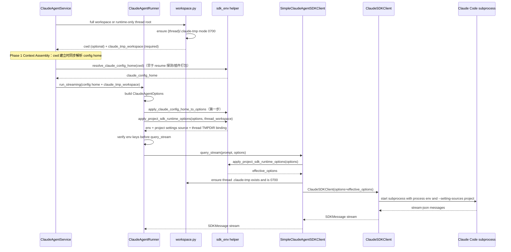

<!-- [输入] Dream SDK options、Runtime resolver、thread Workspace/TMPDIR、用户 SDK 环境和启动资格门。 -->
<!-- [输出] 定义 Claude SDK 子进程环境、config home、临时根、Runtime 选择与回滚合同。 -->
<!-- [定位] Claude Agent SDK 环境与进程启动设计真相源。 -->
<!-- [同步] 2026-08-28：记录 SDK 0.2.144、Runtime 0.1.2 正式 registry 配对、请求参数修复与 provider-free fresh install；standalone 不依赖 ambient Bun。 -->
<!-- [同步] 2026-08-25：CLI resolver 仅服务 Agent turn；MCP Resources 管理面改为 Dream PostgreSQL 与标准 MCP SDK。 -->

> **迁移来源**: Pawkeyland docs/app/design/ClaudeSDKClient 项目 env 注入方案设计.md — 路径和环境变量已适配 Ink & Memory 工程规范。
> **[同步] 2026-05-24**：迁移请求级模型覆盖开关：`PAWKEYLAND_CLAUDE_AGENT_ALLOW_REQUEST_MODEL_OVERRIDE` → `INK_AGENT_ALLOW_REQUEST_MODEL_OVERRIDE`；新 key 加入 `sdk_env.py` 白名单；旧 key 同时保留作为 fallback。
> **[同步] 2026-06-12**：SDK 子进程 env 来源扩展为 `backend/.env` + 当前进程环境；Cloud Run Secret Manager 注入的 `ANTHROPIC_AUTH_TOKEN` 会在启动子进程前显式写入 `ClaudeAgentOptions.env`。
> **[历史，已被 2026-08-23 合同替代] 2026-07-26**：SDK 曾从 `claude-code-sdk 0.0.25` 迁移到 `claude-agent-sdk 0.2.128`，当时 transport 允许 bundled CLI，并曾采用“环境变量 → ambient `claude` → bundled”解析。该顺序只保留为事故根因，不是当前可执行配置；当前唯一顺序见 §5.5A。
> **[同步] 2026-08-22**：`CLAUDE_CODE_TMPDIR` 从共享 `/tmp/claude`
> 迁移到 `{AGENT_CWD}/{thread_id}/.claude-tmp`。Phase 1 通过
> `AgentRunOptions.claude_tmp_workspace` 传递 server-only 绑定，runner 与
> final client adapter 重复合并时保持该绑定，spawn 前创建并校验 `0700`。
> **[同步] 2026-08-26**：生产入口要求 `ink-claude-dream-agent-sdk==0.2.144`
> 唯一提供 `claude_agent_sdk`，并把默认 CLI 收敛为经 production manifest
> 门禁的 `ink-claude-code-dream==0.1.2`。`CLAUDE_CODE_CLI_PATH` 是唯一显式
> 绝对覆盖与官方 CLI 回滚入口；不再回退 ambient `claude` 或 SDK bundled CLI。
> **[同步] 2026-08-24**：Python 依赖文件把
> `ink-claude-dream-agent-sdk==0.2.144` 固定到正式 PyPI 精确版本，
> `uv.lock`/`requirements.txt` 记录 wheel 与 sdist SHA-256，Docker 使用
> `--require-hashes`，并排除 official `claude-agent-sdk`。源码身份仍由不可变
> `v0.2.144@fa10c9ef04ec006d9dcf0a88b1b35dab4ef4723b` 绑定。Docker 验证 metadata/import 所有权，只保留显式官方
> CLI 回滚物。Runtime release `main@c3e4d4e` 已公开发布五个 `0.1.2` npm 包；registry 空目录安装通过生产资格门的 clean-room
> `@glide-the/ink-claude-code-dream@0.1.2` selector 与 darwin-arm64 平台包，
> 默认 PATH 解析、FastAPI 启动和真实 Comfy MCP 两轮 resume 均通过。

# Claude SDK 子进程环境与 Runtime 解析设计

> **迁移来源**: Pawkeyland docs/app/design/ClaudeSDKClient 项目 env 注入方案设计.md — 路径和环境变量已适配 Ink & Memory 工程规范。

> **当前实现状态**：本设计已落地。`server.py` 启动时加载 `backend/.env` 且不覆盖平台已注入变量；Claude SDK 子进程每 turn 重新合并白名单环境、thread config/TMPDIR 和 project-only settings。Gateway 启用后会清除直接 Provider 凭据，再把 `ANTHROPIC_BASE_URL` 等 Claude 协议字段重写为 Admin Gateway endpoint、短期 subject-token helper 和服务端 header；这些字段名不表示 Runtime 获得上游 Provider Key。

> 落地路径：`backend/claude_agent/`、`backend/libs/claude_agent_kit/server/`、`backend/services/admin_gateway/`
> 影响入口：`ClaudeAgentRunner`、`SimpleClaudeAgentSDKClient`、`IClaudeAgentSDKClient.query_stream()`
> 目标：确保服务进程和 Claude Code SDK 子进程都可以读取 `backend/.env` 或平台进程环境中的 Claude Code / Anthropic SDK 相关环境变量，并只加载项目级 Claude Code settings。
> Thread Session 兼容性：Dream 代码中的 `AgentRunState.session_id` 由 `build_session_id(request)` 直接取 `request.thread_id`，因此它是 Dream Thread ID，也是 workspace/享元/EventBus 的键；数据库字段 `claude_session_id` 则是 Claude transcript/resume ID，两者禁止混用。env 注入策略与 Thread 享元层正交。`ClaudeAgentRunner` 被 `AgentRunState.runner` 按 Dream Thread ID 缓存（TTL 默认 600 s）后，每次 `runner.run_streaming(opts, callbacks)` 仍走 §5.2 的 `apply_project_sdk_runtime_options(...)` 重新合并 `backend/.env` + 当前进程环境 + project-only settings source；`backend/libs/claude_agent_kit/server/workspace.py::init_workspace` 在每次 Phase 1 享元未命中时刷新 `.claude` 模板，保证享元复用 runner 不会让 settings 落后于项目根模板。

---

## 1. 背景与已解决问题

Ink & Memory 的 Claude Agent 能力通过 `backend/claude_agent/` 封装 Claude Code SDK。业务层调用链大致为：

1. `ClaudeAgentService.run_streaming()`
2. `ClaudeAgentRunner.run_streaming()`
3. `IClaudeAgentSDKClient.query_stream()`
4. `SimpleClaudeAgentSDKClient`
5. `claude_agent_sdk.ClaudeSDKClient`
6. Claude Code CLI 子进程

本地 `backend/.env` 和 Cloud Run / Secret Manager 注入的进程环境中维护 Claude Code / Anthropic SDK 运行所需环境变量，例如：

- `ANTHROPIC_BASE_URL`
- `ANTHROPIC_AUTH_TOKEN`
- `ANTHROPIC_MODEL`
- `ANTHROPIC_DEFAULT_HAIKU_MODEL`
- `ANTHROPIC_DEFAULT_SONNET_MODEL`
- `ANTHROPIC_DEFAULT_OPUS_MODEL`
- `API_TIMEOUT_MS`
- `CLAUDE_CODE_DISABLE_NONESSENTIAL_TRAFFIC`
- `INK_AGENT_ALLOW_REQUEST_MODEL_OVERRIDE`（请求级模型覆盖开关；旧 `PAWKEYLAND_CLAUDE_AGENT_ALLOW_REQUEST_MODEL_OVERRIDE` 同时保留作为 fallback）

> _(Pawkeyland 原文中 `libs/volcresource/` 的图像、OSS、Volcengine 常量属于 Pawkeyland 专属；Ink & Memory 不迁移 Agent/text runtime 映射函数。)_

历史问题是：即使 `ClaudeAgentRunner` 构造 `ClaudeAgentOptions` 时增加了 `env` 字段，真实 `ClaudeSDKClient` 执行路径仍可能拿不到 `backend/.env` 中这些变量，导致鉴权、模型路由或兼容端点配置不生效。当前由共享 helper、runner 与 final client adapter 双层幂等应用解决。

## 2. 历史现象与当前影响范围

### 2.1 历史现象（已修复）

- Claude Code 子进程启动后无法读取 `.env` 中的环境变量。
- `ANTHROPIC_*` 模型与鉴权配置没有进入 SDK 子进程环境。
- `ClaudeAgentOptions` 层面补充 `env` 后仍出现运行时环境未加载的问题。
- Claude Code 没有默认读取 workspace 内的项目级 `.claude/settings.json`，而是继续受用户目录 settings 影响。

### 2.2 影响范围

受影响路径：

- `ClaudeAgentRunner.run_streaming()` 构造 SDK options 后调用 `_sdk_client.query_stream(...)`。
- `SimpleClaudeAgentSDKClient.query_stream()` 直接创建 `ClaudeSDKClient(options=...)`。
- 任何实现或替换 `IClaudeAgentSDKClient` 时依赖 `ClaudeAgentOptions.env` 传递项目环境的调用方。

不直接影响路径：

- 与 Claude Code SDK 无关的数据库、媒体处理配置。

## 3. 目标与非目标

### 3.1 目标

- `server.py` 启动时加载 `backend/.env`，让 import-time env 配置生效。
- Claude Code SDK 子进程启动时一定能获得 `backend/.env` 或当前进程环境中的 `ANTHROPIC_*` 变量。
- 通过 `ClaudeAgentOptions.env` 向 Claude Code SDK 子进程注入 Claude Code / Anthropic 相关环境变量。
- 将 `.env` 合并逻辑下沉为共享 helper，避免散落在 runner 中。
- `ClaudeAgentRunner` 与 `SimpleClaudeAgentSDKClient` 两条路径都覆盖。
- 显式传入的 `options.env` 优先级高于 `backend/.env`。
- 在 `ClaudeAgentRunner` 传入 `IClaudeAgentSDKClient.query_stream()` 前检查 env key 是否已进入调用链。
- 通过 Python SDK `extra_args["setting-sources"] = "project"` 对齐 TypeScript `settingSources: ["project"]`，避免读取用户目录 Claude Code settings。
- 每次 workspace 初始化时刷新项目根 `.claude` 模板文件到 workspace，保证 `cwd` 下项目 settings 是最新的。
- 增加聚焦回归测试，防止后续 SDK adapter 改动再次漏注入。

### 3.2 非目标

- 不引入 Agent runtime 别名变量。
- 不把 `backend/.env` 全量写入日志、错误事件或 SSE 响应。
- 不改造 Claude Code SDK 内部实现。
- 不处理非 Claude Code SDK 的第三方环境变量加载策略。

## 4. 历史实现问题分析（当前均已收敛）

### 4.1 注入点过高

原先在 `ClaudeAgentRunner` 中读取 `.env` 并构造 `ClaudeAgentOptions.env`。这个位置只能覆盖 runner 标准路径，不能保证所有 `IClaudeAgentSDKClient` 或 `SimpleClaudeAgentSDKClient` 直接使用路径都被覆盖。

### 4.2 import-time 缓存不适合运行时 env

如果 `.env` 在进程启动后被修改，import-time 缓存会造成后续运行仍使用旧值。Claude Code 子进程环境应在子进程启动前合并；helper 每次会重读 `backend/.env`，但同名当前进程环境变量优先，因此平台 env / Secret Manager 变更仍需要重启或重新部署服务后才会生效。

### 4.3 父进程环境与子进程环境边界不清

服务进程需要在导入 `claude_agent` / `config` 等模块前加载 `backend/.env`，否则 `INK_AGENT_TTL_S`、`INK_AGENT_MAX_TURNS`、`INK_AGENT_CONTEXT_SESSIONS` 等 import-time 配置只能看到默认值。Cloud Run 上，`ANTHROPIC_AUTH_TOKEN` 等 Secret Manager 值以进程环境变量形式出现，不会落盘到 `backend/.env`；SDK 子进程通过 `ClaudeAgentOptions.env` 显式携带 `backend/.env` 与当前进程环境中允许透传的 Claude Code / Anthropic 相关值。

### 4.4 direct client 路径缺少兜底

`SimpleClaudeAgentSDKClient` 是真实启动 `ClaudeSDKClient` 的位置。如果仅在上游 runner 设置 `env`，未来其他调用方直接复用 simple client 时仍可能漏掉 `backend/.env`。

## 5. 方案设计

### 5.1 新增共享 helper

在 `backend/libs/claude_agent_kit/server/sdk_env.py` 中维护 SDK 环境合并 helper：

- `project_dotenv_env()`：读取 `backend/.env`，返回适合 `ClaudeAgentOptions.env` 使用的 `dict[str, str]`。
- `process_sdk_env()`：读取当前进程环境，返回适合 `ClaudeAgentOptions.env` 使用的白名单 SDK key。
- `merge_project_dotenv_env(existing_env)`：以 `backend/.env` 为基础，叠加当前进程环境和调用方显式传入的 `existing_env`。
- `apply_project_dotenv_to_options(options)`：读取 options 上已有的 `env`，合并后写回 `options.env`。
- `apply_project_setting_sources_to_options(options)`：设置 `extra_args["setting-sources"] = "project"`。
- `apply_project_sdk_runtime_options(options, thread_workspace=...)`：同时应用 `backend/.env`、当前进程环境、project-only settings source，并将 server-only thread 绑定解析成 `CLAUDE_CODE_TMPDIR`；后续 adapter 二次调用会保留该绑定。

合并策略：

1. 先读取 `backend/.env`。
2. 再叠加当前进程环境中的白名单 SDK key（Cloud Run Secret Manager 注入值在这里生效）。
3. 再叠加 `options.env`。
4. 相同 key 下，`options.env` 覆盖当前进程环境，当前进程环境覆盖 `backend/.env`。
5. 保持变量契约以 `ANTHROPIC_AUTH_TOKEN` / `ANTHROPIC_BASE_URL` 为准。
6. SDK helper 不写入 `os.environ`；服务进程启动阶段由 `server.py` 负责加载 `backend/.env`，并移除不属于当前 Ink Agent 契约的旧 Agent env。

### 5.2 Runner 层使用 helper

`ClaudeAgentRunner.run_streaming()` 仍负责构造完整 `ClaudeAgentOptions`，包括：

- `max_turns`
- `allowed_tools`
- `include_partial_messages`
- `PreToolUse` hooks
- `cwd`
- `mcp_servers`
- `disallowed_tools`
- `model`
- `system_prompt`
- `resume`

构造完成后调用 `apply_project_sdk_runtime_options(..., thread_workspace=opts.claude_tmp_workspace)`，让 runner 标准路径显式携带 env、project-only settings source 与 thread-local temp 绑定。

在传入 `_sdk_client.query_stream(...)` 前，`ClaudeAgentRunner` 还会执行一次调用链检查：

- 只检查关键 env key 是否存在，不读取或输出变量值。
- 如果没有 `ANTHROPIC_AUTH_TOKEN`，则写 warning 日志。
- 如果 auth key 存在，则写 debug 日志，便于排查 Runner 到 SDK client 之间是否丢失 env。

### 5.3 请求级 model 覆盖保护

`ClaudeAgentRunRequest.model` 来自 HTTP `request.model`。该字段适合做"显式覆盖"，但不应默认覆盖 `.env` 中的 Claude Code 模型配置，否则前端默认模型（例如其它供应商模型名）会被透传为 Claude Code `--model`，进而触发 "selected model may not exist or no access" 类错误。

默认策略：

- 如果 `request.model` 为空，不设置 `sdk_options.model`，由 Claude Code 自身和 `ANTHROPIC_MODEL` / `ANTHROPIC_DEFAULT_*_MODEL` 环境变量决定模型。
- 如果 `request.model` 非空，Runner 只记录 key 级诊断日志，不设置 `sdk_options.model`。

显式开启：在 `backend/.env` 中设置 `INK_AGENT_ALLOW_REQUEST_MODEL_OVERRIDE=true`，Runner 才会将 `request.model` 写入 `sdk_options.model`。旧名称 `PAWKEYLAND_CLAUDE_AGENT_ALLOW_REQUEST_MODEL_OVERRIDE` 同样有效（迁移兼容 fallback）。

### 5.4 Client 层启动前兜底

`SimpleClaudeAgentSDKClient.query_stream()` 在进入：

```python
ClaudeSDKClient(options=effective_options)
```

之前，统一调用 `apply_project_sdk_runtime_options(options or ClaudeAgentOptions())`，再通过 options 上的 server-only 绑定调用 `ensure_claude_code_tmpdir(...)`。这一步是 CLI spawn 前的最终目录存在性、非 symlink 与 `0700` 权限闸门。

这保证真实启动 Claude Code CLI 子进程前，最后一层 adapter 会做一次兜底合并。

### 5.5 Claude Code settings source

TypeScript SDK 中可通过 `settingSources: ["project"]` 限制 settings 来源。在 `claude_code_sdk 0.0.25` 时代 Python SDK 的 options 没有 typed 字段，因此统一使用 `extra_args` 透传 Claude Code CLI 参数：

```python
options.extra_args["setting-sources"] = "project"
```

对应 CLI 参数：

```bash
--setting-sources project
```

这样 Claude Code 只加载项目级 settings，避免用户目录 settings 中的模型、Provider 或 hook 配置覆盖当前项目配置。

> **[2026-07-26 注]** `claude-agent-sdk 0.2.128` 已新增 typed `setting_sources` 字段，但**保留** `extra_args` 路径：新 transport 仅在 `options.setting_sources` 被设置时才自行生成 `--setting-sources=` 旗标（本系统不设置该字段），二者不会重复；extra_args 透传行为与旧版一致。

由于 Runner 的 `cwd` 是 workspace 路径，项目级 settings 实际读取路径是 `{workspace}/.claude/settings.json`。因此 `backend/libs/claude_agent_kit/server/workspace.py` 需要在每次 `init_workspace()` 时刷新项目根 `.claude` 模板文件到 workspace，但继续排除 `.claude/skills/`，因为该目录由 workspace skills 软链接机制运行时维护。

### 5.5A Claude Runtime 解析（cli_path）**[2026-08-24 当前合同]**

Dream 只保留一条 Agent 业务路径：`server.py` 在 Agent factory 启动前验证
`ink-claude-dream-agent-sdk==0.2.144` distribution metadata、唯一
`claude_agent_sdk` import provider、公共 `ClaudeAgentOptions` / client / query API
和五类 stream message type。Runner 随后通过既有
`sdk_env.apply_cli_path_to_options()` 只固定 Agent 执行面 CLI。MCP Resources 管理面
不再解析 CLI 身份：Server CRUD/list 从 Dream PostgreSQL 读取，inventory/OAuth 由
标准 MCP SDK 处理，Chat 再把数据库快照投影到 Agent SDK `mcp_servers`。

| 优先级 | 来源 | 语义 |
|---|---|---|
| 0 | `options.cli_path` 已显式设置 | 代码显式值永远优先，helper 直接返回 |
| 1 | `CLAUDE_CODE_CLI_PATH` 环境变量 | resolver 仅接受存在且可执行的绝对路径；版本、哈希和 capability 必须由发布/运维预检，不能把任意可执行文件称为“经验证回滚” |
| 2 | `shutil.which("ink-claude-code-dream")` | 默认自有 Runtime；其 release-relative manifest/capabilities 必须通过生产资格门禁 |
| 3 | 无匹配 | fail closed；禁止 SDK bundled CLI 或 ambient `claude` 静默形成第二条路径 |

默认 Runtime manifest 必须明确 `productionEligible=true`、
`claude-code-stream-json/v1`，并声明以下 13 项能力：streaming、双向 control、
session resume、JSONL transcript、workspace cwd、thread-local TMPDIR、sandbox、
MCP stdio/HTTP/OAuth/management identity、plugins 和 cancel。只透明委托官方 core
或缺少任一能力的 envelope 不满足门禁。Python SDK 已从正式 PyPI 按精确版本与
SHA-256 锁原子切换到自有 distribution；源码发布身份为不可变
`v0.2.144@fa10c9ef04ec006d9dcf0a88b1b35dab4ef4723b`，安装环境不再带 Git `direct_url.json`。

当前 Dream 源码固定的 Runtime 是 clean-room `@glide-the/ink-claude-code-dream@0.1.2`：
源码只来自 Runtime 仓库自有 MIT `src/cleanroom/` 和兼容许可证依赖，
Dream-facing CLI 兼容输出为 `2.1.241 (Claude Code)`。该字符串只表示 Dream 所需
接口资格，不声明官方全产品等价。Bun `1.4.0` 在构建阶段生成四个平台 standalone，
运行时 selector 不依赖独立 Bun 或 ambient Bun。真实业务验收使用的本地 qualification
selector/darwin-arm64 registry tgz SHA 分别为 `0d6ed537…e24ddc3`、
`2c39bf81…aa8eeb2`，executable SHA 为 `44eb30d4…d3fef54`；public registry fresh
install 的两个 CLI alias、manifest SDK `0.2.144`/Runtime `0.1.2` 配对和零 `.map` 均通过。

当前镜像从 npm 官方 registry 精确安装 clean-room selector `0.1.2`，由 optional dependency 选择匹配 Linux 平台包，并在 build 中执行 CLI version、manifest 与 Dream resolver 门。official CLI `2.1.241` 后装，确保 `/usr/local/bin/claude` 仍是显式绝对路径回滚；默认 resolver 只选 `ink-claude-code-dream`。两者都缺失时 fail closed。本机现有用户服务仍执行 `0.1.1` 软链接，本轮不重启或热切换；下次正常构建/启动使用源码固定的 `0.1.2`。

> **环境变量生命周期警告（2026-07-26 生产事故）**：`server.py::_drop_unsupported_agent_env()` 在 uvicorn 启动时清空所有不在 `allowed_ink_names` 白名单内的 `INK_AGENT_*` 变量——`/proc/1/environ` 里能看到不代表 `os.environ` 里还在。`INK_AGENT_SANDBOX_SECCOMP_APPLY_PATH` 与 `INK_AGENT_SANDBOX_EXTRA_ALLOW_READ` 曾因此被静默清除（settings.json 丢失 `sandbox.seccomp`、额外读路径失效），已补入白名单。**新增任何 `INK_AGENT_*` 运行时配置键时必须同步登记该白名单。**

### 5.5B Claude config home 重定向（CLAUDE_CONFIG_DIR）**[2026-08-03 范围修正]**

**范围修正**：`CLAUDE_CONFIG_DIR={cwd}/.claude-home` 不只服务 Plan Mode。注入后 CLI 的**整个 config home** 搬入 per-thread workspace —— `plans/`、`tasks/`、`projects/`（session 转录 JSONL）、`plugins/`、`agents/`、skills/settings 缓存等所有内置功能都不再读取用户真实 `~/.claude`。因此所有需要解析 config-home 相对路径的后端模块（resume 转录探测、plan/tasks 读取、插件打包）必须走统一解析器，绝不直接碰 `~/.claude`。

**统一解析器**：`sdk_env.resolve_claude_config_home(cwd)` 为单一真相源，优先级 `CLAUDE_CONFIG_DIR` 进程环境变量 → `{cwd}/.claude-home` → `None`（调用方回退官方默认 `~/.claude`）。`session_files.get_projects_root(cwd)` 等读取函数全部委托给它。

**注入时机**：决策**不埋在 `run_streaming` 生命周期里**，而是放在 **Phase 1: Context Assembly**（`ClaudeAgentService.assemble_context`）——cwd 在工作区分支建立（`state.with_cwd(cwd)`）时同步调用 `resolve_claude_config_home(cwd)`。Workspace Mode 关闭时不建立 per-thread `.claude-home`；若服务进程存在明确的 server-owned `CLAUDE_CONFIG_DIR`，resolver 仍返回它，否则 SDK 使用默认 config home。该模式只创建 thread runtime root 与 `.claude-tmp`，不设置 `cwd`、不注入 Workspace context、不启用 sandbox；若用户存在 MCP state 则在服务层 fail closed。该点早于 resume 转录探测、Deck 插件打包、plan/tasks 读取等所有 Claude 模块触碰文件系统的时机，结果通过 `AgentRunOptions.claude_config_home` 传入 runner。

**注入顺序**：`run_streaming` 中 `apply_claude_config_home_to_options`（2026-08-03 由 `apply_plan_mode_env_to_options` 更名，旧名保留为兼容包装；常量 `_PLAN_MODE_CONFIG_HOME_DIRNAME` → `_CLAUDE_CONFIG_HOME_DIRNAME`，旧名保留别名）在 `sdk_options` 构造后**第一步**执行 —— 早于 `apply_project_sdk_runtime_options` / plugin launch / cli_path / task_v2 / user_sdk_env。由于 `merge_project_dotenv_env` 中显式 `options.env` 优先级最高，先写入的 `CLAUDE_CONFIG_DIR` 不会被后续任何合并搬移（`CLAUDE_CONFIG_DIR` 仍不在 dotenv/user_sdk_env 白名单内）。runner 对直接调用方保留从 `cwd` 就地解析的兜底。

### 5.5C Claude CLI 临时根（CLAUDE_CODE_TMPDIR）**[2026-08-22]**

`CLAUDE_CODE_TMPDIR` 是服务端运行时身份的一部分，不是普通环境配置。
唯一有效值为规范化后的
`{AGENT_CWD}/{thread_id}/.claude-tmp`。`resolve_claude_code_tmpdir()` 不再读取
process、dotenv、user SDK 或 browser 输入；`ensure_claude_code_tmpdir()`
要求 thread workspace 已存在、拒绝 `.claude-tmp` 符号链接、创建目录并把
权限修复为 `0700`。

Workspace Mode 与临时根是两条独立生命周期：

- 开启时，`claude_tmp_workspace == cwd`，完整 workspace initializer 同时创建
  `.claude-tmp`，sandbox `allowWrite` 放行同一个精确路径。
- 关闭时，`cwd=None` 且不注入 workspace/memory context；
  `get_or_create_thread_runtime_workspace()` 只创建 thread 根和
  `.claude-tmp`，通过 `AgentRunOptions.claude_tmp_workspace` 交给 runner。

Runner 把这个字段记录成 SDK options 上的内部 server binding。最终
`SimpleClaudeAgentSDKClient` 再次应用 env 默认值时沿用该 binding，而不是
从 SDK `cwd` 或 caller `CLAUDE_CODE_TMPDIR` 重新推断。这避免关闭 Workspace
Mode 时退回服务进程目录，也避免容器重建后共享 `/tmp/claude` 缺失导致
inline `--settings` 文件写入 `ENOENT`。

### 5.6 时序图



## 6. 核心改动点

### 6.1 新增文件

`backend/libs/claude_agent_kit/server/sdk_env.py`

职责：

- 定位 `backend/.env`。
- 使用 `dotenv_values()` 读取环境变量。
- 读取当前进程环境中的白名单 SDK key，覆盖同名 `.env` 值。
- 过滤空 key、`None` 值和非 Claude Code / Anthropic SDK key。
- 合并 caller-provided `options.env`。
- 将 TypeScript `settingSources: ["project"]` 映射为 Python SDK `options.extra_args["setting-sources"] = "project"`。
- 返回或写回 `ClaudeAgentOptions.env`。

### 6.2 修改 `ClaudeAgentRunner`

文件：`backend/libs/claude_agent_kit/server/agent_runner.py`

改动：

- 移除 runner 内部 import-time `.env` 缓存。
- 通过 `apply_project_sdk_runtime_options(ClaudeAgentOptions(...))` 同时完成 env 注入和项目级 settings source 配置。
- 默认不把 HTTP `request.model` 写入 `sdk_options.model`。
- 在调用 `_sdk_client.query_stream(...)` 前执行 env key 存在性诊断。
- 保留 runner 原有工具确认、MCP server、stderr capture、session resume 等逻辑。

### 6.3 修改 `SimpleClaudeAgentSDKClient`

文件：`backend/libs/claude_agent_kit/server/simple_cas_client.py`

改动：

- 在创建 `ClaudeSDKClient` 前构造 `effective_options`。
- 如果调用方没有传 options，则创建默认 `ClaudeAgentOptions()`。
- 对 `effective_options` 应用 `backend/.env`、当前进程环境合并和 project-only settings source。
- 再传入 `ClaudeSDKClient(options=effective_options)`。

### 6.4 修改 `workspace.py`

文件：`backend/libs/claude_agent_kit/server/workspace.py`

改动：

- 每次 `init_workspace()` 都刷新项目根 `.claude` 模板文件到 workspace。
- 排除 `.claude/skills/`，继续由 runtime skills 软链接机制维护。
- 保留 workspace 内非模板文件，避免清理用户/运行时资产。

## 7. 兼容性与安全性说明

### 7.1 兼容性

- 保持 `IClaudeAgentSDKClient.query_stream(prompt, options)` 接口不变。
- 保持 `SimpleClaudeAgentSDKClient` 对外行为不变，只增强 options 环境。
- 保持 `ClaudeAgentRunner` SSE、tool confirmation、MCP server、session persistence 行为不变。
- `options.env` 原有显式覆盖能力保留，并优先于当前进程环境和 `backend/.env`。
- 不派生额外 auth key，避免引入未约定的环境变量。
- 默认模型来源为 Claude Code env 配置，避免 HTTP `request.model` 意外覆盖。
- Python SDK 缺少 `settingSources` typed 字段时，通过 `extra_args` 兼容当前版本；未来 SDK 增加 typed 字段后可替换实现，外部接口不变。

### 7.2 安全性

- SDK helper 不把 `.env` 注入父进程 `os.environ`；服务入口会显式加载 `backend/.env` 供 import-time 配置使用，并清理旧 Agent env，避免子进程继承过期配置。
- 不记录环境变量值。
- 不把 token、auth、secret 通过 SSE 或日志输出。
- 文档、测试和错误信息只允许出现环境变量名，不输出真实值。

### 7.3 配置边界

该方案负责把 `backend/.env` 与当前进程环境中的白名单 SDK key 合并到 Claude Code SDK 子进程 options 中。Claude Code SDK 最终如何使用这些变量，仍由 SDK 和 Claude Code CLI 自身定义。

## 8. 测试与当前验证

### 8.1 单元测试

主要回归入口：

```bash
backend/.venv/bin/python -m pytest -q \
  tests/test_sdk_env.py \
  tests/test_dockerfile_claude_contract.py
```

2026-08-24 本轮结果：Docker/registry/resolver 聚焦 `43 passed, 3 subtests passed`；Claude/Dream 相关后端回归 `592 passed, 1 skipped, 181 subtests passed`。覆盖 Runtime resolver、manifest gate、绝对 override、SDK `cli_path`、registry artifact 与 Docker 默认/回滚合同。

持续回归必须覆盖：

- 测试退出码为 0。
- runner 路径可以捕获 `ClaudeAgentOptions.env` 中的 `backend/.env` 和进程环境 key。
- simple client 路径创建 `ClaudeSDKClient` 前已经合并 `backend/.env` 与进程环境。
- 显式 env override 测试通过。
- Runner 缺少 auth key 时的诊断日志不包含任何 env 值。
- SDK options 会携带 `extra_args["setting-sources"] = "project"`。
- workspace 重复初始化会刷新项目 `.claude/settings.json` 等项目模板文件。

### 8.2 语法检查入口

运行：

```bash
python -m py_compile backend/libs/claude_agent_kit/server/sdk_env.py backend/libs/claude_agent_kit/server/agent_runner.py backend/libs/claude_agent_kit/server/workspace.py
```

通过条件：

- 命令退出码为 0。
- 无 Python 语法错误。

## 9. 当前验收状态

- [x] `server.py` 启动加载 `backend/.env`，并在 Agent factory 前验证自有 SDK/Runtime。
- [x] Runner 与 `SimpleClaudeAgentSDKClient` 都幂等应用共享 env/settings/TMPDIR helper。
- [x] `options.env` 显式值优先；Gateway 启用时再由 server-owned adapter 强制覆盖 Provider 路由与凭据。
- [x] SDK options 携带 `--setting-sources project`，Workspace 初始化刷新项目 `.claude` 模板且保留 runtime skills。
- [x] 默认 resolver 只选 qualified `ink-claude-code-dream`；bundled/ambient CLI 不形成第二路径。
- [x] 本机无 override FastAPI 启动通过；Runtime 使用 Bun 1.4.0 standalone，不依赖 ambient Bun。
- [x] SDK/Docker/env/registry 聚焦回归 `43 passed + 3 subtests`，相关后端回归 `592 passed + 181 subtests`。
- [x] 真实账号通过 Chrome Comfy OAuth、两轮 tool call、刷新后同 Thread resume、Logout/Remove，Playwright `1 passed (2.3m)`。
- [x] Docker 默认拓扑从 npm 安装 selector 与匹配 Linux 平台包；official `/usr/local/bin/claude` 仅作显式回滚。

## 10. 风险与回滚方式

### 10.1 风险

- `backend/.env` 和进程环境中非 Claude Code / Anthropic SDK key 不再进入 Claude Code 子进程环境；服务进程仍在启动时加载完整 `.env`，供 session 和 Mem0 等 backend 配置读取。
- 如果调用方显式传入错误的 `options.env`，会覆盖进程环境或 `backend/.env` 同名 key。该行为是设计要求，用于支持测试、临时切换或调用方定制。
- 如果 backend 目录判断错误，`.env` 读取会失败。helper 以 `backend/libs/claude_agent_kit/server/sdk_env.py` 向上定位 backend 目录，需要测试覆盖。
- 如果 Claude Code CLI 版本不支持 `--setting-sources`，子进程会启动失败。当前本地 `claude --help` 已包含 `--setting-sources <sources>`。

### 10.2 回滚方式

如需回滚：

1. 移除 `SimpleClaudeAgentSDKClient.query_stream()` 中的 `apply_project_sdk_runtime_options(...)`。
2. 移除 `ClaudeAgentRunner.run_streaming()` 中的 helper 包装。
3. 移除 `backend/libs/claude_agent_kit/server/workspace.py` 中每次初始化刷新 `.claude` 模板的逻辑。
4. 删除 `backend/libs/claude_agent_kit/server/sdk_env.py`。
5. 删除对应测试用例。

回滚后，Claude Code SDK 子进程将重新依赖调用方显式传入 env 或外部进程环境。

## 11. 后续优化

- 按需扩展 Claude Code / Anthropic SDK env allowlist，避免把业务配置透传给子进程。
- 增加运行时诊断事件，仅输出变量名存在性，不输出变量值。
- 将 SDK env helper 的路径定位策略抽为通用 backend 根目录 resolver，避免未来多个模块重复推导 backend root。
- 评估是否把 `apply_project_sdk_runtime_options` 的合并结果按 `session_id` 缓存进 `AgentRunState`（与 `state.cwd` 同维度），让 Thread Session 享元命中时跳过 dotenv 解析。

## 12. 与 Thread Session 享元的协作

| 关注点 | 享元命中（TTL 内续轮） | 享元未命中（首轮 / TTL 重建） |
|---|---|---|
| `state.runner` | 复用同一 `ClaudeAgentRunner` 实例（包内 SDK 子进程句柄） | `create_agent_runner()` 新建（Phase 2） |
| `apply_project_sdk_runtime_options` | 每次 `runner.run_streaming` 进入仍调用一次（Runner 内部行为，不依赖享元） | 同左 |
| `state.cwd` workspace 模板 | 复用享元缓存路径 → **不**触发 `init_workspace` → 项目 `.claude` 模板**不**刷新 | `Service.assemble_context` 调 `get_or_create_workspace(session_id)` → `init_workspace` → 刷新 `.claude` 模板 + skills symlink |
| Claude Code CLI 子进程 | `runner.run_streaming` 内部按需新建 / 复用，不暴露给享元层 | 同左 |

**操作建议**：当 `backend/.env` 或 `.claude/settings.json` 模板有变化、希望立即生效时：

1. 调 `factory.close_thread(session_id)` 显式销毁当前会话的享元（reason=`explicit_close`，触发 Phase 4 钩子），下一轮自然走重建分支重新加载 env + 模板；
2. 或等待 `INK_AGENT_TTL_S`（默认 600 s）TTL 自然超时由 `AgentRunStateSweeper` 驱逐（reason=`ttl_expired`）；
3. 进程级强制刷新可调 `factory.aclose()` → 重新建 Factory，配合滚动重启策略生效。

> Runner 实例本身不缓存 SDK env 解析结果；`apply_project_sdk_runtime_options` 在每次 `runner.run_streaming` 调用时重读 `backend/.env` 并读取当前进程环境，因此享元复用 `state.runner` 不会冻结 helper 结果。若当前进程环境中已有同名 key，则仍按进程环境优先；平台 env / Secret Manager 变更需要服务重启。`init_workspace` 模板刷新仍受享元 `state.cwd` 影响，需要按上面三种方式之一兜底。
