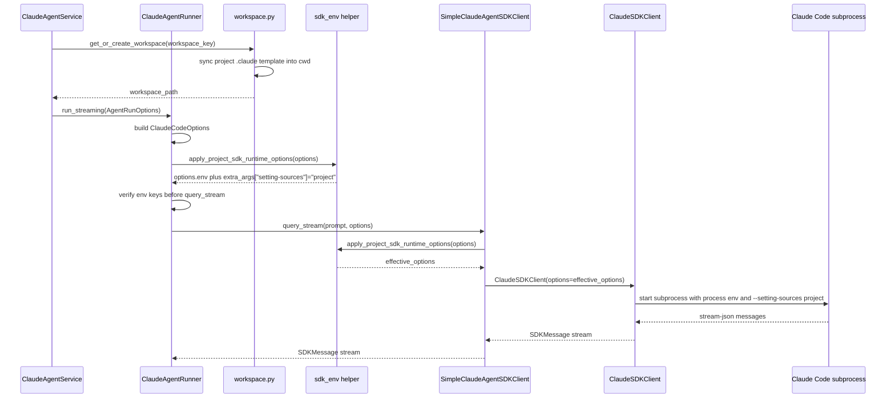

> **迁移来源**: Pawkeyland docs/app/design/ClaudeSDKClient 项目 env 注入方案设计.md — 路径和环境变量已适配 Ink & Memory 工程规范。

# ClaudeSDKClient 项目 env 注入方案设计

> **迁移来源**: Pawkeyland docs/app/design/ClaudeSDKClient 项目 env 注入方案设计.md — 路径和环境变量已适配 Ink & Memory 工程规范。

> **Ink & Memory 简化说明**：`server.py` 启动时先加载 `backend/.env` 到进程环境；Claude Code SDK 子进程每次运行时也从 `backend/.env` 合并 `ANTHROPIC_AUTH_TOKEN / ANTHROPIC_BASE_URL / ANTHROPIC_MODEL` 等直接 SDK 变量。Ink & Memory 不再维护 Agent runtime 别名映射。

> 落地路径：`backend/claude_agent/`
> 影响入口：`ClaudeAgentRunner`、`SimpleClaudeAgentSDKClient`、`IClaudeAgentSDKClient.query_stream()`
> 目标：确保服务进程和 Claude Code SDK 子进程都可以读取 `backend/.env` 中 Claude Code / Anthropic SDK 相关环境变量，并只加载项目级 Claude Code settings。
> Thread Session 兼容性：env 注入策略与 Thread Session 享元层完全正交。`ClaudeAgentRunner` 实例被 `AgentRunState.runner` 享元缓存（`session_id` 维度，TTL 默认 600 s）后，每次 `runner.run_streaming(opts, callbacks)` 仍走 §5.2 的 `apply_project_sdk_runtime_options(...)` 重新合并 `backend/.env` + project-only settings source；`backend/libs/claude_agent_kit/server/workspace.py::init_workspace` 在每次 Phase 1 享元未命中时刷新 `.claude` 模板，保证享元复用 runner 不会让 settings 落后于项目根模板。

---

## 1. 背景与问题描述

Ink & Memory 的 Claude Agent 能力通过 `backend/claude_agent/` 封装 Claude Code SDK。业务层调用链大致为：

1. `ClaudeAgentService.run_streaming()`
2. `ClaudeAgentRunner.run_streaming()`
3. `IClaudeAgentSDKClient.query_stream()`
4. `SimpleClaudeAgentSDKClient`
5. `claude_code_sdk.ClaudeSDKClient`
6. Claude Code CLI 子进程

`backend/.env` 中维护 Claude Code / Anthropic SDK 运行所需环境变量，例如：

- `ANTHROPIC_BASE_URL`
- `ANTHROPIC_AUTH_TOKEN`
- `ANTHROPIC_MODEL`
- `ANTHROPIC_DEFAULT_HAIKU_MODEL`
- `ANTHROPIC_DEFAULT_SONNET_MODEL`
- `ANTHROPIC_DEFAULT_OPUS_MODEL`
- `API_TIMEOUT_MS`
- `CLAUDE_CODE_DISABLE_NONESSENTIAL_TRAFFIC`

> _(Pawkeyland 原文还包含 `PAWKEYLAND_CLAUDE_AGENT_ALLOW_REQUEST_MODEL_OVERRIDE`，属于 Pawkeyland 专属，Ink & Memory 中不适用)_

> _(Pawkeyland 原文中 `libs/volcresource/` 的图像、OSS、Volcengine 常量属于 Pawkeyland 专属；Ink & Memory 不迁移 Agent/text runtime 映射函数。)_

现象是：即使 `ClaudeAgentRunner` 构造 `ClaudeCodeOptions` 时增加了 `env` 字段，真实 `ClaudeSDKClient` 执行路径仍可能没有拿到 `backend/.env` 中这些变量，导致 Claude Code / Anthropic SDK 鉴权、模型路由或兼容端点配置不生效。

## 2. 现象与影响范围

### 2.1 现象

- Claude Code 子进程启动后无法读取 `.env` 中的环境变量。
- `ANTHROPIC_*` 模型与鉴权配置没有进入 SDK 子进程环境。
- `ClaudeCodeOptions` 层面补充 `env` 后仍出现运行时环境未加载的问题。
- Claude Code 没有默认读取 workspace 内的项目级 `.claude/settings.json`，而是继续受用户目录 settings 影响。

### 2.2 影响范围

受影响路径：

- `ClaudeAgentRunner.run_streaming()` 构造 SDK options 后调用 `_sdk_client.query_stream(...)`。
- `SimpleClaudeAgentSDKClient.query_stream()` 直接创建 `ClaudeSDKClient(options=...)`。
- 任何实现或替换 `IClaudeAgentSDKClient` 时依赖 `ClaudeCodeOptions.env` 传递项目环境的调用方。

不直接影响路径：

- 与 Claude Code SDK 无关的数据库、媒体处理配置。

## 3. 目标与非目标

### 3.1 目标

- `server.py` 启动时加载 `backend/.env`，让 import-time env 配置生效。
- Claude Code SDK 子进程启动时一定能获得 `backend/.env` 中 `ANTHROPIC_*` 变量。
- 通过 `ClaudeCodeOptions.env` 向 Claude Code SDK 子进程注入 Claude Code / Anthropic 相关环境变量。
- 将 `.env` 合并逻辑下沉为共享 helper，避免散落在 runner 中。
- `ClaudeAgentRunner` 与 `SimpleClaudeAgentSDKClient` 两条路径都覆盖。
- 显式传入的 `options.env` 优先级高于 `backend/.env`。
- 在 `ClaudeAgentRunner` 传入 `IClaudeAgentSDKClient.query_stream()` 前检查 env key 是否已进入调用链。
- 通过 Python SDK `extra_args["setting-sources"] = "project"` 对齐 TypeScript `settingSources: ["project"]`，避免读取用户目录 Claude Code settings。
- 每次 workspace 初始化时刷新项目根 `.claude` 模板文件到 workspace，保证 `cwd` 下项目 settings 是最新的。
- 增加聚焦回归测试，防止后续 SDK adapter 改动再次漏注入。

### 3.2 非目标

- 不引入 Agent runtime 别名变量。
- 不把 `backend/.env` 全量写入日志、错误事件或 SSE 响应。
- 不改造 Claude Code SDK 内部实现。
- 不处理非 Claude Code SDK 的第三方环境变量加载策略。

## 4. 当前实现问题分析

### 4.1 注入点过高

原先在 `ClaudeAgentRunner` 中读取 `.env` 并构造 `ClaudeCodeOptions.env`。这个位置只能覆盖 runner 标准路径，不能保证所有 `IClaudeAgentSDKClient` 或 `SimpleClaudeAgentSDKClient` 直接使用路径都被覆盖。

### 4.2 import-time 缓存不适合运行时 env

如果 `.env` 在进程启动后被修改，import-time 缓存会造成后续运行仍使用旧值。Claude Code 子进程环境应在子进程启动前合并，避免运行时配置变更无法反映。

### 4.3 父进程环境与子进程环境边界不清

服务进程需要在导入 `claude_agent` / `config` 等模块前加载 `backend/.env`，否则 `INK_AGENT_TTL_S`、`INK_AGENT_MAX_TURNS`、`INK_AGENT_CONTEXT_SESSIONS` 等 import-time 配置只能看到默认值。SDK 子进程通过 `ClaudeCodeOptions.env` 显式携带同一个 `backend/.env` 中的 Claude Code / Anthropic 相关值。

### 4.4 direct client 路径缺少兜底

`SimpleClaudeAgentSDKClient` 是真实启动 `ClaudeSDKClient` 的位置。如果仅在上游 runner 设置 `env`，未来其他调用方直接复用 simple client 时仍可能漏掉 `backend/.env`。

## 5. 方案设计

### 5.1 新增共享 helper

在 `backend/libs/claude_agent_kit/server/sdk_env.py` 中维护 SDK 环境合并 helper：

- `project_dotenv_env()`：读取 `backend/.env`，返回适合 `ClaudeCodeOptions.env` 使用的 `dict[str, str]`。
- `merge_project_dotenv_env(existing_env)`：以 `backend/.env` 为基础，叠加调用方显式传入的 `existing_env`。
- `apply_project_dotenv_to_options(options)`：读取 options 上已有的 `env`，合并后写回 `options.env`。
- `apply_project_setting_sources_to_options(options)`：设置 `extra_args["setting-sources"] = "project"`。
- `apply_project_sdk_runtime_options(options)`：同时应用 `backend/.env` 和 project-only settings source。

合并策略：

1. 先读取 `backend/.env`。
2. 再叠加 `options.env`。
3. 相同 key 下，`options.env` 覆盖 `backend/.env`。
4. 保持变量契约以 `ANTHROPIC_AUTH_TOKEN` / `ANTHROPIC_BASE_URL` 为准。
5. SDK helper 不写入 `os.environ`；服务进程启动阶段由 `server.py` 负责加载 `backend/.env`，并移除不属于当前 Ink Agent 契约的旧 Agent env。

### 5.2 Runner 层使用 helper

`ClaudeAgentRunner.run_streaming()` 仍负责构造完整 `ClaudeCodeOptions`，包括：

- `max_turns`
- `allowed_tools`
- `include_partial_messages`
- `PreToolUse` hooks
- `cwd`
- `mcp_servers`
- `disallowed_tools`
- `model`
- `system_prompt`
- `resume`

构造完成后调用 `apply_project_sdk_runtime_options(...)`，让 runner 标准路径显式携带 `backend/.env`，并强制 Claude Code 只加载项目 settings。

在传入 `_sdk_client.query_stream(...)` 前，`ClaudeAgentRunner` 还会执行一次调用链检查：

- 只检查关键 env key 是否存在，不读取或输出变量值。
- 如果没有 `ANTHROPIC_AUTH_TOKEN`，则写 warning 日志。
- 如果 auth key 存在，则写 debug 日志，便于排查 Runner 到 SDK client 之间是否丢失 env。

### 5.3 请求级 model 覆盖保护

`ClaudeAgentRunRequest.model` 来自 HTTP `request.model`。该字段适合做"显式覆盖"，但不应默认覆盖 `.env` 中的 Claude Code 模型配置，否则前端默认模型（例如其它供应商模型名）会被透传为 Claude Code `--model`，进而触发 "selected model may not exist or no access" 类错误。

默认策略：

- 如果 `request.model` 为空，不设置 `sdk_options.model`，由 Claude Code 自身和 `ANTHROPIC_MODEL` / `ANTHROPIC_DEFAULT_*_MODEL` 环境变量决定模型。
- 如果 `request.model` 非空，Runner 只记录 key 级诊断日志，不设置 `sdk_options.model`。

> _(Pawkeyland 原文中 `PAWKEYLAND_CLAUDE_AGENT_ALLOW_REQUEST_MODEL_OVERRIDE` 开关，属于 Pawkeyland 专属，Ink & Memory 中不适用，默认始终忽略请求级 model)_

### 5.4 Client 层启动前兜底

`SimpleClaudeAgentSDKClient.query_stream()` 在进入：

```python
ClaudeSDKClient(options=effective_options)
```

之前，统一调用 `apply_project_sdk_runtime_options(options or ClaudeCodeOptions())`。

这保证真实启动 Claude Code CLI 子进程前，最后一层 adapter 会做一次兜底合并。

### 5.5 Claude Code settings source

TypeScript SDK 中可通过 `settingSources: ["project"]` 限制 settings 来源。当前 Python SDK 的 `ClaudeCodeOptions` 没有 typed 字段，但支持 `extra_args` 透传 Claude Code CLI 参数。因此统一设置：

```python
options.extra_args["setting-sources"] = "project"
```

对应 CLI 参数：

```bash
--setting-sources project
```

这样 Claude Code 只加载项目级 settings，避免用户目录 settings 中的模型、Provider 或 hook 配置覆盖当前项目配置。

由于 Runner 的 `cwd` 是 workspace 路径，项目级 settings 实际读取路径是 `{workspace}/.claude/settings.json`。因此 `backend/libs/claude_agent_kit/server/workspace.py` 需要在每次 `init_workspace()` 时刷新项目根 `.claude` 模板文件到 workspace，但继续排除 `.claude/skills/`，因为该目录由 workspace skills 软链接机制运行时维护。

### 5.6 时序图



## 6. 核心改动点

### 6.1 新增文件

`backend/libs/claude_agent_kit/server/sdk_env.py`

职责：

- 定位 `backend/.env`。
- 使用 `dotenv_values()` 读取环境变量。
- 过滤空 key、`None` 值和非 Claude Code / Anthropic SDK key。
- 合并 caller-provided `options.env`。
- 将 TypeScript `settingSources: ["project"]` 映射为 Python SDK `options.extra_args["setting-sources"] = "project"`。
- 返回或写回 `ClaudeCodeOptions.env`。

### 6.2 修改 `ClaudeAgentRunner`

文件：`backend/libs/claude_agent_kit/server/agent_runner.py`

改动：

- 移除 runner 内部 import-time `.env` 缓存。
- 通过 `apply_project_sdk_runtime_options(ClaudeCodeOptions(...))` 同时完成 env 注入和项目级 settings source 配置。
- 默认不把 HTTP `request.model` 写入 `sdk_options.model`。
- 在调用 `_sdk_client.query_stream(...)` 前执行 env key 存在性诊断。
- 保留 runner 原有工具确认、MCP server、stderr capture、session resume 等逻辑。

### 6.3 修改 `SimpleClaudeAgentSDKClient`

文件：`backend/claude_agent/` 对应客户端文件

改动：

- 在创建 `ClaudeSDKClient` 前构造 `effective_options`。
- 如果调用方没有传 options，则创建默认 `ClaudeCodeOptions()`。
- 对 `effective_options` 应用 `backend/.env` 合并和 project-only settings source。
- 再传入 `ClaudeSDKClient(options=effective_options)`。

### 6.4 修改 `workspace.py`

文件：`backend/libs/claude_agent_kit/server/workspace.py`

改动：

- 每次 `init_workspace()` 都刷新项目根 `.claude` 模板文件到 workspace。
- 排除 `.claude/skills/`，继续由 runtime skills 软链接机制维护。
- 保留 workspace 内非模板文件，避免清理用户/运行时资产。

## 7. 兼容性与安全性说明

### 7.1 兼容性

- 保持 `IClaudeAgentSDKClient.query_stream(prompt, options)` 接口不变。
- 保持 `SimpleClaudeAgentSDKClient` 对外行为不变，只增强 options 环境。
- 保持 `ClaudeAgentRunner` SSE、tool confirmation、MCP server、session persistence 行为不变。
- `options.env` 原有显式覆盖能力保留，并优先于 `backend/.env`。
- 不派生额外 auth key，避免引入未约定的环境变量。
- 默认模型来源为 Claude Code env 配置，避免 HTTP `request.model` 意外覆盖。
- Python SDK 缺少 `settingSources` typed 字段时，通过 `extra_args` 兼容当前版本；未来 SDK 增加 typed 字段后可替换实现，外部接口不变。

### 7.2 安全性

- SDK helper 不把 `.env` 注入父进程 `os.environ`；服务入口会显式加载 `backend/.env` 供 import-time 配置使用，并清理旧 Agent env，避免子进程继承过期配置。
- 不记录环境变量值。
- 不把 token、auth、secret 通过 SSE 或日志输出。
- 文档、测试和错误信息只允许出现环境变量名，不输出真实值。

### 7.3 配置边界

该方案负责把 `backend/.env` 合并到 Claude Code SDK 子进程 options 中。Claude Code SDK 最终如何使用这些变量，仍由 SDK 和 Claude Code CLI 自身定义。

## 8. 测试与验证方案

### 8.1 单元测试

运行：

```bash
python -m unittest scripts.test_claude_agent_runner scripts.test_workspace_manager
```

预期：

- 测试退出码为 0。
- runner 路径可以捕获 `ClaudeCodeOptions.env` 中的 `backend/.env` key。
- simple client 路径创建 `ClaudeSDKClient` 前已经合并 `backend/.env`。
- 显式 env override 测试通过。
- Runner 缺少 auth key 时的诊断日志不包含任何 env 值。
- SDK options 会携带 `extra_args["setting-sources"] = "project"`。
- workspace 重复初始化会刷新项目 `.claude/settings.json` 等项目模板文件。

### 8.2 语法检查

运行：

```bash
python -m py_compile backend/libs/claude_agent_kit/server/sdk_env.py backend/libs/claude_agent_kit/server/agent_runner.py backend/libs/claude_agent_kit/server/workspace.py
```

预期：

- 命令退出码为 0。
- 无 Python 语法错误。

## 9. 验收标准

- [ ] `server.py` 启动时加载 `backend/.env`。
- [ ] Claude Code SDK 子进程启动时可以读取 `backend/.env` 中 `ANTHROPIC_*` 变量。
- [ ] `ClaudeAgentRunner` 标准调用路径携带 `backend/.env`。
- [ ] `SimpleClaudeAgentSDKClient` direct client 调用路径携带 `backend/.env`。
- [ ] `options.env` 显式变量优先于 `backend/.env`。
- [ ] Runner 在调用 `query_stream()` 前能诊断关键 env key 是否进入调用链。
- [ ] SDK options 会携带 Claude Code CLI 参数 `--setting-sources project`。
- [ ] Claude Code 读取 workspace 项目 `.claude/settings.json`，不依赖用户目录 settings。
- [ ] 已有 workspace 再次初始化时会刷新项目 `.claude` 模板文件，且不覆盖 runtime `.claude/skills/`。
- [ ] HTTP `request.model` 默认不覆盖 `.env` 模型配置。
- [ ] 不在日志、SSE、文档中输出任何真实 secret、token、API key 值。
- [ ] 聚焦单元测试与语法检查通过。

## 10. 风险与回滚方式

### 10.1 风险

- `backend/.env` 中非 Claude Code / Anthropic SDK key 不再进入 Claude Code 子进程环境；服务进程仍在启动时加载完整 `.env`，供 session 和 Mem0 等 backend 配置读取。
- 如果调用方显式传入错误的 `options.env`，会覆盖 `backend/.env` 同名 key。该行为是设计要求，用于支持测试、临时切换或调用方定制。
- 如果 backend 目录判断错误，`.env` 读取会失败。helper 以 `backend/libs/claude_agent_kit/server/sdk_env.py` 向上定位 backend 目录，需要测试覆盖。
- 如果 Claude Code CLI 版本不支持 `--setting-sources`，子进程会启动失败。当前本地 `claude --help` 已包含 `--setting-sources <sources>`。

### 10.2 回滚方式

如需回滚：

1. 移除 `SimpleClaudeAgentSDKClient.query_stream()` 中的 `apply_project_sdk_runtime_options(...)`。
2. 移除 `ClaudeAgentRunner.run_streaming()` 中的 helper 包装。
3. 移除 `backend/libs/claude_agent_kit/server/workspace.py` 中每次初始化刷新 `.claude` 模板的逻辑。
4. 删除 `backend/libs/claude_agent_kit/server/sdk_env.py`。
5. 删除对应测试用例。

回滚后，Claude Code SDK 子进程将重新依赖调用方显式传入 env 或外部进程环境。

## 11. 后续优化

- 按需扩展 Claude Code / Anthropic SDK env allowlist，避免把业务配置透传给子进程。
- 增加运行时诊断事件，仅输出变量名存在性，不输出变量值。
- 将 SDK env helper 的路径定位策略抽为通用 backend 根目录 resolver，避免未来多个模块重复推导 backend root。
- 评估是否把 `apply_project_sdk_runtime_options` 的合并结果按 `session_id` 缓存进 `AgentRunState`（与 `state.cwd` 同维度），让 Thread Session 享元命中时跳过 dotenv 解析。

## 12. 与 Thread Session 享元的协作

| 关注点 | 享元命中（TTL 内续轮） | 享元未命中（首轮 / TTL 重建） |
|---|---|---|
| `state.runner` | 复用同一 `ClaudeAgentRunner` 实例（包内 SDK 子进程句柄） | `create_agent_runner()` 新建（Phase 2） |
| `apply_project_sdk_runtime_options` | 每次 `runner.run_streaming` 进入仍调用一次（Runner 内部行为，不依赖享元） | 同左 |
| `state.cwd` workspace 模板 | 复用享元缓存路径 → **不**触发 `init_workspace` → 项目 `.claude` 模板**不**刷新 | `Service.assemble_context` 调 `get_or_create_workspace(session_id)` → `init_workspace` → 刷新 `.claude` 模板 + skills symlink |
| Claude Code CLI 子进程 | `runner.run_streaming` 内部按需新建 / 复用，不暴露给享元层 | 同左 |

**操作建议**：当 `backend/.env` 或 `.claude/settings.json` 模板有变化、希望立即生效时：

1. 调 `factory.close_thread(session_id)` 显式销毁当前会话的享元（reason=`explicit_close`，触发 Phase 4 钩子），下一轮自然走重建分支重新加载 env + 模板；
2. 或等待 `INK_AGENT_TTL_S`（默认 600 s）TTL 自然超时由 `AgentRunStateSweeper` 驱逐（reason=`ttl_expired`）；
3. 进程级强制刷新可调 `factory.aclose()` → 重新建 Factory，配合滚动重启策略生效。

> Runner 实例本身不缓存 dotenv 解析结果；`apply_project_sdk_runtime_options` 在每次 `runner.run_streaming` 调用时重读 `backend/.env`，因此享元复用 `state.runner` 不会让 `.env` 变更被冻结到旧值 —— 只是 `init_workspace` 模板刷新仍受享元 `state.cwd` 影响，需要按上面三种方式之一兜底。
